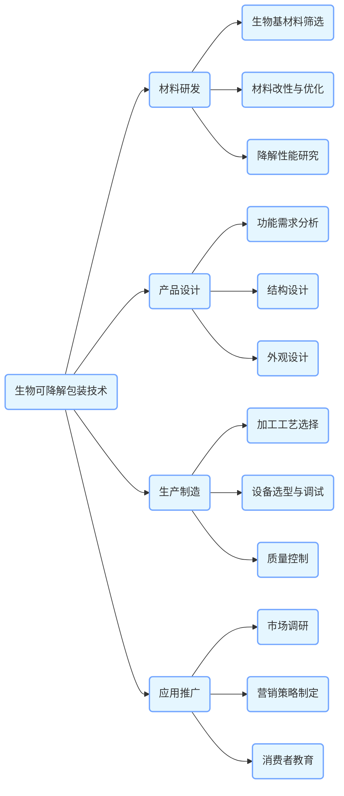

# 价值投资中的新一代生物可降解包装技术

> 关键词：价值投资、生物可降解包装技术、可持续发展、环保材料、市场趋势、技术创新、投资潜力

> 摘要：本文聚焦于价值投资视角下的新一代生物可降解包装技术。在全球环保意识不断提升的背景下，生物可降解包装技术正成为包装行业的重要发展方向。文章深入探讨了该技术的核心概念、算法原理、数学模型，通过项目实战案例详细展示其实现过程，分析了其实际应用场景，并推荐了相关的学习资源、开发工具和论文著作。最后总结了其未来发展趋势与挑战，旨在为投资者和技术从业者提供全面且深入的参考，助力他们把握新一代生物可降解包装技术带来的价值投资机遇。

## 1. 背景介绍 
### 1.1 目的和范围
本文章的主要目的是全面且深入地介绍新一代生物可降解包装技术，从价值投资的角度剖析其技术原理、市场潜力以及未来发展趋势。范围涵盖该技术的基本概念、核心算法、数学模型、实际应用案例，同时探讨与之相关的学习资源、开发工具和研究成果，为投资者、技术开发者以及对环保包装行业感兴趣的人士提供有价值的参考信息。

### 1.2 预期读者
本文预期读者包括但不限于以下几类人群：
- **投资者**：寻求具有长期价值和增长潜力的投资领域，希望了解生物可降解包装技术的市场前景和投资机会。
- **技术开发者**：从事包装材料研发、生物技术、高分子材料等相关领域的专业人员，对新一代生物可降解包装技术的原理和实现方法感兴趣。
- **行业从业者**：包装行业的企业管理人员、市场营销人员等，希望了解行业最新动态和技术趋势，以指导企业的发展战略。
- **环保人士**：关注环境保护和可持续发展，对生物可降解包装技术在减少环境污染方面的作用感兴趣。
- **科研人员**：从事相关领域研究的学者和科研人员，希望获取该技术的最新研究成果和发展方向。

### 1.3 文档结构概述
本文将按照以下结构展开：
- **核心概念与联系**：介绍生物可降解包装技术的基本概念、原理和架构，通过文本示意图和 Mermaid 流程图进行直观展示。
- **核心算法原理 & 具体操作步骤**：详细讲解生物可降解包装材料制备过程中涉及的核心算法原理，并使用 Python 源代码进行阐述。
- **数学模型和公式 & 详细讲解 & 举例说明**：建立相关的数学模型，推导数学公式，并通过具体例子进行说明。
- **项目实战：代码实际案例和详细解释说明**：通过实际项目案例，介绍开发环境搭建、源代码实现和代码解读。
- **实际应用场景**：分析生物可降解包装技术在不同行业的实际应用场景。
- **工具和资源推荐**：推荐学习资源、开发工具框架和相关论文著作。
- **总结：未来发展趋势与挑战**：总结生物可降解包装技术的未来发展趋势，并分析面临的挑战。
- **附录：常见问题与解答**：解答读者在阅读过程中可能遇到的常见问题。
- **扩展阅读 & 参考资料**：提供进一步阅读的相关资料和参考文献。

### 1.4 术语表
#### 1.4.1 核心术语定义
- **生物可降解包装技术**：指利用天然高分子材料或经过改性的生物基材料制备包装材料，这些材料在自然环境中能够被微生物分解为无害物质的技术。
- **生物基材料**：来源于可再生生物质资源，如植物、动物和微生物等的材料。
- **降解率**：衡量生物可降解材料在一定条件下分解程度的指标，通常以质量损失的百分比表示。
- **堆肥化**：一种生物处理过程，在适宜的温度、湿度和通风条件下，微生物将有机物质分解为腐殖质的过程。

#### 1.4.2 相关概念解释
- **可持续发展**：既满足当代人的需求，又不损害后代人满足其需求的能力的发展模式。生物可降解包装技术是实现包装行业可持续发展的重要手段。
- **绿色包装**：对生态环境和人类健康无害，能重复使用和再生，符合可持续发展的包装。生物可降解包装是绿色包装的重要组成部分。
- **循环经济**：以资源的高效利用和循环利用为核心，以“减量化、再利用、资源化”为原则的经济发展模式。生物可降解包装技术有助于推动包装行业向循环经济模式转变。

#### 1.4.3 缩略词列表
- **PLA**：聚乳酸（Polylactic Acid）
- **PHA**：聚羟基脂肪酸酯（Polyhydroxyalkanoates）
- **PBS**：聚丁二酸丁二醇酯（Polybutylene Succinate）

## 2. 核心概念与联系 

### 生物可降解包装技术的基本原理
生物可降解包装技术的核心在于利用生物基材料或可降解高分子材料制备包装产品。这些材料在自然环境中能够被微生物（如细菌、真菌等）分解为二氧化碳、水和其他无害物质，从而减少对环境的污染。

生物可降解包装材料的降解过程通常包括以下几个阶段：
1. **水解**：材料在水的作用下发生化学分解，分子链断裂，形成较小的分子片段。
2. **微生物作用**：微生物分泌的酶能够特异性地识别和分解这些分子片段，将其转化为微生物细胞的营养物质。
3. **矿化**：微生物将吸收的营养物质进一步代谢，最终转化为二氧化碳、水和无机盐等无机物质。

### 生物可降解包装技术的架构
生物可降解包装技术的架构主要包括材料研发、产品设计、生产制造和应用推广等环节。

- **材料研发**：研究和开发新型的生物可降解材料，通过对材料的结构和性能进行调控，提高材料的降解性能、力学性能和加工性能。
- **产品设计**：根据不同的应用需求，设计合适的包装产品结构和形状，确保包装产品能够满足保护商品、方便使用和展示等功能要求。
- **生产制造**：采用合适的加工工艺，将生物可降解材料加工成各种包装产品，如薄膜、容器、泡沫等。
- **应用推广**：将生物可降解包装产品推广到市场，提高消费者对生物可降解包装的认知度和接受度，促进生物可降解包装技术的广泛应用。

### 文本示意图
```plaintext
生物可降解包装技术架构
|-- 材料研发
|   |-- 生物基材料筛选
|   |-- 材料改性与优化
|   |-- 降解性能研究
|-- 产品设计
|   |-- 功能需求分析
|   |-- 结构设计
|   |-- 外观设计
|-- 生产制造
|   |-- 加工工艺选择
|   |-- 设备选型与调试
|   |-- 质量控制
|-- 应用推广
|   |-- 市场调研
|   |-- 营销策略制定
|   |-- 消费者教育
```

### Mermaid 流程图


## 3. 核心算法原理 & 具体操作步骤 

### 核心算法原理
在生物可降解包装材料的研发过程中，常常需要对材料的降解性能进行预测和优化。其中一个重要的算法是基于动力学模型的降解速率预测算法。

该算法的基本原理是根据材料的化学结构、环境条件（如温度、湿度、微生物种类等），建立材料降解的动力学方程，通过求解动力学方程来预测材料的降解速率和降解程度。

以聚乳酸（PLA）的水解降解为例，其水解反应可以用以下动力学方程描述：

$\frac{d[PLA]}{dt} = -k[PLA]^n$

其中，$[PLA]$ 表示聚乳酸的浓度，$t$ 表示时间，$k$ 是反应速率常数，$n$ 是反应级数。

### 具体操作步骤
#### 步骤 1：确定反应参数
通过实验测定反应速率常数 $k$ 和反应级数 $n$。可以采用不同的实验方法，如重量法、光谱法等，测量不同时间点聚乳酸的浓度变化，然后通过数据拟合得到 $k$ 和 $n$ 的值。

#### 步骤 2：建立动力学方程
根据确定的反应参数，建立聚乳酸水解降解的动力学方程。

#### 步骤 3：求解动力学方程
使用数值方法（如欧拉法、龙格 - 库塔法等）求解动力学方程，得到聚乳酸浓度随时间的变化曲线。

### Python 源代码实现
```python
import numpy as np
import matplotlib.pyplot as plt

# 定义反应参数
k = 0.01  # 反应速率常数
n = 1     # 反应级数
initial_concentration = 1.0  # 初始浓度
time_points = np.linspace(0, 100, 1000)  # 时间点

# 定义欧拉法求解函数
def euler_method(k, n, initial_concentration, time_points):
    concentration = np.zeros_like(time_points)
    concentration[0] = initial_concentration
    dt = time_points[1] - time_points[0]
    for i in range(1, len(time_points)):
        d_concentration = -k * concentration[i - 1]**n * dt
        concentration[i] = concentration[i - 1] + d_concentration
    return concentration

# 求解动力学方程
concentration = euler_method(k, n, initial_concentration, time_points)

# 绘制浓度随时间的变化曲线
plt.plot(time_points, concentration)
plt.xlabel('Time')
plt.ylabel('Concentration')
plt.title('PLA Hydrolysis Degradation')
plt.show()
```

### 代码解释
- 首先，定义了反应参数 $k$、$n$ 和初始浓度。
- 然后，使用 `np.linspace` 函数生成时间点。
- 接着，定义了欧拉法求解函数 `euler_method`，该函数根据动力学方程的差分形式，逐步计算每个时间点的浓度。
- 最后，调用 `euler_method` 函数求解动力学方程，并使用 `matplotlib` 库绘制浓度随时间的变化曲线。

## 4. 数学模型和公式 & 详细讲解 & 举例说明 

### 数学模型
在生物可降解包装材料的降解过程中，除了上述的动力学模型外，还可以建立质量传递模型来描述材料内部和外部环境之间的物质交换过程。

考虑一个简单的一维质量传递模型，假设材料内部的溶质浓度为 $C(x, t)$，其中 $x$ 表示空间位置，$t$ 表示时间。材料表面与外部环境之间的质量传递遵循菲克定律：

$\frac{\partial C}{\partial t} = D\frac{\partial^2 C}{\partial x^2}$

其中，$D$ 是扩散系数。

### 边界条件和初始条件
为了求解上述偏微分方程，需要给定边界条件和初始条件。

- **初始条件**：$C(x, 0) = C_0$，表示材料内部初始溶质浓度为 $C_0$。
- **边界条件**：$C(0, t) = C_{ext}$，表示材料表面的溶质浓度与外部环境浓度 $C_{ext}$ 相等。

### 求解方法
可以使用分离变量法求解上述偏微分方程。假设 $C(x, t) = X(x)T(t)$，代入偏微分方程得到：

$\frac{1}{D}\frac{T'(t)}{T(t)} = \frac{X''(x)}{X(x)} = -\lambda^2$

其中，$\lambda$ 是分离常数。

分别求解关于 $X(x)$ 和 $T(t)$ 的常微分方程：

- $X''(x) + \lambda^2 X(x) = 0$，其通解为 $X(x) = A\cos(\lambda x) + B\sin(\lambda x)$。
- $T'(t) + D\lambda^2 T(t) = 0$，其通解为 $T(t) = Ce^{-D\lambda^2 t}$。

根据边界条件和初始条件确定常数 $A$、$B$、$C$ 和 $\lambda$ 的值，从而得到 $C(x, t)$ 的表达式。

### 举例说明
假设材料厚度为 $L$，初始溶质浓度 $C_0 = 1$，外部环境浓度 $C_{ext} = 0$，扩散系数 $D = 1$。

根据边界条件 $C(0, t) = 0$ 和 $C(L, t) = 0$，可以得到 $\lambda_n = \frac{n\pi}{L}$，$n = 1, 2, 3, \cdots$。

将 $\lambda_n$ 代入 $X(x)$ 和 $T(t)$ 的表达式，得到：

$C(x, t) = \sum_{n = 1}^{\infty} B_n\sin(\frac{n\pi x}{L})e^{-(\frac{n\pi}{L})^2t}$

根据初始条件 $C(x, 0) = 1$，可以确定系数 $B_n$ 的值：

$B_n = \frac{2}{L}\int_0^L 1\cdot\sin(\frac{n\pi x}{L})dx = \frac{2}{n\pi}(1 - (-1)^n)$

因此，溶质浓度的表达式为：

$C(x, t) = \sum_{n = 1}^{\infty} \frac{2}{n\pi}(1 - (-1)^n)\sin(\frac{n\pi x}{L})e^{-(\frac{n\pi}{L})^2t}$

## 5. 项目实战：代码实际案例和详细解释说明 

### 5.1  开发环境搭建
#### 硬件环境
- **计算机**：建议使用配置较高的计算机，如 Intel Core i7 及以上处理器，16GB 及以上内存，512GB 及以上固态硬盘。
- **服务器**：如果需要进行大规模的数据处理和模型训练，可以考虑使用云服务器，如 Amazon Web Services (AWS)、Google Cloud Platform (GCP) 或 Microsoft Azure。

#### 软件环境
- **操作系统**：推荐使用 Linux 操作系统，如 Ubuntu 18.04 或更高版本。
- **编程语言**：Python 3.7 及以上版本。
- **开发工具**：Anaconda 或 Miniconda 用于管理 Python 环境和安装依赖库，PyCharm 或 Visual Studio Code 作为集成开发环境（IDE）。
- **依赖库**：NumPy、SciPy、Matplotlib、Pandas 等用于数值计算、数据分析和可视化，Scikit-learn 用于机器学习模型训练。

### 5.2  源代码详细实现和代码解读
#### 项目背景
本项目旨在开发一个生物可降解包装材料性能预测系统，根据材料的化学组成、加工工艺等参数，预测材料的降解性能、力学性能等。

#### 数据准备
首先，收集生物可降解包装材料的相关数据，包括材料的化学组成、加工工艺参数、性能测试结果等。将数据整理成 CSV 文件，存储在本地或服务器上。

```python
import pandas as pd

# 读取数据
data = pd.read_csv('biodegradable_packaging_data.csv')

# 数据预处理
# 处理缺失值
data = data.dropna()

# 分离特征和标签
X = data.drop('degradation_rate', axis=1)
y = data['degradation_rate']
```

#### 特征工程
对特征进行编码和标准化处理，以提高模型的性能。

```python
from sklearn.preprocessing import OneHotEncoder, StandardScaler
from sklearn.compose import ColumnTransformer

# 定义分类特征和数值特征
categorical_features = X.select_dtypes(include=['object']).columns
numerical_features = X.select_dtypes(include=['number']).columns

# 定义特征转换管道
preprocessor = ColumnTransformer(
    transformers=[
        ('cat', OneHotEncoder(), categorical_features),
        ('num', StandardScaler(), numerical_features)
    ])

# 转换特征
X_transformed = preprocessor.fit_transform(X)
```

#### 模型训练
选择合适的机器学习模型，如线性回归、决策树、随机森林等，进行模型训练。

```python
from sklearn.model_selection import train_test_split
from sklearn.linear_model import LinearRegression
from sklearn.metrics import mean_squared_error

# 划分训练集和测试集
X_train, X_test, y_train, y_test = train_test_split(X_transformed, y, test_size=0.2, random_state=42)

# 训练线性回归模型
model = LinearRegression()
model.fit(X_train, y_train)

# 模型预测
y_pred = model.predict(X_test)

# 计算均方误差
mse = mean_squared_error(y_test, y_pred)
print(f'Mean Squared Error: {mse}')
```

### 5.3  代码解读与分析
- **数据准备**：使用 `pandas` 库读取 CSV 文件，并处理缺失值。将特征和标签分离，以便后续的模型训练。
- **特征工程**：使用 `ColumnTransformer` 对分类特征进行独热编码，对数值特征进行标准化处理，以提高模型的性能。
- **模型训练**：使用 `train_test_split` 函数将数据集划分为训练集和测试集，然后使用 `LinearRegression` 模型进行训练。最后，使用 `mean_squared_error` 函数计算模型的均方误差，评估模型的性能。

## 6. 实际应用场景 
### 食品包装
生物可降解包装技术在食品包装领域具有广阔的应用前景。传统的食品包装材料如塑料薄膜、泡沫塑料等难以降解，会对环境造成严重污染。而生物可降解包装材料如聚乳酸（PLA）、淀粉基材料等具有良好的生物相容性和降解性能，可以用于食品的保鲜、包装和运输。

例如，聚乳酸薄膜可以用于包装水果、蔬菜、肉类等食品，具有良好的阻隔性能和保鲜效果。淀粉基材料可以制成食品包装盒、餐具等，在使用后可以自然降解，不会对环境造成污染。

### 医药包装
医药包装对材料的安全性和稳定性要求较高。生物可降解包装材料具有良好的生物相容性和安全性，可以用于医药产品的包装。

例如，聚羟基脂肪酸酯（PHA）具有良好的生物降解性和生物相容性，可以用于制备药物缓释微球、胶囊等医药包装材料。这些材料在体内可以逐渐降解，释放药物，提高药物的疗效和安全性。

### 电子包装
随着电子产业的快速发展，电子包装材料的需求量也越来越大。传统的电子包装材料如塑料泡沫、纸箱等难以降解，会对环境造成严重污染。而生物可降解包装材料如纸质纤维、生物基泡沫等可以用于电子产品的包装。

例如，纸质纤维材料可以制成电子设备的包装盒、缓冲垫等，具有良好的缓冲性能和环保性能。生物基泡沫材料可以替代传统的塑料泡沫，用于电子设备的防震包装。

### 快递包装
快递行业的快速发展带来了大量的包装废弃物。生物可降解包装技术可以用于快递包装，减少包装废弃物对环境的污染。

例如，生物基薄膜可以用于快递包裹的外包装，纸质材料可以用于制作快递纸箱。这些材料在使用后可以自然降解，不会对环境造成长期影响。

## 7. 工具和资源推荐
### 7.1 学习资源推荐
#### 7.1.1 书籍推荐
- 《生物可降解高分子材料》：全面介绍了生物可降解高分子材料的分类、合成、性能和应用，是学习生物可降解包装技术的重要参考书籍。
- 《包装材料学》：系统阐述了各种包装材料的性能、特点和应用，对了解生物可降解包装材料在包装行业中的应用有很大帮助。
- 《绿色包装技术》：介绍了绿色包装的概念、技术和发展趋势，对生物可降解包装技术的研究和应用具有指导意义。

#### 7.1.2 在线课程
- Coursera 上的“Biodegradable Polymers and Sustainable Materials”：由知名高校教授授课，深入讲解生物可降解聚合物和可持续材料的相关知识。
- edX 上的“Packaging Science and Technology”：介绍包装科学和技术的基本原理和应用，包括生物可降解包装技术的内容。
- 中国大学 MOOC 上的“高分子材料科学与工程”：系统介绍高分子材料的合成、结构、性能和应用，对理解生物可降解包装材料的原理有很大帮助。

#### 7.1.3 技术博客和网站
- 中国包装联合会官网：提供包装行业的最新动态、政策法规和技术信息，对了解生物可降解包装技术的发展趋势有很大帮助。
- 生物基材料产业技术创新战略联盟官网：专注于生物基材料的研究和应用，发布生物可降解包装技术的最新研究成果和应用案例。
- 材料人网：提供材料科学领域的技术文章、研究进展和行业资讯，对学习生物可降解包装技术有一定的参考价值。

### 7.2 开发工具框架推荐
#### 7.2.1 IDE和编辑器
- PyCharm：功能强大的 Python 集成开发环境，具有代码编辑、调试、版本控制等功能，适合生物可降解包装技术相关的 Python 代码开发。
- Visual Studio Code：轻量级的代码编辑器，支持多种编程语言，具有丰富的插件扩展功能，可用于生物可降解包装技术的代码开发和文本编辑。
- Jupyter Notebook：交互式的编程环境，适合进行数据分析、模型训练和可视化展示，可用于生物可降解包装材料性能预测模型的开发和验证。

#### 7.2.2 调试和性能分析工具
- Py-Spy：用于分析 Python 代码的性能，找出代码中的性能瓶颈，提高代码的执行效率。
- Memory Profiler：用于分析 Python 代码的内存使用情况，帮助开发者优化内存占用，提高代码的性能。
- TensorBoard：用于可视化深度学习模型的训练过程和性能指标，可用于生物可降解包装材料性能预测模型的训练和评估。

#### 7.2.3 相关框架和库
- NumPy：用于数值计算和数组操作，是生物可降解包装技术相关数据处理和模型训练的基础库。
- Pandas：用于数据分析和数据处理，提供了高效的数据结构和数据操作方法，可用于生物可降解包装材料数据的整理和分析。
- Scikit-learn：用于机器学习模型的训练和评估，提供了丰富的机器学习算法和工具，可用于生物可降解包装材料性能预测模型的开发。
- TensorFlow 和 PyTorch：用于深度学习模型的开发和训练，可用于处理复杂的生物可降解包装材料数据和建立高性能的预测模型。

### 7.3 相关论文著作推荐
#### 7.3.1 经典论文
- “Biodegradable Polymers for Sustainable Packaging: A Review”：全面综述了生物可降解聚合物在可持续包装领域的研究进展和应用前景。
- “Synthesis and Properties of Biodegradable Polymers”：详细介绍了生物可降解聚合物的合成方法和性能特点，对理解生物可降解包装材料的原理有重要意义。
- “Environmental Impact of Biodegradable Packaging Materials”：分析了生物可降解包装材料对环境的影响，为生物可降解包装技术的发展提供了理论依据。

#### 7.3.2 最新研究成果
- 关注《Journal of Biodegradable and Sustainable Polymers》、《Packaging Technology and Science》等学术期刊，了解生物可降解包装技术的最新研究成果。
- 参加国际生物基材料与降解塑料学术研讨会、中国包装学术会议等学术会议，获取生物可降解包装技术的最新研究动态。

#### 7.3.3 应用案例分析
- 研究国内外生物可降解包装技术的应用案例，如可口可乐公司的生物基塑料瓶、雀巢公司的生物可降解咖啡胶囊等，了解生物可降解包装技术在实际应用中的优势和挑战。
- 分析一些成功的生物可降解包装产品的市场推广策略和消费者反馈，为生物可降解包装技术的应用和推广提供参考。

## 8. 总结：未来发展趋势与挑战
### 未来发展趋势
- **材料性能不断提升**：随着材料科学和生物技术的不断发展，生物可降解包装材料的性能将不断提升，如提高材料的力学性能、阻隔性能和降解性能，满足更多领域的应用需求。
- **多元化应用**：生物可降解包装技术将在更多领域得到应用，如农业、化妆品、玩具等，市场需求将不断扩大。
- **与其他技术融合**：生物可降解包装技术将与智能包装技术、纳米技术等其他技术融合，开发出具有更多功能的包装产品，如智能监测包装、抗菌包装等。
- **产业规模化发展**：随着生物可降解包装技术的不断成熟和市场需求的增加，相关产业将实现规模化发展，降低生产成本，提高市场竞争力。

### 挑战
- **成本较高**：目前生物可降解包装材料的生产成本相对较高，限制了其大规模应用。需要进一步研发低成本的生产工艺和原材料，降低生产成本。
- **性能稳定性**：生物可降解包装材料的性能受环境因素影响较大，如温度、湿度等，其性能稳定性有待提高。需要加强对材料性能的研究和控制，提高材料的稳定性和可靠性。
- **标准和规范不完善**：目前生物可降解包装材料的标准和规范还不完善，市场上存在一些质量参差不齐的产品。需要加快制定和完善相关标准和规范，加强市场监管。
- **消费者认知度和接受度**：部分消费者对生物可降解包装的认知度和接受度较低，更倾向于选择传统包装产品。需要加强消费者教育，提高消费者对生物可降解包装的认知度和接受度。

## 9. 附录：常见问题与解答
### 问题 1：生物可降解包装材料在自然环境中的降解时间是多久？
生物可降解包装材料的降解时间受多种因素影响，如材料种类、环境条件（温度、湿度、微生物种类等）。一般来说，在适宜的环境条件下，一些常见的生物可降解材料如聚乳酸（PLA）的降解时间可能在几个月到几年不等。

### 问题 2：生物可降解包装材料的性能是否能满足实际应用需求？
随着技术的不断发展，生物可降解包装材料的性能不断提升，已经能够满足很多领域的实际应用需求。例如，在食品包装领域，生物可降解包装材料具有良好的阻隔性能和保鲜效果；在电子包装领域，生物可降解包装材料具有良好的缓冲性能和防震效果。

### 问题 3：生物可降解包装材料的生产过程是否环保？
生物可降解包装材料的生产过程相对传统包装材料更加环保。许多生物可降解材料来源于可再生生物质资源，生产过程中消耗的能源和产生的污染物相对较少。同时，生物可降解材料在使用后可以自然降解，不会对环境造成长期污染。

### 问题 4：如何判断一种包装材料是否是生物可降解的？
可以通过以下几种方法判断一种包装材料是否是生物可降解的：
- **查看产品标识**：一些生物可降解包装产品会在包装上标注相关标识，如“可堆肥”、“生物可降解”等。
- **进行降解实验**：将包装材料放置在特定的环境条件下，观察其降解情况。
- **检测材料成分**：通过分析材料的化学成分，判断其是否为生物可降解材料。

## 10. 扩展阅读 & 参考资料
### 扩展阅读
- 《循环经济与绿色发展》：深入探讨循环经济的理论和实践，对理解生物可降解包装技术在循环经济中的作用有很大帮助。
- 《可持续发展的包装设计》：介绍可持续发展的包装设计理念和方法，对生物可降解包装产品的设计有一定的参考价值。
- 《生物技术前沿》：关注生物技术的最新发展动态，了解生物技术在生物可降解包装材料研发中的应用前景。

### 参考资料
- 相关学术论文、研究报告和行业标准。
- 国内外生物可降解包装技术相关企业的官方网站和产品资料。
- 政府部门发布的关于环境保护和可持续发展的政策文件。