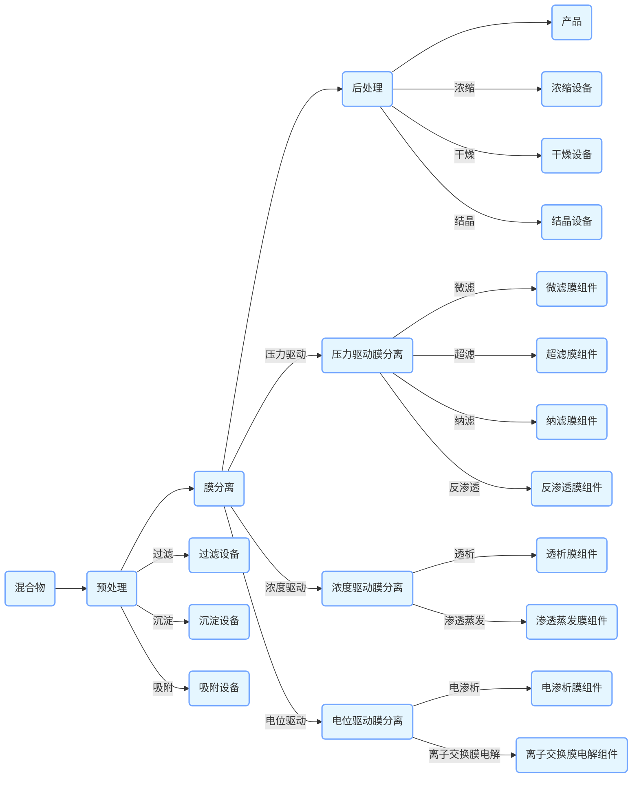

# 价值投资中的新型高效膜分离技术前景

> 关键词：价值投资、新型高效膜分离技术、市场前景、技术原理、应用场景

> 摘要：本文聚焦于价值投资领域中新型高效膜分离技术的前景。首先介绍了膜分离技术的背景知识，包括其目的、适用读者、文档结构和相关术语。接着阐述了核心概念与联系，剖析了核心算法原理并给出 Python 代码示例，同时对数学模型和公式进行了详细讲解与举例。通过项目实战，展示了该技术在实际开发中的应用，包括环境搭建、代码实现与解读。分析了新型高效膜分离技术的实际应用场景，推荐了相关的学习资源、开发工具和论文著作。最后总结了该技术未来的发展趋势与挑战，并提供了常见问题解答和扩展阅读资料，旨在为价值投资者和相关从业者提供全面且深入的参考。

## 1. 背景介绍 
### 1.1 目的和范围
膜分离技术作为一种新型的分离技术，在多个领域展现出了巨大的应用潜力。本文的目的在于深入探讨价值投资视角下新型高效膜分离技术的前景，涵盖该技术的原理、应用、市场现状以及未来发展趋势等方面。通过对这些内容的研究，为投资者提供决策依据，帮助他们了解该技术的投资价值和潜在风险。同时，也为相关技术人员和研究人员提供一个全面的参考，促进该技术的进一步发展和应用。

### 1.2 预期读者
本文预期读者包括价值投资者、金融分析师、膜分离技术领域的研究人员、工程师以及对新兴技术投资感兴趣的人士。对于投资者来说，本文可以帮助他们评估新型高效膜分离技术的投资价值和前景；对于研究人员和工程师，本文提供了该技术的最新进展和应用案例，有助于他们开展相关的研究和开发工作；对于金融分析师，本文可以作为他们进行行业分析和投资建议的参考资料。

### 1.3 文档结构概述
本文将按照以下结构进行阐述：首先介绍膜分离技术的核心概念与联系，包括其原理、架构和流程；接着详细讲解核心算法原理和具体操作步骤，并给出 Python 代码示例；然后介绍该技术的数学模型和公式，并通过具体例子进行说明；之后通过项目实战，展示该技术在实际开发中的应用，包括开发环境搭建、源代码实现和代码解读；分析新型高效膜分离技术的实际应用场景；推荐相关的学习资源、开发工具和论文著作；最后总结该技术未来的发展趋势与挑战，提供常见问题解答和扩展阅读资料。

### 1.4 术语表
#### 1.4.1 核心术语定义
- **膜分离技术**：是一种利用具有选择透过性的薄膜，以压力差、浓度差、电位差等为驱动力，对混合物进行分离、提纯和浓缩的技术。
- **新型高效膜**：指具有更高分离效率、更好化学稳定性、更长使用寿命等优异性能的膜材料或膜组件。
- **价值投资**：一种基于对资产内在价值的评估，以低于内在价值的价格买入资产，并长期持有的投资策略。

#### 1.4.2 相关概念解释
- **膜的截留分子量**：指膜对不同分子量物质的截留能力，通常用截留一定比例（如 90%）的某种分子量物质来表示。
- **膜的通量**：指单位时间内通过单位面积膜的物质的量，是衡量膜分离效率的重要指标之一。
- **膜的选择性**：指膜对不同物质的透过能力的差异，选择性越高，膜对目标物质的分离效果越好。

#### 1.4.3 缩略词列表
- **RO**：Reverse Osmosis，反渗透
- **UF**：Ultrafiltration，超滤
- **NF**：Nanofiltration，纳滤
- **MF**：Microfiltration，微滤

## 2. 核心概念与联系 

### 2.1 膜分离技术的原理
膜分离技术的基本原理是利用膜的选择透过性，使混合物中的不同组分在膜两侧的驱动力作用下，以不同的速率透过膜，从而实现分离、提纯和浓缩的目的。根据驱动力的不同，膜分离技术可以分为压力驱动膜分离、浓度驱动膜分离、电位驱动膜分离等。

#### 压力驱动膜分离
压力驱动膜分离是最常见的膜分离方式，包括微滤（MF）、超滤（UF）、纳滤（NF）和反渗透（RO）。在压力驱动膜分离过程中，混合物在压力作用下通过膜，小分子物质和溶剂可以透过膜，而大分子物质和颗粒则被截留。

#### 浓度驱动膜分离
浓度驱动膜分离主要包括透析和渗透蒸发。透析是利用膜两侧的浓度差，使小分子物质从高浓度一侧向低浓度一侧扩散透过膜；渗透蒸发是利用膜对不同组分的溶解和扩散性能的差异，使混合物中的易挥发组分在膜的一侧蒸发，透过膜后在另一侧冷凝，从而实现分离。

#### 电位驱动膜分离
电位驱动膜分离主要包括电渗析和离子交换膜电解。电渗析是利用离子交换膜对阴阳离子的选择透过性，在电场作用下，使溶液中的阴阳离子分别向两极移动，从而实现离子的分离；离子交换膜电解是在电解过程中，利用离子交换膜将阴阳极室隔开，使离子在电场作用下定向移动，同时进行化学反应。

### 2.2 膜分离技术的架构
膜分离技术的架构主要包括膜组件、膜分离器和辅助设备。

#### 膜组件
膜组件是膜分离技术的核心部件，它是由膜、支撑体和外壳组成的一个独立单元。常见的膜组件形式有平板式、管式、螺旋卷式和中空纤维式等。

#### 膜分离器
膜分离器是将膜组件组装在一起，形成一个完整的分离系统。膜分离器的设计和选型要根据具体的应用需求和处理规模来确定。

#### 辅助设备
辅助设备包括泵、阀门、流量计、压力表等，它们的作用是为膜分离过程提供必要的动力、控制和监测。

### 2.3 膜分离技术的流程
膜分离技术的流程一般包括预处理、膜分离和后处理三个阶段。

#### 预处理
预处理的目的是去除混合物中的大颗粒杂质、悬浮物、胶体等，以保护膜组件，延长膜的使用寿命。常见的预处理方法有过滤、沉淀、吸附等。

#### 膜分离
膜分离是整个流程的核心环节，根据不同的分离要求和膜的类型，选择合适的膜分离方式和操作条件，实现混合物的分离、提纯和浓缩。

#### 后处理
后处理的目的是对膜分离后的产品进行进一步的处理和精制，以满足产品的质量要求。常见的后处理方法有浓缩、干燥、结晶等。

### 2.4 核心概念的文本示意图
以下是膜分离技术核心概念的文本示意图：

膜分离技术
|-- 原理
|   |-- 压力驱动膜分离
|   |   |-- 微滤（MF）
|   |   |-- 超滤（UF）
|   |   |-- 纳滤（NF）
|   |   |-- 反渗透（RO）
|   |-- 浓度驱动膜分离
|   |   |-- 透析
|   |   |-- 渗透蒸发
|   |-- 电位驱动膜分离
|   |   |-- 电渗析
|   |   |-- 离子交换膜电解
|-- 架构
|   |-- 膜组件
|   |   |-- 平板式
|   |   |-- 管式
|   |   |-- 螺旋卷式
|   |   |-- 中空纤维式
|   |-- 膜分离器
|   |-- 辅助设备
|       |-- 泵
|       |-- 阀门
|       |-- 流量计
|       |-- 压力表
|-- 流程
|   |-- 预处理
|   |   |-- 过滤
|   |   |-- 沉淀
|   |   |-- 吸附
|   |-- 膜分离
|   |-- 后处理
|       |-- 浓缩
|       |-- 干燥
|       |-- 结晶

### 2.5 Mermaid 流程图


## 3. 核心算法原理 & 具体操作步骤 

### 3.1 压力驱动膜分离的核心算法原理
在压力驱动膜分离过程中，膜的通量可以用 Hagen - Poiseuille 方程来描述。对于多孔膜，其通量 $J$ 可以表示为：

$J = \frac{\varepsilon r^2 \Delta P}{8 \mu \tau \delta}$

其中，$\varepsilon$ 是膜的孔隙率，$r$ 是膜孔的半径，$\Delta P$ 是膜两侧的压力差，$\mu$ 是流体的黏度，$\tau$ 是膜的曲折因子，$\delta$ 是膜的厚度。

### 3.2 具体操作步骤
#### 步骤 1：确定分离目标和要求
根据混合物的性质和分离要求，确定需要分离的组分、分离的纯度和回收率等目标。

#### 步骤 2：选择合适的膜和膜组件
根据分离目标和要求，选择合适的膜类型和膜组件形式。例如，如果需要分离大分子物质，可以选择超滤膜；如果需要分离小分子物质和离子，可以选择反渗透膜。

#### 步骤 3：设计膜分离系统
根据处理规模和操作条件，设计膜分离系统的架构和流程，包括膜组件的数量、排列方式、操作压力、温度等。

#### 步骤 4：进行预处理
对混合物进行预处理，去除其中的大颗粒杂质、悬浮物、胶体等，以保护膜组件。

#### 步骤 5：进行膜分离操作
将预处理后的混合物送入膜分离系统，在一定的操作条件下进行膜分离操作，收集透过液和截留液。

#### 步骤 6：进行后处理
对膜分离后的产品进行后处理，如浓缩、干燥、结晶等，以满足产品的质量要求。

### 3.3 Python 代码示例
以下是一个简单的 Python 代码示例，用于计算压力驱动膜分离过程中的膜通量：

```python
import math

# 定义参数
epsilon = 0.3  # 膜的孔隙率
r = 1e-7  # 膜孔的半径（m）
delta_P = 1e6  # 膜两侧的压力差（Pa）
mu = 1e-3  # 流体的黏度（Pa·s）
tau = 2  # 膜的曲折因子
delta = 1e-4  # 膜的厚度（m）

# 计算膜通量
J = (epsilon * r**2 * delta_P) / (8 * mu * tau * delta)

print(f"膜通量 J = {J} m/s")
```

### 3.4 代码解释
- 首先，导入 `math` 模块，虽然在这个示例中没有使用到 `math` 模块的功能，但在实际应用中可能会用到。
- 然后，定义了膜的孔隙率 `epsilon`、膜孔的半径 `r`、膜两侧的压力差 `delta_P`、流体的黏度 `mu`、膜的曲折因子 `tau` 和膜的厚度 `delta` 等参数。
- 接着，根据 Hagen - Poiseuille 方程计算膜通量 `J`。
- 最后，使用 `print` 函数输出计算结果。

## 4. 数学模型和公式 & 详细讲解 & 举例说明 

### 4.1 压力驱动膜分离的数学模型
#### 膜通量模型
如前面所述，对于多孔膜，膜通量 $J$ 可以用 Hagen - Poiseuille 方程来描述：

$J = \frac{\varepsilon r^2 \Delta P}{8 \mu \tau \delta}$

这个方程表明，膜通量与膜的孔隙率、膜孔半径的平方、膜两侧的压力差成正比，与流体的黏度、膜的曲折因子和膜的厚度成反比。

#### 截留率模型
截留率 $R$ 是衡量膜对目标物质截留能力的指标，定义为：

$R = 1 - \frac{C_p}{C_f}$

其中，$C_p$ 是透过液中目标物质的浓度，$C_f$ 是进料液中目标物质的浓度。

### 4.2 浓度驱动膜分离的数学模型
#### 透析过程的数学模型
在透析过程中，溶质的扩散通量 $J_d$ 可以用 Fick 第一定律来描述：

$J_d = -D \frac{dC}{dx}$

其中，$D$ 是溶质的扩散系数，$\frac{dC}{dx}$ 是溶质的浓度梯度。

#### 渗透蒸发过程的数学模型
渗透蒸发过程的通量 $J_{pv}$ 可以用以下公式来描述：

$J_{pv} = K (p_{v1} - p_{v2})$

其中，$K$ 是渗透蒸发系数，$p_{v1}$ 是进料侧易挥发组分的蒸汽压，$p_{v2}$ 是透过侧易挥发组分的蒸汽压。

### 4.3 电位驱动膜分离的数学模型
#### 电渗析过程的数学模型
在电渗析过程中，离子的迁移通量 $J_i$ 可以用 Nernst - Planck 方程来描述：

$J_i = -D_i \frac{dC_i}{dx} - \frac{z_i F D_i C_i}{RT} \frac{d\varphi}{dx} + C_i v$

其中，$D_i$ 是离子的扩散系数，$z_i$ 是离子的电荷数，$F$ 是法拉第常数，$R$ 是气体常数，$T$ 是温度，$\varphi$ 是电位，$v$ 是溶液的流速。

### 4.4 举例说明
#### 压力驱动膜分离举例
假设我们要使用超滤膜分离蛋白质溶液，已知膜的孔隙率 $\varepsilon = 0.2$，膜孔半径 $r = 5 \times 10^{-8}$ m，膜两侧的压力差 $\Delta P = 5 \times 10^5$ Pa，流体的黏度 $\mu = 1 \times 10^{-3}$ Pa·s，膜的曲折因子 $\tau = 1.5$，膜的厚度 $\delta = 1 \times 10^{-4}$ m。计算膜通量。

将上述参数代入 Hagen - Poiseuille 方程：

$J = \frac{\varepsilon r^2 \Delta P}{8 \mu \tau \delta}$

$J = \frac{0.2 \times (5 \times 10^{-8})^2 \times 5 \times 10^5}{8 \times 1 \times 10^{-3} \times 1.5 \times 1 \times 10^{-4}}$

$J = 2.08 \times 10^{-6}$ m/s

#### 截留率举例
假设进料液中蛋白质的浓度 $C_f = 10$ g/L，透过液中蛋白质的浓度 $C_p = 0.5$ g/L。计算截留率。

将上述参数代入截留率公式：

$R = 1 - \frac{C_p}{C_f}$

$R = 1 - \frac{0.5}{10}$

$R = 0.95$

即截留率为 95%。

## 5. 项目实战：代码实际案例和详细解释说明 

### 5.1  开发环境搭建
#### 操作系统
可以选择 Windows、Linux 或 macOS 等主流操作系统。这里以 Ubuntu 20.04 为例进行说明。

#### Python 安装
在 Ubuntu 20.04 上，可以使用以下命令安装 Python 3：

```bash
sudo apt update
sudo apt install python3 python3-pip
```

#### 必要的库安装
在本项目中，我们需要使用 `numpy` 和 `matplotlib` 等库。可以使用以下命令安装：

```bash
pip3 install numpy matplotlib
```

### 5.2  源代码详细实现和代码解读
#### 项目需求
我们要实现一个简单的压力驱动膜分离模拟程序，计算不同压力下的膜通量，并绘制通量 - 压力曲线。

#### 源代码实现
```python
import numpy as np
import matplotlib.pyplot as plt

# 定义参数
epsilon = 0.3  # 膜的孔隙率
r = 1e-7  # 膜孔的半径（m）
mu = 1e-3  # 流体的黏度（Pa·s）
tau = 2  # 膜的曲折因子
delta = 1e-4  # 膜的厚度（m）

# 定义压力范围
pressures = np.linspace(1e5, 5e5, 100)  # 压力从 1e5 Pa 到 5e5 Pa，共 100 个点

# 计算不同压力下的膜通量
fluxes = []
for P in pressures:
    J = (epsilon * r**2 * P) / (8 * mu * tau * delta)
    fluxes.append(J)

# 绘制通量 - 压力曲线
plt.plot(pressures, fluxes)
plt.xlabel('Pressure (Pa)')
plt.ylabel('Flux (m/s)')
plt.title('Membrane Flux vs Pressure')
plt.grid(True)
plt.show()
```

#### 代码解读
- **导入必要的库**：导入 `numpy` 和 `matplotlib.pyplot` 库，`numpy` 用于数值计算，`matplotlib.pyplot` 用于绘制图形。
- **定义参数**：定义膜的孔隙率 `epsilon`、膜孔半径 `r`、流体黏度 `mu`、膜的曲折因子 `tau` 和膜的厚度 `delta`。
- **定义压力范围**：使用 `np.linspace` 函数生成从 $1 \times 10^5$ Pa 到 $5 \times 10^5$ Pa 的 100 个压力点。
- **计算不同压力下的膜通量**：使用 `for` 循环遍历每个压力点，根据 Hagen - Poiseuille 方程计算膜通量，并将结果存储在 `fluxes` 列表中。
- **绘制通量 - 压力曲线**：使用 `plt.plot` 函数绘制通量 - 压力曲线，设置坐标轴标签和标题，添加网格线，并使用 `plt.show` 函数显示图形。

### 5.3  代码解读与分析
#### 代码优点
- **简单易懂**：代码结构清晰，逻辑简单，易于理解和修改。
- **可扩展性**：可以很容易地扩展代码，例如添加不同的膜参数、改变压力范围等。
- **可视化**：使用 `matplotlib` 库绘制通量 - 压力曲线，直观地展示了膜通量与压力之间的关系。

#### 代码局限性
- **简化模型**：代码中使用的是简化的 Hagen - Poiseuille 方程，没有考虑膜污染、浓差极化等实际因素的影响。
- **缺乏交互性**：代码只是简单地绘制了通量 - 压力曲线，没有提供用户交互功能，如输入不同的膜参数等。

## 6. 实际应用场景 
### 6.1 水处理领域
#### 海水淡化
反渗透膜分离技术是目前海水淡化的主要方法之一。通过高压泵将海水加压，使水分子透过反渗透膜，而盐分等杂质被截留，从而得到淡水。新型高效反渗透膜具有更高的脱盐率和通量，可以降低海水淡化的成本，提高生产效率。

#### 污水处理
超滤、纳滤和反渗透等膜分离技术可以用于污水处理，去除污水中的悬浮物、有机物、重金属离子等污染物。例如，超滤膜可以用于预处理，去除污水中的大颗粒杂质；反渗透膜可以用于深度处理，将污水中的盐分和小分子有机物去除，使污水达到回用标准。

### 6.2 食品和饮料工业
#### 果汁浓缩
渗透蒸发膜分离技术可以用于果汁浓缩，在低温下将果汁中的水分蒸发，透过膜后冷凝回收，从而实现果汁的浓缩。这种方法可以避免传统加热浓缩方法对果汁营养成分和风味的破坏。

#### 牛奶除菌
微滤膜分离技术可以用于牛奶除菌，通过微滤膜将牛奶中的细菌、酵母菌和霉菌等微生物截留，而保留牛奶中的营养成分和风味物质。这种方法可以延长牛奶的保质期，提高牛奶的质量。

### 6.3 生物医药领域
#### 蛋白质分离和纯化
超滤和纳滤膜分离技术可以用于蛋白质的分离和纯化。根据蛋白质的分子量大小，选择合适的膜截留分子量，将蛋白质与其他杂质分离。这种方法具有分离效率高、条件温和、不破坏蛋白质活性等优点。

#### 药物缓释
膜分离技术可以用于制备药物缓释制剂。例如，将药物包裹在具有一定孔径的膜材料中，药物可以通过膜的孔隙缓慢释放，从而实现药物的长效作用。

### 6.4 化工和石油工业
#### 有机溶剂回收
渗透蒸发膜分离技术可以用于有机溶剂回收，将有机溶剂与水或其他杂质分离。这种方法具有能耗低、回收率高、无污染等优点。

#### 气体分离
气体分离膜可以用于化工和石油工业中的气体分离，如氢气回收、二氧化碳捕集等。通过选择合适的膜材料和操作条件，可以实现不同气体的高效分离。

## 7. 工具和资源推荐
### 7.1 学习资源推荐
#### 7.1.1 书籍推荐
- 《膜分离技术基础》：这本书系统地介绍了膜分离技术的基本原理、膜材料、膜组件和膜过程等方面的知识，是学习膜分离技术的经典教材。
- 《膜科学与技术》：该书涵盖了膜科学与技术的最新研究成果和应用进展，适合对膜分离技术有一定基础的读者深入学习。
- 《膜分离工程》：主要介绍了膜分离技术在工程领域的应用，包括膜分离系统的设计、操作和优化等方面的内容。

#### 7.1.2 在线课程
- Coursera 平台上的“Membrane Separation Processes”课程：由知名高校的教授授课，讲解了膜分离技术的原理、应用和最新研究进展。
- edX 平台上的“Introduction to Membrane Technology”课程：适合初学者学习，介绍了膜分离技术的基本概念和常见的膜分离过程。

#### 7.1.3 技术博客和网站
- 膜分离技术网：提供了膜分离技术的最新资讯、研究成果、应用案例等内容，是了解膜分离技术行业动态的重要平台。
- 中国膜工业协会官网：发布了膜工业的相关政策、标准和行业报告，对了解膜分离技术的市场情况和发展趋势有很大帮助。

### 7.2 开发工具框架推荐
#### 7.2.1 IDE和编辑器
- PyCharm：是一款专业的 Python 集成开发环境，具有代码自动补全、调试、版本控制等功能，适合开发 Python 程序。
- Visual Studio Code：是一款轻量级的代码编辑器，支持多种编程语言，具有丰富的插件生态系统，可以方便地进行代码开发和调试。

#### 7.2.2 调试和性能分析工具
- Py-Spy：是一个用于分析 Python 程序性能的工具，可以实时显示程序的 CPU 使用率、函数调用时间等信息，帮助开发者找出性能瓶颈。
- PDB：是 Python 自带的调试器，可以在程序中设置断点，逐步执行代码，查看变量的值和程序的执行流程。

#### 7.2.3 相关框架和库
- NumPy：是 Python 中用于科学计算的基础库，提供了高效的数组操作和数学函数，在膜分离技术的数值计算中经常使用。
- Matplotlib：是 Python 中用于绘制图形的库，可以绘制各种类型的图表，如折线图、柱状图、散点图等，方便对膜分离实验数据进行可视化分析。

### 7.3 相关论文著作推荐
#### 7.3.1 经典论文
- “The solution - diffusion model: a review”：该论文对溶液 - 扩散模型进行了全面的综述，是研究膜分离机理的经典文献。
- “Membrane technology for water treatment: state - of - the - art and future prospects”：介绍了膜分离技术在水处理领域的应用现状和未来发展趋势。

#### 7.3.2 最新研究成果
可以通过学术数据库如 Web of Science、IEEE Xplore、ScienceDirect 等搜索关于新型高效膜分离技术的最新研究论文，了解该领域的前沿动态。

#### 7.3.3 应用案例分析
- 《膜分离技术应用案例集》：收集了膜分离技术在不同领域的应用案例，包括水处理、食品、生物医药等，对实际应用具有很好的参考价值。

## 8. 总结：未来发展趋势与挑战
### 8.1 未来发展趋势
#### 高性能膜材料的研发
未来，研发具有更高分离效率、更好化学稳定性、更长使用寿命的高性能膜材料将是膜分离技术发展的重要方向。例如，开发具有纳米结构的膜材料，可以提高膜的选择性和通量。

#### 膜分离技术与其他技术的集成
将膜分离技术与其他分离技术（如吸附、萃取、蒸馏等）和处理技术（如生物处理、化学处理等）集成，可以实现更高效、更经济的分离和处理过程。例如，膜生物反应器（MBR）就是膜分离技术与生物处理技术的集成。

#### 智能化和自动化
随着人工智能和自动化技术的发展，膜分离系统将朝着智能化和自动化的方向发展。例如，通过传感器实时监测膜分离过程的参数，利用人工智能算法对系统进行优化控制，提高膜分离系统的运行效率和稳定性。

### 8.2 挑战
#### 膜污染问题
膜污染是膜分离技术面临的主要挑战之一。膜污染会导致膜通量下降、截留率降低、膜使用寿命缩短等问题，增加运行成本。解决膜污染问题需要开发抗污染的膜材料和有效的膜清洗方法。

#### 成本问题
目前，新型高效膜材料和膜组件的成本较高，限制了膜分离技术的大规模应用。降低膜材料和膜组件的成本，提高膜分离技术的经济性，是推动该技术广泛应用的关键。

#### 标准和规范不完善
膜分离技术的标准和规范还不够完善，导致不同厂家生产的膜产品质量参差不齐，影响了膜分离技术的推广和应用。建立健全膜分离技术的标准和规范，加强质量监管，是促进该技术健康发展的重要保障。

## 9. 附录：常见问题与解答
### 9.1 膜分离技术的分离效率如何提高？
可以通过以下方法提高膜分离技术的分离效率：
- 选择合适的膜材料和膜组件，根据分离目标和要求选择具有高选择性和高通量的膜。
- 优化操作条件，如调整压力、温度、流速等，使膜分离过程在最佳条件下进行。
- 进行预处理，去除混合物中的大颗粒杂质、悬浮物、胶体等，减少膜污染，提高膜的使用寿命。
- 定期对膜进行清洗和维护，保持膜的性能稳定。

### 9.2 膜污染的原因有哪些？
膜污染的原因主要有以下几个方面：
- 物理污染：混合物中的大颗粒杂质、悬浮物、胶体等在膜表面沉积，堵塞膜孔，导致膜通量下降。
- 化学污染：混合物中的溶解性有机物、金属离子等与膜材料发生化学反应，在膜表面形成污垢层，影响膜的性能。
- 生物污染：微生物在膜表面生长繁殖，形成生物膜，导致膜通量下降和截留率降低。

### 9.3 如何选择合适的膜分离技术？
选择合适的膜分离技术需要考虑以下因素：
- 混合物的性质：包括混合物的组成、浓度、颗粒大小、溶解性等。
- 分离目标和要求：如分离的纯度、回收率、处理规模等。
- 操作条件：如压力、温度、流速等。
- 成本因素：包括膜材料和膜组件的成本、运行成本、维护成本等。

### 9.4 膜分离技术在价值投资中的风险有哪些？
膜分离技术在价值投资中的风险主要包括以下几个方面：
- 技术风险：新型高效膜分离技术可能存在技术不成熟、性能不稳定等问题，导致投资失败。
- 市场风险：膜分离技术的市场需求可能受到经济环境、政策法规等因素的影响，市场需求不足可能导致投资回报降低。
- 竞争风险：膜分离技术领域竞争激烈，可能面临来自其他企业的竞争压力，影响投资收益。
- 成本风险：膜材料和膜组件的成本可能波动较大，成本上升可能导致投资成本增加，影响投资回报率。

## 10. 扩展阅读 & 参考资料
### 10.1 扩展阅读
- 《Advanced Membrane Technology and Applications》：该书涵盖了膜技术的最新进展和应用，包括新型膜材料、膜过程的优化和膜技术在能源、环境等领域的应用。
- 《Membrane Bioreactors for Wastewater Treatment》：详细介绍了膜生物反应器在污水处理中的应用原理、设计和运行管理等方面的内容。

### 10.2 参考资料
- 相关学术论文和研究报告，如《Journal of Membrane Science》、《Separation and Purification Technology》等期刊上的论文。
- 行业协会发布的报告和数据，如中国膜工业协会发布的《中国膜产业发展报告》。
- 企业的技术资料和产品手册，如膜材料和膜组件生产企业提供的产品信息和技术参数。