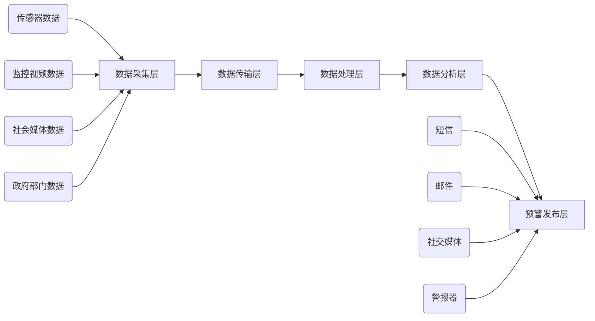

# 价值投资中的智能城市公共安全预警系统分析

> 关键词：价值投资、智能城市、公共安全预警系统、数据分析、风险评估

> 摘要：本文聚焦于价值投资视角下的智能城市公共安全预警系统。首先介绍了该系统提出的背景，明确其目的、范围、预期读者以及文档结构等内容。接着深入阐述了智能城市公共安全预警系统的核心概念、算法原理、数学模型等关键技术要点。通过项目实战展示了系统的具体实现和代码解读，分析了其实际应用场景。同时推荐了相关的学习资源、开发工具框架以及论文著作。最后总结了该系统未来的发展趋势与挑战，并提供了常见问题解答和扩展阅读参考资料，旨在全面深入地剖析智能城市公共安全预警系统在价值投资中的重要性和应用价值。

## 1. 背景介绍 
### 1.1 目的和范围
在当今快速发展的城市化进程中，城市面临着各种各样的公共安全问题，如自然灾害、公共卫生事件、社会安全事件等。智能城市公共安全预警系统的目的在于利用先进的信息技术，整合各类数据资源，对城市中的潜在安全风险进行实时监测、分析和预警，从而提高城市应对公共安全事件的能力，保障居民的生命财产安全和城市的稳定运行。

本系统的范围涵盖了城市的各个领域，包括但不限于交通、能源、环境、公共卫生、社会治安等。通过对这些领域的数据进行采集、处理和分析，系统能够及时发现潜在的安全隐患，并发出相应的预警信息，为城市管理者和相关部门提供决策支持。

### 1.2 预期读者
本文的预期读者包括城市规划者、政府部门工作人员、公共安全领域的研究人员、价值投资者以及对智能城市和公共安全预警系统感兴趣的技术爱好者。城市规划者可以从本文中了解如何将公共安全预警系统融入城市的整体规划中；政府部门工作人员可以获取系统建设和管理的相关知识和经验；公共安全领域的研究人员可以在本文的基础上进行深入的学术研究；价值投资者可以评估智能城市公共安全预警系统的投资价值和潜力；技术爱好者可以学习系统的技术原理和实现方法。

### 1.3 文档结构概述
本文将按照以下结构进行阐述：首先介绍智能城市公共安全预警系统的背景，包括目的、范围、预期读者和文档结构概述；接着详细讲解系统的核心概念与联系，包括原理和架构的文本示意图以及 Mermaid 流程图；然后阐述核心算法原理和具体操作步骤，并使用 Python 源代码进行详细阐述；之后介绍系统的数学模型和公式，并通过举例进行详细讲解；再通过项目实战展示系统的代码实际案例和详细解释说明；接着分析系统的实际应用场景；随后推荐相关的工具和资源；最后总结系统的未来发展趋势与挑战，提供常见问题与解答以及扩展阅读和参考资料。

### 1.4 术语表
#### 1.4.1 核心术语定义
- **智能城市**：是指利用物联网、云计算、大数据、人工智能等先进信息技术，对城市的各类资源进行整合和优化，实现城市的智能化管理和运行的城市形态。
- **公共安全预警系统**：是指通过对城市中的各类安全相关数据进行实时监测、分析和评估，及时发现潜在的安全风险，并发出相应预警信息的系统。
- **价值投资**：是一种投资策略，强调通过对资产的内在价值进行评估，选择具有长期投资价值的资产进行投资。

#### 1.4.2 相关概念解释
- **物联网（IoT）**：是指通过各种信息传感器、射频识别技术、全球定位系统等技术和装置，实时采集任何需要监控、连接、互动的物体或过程，采集其声、光、热、电、力学、化学、生物、位置等各种需要的信息，通过各类可能的网络接入，实现物与物、物与人的泛在连接，实现对物品和过程的智能化感知、识别和管理。
- **大数据**：是指无法在一定时间范围内用常规软件工具进行捕捉、管理和处理的数据集合，是需要新处理模式才能具有更强的决策力、洞察发现力和流程优化能力的海量、高增长率和多样化的信息资产。
- **人工智能（AI）**：是指计算机系统能够执行通常需要人类智能才能完成的任务，如学习、推理、解决问题、感知和语言理解等。

#### 1.4.3 缩略词列表
- **IoT**：Internet of Things（物联网）
- **AI**：Artificial Intelligence（人工智能）
- **GIS**：Geographic Information System（地理信息系统）
- **CCTV**：Closed - Circuit Television（闭路电视）

## 2. 核心概念与联系 

### 核心概念原理
智能城市公共安全预警系统的核心原理是通过多源数据的采集、融合和分析，对城市中的公共安全风险进行实时监测和评估。系统主要由数据采集层、数据传输层、数据处理层、数据分析层和预警发布层组成。

- **数据采集层**：负责收集城市中各种与公共安全相关的数据，包括传感器数据（如气象传感器、环境传感器、交通传感器等）、监控视频数据、社会媒体数据、政府部门数据等。
- **数据传输层**：将采集到的数据安全、可靠地传输到数据处理中心。传输方式可以采用有线网络（如以太网、光纤等）或无线网络（如 Wi - Fi、4G/5G 等）。
- **数据处理层**：对采集到的原始数据进行清洗、转换和存储，去除噪声和错误数据，将数据转换为统一的格式，以便后续的分析处理。
- **数据分析层**：运用大数据分析、人工智能等技术，对处理后的数据进行挖掘和分析，提取有价值的信息，识别潜在的安全风险。
- **预警发布层**：根据数据分析的结果，当发现潜在的安全风险时，及时通过各种渠道（如短信、邮件、社交媒体、警报器等）向相关人员和公众发布预警信息。

### 架构的文本示意图
```plaintext
+---------------------+
|   数据采集层        |
| - 传感器数据        |
| - 监控视频数据      |
| - 社会媒体数据      |
| - 政府部门数据      |
+---------------------+
           |
           v
+---------------------+
|   数据传输层        |
| - 有线网络          |
| - 无线网络          |
+---------------------+
           |
           v
+---------------------+
|   数据处理层        |
| - 数据清洗          |
| - 数据转换          |
| - 数据存储          |
+---------------------+
           |
           v
+---------------------+
|   数据分析层        |
| - 大数据分析        |
| - 人工智能算法      |
+---------------------+
           |
           v
+---------------------+
|   预警发布层        |
| - 短信              |
| - 邮件              |
| - 社交媒体          |
| - 警报器            |
+---------------------+
```

### Mermaid 流程图


## 3. 核心算法原理 & 具体操作步骤 

### 核心算法原理
智能城市公共安全预警系统中常用的核心算法包括机器学习算法（如决策树、支持向量机、神经网络等）和数据挖掘算法（如关联规则挖掘、聚类分析等）。这里以决策树算法为例进行详细阐述。

决策树是一种基于树结构进行决策的算法，它通过对数据的属性进行划分，将数据集逐步细分，直到每个子集都属于同一个类别。决策树的每个内部节点代表一个属性上的测试，每个分支代表一个测试输出，每个叶节点代表一个类别。

### 具体操作步骤
1. **数据准备**：收集与公共安全相关的数据，并进行清洗和预处理，将数据转换为适合决策树算法处理的格式。
2. **特征选择**：从数据中选择对公共安全风险有重要影响的特征作为决策树的属性。
3. **决策树构建**：使用训练数据构建决策树模型。常见的决策树构建算法有 ID3、C4.5 和 CART 等。
4. **模型评估**：使用测试数据对构建好的决策树模型进行评估，计算模型的准确率、召回率等指标。
5. **预警决策**：将新的监测数据输入到训练好的决策树模型中，根据模型的输出结果进行预警决策。

### Python 源代码详细阐述
```python
import pandas as pd
from sklearn.model_selection import train_test_split
from sklearn.tree import DecisionTreeClassifier
from sklearn.metrics import accuracy_score

# 数据准备
# 假设我们有一个包含公共安全相关数据的 CSV 文件
data = pd.read_csv('public_safety_data.csv')

# 特征选择
X = data.drop('risk_level', axis=1)  # 特征数据
y = data['risk_level']  # 标签数据

# 划分训练集和测试集
X_train, X_test, y_train, y_test = train_test_split(X, y, test_size=0.2, random_state=42)

# 决策树构建
clf = DecisionTreeClassifier()
clf.fit(X_train, y_train)

# 模型评估
y_pred = clf.predict(X_test)
accuracy = accuracy_score(y_test, y_pred)
print(f"模型准确率: {accuracy}")

# 预警决策
new_data = pd.DataFrame({
    'feature1': [1],
    'feature2': [2],
    # 其他特征...
})
predicted_risk_level = clf.predict(new_data)
print(f"预测的风险等级: {predicted_risk_level}")
```

## 4. 数学模型和公式 & 详细讲解 & 举例说明 

### 信息熵公式
在决策树算法中，常用信息熵来衡量数据的不确定性。信息熵的计算公式为：
$$H(X)=-\sum_{i = 1}^{n}p(x_i)\log_2p(x_i)$$
其中，$X$ 是一个离散随机变量，$p(x_i)$ 是 $X$ 取值为 $x_i$ 的概率，$n$ 是 $X$ 可能取值的个数。

信息熵的值越大，说明数据的不确定性越高；信息熵的值越小，说明数据的纯度越高。

### 信息增益公式
信息增益是决策树算法中用于选择最优划分属性的指标。信息增益的计算公式为：
$$Gain(D, a)=H(D)-\sum_{v = 1}^{V}\frac{|D^v|}{|D|}H(D^v)$$
其中，$D$ 是数据集，$a$ 是属性，$V$ 是属性 $a$ 可能取值的个数，$D^v$ 是属性 $a$ 取值为 $v$ 的样本子集，$|D|$ 和 $|D^v|$ 分别表示数据集 $D$ 和子集 $D^v$ 的样本数量，$H(D)$ 和 $H(D^v)$ 分别表示数据集 $D$ 和子集 $D^v$ 的信息熵。

信息增益越大，说明使用属性 $a$ 进行划分后，数据集的纯度提高得越多，因此该属性越适合作为划分属性。

### 详细讲解
信息熵的概念源于信息论，它表示一个随机变量的平均不确定性。在决策树中，我们希望通过选择合适的属性进行划分，使得划分后的子集的信息熵尽可能小，即数据的纯度尽可能高。信息增益则是衡量使用某个属性进行划分后，数据集信息熵减少的程度。

### 举例说明
假设我们有一个数据集 $D$ 包含 10 个样本，其中 6 个样本的类别为正类，4 个样本的类别为负类。则数据集 $D$ 的信息熵为：
$$H(D)=-\frac{6}{10}\log_2\frac{6}{10}-\frac{4}{10}\log_2\frac{4}{10}\approx0.971$$
假设我们有一个属性 $a$，它有两个取值 $v_1$ 和 $v_2$。属性 $a$ 取值为 $v_1$ 的样本子集 $D^1$ 包含 4 个样本，其中 3 个样本为正类，1 个样本为负类；属性 $a$ 取值为 $v_2$ 的样本子集 $D^2$ 包含 6 个样本，其中 3 个样本为正类，3 个样本为负类。则子集 $D^1$ 和 $D^2$ 的信息熵分别为：
$$H(D^1)=-\frac{3}{4}\log_2\frac{3}{4}-\frac{1}{4}\log_2\frac{1}{4}\approx0.811$$
$$H(D^2)=-\frac{3}{6}\log_2\frac{3}{6}-\frac{3}{6}\log_2\frac{3}{6}=1$$
使用属性 $a$ 进行划分后的信息增益为：
$$Gain(D, a)=H(D)-\frac{4}{10}H(D^1)-\frac{6}{10}H(D^2)\approx0.971 - \frac{4}{10}\times0.811-\frac{6}{10}\times1\approx0.135$$

## 5. 项目实战：代码实际案例和详细解释说明 

### 5.1  开发环境搭建
- **操作系统**：推荐使用 Linux 或 macOS 系统，也可以使用 Windows 系统。
- **Python 环境**：安装 Python 3.6 及以上版本。
- **开发工具**：推荐使用 PyCharm 或 VS Code 作为开发工具。
- **相关库安装**：使用以下命令安装所需的 Python 库：
```bash
pip install pandas scikit-learn
```

### 5.2  源代码详细实现和代码解读
```python
import pandas as pd
from sklearn.model_selection import train_test_split
from sklearn.tree import DecisionTreeClassifier
from sklearn.metrics import accuracy_score

# 数据准备
# 假设我们有一个包含公共安全相关数据的 CSV 文件
data = pd.read_csv('public_safety_data.csv')

# 代码解读：使用 pandas 库的 read_csv 函数读取 CSV 文件，并将数据存储在 DataFrame 中。

# 特征选择
X = data.drop('risk_level', axis=1)  # 特征数据
y = data['risk_level']  # 标签数据

# 代码解读：使用 drop 方法从 DataFrame 中删除 'risk_level' 列，得到特征数据 X；将 'risk_level' 列作为标签数据 y。

# 划分训练集和测试集
X_train, X_test, y_train, y_test = train_test_split(X, y, test_size=0.2, random_state=42)

# 代码解读：使用 train_test_split 函数将数据集划分为训练集和测试集，其中测试集占比为 20%，random_state 用于保证结果的可重复性。

# 决策树构建
clf = DecisionTreeClassifier()
clf.fit(X_train, y_train)

# 代码解读：创建一个 DecisionTreeClassifier 对象 clf，并使用训练集数据对其进行训练。

# 模型评估
y_pred = clf.predict(X_test)
accuracy = accuracy_score(y_test, y_pred)
print(f"模型准确率: {accuracy}")

# 代码解读：使用训练好的模型对测试集数据进行预测，得到预测结果 y_pred；使用 accuracy_score 函数计算模型的准确率，并打印输出。

# 预警决策
new_data = pd.DataFrame({
    'feature1': [1],
    'feature2': [2],
    # 其他特征...
})
predicted_risk_level = clf.predict(new_data)
print(f"预测的风险等级: {predicted_risk_level}")

# 代码解读：创建一个新的 DataFrame 对象 new_data，包含需要预测的特征数据；使用训练好的模型对新数据进行预测，得到预测的风险等级，并打印输出。
```

### 5.3  代码解读与分析
- **数据处理**：使用 pandas 库对数据进行读取和处理，将数据转换为适合机器学习算法处理的格式。
- **模型训练**：使用 sklearn 库中的 DecisionTreeClassifier 类构建决策树模型，并使用训练集数据对模型进行训练。
- **模型评估**：使用测试集数据对训练好的模型进行评估，计算模型的准确率，以评估模型的性能。
- **预警决策**：将新的监测数据输入到训练好的模型中，根据模型的输出结果进行预警决策。

## 6. 实际应用场景 
### 自然灾害预警
智能城市公共安全预警系统可以实时监测气象数据、地质数据等，对地震、洪水、台风等自然灾害进行预警。例如，通过对气象传感器数据的分析，预测台风的路径和强度，及时向相关地区的居民发布预警信息，提醒他们做好防范措施。

### 公共卫生事件预警
系统可以收集医院的就诊数据、疾病监测数据、社交媒体数据等，对传染病的爆发和传播进行监测和预警。例如，通过对社交媒体上关于疾病症状的讨论进行分析，及时发现潜在的疫情爆发点，为公共卫生部门采取防控措施提供依据。

### 社会治安预警
利用监控视频数据、报警数据、社会媒体数据等，对社会治安事件进行实时监测和预警。例如，通过对监控视频的分析，识别可疑人员和行为，及时向警方发出预警，提高社会治安防控能力。

### 交通安全预警
系统可以收集交通传感器数据、车辆定位数据等，对交通事故、交通拥堵等交通安全事件进行预警。例如，通过对交通流量数据的分析，预测交通拥堵的发生，及时向驾驶员发布路况信息，引导他们选择合适的路线。

## 7. 工具和资源推荐
### 7.1 学习资源推荐
#### 7.1.1 书籍推荐
- 《Python 数据分析实战》：本书详细介绍了使用 Python 进行数据分析的方法和技巧，包括数据处理、数据可视化、机器学习等内容，对于学习智能城市公共安全预警系统的数据处理和分析部分非常有帮助。
- 《机器学习》（周志华著）：这本书是机器学习领域的经典教材，系统地介绍了机器学习的基本概念、算法和应用，对于深入理解智能城市公共安全预警系统中使用的机器学习算法有很大的帮助。
- 《智能城市：概念、技术与应用》：本书全面介绍了智能城市的概念、技术和应用案例，对于了解智能城市公共安全预警系统的整体背景和应用场景非常有价值。

#### 7.1.2 在线课程
- Coursera 上的“Data Science Specialization”：该课程由多所知名大学的教授授课，涵盖了数据科学的各个方面，包括数据处理、数据分析、机器学习等内容，适合初学者和有一定基础的学习者。
- edX 上的“Artificial Intelligence”：这门课程系统地介绍了人工智能的基本概念、算法和应用，对于学习智能城市公共安全预警系统中使用的人工智能技术非常有帮助。
- 中国大学 MOOC 上的“智能城市概论”：该课程介绍了智能城市的发展现状、关键技术和应用案例，对于了解智能城市公共安全预警系统的背景和应用场景有很大的帮助。

#### 7.1.3 技术博客和网站
- 博客园：是一个技术开发者的社区，上面有很多关于数据分析、机器学习、智能城市等领域的技术文章和经验分享，可以从中获取最新的技术动态和学习资源。
- 开源中国：提供了大量的开源项目和技术文章，对于学习智能城市公共安全预警系统的开源实现和技术原理非常有帮助。
- Kaggle：是一个数据科学竞赛平台，上面有很多关于数据分析和机器学习的竞赛和数据集，可以通过参与竞赛和研究数据集来提高自己的数据分析和机器学习能力。

### 7.2 开发工具框架推荐
#### 7.2.1 IDE和编辑器
- PyCharm：是一款专门为 Python 开发设计的集成开发环境（IDE），具有代码编辑、调试、自动完成等功能，非常适合开发智能城市公共安全预警系统的 Python 代码。
- VS Code：是一款轻量级的代码编辑器，支持多种编程语言和插件扩展，可以通过安装 Python 相关插件来进行 Python 代码的开发和调试。

#### 7.2.2 调试和性能分析工具
- PDB：是 Python 自带的调试工具，可以在代码中设置断点，逐步执行代码，查看变量的值和程序的执行流程，帮助开发者调试代码。
- cProfile：是 Python 标准库中的性能分析工具，可以分析代码的执行时间和函数调用次数，帮助开发者找出代码中的性能瓶颈。

#### 7.2.3 相关框架和库
- Pandas：是一个用于数据处理和分析的 Python 库，提供了高效的数据结构和数据操作方法，非常适合处理智能城市公共安全预警系统中的各类数据。
- Scikit - learn：是一个用于机器学习的 Python 库，提供了丰富的机器学习算法和工具，包括分类、回归、聚类等算法，以及模型选择、评估等工具，适合用于智能城市公共安全预警系统中的数据分析和模型训练。
- TensorFlow：是一个开源的机器学习框架，由 Google 开发，提供了强大的深度学习功能，适合用于处理复杂的数据分析和预测任务，如基于深度学习的公共安全风险预测。

### 7.3 相关论文著作推荐
#### 7.3.1 经典论文
- “A Survey on Smart City Applications Enabled by Internet of Things”：该论文全面介绍了物联网在智能城市应用中的现状和发展趋势，对于了解智能城市公共安全预警系统的技术背景和应用场景有重要的参考价值。
- “Machine Learning for Anomaly Detection: A Review”：这篇论文对机器学习在异常检测中的应用进行了综述，介绍了各种异常检测算法和技术，对于智能城市公共安全预警系统中的异常事件检测有很大的帮助。

#### 7.3.2 最新研究成果
- 可以通过 IEEE Xplore、ACM Digital Library 等学术数据库搜索关于智能城市公共安全预警系统的最新研究成果，了解该领域的最新技术和发展趋势。

#### 7.3.3 应用案例分析
- 可以参考一些实际的智能城市建设项目案例，如新加坡的智能城市项目、巴塞罗那的智能交通系统等，了解智能城市公共安全预警系统在实际应用中的实施方法和效果。

## 8. 总结：未来发展趋势与挑战
### 未来发展趋势
- **多源数据融合**：未来的智能城市公共安全预警系统将更加注重多源数据的融合，不仅包括传感器数据、监控视频数据等传统数据，还将融合社会媒体数据、移动互联网数据等新型数据，以获取更全面、准确的公共安全信息。
- **人工智能深度应用**：人工智能技术将在智能城市公共安全预警系统中得到更深入的应用，如深度学习、强化学习等技术将被用于提高风险预测的准确性和实时性，实现更加智能化的预警决策。
- **与其他系统的集成**：智能城市公共安全预警系统将与城市的其他系统，如交通管理系统、能源管理系统、应急指挥系统等进行深度集成，实现信息共享和协同工作，提高城市的整体应急响应能力。
- **公众参与和互动**：未来的系统将更加注重公众的参与和互动，通过社交媒体、移动应用等渠道，让公众能够及时获取预警信息，并参与到公共安全管理中来，形成全社会共同参与的公共安全管理格局。

### 挑战
- **数据安全和隐私保护**：智能城市公共安全预警系统涉及大量的个人敏感信息和城市关键数据，数据安全和隐私保护是一个重要的挑战。需要采取有效的技术和管理措施，确保数据的安全性和隐私性。
- **数据质量和标准化**：多源数据的质量和标准化问题是影响系统性能的重要因素。不同来源的数据可能存在格式不一致、噪声大、缺失值等问题，需要进行数据清洗和标准化处理，以提高数据的质量和可用性。
- **技术复杂性和人才短缺**：智能城市公共安全预警系统涉及到物联网、大数据、人工智能等多种先进技术，技术复杂性较高。同时，相关领域的专业人才短缺也是一个亟待解决的问题，需要加强人才培养和引进。
- **系统的可靠性和稳定性**：公共安全预警系统的可靠性和稳定性直接关系到城市的安全和稳定运行。需要采取有效的措施，确保系统在各种复杂环境下能够正常运行，避免因系统故障而导致的安全事故。

## 9. 附录：常见问题与解答
### 问题 1：智能城市公共安全预警系统的建设成本高吗？
解答：智能城市公共安全预警系统的建设成本因系统的规模、功能和技术方案而异。一般来说，建设一个全面、复杂的系统需要较高的成本，包括硬件设备采购、软件开发、数据采集和维护等方面的费用。但是，从长期来看，该系统可以提高城市的公共安全水平，减少公共安全事件带来的损失，具有较高的投资回报率。

### 问题 2：如何保证智能城市公共安全预警系统的准确性？
解答：为了保证系统的准确性，需要采取以下措施：一是提高数据质量，通过数据清洗、校准等方法去除噪声和错误数据；二是选择合适的算法和模型，根据不同的应用场景和数据特点选择最适合的算法和模型；三是进行模型评估和优化，定期对模型进行评估和优化，不断提高模型的性能。

### 问题 3：智能城市公共安全预警系统如何与公众进行互动？
解答：系统可以通过多种渠道与公众进行互动，如短信、邮件、社交媒体、移动应用等。当系统发出预警信息时，可以通过这些渠道及时通知公众，并提供相关的安全提示和应对措施。同时，公众也可以通过这些渠道向系统反馈信息，如提供现场情况、举报安全隐患等，实现信息的双向交流。

### 问题 4：智能城市公共安全预警系统的维护和管理难度大吗？
解答：智能城市公共安全预警系统的维护和管理具有一定的难度，主要涉及到硬件设备的维护、软件系统的更新、数据的管理和安全等方面。需要建立专业的维护和管理团队，制定完善的维护和管理制度，定期对系统进行检查和维护，确保系统的正常运行。

## 10. 扩展阅读 & 参考资料
### 扩展阅读
- 《智慧城市：创新2.0时代的城市形态》
- 《大数据时代：生活、工作与思维的大变革》
- 《人工智能：现代方法》

### 参考资料
- IEEE 相关期刊和会议论文
- ACM 相关期刊和会议论文
- 相关政府部门发布的智能城市建设规划和政策文件
- 各大科技公司的技术博客和白皮书