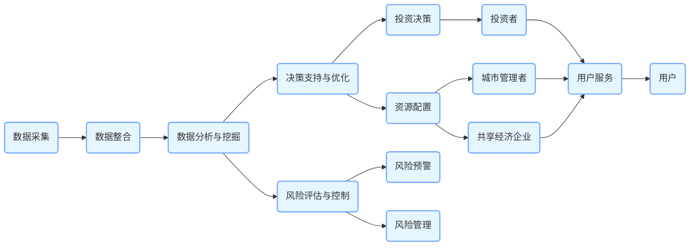

# 价值投资中的智能城市共享经济管理系统分析

> 关键词：价值投资、智能城市、共享经济、管理系统、数据分析、风险评估、可持续发展

> 摘要：本文聚焦于价值投资背景下的智能城市共享经济管理系统。首先阐述了该管理系统的背景，包括其目的、适用读者范围、文档结构和相关术语。接着深入探讨核心概念与联系，剖析其原理和架构，并通过 Mermaid 流程图直观呈现。详细讲解核心算法原理，结合 Python 源代码说明具体操作步骤，同时给出数学模型和公式并举例。通过项目实战，从开发环境搭建到源代码实现与解读，全面展示系统的实际应用。分析了该系统在智能城市共享经济中的实际应用场景，推荐了相关学习资源、开发工具框架和论文著作。最后总结未来发展趋势与挑战，提供常见问题解答和扩展阅读参考资料，旨在为价值投资领域的智能城市共享经济管理提供全面且深入的分析。

## 1. 背景介绍 
### 1.1 目的和范围
智能城市的发展是当今城市建设的重要趋势，而共享经济作为一种新兴的经济模式，在智能城市中有着巨大的发展潜力。价值投资强调对资产内在价值的评估和长期投资，在智能城市共享经济领域，需要一个有效的管理系统来保障投资的价值和共享经济的健康发展。本文章的目的在于深入分析价值投资中的智能城市共享经济管理系统，涵盖该系统的各个方面，包括其核心概念、算法原理、实际应用等，以帮助投资者、城市管理者和相关从业者更好地理解和应用该系统，实现智能城市共享经济的可持续发展和价值最大化。

### 1.2 预期读者
本文预期读者包括价值投资领域的专业人士，如投资经理、分析师等，他们可以从系统的分析中获取投资决策的依据；智能城市规划和建设的相关人员，如城市管理者、规划师等，有助于他们更好地管理和推动城市共享经济的发展；共享经济企业的从业者，包括创业者、运营人员等，可借鉴系统的设计和管理理念来优化企业运营；以及对智能城市和共享经济感兴趣的研究人员和学者，为他们的学术研究提供参考。

### 1.3 文档结构概述
本文首先介绍背景信息，让读者了解文章的目的、适用人群和整体结构。接着深入探讨核心概念与联系，明确系统的基本原理和架构。通过核心算法原理和具体操作步骤的讲解，结合数学模型和公式，详细阐述系统的技术实现。项目实战部分展示系统在实际中的应用和代码实现。分析实际应用场景，为读者提供系统应用的具体案例。推荐相关的工具和资源，帮助读者进一步学习和实践。总结未来发展趋势与挑战，为读者提供前瞻性的思考。最后，通过附录解答常见问题，并提供扩展阅读和参考资料，方便读者深入研究。

### 1.4 术语表
#### 1.4.1 核心术语定义
- **价值投资**：一种投资策略，基于对资产内在价值的分析，通过长期持有被低估的资产来获取收益。
- **智能城市**：利用信息技术和通信技术优化城市管理和服务，提高城市的效率、可持续性和居民生活质量的城市发展模式。
- **共享经济**：基于互联网平台，将闲置资源的使用权暂时转移，实现资源共享和优化配置的经济模式。
- **管理系统**：用于对特定对象进行规划、组织、协调和控制的一系列相互关联的要素和活动的集合。

#### 1.4.2 相关概念解释
- **数据分析**：对大量数据进行收集、整理、分析和解释，以发现有价值的信息和模式的过程。在智能城市共享经济管理系统中，数据分析可用于了解用户行为、资源使用情况等，为决策提供支持。
- **风险评估**：对投资或项目中可能面临的风险进行识别、分析和评估的过程。在价值投资中，风险评估有助于投资者了解投资的风险程度，制定合理的投资策略。
- **可持续发展**：满足当代人的需求，又不损害后代人满足其需求的能力的发展模式。在智能城市共享经济中，可持续发展要求在经济、社会和环境三个方面实现平衡发展。

#### 1.4.3 缩略词列表
- **AI**：Artificial Intelligence，人工智能
- **IoT**：Internet of Things，物联网
- **ML**：Machine Learning，机器学习
- **GIS**：Geographic Information System，地理信息系统

## 2. 核心概念与联系 

### 核心概念原理
价值投资中的智能城市共享经济管理系统的核心原理是将价值投资的理念与智能城市和共享经济的特点相结合，通过信息技术和数据分析手段，实现对共享经济资源的有效管理和优化配置，以实现投资价值的最大化和城市的可持续发展。

该系统主要包括以下几个核心部分：
- **数据采集与整合**：通过物联网、传感器等技术收集智能城市中共享经济相关的数据，如共享交通工具的使用情况、共享办公空间的占用率等，并将这些数据进行整合和存储。
- **数据分析与挖掘**：利用机器学习、人工智能等技术对采集到的数据进行分析和挖掘，提取有价值的信息和模式，如用户需求预测、资源使用趋势分析等。
- **决策支持与优化**：根据数据分析的结果，为投资者和城市管理者提供决策支持，如投资项目选择、资源配置优化等，并通过实时监控和反馈机制，不断优化决策和管理策略。
- **风险评估与控制**：对共享经济投资项目中的风险进行评估和控制，如市场风险、信用风险等，通过建立风险预警模型和风险管理体系，降低投资风险。

### 架构的文本示意图
该管理系统的架构可以分为以下几个层次：
- **数据层**：包括各种数据源，如物联网设备、用户终端、业务系统等，负责采集和存储共享经济相关的数据。
- **处理层**：对数据层采集到的数据进行清洗、转换和整合，然后利用数据分析和挖掘技术进行处理，提取有价值的信息和知识。
- **应用层**：基于处理层的结果，提供各种应用服务，如投资决策支持、资源管理、用户服务等。
- **用户层**：包括投资者、城市管理者、共享经济企业和用户等不同类型的用户，通过各种终端设备访问应用层的服务。

### Mermaid 流程图


## 3. 核心算法原理 & 具体操作步骤 

### 核心算法原理
在价值投资中的智能城市共享经济管理系统中，有几个关键的算法起着重要作用，下面以用户需求预测算法为例进行详细讲解。

用户需求预测算法的核心思想是利用历史数据和机器学习算法来预测未来用户对共享经济资源的需求。常用的机器学习算法包括线性回归、决策树、神经网络等。这里我们以线性回归算法为例进行说明。

线性回归是一种用于建立自变量和因变量之间线性关系的统计模型。在用户需求预测中，自变量可以是时间、天气、节假日等因素，因变量是用户对共享经济资源的需求量。线性回归的目标是找到一条最佳的直线，使得所有数据点到该直线的距离之和最小。

### 具体操作步骤及 Python 源代码
以下是使用 Python 实现线性回归算法进行用户需求预测的具体步骤和代码：

#### 步骤 1：数据准备
首先，我们需要收集和整理历史数据，包括自变量和因变量。假设我们已经将数据存储在一个 CSV 文件中，文件名为 `demand_data.csv`，其中包含两列：`time`（时间）和 `demand`（需求量）。

```python
import pandas as pd

# 读取数据
data = pd.read_csv('demand_data.csv')

# 提取自变量和因变量
X = data[['time']]
y = data['demand']
```

#### 步骤 2：数据划分
将数据划分为训练集和测试集，通常按照 80:20 的比例进行划分。

```python
from sklearn.model_selection import train_test_split

# 划分训练集和测试集
X_train, X_test, y_train, y_test = train_test_split(X, y, test_size=0.2, random_state=42)
```

#### 步骤 3：模型训练
使用线性回归模型对训练集进行训练。

```python
from sklearn.linear_model import LinearRegression

# 创建线性回归模型
model = LinearRegression()

# 训练模型
model.fit(X_train, y_train)
```

#### 步骤 4：模型预测
使用训练好的模型对测试集进行预测。

```python
# 进行预测
y_pred = model.predict(X_test)
```

#### 步骤 5：模型评估
使用评估指标（如均方误差、决定系数等）对模型的性能进行评估。

```python
from sklearn.metrics import mean_squared_error, r2_score

# 计算均方误差
mse = mean_squared_error(y_test, y_pred)

# 计算决定系数
r2 = r2_score(y_test, y_pred)

print(f"均方误差: {mse}")
print(f"决定系数: {r2}")
```

#### 步骤 6：预测未来需求
使用训练好的模型对未来的用户需求进行预测。

```python
# 假设要预测未来某个时间点的需求
future_time = [[100]]  # 未来时间点
future_demand = model.predict(future_time)
print(f"未来时间点的预测需求: {future_demand[0]}")
```

## 4. 数学模型和公式 & 详细讲解 & 举例说明 

### 线性回归的数学模型和公式
线性回归的数学模型可以表示为：

$$y = \beta_0 + \beta_1x_1 + \beta_2x_2 + \cdots + \beta_nx_n + \epsilon$$

其中：
- $y$ 是因变量（用户需求量）
- $x_1, x_2, \cdots, x_n$ 是自变量（如时间、天气等因素）
- $\beta_0, \beta_1, \beta_2, \cdots, \beta_n$ 是回归系数
- $\epsilon$ 是误差项，表示模型无法解释的随机误差

在简单线性回归中，只有一个自变量，即 $n = 1$，模型可以简化为：

$$y = \beta_0 + \beta_1x + \epsilon$$

线性回归的目标是找到最优的回归系数 $\beta_0$ 和 $\beta_1$，使得误差项 $\epsilon$ 的平方和最小。这个过程可以通过最小二乘法来实现。

最小二乘法的目标函数是：

$$S(\beta_0, \beta_1) = \sum_{i=1}^{m}(y_i - (\beta_0 + \beta_1x_i))^2$$

其中：
- $m$ 是样本数量
- $y_i$ 是第 $i$ 个样本的因变量值
- $x_i$ 是第 $i$ 个样本的自变量值

通过对目标函数 $S(\beta_0, \beta_1)$ 求偏导数并令其等于 0，可以得到回归系数 $\beta_0$ 和 $\beta_1$ 的最优解：

$$\hat{\beta}_1 = \frac{\sum_{i=1}^{m}(x_i - \bar{x})(y_i - \bar{y})}{\sum_{i=1}^{m}(x_i - \bar{x})^2}$$

$$\hat{\beta}_0 = \bar{y} - \hat{\beta}_1\bar{x}$$

其中：
- $\bar{x}$ 是自变量 $x$ 的均值
- $\bar{y}$ 是因变量 $y$ 的均值

### 详细讲解
线性回归的基本思想是通过找到一条直线来拟合数据点，使得数据点到该直线的距离之和最小。回归系数 $\beta_0$ 表示直线在 $y$ 轴上的截距，$\beta_1$ 表示直线的斜率。通过最小二乘法求解回归系数，可以得到最优的拟合直线，从而实现对因变量的预测。

### 举例说明
假设我们有以下一组数据：

| 时间 ($x$) | 需求量 ($y$) |
| --- | --- |
| 1 | 10 |
| 2 | 12 |
| 3 | 14 |
| 4 | 16 |
| 5 | 18 |

首先，计算自变量 $x$ 和因变量 $y$ 的均值：

$$\bar{x} = \frac{1 + 2 + 3 + 4 + 5}{5} = 3$$

$$\bar{y} = \frac{10 + 12 + 14 + 16 + 18}{5} = 14$$

然后，计算回归系数 $\hat{\beta}_1$：

$$\sum_{i=1}^{5}(x_i - \bar{x})(y_i - \bar{y}) = (1 - 3)(10 - 14) + (2 - 3)(12 - 14) + (3 - 3)(14 - 14) + (4 - 3)(16 - 14) + (5 - 3)(18 - 14) = 20$$

$$\sum_{i=1}^{5}(x_i - \bar{x})^2 = (1 - 3)^2 + (2 - 3)^2 + (3 - 3)^2 + (4 - 3)^2 + (5 - 3)^2 = 10$$

$$\hat{\beta}_1 = \frac{20}{10} = 2$$

最后，计算回归系数 $\hat{\beta}_0$：

$$\hat{\beta}_0 = \bar{y} - \hat{\beta}_1\bar{x} = 14 - 2 \times 3 = 8$$

所以，线性回归方程为：

$$y = 8 + 2x$$

如果要预测时间为 6 时的需求量，将 $x = 6$ 代入方程可得：

$$y = 8 + 2 \times 6 = 20$$

## 5. 项目实战：代码实际案例和详细解释说明 

### 5.1  开发环境搭建
#### 操作系统
本项目可以在 Windows、Linux 或 macOS 等主流操作系统上进行开发。建议使用 Linux 系统，如 Ubuntu，因为它对 Python 开发环境的支持较好。

#### Python 环境
安装 Python 3.7 或更高版本。可以从 Python 官方网站（https://www.python.org/downloads/） 下载安装包进行安装。

#### 依赖库安装
使用 `pip` 工具安装项目所需的依赖库，包括 `pandas`、`scikit-learn` 等。

```bash
pip install pandas scikit-learn
```

### 5.2  源代码详细实现和代码解读
以下是一个完整的智能城市共享经济用户需求预测项目的源代码，结合了前面讲解的线性回归算法：

```python
import pandas as pd
from sklearn.model_selection import train_test_split
from sklearn.linear_model import LinearRegression
from sklearn.metrics import mean_squared_error, r2_score

# 步骤 1：数据准备
def load_data(file_path):
    data = pd.read_csv(file_path)
    X = data[['time']]
    y = data['demand']
    return X, y

# 步骤 2：数据划分
def split_data(X, y):
    X_train, X_test, y_train, y_test = train_test_split(X, y, test_size=0.2, random_state=42)
    return X_train, X_test, y_train, y_test

# 步骤 3：模型训练
def train_model(X_train, y_train):
    model = LinearRegression()
    model.fit(X_train, y_train)
    return model

# 步骤 4：模型预测
def predict(model, X_test):
    y_pred = model.predict(X_test)
    return y_pred

# 步骤 5：模型评估
def evaluate(y_test, y_pred):
    mse = mean_squared_error(y_test, y_pred)
    r2 = r2_score(y_test, y_pred)
    print(f"均方误差: {mse}")
    print(f"决定系数: {r2}")

# 步骤 6：预测未来需求
def predict_future(model, future_time):
    future_demand = model.predict([future_time])
    print(f"未来时间点的预测需求: {future_demand[0]}")

if __name__ == "__main__":
    file_path = 'demand_data.csv'
    X, y = load_data(file_path)
    X_train, X_test, y_train, y_test = split_data(X, y)
    model = train_model(X_train, y_train)
    y_pred = predict(model, X_test)
    evaluate(y_test, y_pred)
    future_time = [100]
    predict_future(model, future_time)
```

### 5.3  代码解读与分析
- **数据准备**：`load_data` 函数负责读取 CSV 文件中的数据，并提取自变量和因变量。
- **数据划分**：`split_data` 函数将数据划分为训练集和测试集，方便后续的模型训练和评估。
- **模型训练**：`train_model` 函数使用线性回归模型对训练集进行训练，得到训练好的模型。
- **模型预测**：`predict` 函数使用训练好的模型对测试集进行预测，得到预测结果。
- **模型评估**：`evaluate` 函数使用均方误差和决定系数对模型的性能进行评估，帮助我们了解模型的准确性。
- **预测未来需求**：`predict_future` 函数使用训练好的模型对未来的用户需求进行预测。

通过将整个项目拆分为多个函数，代码的结构更加清晰，易于维护和扩展。

## 6. 实际应用场景 
### 共享交通工具管理
在智能城市中，共享交通工具如共享单车、共享汽车等是共享经济的重要组成部分。价值投资中的智能城市共享经济管理系统可以通过对用户需求的预测，合理规划共享交通工具的投放数量和分布地点，提高车辆的利用率，降低运营成本。例如，根据系统预测的不同时间段和不同区域的用户需求，在高峰时段和热门区域增加车辆投放，以满足用户的出行需求。

### 共享办公空间管理
共享办公空间为创业者和小型企业提供了灵活的办公解决方案。管理系统可以通过分析用户的使用习惯和需求，优化办公空间的布局和配置，提高空间的利用率。例如，根据用户的预订情况和使用频率，合理调整办公桌椅、会议室等设施的数量和分布，为用户提供更好的办公体验。

### 共享能源管理
随着智能城市的发展，共享能源如太阳能板、充电桩等也逐渐成为共享经济的一部分。管理系统可以通过实时监测能源的生产和使用情况，合理分配能源资源，提高能源的利用效率。例如，根据用户的能源需求和能源生产情况，将多余的能源存储起来或出售给其他用户，实现能源的优化配置。

### 城市资源规划
智能城市共享经济管理系统可以为城市管理者提供全面的数据分析和决策支持，帮助他们更好地规划城市资源。例如，通过分析共享经济活动的分布和发展趋势，合理规划城市的交通、商业、居住等功能区域，提高城市的整体运行效率和可持续发展能力。

## 7. 工具和资源推荐
### 7.1 学习资源推荐
#### 7.1.1 书籍推荐
- 《智能城市：技术、应用与实践》：全面介绍了智能城市的概念、技术和应用案例，帮助读者了解智能城市的发展趋势和关键技术。
- 《共享经济：重构未来商业新模式》：深入探讨了共享经济的商业模式、发展现状和未来趋势，为读者提供了共享经济领域的全面知识。
- 《Python 数据分析实战》：详细介绍了 Python 在数据分析领域的应用，包括数据处理、数据分析和数据可视化等方面的内容，适合初学者学习。

#### 7.1.2 在线课程
- Coursera 上的“智能城市技术与应用”课程：由知名高校的教授授课，系统地介绍了智能城市的相关技术和应用案例。
- edX 上的“共享经济商业模式与创新”课程：深入探讨了共享经济的商业模式和创新方法，帮助学习者了解共享经济的核心要点。
- 中国大学 MOOC 上的“Python 数据分析基础”课程：适合初学者学习 Python 数据分析的基础知识和技能。

#### 7.1.3 技术博客和网站
- 智能城市网（https://www.smartcitychina.cn/）：提供智能城市领域的最新资讯、技术动态和应用案例，是了解智能城市发展的重要平台。
- 共享经济研究网（https://www.sharingeconomyresearch.com/）：专注于共享经济领域的研究和分析，为读者提供共享经济的前沿观点和研究成果。
- 博客园（https://www.cnblogs.com/）：有许多技术博主分享 Python 数据分析、机器学习等方面的经验和技巧，是学习技术的好去处。

### 7.2 开发工具框架推荐
#### 7.2.1 IDE和编辑器
- PyCharm：一款专业的 Python 集成开发环境，具有强大的代码编辑、调试和自动补全功能，适合开发大型 Python 项目。
- Visual Studio Code：一款轻量级的代码编辑器，支持多种编程语言，通过安装相关插件可以实现 Python 开发的高效工作。
- Jupyter Notebook：一种交互式的开发环境，适合进行数据分析和机器学习的实验和演示，方便代码的编写和结果的展示。

#### 7.2.2 调试和性能分析工具
- pdb：Python 自带的调试工具，可以帮助开发者定位和解决代码中的问题。
- cProfile：Python 标准库中的性能分析工具，可以分析代码的运行时间和函数调用情况，帮助开发者优化代码性能。
- Py-Spy：一个用于分析 Python 程序性能的工具，通过采样的方式分析代码的执行情况，提供直观的性能分析报告。

#### 7.2.3 相关框架和库
- Pandas：一个强大的数据分析库，提供了高效的数据结构和数据处理工具，方便进行数据清洗、转换和分析。
- Scikit-learn：一个广泛使用的机器学习库，提供了各种机器学习算法和工具，如分类、回归、聚类等，适合进行数据挖掘和预测分析。
- TensorFlow：一个开源的深度学习框架，用于构建和训练神经网络模型，在图像识别、自然语言处理等领域有广泛的应用。

### 7.3 相关论文著作推荐
#### 7.3.1 经典论文
- “The Sharing Economy: A Literature Review”：对共享经济的概念、发展和影响进行了全面的综述，是共享经济领域的经典论文。
- “Smart Cities: A Systematic Literature Review”：系统地回顾了智能城市的相关研究，分析了智能城市的发展现状和未来趋势。
- “Linear Regression Analysis: Theory and Applications”：详细介绍了线性回归的理论和应用，是线性回归领域的重要文献。

#### 7.3.2 最新研究成果
- 关注顶级学术期刊如《Journal of Urban Technology》《Transportation Research Part C: Emerging Technologies》等，这些期刊会发表智能城市和共享经济领域的最新研究成果。
- 参加相关的学术会议，如 ACM SIGKDD（知识发现与数据挖掘会议）、IEEE SmartCity（智能城市会议）等，了解最新的研究动态和前沿技术。

#### 7.3.3 应用案例分析
- 《智能城市应用案例集》：收集了国内外智能城市建设中的各种应用案例，包括智能交通、智能能源、智能环保等方面，为实际应用提供了参考和借鉴。
- 《共享经济商业模式案例分析》：通过对国内外知名共享经济企业的案例分析，深入探讨了共享经济的商业模式和运营策略，帮助读者了解共享经济的实践经验。

## 8. 总结：未来发展趋势与挑战
### 未来发展趋势
- **技术融合**：智能城市共享经济管理系统将与人工智能、物联网、大数据等技术深度融合，实现更加智能化、自动化的管理和决策。例如，通过物联网技术实时获取共享经济资源的状态和使用情况，利用人工智能算法进行数据分析和预测，为用户提供更加个性化的服务。
- **多元化发展**：共享经济的领域将不断拓展，除了现有的共享交通工具、共享办公空间等，还将涉及更多的领域，如共享医疗、共享教育等。同时，共享经济的模式也将不断创新，如出现更加多样化的共享形式和商业模式。
- **可持续发展**：在价值投资的推动下，智能城市共享经济将更加注重可持续发展，实现经济、社会和环境的协调发展。例如，通过优化资源配置，减少资源浪费和环境污染，提高城市的可持续发展能力。

### 挑战
- **数据安全与隐私保护**：智能城市共享经济管理系统涉及大量的用户数据和敏感信息，数据安全和隐私保护是面临的重要挑战。需要加强数据加密、访问控制等技术手段，确保数据的安全性和隐私性。
- **法律法规不完善**：共享经济作为一种新兴的经济模式，相关的法律法规还不够完善。在智能城市共享经济管理中，需要制定相应的法律法规，规范市场秩序，保障各方的合法权益。
- **用户信任问题**：用户对共享经济的信任是其发展的关键。由于共享经济涉及陌生人之间的交易和合作，用户可能存在安全、质量等方面的担忧。需要建立健全的信用评价体系和监管机制，提高用户的信任度。

## 9. 附录：常见问题与解答
### 1. 智能城市共享经济管理系统的建设成本高吗？
建设成本因系统的规模和功能而异。一般来说，涉及到大数据分析、人工智能等先进技术的系统建设成本相对较高。但从长远来看，该系统可以提高资源利用效率，降低运营成本，带来显著的经济效益。

### 2. 如何确保系统中数据的准确性？
可以通过以下措施确保数据的准确性：
- 选择可靠的数据采集设备和传感器，确保数据采集的准确性。
- 对采集到的数据进行清洗和预处理，去除噪声和错误数据。
- 建立数据验证机制，对数据的准确性进行实时监测和验证。

### 3. 系统的可扩展性如何？
智能城市共享经济管理系统通常采用模块化的设计架构，具有较好的可扩展性。可以根据业务需求和发展情况，方便地添加新的功能模块和数据源，以满足不断变化的需求。

### 4. 如何解决不同共享经济平台之间的数据整合问题？
可以通过制定统一的数据标准和接口规范，实现不同平台之间的数据交换和整合。同时，采用数据中间件等技术手段，对不同格式和结构的数据进行转换和处理，确保数据的一致性和兼容性。

## 10. 扩展阅读 & 参考资料
### 扩展阅读
- 《智能革命：迎接人工智能时代的社会、经济与文化变革》：探讨了人工智能对社会、经济和文化的影响，为理解智能城市共享经济管理系统的发展背景提供了更广阔的视角。
- 《创新者的窘境》：分析了企业在面对技术创新时的挑战和机遇，对共享经济企业的发展具有一定的启示作用。
- 《数字化转型：从战略到执行》：介绍了企业数字化转型的方法和实践，对智能城市共享经济管理系统的建设和应用具有参考价值。

### 参考资料
- 相关的行业报告和统计数据，如《中国智能城市发展报告》《中国共享经济发展年度报告》等。
- 学术期刊和会议论文，如《ACM Transactions on Intelligent Systems and Technology》《IEEE Transactions on Smart Grid》等。
- 官方网站和政策文件，如国家发改委、工信部等部门发布的关于智能城市和共享经济的政策文件。