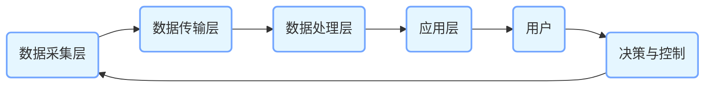

# 价值投资中的智能城市地下管网监测系统分析

> 关键词：价值投资、智能城市、地下管网监测系统、物联网、数据分析、传感器技术、系统架构

> 摘要：本文聚焦于价值投资视角下的智能城市地下管网监测系统。首先介绍了该系统的背景，包括目的、预期读者等内容。接着阐述核心概念与联系，剖析系统的原理和架构。通过Python代码详细讲解核心算法原理及具体操作步骤，并给出相关数学模型和公式。以实际项目为例，展示开发环境搭建、源代码实现与解读。探讨了该系统的实际应用场景，推荐了学习资源、开发工具框架以及相关论文著作。最后总结了未来发展趋势与挑战，提供常见问题解答和扩展阅读参考资料，旨在全面深入地分析智能城市地下管网监测系统在价值投资中的意义和潜力。

## 1. 背景介绍 
### 1.1 目的和范围
智能城市地下管网监测系统的建设目的在于提升城市地下管网的管理效率、保障城市基础设施的安全运行以及优化资源分配。随着城市的不断发展，地下管网规模日益庞大且复杂，传统的管理方式已难以满足需求。本系统通过实时监测管网的运行状态，能够及时发现潜在的故障和安全隐患，减少因管网故障导致的城市停水、停电、燃气泄漏等事故，提高城市的运行效率和居民的生活质量。

本系统的范围涵盖了城市中各类地下管网，包括供水、排水、燃气、电力、通信等。通过在管网上安装各种传感器，实时采集管网的压力、流量、温度、湿度、泄漏等数据，并将这些数据传输到监控中心进行分析和处理。

### 1.2 预期读者
本文的预期读者包括城市规划者、市政管理部门工作人员、价值投资者、相关技术研发人员以及对智能城市建设感兴趣的人士。城市规划者可以从本文中了解智能城市地下管网监测系统对城市规划的影响；市政管理部门工作人员可以获取系统在实际应用中的管理经验和技术要点；价值投资者可以评估该系统的投资价值和市场潜力；技术研发人员可以借鉴系统的架构和算法原理进行技术创新；对智能城市建设感兴趣的人士可以全面了解智能城市地下管网监测系统的相关知识。

### 1.3 文档结构概述
本文首先介绍智能城市地下管网监测系统的背景，包括目的、预期读者和文档结构概述等内容。接着阐述系统的核心概念与联系，通过文本示意图和Mermaid流程图展示系统的原理和架构。然后详细讲解核心算法原理和具体操作步骤，并给出相关的数学模型和公式。以实际项目为例，展示开发环境搭建、源代码实现与解读。探讨系统的实际应用场景，推荐学习资源、开发工具框架以及相关论文著作。最后总结未来发展趋势与挑战，提供常见问题解答和扩展阅读参考资料。

### 1.4 术语表
#### 1.4.1 核心术语定义
- **智能城市**：利用信息技术和通信技术手段感测、分析、整合城市运行核心系统的各项关键信息，从而对包括民生、环保、公共安全、城市服务、工商业活动在内的各种需求做出智能响应的城市发展新模式。
- **地下管网**：城市范围内供水、排水、燃气、热力、电力、通信、广播电视、工业等地下管线及其附属设施，是保障城市运行的重要基础设施和“生命线”。
- **传感器**：能感受规定的被测量并按照一定的规律转换成可用信号的器件或装置，通常由敏感元件和转换元件组成。在地下管网监测系统中，传感器用于实时采集管网的各种运行数据。
- **物联网（IoT）**：通过各种信息传感器、射频识别技术、全球定位系统、红外感应器、激光扫描器等各种装置与技术，实时采集任何需要监控、 连接、互动的物体或过程，采集其声、光、热、电、力学、化学、生物、位置等各种需要的信息，通过各类可能的网络接入，实现物与物、物与人的泛在连接，实现对物品和过程的智能化感知、识别和管理。
- **数据分析**：指用适当的统计分析方法对收集来的大量数据进行分析，将它们加以汇总和理解并消化，以求最大化地开发数据的功能，发挥数据的作用。在地下管网监测系统中，数据分析用于对采集到的管网数据进行处理和挖掘，以发现潜在的故障和安全隐患。

#### 1.4.2 相关概念解释
- **数据采集层**：地下管网监测系统的最底层，主要负责通过各种传感器实时采集管网的运行数据。数据采集层是整个系统的数据来源，其采集数据的准确性和及时性直接影响到系统的性能和决策的正确性。
- **数据传输层**：负责将数据采集层采集到的数据传输到监控中心。数据传输层可以采用有线或无线通信方式，如以太网、GPRS、LoRa等。
- **数据处理层**：对数据传输层传输过来的数据进行处理和分析。数据处理层可以采用数据挖掘、机器学习等技术，对管网数据进行建模和预测，以发现潜在的故障和安全隐患。
- **应用层**：为用户提供各种应用服务，如实时监控、故障报警、数据分析、决策支持等。应用层是整个系统的用户界面，其设计的友好性和易用性直接影响到用户的使用体验。

#### 1.4.3 缩略词列表
- **IoT**：Internet of Things（物联网）
- **GPRS**：General Packet Radio Service（通用分组无线服务）
- **LoRa**：Long Range（远距离无线通信技术）
- **GIS**：Geographic Information System（地理信息系统）
- **SCADA**：Supervisory Control and Data Acquisition（数据采集与监视控制系统）

## 2. 核心概念与联系 
### 核心概念原理
智能城市地下管网监测系统的核心原理是利用物联网技术将分布在城市地下管网中的各种传感器连接起来，实时采集管网的运行数据，并通过数据传输网络将这些数据传输到监控中心。监控中心对采集到的数据进行处理和分析，利用数据分析和机器学习等技术对管网的运行状态进行评估和预测，及时发现潜在的故障和安全隐患，并采取相应的措施进行处理。

### 架构的文本示意图
智能城市地下管网监测系统主要由数据采集层、数据传输层、数据处理层和应用层组成。

- **数据采集层**：由各种传感器组成，如压力传感器、流量传感器、温度传感器、湿度传感器、泄漏传感器等，分布在城市地下管网的各个节点，实时采集管网的运行数据。
- **数据传输层**：负责将数据采集层采集到的数据传输到监控中心。数据传输层可以采用有线或无线通信方式，如以太网、GPRS、LoRa等。
- **数据处理层**：对数据传输层传输过来的数据进行处理和分析。数据处理层可以采用数据挖掘、机器学习等技术，对管网数据进行建模和预测，以发现潜在的故障和安全隐患。
- **应用层**：为用户提供各种应用服务，如实时监控、故障报警、数据分析、决策支持等。应用层可以采用Web界面、移动应用等方式，方便用户随时随地访问系统。

### Mermaid 流程图


## 3. 核心算法原理 & 具体操作步骤 
### 核心算法原理
在智能城市地下管网监测系统中，一个重要的算法是异常检测算法，用于及时发现管网运行中的异常数据，从而判断是否存在故障或安全隐患。这里我们采用基于统计学的Z - score算法。

Z - score算法的基本思想是通过计算数据点与数据集均值的偏离程度，以标准差为单位来衡量。如果一个数据点的Z - score值超过了预先设定的阈值，则认为该数据点是异常值。

### Python源代码实现
```python
import numpy as np

def z_score_anomaly_detection(data, threshold=3):
    """
    基于Z - score的异常检测算法
    :param data: 输入的数据数组
    :param threshold: 异常阈值，默认为3
    :return: 异常数据点的索引数组
    """
    mean = np.mean(data)
    std = np.std(data)
    z_scores = np.abs((data - mean) / std)
    anomalies = np.where(z_scores > threshold)[0]
    return anomalies

# 示例数据
data = np.array([10, 12, 11, 13, 100, 12, 11, 14])
anomaly_indices = z_score_anomaly_detection(data)
print("异常数据点的索引：", anomaly_indices)
print("异常数据点的值：", data[anomaly_indices])
```

### 具体操作步骤
1. **数据收集**：通过数据采集层的传感器收集地下管网的运行数据，如压力、流量等。
2. **数据预处理**：对收集到的数据进行清洗和预处理，去除噪声和缺失值。
3. **计算Z - score**：根据上述Python代码中的实现，计算每个数据点的Z - score值。
4. **判断异常**：将计算得到的Z - score值与预先设定的阈值进行比较，如果超过阈值，则认为该数据点是异常值。
5. **报警与处理**：当发现异常数据点时，系统及时发出报警信号，并采取相应的措施进行处理，如通知维修人员进行检修。

## 4. 数学模型和公式 & 详细讲解 & 举例说明 
### 数学模型和公式
Z - score的计算公式为：
$$Z = \frac{x - \mu}{\sigma}$$
其中，$Z$ 是Z - score值，$x$ 是数据点的值，$\mu$ 是数据集的均值，$\sigma$ 是数据集的标准差。

### 详细讲解
- **均值 $\mu$**：数据集的均值是所有数据点的平均值，它反映了数据集的中心位置。计算公式为：
$$\mu = \frac{1}{n}\sum_{i = 1}^{n}x_i$$
其中，$n$ 是数据集的大小，$x_i$ 是第 $i$ 个数据点的值。
- **标准差 $\sigma$**：标准差是衡量数据集离散程度的指标，它反映了数据点相对于均值的偏离程度。计算公式为：
$$\sigma = \sqrt{\frac{1}{n}\sum_{i = 1}^{n}(x_i - \mu)^2}$$

### 举例说明
假设有一组管网压力数据：$[10, 12, 11, 13, 100, 12, 11, 14]$。

1. **计算均值 $\mu$**：
$$\mu=\frac{10 + 12+11+13+100+12+11+14}{8}=\frac{183}{8}=22.875$$
2. **计算标准差 $\sigma$**：
首先计算每个数据点与均值的差值的平方：
$$(10 - 22.875)^2 = 165.765625$$
$$(12 - 22.875)^2 = 118.265625$$
$$(11 - 22.875)^2 = 141.015625$$
$$(13 - 22.875)^2 = 97.515625$$
$$(100 - 22.875)^2 = 5948.265625$$
$$(12 - 22.875)^2 = 118.265625$$
$$(11 - 22.875)^2 = 141.015625$$
$$(14 - 22.875)^2 = 78.765625$$
然后计算这些差值的平方的平均值：
$$\frac{165.765625+118.265625+141.015625+97.515625+5948.265625+118.265625+141.015625+78.765625}{8}=\frac{6808.875}{8}=851.109375$$
最后取平方根得到标准差：
$$\sigma=\sqrt{851.109375}\approx29.17$$
3. **计算Z - score**：
以数据点 $100$ 为例，其Z - score值为：
$$Z=\frac{100 - 22.875}{29.17}\approx2.64$$
如果阈值设定为 $3$，则该数据点不是异常值；如果阈值设定为 $2$，则该数据点是异常值。

## 5. 项目实战：代码实际案例和详细解释说明 
### 5.1  开发环境搭建
#### 硬件环境
- **传感器**：选择适合地下管网监测的传感器，如压力传感器、流量传感器、温度传感器等。确保传感器的精度和稳定性满足系统要求。
- **数据采集设备**：可以使用单片机或嵌入式开发板，如Arduino、Raspberry Pi等，作为数据采集设备。这些设备具有丰富的接口，可以方便地连接各种传感器。
- **服务器**：选择性能稳定的服务器，如阿里云、腾讯云等云服务器，用于存储和处理采集到的数据。

#### 软件环境
- **操作系统**：服务器可以选择Linux操作系统，如Ubuntu、CentOS等。数据采集设备可以根据其硬件平台选择相应的操作系统，如Arduino使用Arduino IDE，Raspberry Pi可以使用Raspbian操作系统。
- **开发语言**：选择Python作为主要的开发语言，因为Python具有丰富的库和工具，适合进行数据分析和处理。
- **数据库**：选择关系型数据库，如MySQL、PostgreSQL等，用于存储采集到的数据。

### 5.2  源代码详细实现和代码解读
#### 数据采集部分
```python
import time
import random

# 模拟传感器数据采集
def collect_sensor_data():
    pressure = random.uniform(10, 20)  # 模拟压力数据
    flow = random.uniform(5, 15)  # 模拟流量数据
    temperature = random.uniform(20, 30)  # 模拟温度数据
    return pressure, flow, temperature

# 循环采集数据
while True:
    pressure, flow, temperature = collect_sensor_data()
    print(f"压力: {pressure} Pa, 流量: {flow} m³/h, 温度: {temperature} °C")
    time.sleep(5)  # 每5秒采集一次数据
```
**代码解读**：
- `collect_sensor_data` 函数用于模拟传感器数据采集，生成随机的压力、流量和温度数据。
- 主循环中，每隔5秒调用一次 `collect_sensor_data` 函数，采集数据并打印输出。

#### 数据传输部分
```python
import requests

# 模拟数据传输到服务器
def send_data_to_server(pressure, flow, temperature):
    url = "http://your_server_ip/api/data"  # 服务器接口地址
    data = {
        "pressure": pressure,
        "flow": flow,
        "temperature": temperature
    }
    try:
        response = requests.post(url, json=data)
        if response.status_code == 200:
            print("数据传输成功")
        else:
            print(f"数据传输失败，状态码: {response.status_code}")
    except Exception as e:
        print(f"数据传输出错: {e}")

# 采集数据并传输到服务器
pressure, flow, temperature = collect_sensor_data()
send_data_to_server(pressure, flow, temperature)
```
**代码解读**：
- `send_data_to_server` 函数用于将采集到的数据通过HTTP POST请求发送到服务器。
- 服务器接口地址需要根据实际情况进行修改。
- 如果请求成功，返回状态码200，打印“数据传输成功”；否则打印错误信息。

#### 数据处理部分
```python
import numpy as np

# 模拟服务器端数据处理
def process_data(data_list):
    pressure_data = np.array([d["pressure"] for d in data_list])
    flow_data = np.array([d["flow"] for d in data_list])
    temperature_data = np.array([d["temperature"] for d in data_list])

    # 计算均值和标准差
    pressure_mean = np.mean(pressure_data)
    pressure_std = np.std(pressure_data)
    flow_mean = np.mean(flow_data)
    flow_std = np.std(flow_data)
    temperature_mean = np.mean(temperature_data)
    temperature_std = np.std(temperature_data)

    print(f"压力均值: {pressure_mean} Pa, 压力标准差: {pressure_std} Pa")
    print(f"流量均值: {flow_mean} m³/h, 流量标准差: {flow_std} m³/h")
    print(f"温度均值: {temperature_mean} °C, 温度标准差: {temperature_std} °C")

# 模拟接收数据
data_list = [
    {"pressure": 12, "flow": 8, "temperature": 25},
    {"pressure": 13, "flow": 9, "temperature": 26},
    {"pressure": 11, "flow": 7, "temperature": 24}
]
process_data(data_list)
```
**代码解读**：
- `process_data` 函数用于对服务器端接收到的数据进行处理，计算压力、流量和温度数据的均值和标准差。
- 模拟接收数据部分，定义了一个包含多个数据记录的列表，调用 `process_data` 函数进行数据处理。

### 5.3  代码解读与分析
- **数据采集部分**：通过模拟传感器数据采集，实现了数据的实时采集。在实际应用中，需要将模拟数据替换为真实传感器采集的数据。
- **数据传输部分**：使用HTTP POST请求将采集到的数据传输到服务器。在实际应用中，需要考虑数据的安全性和可靠性，可以采用加密传输和重传机制。
- **数据处理部分**：对服务器端接收到的数据进行处理，计算数据的统计特征。在实际应用中，可以进一步采用数据分析和机器学习算法，对数据进行深入挖掘和分析。

## 6. 实际应用场景 
### 供水管网监测
智能城市地下管网监测系统在供水管网监测中具有重要应用。通过在供水管道上安装压力传感器和流量传感器，可以实时监测管道的压力和流量变化。当管道发生泄漏时，压力会下降，流量会异常增加，系统可以及时发出报警信号，通知维修人员进行检修，减少水资源的浪费。

### 排水管网监测
在排水管网监测中，系统可以通过安装液位传感器和水质传感器，实时监测排水管道的液位和水质情况。当液位过高时，可能会导致城市内涝，系统可以及时发出预警信号，提醒相关部门采取措施进行排水。同时，通过监测水质情况，可以及时发现污水泄漏等问题，保护城市环境。

### 燃气管网监测
对于燃气管网监测，系统可以安装燃气泄漏传感器，实时监测燃气管道的泄漏情况。一旦检测到燃气泄漏，系统会立即发出警报，并采取相应的措施，如关闭阀门、疏散人员等，确保居民的生命财产安全。

### 电力和通信管网监测
在电力和通信管网监测中，系统可以通过安装温度传感器和电流传感器，实时监测电缆的温度和电流变化。当电缆温度过高或电流异常时，可能会导致电缆故障，系统可以及时发出预警信号，通知维修人员进行检查和维护，保障电力和通信的正常运行。

## 7. 工具和资源推荐
### 7.1 学习资源推荐
#### 7.1.1 书籍推荐
- 《物联网：技术、应用与标准》：本书全面介绍了物联网的技术原理、应用场景和相关标准，对于了解智能城市地下管网监测系统的物联网技术基础有很大帮助。
- 《数据分析实战》：详细讲解了数据分析的方法和技巧，包括数据清洗、数据挖掘、机器学习等内容，对于处理地下管网监测系统中的大量数据具有重要参考价值。
- 《传感器技术》：介绍了各种传感器的工作原理、性能特点和应用领域，有助于深入了解地下管网监测系统中传感器的选型和使用。

#### 7.1.2 在线课程
- Coursera上的“物联网基础”课程：由知名高校教授授课，系统地介绍了物联网的基本概念、技术架构和应用案例。
- edX上的“数据分析与可视化”课程：提供了丰富的数据分析工具和方法的教学，帮助学习者掌握数据分析的技能。
- 中国大学MOOC上的“传感器原理与应用”课程：深入讲解了传感器的原理和应用，适合对传感器技术感兴趣的学习者。

#### 7.1.3 技术博客和网站
- 物联网智库（https://www.iot101.com/）：提供物联网领域的最新技术、行业动态和应用案例，对于了解智能城市地下管网监测系统的发展趋势有很大帮助。
- 数据派（https://www.datapi.cn/）：专注于数据分析和数据挖掘领域，分享了大量的数据分析技术文章和案例。
- 电子发烧友（https://www.elecfans.com/）：涵盖了电子技术、传感器技术等多个领域的技术文章和资源，对于学习地下管网监测系统中的硬件技术有一定的参考价值。

### 7.2 开发工具框架推荐
#### 7.2.1 IDE和编辑器
- PyCharm：一款专门为Python开发设计的集成开发环境（IDE），具有强大的代码编辑、调试和自动补全功能，适合开发地下管网监测系统的Python代码。
- Visual Studio Code：一款轻量级的代码编辑器，支持多种编程语言和插件扩展，具有丰富的功能和良好的用户体验。
- Arduino IDE：用于开发Arduino单片机的集成开发环境，提供了简单易用的编程界面和丰富的示例代码，适合进行传感器数据采集的开发。

#### 7.2.2 调试和性能分析工具
- Wireshark：一款网络协议分析工具，可以用于分析地下管网监测系统中数据传输的网络数据包，帮助调试网络通信问题。
- Profiler：Python自带的性能分析工具，可以用于分析Python代码的性能瓶颈，优化代码的执行效率。
- Grafana：一款开源的数据可视化工具，可以将地下管网监测系统中的数据以直观的图表和报表形式展示出来，方便用户进行数据分析和决策。

#### 7.2.3 相关框架和库
- Flask：一个轻量级的Python Web框架，适合开发地下管网监测系统的服务器端接口。
- Django：一个功能强大的Python Web框架，提供了丰富的功能和工具，适合开发大型的地下管网监测系统的Web应用。
- Pandas：一个用于数据处理和分析的Python库，提供了高效的数据结构和数据操作方法，方便对地下管网监测系统中的数据进行处理和分析。
- NumPy：一个用于科学计算的Python库，提供了高效的数组操作和数学函数，适合进行地下管网监测系统中的数值计算。

### 7.3 相关论文著作推荐
#### 7.3.1 经典论文
- “Internet of Things: A Survey”：该论文对物联网的概念、技术和应用进行了全面的综述，是物联网领域的经典论文之一。
- “Data Mining: Concepts and Techniques”：详细介绍了数据挖掘的概念、算法和应用，对于理解地下管网监测系统中的数据分析技术具有重要意义。
- “Sensor Networks: A Survey”：对传感器网络的技术原理、应用场景和发展趋势进行了深入的研究，为地下管网监测系统中传感器网络的设计和应用提供了理论基础。

#### 7.3.2 最新研究成果
- 关注IEEE、ACM等学术会议和期刊上关于物联网、数据分析、传感器技术等领域的最新研究成果，了解智能城市地下管网监测系统的前沿技术和发展趋势。
- 查阅相关高校和科研机构的研究报告，获取关于地下管网监测系统的最新研究进展和应用案例。

#### 7.3.3 应用案例分析
- 分析国内外智能城市建设中地下管网监测系统的应用案例，了解系统的实际运行情况和应用效果。
- 参考相关企业的技术白皮书和解决方案，学习他们在地下管网监测系统中的技术创新和实践经验。

## 8. 总结：未来发展趋势与挑战
### 未来发展趋势
- **智能化程度不断提高**：随着人工智能和机器学习技术的不断发展，智能城市地下管网监测系统将具备更强的数据分析和决策能力。系统可以自动识别管网故障模式，预测故障发生的概率，并提供最优的维修方案。
- **多网融合发展**：未来的地下管网监测系统将不再局限于单一类型的管网监测，而是实现供水、排水、燃气、电力、通信等多种管网的融合监测。通过数据共享和协同分析，可以提高城市地下管网的整体管理效率。
- **与其他城市系统集成**：地下管网监测系统将与城市的地理信息系统（GIS）、智能交通系统、智慧城市管理平台等进行深度集成，实现城市各系统之间的信息共享和协同工作，为城市的精细化管理提供支持。
- **无线通信技术的广泛应用**：随着5G、LoRa等无线通信技术的发展，地下管网监测系统的数据传输将更加高效、稳定和可靠。无线传感器网络将得到更广泛的应用，降低系统的建设和维护成本。

### 挑战
- **数据安全与隐私保护**：地下管网监测系统涉及大量的城市基础设施运行数据和居民生活数据，数据安全和隐私保护至关重要。需要采取有效的加密技术和访问控制措施，防止数据泄露和恶意攻击。
- **传感器技术的局限性**：目前的传感器技术在精度、可靠性、寿命等方面还存在一定的局限性，影响了地下管网监测系统的性能。需要不断研发和改进传感器技术，提高传感器的性能和质量。
- **系统集成与互操作性**：由于地下管网监测系统涉及多个领域和多个厂商的设备和系统，系统集成和互操作性是一个挑战。需要制定统一的标准和接口规范，确保不同设备和系统之间能够实现数据共享和协同工作。
- **投资成本与运营维护**：智能城市地下管网监测系统的建设和运营需要大量的资金投入和专业的技术人员支持。如何降低投资成本，提高运营维护效率，是需要解决的重要问题。

## 9. 附录：常见问题与解答
### 问题1：智能城市地下管网监测系统的建设成本高吗？
解答：智能城市地下管网监测系统的建设成本因系统规模、功能需求、传感器选型等因素而异。一般来说，建设成本包括传感器设备采购、数据传输网络建设、服务器和软件系统开发等方面的费用。虽然建设成本相对较高，但从长期来看，系统可以提高城市地下管网的管理效率，减少故障损失，具有显著的经济效益和社会效益。

### 问题2：如何保证地下管网监测系统的数据准确性？
解答：为了保证地下管网监测系统的数据准确性，需要从以下几个方面入手：
- **传感器选型**：选择精度高、稳定性好的传感器设备。
- **传感器安装**：确保传感器的安装位置正确，安装方式符合要求，避免传感器受到外界干扰。
- **数据校准**：定期对传感器进行校准，保证传感器测量数据的准确性。
- **数据处理**：对采集到的数据进行清洗和预处理，去除噪声和异常值。

### 问题3：地下管网监测系统可以实时监测所有管网吗？
解答：由于城市地下管网规模庞大且分布广泛，目前很难实现对所有管网的实时监测。在实际应用中，通常会根据管网的重要性、风险程度等因素进行优先级排序，选择重点区域和关键节点进行实时监测。同时，随着技术的不断发展和成本的降低，未来有望实现对更多管网的实时监测。

### 问题4：地下管网监测系统的数据如何存储和管理？
解答：地下管网监测系统的数据可以存储在关系型数据库或非关系型数据库中，如MySQL、PostgreSQL、MongoDB等。数据库的选择应根据数据量、数据类型和应用需求等因素进行综合考虑。在数据管理方面，需要建立完善的数据备份和恢复机制，确保数据的安全性和可靠性。同时，还可以采用数据仓库和数据挖掘技术，对历史数据进行分析和挖掘，为城市地下管网的管理和决策提供支持。

## 10. 扩展阅读 & 参考资料
### 扩展阅读
- 《智慧城市：数字化转型的全球趋势与实践》：深入探讨了智慧城市的发展趋势、技术应用和实践案例，对于了解智能城市地下管网监测系统在智慧城市建设中的地位和作用有很大帮助。
- 《工业4.0：即将来袭的第四次工业革命》：介绍了工业4.0的概念、技术和应用，为智能城市地下管网监测系统的发展提供了新的思路和方向。
- 《大数据时代：生活、工作与思维的大变革》：阐述了大数据的概念、特点和应用，对于理解地下管网监测系统中的数据分析和挖掘技术具有重要意义。

### 参考资料
- [IEEE Xplore](https://ieeexplore.ieee.org/)：提供了大量的电气和电子工程领域的学术论文和技术报告，是获取智能城市地下管网监测系统相关技术资料的重要来源。
- [ACM Digital Library](https://dl.acm.org/)：计算机领域的权威数字图书馆，包含了众多关于物联网、数据分析、传感器技术等方面的研究成果。
- [国家标准全文公开系统](https://openstd.samr.gov.cn/)：可以查询到与地下管网监测系统相关的国家标准和行业标准，为系统的设计和开发提供参考依据。