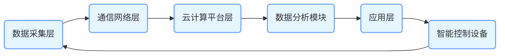

# 价值投资中的智能城市水资源管理系统分析

> 关键词：价值投资、智能城市、水资源管理系统、数据分析、物联网、可持续发展、投资回报

> 摘要：本文聚焦于价值投资视角下的智能城市水资源管理系统。随着城市化进程的加速，水资源管理面临诸多挑战，智能城市水资源管理系统应运而生。通过对该系统的核心概念、算法原理、数学模型等多方面进行深入剖析，结合项目实战案例，探讨其在实际应用场景中的价值。同时，为相关从业者提供工具和资源推荐，分析该领域未来发展趋势与挑战，旨在帮助投资者深入了解智能城市水资源管理系统的投资价值和潜力，为实现城市水资源的可持续利用和高效管理提供理论支持和实践指导。

## 1. 背景介绍 
### 1.1 目的和范围
本文的主要目的是从价值投资的角度全面分析智能城市水资源管理系统。一方面，为投资者提供关于该系统的详细技术和应用信息，帮助他们评估投资价值和潜在回报；另一方面，为城市水资源管理部门和相关技术人员提供系统的技术原理和实践案例，促进智能城市水资源管理系统的推广和应用。范围涵盖智能城市水资源管理系统的核心概念、算法原理、数学模型、项目实战、实际应用场景等多个方面，同时探讨该系统在未来的发展趋势和面临的挑战。

### 1.2 预期读者
本文预期读者包括但不限于以下几类人群：
- **投资者**：对智能城市相关领域有投资意向，希望深入了解智能城市水资源管理系统的投资价值和市场潜力。
- **城市水资源管理部门人员**：负责城市水资源规划、管理和运营的工作人员，希望通过了解智能城市水资源管理系统提升管理效率和水平。
- **技术研发人员**：从事物联网、数据分析、水资源监测等相关技术研发的专业人员，希望在智能城市水资源管理系统领域开展研究和创新。
- **科研人员和学者**：关注城市可持续发展、水资源管理等领域的研究人员，希望从理论和实践层面深入了解智能城市水资源管理系统。

### 1.3 文档结构概述
本文将按照以下结构进行组织：
- **核心概念与联系**：介绍智能城市水资源管理系统的核心概念、原理和架构，通过文本示意图和 Mermaid 流程图进行直观展示。
- **核心算法原理 & 具体操作步骤**：详细讲解智能城市水资源管理系统中涉及的核心算法原理，并使用 Python 源代码进行具体阐述。
- **数学模型和公式 & 详细讲解 & 举例说明**：介绍智能城市水资源管理系统中使用的数学模型和公式，并结合实际例子进行详细讲解。
- **项目实战：代码实际案例和详细解释说明**：通过实际项目案例，介绍开发环境搭建、源代码实现和代码解读，帮助读者更好地理解智能城市水资源管理系统的实际应用。
- **实际应用场景**：探讨智能城市水资源管理系统在不同场景下的应用，展示其实际价值和作用。
- **工具和资源推荐**：为读者推荐学习资源、开发工具框架和相关论文著作，帮助读者进一步深入学习和研究。
- **总结：未来发展趋势与挑战**：分析智能城市水资源管理系统的未来发展趋势和面临的挑战，为读者提供前瞻性的思考。
- **附录：常见问题与解答**：解答读者在阅读过程中可能遇到的常见问题。
- **扩展阅读 & 参考资料**：提供相关的扩展阅读材料和参考资料，方便读者进一步深入学习。

### 1.4 术语表
#### 1.4.1 核心术语定义
- **智能城市**：利用物联网、云计算、大数据等现代信息技术，对城市运行的各项数据进行实时监测、分析和管理，实现城市的智能化、高效化和可持续发展的城市形态。
- **水资源管理系统**：对水资源的开发、利用、保护和调配等进行全面管理的系统，旨在实现水资源的合理配置和可持续利用。
- **物联网（IoT）**：通过各种信息传感设备，如传感器、射频识别（RFID）技术、全球定位系统等，按约定的协议，把任何物品与互联网连接起来，进行信息交换和通信，以实现智能化识别、定位、跟踪、监控和管理的一种网络。
- **数据分析**：对大量的数据进行收集、整理、分析和解释，以发现数据中的模式、趋势和规律，为决策提供支持的过程。
- **价值投资**：一种基于对资产内在价值的评估，以低于内在价值的价格买入资产，等待资产价值回归并获得收益的投资策略。

#### 1.4.2 相关概念解释
- **智能水表**：一种具有自动计量、数据传输和远程控制等功能的水表，能够实时采集用户的用水数据，并通过通信网络将数据传输到水资源管理系统中。
- **水质传感器**：用于实时监测水体中各种物理、化学和生物参数的传感器，如酸碱度（pH 值）、溶解氧（DO）、化学需氧量（COD）等，为水质监测和管理提供数据支持。
- **地理信息系统（GIS）**：一种基于计算机技术的空间信息管理系统，能够对地理空间数据进行采集、存储、分析和显示，为城市水资源管理提供空间分析和决策支持。

#### 1.4.3 缩略词列表
- **IoT**：Internet of Things（物联网）
- **GIS**：Geographic Information System（地理信息系统）
- **DO**：Dissolved Oxygen（溶解氧）
- **COD**：Chemical Oxygen Demand（化学需氧量）

## 2. 核心概念与联系 
智能城市水资源管理系统是一个复杂的系统工程，它融合了物联网、数据分析、云计算等多种先进技术，旨在实现城市水资源的智能化管理和可持续利用。

### 核心概念原理
智能城市水资源管理系统的核心原理是通过物联网技术实时采集城市水资源的相关数据，如用水量、水质、水位等，然后将这些数据传输到云计算平台进行存储和分析。数据分析模块利用各种算法和模型对数据进行处理，挖掘数据中的潜在信息和规律，为水资源管理决策提供支持。最后，通过智能化的控制设备，如智能水表、阀门等，实现对水资源的实时调控和管理。

### 架构的文本示意图
智能城市水资源管理系统主要由以下几个部分组成：
- **数据采集层**：包括各种传感器和监测设备，如智能水表、水质传感器、水位传感器等，负责实时采集城市水资源的相关数据。
- **通信网络层**：负责将数据采集层采集到的数据传输到云计算平台，常见的通信网络包括有线网络、无线网络（如 ZigBee、LoRa、4G/5G 等）。
- **云计算平台层**：负责存储和管理大量的水资源数据，并提供数据分析、处理和挖掘等功能。
- **应用层**：包括各种水资源管理应用系统，如水资源监测系统、水资源调配系统、水质预警系统等，为用户提供直观的操作界面和决策支持。

### Mermaid 流程图


## 3. 核心算法原理 & 具体操作步骤 
### 核心算法原理
智能城市水资源管理系统中涉及到多种核心算法，以下以用水量预测算法为例进行详细讲解。用水量预测是水资源管理的重要环节，通过准确预测用水量，可以合理调配水资源，提高水资源利用效率。

我们采用时间序列分析中的 ARIMA（Autoregressive Integrated Moving Average）模型进行用水量预测。ARIMA 模型是一种广泛应用于时间序列预测的统计模型，它结合了自回归（AR）、差分（I）和移动平均（MA）三个部分。

### Python 源代码实现
```python
import pandas as pd
import numpy as np
from statsmodels.tsa.arima.model import ARIMA
import matplotlib.pyplot as plt

# 生成示例数据
data = {
    'date': pd.date_range(start='2020-01-01', periods=365),
    'water_usage': np.random.randint(100, 200, 365)
}
df = pd.DataFrame(data)
df.set_index('date', inplace=True)

# 划分训练集和测试集
train_size = int(len(df) * 0.8)
train_data = df[:train_size]
test_data = df[train_size:]

# 训练 ARIMA 模型
p, d, q = 1, 1, 1  # ARIMA 模型的参数
model = ARIMA(train_data, order=(p, d, q))
model_fit = model.fit()

# 进行预测
predictions = model_fit.get_forecast(steps=len(test_data))
predicted_mean = predictions.predicted_mean

# 可视化结果
plt.figure(figsize=(12, 6))
plt.plot(train_data, label='Training Data')
plt.plot(test_data, label='Actual Data')
plt.plot(test_data.index, predicted_mean, label='Predicted Data', color='r')
plt.title('Water Usage Prediction using ARIMA')
plt.xlabel('Date')
plt.ylabel('Water Usage')
plt.legend()
plt.show()
```

### 具体操作步骤
1. **数据准备**：收集历史用水量数据，并进行预处理，如缺失值处理、异常值处理等。
2. **模型选择**：根据数据的特点和需求，选择合适的时间序列模型，如 ARIMA 模型。
3. **参数估计**：使用训练数据对模型的参数进行估计，确定最优的模型参数。
4. **模型训练**：使用训练数据对模型进行训练，得到训练好的模型。
5. **模型预测**：使用训练好的模型对未来的用水量进行预测。
6. **结果评估**：将预测结果与实际值进行比较，评估模型的预测性能，如计算均方误差（MSE）、均方根误差（RMSE）等。

## 4. 数学模型和公式 & 详细讲解 & 举例说明 
### ARIMA 模型的数学公式
ARIMA 模型的一般形式可以表示为：
$$
(1 - \sum_{i=1}^{p} \phi_{i} B^{i})(1 - B)^{d} Y_{t} = (1 + \sum_{j=1}^{q} \theta_{j} B^{j}) \epsilon_{t}
$$
其中：
- $Y_{t}$ 是时间序列在 $t$ 时刻的值。
- $B$ 是滞后算子，即 $B Y_{t} = Y_{t - 1}$。
- $p$ 是自回归（AR）部分的阶数，表示当前值与过去 $p$ 个值的线性关系。
- $d$ 是差分的阶数，用于使时间序列变得平稳。
- $q$ 是移动平均（MA）部分的阶数，表示当前值与过去 $q$ 个误差项的线性关系。
- $\phi_{i}$ 是自回归系数。
- $\theta_{j}$ 是移动平均系数。
- $\epsilon_{t}$ 是白噪声误差项。

### 详细讲解
- **自回归（AR）部分**：表示当前值与过去 $p$ 个值的线性关系，即 $Y_{t}$ 可以表示为过去 $p$ 个值的加权和加上一个误差项。
- **差分（I）部分**：通过差分运算将非平稳时间序列转换为平稳时间序列，差分的阶数 $d$ 表示进行差分的次数。
- **移动平均（MA）部分**：表示当前值与过去 $q$ 个误差项的线性关系，即 $Y_{t}$ 可以表示为过去 $q$ 个误差项的加权和加上一个误差项。

### 举例说明
假设我们有一个时间序列 $Y_{t}$，其 ARIMA 模型的参数为 $p = 1$，$d = 1$，$q = 1$。则该 ARIMA 模型可以表示为：
$$
(1 - \phi_{1} B)(1 - B) Y_{t} = (1 + \theta_{1} B) \epsilon_{t}
$$
展开可得：
$$
Y_{t} - Y_{t - 1} - \phi_{1} (Y_{t - 1} - Y_{t - 2}) = \epsilon_{t} + \theta_{1} \epsilon_{t - 1}
$$
即：
$$
Y_{t} = (1 + \phi_{1}) Y_{t - 1} - \phi_{1} Y_{t - 2} + \epsilon_{t} + \theta_{1} \epsilon_{t - 1}
$$

## 5. 项目实战：代码实际案例和详细解释说明 
### 5.1  开发环境搭建
- **操作系统**：推荐使用 Linux 或 Windows 操作系统。
- **编程语言**：Python 3.x
- **开发工具**：推荐使用 PyCharm 或 Jupyter Notebook。
- **相关库**：需要安装 pandas、numpy、statsmodels、matplotlib 等库，可以使用以下命令进行安装：
```bash
pip install pandas numpy statsmodels matplotlib
```

### 5.2  源代码详细实现和代码解读
以下是一个完整的智能城市水资源管理系统的项目实战代码示例，包括数据采集、数据处理、数据分析和可视化等环节。

```python
import pandas as pd
import numpy as np
from statsmodels.tsa.arima.model import ARIMA
import matplotlib.pyplot as plt

# 模拟数据采集
def collect_data():
    data = {
        'date': pd.date_range(start='2020-01-01', periods=365),
        'water_usage': np.random.randint(100, 200, 365),
        'water_quality': np.random.randint(0, 10, 365)
    }
    df = pd.DataFrame(data)
    df.set_index('date', inplace=True)
    return df

# 数据处理
def preprocess_data(df):
    # 处理缺失值
    df.fillna(method='ffill', inplace=True)
    # 处理异常值
    df['water_usage'] = np.where(df['water_usage'] < 0, 0, df['water_usage'])
    return df

# 数据分析：用水量预测
def water_usage_prediction(df):
    train_size = int(len(df) * 0.8)
    train_data = df['water_usage'][:train_size]
    test_data = df['water_usage'][train_size:]

    p, d, q = 1, 1, 1
    model = ARIMA(train_data, order=(p, d, q))
    model_fit = model.fit()

    predictions = model_fit.get_forecast(steps=len(test_data))
    predicted_mean = predictions.predicted_mean

    return test_data, predicted_mean

# 可视化
def visualize_data(test_data, predicted_mean):
    plt.figure(figsize=(12, 6))
    plt.plot(test_data, label='Actual Data')
    plt.plot(test_data.index, predicted_mean, label='Predicted Data', color='r')
    plt.title('Water Usage Prediction')
    plt.xlabel('Date')
    plt.ylabel('Water Usage')
    plt.legend()
    plt.show()

# 主函数
def main():
    # 数据采集
    df = collect_data()
    # 数据处理
    df = preprocess_data(df)
    # 数据分析
    test_data, predicted_mean = water_usage_prediction(df)
    # 可视化
    visualize_data(test_data, predicted_mean)

if __name__ == '__main__':
    main()
```

### 5.3  代码解读与分析
- **数据采集**：`collect_data` 函数模拟了数据采集过程，生成了一个包含日期、用水量和水质信息的 DataFrame。
- **数据处理**：`preprocess_data` 函数对采集到的数据进行预处理，包括处理缺失值和异常值。
- **数据分析**：`water_usage_prediction` 函数使用 ARIMA 模型对用水量进行预测，返回测试数据和预测结果。
- **可视化**：`visualize_data` 函数将实际数据和预测数据进行可视化，方便用户直观地观察预测效果。
- **主函数**：`main` 函数调用上述函数，完成数据采集、处理、分析和可视化的整个流程。

## 6. 实际应用场景 
智能城市水资源管理系统在多个实际应用场景中发挥着重要作用，以下是一些常见的应用场景：
- **水资源监测与预警**：通过在城市的各个水源地、供水管道、污水处理厂等关键位置部署传感器，实时监测水资源的数量、质量和水位等信息。一旦发现异常情况，如水质超标、水位异常下降等，系统能够及时发出预警，提醒相关部门采取措施，保障城市水资源的安全和稳定供应。
- **水资源调配与优化**：根据城市不同区域的用水需求和水资源分布情况，智能城市水资源管理系统可以实时调整水资源的调配方案，实现水资源的合理分配和优化利用。例如，在用水高峰期，系统可以自动增加对高需求区域的供水量，同时减少对低需求区域的供水量，提高水资源的利用效率。
- **污水处理与再生利用**：智能城市水资源管理系统可以对污水处理厂的运行状态进行实时监测和控制，优化污水处理工艺，提高污水处理效率和水质。同时，系统还可以对再生水的利用情况进行管理和调配，将处理后的再生水用于城市绿化、工业冷却等非饮用水领域，实现水资源的循环利用。
- **居民用水管理**：通过智能水表，居民可以实时了解自己的用水情况，包括用水量、用水时间、水费等信息。同时，系统还可以根据居民的用水习惯和历史数据，提供个性化的节水建议，促进居民节约用水。

## 7. 工具和资源推荐
### 7.1 学习资源推荐
#### 7.1.1 书籍推荐
- 《智能城市：技术、应用与管理》：本书全面介绍了智能城市的相关技术、应用案例和管理方法，对智能城市水资源管理系统有深入的阐述。
- 《时间序列分析及其应用》：详细介绍了时间序列分析的理论和方法，包括 ARIMA 模型等，是学习时间序列预测的经典教材。
- 《物联网技术与应用》：介绍了物联网的基本概念、技术原理和应用案例，对理解智能城市水资源管理系统中的物联网技术有很大帮助。

#### 7.1.2 在线课程
- Coursera 上的“Data Science Specialization”：该课程涵盖了数据科学的各个方面，包括数据分析、机器学习等，对学习智能城市水资源管理系统中的数据分析和算法有很大帮助。
- edX 上的“Internet of Things (IoT) Fundamentals”：介绍了物联网的基础知识和技术原理，适合初学者学习。
- 中国大学 MOOC 上的“水资源规划与管理”：系统介绍了水资源规划与管理的理论和方法，对理解智能城市水资源管理系统的应用场景和管理策略有很大帮助。

#### 7.1.3 技术博客和网站
- 开源中国（https://www.oschina.net/）：提供了大量的开源项目和技术文章，对学习智能城市水资源管理系统的相关技术和开源项目有很大帮助。
- 博客园（https://www.cnblogs.com/）：有很多技术开发者分享自己的技术经验和项目实践，对学习智能城市水资源管理系统的实际应用有很大帮助。
- 物联网智库（https://www.iot101.com/）：专注于物联网领域的资讯和技术分享，对了解智能城市水资源管理系统中的物联网技术有很大帮助。

### 7.2 开发工具框架推荐
#### 7.2.1 IDE和编辑器
- PyCharm：一款专业的 Python 集成开发环境，提供了丰富的代码编辑、调试和版本控制等功能，适合开发智能城市水资源管理系统的 Python 代码。
- Jupyter Notebook：一个交互式的开发环境，支持多种编程语言，适合进行数据分析和模型训练等工作。
- Visual Studio Code：一款轻量级的代码编辑器，支持多种编程语言和插件扩展，适合快速开发和调试智能城市水资源管理系统的代码。

#### 7.2.2 调试和性能分析工具
- PyCharm 自带的调试工具：可以方便地对 Python 代码进行调试，查看变量的值和程序的执行流程。
- cProfile：Python 内置的性能分析工具，可以分析代码的运行时间和函数调用关系，帮助优化代码性能。
- TensorBoard：一个可视化工具，常用于深度学习模型的训练过程可视化和性能分析，对智能城市水资源管理系统中的深度学习模型训练有很大帮助。

#### 7.2.3 相关框架和库
- pandas：一个强大的数据处理和分析库，提供了丰富的数据结构和数据处理函数，适合处理智能城市水资源管理系统中的大量数据。
- numpy：一个用于科学计算的库，提供了高效的数组操作和数学函数，对智能城市水资源管理系统中的数据分析和模型训练有很大帮助。
- statsmodels：一个统计建模和分析库，提供了多种统计模型和算法，适合进行时间序列分析和预测等工作。
- scikit-learn：一个机器学习库，提供了多种机器学习算法和工具，适合进行智能城市水资源管理系统中的数据分析和模型训练。

### 7.3 相关论文著作推荐
#### 7.3.1 经典论文
- “A Review of Urban Water Demand Forecasting Models”：该论文对城市水资源需求预测模型进行了全面的综述，介绍了各种预测模型的优缺点和应用场景，对智能城市水资源管理系统中的用水量预测有很大的参考价值。
- “Internet of Things for Smart Water Management: A Review”：该论文对物联网技术在智能城市水资源管理中的应用进行了综述，介绍了物联网技术在水资源监测、调配和管理等方面的应用案例和研究进展。
- “Data-Driven Approaches for Water Quality Prediction: A Review”：该论文对数据驱动的水质预测方法进行了综述，介绍了各种数据驱动方法的原理和应用案例，对智能城市水资源管理系统中的水质预测有很大的参考价值。

#### 7.3.2 最新研究成果
- 关注国际知名学术期刊，如《Water Research》、《Journal of Hydrology》等，这些期刊发表了大量关于水资源管理和智能城市技术的最新研究成果。
- 参加国际学术会议，如 IEEE Smart Cities Conference、World Water Congress 等，了解智能城市水资源管理系统领域的最新研究动态和发展趋势。

#### 7.3.3 应用案例分析
- 查阅相关的行业报告和案例分析，了解国内外智能城市水资源管理系统的实际应用案例和成功经验，如新加坡的智能水资源管理系统、巴塞罗那的智能城市水资源管理项目等。

## 8. 总结：未来发展趋势与挑战
### 未来发展趋势
- **智能化水平不断提高**：随着人工智能、机器学习、深度学习等技术的不断发展，智能城市水资源管理系统的智能化水平将不断提高。系统将能够自动学习和适应不同的环境和需求，实现更加精准的水资源管理和决策。
- **大数据和云计算的深度应用**：大数据和云计算技术将为智能城市水资源管理系统提供更强大的数据存储和处理能力。通过对海量的水资源数据进行深度挖掘和分析，系统将能够发现更多的潜在信息和规律，为水资源管理提供更科学的决策支持。
- **物联网技术的广泛应用**：物联网技术将在智能城市水资源管理系统中得到更广泛的应用。更多的传感器和设备将被部署到城市的各个角落，实现对水资源的全面、实时监测和管理。
- **多领域融合发展**：智能城市水资源管理系统将与城市的其他领域，如能源管理、交通管理、环境监测等进行深度融合，实现城市的综合管理和协同发展。

### 挑战
- **数据安全和隐私问题**：智能城市水资源管理系统涉及大量的敏感数据，如居民的用水信息、水质监测数据等，数据安全和隐私问题成为了一个重要的挑战。需要采取有效的措施，保障数据的安全和隐私。
- **技术标准和规范不统一**：目前，智能城市水资源管理系统的技术标准和规范还不统一，不同的系统之间存在兼容性问题。需要制定统一的技术标准和规范，促进系统的互联互通和互操作性。
- **人才短缺**：智能城市水资源管理系统涉及多个领域的知识和技术，需要具备跨学科知识和技能的人才。目前，相关领域的人才短缺，成为了智能城市水资源管理系统发展的一个瓶颈。
- **投资成本高**：智能城市水资源管理系统的建设和运营需要大量的资金投入，包括传感器设备的采购、通信网络的建设、云计算平台的搭建等。投资成本高成为了一些城市推广智能城市水资源管理系统的障碍。

## 9. 附录：常见问题与解答
### 1. 智能城市水资源管理系统的建设需要哪些步骤？
智能城市水资源管理系统的建设一般包括以下步骤：
- **需求分析**：明确系统的建设目标和需求，确定系统的功能和性能要求。
- **系统设计**：根据需求分析的结果，设计系统的架构、模块和接口，选择合适的技术和设备。
- **设备部署**：在城市的各个关键位置部署传感器和监测设备，建立通信网络，实现数据的采集和传输。
- **平台搭建**：搭建云计算平台，实现数据的存储、管理和分析，开发各种水资源管理应用系统。
- **系统测试**：对系统进行全面的测试，包括功能测试、性能测试、安全测试等，确保系统的稳定性和可靠性。
- **系统上线**：将系统正式上线运行，进行试运行和优化，逐步完善系统的功能和性能。

### 2. 智能城市水资源管理系统中的数据采集设备有哪些？
智能城市水资源管理系统中的数据采集设备主要包括以下几类：
- **智能水表**：用于实时采集用户的用水数据，如用水量、用水时间等。
- **水质传感器**：用于实时监测水体的水质参数，如酸碱度（pH 值）、溶解氧（DO）、化学需氧量（COD）等。
- **水位传感器**：用于实时监测水位的变化情况，如河流、水库、湖泊等的水位。
- **流量传感器**：用于实时监测水流的流量情况，如供水管道、排水管道等的流量。

### 3. 如何评估智能城市水资源管理系统的投资价值？
评估智能城市水资源管理系统的投资价值可以从以下几个方面入手：
- **经济效益**：分析系统的建设和运营成本，以及系统带来的经济效益，如节水效益、减少水资源浪费的效益、提高水资源利用效率的效益等。
- **社会效益**：考虑系统对城市社会发展的贡献，如保障城市水资源的安全和稳定供应、改善城市环境质量、提高居民生活水平等。
- **环境效益**：评估系统对环境的影响，如减少水污染、保护水资源等。
- **技术创新性**：考察系统所采用的技术是否具有创新性和先进性，是否能够提高系统的性能和效率。
- **市场潜力**：分析智能城市水资源管理系统的市场需求和发展前景，评估系统的市场竞争力和盈利能力。

## 10. 扩展阅读 & 参考资料
### 扩展阅读
- 《智慧城市：数字化转型的全球经验与中国实践》
- 《大数据时代：生活、工作与思维的大变革》
- 《物联网：从技术到实践》

### 参考资料
- [IEEE Transactions on Smart Grid](https://ieeexplore.ieee.org/xpl/RecentIssue.jsp?punumber=6770876)
- [Water Research Foundation](https://www.waterrf.org/)
- [International Water Association](https://www.iwa-network.org/)