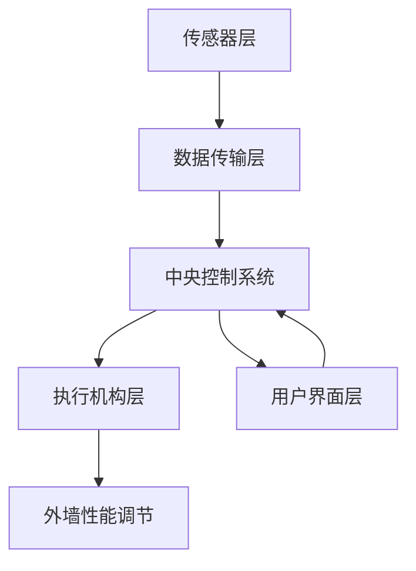

# 价值投资中的智能建筑自适应外墙系统分析

> 关键词：价值投资、智能建筑、自适应外墙系统、建筑节能、可持续发展、建筑性能、投资回报

> 摘要：本文聚焦于价值投资视角下的智能建筑自适应外墙系统。首先介绍了该系统的背景，包括其目的、预期读者、文档结构和相关术语。接着深入剖析了智能建筑自适应外墙系统的核心概念、联系、算法原理、数学模型等。通过项目实战展示了系统的代码实现与解读。阐述了其实际应用场景，推荐了相关的学习资源、开发工具和论文著作。最后总结了该系统未来的发展趋势与挑战，并对常见问题进行解答，旨在为投资者和相关从业者全面了解智能建筑自适应外墙系统提供深入且系统的参考，助力实现价值投资与建筑技术创新的有效结合。

## 1. 背景介绍 
### 1.1 目的和范围
智能建筑自适应外墙系统在当今建筑领域的发展中具有重要地位。本分析的目的在于从价值投资的角度，全面深入地研究智能建筑自适应外墙系统，评估其在经济、环境和社会等多方面的价值，为投资者提供科学的决策依据。范围涵盖了该系统的技术原理、实际应用案例、市场前景以及投资回报等多个维度，旨在揭示智能建筑自适应外墙系统在价值投资中的潜力和风险。

### 1.2 预期读者
本文预期读者主要包括建筑行业的投资者，他们希望通过对智能建筑自适应外墙系统的了解，寻找具有潜力的投资项目；建筑设计师和工程师，他们可以从技术层面深入学习该系统，将其应用于实际的建筑设计和施工中；科研人员，通过本文的研究成果可以进一步拓展相关领域的研究；以及对智能建筑和可持续发展感兴趣的普通读者，以增加对这一前沿技术的认识。

### 1.3 文档结构概述
本文首先介绍智能建筑自适应外墙系统的背景信息，包括目的、读者和术语等。接着阐述核心概念与联系，通过文本示意图和 Mermaid 流程图展示系统的架构和原理。然后详细讲解核心算法原理和具体操作步骤，利用 Python 源代码进行说明。随后介绍数学模型和公式，并举例说明。通过项目实战展示代码实际案例和详细解释。再探讨实际应用场景，推荐相关的工具和资源。最后总结未来发展趋势与挑战，解答常见问题并提供扩展阅读和参考资料。

### 1.4 术语表
#### 1.4.1 核心术语定义
- **智能建筑**：是指通过将建筑物的结构、系统、服务和管理根据用户的需求进行最优化组合，从而为用户提供一个高效、舒适、便利的人性化建筑环境。
- **自适应外墙系统**：一种能够根据外界环境条件（如光照、温度、湿度、风力等）自动调整自身性能和状态的建筑外墙系统，以实现建筑节能、提高室内舒适度等目标。
- **价值投资**：一种投资策略，其核心是通过对资产的内在价值进行评估，寻找被低估的资产进行投资，以获取长期稳定的回报。

#### 1.4.2 相关概念解释
- **建筑节能**：在建筑中合理使用和有效利用能源，不断提高能源利用效率，降低建筑能耗。
- **可持续发展**：既满足当代人的需求，又不损害后代人满足其需求的能力的发展模式。在建筑领域，可持续发展强调建筑的环境友好性、资源节约性和社会适应性。
- **建筑性能**：包括建筑的物理性能（如保温、隔热、采光、通风等）、功能性能（如空间布局、使用功能等）和环境性能（如室内空气质量、声环境等）等多个方面。

#### 1.4.3 缩略词列表
- **BIM**：Building Information Modeling，建筑信息模型
- **IoT**：Internet of Things，物联网
- **HVAC**：Heating, Ventilation and Air Conditioning，供暖、通风与空调系统

## 2. 核心概念与联系 
智能建筑自适应外墙系统是一个复杂的集成系统，它将先进的传感器技术、控制技术、材料科学和建筑设计理念相结合，实现了建筑外墙的智能化和自适应功能。

### 核心概念原理
智能建筑自适应外墙系统的核心原理是通过传感器实时感知外界环境的变化，如光照强度、温度、湿度、风力等参数。这些传感器将采集到的数据传输给中央控制系统，中央控制系统根据预设的算法和策略对数据进行分析和处理，然后向执行机构发出指令，调节外墙的各种性能，如遮阳板的角度、通风口的开闭、保温层的厚度等，以实现建筑节能、提高室内舒适度和优化建筑性能的目标。

### 架构的文本示意图
智能建筑自适应外墙系统主要由以下几个部分组成：
1. **传感器层**：包括光照传感器、温度传感器、湿度传感器、风力传感器等，负责实时采集外界环境的各种参数。
2. **数据传输层**：将传感器采集到的数据传输给中央控制系统，可采用有线或无线通信方式，如以太网、Wi-Fi、蓝牙等。
3. **中央控制系统**：是整个系统的核心，负责对传感器数据进行分析和处理，根据预设的算法和策略生成控制指令。
4. **执行机构层**：包括遮阳板驱动装置、通风口调节装置、保温层调节装置等，根据中央控制系统发出的指令，调节外墙的各种性能。
5. **用户界面层**：为用户提供与系统交互的界面，用户可以通过该界面实时监测系统的运行状态，设置系统的参数和控制策略。

### Mermaid 流程图


## 3. 核心算法原理 & 具体操作步骤 
### 核心算法原理
智能建筑自适应外墙系统的核心算法主要包括环境数据处理算法、控制策略生成算法和优化算法。以下是使用 Python 实现的一个简单示例，用于根据光照强度和室内温度调节遮阳板的角度。

```python
# 模拟光照传感器和温度传感器的数据
light_intensity = 800  # 光照强度，单位：lux
indoor_temperature = 25  # 室内温度，单位：摄氏度

# 预设的光照强度阈值和温度阈值
light_threshold = 600  # 光照强度阈值，单位：lux
temperature_threshold = 22  # 室内温度阈值，单位：摄氏度

# 控制策略生成算法
def adjust_shade_angle(light_intensity, indoor_temperature):
    if light_intensity > light_threshold and indoor_temperature > temperature_threshold:
        # 当光照强度和室内温度都超过阈值时，关闭遮阳板
        shade_angle = 0
    elif light_intensity > light_threshold and indoor_temperature <= temperature_threshold:
        # 当光照强度超过阈值但室内温度未超过阈值时，部分打开遮阳板
        shade_angle = 45
    else:
        # 其他情况，完全打开遮阳板
        shade_angle = 90
    return shade_angle

# 调用控制策略生成算法
shade_angle = adjust_shade_angle(light_intensity, indoor_temperature)
print(f"当前遮阳板的角度为：{shade_angle} 度")
```

### 具体操作步骤
1. **传感器数据采集**：通过光照传感器、温度传感器等实时采集外界环境的光照强度、室内温度等参数。
2. **数据传输**：将传感器采集到的数据通过有线或无线通信方式传输给中央控制系统。
3. **数据处理**：中央控制系统对传感器数据进行处理，如滤波、校准等，以提高数据的准确性。
4. **控制策略生成**：根据预设的算法和策略，结合处理后的数据，生成控制指令，如调节遮阳板的角度、通风口的开闭等。
5. **执行机构动作**：将控制指令发送给执行机构，执行机构根据指令调节外墙的各种性能。
6. **系统监测和优化**：实时监测系统的运行状态，根据实际情况对算法和策略进行优化，以提高系统的性能和效率。

## 4. 数学模型和公式 & 详细讲解 & 举例说明 
### 数学模型和公式
智能建筑自适应外墙系统的数学模型主要涉及到能量平衡模型、传热模型、流体力学模型等。以下是一个简单的传热模型示例。

#### 传热模型
根据傅里叶定律，热传导的速率与温度梯度成正比，其数学表达式为：

$$q = -k \frac{dT}{dx}$$

其中，$q$ 表示热流密度，单位为 $W/m^2$；$k$ 表示材料的导热系数，单位为 $W/(m \cdot K)$；$\frac{dT}{dx}$ 表示温度梯度，单位为 $K/m$。

对于一个多层外墙结构，其总热阻 $R_{total}$ 可以通过各层热阻之和计算得到：

$$R_{total} = \sum_{i=1}^{n} R_i$$

其中，$R_i$ 表示第 $i$ 层的热阻，单位为 $m^2 \cdot K/W$。

第 $i$ 层的热阻 $R_i$ 可以通过以下公式计算：

$$R_i = \frac{d_i}{k_i}$$

其中，$d_i$ 表示第 $i$ 层的厚度，单位为 $m$；$k_i$ 表示第 $i$ 层材料的导热系数，单位为 $W/(m \cdot K)$。

### 详细讲解
傅里叶定律描述了热传导的基本规律，即热量从高温区域向低温区域传递，传递的速率与温度梯度成正比。在智能建筑自适应外墙系统中，通过控制外墙的保温性能，可以调节热流密度，从而实现建筑节能的目标。

多层外墙结构的总热阻是各层热阻之和，热阻越大，外墙的保温性能越好。通过选择合适的保温材料和调整各层的厚度，可以提高外墙的热阻，减少热量的传递。

### 举例说明
假设有一个三层外墙结构，各层的参数如下：

| 层数 | 材料 | 厚度 $d$ (m) | 导热系数 $k$ ($W/(m \cdot K)$) |
|---|---|---|---|
| 1 | 水泥砂浆 | 0.02 | 0.93 |
| 2 | 聚苯乙烯泡沫板 | 0.05 | 0.04 |
| 3 | 砖块 | 0.24 | 0.81 |

首先计算各层的热阻：

$$R_1 = \frac{d_1}{k_1} = \frac{0.02}{0.93} \approx 0.0215 m^2 \cdot K/W$$

$$R_2 = \frac{d_2}{k_2} = \frac{0.05}{0.04} = 1.25 m^2 \cdot K/W$$

$$R_3 = \frac{d_3}{k_3} = \frac{0.24}{0.81} \approx 0.2963 m^2 \cdot K/W$$

然后计算总热阻：

$$R_{total} = R_1 + R_2 + R_3 = 0.0215 + 1.25 + 0.2963 = 1.5678 m^2 \cdot K/W$$

通过计算总热阻，可以评估该外墙结构的保温性能。

## 5. 项目实战：代码实际案例和详细解释说明 
### 5.1  开发环境搭建
- **硬件环境**：需要准备光照传感器、温度传感器、微控制器（如 Arduino、Raspberry Pi 等）、电机驱动模块、遮阳板等硬件设备。
- **软件环境**：安装相应的开发工具，如 Arduino IDE 或 Raspberry Pi 的 Raspbian 操作系统，以及 Python 开发环境。

### 5.2  源代码详细实现和代码解读
以下是一个使用 Arduino 和 Python 实现的智能建筑自适应外墙系统的示例代码。

#### Arduino 代码
```cpp
// 定义光照传感器引脚
const int lightSensorPin = A0;
// 定义温度传感器引脚
const int temperatureSensorPin = A1;
// 定义电机控制引脚
const int motorPin = 9;

// 光照强度阈值
const int lightThreshold = 600;
// 温度阈值
const int temperatureThreshold = 22;

void setup() {
  // 初始化串口通信
  Serial.begin(9600);
  // 设置电机控制引脚为输出模式
  pinMode(motorPin, OUTPUT);
}

void loop() {
  // 读取光照传感器数据
  int lightIntensity = analogRead(lightSensorPin);
  // 读取温度传感器数据
  int temperature = analogRead(temperatureSensorPin);
  
  // 发送数据到串口
  Serial.print(lightIntensity);
  Serial.print(",");
  Serial.println(temperature);
  
  // 控制策略
  if (lightIntensity > lightThreshold && temperature > temperatureThreshold) {
    // 关闭遮阳板
    analogWrite(motorPin, 0);
  } else if (lightIntensity > lightThreshold && temperature <= temperatureThreshold) {
    // 部分打开遮阳板
    analogWrite(motorPin, 128);
  } else {
    // 完全打开遮阳板
    analogWrite(motorPin, 255);
  }
  
  // 延时一段时间
  delay(1000);
}
```

#### 代码解读
- `lightSensorPin` 和 `temperatureSensorPin` 分别定义了光照传感器和温度传感器的引脚。
- `motorPin` 定义了电机控制引脚。
- `lightThreshold` 和 `temperatureThreshold` 分别定义了光照强度和温度的阈值。
- 在 `setup()` 函数中，初始化串口通信和电机控制引脚。
- 在 `loop()` 函数中，读取光照传感器和温度传感器的数据，并通过串口发送出去。根据光照强度和温度的情况，控制电机的转动，从而调节遮阳板的角度。

#### Python 代码
```python
import serial
import time

# 打开串口
ser = serial.Serial('COM3', 9600)

try:
    while True:
        # 读取串口数据
        data = ser.readline().decode('utf-8').strip()
        # 分割数据
        light_intensity, temperature = map(int, data.split(','))
        
        print(f"光照强度：{light_intensity} lux，温度：{temperature} 摄氏度")
        
        # 可以在这里添加更多的处理逻辑，如数据存储、可视化等
        
        time.sleep(1)
except KeyboardInterrupt:
    # 关闭串口
    ser.close()
```

#### 代码解读
- 使用 `serial.Serial()` 函数打开串口。
- 在 `while` 循环中，不断读取串口数据，并将其解码和分割。
- 打印光照强度和温度数据。
- 可以根据需要添加更多的处理逻辑，如数据存储、可视化等。
- 当用户按下 `Ctrl+C` 时，关闭串口。

### 5.3  代码解读与分析
通过上述代码，我们实现了一个简单的智能建筑自适应外墙系统。Arduino 负责采集光照强度和温度数据，并根据预设的控制策略调节遮阳板的角度。Python 代码负责读取串口数据，并进行简单的处理和显示。

这种实现方式具有以下优点：
- **硬件成本低**：使用 Arduino 和常见的传感器、电机等设备，成本较低。
- **开发简单**：Arduino 和 Python 都是易于学习和使用的开发平台，降低了开发难度。
- **可扩展性强**：可以根据需要添加更多的传感器和执行机构，实现更复杂的功能。

然而，该实现方式也存在一些局限性：
- **处理能力有限**：Arduino 的处理能力相对较弱，对于复杂的算法和大量的数据处理可能会力不从心。
- **通信距离有限**：串口通信的距离有限，对于大型建筑或分布式系统可能不太适用。

## 6. 实际应用场景 
### 商业建筑
在商业建筑中，智能建筑自适应外墙系统可以根据不同的时间段和外界环境条件，自动调节外墙的遮阳、通风和保温性能，以提高室内舒适度和降低能耗。例如，在夏季的白天，系统可以自动关闭遮阳板，减少阳光直射，降低室内温度；在夜间，系统可以打开通风口，实现自然通风，降低空调能耗。

### 住宅建筑
在住宅建筑中，智能建筑自适应外墙系统可以为居民提供更加舒适和节能的居住环境。居民可以通过手机 APP 等方式远程控制外墙的性能，根据自己的需求进行个性化设置。例如，在外出时，居民可以关闭通风口和遮阳板，防止室内温度过高或过低；在回家前，居民可以提前打开通风口，使室内空气清新。

### 工业建筑
在工业建筑中，智能建筑自适应外墙系统可以提高生产环境的稳定性和安全性。例如，在一些对温度、湿度等环境条件要求较高的车间，系统可以实时监测和调节外墙的性能，确保车间内的环境条件符合生产要求。同时，系统还可以减少能源消耗，降低生产成本。

### 公共建筑
在公共建筑中，如博物馆、图书馆、体育馆等，智能建筑自适应外墙系统可以保护建筑内的文物、书籍、体育设施等不受外界环境的影响。例如，在博物馆中，系统可以根据文物的保存要求，自动调节室内的光照强度、温度和湿度，延长文物的使用寿命。

## 7. 工具和资源推荐
### 7.1 学习资源推荐
#### 7.1.1 书籍推荐
- 《智能建筑技术》：全面介绍了智能建筑的相关技术和应用，包括智能建筑自适应外墙系统的原理和设计方法。
- 《建筑节能技术与应用》：详细阐述了建筑节能的各种技术和措施，对智能建筑自适应外墙系统的节能原理和应用有深入的分析。
- 《传感器技术》：介绍了各种传感器的原理、性能和应用，对于理解智能建筑自适应外墙系统中传感器的工作原理和选型有很大帮助。

#### 7.1.2 在线课程
- Coursera 上的“智能建筑与可持续发展”课程：由知名高校的教授授课，系统地介绍了智能建筑的理论和实践，包括智能建筑自适应外墙系统的相关内容。
- edX 上的“建筑节能技术与管理”课程：讲解了建筑节能的最新技术和管理方法，对智能建筑自适应外墙系统的节能应用有详细的案例分析。

#### 7.1.3 技术博客和网站
- 中国智能建筑网：提供了智能建筑领域的最新资讯、技术文章和案例分析，对智能建筑自适应外墙系统的发展动态有及时的报道。
- 建筑节能网：专注于建筑节能领域的技术交流和推广，有很多关于智能建筑自适应外墙系统节能技术的文章和讨论。

### 7.2 开发工具框架推荐
#### 7.2.1 IDE和编辑器
- Arduino IDE：用于开发 Arduino 项目，具有简单易用、功能强大的特点。
- Visual Studio Code：一款开源的代码编辑器，支持多种编程语言，可用于开发 Python 等相关代码。
- PyCharm：专业的 Python 集成开发环境，提供了丰富的功能和工具，有助于提高 Python 开发效率。

#### 7.2.2 调试和性能分析工具
- Arduino Serial Monitor：用于调试 Arduino 项目，实时查看串口输出的数据。
- Wireshark：网络协议分析工具，可用于分析数据传输过程中的网络通信情况。
- Profiler 工具：如 Python 的 cProfile 模块，可用于分析 Python 代码的性能，找出性能瓶颈。

#### 7.2.3 相关框架和库
- TensorFlow：开源的机器学习框架，可用于开发智能建筑自适应外墙系统中的预测模型和优化算法。
- OpenCV：开源的计算机视觉库，可用于处理智能建筑自适应外墙系统中的图像和视频数据。
- MQTT 协议库：如 Paho MQTT，可用于实现智能建筑自适应外墙系统中的设备通信和数据传输。

### 7.3 相关论文著作推荐
#### 7.3.1 经典论文
- "Adaptive Facades: A Review of Technologies and Design Strategies"：对自适应外墙技术和设计策略进行了全面的综述，为智能建筑自适应外墙系统的研究提供了重要的理论基础。
- "Energy Performance of Adaptive Building Envelopes: A Comparative Study"：通过对比研究，分析了自适应建筑围护结构的节能性能，对智能建筑自适应外墙系统的节能评估有重要的参考价值。

#### 7.3.2 最新研究成果
- 关注国际知名学术期刊，如《Energy and Buildings》《Building and Environment》等，这些期刊经常发表智能建筑自适应外墙系统的最新研究成果。
- 参加国际智能建筑领域的学术会议，如 International Conference on Intelligent Buildings，了解最新的研究动态和前沿技术。

#### 7.3.3 应用案例分析
- 参考一些实际的智能建筑项目案例，如瑞士的雀巢总部大楼、德国的宝马世界等，这些项目都应用了智能建筑自适应外墙系统，通过分析这些案例可以学习到实际应用中的经验和技巧。

## 8. 总结：未来发展趋势与挑战
### 未来发展趋势
- **集成化和智能化程度不断提高**：智能建筑自适应外墙系统将与建筑的其他系统，如 HVAC 系统、照明系统等更加紧密地集成，实现整个建筑的智能化管理和优化运行。同时，系统将采用更加先进的人工智能和机器学习技术，实现自适应控制和决策，提高系统的智能化水平。
- **材料和技术创新**：随着材料科学和技术的不断发展，将出现更多高性能、多功能的外墙材料，如智能玻璃、相变材料等。这些材料将使智能建筑自适应外墙系统的性能得到进一步提升，实现更好的节能、采光、遮阳等效果。
- **可持续发展导向**：在全球可持续发展的背景下，智能建筑自适应外墙系统将更加注重环境友好性和资源节约性。系统将采用可再生能源，如太阳能、风能等，实现能源的自给自足，减少对传统能源的依赖。
- **个性化和定制化**：未来的智能建筑自适应外墙系统将更加注重用户的个性化需求，用户可以根据自己的喜好和需求对系统进行定制化设置，实现更加舒适和个性化的居住和工作环境。

### 挑战
- **技术成本高**：智能建筑自适应外墙系统涉及到多种先进技术，如传感器技术、控制技术、材料科学等，这些技术的研发和应用成本较高，限制了系统的推广和应用。
- **标准和规范不完善**：目前，智能建筑自适应外墙系统的标准和规范还不够完善，缺乏统一的设计、施工和验收标准，导致系统的质量和性能难以得到保证。
- **用户认知度低**：由于智能建筑自适应外墙系统是一种新兴技术，用户对其了解和认知程度较低，对系统的接受度和信任度不高，影响了系统的市场推广。
- **数据安全和隐私问题**：智能建筑自适应外墙系统需要采集和处理大量的用户数据和环境数据，这些数据的安全和隐私问题是一个重要的挑战。如果数据泄露或被滥用，将给用户带来严重的损失。

## 9. 附录：常见问题与解答
### 1. 智能建筑自适应外墙系统的投资回报率如何？
智能建筑自适应外墙系统的投资回报率受到多种因素的影响，如系统的成本、节能效果、建筑的使用性质和运行时间等。一般来说，在长期运行的情况下，系统的节能效果可以显著降低建筑的能耗成本，从而提高投资回报率。同时，系统还可以提高建筑的舒适度和市场价值，带来额外的收益。

### 2. 智能建筑自适应外墙系统的维护成本高吗？
智能建筑自适应外墙系统的维护成本主要包括传感器、执行机构等设备的更换和维修费用，以及系统软件的更新和升级费用。一般来说，在系统设计和选型合理的情况下，维护成本相对较低。同时，一些先进的系统具有自我诊断和故障预警功能，可以及时发现和解决问题，降低维护成本。

### 3. 智能建筑自适应外墙系统对建筑设计有哪些要求？
智能建筑自适应外墙系统需要与建筑的整体设计相协调，在建筑设计阶段需要考虑系统的安装空间、布线、设备接口等问题。同时，建筑的朝向、体型系数等因素也会影响系统的性能和效果，需要在设计中进行优化。

### 4. 智能建筑自适应外墙系统的可靠性如何？
智能建筑自适应外墙系统的可靠性取决于系统的设计、选型和施工质量。在系统设计中，需要采用冗余设计、容错设计等方法，提高系统的可靠性。同时，选择质量可靠的传感器、执行机构等设备，并严格按照施工规范进行安装和调试，也可以保证系统的可靠性。

## 10. 扩展阅读 & 参考资料
### 扩展阅读
- 《绿色建筑评价标准》：了解绿色建筑的评价指标和要求，有助于深入理解智能建筑自适应外墙系统在绿色建筑中的作用和价值。
- 《智能建筑工程质量验收规范》：掌握智能建筑工程的质量验收标准和方法，对智能建筑自适应外墙系统的施工和验收有重要的指导意义。

### 参考资料
- 相关的学术论文、研究报告和技术资料，如《智能建筑自适应外墙系统的研究与应用》《智能建筑节能技术的发展趋势》等。
- 智能建筑自适应外墙系统的产品说明书和技术手册，了解不同厂家的产品特点和性能参数。
- 实际的智能建筑项目案例资料，学习其他项目的成功经验和做法。