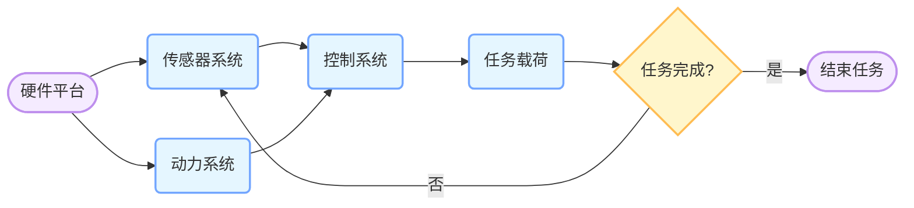

# 价值投资中的智能水下机器人系统分析

> 关键词：价值投资、智能水下机器人、系统分析、技术原理、应用场景

> 摘要：本文聚焦于价值投资视角下的智能水下机器人系统。旨在全面剖析智能水下机器人系统的各个方面，包括其核心概念、算法原理、数学模型等，并通过项目实战案例展示其具体实现过程。同时探讨该系统在不同实际场景中的应用，推荐相关的学习资源、开发工具和论文著作。最后总结智能水下机器人系统的未来发展趋势与挑战，为价值投资者和相关技术人员提供全面而深入的参考，助力其在该领域做出更明智的决策。

## 1. 背景介绍 
### 1.1 目的和范围
智能水下机器人作为一种前沿的水下探测与作业设备，在海洋资源开发、科学研究、军事防御等众多领域展现出巨大的应用潜力。从价值投资的角度来看，对智能水下机器人系统进行深入分析，有助于投资者了解该行业的技术发展现状、市场前景和潜在风险，从而做出更具前瞻性和战略性的投资决策。本文的范围涵盖智能水下机器人系统的技术原理、数学模型、实际应用场景等多个方面，旨在为价值投资者提供一个全面而系统的分析框架。

### 1.2 预期读者
本文预期读者主要包括价值投资者、对智能水下机器人技术感兴趣的技术人员、相关领域的研究学者以及关注海洋科技发展的人士。对于价值投资者而言，通过阅读本文可以深入了解智能水下机器人系统的投资价值和潜在风险；对于技术人员来说，能够获取该系统的详细技术原理和实现方法；研究学者可以从中获得新的研究思路和方向；而关注海洋科技发展的人士则可以了解智能水下机器人在海洋领域的重要作用和应用前景。

### 1.3 文档结构概述
本文将按照以下结构进行阐述：首先介绍智能水下机器人系统的背景知识，包括目的、预期读者和文档结构概述等；接着深入探讨其核心概念与联系，通过文本示意图和 Mermaid 流程图展示系统架构；然后详细讲解核心算法原理和具体操作步骤，并结合 Python 源代码进行说明；随后介绍数学模型和公式，并通过举例进行详细讲解；再通过项目实战案例展示代码的实际实现和详细解释；接着探讨智能水下机器人系统的实际应用场景；推荐相关的工具和资源；最后总结其未来发展趋势与挑战，并提供常见问题与解答以及扩展阅读和参考资料。

### 1.4 术语表
#### 1.4.1 核心术语定义
- **智能水下机器人（Autonomous Underwater Vehicle, AUV）**：一种能够在水下自主航行、执行各种任务的机器人，具备一定的智能决策和自主控制能力。
- **价值投资（Value Investing）**：一种投资策略，通过对资产的内在价值进行评估，寻找被低估的资产进行投资，以获取长期的投资回报。
- **水下定位系统（Underwater Positioning System）**：用于确定智能水下机器人在水下位置的系统，常见的有声学定位系统、惯性导航系统等。
- **传感器（Sensor）**：用于感知水下环境信息的设备，如声纳传感器、摄像头、深度传感器等。
- **路径规划（Path Planning）**：根据任务要求和水下环境信息，为智能水下机器人规划最优的航行路径。

#### 1.4.2 相关概念解释
- **自主控制**：智能水下机器人能够根据自身的传感器信息和预设的任务目标，自主地做出决策和控制自身的运动，无需人工实时干预。
- **多传感器融合**：将多个不同类型的传感器数据进行融合处理，以提高对水下环境信息的感知精度和可靠性。
- **海洋环境适应性**：智能水下机器人能够在复杂多变的海洋环境中正常工作，如不同的水深、水温、水流等条件下保持稳定的性能。

#### 1.4.3 缩略词列表
- **AUV**：Autonomous Underwater Vehicle（智能水下机器人）
- **INS**：Inertial Navigation System（惯性导航系统）
- **DVL**：Doppler Velocity Log（多普勒测速仪）
- **USBL**：Ultra-Short Baseline（超短基线定位系统）
- **LBL**：Long Baseline（长基线定位系统）

## 2. 核心概念与联系 

### 智能水下机器人系统的核心概念
智能水下机器人系统主要由硬件平台、传感器系统、控制系统、动力系统和任务载荷等部分组成。硬件平台是机器人的物理载体，为其他系统提供支撑和安装空间；传感器系统用于感知水下环境信息，包括位置、速度、深度、障碍物等；控制系统根据传感器信息和任务要求，对机器人的运动和行为进行决策和控制；动力系统为机器人提供航行所需的动力；任务载荷则根据不同的任务需求进行配置，如水下探测设备、采样设备等。

### 系统架构的文本示意图
智能水下机器人系统的架构可以描述为一个多层次的结构。最底层是硬件平台，包括船体、推进器、电池等物理组件；中间层是传感器系统和动力系统，传感器系统实时采集水下环境信息，动力系统为机器人的运动提供动力；再上一层是控制系统，它接收传感器数据，进行数据处理和分析，根据任务要求生成控制指令，控制动力系统的运行；最上层是任务载荷，根据具体任务进行配置，如进行海洋测绘、资源勘探、目标搜索等。

### Mermaid 流程图

该流程图展示了智能水下机器人系统的工作流程。硬件平台为整个系统提供基础支撑，传感器系统和动力系统将数据和动力信息传递给控制系统，控制系统根据这些信息控制任务载荷执行任务。在任务执行过程中，不断判断任务是否完成，如果未完成则继续循环执行，直到任务完成。

## 3. 核心算法原理 & 具体操作步骤 

### 路径规划算法原理
路径规划是智能水下机器人系统的核心算法之一，其目的是在水下环境中为机器人规划一条安全、高效的航行路径。常见的路径规划算法有 A* 算法、Dijkstra 算法、人工势场法等。这里以 A* 算法为例进行详细讲解。

A* 算法是一种启发式搜索算法，它结合了 Dijkstra 算法的最优性和贪心最佳优先搜索算法的高效性。A* 算法通过评估每个节点的代价函数 $f(n) = g(n) + h(n)$ 来选择下一个要扩展的节点，其中 $g(n)$ 是从起点到节点 $n$ 的实际代价，$h(n)$ 是从节点 $n$ 到目标节点的估计代价。

### Python 源代码实现
```python
import heapq

class Node:
    def __init__(self, x, y, g=float('inf'), h=float('inf'), parent=None):
        self.x = x
        self.y = y
        self.g = g
        self.h = h
        self.f = g + h
        self.parent = parent

    def __lt__(self, other):
        return self.f < other.f

def heuristic(node, goal):
    # 曼哈顿距离作为启发式函数
    return abs(node.x - goal.x) + abs(node.y - goal.y)

def a_star(grid, start, goal):
    rows, cols = len(grid), len(grid[0])
    open_list = []
    closed_set = set()

    start_node = Node(start[0], start[1], g=0, h=heuristic(Node(start[0], start[1]), Node(goal[0], goal[1])))
    heapq.heappush(open_list, start_node)

    while open_list:
        current_node = heapq.heappop(open_list)

        if current_node.x == goal[0] and current_node.y == goal[1]:
            path = []
            while current_node:
                path.append((current_node.x, current_node.y))
                current_node = current_node.parent
            return path[::-1]

        closed_set.add((current_node.x, current_node.y))

        neighbors = [(current_node.x + dx, current_node.y + dy) for dx, dy in [(0, 1), (0, -1), (1, 0), (-1, 0)]
                     if 0 <= current_node.x + dx < rows and 0 <= current_node.y + dy < cols and grid[current_node.x + dx][current_node.y + dy] == 0]

        for neighbor in neighbors:
            if neighbor in closed_set:
                continue

            tentative_g = current_node.g + 1
            neighbor_node = Node(neighbor[0], neighbor[1])
            if tentative_g < neighbor_node.g:
                neighbor_node.parent = current_node
                neighbor_node.g = tentative_g
                neighbor_node.h = heuristic(neighbor_node, Node(goal[0], goal[1]))
                neighbor_node.f = neighbor_node.g + neighbor_node.h
                heapq.heappush(open_list, neighbor_node)

    return None

# 示例使用
grid = [
    [0, 0, 0, 0],
    [0, 1, 0, 0],
    [0, 0, 0, 0],
    [0, 0, 0, 0]
]
start = (0, 0)
goal = (3, 3)
path = a_star(grid, start, goal)
print("路径:", path)
```
### 具体操作步骤
1. **初始化**：创建起点节点和目标节点，将起点节点加入开放列表。
2. **循环搜索**：从开放列表中选择 $f$ 值最小的节点作为当前节点。
3. **判断终止条件**：如果当前节点是目标节点，则路径规划完成，回溯生成路径。
4. **扩展节点**：找到当前节点的相邻节点，计算相邻节点的 $g$、$h$ 和 $f$ 值。
5. **更新开放列表**：将未在关闭列表中的相邻节点加入开放列表。
6. **重复步骤 2 - 5**：直到开放列表为空或找到目标节点。

## 4. 数学模型和公式 & 详细讲解 & 举例说明 

### 水下机器人运动模型
智能水下机器人的运动可以用牛顿第二定律来描述。在二维平面上，机器人的运动方程可以表示为：

$$m\ddot{x} = F_x$$
$$m\ddot{y} = F_y$$

其中 $m$ 是机器人的质量，$\ddot{x}$ 和 $\ddot{y}$ 分别是机器人在 $x$ 和 $y$ 方向上的加速度，$F_x$ 和 $F_y$ 分别是机器人在 $x$ 和 $y$ 方向上受到的合力。

### 定位误差模型
水下定位系统存在一定的误差，常见的误差模型有高斯误差模型。假设定位误差 $\epsilon$ 服从均值为 $\mu$、方差为 $\sigma^2$ 的高斯分布，即：

$$\epsilon \sim N(\mu, \sigma^2)$$

### 举例说明
假设一个智能水下机器人的质量 $m = 100$ kg，在 $x$ 方向上受到的合力 $F_x = 50$ N，在 $y$ 方向上受到的合力 $F_y = 30$ N。根据牛顿第二定律，可以计算出机器人在 $x$ 和 $y$ 方向上的加速度：

$$\ddot{x} = \frac{F_x}{m} = \frac{50}{100} = 0.5 \ m/s^2$$
$$\ddot{y} = \frac{F_y}{m} = \frac{30}{100} = 0.3 \ m/s^2$$

假设水下定位系统的定位误差服从均值 $\mu = 0$、方差 $\sigma^2 = 1$ 的高斯分布，那么在进行定位时，实际测量值 $z$ 可以表示为真实值 $x$ 加上误差 $\epsilon$，即：

$$z = x + \epsilon$$

例如，真实位置 $x = 10$ m，根据高斯分布随机生成一个误差值 $\epsilon = 0.5$ m，则测量值 $z = 10 + 0.5 = 10.5$ m。

## 5. 项目实战：代码实际案例和详细解释说明 

### 5.1  开发环境搭建
- **操作系统**：推荐使用 Ubuntu 18.04 或更高版本的 Linux 系统，因为 Linux 系统在开发和调试过程中具有更好的稳定性和兼容性。
- **编程语言**：使用 Python 3.6 或更高版本，Python 具有丰富的库和工具，适合快速开发智能水下机器人系统。
- **开发工具**：使用 PyCharm 作为集成开发环境（IDE），它提供了强大的代码编辑、调试和版本控制功能。
- **相关库**：安装 NumPy、SciPy、OpenCV 等库，用于数据处理、科学计算和图像处理。

### 5.2  源代码详细实现和代码解读
以下是一个简单的智能水下机器人模拟项目的源代码，该项目实现了机器人的路径规划和运动控制功能。

```python
import numpy as np
import matplotlib.pyplot as plt

# 定义水下环境地图
grid = np.array([
    [0, 0, 0, 0],
    [0, 1, 0, 0],
    [0, 0, 0, 0],
    [0, 0, 0, 0]
])

# 定义起点和目标点
start = (0, 0)
goal = (3, 3)

# 路径规划函数（使用 A* 算法）
def heuristic(node, goal):
    return abs(node[0] - goal[0]) + abs(node[1] - goal[1])

def a_star(grid, start, goal):
    open_list = []
    closed_set = set()
    g_scores = {start: 0}
    f_scores = {start: heuristic(start, goal)}
    came_from = {}

    open_list.append((f_scores[start], start))

    while open_list:
        _, current = min(open_list)
        open_list = [item for item in open_list if item[1] != current]

        if current == goal:
            path = []
            while current in came_from:
                path.append(current)
                current = came_from[current]
            path.append(start)
            path.reverse()
            return path

        closed_set.add(current)

        neighbors = [(current[0] + dx, current[1] + dy) for dx, dy in [(0, 1), (0, -1), (1, 0), (-1, 0)]
                     if 0 <= current[0] + dx < grid.shape[0] and 0 <= current[1] + dy < grid.shape[1] and grid[current[0] + dx][current[1] + dy] == 0]

        for neighbor in neighbors:
            if neighbor in closed_set:
                continue

            tentative_g_score = g_scores[current] + 1

            if neighbor not in [item[1] for item in open_list]:
                open_list.append((tentative_g_score + heuristic(neighbor, goal), neighbor))
            elif tentative_g_score >= g_scores.get(neighbor, float('inf')):
                continue

            came_from[neighbor] = current
            g_scores[neighbor] = tentative_g_score
            f_scores[neighbor] = tentative_g_score + heuristic(neighbor, goal)

    return None

# 运动控制函数
def move_robot(path):
    positions = []
    for point in path:
        positions.append(point)
    return positions

# 执行路径规划和运动控制
path = a_star(grid, start, goal)
if path:
    positions = move_robot(path)
    print("路径:", path)
    print("机器人运动轨迹:", positions)

    # 可视化结果
    plt.imshow(grid, cmap='gray')
    x = [point[1] for point in positions]
    y = [point[0] for point in positions]
    plt.plot(x, y, 'r-', linewidth=2)
    plt.scatter(start[1], start[0], c='g', marker='o', s=100)
    plt.scatter(goal[1], goal[0], c='b', marker='o', s=100)
    plt.show()
else:
    print("未找到路径")
```
### 代码解读与分析
1. **环境地图定义**：使用 `numpy` 数组定义水下环境地图，其中 `0` 表示可通行区域，`1` 表示障碍物。
2. **路径规划**：使用 A* 算法进行路径规划，通过启发式函数评估每个节点的代价，选择最优路径。
3. **运动控制**：根据规划好的路径，模拟机器人的运动，记录机器人的运动轨迹。
4. **可视化**：使用 `matplotlib` 库将水下环境地图、起点、目标点和机器人的运动轨迹进行可视化展示。

## 6. 实际应用场景 
### 海洋资源勘探
智能水下机器人可以携带各种探测设备，如声纳、磁力仪等，对海底的矿产资源、油气资源等进行勘探。通过对水下环境的详细探测和数据分析，可以准确地确定资源的分布和储量，为海洋资源的开发提供重要依据。

### 海洋科学研究
在海洋科学研究中，智能水下机器人可以用于观测海洋生态系统、监测海洋环境变化等。例如，它可以携带水质传感器、生物探测器等设备，对海洋中的水温、盐度、溶解氧、生物种类和数量等进行实时监测，为海洋科学研究提供大量的数据支持。

### 军事防御
在军事领域，智能水下机器人可以用于水下侦察、反潜作战、水雷探测等任务。它可以在水下长时间自主航行，对敌方潜艇、水雷等目标进行探测和跟踪，为军事防御提供重要的情报支持。

### 水下工程维护
智能水下机器人可以用于水下工程设施的维护和检修，如海底管道、海洋平台等。它可以携带各种工具和设备，对水下设施进行检查、维修和更换零部件，提高水下工程的安全性和可靠性。

## 7. 工具和资源推荐
### 7.1 学习资源推荐
#### 7.1.1 书籍推荐
- 《机器人学导论》：全面介绍了机器人学的基本概念、运动学、动力学、控制等方面的知识，是学习机器人技术的经典教材。
- 《智能水下机器人技术》：专门针对智能水下机器人系统进行了详细的阐述，包括其设计、开发、控制和应用等方面的内容。
- 《海洋技术概论》：介绍了海洋科学和技术的各个方面，包括海洋探测、海洋资源开发、海洋环境保护等，为了解智能水下机器人在海洋领域的应用提供了基础。

#### 7.1.2 在线课程
- Coursera 上的“机器人学基础”课程：由知名高校的教授授课，系统地介绍了机器人学的基础知识和应用。
- edX 上的“水下机器人技术”课程：深入讲解了智能水下机器人的设计、开发和控制技术。
- 中国大学 MOOC 上的“海洋技术与工程”课程：涵盖了海洋科学和技术的多个领域，包括智能水下机器人的相关内容。

#### 7.1.3 技术博客和网站
- IEEE Xplore：提供了大量关于机器人技术、海洋技术等领域的学术论文和研究报告。
- ScienceDirect：收录了众多科学和技术领域的期刊文章，包括智能水下机器人的最新研究成果。
- 机器人技术网：专注于机器人技术的资讯和技术交流，提供了丰富的智能水下机器人相关的技术文章和案例。

### 7.2 开发工具框架推荐
#### 7.2.1 IDE和编辑器
- PyCharm：功能强大的 Python 集成开发环境，提供了代码编辑、调试、版本控制等丰富的功能。
- Visual Studio Code：轻量级的代码编辑器，支持多种编程语言，具有丰富的插件扩展功能。
- Sublime Text：简洁高效的文本编辑器，适合快速编写代码。

#### 7.2.2 调试和性能分析工具
- GDB：强大的调试工具，可用于调试 C、C++ 等语言编写的程序。
- Profiler：Python 内置的性能分析工具，可用于分析程序的性能瓶颈。
- Valgrind：内存调试和性能分析工具，可用于检测内存泄漏和优化程序性能。

#### 7.2.3 相关框架和库
- ROS（Robot Operating System）：开源的机器人操作系统，提供了丰富的机器人开发工具和库，可用于智能水下机器人的开发。
- OpenCV：开源的计算机视觉库，可用于处理水下机器人的图像和视频数据。
- NumPy 和 SciPy：用于科学计算和数据处理的 Python 库，在智能水下机器人的算法实现中具有重要作用。

### 7.3 相关论文著作推荐
#### 7.3.1 经典论文
- “Autonomous Underwater Vehicles: A Review of Recent Developments”：对智能水下机器人的发展历程、关键技术和应用领域进行了全面的回顾和总结。
- “Path Planning Algorithms for Autonomous Underwater Vehicles”：详细介绍了智能水下机器人的路径规划算法，包括 A* 算法、Dijkstra 算法等。
- “Multi-Sensor Fusion for Underwater Navigation”：探讨了多传感器融合技术在水下导航中的应用，提高了智能水下机器人的定位精度和可靠性。

#### 7.3.2 最新研究成果
- 关注 IEEE Journal of Oceanic Engineering、Journal of Field Robotics 等期刊，这些期刊发表了智能水下机器人领域的最新研究成果。
- 参加国际水下机器人竞赛和学术会议，如 IEEE OCEANS、AUVSI RoboSub 等，了解最新的技术动态和研究趋势。

#### 7.3.3 应用案例分析
- 研究一些实际的智能水下机器人应用案例，如 Bluefin Robotics 的 AUV 在海洋资源勘探中的应用、Saab Seaeye 的水下机器人在水下工程维护中的应用等，从中学习其设计思路和应用经验。

## 8. 总结：未来发展趋势与挑战
### 未来发展趋势
- **智能化程度不断提高**：随着人工智能技术的不断发展，智能水下机器人将具备更强的自主决策和学习能力，能够更好地适应复杂多变的水下环境。
- **多功能集成化**：未来的智能水下机器人将集成更多的功能和设备，如水下探测、采样、维修等，实现一站式的水下作业。
- **集群协作**：多个智能水下机器人可以组成集群，通过协作完成更复杂的任务，如大面积的海洋测绘、大规模的资源勘探等。
- **与其他技术融合**：智能水下机器人将与物联网、大数据、云计算等技术深度融合，实现水下数据的实时传输和处理，提高水下作业的效率和质量。

### 挑战
- **水下环境的复杂性**：水下环境具有高压、低温、黑暗、水流复杂等特点，对智能水下机器人的材料、结构和性能提出了很高的要求。
- **通信和定位难题**：水下通信存在信号衰减、延迟大等问题，定位精度也受到水下环境的影响，这给智能水下机器人的远程控制和导航带来了困难。
- **能源供应问题**：智能水下机器人需要长时间在水下工作，能源供应是一个关键问题。目前的电池技术还无法满足其长时间作业的需求，需要开发更高效的能源供应系统。
- **伦理和法律问题**：随着智能水下机器人的广泛应用，涉及到的伦理和法律问题也日益凸显，如隐私保护、责任界定等，需要建立相应的法律法规和道德准则。

## 9. 附录：常见问题与解答
### 问题 1：智能水下机器人的续航时间一般有多长？
答：智能水下机器人的续航时间取决于多种因素，如电池容量、动力系统效率、任务载荷功耗等。一般来说，小型智能水下机器人的续航时间在几小时到十几小时不等，大型智能水下机器人的续航时间可以达到几十小时甚至更长。

### 问题 2：智能水下机器人在水下是如何定位的？
答：智能水下机器人常用的定位方法有声学定位、惯性导航、卫星定位等。声学定位是通过水下声学信号来确定机器人的位置，惯性导航则是利用惯性传感器测量机器人的加速度和角速度来推算其位置，卫星定位主要用于机器人在水面时的定位。

### 问题 3：智能水下机器人的成本高吗？
答：智能水下机器人的成本因类型、功能、性能等因素而异。一般来说，小型、功能简单的智能水下机器人成本相对较低，而大型、功能复杂的智能水下机器人成本较高。此外，研发、制造、维护等环节也会增加其成本。

### 问题 4：智能水下机器人可以在深海中工作吗？
答：部分智能水下机器人可以在深海中工作，但需要具备相应的耐压、耐腐蚀等性能。深海环境对机器人的材料、结构和密封等方面提出了更高的要求，需要采用特殊的设计和技术来确保机器人在深海中的正常工作。

## 10. 扩展阅读 & 参考资料
### 扩展阅读
- 《海洋机器人》：深入探讨了海洋机器人的技术原理、应用领域和发展趋势，为进一步了解智能水下机器人提供了更广阔的视角。
- 《水下航行器技术》：详细介绍了水下航行器的设计、制造和控制技术，对智能水下机器人的研究和开发具有重要的参考价值。

### 参考资料
- IEEE 相关论文和技术报告
- 各智能水下机器人制造商的产品手册和技术文档
- 国内外相关学术期刊和会议论文集