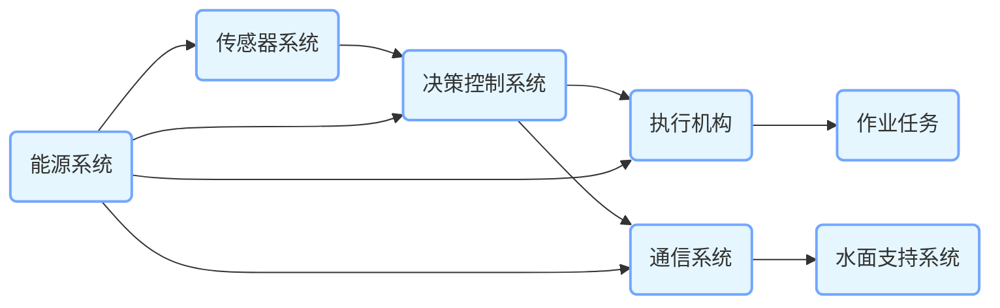

# 价值投资中的深海采矿机器人技术前景

> 关键词：价值投资、深海采矿机器人、技术前景、海洋资源、可持续发展

> 摘要：本文聚焦于价值投资视角下的深海采矿机器人技术前景。首先介绍了深海采矿机器人技术的背景，包括目的范围、预期读者等内容。接着深入剖析核心概念与联系，阐述其工作原理和架构。通过Python代码详细讲解核心算法原理及操作步骤，并给出相关数学模型和公式。以实际项目为例，展示代码实现和解读。探讨了该技术的实际应用场景，推荐了相关的学习资源、开发工具框架和论文著作。最后总结其未来发展趋势与挑战，解答常见问题并提供扩展阅读和参考资料，旨在为价值投资者全面呈现深海采矿机器人技术的潜力和发展方向。

## 1. 背景介绍 
### 1.1 目的和范围
深海采矿机器人技术作为一种新兴的前沿科技，正逐渐引起全球范围内的广泛关注。本文章的目的在于从价值投资的角度，全面且深入地探讨深海采矿机器人技术的发展前景。范围涵盖该技术的基本原理、核心算法、数学模型、实际应用场景，以及与之相关的学习资源、开发工具和研究成果等多个方面。通过对这些内容的详细分析，为价值投资者提供决策依据，帮助他们更好地评估该技术在投资领域的潜在价值。

### 1.2 预期读者
本文预期读者主要包括对价值投资有兴趣的个人投资者、专业投资机构的分析师和决策者、从事深海采矿机器人技术研发的科研人员、相关领域的行业从业者以及对新兴科技发展趋势关注的研究人员等。这些读者希望通过本文深入了解深海采矿机器人技术的技术细节和市场潜力，以便在投资决策、技术研发或行业研究等方面做出更明智的选择。

### 1.3 文档结构概述
本文将按照以下结构展开：首先介绍深海采矿机器人技术的背景信息，包括目的、预期读者和文档结构概述等。接着阐述核心概念与联系，通过文本示意图和Mermaid流程图清晰展示其原理和架构。然后详细讲解核心算法原理及具体操作步骤，使用Python源代码进行说明。再给出数学模型和公式，并举例说明。通过实际项目案例，展示代码实现和解读。探讨该技术的实际应用场景，推荐相关的学习资源、开发工具框架和论文著作。最后总结未来发展趋势与挑战，解答常见问题并提供扩展阅读和参考资料。

### 1.4 术语表
#### 1.4.1 核心术语定义
- **深海采矿机器人**：一种专门设计用于深海环境下进行采矿作业的智能化机器人系统，具备在高压、低温、黑暗等极端条件下工作的能力，能够完成矿石采集、运输等任务。
- **价值投资**：一种投资策略，强调通过对资产的内在价值进行评估，寻找被低估的投资机会，以实现长期的投资回报。
- **海洋资源**：指蕴藏在海洋中的各种自然资源，包括矿产资源、生物资源、能源资源等。
- **自治水下航行器（AUV）**：一种能够自主执行任务的水下机器人，无需人工实时干预，可在预定的路线和任务范围内独立工作。
- **遥控水下航行器（ROV）**：通过电缆与水面支持系统连接，由操作人员远程控制的水下机器人，可进行复杂的作业任务。

#### 1.4.2 相关概念解释
- **深海环境**：指海洋中深度超过200米的区域，该区域具有高压、低温、黑暗、水流复杂等特点，对机器人的设计和性能提出了极高的要求。
- **采矿作业**：包括矿石的勘探、开采、采集、运输等一系列过程，深海采矿作业由于环境的特殊性，需要采用特殊的技术和设备。
- **机器人智能化**：指机器人具备感知、决策、执行等多种智能能力，能够根据环境变化自主调整行为，提高作业效率和安全性。

#### 1.4.3 缩略词列表
- **AUV**：Autonomous Underwater Vehicle（自治水下航行器）
- **ROV**：Remotely Operated Vehicle（遥控水下航行器）
- **GPS**：Global Positioning System（全球定位系统）
- **SONAR**：Sound Navigation and Ranging（声呐）

## 2. 核心概念与联系 

### 核心概念原理
深海采矿机器人的核心概念基于机器人技术、自动化控制技术、海洋工程技术等多学科的融合。其工作原理是通过各种传感器感知深海环境信息，如声呐用于探测海底地形和目标物体，压力传感器用于监测深海压力变化等。机器人根据这些感知信息，结合预设的任务规划和算法，自主或在操作人员的控制下完成采矿作业。

机器人的机械结构设计需要考虑深海环境的特殊性，采用高强度、耐腐蚀的材料，以确保在高压和海水腐蚀的条件下正常工作。动力系统则要满足机器人在深海中的长时间作业需求，通常采用电池或燃料电池等能源。

### 架构的文本示意图
深海采矿机器人系统主要由以下几个部分组成：
- **传感器系统**：包括声呐、摄像头、压力传感器、温度传感器等，用于感知深海环境信息。
- **决策控制系统**：接收传感器数据，进行分析和处理，根据预设的算法和任务规划做出决策，控制机器人的运动和作业动作。
- **执行机构**：包括机械臂、采矿工具、推进器等，用于执行具体的采矿作业任务。
- **通信系统**：实现机器人与水面支持系统之间的数据传输和通信，确保操作人员能够实时掌握机器人的状态和作业情况。
- **能源系统**：为机器人提供动力，保证其在深海环境中正常工作。

### Mermaid 流程图


该流程图展示了深海采矿机器人系统的工作流程。传感器系统将感知到的环境信息传输给决策控制系统，决策控制系统根据这些信息做出决策，控制执行机构完成作业任务。同时，通信系统负责机器人与水面支持系统之间的通信，能源系统为整个系统提供动力支持。

## 3. 核心算法原理 & 具体操作步骤 

### 核心算法原理
深海采矿机器人的核心算法包括路径规划算法、目标识别算法和作业控制算法等。下面以路径规划算法为例，详细介绍其原理。

路径规划算法的主要目标是在复杂的深海环境中，为机器人规划一条安全、高效的作业路径。常用的路径规划算法有A*算法、Dijkstra算法等。这里我们选择A*算法进行讲解。

A*算法是一种启发式搜索算法，它结合了Dijkstra算法的最优性和贪心最佳优先搜索算法的高效性。A*算法通过评估每个节点的代价函数 $f(n) = g(n) + h(n)$ 来选择下一个要扩展的节点，其中 $g(n)$ 是从起点到节点 $n$ 的实际代价，$h(n)$ 是从节点 $n$ 到目标节点的启发式估计代价。

### Python源代码实现
```python
import heapq

def heuristic(a, b):
    # 曼哈顿距离作为启发式函数
    return abs(a[0] - b[0]) + abs(a[1] - b[1])

def a_star(array, start, goal):
    neighbors = [(0, 1), (0, -1), (1, 0), (-1, 0)]
    close_set = set()
    came_from = {}
    gscore = {start: 0}
    fscore = {start: heuristic(start, goal)}
    oheap = []

    heapq.heappush(oheap, (fscore[start], start))

    while oheap:
        current = heapq.heappop(oheap)[1]

        if current == goal:
            data = []
            while current in came_from:
                data.append(current)
                current = came_from[current]
            return data

        close_set.add(current)
        for i, j in neighbors:
            neighbor = current[0] + i, current[1] + j
            tentative_g_score = gscore[current] + heuristic(current, neighbor)
            if 0 <= neighbor[0] < len(array):
                if 0 <= neighbor[1] < len(array[0]):
                    if array[neighbor[0]][neighbor[1]] == 1:
                        continue
                else:
                    # 越界
                    continue
            else:
                # 越界
                continue

            if neighbor in close_set and tentative_g_score >= gscore.get(neighbor, 0):
                continue

            if tentative_g_score < gscore.get(neighbor, 0) or neighbor not in [i[1] for i in oheap]:
                came_from[neighbor] = current
                gscore[neighbor] = tentative_g_score
                fscore[neighbor] = tentative_g_score + heuristic(neighbor, goal)
                heapq.heappush(oheap, (fscore[neighbor], neighbor))

    return None

# 示例地图
map_array = [
    [0, 0, 0, 0],
    [0, 1, 0, 0],
    [0, 0, 0, 0],
    [0, 0, 0, 0]
]

start_point = (0, 0)
goal_point = (3, 3)

path = a_star(map_array, start_point, goal_point)
if path:
    path.reverse()
    print("找到路径:", path)
else:
    print("未找到路径")
```

### 具体操作步骤
1. **地图表示**：将深海环境抽象为一个二维数组，其中0表示可通行区域，1表示障碍物。
2. **起点和目标点设定**：确定机器人的起始位置和目标位置。
3. **初始化**：初始化开放列表、关闭列表、代价函数等数据结构。
4. **节点扩展**：从开放列表中选择 $f(n)$ 值最小的节点进行扩展，计算其相邻节点的代价函数值。
5. **节点更新**：如果相邻节点的代价函数值更小，则更新其代价函数值和父节点。
6. **目标判断**：如果扩展的节点是目标节点，则找到路径，回溯生成路径；否则，继续扩展节点，直到开放列表为空。

## 4. 数学模型和公式 & 详细讲解 & 举例说明 

### 数学模型
深海采矿机器人的数学模型主要涉及运动学模型、动力学模型和环境感知模型等。这里我们以运动学模型为例进行讲解。

运动学模型描述了机器人的位置、速度和加速度之间的关系。对于一个二维平面上的机器人，其运动学模型可以用以下方程表示：

$$
\begin{cases}
x_{t+1} = x_t + v_t \cos(\theta_t) \Delta t \\
y_{t+1} = y_t + v_t \sin(\theta_t) \Delta t \\
\theta_{t+1} = \theta_t + \omega_t \Delta t
\end{cases}
$$

其中，$(x_t, y_t)$ 是机器人在时刻 $t$ 的位置，$\theta_t$ 是机器人的朝向，$v_t$ 是机器人的线速度，$\omega_t$ 是机器人的角速度，$\Delta t$ 是时间步长。

### 详细讲解
上述运动学模型基于机器人的线速度和角速度来计算其下一时刻的位置和朝向。$x_{t+1}$ 和 $y_{t+1}$ 分别是机器人在 $x$ 和 $y$ 方向上的下一时刻位置，通过当前位置、线速度和朝向计算得到。$\theta_{t+1}$ 是机器人的下一时刻朝向，通过当前朝向和角速度计算得到。

### 举例说明
假设机器人在初始时刻 $t = 0$ 的位置为 $(x_0, y_0) = (0, 0)$，朝向 $\theta_0 = 0$，线速度 $v_0 = 1$ m/s，角速度 $\omega_0 = 0$，时间步长 $\Delta t = 1$ s。

根据运动学模型，在 $t = 1$ 时刻：
$$
\begin{cases}
x_1 = x_0 + v_0 \cos(\theta_0) \Delta t = 0 + 1 \times \cos(0) \times 1 = 1 \\
y_1 = y_0 + v_0 \sin(\theta_0) \Delta t = 0 + 1 \times \sin(0) \times 1 = 0 \\
\theta_1 = \theta_0 + \omega_0 \Delta t = 0 + 0 \times 1 = 0
\end{cases}
$$

因此，机器人在 $t = 1$ 时刻的位置为 $(1, 0)$，朝向为 $0$。

## 5. 项目实战：代码实际案例和详细解释说明 

### 5.1  开发环境搭建
#### 硬件环境
- **计算机**：建议使用性能较高的台式机或笔记本电脑，具备足够的内存和处理能力。
- **水下机器人平台**：选择适合深海采矿作业的水下机器人，如自治水下航行器（AUV）或遥控水下航行器（ROV）。
- **传感器设备**：配备声呐、摄像头、压力传感器、温度传感器等各种传感器，用于感知深海环境信息。

#### 软件环境
- **操作系统**：推荐使用Linux系统，如Ubuntu，其具有良好的开源性和稳定性。
- **编程语言**：Python是开发深海采矿机器人软件的首选语言，其具有丰富的库和工具，易于开发和调试。
- **开发框架**：ROS（Robot Operating System）是一个广泛使用的机器人开发框架，提供了丰富的功能和工具，可用于机器人的控制、通信和传感器数据处理等。

### 5.2  源代码详细实现和代码解读
以下是一个简单的深海采矿机器人控制代码示例，使用Python和ROS实现：

```python
#!/usr/bin/env python
import rospy
from geometry_msgs.msg import Twist

def robot_control():
    # 初始化ROS节点
    rospy.init_node('robot_control_node', anonymous=True)
    # 创建一个发布者，发布机器人的速度指令
    pub = rospy.Publisher('/cmd_vel', Twist, queue_size=10)
    # 设置发布频率
    rate = rospy.Rate(10)  # 10 Hz

    while not rospy.is_shutdown():
        # 创建一个Twist消息对象
        twist_msg = Twist()
        # 设置线速度和角速度
        twist_msg.linear.x = 0.5  # 线速度为0.5 m/s
        twist_msg.angular.z = 0.1  # 角速度为0.1 rad/s

        # 发布速度指令
        pub.publish(twist_msg)
        # 按照设定的频率休眠
        rate.sleep()

if __name__ == '__main__':
    try:
        robot_control()
    except rospy.ROSInterruptException:
        pass
```

### 代码解读与分析
1. **节点初始化**：使用 `rospy.init_node` 函数初始化ROS节点，节点名称为 `robot_control_node`。
2. **发布者创建**：使用 `rospy.Publisher` 函数创建一个发布者，发布机器人的速度指令到 `/cmd_vel` 话题。
3. **发布频率设置**：使用 `rospy.Rate` 函数设置发布频率为10 Hz。
4. **速度指令发布**：在循环中创建一个 `Twist` 消息对象，设置线速度和角速度，然后使用发布者发布速度指令。
5. **异常处理**：使用 `try-except` 语句捕获 `rospy.ROSInterruptException` 异常，确保程序在接收到中断信号时能够正常退出。

## 6. 实际应用场景 
### 海底矿产资源开采
深海中蕴藏着丰富的矿产资源，如多金属结核、富钴结壳、热液硫化物等。深海采矿机器人可以在这些复杂的海底环境中进行勘探和开采作业，将矿石采集并运输到水面支持系统。与传统的采矿方式相比，深海采矿机器人具有更高的效率和安全性，能够减少对环境的影响。

### 海洋科学研究
深海采矿机器人可以携带各种科学仪器，用于海洋科学研究。例如，它可以采集海底的生物样本、水样和沉积物样本，帮助科学家了解海洋生态系统的结构和功能。同时，机器人还可以监测海洋环境的变化，如水温、盐度、压力等，为海洋科学研究提供重要的数据支持。

### 海洋工程建设
在海洋工程建设中，深海采矿机器人可以用于海底管道的铺设、维修和检测等任务。它可以在水下环境中精确操作，确保管道的安全和稳定运行。此外，机器人还可以用于海洋平台的安装和维护，提高海洋工程建设的效率和质量。

### 军事应用
深海采矿机器人在军事领域也具有重要的应用价值。它可以用于水下侦察、反潜作战、水下设施的维护和保护等任务。机器人的高机动性和隐蔽性使其能够在复杂的水下环境中执行各种军事任务，提高军队的作战能力。

## 7. 工具和资源推荐
### 7.1 学习资源推荐
#### 7.1.1 书籍推荐
- 《机器人学导论》：全面介绍了机器人的基本概念、运动学、动力学、控制等方面的知识，是学习机器人技术的经典教材。
- 《深海工程》：详细介绍了深海环境的特点、深海工程的技术和装备，以及深海资源开发的现状和前景。
- 《Python机器人编程实战》：通过实际案例介绍了如何使用Python进行机器人编程，包括机器人的控制、传感器数据处理、路径规划等方面的内容。

#### 7.1.2 在线课程
- Coursera上的“机器人学基础”课程：由知名大学的教授授课，系统地介绍了机器人学的基本原理和方法。
- edX上的“深海工程与技术”课程：讲解了深海工程的相关技术和应用，包括深海采矿、海洋能源开发等方面的内容。
- Udemy上的“Python机器人编程入门”课程：适合初学者学习，通过实践项目帮助学员掌握Python机器人编程的基本技能。

#### 7.1.3 技术博客和网站
- ROS官方网站：提供了ROS的详细文档、教程和社区资源，是学习和使用ROS的重要参考网站。
- IEEE Xplore：收录了大量的电气和电子工程领域的学术论文，包括机器人技术、海洋工程等方面的研究成果。
- Robotics Business Review：关注机器人行业的最新动态和发展趋势，提供了丰富的行业资讯和分析报告。

### 7.2 开发工具框架推荐
#### 7.2.1 IDE和编辑器
- PyCharm：一款专业的Python集成开发环境，提供了丰富的代码编辑、调试和版本控制等功能，适合开发深海采矿机器人的Python代码。
- Visual Studio Code：一款轻量级的代码编辑器，支持多种编程语言和插件，具有良好的扩展性和用户体验。
- Eclipse：一款功能强大的集成开发环境，支持多种编程语言和开发框架，可用于开发复杂的机器人软件系统。

#### 7.2.2 调试和性能分析工具
- GDB：一款强大的调试工具，可用于调试C、C++等编程语言编写的机器人软件。
- Valgrind：一款内存调试和性能分析工具，可用于检测机器人软件中的内存泄漏和性能瓶颈。
- ROS的调试工具：ROS提供了一系列的调试工具，如rqt_graph、rqt_plot等，可用于可视化机器人系统的结构和性能。

#### 7.2.3 相关框架和库
- ROS（Robot Operating System）：一个广泛使用的机器人开发框架，提供了丰富的功能和工具，可用于机器人的控制、通信和传感器数据处理等。
- OpenCV：一个开源的计算机视觉库，可用于机器人的视觉处理和目标识别等任务。
- NumPy和SciPy：Python的科学计算库，提供了丰富的数学和科学计算功能，可用于机器人的运动学、动力学计算等。

### 7.3 相关论文著作推荐
#### 7.3.1 经典论文
- “A* Search Algorithm”：介绍了A*算法的基本原理和应用，是路径规划领域的经典论文。
- “The Dynamics of Robotic Manipulators”：详细推导了机器人的动力学模型，为机器人的控制和运动规划提供了理论基础。
- “Underwater Robotics: Technology and Applications”：综述了水下机器人的技术和应用，包括深海采矿机器人的发展现状和趋势。

#### 7.3.2 最新研究成果
- 关注IEEE Robotics and Automation Letters、Journal of Field Robotics等学术期刊，这些期刊发表了大量关于机器人技术和海洋工程的最新研究成果。
- 参加国际机器人学术会议，如ICRA（International Conference on Robotics and Automation）、IROS（International Conference on Intelligent Robots and Systems）等，了解最新的研究动态和技术趋势。

#### 7.3.3 应用案例分析
- 查阅相关的行业报告和案例分析，了解深海采矿机器人在实际应用中的成功案例和经验教训。例如，国际海底管理局发布的关于深海采矿的报告，以及一些知名企业的深海采矿项目案例。

## 8. 总结：未来发展趋势与挑战
### 未来发展趋势
- **智能化程度不断提高**：未来的深海采矿机器人将具备更高的智能化水平，能够自主感知环境、决策和执行任务。例如，机器人可以通过深度学习算法进行目标识别和路径规划，提高作业效率和安全性。
- **多功能一体化**：深海采矿机器人将朝着多功能一体化的方向发展，集勘探、开采、运输等多种功能于一体。这样可以减少设备的数量和成本，提高作业效率。
- **与其他技术的融合**：深海采矿机器人将与人工智能、物联网、大数据等技术深度融合，实现远程监控、智能调度和数据分析等功能。例如，通过物联网技术可以实时监测机器人的状态和作业环境，通过大数据分析可以优化机器人的作业策略。
- **可持续发展**：随着人们对环境保护意识的提高，未来的深海采矿机器人将更加注重可持续发展。例如，采用环保型的采矿技术和设备，减少对海洋生态环境的影响。

### 挑战
- **深海环境的复杂性**：深海环境具有高压、低温、黑暗、水流复杂等特点，对机器人的设计和性能提出了极高的要求。如何提高机器人在深海环境中的可靠性和稳定性，是目前面临的主要挑战之一。
- **能源供应问题**：深海采矿机器人需要长时间在水下作业，能源供应是一个关键问题。目前，机器人主要采用电池或燃料电池等能源，但这些能源的续航能力有限。如何开发高效、可持续的能源供应系统，是未来需要解决的重要问题。
- **法律和政策问题**：深海采矿涉及到国际海洋法、环境保护等多个领域的法律和政策问题。如何制定合理的法律和政策，规范深海采矿行为，保护海洋生态环境，是目前面临的重要挑战之一。
- **技术创新和人才培养**：深海采矿机器人技术是一个新兴的前沿领域，需要不断进行技术创新和人才培养。目前，该领域的技术人才相对匮乏，如何吸引和培养更多的专业人才，是推动该技术发展的关键。

## 9. 附录：常见问题与解答
### 1. 深海采矿机器人的工作深度一般是多少？
深海采矿机器人的工作深度因不同的型号和设计而异。一般来说，其工作深度可以达到数千米甚至更深。例如，一些先进的深海采矿机器人可以在6000米甚至10000米的深海环境中工作。

### 2. 深海采矿机器人的使用寿命有多长？
深海采矿机器人的使用寿命受到多种因素的影响，如工作环境、使用频率、维护保养等。一般来说，经过良好维护和保养的深海采矿机器人，其使用寿命可以达到5 - 10年甚至更长。

### 3. 深海采矿机器人的成本高吗？
深海采矿机器人的研发、制造和维护成本相对较高。这是因为其需要采用特殊的材料和技术，以适应深海环境的要求。同时，机器人的研发和测试也需要投入大量的人力和物力。然而，随着技术的不断进步和规模效应的显现，其成本有望逐渐降低。

### 4. 深海采矿机器人对海洋环境有哪些影响？
深海采矿机器人在作业过程中可能会对海洋环境产生一定的影响，如扰动海底沉积物、产生噪音和废弃物等。然而，通过采用先进的采矿技术和设备，以及合理的作业规划和环境监测措施，可以将这些影响降到最低。

### 5. 如何保证深海采矿机器人的安全性？
为了保证深海采矿机器人的安全性，需要采取一系列的措施。例如，在设计阶段进行严格的安全评估和测试，采用冗余设计和故障诊断技术，确保机器人在出现故障时能够自动采取安全措施。同时，在作业过程中，需要进行实时的监控和数据传输，及时发现和处理潜在的安全隐患。

## 10. 扩展阅读 & 参考资料
### 扩展阅读
- 《海洋机器人技术》：深入介绍了海洋机器人的技术原理和应用，包括深海采矿机器人、水下航行器等。
- 《未来海洋资源开发趋势》：探讨了未来海洋资源开发的趋势和挑战，包括深海采矿、海洋能源开发等方面的内容。
- 《人工智能在海洋领域的应用》：介绍了人工智能技术在海洋领域的应用，如海洋环境监测、海洋生物识别等。

### 参考资料
- 国际海底管理局相关报告和文件
- IEEE Transactions on Robotics、Journal of Marine Science and Engineering等学术期刊上的相关论文
- 各深海采矿机器人研发企业和科研机构的官方网站和技术文档