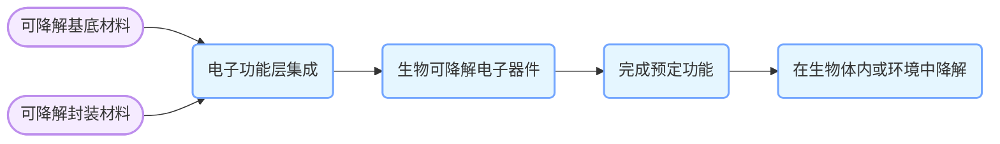

# 价值投资中的生物可降解电子器件技术前景

> 关键词：价值投资、生物可降解电子器件、技术前景、市场潜力、发展挑战

> 摘要：本文围绕价值投资视角下生物可降解电子器件技术的前景展开探讨。首先介绍了生物可降解电子器件技术的背景信息，包括目的、预期读者、文档结构和相关术语。接着阐述了核心概念及联系，分析了核心算法原理与操作步骤。通过数学模型和公式对其进行理论阐释，并结合实际案例说明。详细介绍了项目实战的开发环境搭建、代码实现与解读。探讨了该技术的实际应用场景，推荐了学习资源、开发工具和相关论文。最后总结了未来发展趋势与挑战，解答常见问题并提供扩展阅读资料，旨在为价值投资者深入了解生物可降解电子器件技术提供全面且专业的参考。

## 1. 背景介绍 
### 1.1 目的和范围
生物可降解电子器件技术作为新兴的交叉领域技术，融合了材料科学、电子工程和生物学等多学科知识。本文章的目的在于从价值投资的角度深入剖析该技术的前景。具体范围涵盖了生物可降解电子器件技术的基本原理、核心算法、数学模型、实际应用案例，以及在市场中的潜力和面临的挑战等方面。通过对这些内容的分析，为价值投资者提供全面且深入的信息，帮助他们评估该技术在投资领域的价值和风险。

### 1.2 预期读者
本文的预期读者主要包括价值投资者，他们希望通过对新兴技术的研究和分析，寻找具有长期投资价值的项目。同时，也适合对生物可降解电子器件技术感兴趣的科研人员、工程师以及相关行业的从业者，他们可以从本文中获取技术原理、应用场景等方面的知识，为进一步的研究和开发提供参考。此外，金融分析师、行业研究员等也可以从本文中获取有价值的信息，用于撰写行业报告和进行市场分析。

### 1.3 文档结构概述
本文共分为十个部分。第一部分为背景介绍，阐述了文章的目的、预期读者、文档结构和相关术语。第二部分介绍核心概念与联系，包括生物可降解电子器件的原理和架构，并通过文本示意图和 Mermaid 流程图进行直观展示。第三部分讲解核心算法原理与具体操作步骤，使用 Python 源代码进行详细阐述。第四部分介绍数学模型和公式，并通过举例说明其应用。第五部分为项目实战，包括开发环境搭建、源代码实现和代码解读。第六部分探讨实际应用场景。第七部分推荐学习资源、开发工具和相关论文。第八部分总结未来发展趋势与挑战。第九部分为附录，解答常见问题。第十部分提供扩展阅读和参考资料。

### 1.4 术语表
#### 1.4.1 核心术语定义
- **生物可降解电子器件**：是指在完成其预定功能后，能够在生物体内或自然环境中通过生物或化学过程逐渐分解为无害物质的电子器件。这些器件通常由可降解的生物材料和电子功能材料组成，具有良好的生物相容性和环境友好性。
- **价值投资**：是一种投资策略，投资者通过对资产的内在价值进行评估，寻找价格低于其内在价值的投资机会，并长期持有这些资产，以获取资产价值增长带来的收益。

#### 1.4.2 相关概念解释
- **生物相容性**：是指材料与生物体之间相互作用时，产生有利于生物体生理功能的反应的能力。在生物可降解电子器件中，生物相容性是确保器件在生物体内安全使用的重要特性。
- **可降解材料**：是指在特定环境条件下，能够通过自然的生物或化学过程分解为小分子物质的材料。常见的可降解材料包括天然高分子材料（如蛋白质、多糖等）和合成高分子材料（如聚乳酸、聚乙醇酸等）。

#### 1.4.3 缩略词列表
- **PLA**：聚乳酸（Polylactic Acid），一种常见的可降解合成高分子材料。
- **PGA**：聚乙醇酸（Polyglycolic Acid），也是一种常用的可降解合成高分子材料。

## 2. 核心概念与联系 
生物可降解电子器件的核心概念在于将电子功能与生物可降解特性相结合。其基本原理是利用可降解的生物材料作为基底和封装材料，将电子元件集成在这些材料上，实现特定的电子功能。当器件完成其使命后，这些可降解材料会在生物体内或自然环境中逐渐分解，避免对环境造成长期污染。

### 核心概念原理和架构的文本示意图
生物可降解电子器件主要由以下几个部分组成：
- **可降解基底材料**：提供器件的物理支撑，通常选用具有良好生物相容性和可降解性的材料，如天然蛋白质、多糖或合成高分子材料。
- **电子功能层**：包含各种电子元件，如晶体管、传感器、集成电路等，实现器件的特定电子功能。
- **可降解封装材料**：保护电子功能层，防止外界环境对其造成损害，同时也需要具备可降解性。

### Mermaid 流程图


该流程图展示了生物可降解电子器件的制造过程和生命周期。首先，可降解基底材料和可降解封装材料与电子功能层进行集成，形成生物可降解电子器件。器件完成预定功能后，会在生物体内或自然环境中逐渐降解。

## 3. 核心算法原理 & 具体操作步骤 
### 核心算法原理
在生物可降解电子器件的设计和制造过程中，涉及到多个方面的算法原理。其中，材料降解速率的预测是一个关键问题。我们可以通过建立数学模型来预测可降解材料在不同环境条件下的降解速率。

假设可降解材料的降解过程符合一级动力学反应，其降解速率可以用以下微分方程表示：

$\frac{dC}{dt} = -kC$

其中，$C$ 是材料的浓度，$t$ 是时间，$k$ 是降解速率常数。

### 具体操作步骤
以下是使用 Python 实现材料降解速率预测的代码示例：

```python
import numpy as np
import matplotlib.pyplot as plt

# 定义降解速率常数
k = 0.01  # 假设降解速率常数为 0.01

# 定义初始浓度
C0 = 100  # 初始浓度为 100

# 定义时间范围
t = np.linspace(0, 100, 1000)  # 时间范围从 0 到 100

# 计算浓度随时间的变化
C = C0 * np.exp(-k * t)

# 绘制浓度随时间的变化曲线
plt.plot(t, C)
plt.xlabel('Time (s)')
plt.ylabel('Concentration')
plt.title('Degradation of Biodegradable Material')
plt.show()
```

### 代码解释
1. **导入必要的库**：使用 `numpy` 进行数值计算，使用 `matplotlib.pyplot` 进行绘图。
2. **定义降解速率常数和初始浓度**：`k` 是降解速率常数，`C0` 是初始浓度。
3. **定义时间范围**：使用 `np.linspace` 生成从 0 到 100 的 1000 个时间点。
4. **计算浓度随时间的变化**：根据一级动力学反应的公式 $C = C_0 e^{-kt}$ 计算不同时间点的浓度。
5. **绘制浓度随时间的变化曲线**：使用 `plt.plot` 绘制曲线，并添加坐标轴标签和标题。

通过这个代码示例，我们可以直观地看到可降解材料的浓度随时间的变化情况，从而预测材料的降解速率。

## 4. 数学模型和公式 & 详细讲解 & 举例说明 
### 数学模型和公式
在生物可降解电子器件的研究中，除了上述的一级动力学反应模型，还可以使用其他更复杂的数学模型来描述材料的降解过程。例如，扩散控制的降解模型考虑了材料内部和外部环境之间的物质扩散过程。

假设材料的降解是由内部物质向外部环境的扩散控制的，我们可以使用 Fick 第二定律来描述物质的扩散过程：

$\frac{\partial C}{\partial t} = D \frac{\partial^2 C}{\partial x^2}$

其中，$C$ 是物质的浓度，$t$ 是时间，$x$ 是空间坐标，$D$ 是扩散系数。

### 详细讲解
Fick 第二定律描述了物质在空间中的扩散过程，即物质的浓度随时间的变化率与浓度的二阶空间导数成正比。在生物可降解电子器件中，这个模型可以用来描述可降解材料内部的物质向周围环境的扩散过程，从而更准确地预测材料的降解速率。

### 举例说明
假设我们有一个厚度为 $L$ 的可降解材料薄膜，初始时刻材料内部的物质浓度为 $C_0$，外部环境的物质浓度为 0。我们可以通过求解 Fick 第二定律的边界值问题来得到材料内部物质浓度随时间和空间的变化情况。

以下是一个简化的 Python 代码示例，用于求解 Fick 第二定律的数值解：

```python
import numpy as np
import matplotlib.pyplot as plt

# 定义参数
L = 1  # 薄膜厚度
D = 0.01  # 扩散系数
T = 100  # 总时间
Nx = 100  # 空间网格点数
Nt = 1000  # 时间网格点数

# 定义网格
x = np.linspace(0, L, Nx)
t = np.linspace(0, T, Nt)
dx = x[1] - x[0]
dt = t[1] - t[0]

# 初始化浓度矩阵
C = np.zeros((Nt, Nx))
C[0, :] = 1  # 初始浓度为 1

# 显式差分法求解 Fick 第二定律
for n in range(0, Nt - 1):
    for i in range(1, Nx - 1):
        C[n + 1, i] = C[n, i] + D * dt / dx**2 * (C[n, i + 1] - 2 * C[n, i] + C[n, i - 1])
    # 边界条件
    C[n + 1, 0] = 0
    C[n + 1, -1] = 0

# 绘制浓度随时间和空间的变化图
X, T = np.meshgrid(x, t)
plt.figure()
plt.contourf(X, T, C, levels=20, cmap='viridis')
plt.xlabel('Position (x)')
plt.ylabel('Time (t)')
plt.colorbar(label='Concentration')
plt.title('Diffusion-Controlled Degradation of Biodegradable Material')
plt.show()
```

### 代码解释
1. **定义参数**：包括薄膜厚度 $L$、扩散系数 $D$、总时间 $T$、空间网格点数 $Nx$ 和时间网格点数 $Nt$。
2. **定义网格**：使用 `np.linspace` 生成空间和时间网格。
3. **初始化浓度矩阵**：将初始时刻的浓度设置为 1。
4. **显式差分法求解 Fick 第二定律**：使用显式差分法对 Fick 第二定律进行数值求解，更新每个时间步的浓度。
5. **边界条件**：将薄膜两端的浓度设置为 0。
6. **绘制浓度随时间和空间的变化图**：使用 `plt.contourf` 绘制浓度的等高线图。

通过这个代码示例，我们可以直观地看到可降解材料内部物质浓度随时间和空间的变化情况，从而更深入地理解扩散控制的降解过程。

## 5. 项目实战：代码实际案例和详细解释说明 
### 5.1  开发环境搭建
在进行生物可降解电子器件相关项目的开发时，我们需要搭建合适的开发环境。以下是一些基本的步骤：

1. **安装 Python**：Python 是一种广泛使用的编程语言，在科学计算和数据分析领域有着丰富的库和工具。我们可以从 Python 官方网站（https://www.python.org/downloads/）下载并安装最新版本的 Python。
2. **安装必要的库**：在生物可降解电子器件的开发中，我们可能需要使用到一些常用的 Python 库，如 `numpy`、`matplotlib`、`scipy` 等。可以使用 `pip` 命令来安装这些库：
```sh
pip install numpy matplotlib scipy
```
3. **选择合适的集成开发环境（IDE）**：推荐使用 PyCharm 或 Jupyter Notebook 作为开发环境。PyCharm 是一款功能强大的 Python IDE，提供了代码编辑、调试、版本控制等丰富的功能。Jupyter Notebook 则是一种交互式的开发环境，适合进行数据分析和可视化。

### 5.2  源代码详细实现和代码解读
以下是一个更复杂的项目实战案例，模拟生物可降解电子器件在生物体内的降解过程，并分析其性能变化。

```python
import numpy as np
import matplotlib.pyplot as plt
from scipy.integrate import odeint

# 定义生物可降解电子器件的参数
R0 = 100  # 初始电阻
k_R = 0.01  # 电阻降解速率常数
C0 = 10  # 初始电容
k_C = 0.005  # 电容降解速率常数
t = np.linspace(0, 100, 1000)  # 时间范围

# 定义降解模型的微分方程
def degradation_model(y, t, k_R, k_C):
    R, C = y
    dRdt = -k_R * R
    dCdt = -k_C * C
    return [dRdt, dCdt]

# 初始条件
y0 = [R0, C0]

# 求解微分方程
sol = odeint(degradation_model, y0, t, args=(k_R, k_C))
R = sol[:, 0]
C = sol[:, 1]

# 计算器件的性能指标（如时间常数）
tau = R * C

# 绘制电阻、电容和时间常数随时间的变化曲线
plt.figure(figsize=(12, 6))

plt.subplot(1, 3, 1)
plt.plot(t, R)
plt.xlabel('Time (s)')
plt.ylabel('Resistance (Ω)')
plt.title('Resistance Degradation')

plt.subplot(1, 3, 2)
plt.plot(t, C)
plt.xlabel('Time (s)')
plt.ylabel('Capacitance (F)')
plt.title('Capacitance Degradation')

plt.subplot(1, 3, 3)
plt.plot(t, tau)
plt.xlabel('Time (s)')
plt.ylabel('Time Constant (s)')
plt.title('Time Constant Degradation')

plt.tight_layout()
plt.show()
```

### 代码解读
1. **定义参数**：包括初始电阻 $R_0$、电阻降解速率常数 $k_R$、初始电容 $C_0$、电容降解速率常数 $k_C$ 和时间范围 $t$。
2. **定义降解模型的微分方程**：使用 `degradation_model` 函数定义电阻和电容随时间的变化率，根据一级动力学反应模型，电阻和电容的降解速率与它们的当前值成正比。
3. **初始条件**：将初始电阻和电容作为初始条件。
4. **求解微分方程**：使用 `scipy.integrate.odeint` 函数求解微分方程，得到电阻和电容随时间的变化曲线。
5. **计算器件的性能指标**：根据电阻和电容的变化曲线，计算器件的时间常数 $\tau = RC$。
6. **绘制曲线**：使用 `matplotlib` 库绘制电阻、电容和时间常数随时间的变化曲线，直观地展示器件性能的变化情况。

通过这个项目实战案例，我们可以深入了解生物可降解电子器件在降解过程中的性能变化，为器件的设计和优化提供参考。

## 6. 实际应用场景 
生物可降解电子器件具有广泛的实际应用场景，以下是一些主要的应用领域：

### 医疗领域
- **可植入医疗设备**：生物可降解电子器件可以用于制造可植入的医疗设备，如心脏起搏器、神经刺激器等。这些设备在完成治疗任务后，可以在体内自然降解，避免了二次手术取出的风险和痛苦。例如，一种可降解的心脏起搏器可以在心脏功能恢复后逐渐降解，减少了患者的长期负担。
- **药物释放系统**：可降解电子器件可以作为药物释放系统的载体，实现药物的可控释放。通过控制器件的降解速率，可以精确地调节药物的释放时间和剂量，提高药物治疗的效果。例如，一种基于可降解聚合物的药物释放贴片可以根据患者的病情和需求，定时释放药物。

### 环境监测领域
- **可降解传感器**：生物可降解电子器件可以用于制造可降解的传感器，用于环境监测。这些传感器可以在完成监测任务后自然降解，减少了对环境的污染。例如，一种可降解的水质传感器可以监测水中的污染物浓度，在使用一段时间后自动降解。
- **智能农业**：在农业领域，可降解电子器件可以用于制造智能农业传感器，监测土壤湿度、温度、养分等参数。这些传感器可以在农作物生长周期结束后自然降解，避免了传感器残留对土壤环境的影响。

### 消费电子领域
- **一次性电子产品**：生物可降解电子器件可以用于制造一次性电子产品，如智能标签、电子贺卡等。这些产品在使用后可以自然降解，减少了电子垃圾的产生。例如，一种可降解的智能标签可以用于商品的物流跟踪，在商品到达目的地后自动降解。
- **可穿戴设备**：随着可穿戴设备的普及，生物可降解电子器件可以用于制造更环保的可穿戴设备。这些设备可以在使用寿命结束后自然降解，降低了对环境的影响。例如，一种可降解的智能手环可以监测用户的健康数据，在使用一段时间后自动降解。

## 7. 工具和资源推荐
### 7.1 学习资源推荐
#### 7.1.1 书籍推荐
- 《生物材料科学：生物材料的导论》（Biomaterials Science: An Introduction to Materials in Medicine）：这本书全面介绍了生物材料的基本概念、性能、制备方法和应用，是学习生物可降解电子器件相关知识的重要参考书。
- 《电子器件基础》（Fundamentals of Electronic Devices）：该书详细讲解了电子器件的原理、结构和工作特性，对于理解生物可降解电子器件的电子功能部分非常有帮助。
- 《生物医学工程概论》（Introduction to Biomedical Engineering）：涵盖了生物医学工程的各个领域，包括生物可降解电子器件在医疗领域的应用，为跨学科学习提供了全面的知识框架。

#### 7.1.2 在线课程
- Coursera 上的“生物材料与组织工程”（Biomaterials and Tissue Engineering）课程：由知名高校的教授授课，介绍了生物材料的最新研究进展和应用，包括生物可降解材料在电子器件中的应用。
- edX 上的“电子电路基础”（Fundamentals of Electronic Circuits）课程：帮助学习者掌握电子电路的基本原理和设计方法，为生物可降解电子器件的电路设计提供基础。
- Udemy 上的“Python 数据分析实战”（Python for Data Analysis in Practice）课程：Python 在生物可降解电子器件的研究和开发中有着广泛的应用，该课程可以帮助学习者提高 Python 编程能力，用于数据处理和分析。

#### 7.1.3 技术博客和网站
- Biomaterials Science 杂志的官方网站：提供了生物材料领域的最新研究成果和前沿技术，包括生物可降解电子器件的相关研究。
- IEEE Transactions on Biomedical Circuits and Systems 期刊的网站：专注于生物医学电路和系统的研究，发表了许多关于生物可降解电子器件的高质量论文。
- 生物谷（https://www.bioon.com.cn/）：国内知名的生物科技资讯平台，提供了生物医学领域的最新动态和研究进展，包括生物可降解电子器件的应用案例和市场趋势。

### 7.2 开发工具框架推荐
#### 7.2.1 IDE和编辑器
- PyCharm：一款功能强大的 Python IDE，提供了代码编辑、调试、版本控制等丰富的功能，适合开发生物可降解电子器件相关的 Python 代码。
- Jupyter Notebook：一种交互式的开发环境，支持代码、文本、图像等多种元素的混合编辑，非常适合进行数据分析和可视化，在生物可降解电子器件的研究中可以用于数据处理和模型验证。
- Visual Studio Code：一款轻量级的代码编辑器，支持多种编程语言和插件扩展，具有良好的代码编辑体验和调试功能，可用于开发生物可降解电子器件的软件部分。

#### 7.2.2 调试和性能分析工具
- NumPy 和 SciPy：Python 的科学计算库，提供了丰富的数值计算和科学算法，可用于生物可降解电子器件的模型计算和数据分析。
- Matplotlib 和 Seaborn：Python 的绘图库，可用于绘制生物可降解电子器件的性能曲线和数据可视化，帮助开发者直观地理解数据和模型。
- Profiler：Python 的性能分析工具，可用于分析代码的运行时间和内存使用情况，帮助开发者优化代码性能。

#### 7.2.3 相关框架和库
- TensorFlow 和 PyTorch：深度学习框架，可用于生物可降解电子器件的数据分析和模型训练，例如利用深度学习算法预测材料的降解速率和器件的性能变化。
- SimPy：Python 的离散事件模拟库，可用于模拟生物可降解电子器件的工作过程和降解过程，帮助开发者评估器件的性能和可靠性。
- Scikit-learn：Python 的机器学习库，提供了丰富的机器学习算法和工具，可用于生物可降解电子器件的数据分析和模型建立，例如分类、回归和聚类分析等。

### 7.3 相关论文著作推荐
#### 7.3.1 经典论文
- “Biodegradable electronics”（《生物可降解电子器件》）：这篇论文是生物可降解电子器件领域的经典之作，全面介绍了生物可降解电子器件的概念、原理、制备方法和应用前景。
- “Materials for biodegradable electronics”（《生物可降解电子器件的材料》）：详细讨论了用于生物可降解电子器件的各种材料，包括可降解聚合物、生物材料和无机材料等，并分析了它们的性能和优缺点。
- “Transient electronics based on silk fibroin”（《基于丝素蛋白的瞬态电子器件》）：介绍了利用丝素蛋白这种生物材料制备生物可降解电子器件的研究成果，为生物可降解电子器件的材料选择提供了新的思路。

#### 7.3.2 最新研究成果
- 关注 Nature、Science、Advanced Materials 等顶级学术期刊，这些期刊经常发表生物可降解电子器件领域的最新研究成果，包括新型材料的开发、器件性能的提升和应用领域的拓展等。
- 参加国际生物医学工程会议（IEEE EMBS）、生物材料学会年会（Society for Biomaterials Annual Meeting）等学术会议，这些会议汇聚了全球生物可降解电子器件领域的顶尖研究人员，能够及时了解最新的研究动态和发展趋势。

#### 7.3.3 应用案例分析
- 一些商业数据库，如 IEEE Xplore、ACM Digital Library 等，提供了大量关于生物可降解电子器件应用案例的研究论文和报告。通过分析这些应用案例，可以了解生物可降解电子器件在不同领域的实际应用情况和面临的挑战。
- 企业的研发报告和产品说明书也是了解生物可降解电子器件应用案例的重要来源。例如，一些医疗器械公司的研发报告可能会介绍他们在可植入生物可降解电子器件方面的研究成果和应用经验。

## 8. 总结：未来发展趋势与挑战
### 未来发展趋势
- **材料创新**：未来，生物可降解电子器件的材料将不断创新。新型的可降解材料将具有更好的生物相容性、机械性能和电子性能，能够满足更复杂的应用需求。例如，开发具有自修复功能的可降解材料，提高器件的可靠性和使用寿命。
- **集成化和微型化**：生物可降解电子器件将朝着集成化和微型化的方向发展。多个功能模块可以集成在一个微小的器件中，实现更复杂的功能。例如，将传感器、处理器和无线通信模块集成在一个可降解的芯片中，用于实时监测和数据传输。
- **智能化和个性化**：随着人工智能和大数据技术的发展，生物可降解电子器件将变得更加智能化和个性化。器件可以根据用户的需求和生理状态自动调整功能和性能，实现个性化的医疗和健康监测。例如，一种可降解的智能手环可以根据用户的运动状态和健康数据，实时调整监测频率和提醒方式。
- **跨学科融合**：生物可降解电子器件是一个跨学科的领域，未来将与材料科学、电子工程、生物学、医学等多个学科进行更深入的融合。跨学科的研究团队将共同攻克技术难题，推动生物可降解电子器件的发展。例如，材料科学家和电子工程师合作开发新型的可降解电子材料，生物学家和医学专家提供应用场景和需求。

### 挑战
- **材料性能的稳定性**：目前，生物可降解材料的性能稳定性还存在一定的问题。材料的降解速率可能会受到环境因素的影响，导致器件的性能不稳定。如何提高材料性能的稳定性，是生物可降解电子器件面临的一个重要挑战。
- **大规模生产工艺**：生物可降解电子器件的大规模生产工艺还不够成熟。目前，大多数器件的制备仍然采用实验室规模的方法，生产效率低，成本高。如何开发高效、低成本的大规模生产工艺，是实现生物可降解电子器件产业化的关键。
- **安全性和可靠性评估**：生物可降解电子器件在医疗等领域的应用需要严格的安全性和可靠性评估。由于器件的降解过程和与生物体的相互作用较为复杂，如何建立科学、准确的安全性和可靠性评估体系，是保障器件安全应用的重要前提。
- **市场认知和接受度**：生物可降解电子器件作为一种新兴技术，市场认知和接受度还相对较低。消费者和企业对该技术的优势和应用前景了解不够，需要加强市场推广和宣传，提高市场认知和接受度。

## 9. 附录：常见问题与解答
### 问题 1：生物可降解电子器件的降解时间可以控制吗？
答：可以。通过选择不同的可降解材料和调整材料的组成、结构等参数，可以控制生物可降解电子器件的降解时间。例如，使用不同降解速率的聚合物材料，或者在材料中添加降解抑制剂或促进剂等。

### 问题 2：生物可降解电子器件在降解过程中会产生有害物质吗？
答：一般情况下，生物可降解电子器件在设计时会选择生物相容性好的可降解材料，这些材料在降解过程中会分解为无害的小分子物质，不会对生物体和环境造成危害。但是，在实际应用中，仍然需要对器件的降解产物进行严格的安全性评估。

### 问题 3：生物可降解电子器件的成本高吗？
答：目前，生物可降解电子器件的成本相对较高。这主要是由于可降解材料的成本较高，以及大规模生产工艺还不够成熟。随着技术的不断发展和生产工艺的改进，生物可降解电子器件的成本有望逐渐降低。

### 问题 4：生物可降解电子器件可以应用于哪些具体的医疗场景？
答：生物可降解电子器件可以应用于多种医疗场景，如可植入医疗设备（心脏起搏器、神经刺激器等）、药物释放系统、组织工程支架等。这些应用可以减少患者的痛苦和并发症，提高医疗治疗的效果。

## 10. 扩展阅读 & 参考资料
### 扩展阅读
- 《生物电子学：原理、技术与应用》（Bioelectronics: Principles, Technologies, and Applications）：深入介绍了生物电子学的基本原理、技术和应用，包括生物可降解电子器件的相关内容。
- 《智能材料与结构》（Smart Materials and Structures）：探讨了智能材料和结构的设计、制备和应用，为生物可降解电子器件的研究提供了新的思路和方法。
- 《生物医学微纳技术》（Biomedical Micro and Nanotechnology）：介绍了生物医学领域的微纳技术，包括微纳传感器、微纳执行器等，与生物可降解电子器件的研究密切相关。

### 参考资料
- 相关学术论文和研究报告，如上述提到的经典论文和最新研究成果。
- 行业标准和规范，如医疗器械行业的相关标准和规范，为生物可降解电子器件的设计、制造和应用提供了指导。
- 企业的产品说明书和技术文档，了解市场上现有的生物可降解电子器件产品的性能和特点。