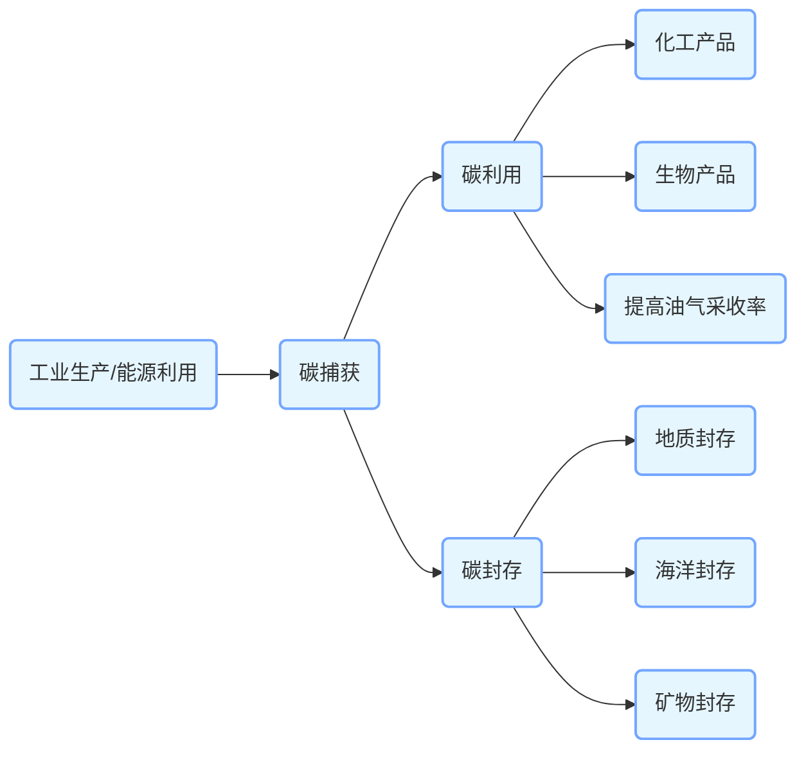

# 价值投资中的碳捕获与利用技术分析

> 关键词：价值投资、碳捕获与利用技术、CCUS、投资分析、气候变化

> 摘要：本文聚焦于价值投资视角下的碳捕获与利用（CCUS）技术。首先介绍了研究的背景、目的、预期读者、文档结构及相关术语。接着阐述了CCUS技术的核心概念、原理与架构，并通过Mermaid流程图进行直观展示。详细讲解了核心算法原理，以Python代码进行示例。深入分析了相关数学模型和公式，并举例说明。通过项目实战，包括开发环境搭建、源代码实现与解读，展示了CCUS技术在实际中的应用。探讨了CCUS技术的实际应用场景，推荐了学习资源、开发工具框架以及相关论文著作。最后总结了CCUS技术未来发展趋势与挑战，提供了常见问题解答和扩展阅读参考资料，旨在为价值投资者提供全面的CCUS技术分析。

## 1. 背景介绍 
### 1.1 目的和范围
在全球气候变化的大背景下，减少温室气体排放已成为当务之急。碳捕获与利用（CCUS）技术作为一种重要的减排手段，受到了广泛关注。本文的目的是从价值投资的角度对CCUS技术进行深入分析，探讨其投资价值和发展潜力。研究范围涵盖CCUS技术的原理、应用、市场前景、投资风险等方面，旨在为投资者提供全面、客观的信息，帮助他们做出明智的投资决策。

### 1.2 预期读者
本文预期读者主要包括价值投资者、金融分析师、能源行业从业者、政策制定者以及对气候变化和可持续发展感兴趣的人士。对于价值投资者，本文将提供CCUS技术相关的投资分析和建议；金融分析师可以从中获取技术层面的知识，以便更好地评估相关企业的价值；能源行业从业者可以了解CCUS技术在行业中的应用和发展趋势；政策制定者可以参考本文的研究结果，制定相关的政策和法规；对气候变化和可持续发展感兴趣的人士可以通过本文了解CCUS技术的重要性和潜力。

### 1.3 文档结构概述
本文共分为十个部分。第一部分为背景介绍，阐述了研究的目的、范围、预期读者和文档结构。第二部分介绍CCUS技术的核心概念与联系，包括技术原理和架构，并通过Mermaid流程图进行展示。第三部分讲解CCUS技术的核心算法原理和具体操作步骤，使用Python代码进行详细阐述。第四部分分析相关的数学模型和公式，并举例说明。第五部分进行项目实战，包括开发环境搭建、源代码实现和代码解读。第六部分探讨CCUS技术的实际应用场景。第七部分推荐学习资源、开发工具框架和相关论文著作。第八部分总结CCUS技术的未来发展趋势与挑战。第九部分为附录，提供常见问题与解答。第十部分列出扩展阅读和参考资料。

### 1.4 术语表
#### 1.4.1 核心术语定义
- **碳捕获与利用（CCUS）**：是指将二氧化碳从工业生产、能源利用或大气中分离出来，然后通过各种技术手段进行利用或封存的过程。
- **碳捕获**：是指从工业生产、能源利用等过程中分离和收集二氧化碳的技术。
- **碳利用**：是指将捕获的二氧化碳转化为有价值的产品或用于其他工业过程的技术。
- **碳封存**：是指将捕获的二氧化碳长期储存于地下或海洋等地质结构中的技术。

#### 1.4.2 相关概念解释
- **温室气体**：是指大气中能够吸收和重新辐射红外线的气体，主要包括二氧化碳、甲烷、氧化亚氮等。温室气体的增加会导致全球气候变暖。
- **气候变化**：是指气候平均状态随时间的变化，包括气温、降水、风速等气象要素的变化。气候变化主要是由于人类活动排放大量温室气体导致的。
- **可持续发展**：是指既满足当代人的需求，又不损害后代人满足其需求的能力的发展模式。CCUS技术是实现可持续发展的重要手段之一。

#### 1.4.3 缩略词列表
- **CCUS**：Carbon Capture, Utilization and Storage（碳捕获、利用与封存）
- **CO₂**：Carbon Dioxide（二氧化碳）

## 2. 核心概念与联系 

### 2.1 碳捕获与利用技术原理
碳捕获与利用（CCUS）技术主要包括三个关键环节：碳捕获、碳利用和碳封存。

#### 2.1.1 碳捕获
碳捕获是CCUS技术的第一步，其目的是从工业生产、能源利用等过程中分离和收集二氧化碳。常见的碳捕获技术包括燃烧前捕获、燃烧后捕获和富氧燃烧捕获。

- **燃烧前捕获**：在燃料燃烧之前，将燃料中的碳转化为二氧化碳并分离出来。例如，在煤气化过程中，将煤炭转化为合成气（主要成分是一氧化碳和氢气），然后通过水煤气变换反应将一氧化碳转化为二氧化碳，最后通过物理或化学方法将二氧化碳分离出来。
- **燃烧后捕获**：在燃料燃烧之后，从燃烧产生的烟气中分离和收集二氧化碳。常用的方法有化学吸收法、物理吸收法、吸附法和膜分离法等。化学吸收法是最常用的方法之一，它利用碱性溶液（如氨水、乙醇胺等）与二氧化碳发生化学反应，将二氧化碳吸收下来，然后通过加热等方式将二氧化碳解吸出来。
- **富氧燃烧捕获**：使用纯氧或富氧空气代替空气进行燃烧，这样燃烧产生的烟气中主要成分是二氧化碳和水蒸气，通过冷凝去除水蒸气后，就可以得到高纯度的二氧化碳。

#### 2.1.2 碳利用
碳利用是指将捕获的二氧化碳转化为有价值的产品或用于其他工业过程的技术。常见的碳利用方式包括化工利用、生物利用和地质利用等。

- **化工利用**：将二氧化碳作为原料，通过化学反应合成各种化工产品，如甲醇、尿素、碳酸酯等。例如，二氧化碳与氢气在催化剂的作用下可以合成甲醇，反应方程式为：$CO₂ + 3H₂ \rightarrow CH₃OH + H₂O$。
- **生物利用**：利用植物、藻类等生物的光合作用，将二氧化碳转化为生物质。例如，微藻可以在光照条件下吸收二氧化碳，进行光合作用，合成生物燃料、蛋白质等产品。
- **地质利用**：将二氧化碳注入地下油藏、气藏或咸水层等地质结构中，实现二氧化碳的封存和提高油气采收率等目的。例如，在提高石油采收率（EOR）过程中，将二氧化碳注入油藏中，降低原油的粘度，提高原油的流动性，从而增加原油的采收率。

#### 2.1.3 碳封存
碳封存是指将捕获的二氧化碳长期储存于地下或海洋等地质结构中的技术。常见的碳封存方式包括地质封存、海洋封存和矿物封存等。

- **地质封存**：将二氧化碳注入地下深部咸水层、枯竭油藏、气藏等地质结构中，使其长期稳定地储存于地下。地质封存是目前最具潜力的碳封存方式之一，其优点是储存容量大、安全性高。
- **海洋封存**：将二氧化碳注入海洋深处，使其溶解于海水中或形成二氧化碳水合物，从而实现二氧化碳的长期储存。海洋封存的优点是储存容量大，但也存在一些环境风险，如可能会影响海洋生态系统。
- **矿物封存**：将二氧化碳与金属氧化物（如镁、钙等）发生化学反应，生成稳定的碳酸盐矿物，从而实现二氧化碳的永久封存。矿物封存的优点是安全性高，但反应速度较慢，需要消耗大量的能源和资源。

### 2.2 核心概念架构示意图


该流程图展示了碳捕获与利用技术的核心架构。工业生产和能源利用过程中产生的二氧化碳首先经过碳捕获环节，然后可以选择进行碳利用或碳封存。碳利用可以产生化工产品、生物产品或用于提高油气采收率；碳封存则包括地质封存、海洋封存和矿物封存等方式。

## 3. 核心算法原理 & 具体操作步骤 

### 3.1 碳捕获过程模拟算法原理
在碳捕获过程中，化学吸收法是一种常用的方法。下面我们以化学吸收法为例，介绍其核心算法原理。

化学吸收法的基本原理是利用碱性溶液与二氧化碳发生化学反应，将二氧化碳吸收下来。以乙醇胺（MEA）溶液为例，其与二氧化碳的反应方程式为：

$2HOCH₂CH₂NH₂ + CO₂ \rightarrow (HOCH₂CH₂NH₃)₂CO₃$

在模拟碳捕获过程时，我们可以使用质量守恒定律和化学反应动力学原理。假设我们有一个吸收塔，塔内有MEA溶液与含二氧化碳的烟气进行接触，我们可以建立以下数学模型：

#### 3.1.1 质量守恒方程
对于二氧化碳在气相和液相中的质量守恒，我们可以列出以下方程：

$\frac{dC_{CO₂,g}}{dt} = -k_{g}a(C_{CO₂,g} - C_{CO₂,g}^*) - Q_{g}C_{CO₂,g}$

$\frac{dC_{CO₂,l}}{dt} = k_{g}a(C_{CO₂,g} - C_{CO₂,g}^*) - r_{CO₂}$

其中，$C_{CO₂,g}$ 是气相中二氧化碳的浓度，$C_{CO₂,l}$ 是液相中二氧化碳的浓度，$k_{g}a$ 是气相传质系数，$C_{CO₂,g}^*$ 是与液相中二氧化碳浓度平衡的气相二氧化碳浓度，$Q_{g}$ 是气相的流量，$r_{CO₂}$ 是二氧化碳的反应速率。

#### 3.1.2 化学反应动力学方程
二氧化碳与MEA的反应是一个二级反应，其反应速率可以表示为：

$r_{CO₂} = k[MEA][CO₂]$

其中，$k$ 是反应速率常数，$[MEA]$ 是MEA的浓度，$[CO₂]$ 是液相中二氧化碳的浓度。

### 3.2 Python代码实现
```python
import numpy as np
from scipy.integrate import odeint

# 定义参数
kg_a = 0.1  # 气相传质系数
Qg = 0.01  # 气相流量
k = 0.05  # 反应速率常数
MEA_conc = 1.0  # MEA浓度

# 定义微分方程
def carbon_capture_ode(y, t):
    C_CO2_g, C_CO2_l = y
    # 计算与液相平衡的气相二氧化碳浓度
    C_CO2_g_star = C_CO2_l  # 简化假设
    # 计算反应速率
    r_CO2 = k * MEA_conc * C_CO2_l
    # 气相质量守恒方程
    dC_CO2_g_dt = -kg_a * (C_CO2_g - C_CO2_g_star) - Qg * C_CO2_g
    # 液相质量守恒方程
    dC_CO2_l_dt = kg_a * (C_CO2_g - C_CO2_g_star) - r_CO2
    return [dC_CO2_g_dt, dC_CO2_l_dt]

# 初始条件
C_CO2_g_0 = 0.1  # 气相初始二氧化碳浓度
C_CO2_l_0 = 0.0  # 液相初始二氧化碳浓度
y0 = [C_CO2_g_0, C_CO2_l_0]

# 时间点
t = np.linspace(0, 100, 1000)

# 求解微分方程
solution = odeint(carbon_capture_ode, y0, t)

# 提取结果
C_CO2_g = solution[:, 0]
C_CO2_l = solution[:, 1]

# 打印结果
print("气相二氧化碳浓度随时间变化：", C_CO2_g)
print("液相二氧化碳浓度随时间变化：", C_CO2_l)
```

### 3.3 代码解读
- **参数定义**：定义了气相传质系数 `kg_a`、气相流量 `Qg`、反应速率常数 `k` 和MEA浓度 `MEA_conc`。
- **微分方程定义**：定义了一个名为 `carbon_capture_ode` 的函数，该函数根据质量守恒方程和化学反应动力学方程计算气相和液相中二氧化碳浓度的变化率。
- **初始条件设置**：设置了气相和液相的初始二氧化碳浓度。
- **时间点设置**：使用 `np.linspace` 函数生成了从0到100的1000个时间点。
- **求解微分方程**：使用 `odeint` 函数求解微分方程，得到气相和液相中二氧化碳浓度随时间的变化。
- **结果提取和打印**：提取求解结果并打印出来。

## 4. 数学模型和公式 & 详细讲解 & 举例说明 

### 4.1 碳捕获效率数学模型
碳捕获效率是衡量碳捕获技术性能的重要指标，其定义为捕获的二氧化碳量与进入系统的二氧化碳量之比。假设进入系统的二氧化碳流量为 $F_{CO₂,in}$，捕获的二氧化碳流量为 $F_{CO₂,capture}$，则碳捕获效率 $\eta$ 可以表示为：

$$\eta = \frac{F_{CO₂,capture}}{F_{CO₂,in}} \times 100\%$$

### 4.2 碳利用效率数学模型
碳利用效率是衡量碳利用技术性能的重要指标，其定义为转化为有用产品的二氧化碳量与输入的二氧化碳量之比。假设输入的二氧化碳流量为 $F_{CO₂,in}$，转化为有用产品的二氧化碳流量为 $F_{CO₂,utilize}$，则碳利用效率 $\xi$ 可以表示为：

$$\xi = \frac{F_{CO₂,utilize}}{F_{CO₂,in}} \times 100\%$$

### 4.3 举例说明
假设一个碳捕获与利用系统，进入系统的二氧化碳流量为 $100$ kg/h，捕获的二氧化碳流量为 $80$ kg/h，转化为有用产品的二氧化碳流量为 $60$ kg/h。

#### 4.3.1 计算碳捕获效率
根据碳捕获效率的公式，可得：

$$\eta = \frac{80}{100} \times 100\% = 80\%$$

#### 4.3.2 计算碳利用效率
根据碳利用效率的公式，可得：

$$\xi = \frac{60}{80} \times 100\% = 75\%$$

这表明该系统的碳捕获效率为 $80\%$，碳利用效率为 $75\%$。通过提高碳捕获效率和碳利用效率，可以提高整个CCUS系统的性能和经济效益。

## 5. 项目实战：代码实际案例和详细解释说明 

### 5.1  开发环境搭建
#### 5.1.1 操作系统
可以选择Windows、Linux或macOS等操作系统。这里我们以Ubuntu 20.04为例进行说明。

#### 5.1.2 Python安装
在Ubuntu 20.04上，可以使用以下命令安装Python 3：

```bash
sudo apt update
sudo apt install python3 python3-pip
```

#### 5.1.3 必要库安装
我们需要安装一些必要的Python库，如 `numpy` 和 `scipy`，可以使用以下命令进行安装：

```bash
pip3 install numpy scipy
```

### 5.2  源代码详细实现和代码解读
以下是一个完整的碳捕获与利用模拟代码示例：

```python
import numpy as np
from scipy.integrate import odeint
import matplotlib.pyplot as plt

# 定义参数
kg_a = 0.1  # 气相传质系数
Qg = 0.01  # 气相流量
k = 0.05  # 反应速率常数
MEA_conc = 1.0  # MEA浓度
CO2_in_flow = 0.1  # 进入系统的二氧化碳流量

# 定义微分方程
def carbon_capture_ode(y, t):
    C_CO2_g, C_CO2_l = y
    # 计算与液相平衡的气相二氧化碳浓度
    C_CO2_g_star = C_CO2_l  # 简化假设
    # 计算反应速率
    r_CO2 = k * MEA_conc * C_CO2_l
    # 气相质量守恒方程
    dC_CO2_g_dt = -kg_a * (C_CO2_g - C_CO2_g_star) - Qg * C_CO2_g + CO2_in_flow
    # 液相质量守恒方程
    dC_CO2_l_dt = kg_a * (C_CO2_g - C_CO2_g_star) - r_CO2
    return [dC_CO2_g_dt, dC_CO2_l_dt]

# 初始条件
C_CO2_g_0 = 0.0  # 气相初始二氧化碳浓度
C_CO2_l_0 = 0.0  # 液相初始二氧化碳浓度
y0 = [C_CO2_g_0, C_CO2_l_0]

# 时间点
t = np.linspace(0, 100, 1000)

# 求解微分方程
solution = odeint(carbon_capture_ode, y0, t)

# 提取结果
C_CO2_g = solution[:, 0]
C_CO2_l = solution[:, 1]

# 计算碳捕获效率
F_CO2_in = CO2_in_flow
F_CO2_capture = kg_a * (C_CO2_g - C_CO2_l)
capture_efficiency = (F_CO2_capture / F_CO2_in) * 100

# 绘制结果
plt.figure(figsize=(12, 6))
plt.subplot(2, 1, 1)
plt.plot(t, C_CO2_g, label='气相二氧化碳浓度')
plt.plot(t, C_CO2_l, label='液相二氧化碳浓度')
plt.xlabel('时间 (h)')
plt.ylabel('二氧化碳浓度 (kg/m³)')
plt.legend()

plt.subplot(2, 1, 2)
plt.plot(t, capture_efficiency, label='碳捕获效率 (%)')
plt.xlabel('时间 (h)')
plt.ylabel('碳捕获效率 (%)')
plt.legend()

plt.show()
```

### 5.3  代码解读与分析
- **参数定义**：定义了气相传质系数 `kg_a`、气相流量 `Qg`、反应速率常数 `k`、MEA浓度 `MEA_conc` 和进入系统的二氧化碳流量 `CO2_in_flow`。
- **微分方程定义**：定义了一个名为 `carbon_capture_ode` 的函数，该函数根据质量守恒方程和化学反应动力学方程计算气相和液相中二氧化碳浓度的变化率。
- **初始条件设置**：设置了气相和液相的初始二氧化碳浓度。
- **时间点设置**：使用 `np.linspace` 函数生成了从0到100的1000个时间点。
- **求解微分方程**：使用 `odeint` 函数求解微分方程，得到气相和液相中二氧化碳浓度随时间的变化。
- **碳捕获效率计算**：根据碳捕获效率的定义，计算了碳捕获效率随时间的变化。
- **结果绘制**：使用 `matplotlib` 库绘制了气相和液相中二氧化碳浓度随时间的变化曲线以及碳捕获效率随时间的变化曲线。

通过分析这些曲线，我们可以了解碳捕获过程的动态特性和碳捕获效率的变化情况，从而优化碳捕获系统的设计和运行。

## 6. 实际应用场景 
### 6.1 电力行业
在电力行业，火力发电厂是二氧化碳的主要排放源之一。CCUS技术可以应用于火力发电厂，捕获燃烧产生的二氧化碳，从而减少二氧化碳的排放。例如，在燃煤发电厂中，可以采用燃烧后捕获技术，从烟气中分离和收集二氧化碳，然后将其进行利用或封存。此外，CCUS技术还可以与其他发电技术（如天然气联合循环发电）相结合，提高发电效率和减少碳排放。

### 6.2 化工行业
化工行业是二氧化碳的重要排放源之一，同时也是碳利用的重要领域。在化工生产过程中，许多反应都会产生二氧化碳，通过CCUS技术可以将这些二氧化碳捕获并利用。例如，在尿素生产过程中，可以将捕获的二氧化碳与氨反应生成尿素；在甲醇生产过程中，可以将二氧化碳与氢气反应合成甲醇。此外，CCUS技术还可以应用于其他化工产品的生产，如碳酸酯、聚碳酸酯等。

### 6.3 钢铁行业
钢铁行业是高能耗、高排放的行业之一，其生产过程中会产生大量的二氧化碳。CCUS技术可以应用于钢铁行业，减少二氧化碳的排放。例如，在炼铁过程中，可以采用燃烧前捕获技术，将铁矿石还原过程中产生的二氧化碳分离和收集，然后进行利用或封存。此外，CCUS技术还可以与钢铁生产的其他环节相结合，如烧结、轧钢等，提高钢铁生产的能源效率和环境性能。

### 6.4 提高油气采收率
CCUS技术还可以用于提高油气采收率（EOR）。将捕获的二氧化碳注入地下油藏中，可以降低原油的粘度，提高原油的流动性，从而增加原油的采收率。同时，注入的二氧化碳可以被油藏岩石和流体吸附和溶解，实现二氧化碳的封存。这种方法不仅可以提高油气资源的利用效率，还可以减少二氧化碳的排放，具有显著的经济效益和环境效益。

## 7. 工具和资源推荐
### 7.1 学习资源推荐
#### 7.1.1 书籍推荐
- 《碳捕获、利用与封存技术》：本书系统地介绍了CCUS技术的原理、方法和应用，是学习CCUS技术的重要参考书。
- 《气候变化经济学》：本书从经济学的角度探讨了气候变化问题，包括碳减排的成本和效益、碳市场等内容，对于理解CCUS技术的经济价值具有重要意义。
- 《可持续能源：选择与解决方案》：本书介绍了各种可持续能源技术，包括CCUS技术，以及它们在应对气候变化中的作用。

#### 7.1.2 在线课程
- Coursera上的“Carbon Capture, Utilization, and Storage”课程：该课程由国际知名专家授课，系统地介绍了CCUS技术的原理、应用和发展趋势。
- edX上的“Climate Change: Science and Solutions”课程：该课程涵盖了气候变化的科学基础、应对策略和技术解决方案，包括CCUS技术。

#### 7.1.3 技术博客和网站
- 国际能源署（IEA）官方网站：提供了关于CCUS技术的最新研究报告、政策分析和项目案例等信息。
- 全球碳捕集与封存研究院（GCCSI）官方网站：专注于CCUS技术的研究和推广，提供了丰富的技术资料和行业动态。
- Carbon Capture Journal：是一本专注于碳捕获、利用与封存技术的专业期刊，提供了最新的研究成果和行业新闻。

### 7.2 开发工具框架推荐
#### 7.2.1 IDE和编辑器
- PyCharm：是一款功能强大的Python集成开发环境，提供了代码编辑、调试、版本控制等功能，适合开发CCUS技术相关的Python代码。
- Visual Studio Code：是一款轻量级的代码编辑器，支持多种编程语言，具有丰富的插件生态系统，可以用于开发CCUS技术相关的代码。

#### 7.2.2 调试和性能分析工具
- Py-Spy：是一个用于Python代码性能分析的工具，可以帮助开发者找出代码中的性能瓶颈。
- PDB：是Python自带的调试器，可以用于调试CCUS技术相关的Python代码。

#### 7.2.3 相关框架和库
- NumPy：是Python中用于科学计算的基础库，提供了高效的数组操作和数学函数，适用于CCUS技术中的数值计算。
- SciPy：是Python中用于科学计算的高级库，提供了优化、积分、插值等功能，适用于CCUS技术中的模型求解和数据分析。
- Matplotlib：是Python中用于数据可视化的库，可以用于绘制CCUS技术中的各种图表和曲线。

### 7.3 相关论文著作推荐
#### 7.3.1 经典论文
- “Carbon Capture and Storage: How Green Can Black Be?”：该论文探讨了CCUS技术在应对气候变化中的作用和挑战，是CCUS技术领域的经典论文之一。
- “The Future of Carbon Capture and Storage”：该论文对CCUS技术的未来发展进行了展望，分析了技术、经济和政策等方面的因素。

#### 7.3.2 最新研究成果
- 在Science、Nature等顶级学术期刊上搜索关于CCUS技术的最新研究论文，可以了解该领域的前沿动态和研究热点。
- 参加国际学术会议，如国际碳捕获与封存会议（ICCS），可以获取最新的研究成果和行业信息。

#### 7.3.3 应用案例分析
- 国际能源署（IEA）发布的CCUS项目案例报告，介绍了全球各地的CCUS项目实施情况和经验教训。
- 相关企业的技术报告和案例分析，如挪威的Sleipner项目、加拿大的Boundary Dam项目等，提供了实际项目的详细信息和技术方案。

## 8. 总结：未来发展趋势与挑战
### 8.1 未来发展趋势
#### 8.1.1 技术创新
未来，CCUS技术将不断创新和发展。例如，开发更高效的碳捕获材料和工艺，提高碳捕获效率和降低成本；研究新型的碳利用技术，将二氧化碳转化为高附加值的产品；探索更安全、可靠的碳封存方式，提高碳封存的长期稳定性。

#### 8.1.2 规模化应用
随着技术的不断成熟和成本的不断降低，CCUS技术将实现规模化应用。越来越多的企业和项目将采用CCUS技术，以减少二氧化碳排放，实现可持续发展。例如，在电力、化工、钢铁等行业，CCUS技术将得到更广泛的应用。

#### 8.1.3 与其他技术的融合
CCUS技术将与其他能源技术和环保技术进行融合。例如，与可再生能源技术相结合，实现能源的清洁生产和二氧化碳的零排放；与碳交易市场相结合，提高CCUS项目的经济效益。

### 8.2 挑战
#### 8.2.1 成本问题
目前，CCUS技术的成本仍然较高，限制了其大规模应用。碳捕获、利用和封存过程需要消耗大量的能源和资源，导致成本居高不下。未来需要通过技术创新和规模化应用，降低CCUS技术的成本。

#### 8.2.2 技术可靠性和安全性
CCUS技术涉及到二氧化碳的捕获、运输和封存等多个环节，技术可靠性和安全性是关键问题。例如，碳封存过程中可能会出现二氧化碳泄漏的风险，对环境和人类健康造成威胁。需要加强技术研发和监管，确保CCUS技术的可靠性和安全性。

#### 8.2.3 政策和市场机制
CCUS技术的发展需要政策和市场机制的支持。目前，相关的政策和市场机制还不完善，缺乏对CCUS项目的激励和保障措施。需要政府出台相关的政策，如碳税、补贴等，建立健全的碳交易市场，推动CCUS技术的发展。

## 9. 附录：常见问题与解答
### 9.1 CCUS技术的成本高吗？
目前，CCUS技术的成本相对较高。碳捕获、利用和封存过程需要消耗大量的能源和资源，导致成本居高不下。然而，随着技术的不断进步和规模化应用，CCUS技术的成本有望逐渐降低。

### 9.2 CCUS技术的安全性如何？
CCUS技术的安全性是关键问题之一。在碳捕获、运输和封存过程中，需要采取一系列的安全措施，确保二氧化碳不会泄漏到环境中。例如，在碳封存过程中，需要选择合适的地质结构，并进行严格的监测和评估。目前，许多CCUS项目都采取了严格的安全措施，以确保技术的安全性。

### 9.3 CCUS技术对环境有什么影响？
CCUS技术的主要目的是减少二氧化碳排放，对环境具有积极的影响。通过捕获和封存二氧化碳，可以降低大气中二氧化碳的浓度，减缓全球气候变暖的趋势。此外，碳利用技术还可以将二氧化碳转化为有价值的产品，减少对传统资源的依赖。然而，CCUS技术也可能会对环境产生一些负面影响，如碳捕获过程中消耗的能源可能会产生其他污染物，碳封存过程中可能会对地质结构和地下水造成影响。因此，在发展CCUS技术的过程中，需要充分考虑其环境影响，并采取相应的措施进行防范和治理。

### 9.4 CCUS技术的市场前景如何？
随着全球对气候变化问题的关注度不断提高，CCUS技术的市场前景广阔。许多国家和企业都在积极推动CCUS技术的发展，出台了相关的政策和计划。未来，CCUS技术将在电力、化工、钢铁等行业得到广泛应用，同时也将与其他能源技术和环保技术进行融合，形成新的产业增长点。然而，CCUS技术的市场发展还面临着一些挑战，如成本高、技术可靠性和安全性等问题，需要政府、企业和科研机构共同努力，推动CCUS技术的市场化应用。

## 10. 扩展阅读 & 参考资料
### 10.1 扩展阅读
- 《全球气候变化与低碳经济》：本书介绍了全球气候变化的现状、原因和影响，以及低碳经济的发展模式和实践案例，对于理解CCUS技术在应对气候变化中的作用具有重要意义。
- 《能源革命：从化石能源到可再生能源》：本书探讨了能源革命的背景、趋势和挑战，介绍了各种可再生能源技术和能源存储技术，以及它们与CCUS技术的关系。

### 10.2 参考资料
- 国际能源署（IEA）相关报告：如《Carbon Capture, Utilization and Storage: Technology Roadmap》《Global Energy Review 2023》等。
- 全球碳捕集与封存研究院（GCCSI）相关报告：如《CCUS in Clean Energy Transitions》《CCUS Project Database》等。
- 学术期刊论文：如Science、Nature、Energy & Environmental Science等期刊上发表的关于CCUS技术的研究论文。