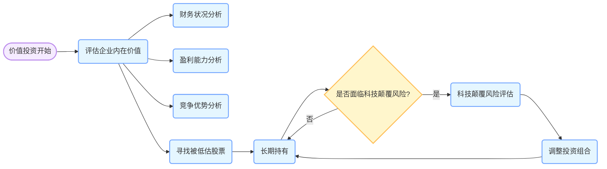

# 价值投资中的科技颠覆风险评估

> 关键词：价值投资、科技颠覆风险、风险评估、技术变革、投资策略

> 摘要：本文聚焦于价值投资领域中的科技颠覆风险评估。在科技飞速发展的时代，科技颠覆对传统价值投资带来了巨大挑战。文章首先介绍了价值投资和科技颠覆风险评估的背景知识，包括目的、预期读者等。接着阐述了核心概念及其联系，详细讲解了评估科技颠覆风险的核心算法原理和具体操作步骤，并结合数学模型和公式进行深入剖析。通过项目实战案例，展示了如何在实际中进行科技颠覆风险评估。同时，探讨了该评估在不同实际应用场景中的作用，推荐了相关的学习资源、开发工具框架以及论文著作。最后总结了未来发展趋势与挑战，解答了常见问题，并提供了扩展阅读和参考资料，旨在为投资者提供全面且深入的科技颠覆风险评估指导。

## 1. 背景介绍 
### 1.1 目的和范围
价值投资一直是投资者追求长期稳定回报的重要策略，然而科技的快速发展使得传统行业和企业面临着前所未有的科技颠覆风险。本文章的目的在于为价值投资者提供一套全面且系统的科技颠覆风险评估方法，帮助他们在投资决策过程中更好地识别、评估和应对科技带来的不确定性。

文章的范围涵盖了科技颠覆风险评估的各个方面，包括核心概念的解释、评估算法的原理和操作步骤、数学模型的构建与分析、实际案例的应用以及相关工具和资源的推荐等。通过对这些内容的深入探讨，旨在让投资者能够更加准确地判断科技颠覆对投资组合的影响，从而制定更加合理的投资策略。

### 1.2 预期读者
本文的预期读者主要包括以下几类人群：
1. **价值投资者**：希望在科技快速变革的时代，提升自身对科技颠覆风险的认知和评估能力，以优化投资组合，实现长期稳定的投资回报。
2. **金融分析师**：需要深入了解科技颠覆对企业价值和市场趋势的影响，为客户提供更准确的投资分析和建议。
3. **企业管理者**：关注科技发展对企业的潜在威胁和机遇，通过评估科技颠覆风险，制定相应的战略规划，提升企业的竞争力和抗风险能力。
4. **学术研究人员**：对价值投资和科技颠覆风险评估领域感兴趣，希望通过本文的研究成果，进一步开展相关的学术研究和理论探讨。

### 1.3 文档结构概述
本文将按照以下结构进行组织：
1. **背景介绍**：阐述文章的目的、范围、预期读者和文档结构概述，同时对相关术语进行定义和解释。
2. **核心概念与联系**：介绍价值投资、科技颠覆风险等核心概念，并分析它们之间的内在联系，通过文本示意图和 Mermaid 流程图进行直观展示。
3. **核心算法原理 & 具体操作步骤**：详细讲解科技颠覆风险评估的核心算法原理，并给出具体的操作步骤，同时使用 Python 源代码进行详细阐述。
4. **数学模型和公式 & 详细讲解 & 举例说明**：构建科技颠覆风险评估的数学模型，推导相关公式，并通过具体例子进行详细说明。
5. **项目实战：代码实际案例和详细解释说明**：通过实际项目案例，展示科技颠覆风险评估的具体实现过程，包括开发环境搭建、源代码详细实现和代码解读。
6. **实际应用场景**：探讨科技颠覆风险评估在不同实际场景中的应用，如股票投资、企业战略规划等。
7. **工具和资源推荐**：推荐相关的学习资源、开发工具框架和论文著作，帮助读者进一步深入学习和研究。
8. **总结：未来发展趋势与挑战**：总结科技颠覆风险评估的发展趋势，并分析未来可能面临的挑战。
9. **附录：常见问题与解答**：解答读者在科技颠覆风险评估过程中可能遇到的常见问题。
10. **扩展阅读 & 参考资料**：提供相关的扩展阅读材料和参考资料，方便读者进一步探索和研究。

### 1.4 术语表
#### 1.4.1 核心术语定义
1. **价值投资**：一种投资策略，投资者通过分析企业的内在价值，寻找被市场低估的股票进行投资，以期在长期获得稳定的回报。
2. **科技颠覆**：指由于科技的快速发展和创新，导致传统行业或企业的商业模式、市场地位和盈利能力受到严重冲击甚至被彻底改变的现象。
3. **科技颠覆风险**：在价值投资过程中，由于科技颠覆可能给投资者带来的损失风险，包括投资组合价值下降、企业业绩下滑等。
4. **风险评估**：对可能发生的风险进行识别、分析和评估的过程，以确定风险的可能性和影响程度，并制定相应的应对措施。

#### 1.4.2 相关概念解释
1. **技术变革**：指科学技术领域的重大创新和进步，包括新技术的发明、应用和推广，以及现有技术的改进和升级。技术变革是科技颠覆的主要驱动力。
2. **创新生态系统**：由政府、企业、科研机构、高校等多个主体组成的生态系统，旨在促进科技创新和技术转移，推动科技成果的商业化应用。
3. **竞争优势**：企业在市场竞争中相对于竞争对手所具有的优势，包括成本优势、产品差异化优势、品牌优势等。科技颠覆可能会削弱企业的竞争优势。

#### 1.4.3 缩略词列表
1. **AI**：Artificial Intelligence，人工智能
2. **IoT**：Internet of Things，物联网
3. **Blockchain**：区块链
4. **VR**：Virtual Reality，虚拟现实
5. **AR**：Augmented Reality，增强现实

## 2. 核心概念与联系 
### 2.1 价值投资的核心概念
价值投资的核心思想是寻找被市场低估的股票，通过长期持有来实现资产的增值。投资者通常会关注企业的基本面，如财务状况、盈利能力、竞争优势等，以评估企业的内在价值。价值投资的关键在于对企业内在价值的准确判断，以及在市场价格低于内在价值时进行买入操作。

### 2.2 科技颠覆风险的核心概念
科技颠覆风险是指由于科技的快速发展和创新，导致传统行业或企业面临被新兴技术和商业模式取代的风险。科技颠覆可能会改变行业的竞争格局，使一些传统企业的市场份额下降、盈利能力减弱，甚至导致企业倒闭。科技颠覆风险的来源包括新技术的出现、技术创新的加速、消费者需求的变化等。

### 2.3 价值投资与科技颠覆风险的联系
在科技快速发展的时代，价值投资面临着科技颠覆风险的挑战。传统的价值投资方法主要关注企业的历史财务数据和基本面，而忽略了科技变革对企业未来发展的影响。科技颠覆可能会使一些原本具有良好基本面的企业在短时间内失去竞争优势，导致其内在价值大幅下降。因此，价值投资者需要在评估企业内在价值时，充分考虑科技颠覆风险的因素。

### 2.4 核心概念原理和架构的文本示意图
```plaintext
价值投资
|
|-- 评估企业内在价值
|   |-- 财务状况分析
|   |-- 盈利能力分析
|   |-- 竞争优势分析
|
|-- 寻找被低估股票
|
|-- 长期持有
|
|-- 面临科技颠覆风险
|   |-- 新技术出现
|   |-- 技术创新加速
|   |-- 消费者需求变化
|
|-- 应对科技颠覆风险
|   |-- 科技颠覆风险评估
|   |-- 调整投资组合
```

### 2.5 Mermaid 流程图


## 3. 核心算法原理 & 具体操作步骤 
### 3.1 核心算法原理
科技颠覆风险评估的核心算法原理是通过对多个因素进行综合分析，评估科技颠覆对企业的影响程度。这些因素包括技术发展趋势、企业的技术创新能力、市场竞争格局、消费者需求变化等。具体来说，算法可以通过构建一个风险评估模型，将这些因素量化为指标，并根据指标的权重计算出科技颠覆风险的得分。

### 3.2 具体操作步骤
1. **确定评估指标**：根据科技颠覆风险的影响因素，确定一系列评估指标，如技术成熟度、技术替代率、企业研发投入占比、市场份额变化等。
2. **收集数据**：收集与评估指标相关的数据，可以通过公开信息、行业报告、企业财务报表等渠道获取。
3. **指标量化**：将收集到的数据进行量化处理，将不同类型的指标转化为可比较的数值。
4. **确定指标权重**：根据各指标对科技颠覆风险的影响程度，确定每个指标的权重。可以通过专家评估、层次分析法等方法确定权重。
5. **计算风险得分**：根据指标量化结果和指标权重，计算科技颠覆风险的得分。计算公式如下：
$$RiskScore = \sum_{i=1}^{n} w_i \times x_i$$
其中，$RiskScore$ 表示科技颠覆风险得分，$w_i$ 表示第 $i$ 个指标的权重，$x_i$ 表示第 $i$ 个指标的量化值，$n$ 表示评估指标的数量。
6. **风险等级划分**：根据风险得分，将科技颠覆风险划分为不同的等级，如低风险、中风险、高风险等。
7. **评估结果分析**：对评估结果进行分析，判断企业面临的科技颠覆风险程度，并提出相应的应对建议。

### 3.3 Python 源代码详细阐述
```python
import pandas as pd

# 定义评估指标和权重
evaluation_metrics = {
    "技术成熟度": 0.2,
    "技术替代率": 0.2,
    "企业研发投入占比": 0.2,
    "市场份额变化": 0.2,
    "消费者需求变化率": 0.2
}

# 收集数据（示例数据）
data = {
    "企业名称": ["企业 A", "企业 B", "企业 C"],
    "技术成熟度": [0.8, 0.6, 0.4],
    "技术替代率": [0.1, 0.3, 0.5],
    "企业研发投入占比": [0.15, 0.2, 0.1],
    "市场份额变化": [-0.05, 0.02, -0.1],
    "消费者需求变化率": [0.1, 0.2, 0.3]
}

df = pd.DataFrame(data)

# 计算风险得分
def calculate_risk_score(row):
    risk_score = 0
    for metric, weight in evaluation_metrics.items():
        risk_score += weight * row[metric]
    return risk_score

df["风险得分"] = df.apply(calculate_risk_score, axis=1)

# 风险等级划分
def classify_risk_level(score):
    if score < 0.3:
        return "低风险"
    elif score < 0.6:
        return "中风险"
    else:
        return "高风险"

df["风险等级"] = df["风险得分"].apply(classify_risk_level)

print(df)
```

### 3.4 代码解释
1. **定义评估指标和权重**：通过字典 `evaluation_metrics` 定义了评估科技颠覆风险的指标和相应的权重。
2. **收集数据**：使用示例数据创建了一个 `DataFrame` 对象 `df`，包含了不同企业的各项评估指标数据。
3. **计算风险得分**：定义了 `calculate_risk_score` 函数，根据公式计算每个企业的科技颠覆风险得分，并将结果添加到 `DataFrame` 中。
4. **风险等级划分**：定义了 `classify_risk_level` 函数，根据风险得分将风险划分为低风险、中风险和高风险三个等级，并将结果添加到 `DataFrame` 中。
5. **输出结果**：打印包含风险得分和风险等级的 `DataFrame`。

## 4. 数学模型和公式 & 详细讲解 & 举例说明 
### 4.1 数学模型构建
科技颠覆风险评估的数学模型可以表示为一个多指标综合评价模型。设 $X = (x_1, x_2, \cdots, x_n)$ 为评估指标向量，其中 $x_i$ 表示第 $i$ 个评估指标的量化值；$W = (w_1, w_2, \cdots, w_n)$ 为指标权重向量，其中 $w_i$ 表示第 $i$ 个指标的权重，且满足 $\sum_{i=1}^{n} w_i = 1$。则科技颠覆风险得分 $R$ 可以表示为：
$$R = W^T X = \sum_{i=1}^{n} w_i x_i$$

### 4.2 公式详细讲解
- $W^T$ 表示权重向量 $W$ 的转置，通过向量乘法将权重与指标量化值进行加权求和，得到科技颠覆风险得分。
- 指标量化值 $x_i$ 反映了企业在第 $i$ 个评估指标上的表现，权重 $w_i$ 反映了该指标对科技颠覆风险的重要程度。
- 风险得分 $R$ 越高，说明企业面临的科技颠覆风险越大。

### 4.3 举例说明
假设我们要评估某企业的科技颠覆风险，选取了以下三个评估指标：技术成熟度 $x_1$、技术替代率 $x_2$ 和企业研发投入占比 $x_3$，对应的权重分别为 $w_1 = 0.3$，$w_2 = 0.4$，$w_3 = 0.3$。该企业的指标量化值分别为 $x_1 = 0.7$，$x_2 = 0.2$，$x_3 = 0.15$。

根据公式计算该企业的科技颠覆风险得分：
$$R = w_1 x_1 + w_2 x_2 + w_3 x_3 = 0.3 \times 0.7 + 0.4 \times 0.2 + 0.3 \times 0.15 = 0.21 + 0.08 + 0.045 = 0.335$$

假设我们将风险等级划分为：$R < 0.3$ 为低风险，$0.3 \leq R < 0.6$ 为中风险，$R \geq 0.6$ 为高风险。则该企业的科技颠覆风险等级为中风险。

## 5. 项目实战：代码实际案例和详细解释说明 
### 5.1 开发环境搭建
在进行科技颠覆风险评估项目实战之前，需要搭建相应的开发环境。以下是具体的搭建步骤：
1. **安装 Python**：建议安装 Python 3.7 及以上版本，可以从 Python 官方网站（https://www.python.org/downloads/）下载并安装。
2. **安装必要的库**：使用 `pip` 命令安装以下必要的库：
```bash
pip install pandas numpy matplotlib
```
- `pandas`：用于数据处理和分析。
- `numpy`：用于数值计算。
- `matplotlib`：用于数据可视化。

### 5.2 源代码详细实现和代码解读
```python
import pandas as pd
import numpy as np
import matplotlib.pyplot as plt

# 定义评估指标和权重
evaluation_metrics = {
    "技术成熟度": 0.2,
    "技术替代率": 0.2,
    "企业研发投入占比": 0.2,
    "市场份额变化": 0.2,
    "消费者需求变化率": 0.2
}

# 收集数据（模拟数据）
np.random.seed(42)
num_companies = 10
data = {
    "企业名称": [f"企业 {i+1}" for i in range(num_companies)],
    "技术成熟度": np.random.rand(num_companies),
    "技术替代率": np.random.rand(num_companies),
    "企业研发投入占比": np.random.rand(num_companies),
    "市场份额变化": np.random.rand(num_companies) - 0.5,
    "消费者需求变化率": np.random.rand(num_companies)
}

df = pd.DataFrame(data)

# 计算风险得分
def calculate_risk_score(row):
    risk_score = 0
    for metric, weight in evaluation_metrics.items():
        risk_score += weight * row[metric]
    return risk_score

df["风险得分"] = df.apply(calculate_risk_score, axis=1)

# 风险等级划分
def classify_risk_level(score):
    if score < 0.3:
        return "低风险"
    elif score < 0.6:
        return "中风险"
    else:
        return "高风险"

df["风险等级"] = df["风险得分"].apply(classify_risk_level)

# 数据可视化
plt.figure(figsize=(10, 6))
plt.bar(df["企业名称"], df["风险得分"])
plt.xlabel("企业名称")
plt.ylabel("风险得分")
plt.title("科技颠覆风险得分")
plt.xticks(rotation=45)
plt.show()

print(df)
```

### 5.3 代码解读与分析
1. **导入必要的库**：导入 `pandas`、`numpy` 和 `matplotlib` 库，分别用于数据处理、数值计算和数据可视化。
2. **定义评估指标和权重**：通过字典 `evaluation_metrics` 定义了评估科技颠覆风险的指标和相应的权重。
3. **收集数据**：使用 `numpy` 生成模拟数据，创建一个包含多个企业各项评估指标的 `DataFrame` 对象 `df`。
4. **计算风险得分**：定义了 `calculate_risk_score` 函数，根据公式计算每个企业的科技颠覆风险得分，并将结果添加到 `DataFrame` 中。
5. **风险等级划分**：定义了 `classify_risk_level` 函数，根据风险得分将风险划分为低风险、中风险和高风险三个等级，并将结果添加到 `DataFrame` 中。
6. **数据可视化**：使用 `matplotlib` 绘制柱状图，直观展示每个企业的科技颠覆风险得分。
7. **输出结果**：打印包含风险得分和风险等级的 `DataFrame`。

通过以上代码，我们可以对多个企业的科技颠覆风险进行评估，并通过可视化的方式直观展示评估结果。

## 6. 实际应用场景 
### 6.1 股票投资
在股票投资领域，科技颠覆风险评估可以帮助投资者识别具有潜在科技颠覆风险的企业，从而调整投资组合。对于面临高科技颠覆风险的企业，投资者可以减少其在投资组合中的比重，或者避免投资此类企业。相反，对于具有较强技术创新能力和抗科技颠覆风险能力的企业，投资者可以增加其在投资组合中的比重。

例如，在传统汽车行业面临新能源汽车和自动驾驶技术的科技颠覆风险时，投资者可以通过评估不同汽车企业的科技颠覆风险，选择投资那些积极布局新能源和自动驾驶技术的企业，而减少对传统燃油汽车企业的投资。

### 6.2 企业战略规划
对于企业来说，科技颠覆风险评估可以帮助企业管理者识别企业面临的科技威胁和机遇，从而制定相应的战略规划。企业可以根据评估结果，加大对技术研发的投入，加强与科技企业的合作，或者进行业务转型，以提高企业的抗科技颠覆风险能力。

例如，传统零售企业在面临电子商务和移动购物的科技颠覆风险时，可以通过评估风险，制定线上线下融合的战略规划，加大对电商平台的建设和投入，提升用户体验，以应对科技颠覆带来的挑战。

### 6.3 风险投资
在风险投资领域，科技颠覆风险评估可以帮助风险投资机构筛选具有高增长潜力的科技企业。风险投资机构可以通过评估科技企业的技术创新能力、市场前景和科技颠覆风险，选择投资那些具有创新性和高增长潜力的科技企业，以获得更高的投资回报。

例如，风险投资机构在评估人工智能、区块链等新兴科技企业时，可以通过科技颠覆风险评估，判断企业的技术是否具有颠覆性，市场需求是否真实存在，从而做出更明智的投资决策。

### 6.4 行业研究和政策制定
科技颠覆风险评估还可以为行业研究和政策制定提供参考。政府部门和行业协会可以通过评估不同行业的科技颠覆风险，了解行业的发展趋势和面临的挑战，从而制定相应的政策和措施，促进产业升级和转型。

例如，政府可以根据科技颠覆风险评估结果，加大对新兴科技产业的扶持力度，引导传统产业进行技术创新和升级，提高整个行业的抗科技颠覆风险能力。

## 7. 工具和资源推荐
### 7.1 学习资源推荐
#### 7.1.1 书籍推荐
1. 《聪明的投资者》（The Intelligent Investor）：作者本杰明·格雷厄姆（Benjamin Graham），被誉为价值投资的圣经，详细介绍了价值投资的理论和方法。
2. 《创新者的窘境》（The Innovator's Dilemma）：作者克莱顿·克里斯坦森（Clayton Christensen），探讨了企业如何应对颠覆性创新的挑战。
3. 《技术的本质》（The Nature of Technology）：作者布莱恩·阿瑟（W. Brian Arthur），深入剖析了技术的本质和发展规律。
4. 《人工智能时代》（The Age of AI）：作者李开复等，介绍了人工智能的发展现状和未来趋势，以及对各个行业的影响。

#### 7.1.2 在线课程
1. Coursera 平台上的“价值投资原理”（Principles of Value Investing）课程，由哥伦比亚大学教授授课，系统介绍了价值投资的理论和实践。
2. edX 平台上的“科技创业与创新”（Technology Entrepreneurship and Innovation）课程，讲解了科技创业的过程和方法，以及如何应对科技颠覆风险。
3. Udemy 平台上的“数据分析基础”（Data Analysis Basics）课程，帮助学习者掌握数据分析的基本技能，为科技颠覆风险评估提供数据支持。

#### 7.1.3 技术博客和网站
1. TechCrunch：专注于科技行业的新闻和分析，提供最新的科技动态和创新趋势。
2. Wired：关注科技、文化和商业的融合，深入报道科技领域的重大事件和创新成果。
3. Seeking Alpha：提供股票分析和投资建议，包括对科技企业的分析和评估。
4. Medium 上的科技相关博客，如 Towards Data Science 等，分享了大量关于数据分析、人工智能等领域的技术文章和案例。

### 7.2 开发工具框架推荐
#### 7.2.1 IDE和编辑器
1. PyCharm：一款专门为 Python 开发设计的集成开发环境（IDE），具有强大的代码编辑、调试和项目管理功能。
2. Jupyter Notebook：一个交互式的开发环境，适合进行数据分析和模型开发，支持多种编程语言，如 Python、R 等。
3. Visual Studio Code：一款轻量级的代码编辑器，支持多种编程语言和插件扩展，具有丰富的功能和良好的用户体验。

#### 7.2.2 调试和性能分析工具
1. pdb：Python 自带的调试工具，可以帮助开发者定位和解决代码中的问题。
2. cProfile：Python 标准库中的性能分析工具，可以分析代码的运行时间和函数调用情况，帮助开发者优化代码性能。
3. Py-Spy：一个用于分析 Python 程序性能的工具，可以实时监控程序的 CPU 使用情况和函数调用栈。

#### 7.2.3 相关框架和库
1. Pandas：用于数据处理和分析的 Python 库，提供了高效的数据结构和数据操作方法。
2. Numpy：用于数值计算的 Python 库，提供了多维数组和各种数学函数。
3. Scikit-learn：一个用于机器学习的 Python 库，提供了丰富的机器学习算法和工具，可用于科技颠覆风险评估模型的开发。
4. TensorFlow 和 PyTorch：深度学习框架，可用于处理复杂的数据分析和模型训练任务。

### 7.3 相关论文著作推荐
#### 7.3.1 经典论文
1. “The Capital Asset Pricing Model: Theory and Evidence” by Eugene F. Fama and Kenneth R. French：介绍了资本资产定价模型的理论和实证研究，对价值投资和风险评估具有重要的参考价值。
2. “Disruptive Technologies: Catching the Wave” by Clayton M. Christensen and Joseph L. Bower：提出了颠覆性技术的概念，并分析了企业如何应对颠覆性技术的挑战。
3. “The Economics of Technological Change” by Richard R. Nelson and Sidney G. Winter：探讨了技术变革的经济学原理和影响。

#### 7.3.2 最新研究成果
1. 关注顶级学术期刊，如《Management Science》、《Journal of Financial Economics》、《Research Policy》等，这些期刊发表了大量关于价值投资、科技创新和风险评估的最新研究成果。
2. 参加国际学术会议，如 INFORMS Annual Meeting、Academy of Management Annual Meeting 等，了解该领域的最新研究动态和前沿成果。

#### 7.3.3 应用案例分析
1. 研究知名企业的案例，如苹果公司在智能手机领域的创新和发展，特斯拉公司在新能源汽车领域的突破等，分析这些企业如何应对科技颠覆风险，实现持续增长。
2. 关注行业报告和研究机构的分析，如麦肯锡、波士顿咨询集团等发布的关于科技行业的研究报告，了解不同行业的科技颠覆风险和应对策略。

## 8. 总结：未来发展趋势与挑战
### 8.1 未来发展趋势
1. **科技颠覆速度加快**：随着科技的不断进步，新技术的出现和应用速度越来越快，科技颠覆的周期将不断缩短。价值投资者需要更加敏锐地捕捉科技变革的信号，及时调整投资策略。
2. **跨行业融合加剧**：科技的发展使得不同行业之间的界限越来越模糊，跨行业融合的趋势将更加明显。例如，人工智能与金融、医疗、教育等行业的融合，将创造出更多的创新商业模式和投资机会。价值投资者需要具备跨行业的分析能力，以应对科技颠覆带来的挑战。
3. **数据驱动的风险评估**：随着大数据和人工智能技术的发展，数据驱动的风险评估将成为未来的发展趋势。通过收集和分析大量的企业数据、市场数据和科技数据，可以更加准确地评估科技颠覆风险。
4. **可持续投资理念的兴起**：在科技颠覆的背景下，投资者越来越关注企业的可持续发展能力。具有良好的环境、社会和治理（ESG）表现的企业，将更有可能在科技变革中保持竞争优势。可持续投资理念将与科技颠覆风险评估相结合，成为未来价值投资的重要方向。

### 8.2 挑战
1. **技术复杂性增加**：科技的快速发展使得技术的复杂性不断增加，投资者很难准确理解和评估新技术的发展趋势和影响。例如，人工智能、区块链等新兴技术涉及到复杂的算法和数学模型，需要投资者具备较高的技术素养和专业知识。
2. **数据质量和隐私问题**：数据驱动的风险评估依赖于大量的高质量数据，但数据的质量和隐私问题是一个挑战。投资者需要确保数据的准确性、完整性和安全性，同时遵守相关的数据隐私法规。
3. **不确定性增加**：科技颠覆本身具有很大的不确定性，新技术的发展和应用可能会受到多种因素的影响，如政策法规、市场需求、技术瓶颈等。投资者很难准确预测科技颠覆的发生时间和影响程度，增加了投资决策的难度。
4. **传统投资理念的挑战**：科技颠覆对传统的价值投资理念提出了挑战。传统的价值投资方法主要关注企业的历史财务数据和基本面，而忽略了科技变革对企业未来发展的影响。投资者需要调整投资理念，将科技颠覆风险纳入到投资决策的考虑范围。

## 9. 附录：常见问题与解答
### 9.1 如何确定评估指标的权重？
确定评估指标的权重可以采用多种方法，常见的方法包括专家评估法、层次分析法（AHP）、熵权法等。专家评估法是通过邀请相关领域的专家对各指标的重要程度进行评估，然后取平均值作为指标的权重。层次分析法是一种系统分析方法，通过构建层次结构模型，比较各指标之间的相对重要性，从而确定指标的权重。熵权法是一种基于数据信息熵的客观赋权方法，通过计算各指标的信息熵，确定指标的权重。

### 9.2 如何收集准确的评估数据？
可以通过以下渠道收集评估数据：
1. **公开信息**：企业的年报、季报、招股说明书等公开披露的信息，包含了企业的财务状况、业务发展等方面的内容。
2. **行业报告**：各大研究机构发布的行业报告，提供了行业的发展趋势、市场规模、竞争格局等信息。
3. **政府部门**：政府部门发布的统计数据、政策文件等，对了解行业的宏观环境和政策导向有帮助。
4. **专业数据库**：如 Wind、同花顺等金融数据库，提供了丰富的企业数据和市场数据。
5. **实地调研**：通过对企业进行实地调研，与企业管理层、员工、客户等进行交流，获取第一手的信息。

### 9.3 科技颠覆风险评估模型的准确性如何保证？
为了保证科技颠覆风险评估模型的准确性，可以采取以下措施：
1. **合理选择评估指标**：评估指标应能够全面、准确地反映科技颠覆风险的影响因素，避免选择过于片面或无关的指标。
2. **确保数据质量**：收集的数据应准确、完整、可靠，避免数据误差和缺失对评估结果的影响。
3. **优化指标权重**：采用科学的方法确定指标权重，使权重能够合理反映各指标的重要程度。
4. **模型验证和更新**：使用历史数据对模型进行验证和优化，不断调整模型的参数和结构。同时，随着科技的发展和市场环境的变化，及时更新模型，以保证模型的有效性。

### 9.4 科技颠覆风险评估结果如何应用于投资决策？
科技颠覆风险评估结果可以为投资决策提供参考，具体应用方式如下：
1. **筛选投资标的**：根据评估结果，筛选出科技颠覆风险较低、具有较好发展前景的企业作为投资标的。
2. **调整投资组合**：对于面临高科技颠覆风险的企业，适当减少其在投资组合中的比重；对于具有较强抗科技颠覆风险能力的企业，增加其在投资组合中的比重。
3. **制定投资策略**：结合科技颠覆风险评估结果和市场情况，制定相应的投资策略，如长期投资、短期投机、分散投资等。
4. **风险控制**：根据评估结果，设置合理的风险控制指标，如止损点、仓位控制等，以降低投资风险。

## 10. 扩展阅读 & 参考资料
### 扩展阅读
1. 《金融科技前沿：技术驱动的金融创新》：深入探讨了金融科技的发展现状和未来趋势，以及对金融行业的影响。
2. 《第四次工业革命》：介绍了第四次工业革命的核心技术和发展趋势，以及对社会和经济的深远影响。
3. 《投资中最简单的事》：作者邱国鹭，分享了价值投资的理念和方法，以及如何应对市场波动和风险。

### 参考资料
1. Graham, B., & Dodd, D. L. (1934). Security Analysis. McGraw-Hill.
2. Christensen, C. M. (1997). The Innovator's Dilemma: When New Technologies Cause Great Firms to Fail. Harvard Business School Press.
3. Arthur, W. B. (2009). The Nature of Technology: What It Is and How It Evolves. Free Press.
4. Fama, E. F., & French, K. R. (1992). The Cross-Section of Expected Stock Returns. Journal of Finance, 47(2), 427-465.
5. Nelson, R. R., & Winter, S. G. (1982). An Evolutionary Theory of Economic Change. Harvard University Press.