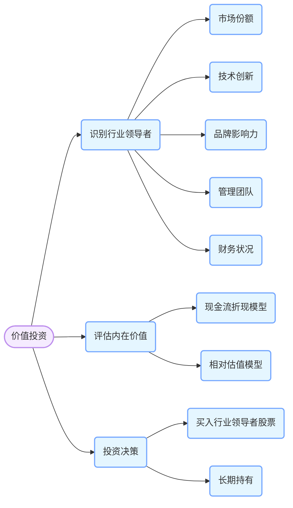

# 价值投资中的行业领导者识别

> 关键词：价值投资、行业领导者、财务指标、竞争优势、市场地位

> 摘要：本文聚焦于价值投资中行业领导者的识别问题。在价值投资领域，准确识别行业领导者对于投资者获取长期稳定收益至关重要。文章首先介绍了研究的背景、目的、预期读者和文档结构，对相关术语进行了清晰定义。接着阐述了行业领导者的核心概念及其与价值投资的联系，通过文本示意图和 Mermaid 流程图展示其架构。详细讲解了用于识别行业领导者的核心算法原理，并给出 Python 源代码示例。深入分析了相关数学模型和公式，结合实际案例进行说明。通过项目实战，展示了开发环境搭建、源代码实现及解读。探讨了行业领导者在不同场景下的实际应用，推荐了学习资源、开发工具框架和相关论文著作。最后总结了未来发展趋势与挑战，提供了常见问题解答和扩展阅读参考资料，旨在为投资者提供全面、系统的行业领导者识别方法和思路。

## 1. 背景介绍 
### 1.1 目的和范围
在价值投资的实践中，投资者的核心目标是寻找那些具有长期投资价值的资产。而行业领导者往往在市场中具有更强的竞争力、更稳定的业绩和更好的发展前景，能够为投资者带来较为可观的回报。本文的目的在于深入探讨如何在价值投资的框架下准确识别行业领导者。我们将研究范围涵盖多个行业，包括但不限于金融、科技、消费、制造业等，分析不同行业中行业领导者所具备的共性和特性，为投资者提供一套系统、科学的识别方法。

### 1.2 预期读者
本文主要面向对价值投资感兴趣的投资者，无论是个人投资者还是专业投资机构的从业者，都可以从本文中获取有价值的信息和方法。同时，对于金融专业的学生和研究人员来说，本文也可以作为研究价值投资和行业分析的参考资料。

### 1.3 文档结构概述
本文将按照以下结构展开：首先介绍核心概念，明确行业领导者的定义和其在价值投资中的重要性；接着阐述识别行业领导者的核心算法原理和具体操作步骤，并给出 Python 代码示例；然后介绍相关的数学模型和公式，并结合实际案例进行详细讲解；通过项目实战展示如何应用这些方法进行行业领导者的识别；探讨行业领导者在实际中的应用场景；推荐学习资源、开发工具框架和相关论文著作；最后总结未来发展趋势与挑战，提供常见问题解答和扩展阅读参考资料。

### 1.4 术语表
#### 1.4.1 核心术语定义
- **价值投资**：一种投资策略，强调通过分析企业的内在价值，寻找被市场低估的股票进行投资，以获取长期的资本增值。
- **行业领导者**：在特定行业中，具有领先的市场地位、较强的竞争优势、卓越的管理团队和良好的财务状况的企业。
- **内在价值**：企业未来预期现金流的现值，是评估企业投资价值的重要指标。
- **市场份额**：企业的产品或服务在市场总销售额中所占的比例，反映了企业在市场中的竞争力。

#### 1.4.2 相关概念解释
- **竞争优势**：企业相对于竞争对手所具有的独特优势，如成本优势、技术优势、品牌优势等，能够使企业在市场中获得更高的利润和市场份额。
- **护城河**：由巴菲特提出的概念，指企业所拥有的可持续的竞争优势，能够保护企业的利润和市场地位免受竞争对手的侵蚀。
- **财务指标**：用于评估企业财务状况和经营业绩的指标，如净利润、毛利率、净资产收益率等。

#### 1.4.3 缩略词列表
- **ROE**：净资产收益率（Return on Equity），反映了企业运用自有资本获取收益的能力。
- **EPS**：每股收益（Earnings Per Share），表示普通股股东每持有一股所能享有的企业净利润或需承担的企业净亏损。
- **PE**：市盈率（Price-to-Earnings Ratio），是股票价格与每股收益的比率，用于评估股票的估值水平。

## 2. 核心概念与联系 

### 行业领导者的核心概念
行业领导者是在特定行业中处于领先地位的企业。这些企业通常具有以下特征：
- **市场份额领先**：在行业中占据较大的市场份额，能够对市场价格和竞争格局产生重要影响。
- **技术创新能力强**：不断投入研发，推出具有创新性的产品或服务，引领行业发展潮流。
- **品牌影响力大**：拥有知名品牌，消费者对其产品或服务具有较高的认可度和忠诚度。
- **管理团队卓越**：具备优秀的管理团队，能够制定合理的战略规划，有效地组织和管理企业的运营。
- **财务状况良好**：具有稳定的盈利能力、较强的偿债能力和良好的现金流状况。

### 行业领导者与价值投资的联系
在价值投资中，行业领导者具有重要的投资价值。首先，行业领导者通常具有较高的内在价值，其稳定的业绩和良好的发展前景能够为投资者带来长期的现金流回报。其次，行业领导者具有较强的抗风险能力，在市场波动和行业竞争中能够保持相对稳定的地位。最后，投资行业领导者可以降低投资者的信息成本和研究难度，因为这些企业的信息相对公开透明，更容易进行分析和评估。

### 核心概念原理和架构的文本示意图
```plaintext
价值投资
|
|--识别行业领导者
|   |--市场份额
|   |--技术创新
|   |--品牌影响力
|   |--管理团队
|   |--财务状况
|
|--评估内在价值
|   |--现金流折现模型
|   |--相对估值模型
|
|--投资决策
|   |--买入行业领导者股票
|   |--长期持有
```

### Mermaid 流程图


## 3. 核心算法原理 & 具体操作步骤 

### 核心算法原理
我们可以通过构建一个综合评估模型来识别行业领导者。该模型主要考虑以下几个方面的因素：市场份额、技术创新能力、品牌影响力、管理团队素质和财务状况。每个因素都赋予一定的权重，然后对每个企业在这些因素上的表现进行评分，最后根据综合得分来确定行业领导者。

### 具体操作步骤
1. **数据收集**：收集行业内各企业的相关数据，包括市场份额、研发投入、品牌知名度、管理团队背景、财务报表等。
2. **指标量化**：将各个因素转化为具体的量化指标，例如市场份额可以用销售额占比来表示，技术创新能力可以用研发投入占比来衡量。
3. **权重确定**：根据各因素对企业竞争力的重要程度，确定每个因素的权重。
4. **评分计算**：对每个企业在各个指标上的表现进行评分，然后根据权重计算综合得分。
5. **领导者识别**：根据综合得分，筛选出得分最高的企业作为行业领导者。

### Python 源代码示例
```python
import pandas as pd

# 定义各因素的权重
weights = {
    'market_share': 0.3,
    'innovation': 0.2,
    'brand': 0.2,
    'management': 0.15,
    'financial': 0.15
}

# 示例数据
data = {
    'company': ['Company A', 'Company B', 'Company C'],
    'market_share': [0.4, 0.3, 0.2],
    'innovation': [0.8, 0.6, 0.4],
    'brand': [0.9, 0.7, 0.5],
    'management': [0.7, 0.6, 0.5],
    'financial': [0.8, 0.7, 0.6]
}

df = pd.DataFrame(data)

# 计算综合得分
def calculate_score(row):
    score = 0
    for factor, weight in weights.items():
        score += row[factor] * weight
    return score

df['score'] = df.apply(calculate_score, axis=1)

# 识别行业领导者
leader = df[df['score'] == df['score'].max()]['company'].values[0]

print(f"行业领导者是: {leader}")
```

## 4. 数学模型和公式 & 详细讲解 & 举例说明 

### 综合评估模型公式
综合得分 $S$ 的计算公式为：
$$S = w_1x_1 + w_2x_2 + w_3x_3 + w_4x_4 + w_5x_5$$
其中，$w_i$ 是第 $i$ 个因素的权重，$x_i$ 是第 $i$ 个因素的得分，$i = 1,2,3,4,5$ 分别对应市场份额、技术创新能力、品牌影响力、管理团队素质和财务状况。

### 详细讲解
- **市场份额得分**：市场份额越高，得分越高。可以将市场份额直接作为得分，也可以根据市场份额的分布情况进行标准化处理。
- **技术创新能力得分**：可以用研发投入占比、专利数量等指标来衡量。研发投入占比越高、专利数量越多，得分越高。
- **品牌影响力得分**：可以通过品牌知名度调查、品牌价值评估等方式来确定。品牌知名度越高、品牌价值越大，得分越高。
- **管理团队素质得分**：可以考虑管理团队的教育背景、工作经验、业绩表现等因素。管理团队素质越高，得分越高。
- **财务状况得分**：可以用净利润率、净资产收益率、资产负债率等指标来评估。财务状况越好，得分越高。

### 举例说明
假设有三家企业 A、B、C，各因素的得分和权重如下表所示：

| 企业 | 市场份额得分 $x_1$ | 技术创新能力得分 $x_2$ | 品牌影响力得分 $x_3$ | 管理团队素质得分 $x_4$ | 财务状况得分 $x_5$ |
| ---- | ---- | ---- | ---- | ---- | ---- |
| A | 0.4 | 0.8 | 0.9 | 0.7 | 0.8 |
| B | 0.3 | 0.6 | 0.7 | 0.6 | 0.7 |
| C | 0.2 | 0.4 | 0.5 | 0.5 | 0.6 |

权重分别为 $w_1 = 0.3$，$w_2 = 0.2$，$w_3 = 0.2$，$w_4 = 0.15$，$w_5 = 0.15$。

则企业 A 的综合得分 $S_A$ 为：
$$S_A = 0.3\times0.4 + 0.2\times0.8 + 0.2\times0.9 + 0.15\times0.7 + 0.15\times0.8$$
$$S_A = 0.12 + 0.16 + 0.18 + 0.105 + 0.12$$
$$S_A = 0.685$$

同理，企业 B 的综合得分 $S_B$ 为：
$$S_B = 0.3\times0.3 + 0.2\times0.6 + 0.2\times0.7 + 0.15\times0.6 + 0.15\times0.7$$
$$S_B = 0.09 + 0.12 + 0.14 + 0.09 + 0.105$$
$$S_B = 0.545$$

企业 C 的综合得分 $S_C$ 为：
$$S_C = 0.3\times0.2 + 0.2\times0.4 + 0.2\times0.5 + 0.15\times0.5 + 0.15\times0.6$$
$$S_C = 0.06 + 0.08 + 0.1 + 0.075 + 0.09$$
$$S_C = 0.405$$

由于 $S_A > S_B > S_C$，所以企业 A 是行业领导者。

## 5. 项目实战：代码实际案例和详细解释说明 

### 5.1  开发环境搭建
- **Python 安装**：建议安装 Python 3.7 及以上版本。可以从 Python 官方网站（https://www.python.org/downloads/）下载安装包进行安装。
- **依赖库安装**：使用 `pip` 安装所需的依赖库，包括 `pandas`、`numpy` 等。可以使用以下命令进行安装：
```sh
pip install pandas numpy
```

### 5.2  源代码详细实现和代码解读
```python
import pandas as pd
import numpy as np

# 定义各因素的权重
weights = {
    'market_share': 0.3,
    'innovation': 0.2,
    'brand': 0.2,
    'management': 0.15,
    'financial': 0.15
}

# 读取数据
data = pd.read_csv('industry_data.csv')

# 数据预处理
# 假设数据中包含缺失值，使用均值填充
for column in data.columns[1:]:
    data[column].fillna(data[column].mean(), inplace=True)

# 计算综合得分
def calculate_score(row):
    score = 0
    for factor, weight in weights.items():
        score += row[factor] * weight
    return score

data['score'] = data.apply(calculate_score, axis=1)

# 识别行业领导者
leader = data[data['score'] == data['score'].max()]['company'].values[0]

print(f"行业领导者是: {leader}")
```

### 代码解读与分析
1. **导入必要的库**：导入 `pandas` 和 `numpy` 库，用于数据处理和计算。
2. **定义权重**：定义各因素的权重，存储在字典 `weights` 中。
3. **读取数据**：使用 `pandas` 的 `read_csv` 函数读取存储行业数据的 CSV 文件。
4. **数据预处理**：检查数据中是否存在缺失值，如果存在则使用均值填充。
5. **计算综合得分**：定义 `calculate_score` 函数，根据权重计算每个企业的综合得分，并将结果存储在新的列 `score` 中。
6. **识别行业领导者**：筛选出综合得分最高的企业，作为行业领导者。

## 6. 实际应用场景 
### 股票投资
在股票投资中，识别行业领导者可以帮助投资者选择具有长期投资价值的股票。投资者可以将资金集中投资于行业领导者的股票，以获取稳定的收益。例如，在科技行业中，苹果公司是行业领导者，其具有强大的品牌影响力、技术创新能力和市场份额，长期来看，投资苹果公司的股票可能会获得较好的回报。

### 行业分析
对于行业分析师来说，识别行业领导者可以帮助他们深入了解行业的竞争格局和发展趋势。通过分析行业领导者的战略决策、市场表现和财务状况，可以预测行业的未来发展方向。例如，在新能源汽车行业中，特斯拉是行业领导者，其在电动汽车技术、自动驾驶技术等方面具有领先优势，通过研究特斯拉的发展战略，可以预测新能源汽车行业的未来发展趋势。

### 企业战略规划
对于企业来说，识别行业领导者可以帮助他们制定合理的战略规划。企业可以学习行业领导者的成功经验，找出自身的差距，并制定相应的改进措施。例如，一家小型科技企业可以分析行业领导者的技术创新模式、市场营销策略等，从而提升自身的竞争力。

## 7. 工具和资源推荐
### 7.1 学习资源推荐
#### 7.1.1 书籍推荐
- 《聪明的投资者》（The Intelligent Investor）：本杰明·格雷厄姆（Benjamin Graham）著，被誉为价值投资的圣经，书中详细介绍了价值投资的理念和方法。
- 《巴菲特致股东的信》（Letters to Shareholders of Berkshire Hathaway）：沃伦·巴菲特（Warren Buffett）著，通过巴菲特致股东的信，读者可以了解到他的投资哲学和选股策略。
- 《竞争战略》（Competitive Strategy）：迈克尔·波特（Michael Porter）著，介绍了企业竞争战略的基本理论和方法，对于理解行业竞争格局和企业竞争力具有重要意义。

#### 7.1.2 在线课程
- Coursera 上的“投资学原理”（Principles of Investing）课程：由知名教授授课，系统介绍了投资学的基本原理和方法。
- edX 上的“价值投资基础”（Foundations of Value Investing）课程：专注于价值投资的基础知识和实践技巧。

#### 7.1.3 技术博客和网站
- Seeking Alpha：提供大量的金融分析文章和投资研究报告，涵盖了各个行业和市场。
- 雪球：国内知名的投资社区，投资者可以在上面交流投资经验、分享研究成果。

### 7.2 开发工具框架推荐
#### 7.2.1 IDE和编辑器
- PyCharm：一款专业的 Python 集成开发环境，具有强大的代码编辑、调试和分析功能。
- Jupyter Notebook：一种交互式的开发环境，适合进行数据分析和模型开发。

#### 7.2.2 调试和性能分析工具
- pdb：Python 自带的调试器，可以帮助开发者定位和解决代码中的问题。
- cProfile：Python 标准库中的性能分析工具，可以分析代码的运行时间和资源消耗情况。

#### 7.2.3 相关框架和库
- pandas：用于数据处理和分析的 Python 库，提供了高效的数据结构和数据操作方法。
- numpy：用于科学计算的 Python 库，提供了高效的数组和矩阵运算功能。

### 7.3 相关论文著作推荐
#### 7.3.1 经典论文
- Fama, Eugene F., and Kenneth R. French. "The Cross-Section of Expected Stock Returns." The Journal of Finance 47, no. 2 (1992): 427-465. 该论文提出了著名的 Fama-French 三因子模型，对资产定价理论产生了深远影响。
- Jensen, Michael C. "The Performance of Mutual Funds in the Period 1945-1964." The Journal of Finance 23, no. 2 (1968): 389-416. 该论文对共同基金的业绩进行了实证研究，提出了 Jensen's alpha 指标。

#### 7.3.2 最新研究成果
- Pastor, Lubos, and Robert F. Stambaugh. "Dissecting Anomalies with a Five-Factor Model." The Review of Financial Studies 29, no. 1 (2016): 65-105. 该论文提出了五因子模型，进一步完善了资产定价理论。
- Hou, Kewei, Chen Xue, and Lu Zhang. "Digesting Anomalies: An Investment Approach." Review of Financial Studies 28, no. 3 (2015): 650-705. 该论文从投资的角度对市场异常现象进行了分析。

#### 7.3.3 应用案例分析
- Koller, Tim, Marc Goedhart, and David Wessels. Valuation: Measuring and Managing the Value of Companies. Wiley, 2015. 该书提供了大量的企业估值案例，对于理解价值投资的实践应用具有重要参考价值。

## 8. 总结：未来发展趋势与挑战
### 未来发展趋势
- **数字化转型加速**：随着科技的不断发展，各行业的数字化转型将加速。行业领导者将更加注重技术创新和数字化运营，以提高企业的竞争力和效率。例如，传统制造业企业将加大对智能制造、工业互联网等领域的投入，实现生产过程的智能化和自动化。
- **绿色可持续发展**：在全球气候变化和环境保护的背景下，绿色可持续发展将成为行业发展的重要趋势。行业领导者将积极响应国家的环保政策，推动企业的绿色转型，开发绿色产品和服务。例如，能源行业将加大对可再生能源的开发和利用，减少对传统化石能源的依赖。
- **国际化竞争加剧**：随着经济全球化的深入发展，企业面临的国际化竞争将加剧。行业领导者将更加注重拓展国际市场，加强国际合作，提高企业的国际影响力。例如，科技企业将加大在海外市场的研发和市场推广力度，与国际竞争对手展开激烈竞争。

### 挑战
- **技术创新压力**：在快速变化的科技环境下，行业领导者需要不断投入研发，保持技术创新的领先地位。然而，技术创新需要大量的资金和人力投入，并且存在一定的风险。如果企业不能及时跟上技术创新的步伐，可能会被竞争对手超越。
- **市场竞争加剧**：随着行业的发展，市场竞争将越来越激烈。行业领导者需要不断提高自身的竞争力，以应对来自竞争对手的挑战。同时，新兴企业的崛起也可能对行业领导者的市场地位构成威胁。
- **政策法规变化**：政策法规的变化可能会对行业领导者的经营产生重大影响。例如，环保政策的加强可能会增加企业的生产成本，金融监管政策的变化可能会影响企业的融资渠道和融资成本。行业领导者需要密切关注政策法规的变化，及时调整企业的战略和经营策略。

## 9. 附录：常见问题与解答
### 如何确定各因素的权重？
确定各因素的权重可以采用多种方法，如专家打分法、层次分析法等。专家打分法是邀请相关领域的专家对各因素的重要程度进行打分，然后根据打分结果确定权重。层次分析法是一种系统的决策分析方法，通过建立层次结构模型，比较各因素之间的相对重要性，从而确定权重。

### 如果数据存在异常值，应该如何处理？
如果数据存在异常值，可以采用以下方法进行处理：
- **删除异常值**：如果异常值是由于数据录入错误或其他原因导致的，可以直接删除这些异常值。
- **替换异常值**：可以使用均值、中位数等统计量来替换异常值。
- **数据变换**：可以对数据进行对数变换、标准化变换等，以减少异常值的影响。

### 如何评估模型的准确性？
可以使用交叉验证、混淆矩阵、准确率、召回率等方法来评估模型的准确性。交叉验证是将数据集分成训练集和测试集，多次重复训练和测试过程，以评估模型的泛化能力。混淆矩阵可以直观地展示模型的分类结果，准确率和召回率可以衡量模型的分类性能。

## 10. 扩展阅读 & 参考资料
### 扩展阅读
- 《金融炼金术》（The Alchemy of Finance）：乔治·索罗斯（George Soros）著，介绍了索罗斯的投资哲学和金融市场理论。
- 《金融市场与金融机构》（Financial Markets and Institutions）：弗雷德里克·米什金（Frederic S. Mishkin）著，系统介绍了金融市场和金融机构的基本原理和运作机制。

### 参考资料
- 相关行业的年度报告和研究报告，如《中国金融行业发展报告》、《全球科技行业研究报告》等。
- 财经媒体的报道和分析文章，如《财新》、《证券时报》等。
- 学术期刊上的相关研究论文，如《金融研究》、《管理世界》等。