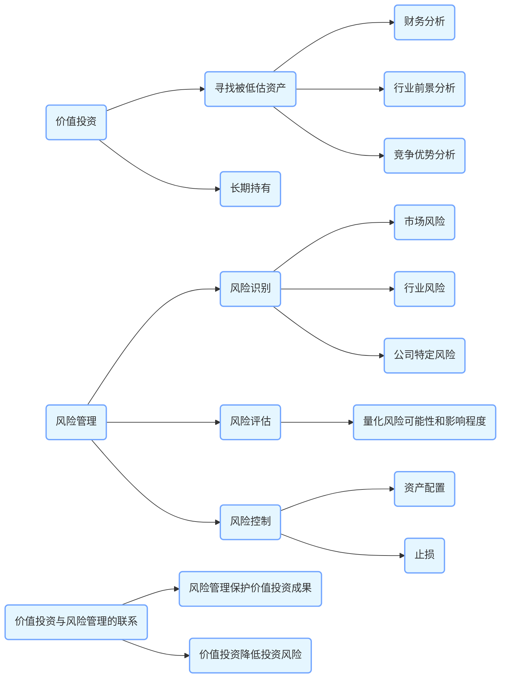

# 价值投资中的风险管理策略

> 关键词：价值投资、风险管理、投资策略、风险评估、资产配置

> 摘要：本文聚焦于价值投资中的风险管理策略。通过对价值投资理念的深入剖析，阐述了风险管理在价值投资中的重要性。详细介绍了核心概念，如风险的定义、类型等，以及它们与价值投资的联系。深入讲解了核心算法原理和具体操作步骤，运用数学模型和公式来量化风险。通过项目实战案例，展示了如何在实际投资中应用风险管理策略。分析了价值投资风险管理策略的实际应用场景，推荐了相关的工具和资源。最后总结了未来发展趋势与挑战，解答了常见问题，并提供了扩展阅读和参考资料，旨在为投资者在价值投资过程中有效管理风险提供全面的指导。

## 1. 背景介绍 
### 1.1 目的和范围
价值投资作为一种长期的投资策略，旨在寻找被市场低估的资产，并通过长期持有来获取资产价值回归所带来的收益。然而，投资过程中不可避免地会面临各种风险，如市场风险、行业风险、公司特定风险等。本文的目的在于探讨价值投资中有效的风险管理策略，帮助投资者在追求价值的同时，合理控制风险，实现投资组合的稳健增长。

本文的范围涵盖了价值投资风险管理的各个方面，包括风险的识别、评估、量化和控制。通过理论分析、算法讲解、实际案例和工具推荐等，为投资者提供全面且实用的风险管理方法。

### 1.2 预期读者
本文的预期读者包括对价值投资感兴趣的个人投资者、专业投资机构的投资经理、金融分析师以及相关金融专业的学生。无论是初学者还是有一定投资经验的人士，都可以从本文中获取关于价值投资风险管理的深入知识和实用技巧。

### 1.3 文档结构概述
本文将按照以下结构进行阐述：首先介绍价值投资和风险管理的核心概念及其联系；接着详细讲解核心算法原理和具体操作步骤，并结合数学模型和公式进行量化分析；然后通过项目实战案例展示风险管理策略的实际应用；之后分析价值投资风险管理策略的实际应用场景；再推荐相关的工具和资源；最后总结未来发展趋势与挑战，解答常见问题，并提供扩展阅读和参考资料。

### 1.4 术语表
#### 1.4.1 核心术语定义
- **价值投资**：一种基于对资产内在价值的评估，寻找被市场低估的资产并长期持有的投资策略。
- **风险管理**：识别、评估和控制投资过程中可能面临的各种风险，以实现投资目标的过程。
- **风险评估**：对投资风险的可能性和影响程度进行分析和评估的过程。
- **资产配置**：将投资资金分配到不同类型的资产上，以降低投资组合的整体风险。

#### 1.4.2 相关概念解释
- **市场风险**：由于市场整体波动而导致投资价值变动的风险，如股票市场的涨跌、利率的变化等。
- **行业风险**：特定行业所面临的风险，如行业竞争加剧、技术变革、政策法规变化等。
- **公司特定风险**：与特定公司相关的风险，如公司管理层决策失误、财务造假、产品质量问题等。

#### 1.4.3 缩略词列表
- **VAR**：Value at Risk，风险价值，一种衡量投资组合在一定置信水平下可能遭受的最大损失的指标。
- **CAPM**：Capital Asset Pricing Model，资本资产定价模型，用于描述资产预期收益率与市场风险之间关系的模型。

## 2. 核心概念与联系 
### 价值投资的核心概念
价值投资的核心在于寻找被市场低估的资产。投资者通过对公司的财务状况、行业前景、竞争优势等进行深入分析，评估公司的内在价值。当市场价格低于内在价值时，投资者认为该资产具有投资价值，从而进行买入操作。例如，一家公司的内在价值经评估为每股100元，而当前市场价格仅为每股80元，此时投资者可能会认为该股票被低估，具有投资价值。

### 风险管理的核心概念
风险管理是投资过程中不可或缺的一部分。它包括风险的识别、评估和控制。风险识别是指找出投资过程中可能面临的各种风险，如市场风险、行业风险、公司特定风险等。风险评估则是对这些风险的可能性和影响程度进行量化分析，以便投资者了解风险的大小。风险控制是指采取相应的措施来降低风险，如资产配置、止损等。

### 价值投资与风险管理的联系
价值投资和风险管理是相辅相成的关系。一方面，有效的风险管理可以保护价值投资的成果。在价值投资过程中，即使投资者找到了被低估的资产，也可能由于市场波动等因素导致投资损失。通过风险管理措施，可以降低这些风险对投资组合的影响。另一方面，价值投资本身也可以看作是一种风险管理策略。通过选择被低估的资产，投资者在一定程度上降低了投资的风险，因为这些资产的价格已经反映了一定的安全边际。

### 文本示意图
```plaintext
价值投资
|
|-- 寻找被低估资产
|   |-- 财务分析
|   |-- 行业前景分析
|   |-- 竞争优势分析
|
|-- 长期持有
|
风险管理
|
|-- 风险识别
|   |-- 市场风险
|   |-- 行业风险
|   |-- 公司特定风险
|
|-- 风险评估
|   |-- 量化风险可能性和影响程度
|
|-- 风险控制
|   |-- 资产配置
|   |-- 止损
|
价值投资与风险管理的联系
|
|-- 风险管理保护价值投资成果
|-- 价值投资降低投资风险
```

### Mermaid 流程图


## 3. 核心算法原理 & 具体操作步骤 
### 风险价值（VAR）算法原理
风险价值（VAR）是一种常用的风险评估指标，用于衡量投资组合在一定置信水平下可能遭受的最大损失。其基本原理是基于历史数据或统计模型，计算投资组合在未来一定时间内的收益分布，然后根据置信水平确定相应的分位数，该分位数对应的损失即为VAR值。

### Python 代码实现
```python
import numpy as np
import pandas as pd
import matplotlib.pyplot as plt
from scipy.stats import norm

# 生成模拟收益率数据
np.random.seed(0)
returns = np.random.normal(0.001, 0.01, 1000)

# 计算 VAR 值
confidence_level = 0.95
var = np.percentile(returns, 100 * (1 - confidence_level))

print(f"在 {confidence_level * 100}% 的置信水平下，VAR 值为: {var:.4f}")

# 绘制收益率分布直方图
plt.hist(returns, bins=50, density=True, alpha=0.7)
xmin, xmax = plt.xlim()
x = np.linspace(xmin, xmax, 100)
p = norm.pdf(x, np.mean(returns), np.std(returns))
plt.plot(x, p, 'k', linewidth=2)
plt.axvline(x=var, color='r', linestyle='--', label=f'VAR at {confidence_level * 100}%')
plt.title('收益率分布及 VAR 值')
plt.xlabel('收益率')
plt.ylabel('概率密度')
plt.legend()
plt.show()
```

### 具体操作步骤
1. **数据收集**：收集投资组合的历史收益率数据。
2. **收益率计算**：根据收集到的数据，计算投资组合的每日收益率。
3. **VAR 计算**：使用历史模拟法或参数法计算 VAR 值。历史模拟法直接基于历史收益率数据进行分位数计算；参数法假设收益率服从某种分布（如正态分布），通过计算分布的参数来确定 VAR 值。
4. **结果分析**：根据计算得到的 VAR 值，评估投资组合在一定置信水平下的风险状况。

## 4. 数学模型和公式 & 详细讲解 & 举例说明 
### 资本资产定价模型（CAPM）
资本资产定价模型（CAPM）用于描述资产预期收益率与市场风险之间的关系。其公式为：

$$E(R_i) = R_f + \beta_i (E(R_m) - R_f)$$

其中：
- $E(R_i)$ 是资产 $i$ 的预期收益率；
- $R_f$ 是无风险利率，通常可以用国债收益率来近似表示；
- $\beta_i$ 是资产 $i$ 的贝塔系数，衡量资产 $i$ 的收益率相对于市场收益率的波动程度；
- $E(R_m)$ 是市场组合的预期收益率。

### 详细讲解
贝塔系数 $\beta_i$ 反映了资产 $i$ 对市场风险的敏感度。当 $\beta_i > 1$ 时，资产 $i$ 的收益率波动幅度大于市场收益率的波动幅度，说明该资产具有较高的市场风险；当 $\beta_i < 1$ 时，资产 $i$ 的收益率波动幅度小于市场收益率的波动幅度，说明该资产的市场风险较低；当 $\beta_i = 1$ 时，资产 $i$ 的收益率波动幅度与市场收益率的波动幅度相同。

### 举例说明
假设无风险利率 $R_f = 3\%$，市场组合的预期收益率 $E(R_m) = 10\%$，某股票的贝塔系数 $\beta_i = 1.2$。则该股票的预期收益率为：

$$E(R_i) = 0.03 + 1.2\times(0.1 - 0.03) = 0.03 + 1.2\times0.07 = 0.114 = 11.4\%$$

这意味着，根据 CAPM 模型，该股票的预期收益率为 11.4%。投资者可以根据这个预期收益率来评估该股票的投资价值。

## 5. 项目实战：代码实际案例和详细解释说明 
### 5.1  开发环境搭建
- **操作系统**：Windows、Linux 或 macOS 均可。
- **Python 版本**：建议使用 Python 3.7 及以上版本。
- **安装必要的库**：使用以下命令安装所需的库：
```bash
pip install numpy pandas matplotlib scipy
```

### 5.2  源代码详细实现和代码解读
以下是一个简单的价值投资风险管理项目的代码示例，用于计算投资组合的风险和收益，并进行资产配置优化。

```python
import numpy as np
import pandas as pd
import matplotlib.pyplot as plt
from scipy.optimize import minimize

# 模拟股票收益率数据
np.random.seed(0)
n_stocks = 5
n_periods = 252
returns = pd.DataFrame(np.random.normal(0.001, 0.01, (n_periods, n_stocks)),
                       columns=[f'Stock {i}' for i in range(1, n_stocks + 1)])

# 计算协方差矩阵和平均收益率
cov_matrix = returns.cov()
mean_returns = returns.mean()

# 定义目标函数：最小化投资组合的风险
def portfolio_volatility(weights, cov_matrix):
    return np.sqrt(np.dot(weights.T, np.dot(cov_matrix, weights)))

# 定义约束条件：权重之和为 1
constraints = ({'type': 'eq', 'fun': lambda x: np.sum(x) - 1})

# 定义权重边界：权重在 0 到 1 之间
bounds = [(0, 1) for _ in range(n_stocks)]

# 初始权重
initial_weights = np.ones(n_stocks) / n_stocks

# 最小化投资组合的风险
result = minimize(portfolio_volatility, initial_weights, args=(cov_matrix,),
                  method='SLSQP', bounds=bounds, constraints=constraints)

# 最优权重
optimal_weights = result.x

# 计算最优投资组合的收益率和风险
optimal_return = np.dot(mean_returns, optimal_weights)
optimal_volatility = portfolio_volatility(optimal_weights, cov_matrix)

print(f"最优投资组合的收益率: {optimal_return:.4f}")
print(f"最优投资组合的风险: {optimal_volatility:.4f}")
print(f"最优权重: {optimal_weights}")

# 绘制投资组合的有效前沿
n_portfolios = 1000
portfolio_returns = []
portfolio_volatilities = []

for _ in range(n_portfolios):
    weights = np.random.random(n_stocks)
    weights /= np.sum(weights)
    portfolio_return = np.dot(mean_returns, weights)
    portfolio_volatility = np.sqrt(np.dot(weights.T, np.dot(cov_matrix, weights)))
    portfolio_returns.append(portfolio_return)
    portfolio_volatilities.append(portfolio_volatility)

plt.scatter(portfolio_volatilities, portfolio_returns, c=portfolio_returns / np.array(portfolio_volatilities), cmap='viridis')
plt.colorbar(label='Sharpe Ratio')
plt.scatter(optimal_volatility, optimal_return, marker='*', color='r', s=200, label='最优投资组合')
plt.title('投资组合的有效前沿')
plt.xlabel('风险（标准差）')
plt.ylabel('收益率')
plt.legend()
plt.show()
```

### 5.3  代码解读与分析
1. **数据生成**：使用 `np.random.normal` 函数生成模拟的股票收益率数据。
2. **协方差矩阵和平均收益率计算**：使用 `returns.cov()` 计算收益率的协方差矩阵，使用 `returns.mean()` 计算平均收益率。
3. **目标函数定义**：定义 `portfolio_volatility` 函数，用于计算投资组合的风险（标准差）。
4. **约束条件和边界定义**：定义约束条件 `constraints` 确保权重之和为 1，定义权重边界 `bounds` 确保权重在 0 到 1 之间。
5. **优化求解**：使用 `scipy.optimize.minimize` 函数最小化投资组合的风险，得到最优权重。
6. **结果计算和输出**：计算最优投资组合的收益率和风险，并输出最优权重。
7. **有效前沿绘制**：生成 1000 个随机投资组合，计算它们的收益率和风险，绘制有效前沿图，并标记出最优投资组合。

## 6. 实际应用场景 
### 个人投资者
个人投资者在进行价值投资时，风险管理策略可以帮助他们合理配置资产，降低投资风险。例如，通过使用 VAR 模型评估投资组合的风险，个人投资者可以确定自己能够承受的最大损失，从而调整投资组合的权重。同时，利用 CAPM 模型，个人投资者可以评估不同股票的预期收益率，选择具有较高投资价值的股票。

### 专业投资机构
专业投资机构通常管理着大量的资金，风险管理尤为重要。投资机构可以使用更复杂的风险管理模型和工具，如多因子模型、蒙特卡罗模拟等，来评估和控制投资组合的风险。此外，投资机构还可以通过资产配置和对冲策略来降低系统性风险和非系统性风险。

### 金融分析师
金融分析师在进行投资分析和建议时，需要考虑风险管理因素。他们可以使用各种风险管理指标和模型，为投资者提供准确的风险评估和投资建议。例如，金融分析师可以使用夏普比率、特雷诺比率等指标来评估投资组合的风险调整后收益，帮助投资者选择最优的投资组合。

## 7. 工具和资源推荐
### 7.1 学习资源推荐
#### 7.1.1 书籍推荐
- 《聪明的投资者》（The Intelligent Investor）：本杰明·格雷厄姆（Benjamin Graham）著，价值投资的经典之作，介绍了价值投资的基本理念和风险管理方法。
- 《金融风险管理师手册》（FRM Handbook）：菲利普·乔瑞（Philippe Jorion）著，全面介绍了金融风险管理的理论和实践，包括市场风险、信用风险、操作风险等。
- 《漫步华尔街》（A Random Walk Down Wall Street）：伯顿·马尔基尔（Burton Malkiel）著，探讨了股票市场的有效性和投资策略，对风险管理有深入的分析。

#### 7.1.2 在线课程
- Coursera 上的“金融风险管理”（Financial Risk Management）课程：由纽约大学斯特恩商学院教授讲授，涵盖了金融风险管理的各个方面。
- edX 上的“投资学原理”（Principles of Investing）课程：介绍了投资的基本原理和风险管理策略，适合初学者。

#### 7.1.3 技术博客和网站
- Seeking Alpha：提供股票分析、投资策略和风险管理的文章和评论。
- Investopedia：金融知识的百科全书，包含了大量关于价值投资和风险管理的文章和教程。

### 7.2 开发工具框架推荐
#### 7.2.1 IDE和编辑器
- PyCharm：一款专业的 Python 集成开发环境，提供了丰富的代码编辑、调试和分析功能。
- Jupyter Notebook：一种交互式的编程环境，适合进行数据分析和模型开发。

#### 7.2.2 调试和性能分析工具
- IPython：增强的 Python 解释器，提供了丰富的调试和交互功能。
- cProfile：Python 内置的性能分析工具，用于分析代码的运行时间和性能瓶颈。

#### 7.2.3 相关框架和库
- NumPy：用于科学计算和数值分析的 Python 库，提供了高效的数组操作和数学函数。
- Pandas：用于数据处理和分析的 Python 库，提供了强大的数据结构和数据处理功能。
- Scikit-learn：用于机器学习和数据分析的 Python 库，提供了各种机器学习算法和工具。

### 7.3 相关论文著作推荐
#### 7.3.1 经典论文
- Markowitz, H. M. (1952). Portfolio Selection. The Journal of Finance, 7(1), 77-91. 该论文提出了现代投资组合理论，为资产配置和风险管理奠定了基础。
- Sharpe, W. F. (1964). Capital Asset Prices: A Theory of Market Equilibrium Under Conditions of Risk. The Journal of Finance, 19(3), 425-442. 该论文提出了资本资产定价模型（CAPM），用于描述资产预期收益率与市场风险之间的关系。

#### 7.3.2 最新研究成果
- 通过 Google Scholar 等学术搜索引擎，可以搜索到关于价值投资和风险管理的最新研究成果。例如，一些研究探讨了机器学习在风险管理中的应用，以及如何应对新兴市场的风险等。

#### 7.3.3 应用案例分析
- 一些金融研究机构和咨询公司会发布关于价值投资风险管理的应用案例分析报告。这些报告可以帮助投资者了解实际应用中的风险管理策略和方法。

## 8. 总结：未来发展趋势与挑战
### 未来发展趋势
- **智能化风险管理**：随着人工智能和机器学习技术的发展，风险管理将越来越智能化。例如，使用深度学习模型来预测市场风险和资产价格波动，使用自然语言处理技术来分析新闻和社交媒体数据，以识别潜在的风险因素。
- **整合风险管理**：未来的风险管理将更加注重整合性，将市场风险、信用风险、操作风险等各种风险进行统一管理。同时，将风险管理与投资决策、资产配置等进行深度融合，实现更全面的风险管理。
- **绿色金融风险管理**：随着全球对环境保护和可持续发展的关注不断增加，绿色金融将成为未来的发展趋势。风险管理也将涉及到对环境、社会和治理（ESG）因素的评估和管理，以应对气候变化等风险。

### 挑战
- **数据质量和可用性**：风险管理需要大量的高质量数据，但数据的质量和可用性往往是一个挑战。例如，一些新兴市场的数据可能不够完整和准确，这会影响风险管理模型的准确性。
- **模型的复杂性和解释性**：随着风险管理模型的不断发展，模型的复杂性也在增加。这可能导致模型的解释性变差，难以理解模型的决策过程和结果。
- **市场的不确定性和黑天鹅事件**：市场的不确定性和黑天鹅事件是风险管理面临的最大挑战之一。这些事件往往具有不可预测性和巨大的影响，传统的风险管理模型可能无法有效应对。

## 9. 附录：常见问题与解答
### 问题 1：价值投资和风险管理哪个更重要？
价值投资和风险管理都非常重要，它们是相辅相成的关系。价值投资可以帮助投资者寻找被低估的资产，获取长期收益；而风险管理可以保护投资成果，降低投资风险。在实际投资中，投资者需要在追求价值的同时，合理控制风险。

### 问题 2：如何选择适合自己的风险管理策略？
选择适合自己的风险管理策略需要考虑多个因素，如投资目标、风险承受能力、投资期限等。例如，如果投资者的风险承受能力较低，可以选择较为保守的风险管理策略，如资产配置和止损；如果投资者的风险承受能力较高，可以选择一些较为激进的风险管理策略，如对冲和杠杆交易。

### 问题 3：VAR 模型有哪些局限性？
VAR 模型的局限性主要包括：
- 依赖历史数据：VAR 模型基于历史数据进行计算，假设未来的市场情况与过去相似。但市场是不断变化的，历史数据可能无法准确反映未来的风险。
- 无法预测极端事件：VAR 模型通常假设收益率服从正态分布，但实际市场中可能存在极端事件，如黑天鹅事件，这些事件在 VAR 模型中可能被低估。
- 单一指标：VAR 模型只提供了一个单一的风险指标，无法全面反映投资组合的风险特征。

## 10. 扩展阅读 & 参考资料
### 扩展阅读
- 《黑天鹅：如何应对不可预知的未来》（The Black Swan: The Impact of the Highly Improbable）：纳西姆·尼古拉斯·塔勒布（Nassim Nicholas Taleb）著，探讨了黑天鹅事件的影响和应对策略。
- 《反脆弱：从不确定性中获益》（Antifragile: Things That Gain from Disorder）：纳西姆·尼古拉斯·塔勒布（Nassim Nicholas Taleb）著，提出了反脆弱的概念，即一些事物在不确定性和波动中能够获益。

### 参考资料
- Graham, B., & Dodd, D. L. (1934). Security Analysis. McGraw-Hill.
- Jorion, P. (2007). Financial Risk Manager Handbook Plus Test Bank: FRM Part I and Part II. Wiley.
- Malkiel, B. G. (1973). A Random Walk Down Wall Street: The Time-Tested Strategy for Successful Investing. W. W. Norton & Company.