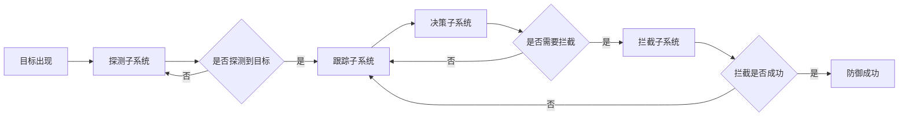

# 价值投资中的高超音速武器防御系统前景

> 关键词：价值投资、高超音速武器防御系统、军事技术、市场前景、投资趋势

> 摘要：本文聚焦于价值投资视角下高超音速武器防御系统的前景。首先介绍了相关背景，包括目的范围、预期读者等内容。接着阐述了高超音速武器防御系统的核心概念与联系，分析其核心算法原理与操作步骤，并通过数学模型和公式进行深入讲解。在项目实战部分，给出了代码实际案例并详细解读。探讨了该系统的实际应用场景，推荐了学习、开发相关的工具和资源。最后总结了其未来发展趋势与挑战，解答常见问题并提供扩展阅读和参考资料，旨在为投资者和相关从业者全面呈现高超音速武器防御系统在价值投资领域的潜力与方向。

## 1. 背景介绍 
### 1.1 目的和范围
在当今复杂多变的国际安全格局下，高超音速武器的发展给传统的防御体系带来了前所未有的挑战。本研究的目的在于从价值投资的角度深入剖析高超音速武器防御系统的前景，为投资者提供专业的参考和决策依据。范围涵盖了高超音速武器防御系统的技术原理、市场需求、应用场景、投资潜力以及未来发展趋势等多个方面。通过对这些内容的研究，全面评估该领域的投资价值和风险。

### 1.2 预期读者
本文预期读者主要包括价值投资者、军事技术研究者、国防工业从业者以及对军事科技投资感兴趣的人群。对于价值投资者而言，希望通过本文了解高超音速武器防御系统的投资机会和潜在回报；军事技术研究者可以从技术原理和发展趋势的分析中获取新的研究思路；国防工业从业者能够借助本文了解市场动态和竞争态势，为企业的战略规划提供参考；而对军事科技投资感兴趣的人群则可以通过本文初步了解该领域的基本知识和投资要点。

### 1.3 文档结构概述
本文将按照以下结构展开：首先介绍背景信息，包括目的、预期读者和文档结构概述等；接着阐述高超音速武器防御系统的核心概念与联系，通过文本示意图和 Mermaid 流程图展示其原理和架构；然后详细讲解核心算法原理和具体操作步骤，并结合 Python 源代码进行说明；随后介绍数学模型和公式，并举例说明；在项目实战部分，给出开发环境搭建、源代码实现和代码解读；探讨该系统的实际应用场景；推荐相关的学习、开发工具和资源；总结未来发展趋势与挑战；解答常见问题；最后提供扩展阅读和参考资料。

### 1.4 术语表
#### 1.4.1 核心术语定义
- **高超音速武器**：指飞行速度达到或超过 5 倍音速（即马赫数大于 5）的武器，具有飞行速度快、突防能力强等特点。
- **高超音速武器防御系统**：用于探测、跟踪、拦截高超音速武器的一系列技术和设备的组合，旨在保护己方目标免受高超音速武器的攻击。
- **价值投资**：一种基于对资产内在价值的评估，通过寻找被低估的资产进行投资，以获取长期稳定回报的投资策略。

#### 1.4.2 相关概念解释
- **探测技术**：包括雷达探测、红外探测等多种手段，用于发现高超音速武器的踪迹。
- **跟踪技术**：在探测到目标后，持续跟踪其飞行轨迹，为拦截提供准确的目标信息。
- **拦截技术**：利用导弹、激光等手段对高超音速武器进行拦截，使其失去攻击能力。

#### 1.4.3 缩略词列表
- **Ma**：马赫数，用于表示飞行器的飞行速度与音速的比值。
- **C4ISR**：指挥、控制、通信、计算机、情报、监视和侦察系统，是军事作战中的重要支撑系统。

## 2. 核心概念与联系 

### 核心概念原理
高超音速武器防御系统的核心原理是通过多层次的探测、跟踪和拦截手段，对高超音速武器进行有效防御。其主要包括以下几个关键环节：
1. **目标探测**：利用各种探测设备，如雷达、红外传感器等，对高超音速武器进行早期发现。雷达通过发射电磁波并接收反射波来确定目标的位置和速度；红外传感器则通过检测目标的红外辐射来发现目标。
2. **目标跟踪**：在探测到目标后，跟踪系统持续监测目标的飞行轨迹，实时更新目标的位置、速度和姿态等信息。这需要高精度的传感器和先进的算法来实现。
3. **拦截决策**：根据目标的跟踪信息，决策系统评估拦截的可行性和最佳时机，并选择合适的拦截手段。拦截手段包括导弹拦截、激光拦截等。
4. **拦截执行**：在决策确定后，拦截系统迅速启动，对目标进行拦截。导弹拦截是通过发射拦截导弹，使其与目标在预定位置相遇并摧毁目标；激光拦截则是利用高能激光束照射目标，使其受损或失去飞行能力。

### 架构的文本示意图
```plaintext
高超音速武器防御系统
|-- 探测子系统
|   |-- 雷达探测模块
|   |-- 红外探测模块
|   |-- 其他探测手段
|-- 跟踪子系统
|   |-- 数据处理模块
|   |-- 轨迹预测模块
|-- 决策子系统
|   |-- 威胁评估模块
|   |-- 拦截策略生成模块
|-- 拦截子系统
|   |-- 导弹拦截模块
|   |-- 激光拦截模块
```

### Mermaid 流程图


## 3. 核心算法原理 & 具体操作步骤 

### 核心算法原理
在高超音速武器防御系统中，目标跟踪和拦截决策是两个关键环节，下面分别介绍其核心算法原理。

#### 目标跟踪算法
目标跟踪算法的核心是通过对传感器获取的目标数据进行处理，估计目标的状态（如位置、速度、加速度等），并预测其未来的飞行轨迹。常用的目标跟踪算法有卡尔曼滤波算法和扩展卡尔曼滤波算法。

卡尔曼滤波算法是一种最优线性估计算法，适用于线性系统。其基本思想是通过对系统的状态方程和观测方程进行递推计算，不断更新目标的状态估计值。卡尔曼滤波算法的步骤如下：
1. **预测步骤**：根据系统的状态方程，预测目标的下一个状态。
2. **更新步骤**：根据观测数据，对预测的状态进行修正，得到更准确的状态估计值。

扩展卡尔曼滤波算法是卡尔曼滤波算法的扩展，适用于非线性系统。在高超音速武器防御系统中，目标的运动通常是非线性的，因此扩展卡尔曼滤波算法更为常用。

#### 拦截决策算法
拦截决策算法的核心是根据目标的跟踪信息，评估拦截的可行性和最佳时机，并选择合适的拦截手段。常用的拦截决策算法有基于规则的决策算法和基于优化的决策算法。

基于规则的决策算法是根据预先设定的规则进行决策。例如，如果目标的速度超过某个阈值，且距离己方目标小于某个阈值，则选择导弹拦截；否则，选择激光拦截。

基于优化的决策算法是通过建立优化模型，求解最优的拦截策略。例如，以拦截成功率最大为目标，考虑拦截成本、拦截时间等约束条件，求解最优的拦截时机和拦截手段。

### 具体操作步骤

#### 目标跟踪操作步骤
```python
import numpy as np

# 定义卡尔曼滤波类
class KalmanFilter:
    def __init__(self, A, H, Q, R, x0, P0):
        self.A = A  # 状态转移矩阵
        self.H = H  # 观测矩阵
        self.Q = Q  # 过程噪声协方差矩阵
        self.R = R  # 观测噪声协方差矩阵
        self.x = x0  # 初始状态估计值
        self.P = P0  # 初始状态协方差矩阵

    def predict(self):
        # 预测步骤
        self.x = np.dot(self.A, self.x)
        self.P = np.dot(np.dot(self.A, self.P), self.A.T) + self.Q
        return self.x

    def update(self, z):
        # 更新步骤
        y = z - np.dot(self.H, self.x)
        S = np.dot(np.dot(self.H, self.P), self.H.T) + self.R
        K = np.dot(np.dot(self.P, self.H.T), np.linalg.inv(S))
        self.x = self.x + np.dot(K, y)
        self.P = np.dot((np.eye(self.P.shape[0]) - np.dot(K, self.H)), self.P)
        return self.x

# 示例参数
A = np.array([[1, 1], [0, 1]])  # 状态转移矩阵
H = np.array([[1, 0]])  # 观测矩阵
Q = np.array([[0.1, 0], [0, 0.1]])  # 过程噪声协方差矩阵
R = np.array([[1]])  # 观测噪声协方差矩阵
x0 = np.array([[0], [0]])  # 初始状态估计值
P0 = np.array([[1, 0], [0, 1]])  # 初始状态协方差矩阵

# 创建卡尔曼滤波器对象
kf = KalmanFilter(A, H, Q, R, x0, P0)

# 模拟观测数据
observations = [1, 2, 3, 4, 5]

# 进行目标跟踪
for z in observations:
    z = np.array([[z]])
    kf.predict()
    x_hat = kf.update(z)
    print("Estimated state:", x_hat)
```

#### 拦截决策操作步骤
```python
# 基于规则的拦截决策算法示例
def rule_based_decision(target_speed, target_distance):
    if target_speed > 1000 and target_distance < 100:
        return "Missile Interception"
    else:
        return "Laser Interception"

# 示例目标信息
target_speed = 1200
target_distance = 80

# 进行拦截决策
decision = rule_based_decision(target_speed, target_distance)
print("Interception decision:", decision)
```

## 4. 数学模型和公式 & 详细讲解 & 举例说明 

### 卡尔曼滤波数学模型和公式
卡尔曼滤波的数学模型由状态方程和观测方程组成。

#### 状态方程
状态方程描述了目标状态的动态变化，其一般形式为：
$$
\mathbf{x}_{k+1} = \mathbf{A}\mathbf{x}_{k} + \mathbf{B}\mathbf{u}_{k} + \mathbf{w}_{k}
$$
其中，$\mathbf{x}_{k}$ 是 $k$ 时刻的目标状态向量，$\mathbf{A}$ 是状态转移矩阵，$\mathbf{B}$ 是控制输入矩阵，$\mathbf{u}_{k}$ 是 $k$ 时刻的控制输入向量，$\mathbf{w}_{k}$ 是 $k$ 时刻的过程噪声向量，服从均值为零、协方差为 $\mathbf{Q}$ 的高斯分布。

#### 观测方程
观测方程描述了传感器观测值与目标状态之间的关系，其一般形式为：
$$
\mathbf{z}_{k} = \mathbf{H}\mathbf{x}_{k} + \mathbf{v}_{k}
$$
其中，$\mathbf{z}_{k}$ 是 $k$ 时刻的观测向量，$\mathbf{H}$ 是观测矩阵，$\mathbf{v}_{k}$ 是 $k$ 时刻的观测噪声向量，服从均值为零、协方差为 $\mathbf{R}$ 的高斯分布。

#### 卡尔曼滤波算法公式
卡尔曼滤波算法的步骤如下：

1. **预测步骤**
    - 预测状态：
$$
\hat{\mathbf{x}}_{k|k - 1} = \mathbf{A}\hat{\mathbf{x}}_{k - 1|k - 1} + \mathbf{B}\mathbf{u}_{k - 1}
$$
    - 预测状态协方差：
$$
\mathbf{P}_{k|k - 1} = \mathbf{A}\mathbf{P}_{k - 1|k - 1}\mathbf{A}^{T} + \mathbf{Q}
$$

2. **更新步骤**
    - 计算创新：
$$
\mathbf{y}_{k} = \mathbf{z}_{k} - \mathbf{H}\hat{\mathbf{x}}_{k|k - 1}
$$
    - 计算创新协方差：
$$
\mathbf{S}_{k} = \mathbf{H}\mathbf{P}_{k|k - 1}\mathbf{H}^{T} + \mathbf{R}
$$
    - 计算卡尔曼增益：
$$
\mathbf{K}_{k} = \mathbf{P}_{k|k - 1}\mathbf{H}^{T}\mathbf{S}_{k}^{-1}
$$
    - 更新状态估计值：
$$
\hat{\mathbf{x}}_{k|k} = \hat{\mathbf{x}}_{k|k - 1} + \mathbf{K}_{k}\mathbf{y}_{k}
$$
    - 更新状态协方差：
$$
\mathbf{P}_{k|k} = (\mathbf{I} - \mathbf{K}_{k}\mathbf{H})\mathbf{P}_{k|k - 1}
$$

### 举例说明
假设一个一维的目标跟踪问题，目标的状态向量 $\mathbf{x} = [x, v]^T$，其中 $x$ 是目标的位置，$v$ 是目标的速度。状态转移矩阵 $\mathbf{A} = \begin{bmatrix}1 & \Delta t \\ 0 & 1\end{bmatrix}$，观测矩阵 $\mathbf{H} = \begin{bmatrix}1 & 0\end{bmatrix}$，过程噪声协方差矩阵 $\mathbf{Q} = \begin{bmatrix}q_1 & 0 \\ 0 & q_2\end{bmatrix}$，观测噪声协方差矩阵 $\mathbf{R} = r$。

已知初始状态估计值 $\hat{\mathbf{x}}_{0|0} = [0, 0]^T$，初始状态协方差矩阵 $\mathbf{P}_{0|0} = \begin{bmatrix}1 & 0 \\ 0 & 1\end{bmatrix}$，观测数据 $\mathbf{z} = [1, 2, 3, 4, 5]$，时间步长 $\Delta t = 1$，$q_1 = 0.1$，$q_2 = 0.1$，$r = 1$。

按照卡尔曼滤波算法的步骤进行计算：

1. **预测步骤**
    - 预测状态：
$$
\hat{\mathbf{x}}_{1|0} = \mathbf{A}\hat{\mathbf{x}}_{0|0} = \begin{bmatrix}1 & 1 \\ 0 & 1\end{bmatrix}\begin{bmatrix}0 \\ 0\end{bmatrix} = \begin{bmatrix}0 \\ 0\end{bmatrix}
$$
    - 预测状态协方差：
$$
\mathbf{P}_{1|0} = \mathbf{A}\mathbf{P}_{0|0}\mathbf{A}^{T} + \mathbf{Q} = \begin{bmatrix}1 & 1 \\ 0 & 1\end{bmatrix}\begin{bmatrix}1 & 0 \\ 0 & 1\end{bmatrix}\begin{bmatrix}1 & 0 \\ 1 & 1\end{bmatrix} + \begin{bmatrix}0.1 & 0 \\ 0 & 0.1\end{bmatrix} = \begin{bmatrix}2.1 & 1 \\ 1 & 1.1\end{bmatrix}
$$

2. **更新步骤**
    - 计算创新：
$$
\mathbf{y}_{1} = \mathbf{z}_{1} - \mathbf{H}\hat{\mathbf{x}}_{1|0} = 1 - \begin{bmatrix}1 & 0\end{bmatrix}\begin{bmatrix}0 \\ 0\end{bmatrix} = 1
$$
    - 计算创新协方差：
$$
\mathbf{S}_{1} = \mathbf{H}\mathbf{P}_{1|0}\mathbf{H}^{T} + \mathbf{R} = \begin{bmatrix}1 & 0\end{bmatrix}\begin{bmatrix}2.1 & 1 \\ 1 & 1.1\end{bmatrix}\begin{bmatrix}1 \\ 0\end{bmatrix} + 1 = 3.1
$$
    - 计算卡尔曼增益：
$$
\mathbf{K}_{1} = \mathbf{P}_{1|0}\mathbf{H}^{T}\mathbf{S}_{1}^{-1} = \begin{bmatrix}2.1 & 1 \\ 1 & 1.1\end{bmatrix}\begin{bmatrix}1 \\ 0\end{bmatrix}\frac{1}{3.1} = \begin{bmatrix}0.6774 \\ 0.3226\end{bmatrix}
$$
    - 更新状态估计值：
$$
\hat{\mathbf{x}}_{1|1} = \hat{\mathbf{x}}_{1|0} + \mathbf{K}_{1}\mathbf{y}_{1} = \begin{bmatrix}0 \\ 0\end{bmatrix} + \begin{bmatrix}0.6774 \\ 0.3226\end{bmatrix}\times 1 = \begin{bmatrix}0.6774 \\ 0.3226\end{bmatrix}
$$
    - 更新状态协方差：
$$
\mathbf{P}_{1|1} = (\mathbf{I} - \mathbf{K}_{1}\mathbf{H})\mathbf{P}_{1|0} = \left(\begin{bmatrix}1 & 0 \\ 0 & 1\end{bmatrix} - \begin{bmatrix}0.6774 \\ 0.3226\end{bmatrix}\begin{bmatrix}1 & 0\end{bmatrix}\right)\begin{bmatrix}2.1 & 1 \\ 1 & 1.1\end{bmatrix} = \begin{bmatrix}0.6871 & 0.3226 \\ 0.3226 & 0.7874\end{bmatrix}
$$

重复上述步骤，即可完成对目标状态的跟踪。

## 5. 项目实战：代码实际案例和详细解释说明 

### 5.1  开发环境搭建
为了实现高超音速武器防御系统的相关算法，我们可以使用 Python 作为开发语言，并结合一些常用的科学计算库。以下是具体的开发环境搭建步骤：

1. **安装 Python**：从 Python 官方网站（https://www.python.org/downloads/）下载并安装 Python 3.x 版本。
2. **安装科学计算库**：使用 pip 命令安装所需的库，包括 NumPy、SciPy 等。
```sh
pip install numpy scipy
```
3. **选择开发工具**：可以选择使用 PyCharm、Jupyter Notebook 等开发工具。

### 5.2  源代码详细实现和代码解读

#### 目标跟踪代码实现
```python
import numpy as np

# 定义卡尔曼滤波类
class KalmanFilter:
    def __init__(self, A, H, Q, R, x0, P0):
        self.A = A  # 状态转移矩阵
        self.H = H  # 观测矩阵
        self.Q = Q  # 过程噪声协方差矩阵
        self.R = R  # 观测噪声协方差矩阵
        self.x = x0  # 初始状态估计值
        self.P = P0  # 初始状态协方差矩阵

    def predict(self):
        # 预测步骤
        self.x = np.dot(self.A, self.x)
        self.P = np.dot(np.dot(self.A, self.P), self.A.T) + self.Q
        return self.x

    def update(self, z):
        # 更新步骤
        y = z - np.dot(self.H, self.x)
        S = np.dot(np.dot(self.H, self.P), self.H.T) + self.R
        K = np.dot(np.dot(self.P, self.H.T), np.linalg.inv(S))
        self.x = self.x + np.dot(K, y)
        self.P = np.dot((np.eye(self.P.shape[0]) - np.dot(K, self.H)), self.P)
        return self.x

# 示例参数
A = np.array([[1, 1], [0, 1]])  # 状态转移矩阵
H = np.array([[1, 0]])  # 观测矩阵
Q = np.array([[0.1, 0], [0, 0.1]])  # 过程噪声协方差矩阵
R = np.array([[1]])  # 观测噪声协方差矩阵
x0 = np.array([[0], [0]])  # 初始状态估计值
P0 = np.array([[1, 0], [0, 1]])  # 初始状态协方差矩阵

# 创建卡尔曼滤波器对象
kf = KalmanFilter(A, H, Q, R, x0, P0)

# 模拟观测数据
observations = [1, 2, 3, 4, 5]

# 进行目标跟踪
for z in observations:
    z = np.array([[z]])
    kf.predict()
    x_hat = kf.update(z)
    print("Estimated state:", x_hat)
```

#### 代码解读
- **KalmanFilter 类**：定义了卡尔曼滤波器的基本结构和方法。`__init__` 方法用于初始化滤波器的参数，包括状态转移矩阵 `A`、观测矩阵 `H`、过程噪声协方差矩阵 `Q`、观测噪声协方差矩阵 `R`、初始状态估计值 `x0` 和初始状态协方差矩阵 `P0`。
- **predict 方法**：实现了卡尔曼滤波的预测步骤，根据状态转移矩阵更新目标的状态估计值，并更新状态协方差矩阵。
- **update 方法**：实现了卡尔曼滤波的更新步骤，根据观测数据修正目标的状态估计值，并更新状态协方差矩阵。
- **主程序**：创建了卡尔曼滤波器对象，模拟了观测数据，并使用滤波器对目标状态进行跟踪。

#### 拦截决策代码实现
```python
# 基于规则的拦截决策算法示例
def rule_based_decision(target_speed, target_distance):
    if target_speed > 1000 and target_distance < 100:
        return "Missile Interception"
    else:
        return "Laser Interception"

# 示例目标信息
target_speed = 1200
target_distance = 80

# 进行拦截决策
decision = rule_based_decision(target_speed, target_distance)
print("Interception decision:", decision)
```

#### 代码解读
- **rule_based_decision 函数**：实现了基于规则的拦截决策算法。根据目标的速度和距离，判断是否满足导弹拦截的条件，如果满足则选择导弹拦截，否则选择激光拦截。
- **主程序**：定义了示例目标信息，调用 `rule_based_decision` 函数进行拦截决策，并输出决策结果。

### 5.3  代码解读与分析
#### 目标跟踪代码分析
- **优点**：卡尔曼滤波算法是一种最优线性估计算法，具有计算效率高、收敛速度快等优点。通过使用卡尔曼滤波算法，可以有效地对目标状态进行估计和跟踪。
- **局限性**：卡尔曼滤波算法假设系统是线性的，并且噪声服从高斯分布。在实际应用中，高超音速武器的运动通常是非线性的，噪声也可能不服从高斯分布，因此需要使用扩展卡尔曼滤波算法或其他非线性滤波算法。

#### 拦截决策代码分析
- **优点**：基于规则的拦截决策算法简单易懂，实现方便。通过预先设定规则，可以快速做出拦截决策。
- **局限性**：基于规则的拦截决策算法缺乏灵活性，无法适应复杂多变的战场环境。在实际应用中，需要使用基于优化的决策算法，综合考虑多种因素，求解最优的拦截策略。

## 6. 实际应用场景 
### 军事防御领域
高超音速武器防御系统在军事防御领域具有重要的应用价值。随着高超音速武器的不断发展，传统的防御体系面临着巨大的挑战。高超音速武器防御系统可以有效地探测、跟踪和拦截高超音速武器，保护己方的军事设施、战略目标和作战平台等。例如，在防空作战中，高超音速武器防御系统可以为国家的领空安全提供有力保障；在反导作战中，高超音速武器防御系统可以提高对敌方弹道导弹的拦截能力。

### 国土安全领域
在国土安全领域，高超音速武器防御系统可以用于防范恐怖组织或敌对国家使用高超音速武器进行袭击。通过建立覆盖全国的高超音速武器防御网络，可以及时发现和拦截来袭的高超音速武器，保护国家的人民生命财产安全和重要基础设施的安全。例如，在城市防御中，高超音速武器防御系统可以为城市的关键区域提供防护，减少恐怖袭击造成的损失。

### 国际合作领域
高超音速武器防御系统的研发和应用也为国际合作提供了新的机遇。由于高超音速武器的威胁是全球性的，各国可以通过合作共同研发和部署高超音速武器防御系统，共享技术和资源，提高全球的防御能力。例如，一些国家可以联合开展高超音速武器探测技术的研究，共同开发新型的拦截武器等。

## 7. 工具和资源推荐
### 7.1 学习资源推荐
#### 7.1.1 书籍推荐
- 《卡尔曼滤波与组合导航原理》：本书详细介绍了卡尔曼滤波的基本原理、算法和应用，以及组合导航系统的设计和实现方法。对于学习目标跟踪算法有很大的帮助。
- 《现代控制理论》：本书涵盖了现代控制理论的基本概念、方法和应用，包括状态空间法、最优控制、自适应控制等内容。对于理解高超音速武器防御系统的控制原理有重要的参考价值。
- 《军事技术与信息化战争》：本书介绍了军事技术的发展历程、现状和趋势，以及信息化战争的特点和作战方法。对于了解高超音速武器防御系统在军事领域的应用有一定的帮助。

#### 7.1.2 在线课程
- Coursera 上的“Control of Mobile Robots”：该课程介绍了移动机器人的控制原理和方法，其中包括目标跟踪和导航等内容。通过学习该课程，可以加深对目标跟踪算法的理解。
- edX 上的“Introduction to Aerospace Engineering”：该课程介绍了航空航天工程的基本概念、原理和技术，包括飞行器的设计、飞行力学、导航与控制等内容。对于了解高超音速武器防御系统的相关技术有一定的帮助。

#### 7.1.3 技术博客和网站
- IEEE Spectrum：该网站是电气和电子工程师协会（IEEE）的官方网站，提供了大量关于科技领域的最新消息、研究成果和技术文章。可以在该网站上了解高超音速武器防御系统的最新发展动态。
- arXiv：该网站是一个预印本服务器，提供了大量的学术论文和研究报告。可以在该网站上查找关于高超音速武器防御系统的相关研究成果。

### 7.2 开发工具框架推荐
#### 7.2.1 IDE和编辑器
- PyCharm：是一款专门为 Python 开发设计的集成开发环境（IDE），具有代码编辑、调试、代码分析等功能，非常适合开发高超音速武器防御系统的相关算法。
- Jupyter Notebook：是一个基于网页的交互式开发环境，支持多种编程语言，包括 Python。可以在 Jupyter Notebook 中编写和运行代码，同时还可以添加文本说明和图表，方便进行数据分析和算法验证。

#### 7.2.2 调试和性能分析工具
- pdb：是 Python 自带的调试工具，可以在代码中设置断点，逐行执行代码，查看变量的值和程序的执行流程，方便进行代码调试。
- cProfile：是 Python 自带的性能分析工具，可以统计代码的执行时间和函数调用次数，帮助找出代码中的性能瓶颈。

#### 7.2.3 相关框架和库
- NumPy：是 Python 中用于科学计算的基础库，提供了高效的多维数组对象和各种数学函数，非常适合进行数值计算和矩阵运算。
- SciPy：是 Python 中用于科学计算的高级库，提供了优化、插值、积分、信号处理等多种功能，对于实现高超音速武器防御系统的算法有很大的帮助。

### 7.3 相关论文著作推荐
#### 7.3.1 经典论文
- “New Results in Linear Filtering and Prediction Theory”：该论文是卡尔曼滤波算法的经典论文，由 Rudolf E. Kalman 于 1960 年发表。论文详细介绍了卡尔曼滤波的基本原理和算法，为目标跟踪和状态估计领域的发展奠定了基础。
- “The Extended Kalman Filter: An Interactive Tutorial for Non-Experts”：该论文是一篇关于扩展卡尔曼滤波算法的教程性论文，适合初学者学习。论文通过简单易懂的示例和解释，介绍了扩展卡尔曼滤波的基本原理和实现方法。

#### 7.3.2 最新研究成果
- 可以通过 IEEE Xplore、ACM Digital Library 等学术数据库查找关于高超音速武器防御系统的最新研究成果。这些研究成果通常涉及到新型的探测技术、跟踪算法、拦截策略等方面。

#### 7.3.3 应用案例分析
- 可以通过查阅军事领域的相关报告和文献，了解高超音速武器防御系统的实际应用案例。这些案例可以帮助我们更好地理解高超音速武器防御系统的性能和效果，以及在实际应用中需要解决的问题。

## 8. 总结：未来发展趋势与挑战
### 未来发展趋势
#### 技术融合趋势
未来，高超音速武器防御系统将呈现出多种技术融合的发展趋势。例如，将雷达探测技术、红外探测技术、光学探测技术等多种探测技术相结合，可以提高目标的探测概率和精度；将导弹拦截技术、激光拦截技术、电磁拦截技术等多种拦截技术相结合，可以提高拦截的成功率。

#### 智能化发展趋势
随着人工智能技术的不断发展，高超音速武器防御系统将向智能化方向发展。例如，利用人工智能算法对目标的飞行轨迹进行预测和分析，自动选择最优的拦截策略；利用机器学习算法对传感器数据进行处理和分析，提高目标的识别和跟踪能力。

#### 网络化发展趋势
未来的高超音速武器防御系统将形成一个网络化的体系。通过将各个防御节点连接起来，实现信息的共享和协同作战。例如，不同地区的雷达站可以将探测到的目标信息实时共享给其他防御节点，共同制定拦截策略，提高整体的防御能力。

### 挑战
#### 技术挑战
高超音速武器的飞行速度快、机动性强、突防能力强，给防御系统带来了巨大的技术挑战。例如，如何提高目标的探测精度和跟踪稳定性，如何在短时间内做出准确的拦截决策，如何提高拦截武器的速度和精度等。

#### 成本挑战
高超音速武器防御系统的研发和部署成本非常高。例如，新型的探测设备、拦截武器的研发需要大量的资金投入；防御系统的建设和维护也需要高昂的费用。如何在保证防御效果的前提下，降低成本，是一个亟待解决的问题。

#### 国际合作挑战
由于高超音速武器的威胁是全球性的，国际合作是提高防御能力的有效途径。但是，在国际合作过程中，也面临着一些挑战。例如，各国的利益诉求不同，技术水平存在差异，如何协调各国的利益，实现技术的共享和合作，是一个需要解决的问题。

## 9. 附录：常见问题与解答
### 问题 1：高超音速武器防御系统的探测范围有多大？
解答：高超音速武器防御系统的探测范围取决于所使用的探测设备和技术。不同的探测设备具有不同的探测范围，例如，大型相控阵雷达的探测范围可以达到数百公里甚至上千公里，而红外传感器的探测范围相对较小，一般在几十公里以内。此外，探测范围还受到目标的特性、环境条件等因素的影响。

### 问题 2：高超音速武器防御系统的拦截成功率有多高？
解答：高超音速武器防御系统的拦截成功率受到多种因素的影响，包括目标的速度、机动性、突防能力，拦截武器的性能，防御系统的反应时间等。目前，高超音速武器防御系统的拦截成功率还比较低，需要不断地进行技术创新和改进。

### 问题 3：高超音速武器防御系统的成本是多少？
解答：高超音速武器防御系统的成本因系统的规模、性能和技术水平而异。一般来说，一套完整的高超音速武器防御系统的成本可能在数亿美元甚至数十亿美元以上。这包括探测设备、拦截武器、指挥控制系统等的研发、生产和部署费用，以及系统的维护和运营费用。

### 问题 4：高超音速武器防御系统对环境有什么要求？
解答：高超音速武器防御系统对环境有一定的要求。例如，探测设备的性能可能会受到气象条件的影响，如暴雨、大雾等天气可能会降低雷达的探测精度；拦截武器的发射和飞行也需要一定的气象条件支持。此外，防御系统的部署地点也需要考虑地理环境、电磁环境等因素。

## 10. 扩展阅读 & 参考资料
### 扩展阅读
- 《高超声速飞行器技术》：本书详细介绍了高超声速飞行器的相关技术，包括空气动力学、推进技术、材料技术等。对于了解高超音速武器的技术原理有很大的帮助。
- 《军事战略学》：本书介绍了军事战略的基本概念、理论和方法，以及不同历史时期的军事战略演变。对于理解高超音速武器防御系统在军事战略中的地位和作用有一定的帮助。

### 参考资料
- IEEE 相关期刊和会议论文：IEEE 是电气和电子工程师协会，其出版的期刊和会议论文涵盖了电子、通信、控制等多个领域。可以在 IEEE Xplore 数据库中查找关于高超音速武器防御系统的相关研究论文。
- 国防工业出版社出版的相关书籍：国防工业出版社出版了大量关于军事技术和国防科技的书籍，可以从中获取关于高超音速武器防御系统的专业知识。