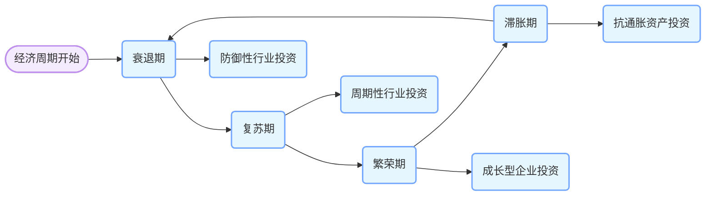

# 价值投资在不同经济周期中的策略调整

> 关键词：价值投资、经济周期、策略调整、投资组合、宏观经济指标

> 摘要：本文旨在深入探讨价值投资在不同经济周期中的策略调整。通过对经济周期各阶段特征的分析，阐述价值投资的核心概念及原理，详细讲解在不同经济环境下价值投资策略的具体调整方法。结合数学模型和实际案例，为投资者提供具有可操作性的投资建议。同时，介绍相关的工具、资源和研究成果，帮助投资者更好地理解和应用价值投资策略，应对不同经济周期带来的挑战和机遇。

## 1. 背景介绍 
### 1.1 目的和范围
价值投资作为一种长期投资理念，强调通过分析公司的内在价值来选择投资标的。然而，经济环境并非一成不变，不同的经济周期会对企业的经营和市场表现产生显著影响。因此，研究价值投资在不同经济周期中的策略调整具有重要的现实意义。本文将涵盖经济周期的各个阶段，包括衰退期、复苏期、繁荣期和滞胀期，分析在每个阶段价值投资应采取的策略，为投资者提供全面的投资指导。

### 1.2 预期读者
本文主要面向对价值投资感兴趣的投资者，包括个人投资者、机构投资者以及金融从业者。无论是初学者还是有一定投资经验的人士，都可以从本文中获取关于价值投资在不同经济周期中策略调整的相关知识和建议。

### 1.3 文档结构概述
本文将首先介绍经济周期和价值投资的核心概念及其联系，然后详细阐述价值投资在不同经济周期中的核心算法原理和具体操作步骤。接着，通过数学模型和公式对投资策略进行量化分析，并结合实际案例进行说明。之后，探讨价值投资在不同经济周期中的实际应用场景，推荐相关的学习资源、开发工具和研究成果。最后，总结价值投资在不同经济周期中的发展趋势与挑战，并提供常见问题的解答和扩展阅读的参考资料。

### 1.4 术语表
#### 1.4.1 核心术语定义
- **价值投资**：一种基于对公司内在价值的评估，以低于或合理的价格买入股票，并长期持有的投资策略。
- **经济周期**：经济活动沿着经济发展的总体趋势所经历的有规律的扩张和收缩，一般分为衰退、复苏、繁荣和滞胀四个阶段。
- **内在价值**：公司未来现金流的现值，是评估公司真实价值的重要指标。
- **投资组合**：投资者将资金分散投资于不同的资产或证券，以降低风险和实现预期收益的组合。

#### 1.4.2 相关概念解释
- **宏观经济指标**：反映宏观经济运行状况的统计数据，如国内生产总值（GDP）、通货膨胀率、利率等，对经济周期的判断和投资决策具有重要参考价值。
- **行业轮动**：在不同的经济周期中，不同行业的表现会有所差异，投资者可以根据经济周期的变化调整投资组合，选择表现较好的行业。

#### 1.4.3 缩略词列表
- **GDP**：国内生产总值（Gross Domestic Product）
- **CPI**：消费者物价指数（Consumer Price Index）
- **P/E**：市盈率（Price-to-Earnings Ratio）
- **P/B**：市净率（Price-to-Book Ratio）

## 2. 核心概念与联系 
### 2.1 经济周期的阶段划分
经济周期通常可以分为四个阶段：衰退期、复苏期、繁荣期和滞胀期。每个阶段都有其独特的经济特征和市场表现。
- **衰退期**：经济增长放缓，GDP 增长率下降，企业盈利减少，失业率上升，市场信心低落。股票市场通常表现不佳，债券市场可能相对稳定。
- **复苏期**：经济开始从衰退中走出，GDP 增长率逐渐回升，企业盈利开始改善，失业率下降，市场信心逐渐恢复。股票市场开始反弹，一些周期性行业可能表现较好。
- **繁荣期**：经济增长强劲，GDP 增长率较高，企业盈利大幅增加，失业率较低，市场信心高涨。股票市场表现优异，多数行业都有较好的表现。
- **滞胀期**：经济增长停滞，同时伴随着高通货膨胀率。企业盈利受到成本上升的压力，市场表现不稳定，股票和债券市场都可能面临挑战。

### 2.2 价值投资的核心原理
价值投资的核心原理是寻找被市场低估的股票，即股票的市场价格低于其内在价值。投资者通过对公司的财务报表、行业前景、竞争优势等因素进行分析，评估公司的内在价值，并在价格合适时买入股票，长期持有等待价值回归。

### 2.3 经济周期与价值投资的联系
经济周期的不同阶段会对企业的经营和市场表现产生显著影响，从而影响价值投资的策略。在衰退期，投资者更倾向于选择具有稳定现金流和防御性的行业，如公用事业、消费必需品等；在复苏期，周期性行业如工业、原材料等可能具有较大的投资机会；在繁荣期，投资者可以关注一些成长型企业；而在滞胀期，投资者需要更加谨慎，选择能够抵御通货膨胀的资产。

### 2.4 文本示意图
```plaintext
经济周期
|-- 衰退期
|   |-- 经济增长放缓
|   |-- 企业盈利减少
|   |-- 市场信心低落
|   |-- 价值投资策略：防御性行业
|-- 复苏期
|   |-- 经济开始回升
|   |-- 企业盈利改善
|   |-- 市场信心恢复
|   |-- 价值投资策略：周期性行业
|-- 繁荣期
|   |-- 经济增长强劲
|   |-- 企业盈利大幅增加
|   |-- 市场信心高涨
|   |-- 价值投资策略：成长型企业
|-- 滞胀期
|   |-- 经济增长停滞
|   |-- 高通货膨胀率
|   |-- 市场表现不稳定
|   |-- 价值投资策略：抗通胀资产
```

### 2.5 Mermaid 流程图


## 3. 核心算法原理 & 具体操作步骤 
### 3.1 价值评估算法原理
价值投资的核心是评估公司的内在价值。常用的评估方法包括现金流折现法（DCF）、市盈率法（P/E）和市净率法（P/B）。

#### 3.1.1 现金流折现法（DCF）
现金流折现法是通过预测公司未来的现金流，并将其折现到当前时点来计算公司的内在价值。其基本公式为：
$$V = \sum_{t=1}^{n} \frac{CF_t}{(1 + r)^t}$$
其中，$V$ 表示公司的内在价值，$CF_t$ 表示第 $t$ 期的现金流，$r$ 表示折现率，$n$ 表示预测期数。

#### 3.1.2 市盈率法（P/E）
市盈率法是通过比较公司的市盈率与行业平均市盈率或历史市盈率来评估公司的价值。其计算公式为：
$$P = EPS \times P/E$$
其中，$P$ 表示股票价格，$EPS$ 表示每股收益，$P/E$ 表示市盈率。

#### 3.1.3 市净率法（P/B）
市净率法是通过比较公司的市净率与行业平均市净率或历史市净率来评估公司的价值。其计算公式为：
$$P = BV \times P/B$$
其中，$P$ 表示股票价格，$BV$ 表示每股净资产，$P/B$ 表示市净率。

### 3.2 具体操作步骤
#### 3.2.1 分析经济周期阶段
投资者首先需要通过分析宏观经济指标，如 GDP 增长率、通货膨胀率、利率等，判断当前经济处于哪个周期阶段。

#### 3.2.2 筛选行业和公司
根据经济周期的阶段，筛选出具有投资价值的行业和公司。在衰退期，选择防御性行业；在复苏期，选择周期性行业；在繁荣期，选择成长型企业；在滞胀期，选择抗通胀资产。

#### 3.2.3 评估公司内在价值
使用上述价值评估方法，对筛选出的公司进行内在价值评估。

#### 3.2.4 构建投资组合
根据评估结果，选择价格低于内在价值的股票，构建投资组合。同时，要注意分散投资，降低风险。

#### 3.2.5 定期监控和调整
定期监控投资组合的表现和经济周期的变化，根据情况及时调整投资组合。

### 3.3 Python 代码实现
```python
import numpy as np

# 现金流折现法
def dcf(cash_flows, discount_rate):
    n = len(cash_flows)
    present_values = []
    for t in range(n):
        present_value = cash_flows[t] / ((1 + discount_rate) ** (t + 1))
        present_values.append(present_value)
    return sum(present_values)

# 示例现金流和折现率
cash_flows = [100, 120, 150, 180, 200]
discount_rate = 0.1

# 计算内在价值
intrinsic_value = dcf(cash_flows, discount_rate)
print(f"现金流折现法计算的内在价值: {intrinsic_value}")

# 市盈率法
def pe_valuation(eps, pe_ratio):
    return eps * pe_ratio

# 示例每股收益和市盈率
eps = 5
pe_ratio = 15

# 计算股票价格
stock_price = pe_valuation(eps, pe_ratio)
print(f"市盈率法计算的股票价格: {stock_price}")

# 市净率法
def pb_valuation(bv, pb_ratio):
    return bv * pb_ratio

# 示例每股净资产和市净率
bv = 20
pb_ratio = 1.5

# 计算股票价格
stock_price = pb_valuation(bv, pb_ratio)
print(f"市净率法计算的股票价格: {stock_price}")
```

## 4. 数学模型和公式 & 详细讲解 & 举例说明 
### 4.1 现金流折现法（DCF）
#### 4.1.1 详细讲解
现金流折现法的核心思想是将公司未来的现金流折现到当前时点，以反映其真实价值。折现率 $r$ 反映了投资者对资金时间价值和风险的要求。预测期数 $n$ 通常根据公司的发展阶段和行业特点来确定。

#### 4.1.2 举例说明
假设一家公司未来 5 年的现金流分别为 100 万元、120 万元、150 万元、180 万元和 200 万元，折现率为 10%。则该公司的内在价值为：
$$V = \frac{100}{(1 + 0.1)^1} + \frac{120}{(1 + 0.1)^2} + \frac{150}{(1 + 0.1)^3} + \frac{180}{(1 + 0.1)^4} + \frac{200}{(1 + 0.1)^5}$$
$$V \approx 90.91 + 99.17 + 112.70 + 122.94 + 124.18 = 549.90$$（万元）

### 4.2 市盈率法（P/E）
#### 4.2.1 详细讲解
市盈率法是一种相对简单的估值方法，通过比较公司的市盈率与行业平均市盈率或历史市盈率来判断公司的估值是否合理。如果公司的市盈率低于行业平均市盈率，可能意味着公司被低估。

#### 4.2.2 举例说明
假设一家公司的每股收益为 5 元，行业平均市盈率为 15 倍。则该公司的股票价格理论上应为：
$$P = 5 \times 15 = 75$$（元）

### 4.3 市净率法（P/B）
#### 4.3.1 详细讲解
市净率法是通过比较公司的市净率与行业平均市净率或历史市净率来评估公司的价值。市净率反映了市场对公司净资产的估值水平。如果公司的市净率低于行业平均市净率，可能意味着公司被低估。

#### 4.3.2 举例说明
假设一家公司的每股净资产为 20 元，行业平均市净率为 1.5 倍。则该公司的股票价格理论上应为：
$$P = 20 \times 1.5 = 30$$（元）

## 5. 项目实战：代码实际案例和详细解释说明 
### 5.1 开发环境搭建
- **操作系统**：Windows、Mac OS 或 Linux
- **编程语言**：Python 3.x
- **开发工具**：Jupyter Notebook 或 PyCharm
- **必要的库**：numpy、pandas、matplotlib

### 5.2 源代码详细实现和代码解读
```python
import numpy as np
import pandas as pd
import matplotlib.pyplot as plt

# 模拟不同经济周期阶段的股票数据
np.random.seed(42)
n = 100  # 数据点数

# 衰退期
recession_returns = np.random.normal(-0.01, 0.02, n)
recession_prices = np.cumprod(1 + recession_returns)

# 复苏期
recovery_returns = np.random.normal(0.01, 0.02, n)
recovery_prices = np.cumprod(1 + recovery_returns)

# 繁荣期
boom_returns = np.random.normal(0.02, 0.03, n)
boom_prices = np.cumprod(1 + boom_returns)

# 滞胀期
stagflation_returns = np.random.normal(0, 0.03, n)
stagflation_prices = np.cumprod(1 + stagflation_returns)

# 创建 DataFrame
data = {
    'Recession': recession_prices,
    'Recovery': recovery_prices,
    'Boom': boom_prices,
    'Stagflation': stagflation_prices
}
df = pd.DataFrame(data)

# 绘制股票价格走势图
plt.figure(figsize=(12, 6))
for column in df.columns:
    plt.plot(df[column], label=column)
plt.title('Stock Prices in Different Economic Cycles')
plt.xlabel('Time')
plt.ylabel('Price')
plt.legend()
plt.grid(True)
plt.show()

# 价值投资策略模拟
# 假设在每个周期开始时买入股票，持有到周期结束
initial_investment = 10000
recession_final_value = initial_investment * recession_prices[-1]
recovery_final_value = initial_investment * recovery_prices[-1]
boom_final_value = initial_investment * boom_prices[-1]
stagflation_final_value = initial_investment * stagflation_prices[-1]

# 输出投资结果
print(f"衰退期投资最终价值: {recession_final_value:.2f} 元")
print(f"复苏期投资最终价值: {recovery_final_value:.2f} 元")
print(f"繁荣期投资最终价值: {boom_final_value:.2f} 元")
print(f"滞胀期投资最终价值: {stagflation_final_value:.2f} 元")
```

### 5.3 代码解读与分析
- **数据模拟**：使用 `numpy` 库模拟不同经济周期阶段的股票收益率，并计算累积价格。
- **数据可视化**：使用 `matplotlib` 库绘制不同经济周期阶段的股票价格走势图，直观展示股票价格的变化。
- **价值投资策略模拟**：假设在每个周期开始时投入 10000 元，持有到周期结束，计算最终投资价值。
- **结果分析**：从模拟结果可以看出，在不同经济周期阶段，投资的收益情况不同。繁荣期的投资收益最高，衰退期的投资收益可能为负。因此，投资者需要根据经济周期的变化调整投资策略。

## 6. 实际应用场景 
### 6.1 个人投资者
个人投资者可以根据经济周期的变化调整自己的投资组合。在衰退期，增加防御性行业的投资比重，如消费必需品、公用事业等；在复苏期，适当增加周期性行业的投资，如工业、原材料等；在繁荣期，关注成长型企业的投资机会；在滞胀期，选择抗通胀资产，如黄金、房地产等。

### 6.2 机构投资者
机构投资者如基金公司、保险公司等，需要根据经济周期的变化调整资产配置。在不同经济周期阶段，选择不同的投资策略和资产类别，以实现资产的保值增值。例如，在衰退期，增加债券和现金的配置比例；在复苏期和繁荣期，增加股票的配置比例。

### 6.3 企业投资决策
企业在进行投资决策时，也需要考虑经济周期的影响。在衰退期，企业可以选择保守的投资策略，如减少新项目的投资、加强成本控制等；在复苏期和繁荣期，企业可以加大投资力度，扩大生产规模、进行并购重组等。

## 7. 工具和资源推荐
### 7.1 学习资源推荐
#### 7.1.1 书籍推荐
- 《聪明的投资者》（The Intelligent Investor）：本杰明·格雷厄姆（Benjamin Graham）著，价值投资的经典之作。
- 《证券分析》（Security Analysis）：本杰明·格雷厄姆和大卫·多德（David Dodd）著，系统阐述了价值投资的理论和方法。
- 《怎样选择成长股》（Common Stocks and Uncommon Profits）：菲利普·费雪（Philip Fisher）著，介绍了寻找成长型企业的方法和技巧。

#### 7.1.2 在线课程
- Coursera 上的“投资学原理”（Principles of Investment）课程，由知名教授授课，涵盖了价值投资的基本原理和方法。
- edX 上的“金融市场”（Financial Markets）课程，对金融市场和投资策略进行了全面的介绍。

#### 7.1.3 技术博客和网站
- 雪球网（xueqiu.com）：国内知名的投资社区，提供了丰富的投资资讯和分析文章。
- 价值线（Value Line）：提供专业的股票分析和投资建议，是价值投资者的重要参考网站。

### 7.2 开发工具框架推荐
#### 7.2.1 IDE和编辑器
- Jupyter Notebook：一个交互式的开发环境，适合进行数据分析和可视化。
- PyCharm：一款功能强大的 Python 集成开发环境，提供了丰富的代码编辑和调试功能。

#### 7.2.2 调试和性能分析工具
- IPython：一个增强的 Python 解释器，提供了丰富的调试和交互式功能。
- cProfile：Python 内置的性能分析工具，可以帮助开发者找出代码中的性能瓶颈。

#### 7.2.3 相关框架和库
- pandas：一个强大的数据处理和分析库，提供了丰富的数据结构和数据分析工具。
- numpy：一个用于科学计算的 Python 库，提供了高效的数组操作和数学函数。
- matplotlib：一个用于数据可视化的 Python 库，提供了丰富的绘图功能。

### 7.3 相关论文著作推荐
#### 7.3.1 经典论文
- Eugene F. Fama 和 Kenneth R. French 的“Common Risk Factors in the Returns on Stocks and Bonds”，提出了三因子模型，对资产定价理论产生了深远影响。
- Burton G. Malkiel 的“A Random Walk Down Wall Street”，阐述了有效市场假说和随机漫步理论。

#### 7.3.2 最新研究成果
- 关注顶级金融学术期刊，如《Journal of Finance》、《Review of Financial Studies》等，了解价值投资领域的最新研究动态。

#### 7.3.3 应用案例分析
- 一些金融研究机构和咨询公司会发布关于价值投资的应用案例分析报告，可以从中学习实际投资中的经验和教训。

## 8. 总结：未来发展趋势与挑战
### 8.1 未来发展趋势
- **数字化和智能化**：随着科技的不断发展，价值投资将越来越依赖于数字化和智能化工具。投资者可以利用大数据、人工智能等技术进行更精准的公司估值和投资决策。
- **全球资产配置**：经济全球化的趋势使得投资者可以更方便地进行全球资产配置。在不同经济周期中，投资者可以选择不同国家和地区的资产，以降低风险和提高收益。
- **可持续投资**：越来越多的投资者开始关注企业的社会责任和可持续发展。未来，价值投资将更加注重企业的环境、社会和治理（ESG）因素。

### 8.2 挑战
- **经济不确定性**：经济周期的变化受到多种因素的影响，如政策调整、地缘政治冲突等，使得经济不确定性增加。投资者需要更加敏锐地捕捉经济信号，及时调整投资策略。
- **市场有效性提高**：随着市场信息的传播速度加快和投资者素质的提高，市场有效性逐渐提高。寻找被低估的股票变得更加困难，投资者需要具备更高的分析能力和投资技巧。
- **技术风险**：数字化和智能化工具的应用也带来了技术风险，如数据安全、算法漏洞等。投资者需要加强对技术风险的管理和控制。

## 9. 附录：常见问题与解答
### 9.1 如何准确判断经济周期的阶段？
判断经济周期的阶段需要综合分析多个宏观经济指标，如 GDP 增长率、通货膨胀率、利率、失业率等。同时，还可以关注行业数据、企业盈利情况等微观指标。此外，一些专业的经济研究机构和咨询公司会发布经济周期的分析报告，可以作为参考。

### 9.2 价值投资是否适合所有投资者？
价值投资是一种长期投资策略，需要投资者具备一定的耐心和分析能力。对于短期投资者或风险偏好较高的投资者来说，价值投资可能不是最适合的选择。但对于长期投资者来说，价值投资可以帮助他们实现资产的保值增值。

### 9.3 如何选择合适的投资组合？
选择合适的投资组合需要考虑投资者的风险承受能力、投资目标、投资期限等因素。在不同经济周期阶段，投资组合的配置也会有所不同。一般来说，投资者可以通过分散投资来降低风险，同时根据经济周期的变化调整投资组合的比重。

### 9.4 价值投资和成长投资有什么区别？
价值投资注重公司的内在价值，寻找被市场低估的股票；而成长投资注重公司的成长潜力，寻找具有高增长预期的股票。价值投资更强调安全边际，而成长投资更注重未来的增长空间。

## 10. 扩展阅读 & 参考资料
### 10.1 扩展阅读
- 《财务自由之路》（Rich Dad Poor Dad）：罗伯特·清崎（Robert Kiyosaki）著，介绍了财务自由的理念和方法。
- 《金融炼金术》（The Alchemy of Finance）：乔治·索罗斯（George Soros）著，阐述了他的投资哲学和金融市场理论。

### 10.2 参考资料
- 国家统计局网站（stats.gov.cn）：提供了丰富的宏观经济数据和统计信息。
- 世界银行网站（worldbank.org）：提供了全球经济数据和研究报告。
- 国际货币基金组织网站（imf.org）：提供了全球经济形势分析和政策建议。