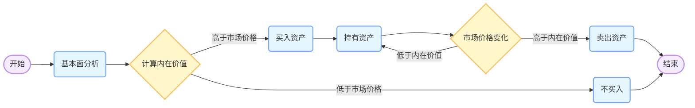

# 价值投资在不同资产类别中的应用

> 关键词：价值投资、资产类别、股票、债券、房地产、大宗商品、应用策略

> 摘要：本文旨在深入探讨价值投资在不同资产类别中的应用。通过对价值投资的核心概念、算法原理、数学模型等多方面的详细阐述，结合项目实战案例和实际应用场景的分析，为投资者提供全面且深入的价值投资知识体系。同时，推荐了相关的学习资源、开发工具框架以及论文著作，最后总结了价值投资的未来发展趋势与挑战，并解答了常见问题，给出扩展阅读和参考资料，帮助投资者更好地在不同资产类别中运用价值投资策略。

## 1. 背景介绍 
### 1.1 目的和范围
价值投资作为一种重要的投资理念，已经在金融市场中被广泛应用。然而，不同的资产类别具有各自独特的特点和市场环境，如何将价值投资的理念和方法有效地应用到各类资产中，是投资者面临的重要问题。本文的目的在于系统地分析价值投资在股票、债券、房地产、大宗商品等主要资产类别中的应用策略，为投资者提供全面的参考。范围涵盖了价值投资的基本概念、核心算法、数学模型、实际案例以及未来发展趋势等多个方面。

### 1.2 预期读者
本文预期读者包括对投资领域有一定兴趣的初学者、专业投资者、金融分析师、投资顾问以及相关专业的学生等。无论您是希望了解价值投资基础知识，还是寻求在不同资产类别中优化投资策略的专业人士，都能从本文中获得有价值的信息。

### 1.3 文档结构概述
本文将按照以下结构展开：首先介绍价值投资的背景和相关术语，为读者建立基本的知识框架；接着阐述价值投资的核心概念与联系，通过文本示意图和 Mermaid 流程图进行直观展示；然后详细讲解核心算法原理和具体操作步骤，并结合 Python 源代码进行说明；随后介绍数学模型和公式，并通过举例进行详细讲解；再通过项目实战案例，包括开发环境搭建、源代码实现和解读，深入分析价值投资在实际中的应用；之后探讨价值投资在不同资产类别中的实际应用场景；推荐相关的学习资源、开发工具框架和论文著作；最后总结价值投资的未来发展趋势与挑战，解答常见问题，并给出扩展阅读和参考资料。

### 1.4 术语表
#### 1.4.1 核心术语定义
- **价值投资**：一种基于对资产内在价值的评估，以低于内在价值的价格买入资产，并在价格回归或超过内在价值时卖出的投资策略。
- **内在价值**：资产所具有的真实价值，通常通过对资产的基本面因素进行分析和评估得出。
- **资产类别**：根据资产的性质、特征和风险收益特点等进行分类的结果，常见的资产类别包括股票、债券、房地产、大宗商品等。

#### 1.4.2 相关概念解释
- **基本面分析**：通过研究资产的财务状况、经营业绩、行业前景等基本因素，来评估资产的内在价值和投资价值的方法。
- **市场效率**：市场价格反映资产内在价值的程度。在有效市场中，市场价格能够迅速、准确地反映所有可用信息；而在无效市场中，市场价格可能会偏离资产的内在价值。

#### 1.4.3 缩略词列表
- **PE**：市盈率（Price - Earnings Ratio），是股票价格与每股收益的比率，用于衡量股票的估值水平。
- **PB**：市净率（Price - Book Ratio），是股票价格与每股净资产的比率，反映了股票价格相对于净资产的倍数。
- **YTM**：到期收益率（Yield to Maturity），是使债券未来现金流的现值等于债券当前市场价格的贴现率。

## 2. 核心概念与联系 
价值投资的核心在于寻找被市场低估的资产，并在合适的时机买入和卖出。其基本原理是基于资产的内在价值与市场价格之间的差异。当市场价格低于内在价值时，资产被低估，具有投资价值；当市场价格高于内在价值时，资产被高估，应考虑卖出。

### 文本示意图
价值投资的核心概念可以用以下示意图表示：

投资者通过对资产的基本面分析，确定资产的内在价值。同时，观察市场价格的波动。当市场价格低于内在价值时，投资者买入资产；随着时间的推移，市场价格逐渐向内在价值回归，投资者获得收益；当市场价格高于内在价值时，投资者卖出资产，实现盈利。

### Mermaid 流程图


这个流程图展示了价值投资的基本决策过程。投资者首先进行基本面分析，计算资产的内在价值。然后比较内在价值和市场价格，如果内在价值高于市场价格，则买入资产并持有；在持有过程中，持续关注市场价格的变化，当市场价格高于内在价值时，卖出资产；如果内在价值低于市场价格，则不进行买入操作。

## 3. 核心算法原理 & 具体操作步骤 
### 核心算法原理
价值投资的核心算法主要围绕资产内在价值的计算。不同的资产类别有不同的计算方法，以下以股票为例进行说明。

股票的内在价值可以通过股息贴现模型（Dividend Discount Model, DDM）来计算。股息贴现模型的基本思想是，股票的内在价值等于其未来所有股息的现值之和。

### 具体操作步骤
1. **确定股息增长率**：通过分析公司的历史股息数据和未来发展前景，估计股息的增长率。
2. **确定贴现率**：贴现率反映了投资者对股票投资的预期收益率，通常可以参考市场利率和股票的风险水平来确定。
3. **计算未来股息**：根据股息增长率和当前股息，计算未来各期的股息。
4. **计算股息现值**：将未来各期的股息按照贴现率进行贴现，得到股息的现值。
5. **计算股票内在价值**：将所有股息的现值相加，得到股票的内在价值。

### Python 源代码实现
```python
def ddm_intrinsic_value(current_dividend, growth_rate, discount_rate):
    """
    计算股票的内在价值（股息贴现模型）
    :param current_dividend: 当前股息
    :param growth_rate: 股息增长率
    :param discount_rate: 贴现率
    :return: 股票的内在价值
    """
    if discount_rate <= growth_rate:
        raise ValueError("贴现率必须大于股息增长率")
    intrinsic_value = current_dividend * (1 + growth_rate) / (discount_rate - growth_rate)
    return intrinsic_value

# 示例数据
current_dividend = 2.0
growth_rate = 0.05
discount_rate = 0.1

# 计算内在价值
intrinsic_value = ddm_intrinsic_value(current_dividend, growth_rate, discount_rate)
print(f"股票的内在价值为: {intrinsic_value}")
```

在这个代码中，我们定义了一个 `ddm_intrinsic_value` 函数，用于计算股票的内在价值。函数接受当前股息、股息增长率和贴现率作为输入参数，返回股票的内在价值。在示例中，我们使用了具体的参数值进行计算，并打印出结果。

## 4. 数学模型和公式 & 详细讲解 & 举例说明 
### 股息贴现模型（DDM）
股息贴现模型的基本公式为：

$$V = \frac{D_1}{r - g}$$

其中：
- $V$ 表示股票的内在价值
- $D_1$ 表示下一期的股息，$D_1 = D_0(1 + g)$，$D_0$ 为当前股息，$g$ 为股息增长率
- $r$ 表示贴现率
- $g$ 表示股息增长率

### 详细讲解
股息贴现模型的基本假设是，股票的价值来源于其未来的股息收入。投资者购买股票的目的是为了获得未来的股息，因此股票的内在价值应该等于其未来所有股息的现值之和。在股息贴现模型中，我们假设股息以固定的增长率 $g$ 增长，并且贴现率 $r$ 保持不变。通过将未来各期的股息按照贴现率进行贴现，我们可以得到股票的内在价值。

### 举例说明
假设某股票当前股息 $D_0 = 2$ 元，股息增长率 $g = 5\%$，贴现率 $r = 10\%$。

首先，计算下一期的股息 $D_1$：

$$D_1 = D_0(1 + g) = 2\times(1 + 0.05) = 2.1$$（元）

然后，根据股息贴现模型计算股票的内在价值 $V$：

$$V = \frac{D_1}{r - g} = \frac{2.1}{0.1 - 0.05} = 42$$（元）

这意味着，根据股息贴现模型，该股票的内在价值为 42 元。如果当前市场价格低于 42 元，那么该股票可能被低估，具有投资价值；如果市场价格高于 42 元，那么该股票可能被高估，应谨慎投资。

## 5. 项目实战：代码实际案例和详细解释说明 
### 5.1  开发环境搭建
在进行价值投资的项目实战时，我们需要搭建相应的开发环境。以下是具体的步骤：

1. **安装 Python**：Python 是一种广泛使用的编程语言，具有丰富的数据分析和金融计算库。可以从 Python 官方网站（https://www.python.org/downloads/）下载并安装适合自己操作系统的 Python 版本。
2. **安装必要的库**：在 Python 中，我们需要安装一些必要的库来进行数据处理、分析和可视化。常用的库包括 `pandas`、`numpy`、`matplotlib` 等。可以使用 `pip` 命令来安装这些库：

```sh
pip install pandas numpy matplotlib
```

### 5.2  源代码详细实现和代码解读
以下是一个使用 Python 进行股票价值投资分析的实际案例。我们将使用 `pandas` 库来读取股票数据，使用股息贴现模型计算股票的内在价值，并与市场价格进行比较。

```python
import pandas as pd

def ddm_intrinsic_value(current_dividend, growth_rate, discount_rate):
    """
    计算股票的内在价值（股息贴现模型）
    :param current_dividend: 当前股息
    :param growth_rate: 股息增长率
    :param discount_rate: 贴现率
    :return: 股票的内在价值
    """
    if discount_rate <= growth_rate:
        raise ValueError("贴现率必须大于股息增长率")
    intrinsic_value = current_dividend * (1 + growth_rate) / (discount_rate - growth_rate)
    return intrinsic_value

# 读取股票数据
data = pd.read_csv('stock_data.csv')

# 假设数据中包含当前股息、股息增长率和贴现率
current_dividends = data['current_dividend']
growth_rates = data['growth_rate']
discount_rates = data['discount_rate']
market_prices = data['market_price']

# 计算内在价值
intrinsic_values = []
for i in range(len(data)):
    intrinsic_value = ddm_intrinsic_value(current_dividends[i], growth_rates[i], discount_rates[i])
    intrinsic_values.append(intrinsic_value)

# 比较内在价值和市场价格
investment_decisions = []
for i in range(len(data)):
    if intrinsic_values[i] > market_prices[i]:
        investment_decisions.append('买入')
    else:
        investment_decisions.append('不买入')

# 将结果添加到数据框中
data['intrinsic_value'] = intrinsic_values
data['investment_decision'] = investment_decisions

# 保存结果
data.to_csv('investment_results.csv', index=False)
```

### 5.3  代码解读与分析
1. **导入必要的库**：我们导入了 `pandas` 库，用于数据处理和分析。
2. **定义股息贴现模型函数**：`ddm_intrinsic_value` 函数用于计算股票的内在价值，其实现与前面的示例相同。
3. **读取股票数据**：使用 `pandas` 的 `read_csv` 函数读取存储股票数据的 CSV 文件。假设数据文件中包含当前股息、股息增长率、贴现率和市场价格等信息。
4. **计算内在价值**：遍历数据中的每一行，使用 `ddm_intrinsic_value` 函数计算股票的内在价值，并将结果存储在 `intrinsic_values` 列表中。
5. **比较内在价值和市场价格**：遍历 `intrinsic_values` 和 `market_prices` 列表，比较内在价值和市场价格的大小，根据比较结果做出投资决策（买入或不买入），并将决策结果存储在 `investment_decisions` 列表中。
6. **保存结果**：将计算得到的内在价值和投资决策结果添加到数据框中，并使用 `to_csv` 函数将结果保存为 CSV 文件。

通过这个实际案例，我们可以看到如何使用 Python 进行股票价值投资分析，并根据分析结果做出投资决策。

## 6. 实际应用场景 
### 股票市场
在股票市场中，价值投资可以帮助投资者寻找被低估的股票。通过对公司的基本面分析，如财务报表、行业前景、竞争优势等，计算股票的内在价值，并与市场价格进行比较。当市场价格低于内在价值时，投资者可以考虑买入股票；当市场价格高于内在价值时，投资者可以考虑卖出股票。例如，一些具有稳定业绩和高股息率的蓝筹股，可能在市场低迷时被低估，此时价值投资者可以抓住机会买入。

### 债券市场
在债券市场中，价值投资的应用主要体现在对债券的定价和风险评估上。投资者可以通过计算债券的到期收益率（YTM）来评估债券的价值。当债券的到期收益率高于市场利率时，债券的价格可能被低估，具有投资价值；反之，当债券的到期收益率低于市场利率时，债券的价格可能被高估。此外，投资者还需要考虑债券的信用风险、利率风险等因素。

### 房地产市场
在房地产市场中，价值投资的核心是评估房地产的内在价值。投资者可以通过分析房地产的地理位置、周边配套设施、租金收益、市场供需情况等因素，来确定房地产的内在价值。当房地产的市场价格低于内在价值时，投资者可以考虑买入；当市场价格高于内在价值时，投资者可以考虑卖出或持有。例如，一些位于新兴发展区域的房地产，可能由于市场对其未来发展潜力的认识不足而被低估，价值投资者可以关注这些机会。

### 大宗商品市场
在大宗商品市场中，价值投资可以通过分析大宗商品的供求关系、生产成本、库存水平等因素，来评估大宗商品的内在价值。当大宗商品的市场价格低于内在价值时，投资者可以考虑买入；当市场价格高于内在价值时，投资者可以考虑卖出。例如，在原油市场中，当全球经济增长放缓导致原油需求下降，而原油产量仍然较高时，原油价格可能会下跌。如果投资者认为原油的生产成本和长期需求前景仍然较好，那么此时原油价格可能被低估，具有投资价值。

## 7. 工具和资源推荐
### 7.1 学习资源推荐
#### 7.1.1 书籍推荐
- 《聪明的投资者》（The Intelligent Investor）：本杰明·格雷厄姆（Benjamin Graham）著，被誉为价值投资的圣经，书中详细阐述了价值投资的基本理念和方法。
- 《证券分析》（Security Analysis）：本杰明·格雷厄姆和戴维·多德（David Dodd）著，是价值投资领域的经典著作，对股票、债券等证券的分析和估值方法进行了深入探讨。
- 《巴菲特致股东的信》（Letters to Shareholders）：沃伦·巴菲特（Warren Buffett）著，通过巴菲特写给股东的信，展示了他的投资理念、策略和经验。

#### 7.1.2 在线课程
- Coursera 上的“投资学原理”（Principles of Investing）课程：由知名教授授课，涵盖了投资的基本概念、资产定价、投资组合管理等内容。
- edX 上的“金融市场”（Financial Markets）课程：耶鲁大学教授罗伯特·席勒（Robert Shiller）主讲，对金融市场的运行机制、投资策略等进行了全面讲解。

#### 7.1.3 技术博客和网站
- Seeking Alpha：提供股票、债券、大宗商品等各类资产的分析和评论，以及投资策略和研究报告。
- ValueInvestorsClub：一个专注于价值投资的社区，会员可以分享投资理念、研究成果和投资机会。

### 7.2 开发工具框架推荐
#### 7.2.1 IDE和编辑器
- PyCharm：一款功能强大的 Python 集成开发环境，提供代码编辑、调试、版本控制等功能，适合进行价值投资相关的数据分析和编程。
- Jupyter Notebook：一种交互式的开发环境，支持 Python、R 等多种编程语言，方便进行数据探索、分析和可视化。

#### 7.2.2 调试和性能分析工具
- PDB：Python 自带的调试器，可以帮助开发者定位代码中的错误和问题。
- cProfile：Python 标准库中的性能分析工具，可以分析代码的执行时间和性能瓶颈。

#### 7.2.3 相关框架和库
- Pandas：用于数据处理和分析的 Python 库，提供了高效的数据结构和数据操作方法。
- NumPy：用于科学计算的 Python 库，提供了多维数组和数学函数等功能。
- Matplotlib：用于数据可视化的 Python 库，可以绘制各种类型的图表和图形。

### 7.3 相关论文著作推荐
#### 7.3.1 经典论文
- Eugene F. Fama 和 Kenneth R. French 的“Common Risk Factors in the Returns on Stocks and Bonds”：提出了著名的 Fama - French 三因子模型，对股票和债券的收益率进行了深入分析。
- Burton G. Malkiel 的“A Random Walk Down Wall Street”：探讨了有效市场假说和随机漫步理论，对投资决策有重要的启示作用。

#### 7.3.2 最新研究成果
- 关注顶级金融学术期刊，如《Journal of Finance》、《Review of Financial Studies》等，这些期刊发表了许多关于价值投资和资产定价的最新研究成果。

#### 7.3.3 应用案例分析
- 一些专业的金融研究机构和咨询公司会发布价值投资的应用案例分析报告，如麦肯锡公司（McKinsey & Company）、波士顿咨询集团（Boston Consulting Group）等。

## 8. 总结：未来发展趋势与挑战
### 未来发展趋势
1. **数字化和智能化**：随着科技的不断发展，价值投资将越来越多地借助数字化和智能化工具。例如，利用大数据分析和人工智能算法来进行资产的基本面分析和估值，提高投资决策的效率和准确性。
2. **全球化**：全球金融市场的互联互通日益加强，价值投资者将有更多的机会在全球范围内寻找被低估的资产。同时，也需要考虑不同国家和地区的政治、经济、文化等因素对投资的影响。
3. **可持续投资**：越来越多的投资者开始关注企业的社会责任和可持续发展能力，将环境、社会和治理（ESG）因素纳入价值投资的考量范围。未来，可持续投资将成为价值投资的重要发展方向。

### 挑战
1. **市场不确定性**：金融市场充满了不确定性，宏观经济环境、政策变化、突发事件等因素都可能导致资产价格的剧烈波动，增加了价值投资的难度。
2. **信息不对称**：在市场中，不同投资者获取信息的能力和渠道存在差异，信息不对称可能导致投资者做出错误的投资决策。
3. **模型局限性**：价值投资所使用的各种模型和方法都有其局限性，不能完全准确地反映资产的内在价值和市场的实际情况。投资者需要不断地改进和完善投资模型，以适应市场的变化。

## 9. 附录：常见问题与解答
### 问题 1：价值投资适合所有投资者吗？
价值投资并不适合所有投资者。价值投资需要投资者具备一定的财务知识和分析能力，能够对资产的基本面进行深入研究。同时，价值投资通常需要较长的投资周期，投资者需要有足够的耐心和定力。对于那些追求短期高收益、风险承受能力较低的投资者来说，价值投资可能不是最适合的选择。

### 问题 2：如何确定资产的内在价值？
确定资产的内在价值是价值投资的核心问题。不同的资产类别有不同的估值方法，常见的方法包括股息贴现模型、现金流贴现模型、相对估值法等。在实际应用中，投资者需要综合考虑多种因素，如资产的财务状况、行业前景、竞争优势等，并结合市场情况进行判断。

### 问题 3：价值投资和成长投资有什么区别？
价值投资注重资产的内在价值，寻找被市场低估的资产；而成长投资则更关注资产的未来成长潜力，愿意为具有高成长预期的资产支付较高的价格。价值投资通常更注重资产的安全性和稳定性，而成长投资则更注重资产的增值潜力。

## 10. 扩展阅读 & 参考资料
### 扩展阅读
- 《漫步华尔街》（A Random Walk Down Wall Street）：作者伯顿·马尔基尔（Burton Malkiel），对有效市场假说和随机漫步理论进行了深入探讨，对价值投资有一定的参考价值。
- 《穷查理宝典》（Poor Charlie's Almanack）：作者彼得·考夫曼（Peter D. Kaufman），收录了查理·芒格（Charlie Munger）的演讲和文章，展示了他的投资智慧和人生哲学。

### 参考资料
- 相关金融学术期刊和研究报告，如《Journal of Financial Economics》、《Financial Analysts Journal》等。
- 各大金融机构和咨询公司发布的研究报告和市场分析，如摩根大通（JPMorgan Chase）、高盛（Goldman Sachs）等。