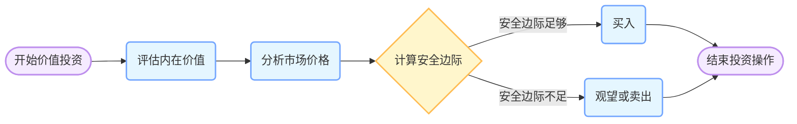

# 价值投资的核心原则：安全边际

> 关键词：价值投资、安全边际、投资原则、风险控制、内在价值

> 摘要：本文深入探讨了价值投资中安全边际这一核心原则。首先介绍了价值投资及安全边际的背景知识，包括目的、预期读者等内容。接着阐述了安全边际的核心概念与联系，通过示意图和流程图清晰展示其原理架构。详细讲解了与安全边际相关的核心算法原理和具体操作步骤，并结合数学模型和公式进行说明。通过项目实战案例，展示了安全边际在实际投资中的应用及代码实现和解读。同时分析了安全边际的实际应用场景，推荐了相关的学习工具和资源。最后总结了安全边际在价值投资领域的未来发展趋势与挑战，还设置了常见问题解答和扩展阅读参考资料，旨在帮助投资者全面理解和运用安全边际这一价值投资的核心原则，更好地控制投资风险，实现投资目标。

## 1. 背景介绍 
### 1.1 目的和范围
价值投资作为一种成熟且被广泛应用的投资策略，旨在通过深入分析资产的内在价值，寻找被市场低估的投资机会，从而获取长期稳定的收益。而安全边际作为价值投资的核心原则，其目的在于为投资者提供一种保护机制，降低投资风险，确保在市场波动和不确定性的环境下，投资仍能有较好的回报。

本文的范围将围绕安全边际展开，详细探讨其核心概念、算法原理、数学模型，通过实际案例展示其在投资中的应用，并分析其实际应用场景，同时提供相关的学习资源和工具推荐，以帮助读者全面理解和掌握这一重要的投资原则。

### 1.2 预期读者
本文预期读者主要包括对价值投资感兴趣的投资者，无论是个人投资者还是专业投资机构的从业者，都可以从本文中获取关于安全边际的深入知识和实用技巧。同时，金融专业的学生和研究人员也可以将本文作为参考资料，加深对价值投资理论和实践的理解。

### 1.3 文档结构概述
本文将按照以下结构进行阐述：首先介绍价值投资及安全边际的背景知识，包括目的、预期读者等内容。接着深入探讨安全边际的核心概念与联系，通过示意图和流程图清晰展示其原理架构。然后详细讲解与安全边际相关的核心算法原理和具体操作步骤，并结合数学模型和公式进行说明。通过项目实战案例，展示安全边际在实际投资中的应用及代码实现和解读。同时分析安全边际的实际应用场景，推荐相关的学习工具和资源。最后总结安全边际在价值投资领域的未来发展趋势与挑战，还设置了常见问题解答和扩展阅读参考资料。

### 1.4 术语表
#### 1.4.1 核心术语定义
- **价值投资**：一种基于对资产内在价值的分析，通过寻找被市场低估的资产进行投资，以获取长期收益的投资策略。
- **安全边际**：指投资者购买资产的价格与其内在价值之间的差距，安全边际越大，投资风险越低。
- **内在价值**：资产未来预期现金流的现值，是评估资产真实价值的重要指标。

#### 1.4.2 相关概念解释
- **市场价格**：资产在市场上的交易价格，由供求关系等多种因素决定。
- **估值模型**：用于估算资产内在价值的数学模型，常见的有现金流折现模型、市盈率模型等。

#### 1.4.3 缩略词列表
- **DCF**：现金流折现模型（Discounted Cash Flow Model）

## 2. 核心概念与联系 

### 核心概念原理
安全边际是价值投资的基石，其核心原理在于通过确保购买价格低于资产的内在价值，为投资者提供一定的缓冲空间。当市场出现不利变化时，由于存在安全边际，投资者的损失可以得到一定程度的限制。例如，一家公司的内在价值经评估为每股100元，而投资者以每股80元的价格买入，那么这20元的差价就是安全边际。

安全边际的存在使得投资者在面对市场波动、公司经营风险等不确定性因素时，有更大的概率实现投资目标。即使公司的实际表现不如预期，只要内在价值没有大幅下降，由于购买价格具有安全边际，投资者仍可能获得一定的收益。

### 架构的文本示意图
```plaintext
价值投资
|
|-- 安全边际
|   |-- 内在价值评估
|   |   |-- 财务分析
|   |   |-- 行业分析
|   |   |-- 宏观经济分析
|   |
|   |-- 市场价格分析
|   |   |-- 供求关系
|   |   |-- 市场情绪
|   |
|   |-- 安全边际计算
|       |-- 内在价值 - 市场价格
|
|-- 投资决策
|   |-- 安全边际足够
|   |   |-- 买入
|   |
|   |-- 安全边际不足
|       |-- 观望或卖出
```

### Mermaid 流程图


## 3. 核心算法原理 & 具体操作步骤 

### 核心算法原理
在价值投资中，计算安全边际的关键在于准确估算资产的内在价值和确定市场价格。其中，现金流折现模型（DCF）是一种常用的估算内在价值的方法。其基本原理是将资产未来预期产生的现金流按照一定的折现率折现到当前时刻，得到资产的内在价值。

### Python 源代码实现
```python
import numpy as np

def dcf_valuation(cash_flows, discount_rate):
    """
    使用现金流折现模型计算资产的内在价值

    :param cash_flows: 未来各期的现金流列表
    :param discount_rate: 折现率
    :return: 资产的内在价值
    """
    present_values = []
    for i, cash_flow in enumerate(cash_flows):
        present_value = cash_flow / (1 + discount_rate) ** (i + 1)
        present_values.append(present_value)
    return np.sum(present_values)

# 示例数据
cash_flows = [100, 120, 150, 180, 200]  # 未来5年的现金流
discount_rate = 0.1  # 折现率为10%

# 计算内在价值
intrinsic_value = dcf_valuation(cash_flows, discount_rate)
print(f"资产的内在价值为: {intrinsic_value}")

# 假设市场价格为400
market_price = 400

# 计算安全边际
safety_margin = intrinsic_value - market_price
print(f"安全边际为: {safety_margin}")
```

### 具体操作步骤
1. **收集数据**：收集资产未来预期产生的现金流数据，包括预计的营业收入、成本、利润等信息。同时，确定合适的折现率，折现率通常反映了投资者对该资产的风险预期和机会成本。
2. **估算内在价值**：使用现金流折现模型或其他估值方法，根据收集到的数据估算资产的内在价值。
3. **确定市场价格**：通过市场交易数据或其他渠道确定资产的当前市场价格。
4. **计算安全边际**：用估算的内在价值减去市场价格，得到安全边际。
5. **投资决策**：根据安全边际的大小进行投资决策。如果安全边际足够大，说明资产被低估，具有投资价值，可以考虑买入；如果安全边际较小或为负数，说明资产可能被高估，需要谨慎投资或选择观望。

## 4. 数学模型和公式 & 详细讲解 & 举例说明 

### 数学模型和公式
现金流折现模型（DCF）的数学公式为：
$$V = \sum_{t=1}^{n} \frac{CF_t}{(1 + r)^t}$$
其中：
- $V$ 表示资产的内在价值
- $CF_t$ 表示第 $t$ 期的现金流
- $r$ 表示折现率
- $n$ 表示现金流的期数

### 详细讲解
该公式的核心思想是将资产未来各期产生的现金流按照折现率进行折现，得到其在当前时刻的现值，然后将各期现值相加，得到资产的内在价值。折现率 $r$ 反映了资金的时间价值和投资风险，折现率越高，未来现金流的现值越低，资产的内在价值也就越低。

### 举例说明
假设某公司未来5年的预计现金流分别为100万元、120万元、150万元、180万元和200万元，投资者要求的折现率为10%。则该公司的内在价值计算如下：

第1年现金流的现值：$PV_1 = \frac{100}{(1 + 0.1)^1} \approx 90.91$（万元）

第2年现金流的现值：$PV_2 = \frac{120}{(1 + 0.1)^2} \approx 99.17$（万元）

第3年现金流的现值：$PV_3 = \frac{150}{(1 + 0.1)^3} \approx 112.70$（万元）

第4年现金流的现值：$PV_4 = \frac{180}{(1 + 0.1)^4} \approx 122.94$（万元）

第5年现金流的现值：$PV_5 = \frac{200}{(1 + 0.1)^5} \approx 124.18$（万元）

该公司的内在价值：$V = PV_1 + PV_2 + PV_3 + PV_4 + PV_5 \approx 90.91 + 99.17 + 112.70 + 122.94 + 124.18 = 549.90$（万元）

假设该公司的当前市场价格为400万元，则安全边际为：$549.90 - 400 = 149.90$（万元）

## 5. 项目实战：代码实际案例和详细解释说明 

### 5.1  开发环境搭建
在进行本项目实战时，我们需要搭建一个Python开发环境。以下是具体步骤：
1. **安装Python**：访问Python官方网站（https://www.python.org/downloads/），下载并安装适合你操作系统的Python版本。建议安装Python 3.6及以上版本。
2. **安装集成开发环境（IDE）**：可以选择PyCharm、VS Code等常用的IDE。以PyCharm为例，访问JetBrains官方网站（https://www.jetbrains.com/pycharm/download/），下载并安装社区版或专业版。
3. **创建虚拟环境（可选）**：为了避免不同项目之间的依赖冲突，建议使用虚拟环境。在命令行中执行以下命令创建并激活虚拟环境：
```bash
# 创建虚拟环境
python -m venv myenv

# 激活虚拟环境（Windows）
myenv\Scripts\activate

# 激活虚拟环境（Linux/Mac）
source myenv/bin/activate
```

### 5.2  源代码详细实现和代码解读
以下是一个完整的Python代码示例，用于计算股票的安全边际：
```python
import numpy as np

def dcf_valuation(cash_flows, discount_rate):
    """
    使用现金流折现模型计算资产的内在价值

    :param cash_flows: 未来各期的现金流列表
    :param discount_rate: 折现率
    :return: 资产的内在价值
    """
    present_values = []
    for i, cash_flow in enumerate(cash_flows):
        present_value = cash_flow / (1 + discount_rate) ** (i + 1)
        present_values.append(present_value)
    return np.sum(present_values)

def calculate_safety_margin(intrinsic_value, market_price):
    """
    计算安全边际

    :param intrinsic_value: 内在价值
    :param market_price: 市场价格
    :return: 安全边际
    """
    return intrinsic_value - market_price

# 示例数据
cash_flows = [100, 120, 150, 180, 200]  # 未来5年的现金流
discount_rate = 0.1  # 折现率为10%

# 计算内在价值
intrinsic_value = dcf_valuation(cash_flows, discount_rate)
print(f"资产的内在价值为: {intrinsic_value}")

# 假设市场价格为400
market_price = 400

# 计算安全边际
safety_margin = calculate_safety_margin(intrinsic_value, market_price)
print(f"安全边际为: {safety_margin}")

# 根据安全边际进行投资决策
if safety_margin > 0:
    print("安全边际为正，资产被低估，可以考虑买入。")
else:
    print("安全边际为负或零，资产可能被高估，需谨慎投资。")
```
### 代码解读
1. **`dcf_valuation` 函数**：该函数实现了现金流折现模型，用于计算资产的内在价值。通过遍历未来各期的现金流，将其按照折现率折现到当前时刻，并将各期现值相加得到内在价值。
2. **`calculate_safety_margin` 函数**：该函数用于计算安全边际，通过用内在价值减去市场价格得到安全边际的值。
3. **主程序部分**：首先定义了未来5年的现金流和折现率，调用 `dcf_valuation` 函数计算内在价值。然后假设了一个市场价格，调用 `calculate_safety_margin` 函数计算安全边际。最后根据安全边际的正负进行投资决策。

### 5.3  代码解读与分析
- **优点**：该代码实现了安全边际的计算和简单的投资决策，逻辑清晰，易于理解和修改。使用了现金流折现模型，是一种常用且有效的估值方法。
- **局限性**：该代码的局限性在于，现金流和折现率的确定是基于假设和估计，实际情况可能与假设存在较大偏差。此外，该代码只考虑了单一资产的安全边际计算，没有考虑投资组合的多样性和风险分散。

## 6. 实际应用场景 
### 股票投资
在股票投资中，安全边际是投资者评估股票投资价值的重要指标。投资者可以通过分析公司的财务报表、行业前景等因素，估算公司的内在价值，然后与当前股票市场价格进行比较，计算安全边际。如果安全边际足够大，说明股票被低估，具有投资价值；如果安全边际较小或为负数，说明股票可能被高估，需要谨慎投资。

### 债券投资
在债券投资中，安全边际同样重要。投资者可以通过分析债券的信用风险、利率风险等因素，估算债券的内在价值。例如，对于固定利率债券，投资者可以根据债券的票面利率、到期时间、市场利率等因素，计算债券的现值作为内在价值。然后与债券的市场价格进行比较，确定安全边际。如果安全边际较大，说明债券具有投资价值，可以考虑买入；如果安全边际较小，需要谨慎投资。

### 房地产投资
在房地产投资中，安全边际也起着关键作用。投资者可以通过分析房地产的地理位置、市场需求、租金收益等因素，估算房地产的内在价值。例如，通过计算房地产的租金净现值、未来增值潜力等，得到其内在价值。然后与房地产的市场价格进行比较，计算安全边际。如果安全边际足够大，说明房地产被低估，具有投资价值；如果安全边际较小，需要谨慎投资。

## 7. 工具和资源推荐
### 7.1 学习资源推荐
#### 7.1.1 书籍推荐
- 《聪明的投资者》（The Intelligent Investor）：作者本杰明·格雷厄姆（Benjamin Graham）是价值投资的创始人，这本书是价值投资领域的经典之作，详细阐述了价值投资的理念和方法，包括安全边际的重要性。
- 《证券分析》（Security Analysis）：同样是本杰明·格雷厄姆的著作，是价值投资的奠基之作，对证券估值、投资分析等方面进行了深入探讨，为理解安全边际提供了理论基础。
- 《巴菲特致股东的信：股份公司教程》（Letters to Shareholders of Berkshire Hathaway）：作者沃伦·巴菲特（Warren Buffett）是价值投资的成功实践者，这本书收录了巴菲特多年来致股东的信，从中可以学习到巴菲特的投资理念和实践经验，包括如何运用安全边际进行投资决策。

#### 7.1.2 在线课程
- Coursera上的“投资学原理”（Principles of Investment）课程：该课程由知名高校教授授课，系统介绍了投资学的基本原理和方法，包括价值投资和安全边际的相关内容。
- edX上的“金融市场”（Financial Markets）课程：由耶鲁大学教授罗伯特·席勒（Robert Shiller）主讲，深入讲解了金融市场的运行机制和投资策略，对理解安全边际在金融市场中的应用有很大帮助。

#### 7.1.3 技术博客和网站
- 雪球网（https://xueqiu.com/）：是一个投资社区，聚集了众多投资者和投资专家，提供了丰富的投资资讯、研究报告和投资经验分享，对学习价值投资和安全边际有很大帮助。
- 价值投资网（https://www.valueinvestorsclub.com/）：专注于价值投资领域，提供了大量的价值投资案例分析、研究报告和投资理念分享，是学习价值投资和安全边际的重要资源。

### 7.2 开发工具框架推荐
#### 7.2.1 IDE和编辑器
- PyCharm：是一款专业的Python集成开发环境，具有代码编辑、调试、版本控制等功能，适合Python开发者使用。
- VS Code：是一款轻量级的代码编辑器，支持多种编程语言，具有丰富的插件生态系统，可以方便地进行Python开发。

#### 7.2.2 调试和性能分析工具
- PDB：Python自带的调试器，可以帮助开发者定位代码中的问题。
- cProfile：Python的性能分析工具，可以帮助开发者分析代码的性能瓶颈。

#### 7.2.3 相关框架和库
- NumPy：是Python的一个数值计算库，提供了高效的数组操作和数学函数，在计算内在价值和安全边际时可以提高计算效率。
- Pandas：是Python的一个数据处理库，提供了数据结构和数据分析工具，在处理财务数据和现金流数据时非常方便。

### 7.3 相关论文著作推荐
#### 7.3.1 经典论文
- Graham, Benjamin, and David Dodd. "Security Analysis." McGraw-Hill, 1934. 这篇论文是价值投资领域的经典之作，对证券估值和投资分析进行了系统阐述，为安全边际的概念奠定了基础。
- Fama, Eugene F., and Kenneth R. French. "The Cross-Section of Expected Stock Returns." Journal of Finance 47, no. 2 (1992): 427-465. 该论文提出了著名的Fama-French三因子模型，对股票收益的影响因素进行了深入分析，对理解安全边际在股票投资中的应用有重要参考价值。

#### 7.3.2 最新研究成果
- Asness, Clifford S., Andrea Frazzini, and Lasse H. Pedersen. "Quality Minus Junk." Review of Financial Studies 29, no. 11 (2016): 3254-3299. 该研究探讨了质量因子在投资中的作用，对安全边际的评估和应用有新的启示。
- Ang, Andrew, and Joseph Chen. "CAPM Over the Long - Run: 1926 - 2001." Journal of Empirical Finance 11, no. 1 (2004): 1-40. 这篇论文对资本资产定价模型（CAPM）进行了长期的实证研究，对理解投资风险和安全边际的关系有重要意义。

#### 7.3.3 应用案例分析
- Buffett, Warren E. "The Superinvestors of Graham - and - Doddsville." Hermes: The Journal of Leadership Perspectives 1, no. 1 (1984): 4-15. 该案例分析了巴菲特等价值投资者的成功经验，展示了安全边际在实际投资中的应用效果。
- Greenwald, Bruce C. N., Judd Kahn, Paul D. Sonkin, and Michael van Biema. "Value Investing: From Graham to Buffett and Beyond." Wiley, 2001. 这本书通过多个实际案例，详细阐述了价值投资和安全边际的应用方法和策略。

## 8. 总结：未来发展趋势与挑战
### 未来发展趋势
- **量化应用加强**：随着金融科技的发展，安全边际的计算和应用将越来越多地采用量化方法。通过大数据分析、机器学习等技术，可以更准确地估算资产的内在价值和确定安全边际，提高投资决策的科学性和准确性。
- **跨资产类别应用拓展**：安全边际的概念将不仅仅局限于股票、债券等传统资产，还将拓展到数字货币、艺术品、知识产权等新兴资产领域。投资者将更加注重不同资产类别之间的安全边际比较，实现资产配置的优化。
- **与风险管理融合**：安全边际将与风险管理更加紧密地融合。投资者将把安全边际作为风险管理的重要工具，通过合理设置安全边际，降低投资组合的风险，提高投资的稳定性和可持续性。

### 挑战
- **数据准确性和可靠性**：安全边际的计算依赖于准确的财务数据、市场数据等信息。然而，数据的准确性和可靠性往往受到多种因素的影响，如公司财务造假、市场信息不对称等。如何获取准确可靠的数据是应用安全边际面临的重要挑战。
- **市场不确定性增加**：随着全球经济的发展和金融市场的变化，市场不确定性不断增加。宏观经济环境、政策变化、突发事件等因素都可能对资产的内在价值和市场价格产生影响，使得安全边际的计算和应用变得更加复杂。
- **投资者认知和行为偏差**：投资者的认知和行为偏差也会影响安全边际的应用效果。例如，投资者可能过于乐观或悲观，导致对资产内在价值的高估或低估；或者在市场波动时，投资者可能无法坚守安全边际原则，做出不理性的投资决策。

## 9. 附录：常见问题与解答
### 1. 如何准确估算资产的内在价值？
估算资产的内在价值需要综合考虑多个因素，如公司的财务状况、行业前景、宏观经济环境等。常用的估值方法包括现金流折现模型、市盈率模型、市净率模型等。在实际应用中，需要根据资产的特点和市场情况选择合适的估值方法，并结合多方面的信息进行分析和判断。同时，要注意估值的主观性和不确定性，对估算结果进行合理的调整和验证。

### 2. 安全边际的大小如何确定？
安全边际的大小没有固定的标准，它取决于投资者的风险偏好、投资目标和市场情况等因素。一般来说，风险偏好较低的投资者可能会要求更大的安全边际，以降低投资风险；而风险偏好较高的投资者可能对安全边际的要求相对较低。此外，市场情况也会影响安全边际的大小，在市场波动较大或不确定性较高时，投资者可能会要求更大的安全边际。

### 3. 安全边际是否适用于所有投资领域？
安全边际的理念适用于大多数投资领域，包括股票、债券、房地产、基金等。但不同投资领域的资产特点和估值方法可能有所不同，因此在应用安全边际时需要进行相应的调整和分析。例如，在股票投资中，需要重点分析公司的基本面和财务状况；在房地产投资中，需要考虑地理位置、市场需求等因素。

### 4. 当安全边际为负时，是否意味着一定不能投资？
安全边际为负并不意味着一定不能投资。安全边际只是一个参考指标，投资决策还需要综合考虑其他因素，如资产的发展前景、行业趋势、市场情绪等。如果资产具有良好的发展前景，虽然当前安全边际为负，但未来可能会有较大的增值空间，投资者也可以根据自己的判断和风险承受能力进行投资。但在这种情况下，投资风险相对较高，需要谨慎决策。

## 10. 扩展阅读 & 参考资料
### 扩展阅读
- 《金融炼金术》（The Alchemy of Finance）：作者乔治·索罗斯（George Soros），探讨了金融市场的运行机制和投资者的行为心理，对理解投资风险和安全边际有一定的启示。
- 《漫步华尔街》（A Random Walk Down Wall Street）：作者伯顿·马尔基尔（Burton Malkiel），介绍了多种投资策略和理论，包括有效市场假说等，有助于拓宽投资视野。

### 参考资料
- Graham, Benjamin. "The Intelligent Investor." HarperBusiness, 2003.
- Buffett, Warren E. Annual Letters to Shareholders of Berkshire Hathaway.
- Damodaran, Aswath. "Investment Valuation: Tools and Techniques for Determining the Value of Any Asset." Wiley, 2012.