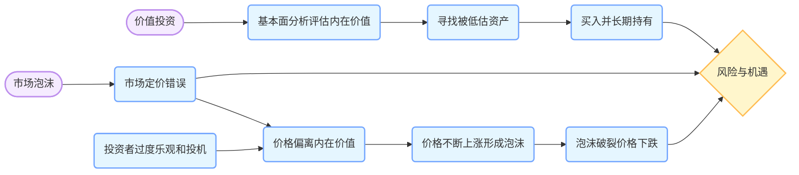

# 价值投资者如何应对市场泡沫

> 关键词：价值投资者、市场泡沫、应对策略、基本面分析、估值方法

> 摘要：本文聚焦于价值投资者在面对市场泡沫时应采取的应对策略。首先介绍了市场泡沫的背景知识，包括目的、预期读者、文档结构和相关术语。接着阐述了价值投资和市场泡沫的核心概念及联系，详细讲解了核心算法原理和具体操作步骤，通过数学模型和公式进一步说明估值的重要性。结合项目实战，给出代码案例并进行详细解释。探讨了市场泡沫在不同场景下的实际应用，推荐了相关的学习资源、开发工具框架和论文著作。最后总结了未来发展趋势与挑战，解答常见问题并提供扩展阅读和参考资料，旨在帮助价值投资者在市场泡沫中做出明智决策。

## 1. 背景介绍 
### 1.1 目的和范围
在金融市场中，市场泡沫是一个常见且具有挑战性的现象。对于价值投资者而言，准确识别和有效应对市场泡沫至关重要。本文的目的在于为价值投资者提供全面、系统的应对市场泡沫的策略和方法。范围涵盖了市场泡沫的定义、形成机制、识别方法，以及价值投资者在不同阶段应采取的具体行动，包括投资组合的调整、风险控制等方面。

### 1.2 预期读者
本文主要面向价值投资者，包括个人投资者、专业投资机构的从业人员等。无论是初涉投资领域的新手，还是经验丰富的专业人士，都能从本文中获取有价值的信息和思路，帮助他们在市场泡沫中更好地保护自己的投资并实现资产的增值。

### 1.3 文档结构概述
本文将按照以下结构展开：首先介绍市场泡沫和价值投资的核心概念及它们之间的联系，通过示意图和流程图进行直观展示；接着详细讲解价值投资中用于应对市场泡沫的核心算法原理和具体操作步骤，并结合 Python 代码进行说明；然后引入数学模型和公式，深入分析估值的方法和意义；通过项目实战，给出实际代码案例并进行详细解读；探讨市场泡沫在不同场景下的实际应用；推荐相关的学习资源、开发工具框架和论文著作；最后总结未来发展趋势与挑战，解答常见问题并提供扩展阅读和参考资料。

### 1.4 术语表
#### 1.4.1 核心术语定义
- **价值投资者**：是指那些基于对公司基本面的深入分析，寻找被市场低估的资产，并长期持有以获取价值回归收益的投资者。
- **市场泡沫**：指资产价格严重偏离其内在价值，形成虚高的价格水平，通常伴随着投资者的过度乐观和投机行为。
- **内在价值**：是指资产在未来所能产生的现金流的现值，反映了资产的真实价值。
- **估值**：是指评估资产内在价值的过程和方法。

#### 1.4.2 相关概念解释
- **基本面分析**：通过研究公司的财务状况、经营业绩、行业前景等因素，来评估公司的内在价值。
- **技术分析**：通过研究市场的历史价格和成交量等数据，来预测资产价格的未来走势。
- **风险控制**：通过合理的投资组合配置、止损等方法，降低投资过程中的风险。

#### 1.4.3 缩略词列表
- **PE**：市盈率（Price-to-Earnings Ratio），是指股票价格与每股收益的比率，用于衡量股票的估值水平。
- **PB**：市净率（Price-to-Book Ratio），是指股票价格与每股净资产的比率，也是常用的估值指标之一。

## 2. 核心概念与联系 

### 核心概念原理
#### 价值投资原理
价值投资的核心原理是基于对公司内在价值的评估。价值投资者认为，市场有时会出现定价错误，导致资产价格偏离其内在价值。通过深入的基本面分析，挖掘出被低估的资产，在价格低于内在价值时买入，等待价格回归价值，从而获得投资收益。

#### 市场泡沫原理
市场泡沫的形成通常是由于投资者的过度乐观和投机行为。当市场情绪高涨时，投资者往往会忽视资产的内在价值，盲目追高价格，导致资产价格不断上涨，远远超过其内在价值。随着泡沫的不断膨胀，市场的风险也在不断积累，最终泡沫可能会破裂，导致资产价格大幅下跌。

### 架构的文本示意图
```plaintext
              价值投资
               |
               | 基于基本面分析评估内在价值
               |
               | 寻找被低估资产
               |
               | 买入并长期持有
               |
               v
市场泡沫 <---- 市场定价错误 ----> 价格偏离内在价值
               |
               | 投资者过度乐观和投机
               |
               | 价格不断上涨形成泡沫
               |
               | 泡沫破裂价格下跌
               v
              风险与机遇
```

### Mermaid 流程图


## 3. 核心算法原理 & 具体操作步骤 

### 核心算法原理
在价值投资中，常用的估值方法有多种，其中最经典的是现金流折现法（DCF）。现金流折现法的核心思想是将资产在未来所能产生的现金流按照一定的折现率折现到当前时刻，从而得到资产的内在价值。

### Python 代码实现现金流折现法
```python
def dcf_valuation(cash_flows, discount_rate):
    """
    现金流折现法计算资产内在价值
    :param cash_flows: 未来各期的现金流列表
    :param discount_rate: 折现率
    :return: 资产的内在价值
    """
    present_value = 0
    for i, cash_flow in enumerate(cash_flows):
        present_value += cash_flow / ((1 + discount_rate) ** (i + 1))
    return present_value

# 示例数据
cash_flows = [100, 120, 150, 180, 200]
discount_rate = 0.1

# 计算内在价值
intrinsic_value = dcf_valuation(cash_flows, discount_rate)
print(f"资产的内在价值为: {intrinsic_value}")
```

### 具体操作步骤
1. **收集数据**：收集公司的财务报表、行业数据等信息，预测未来各期的现金流。
2. **确定折现率**：折现率反映了投资者对资金时间价值和风险的预期。通常可以使用资本资产定价模型（CAPM）来确定折现率。
3. **计算内在价值**：使用现金流折现法计算资产的内在价值。
4. **比较价格与内在价值**：将计算得到的内在价值与当前市场价格进行比较。如果市场价格低于内在价值，则认为该资产被低估，可以考虑买入；如果市场价格高于内在价值，则认为该资产被高估，应谨慎投资。

## 4. 数学模型和公式 & 详细讲解 & 举例说明 

### 现金流折现法公式
现金流折现法的基本公式为：
$$V = \sum_{t=1}^{n} \frac{CF_t}{(1 + r)^t}$$
其中，$V$ 表示资产的内在价值，$CF_t$ 表示第 $t$ 期的现金流，$r$ 表示折现率，$n$ 表示预测的期数。

### 详细讲解
- **现金流预测**：准确预测未来各期的现金流是现金流折现法的关键。可以通过分析公司的历史财务数据、行业发展趋势等因素，对未来的收入、成本、利润等进行预测，从而得到未来各期的现金流。
- **折现率确定**：折现率的确定需要考虑多个因素，如无风险利率、市场风险溢价、公司的贝塔系数等。资本资产定价模型（CAPM）的公式为：
$$r = R_f + \beta \times (R_m - R_f)$$
其中，$r$ 表示折现率，$R_f$ 表示无风险利率，$\beta$ 表示公司的贝塔系数，$R_m$ 表示市场收益率。
- **期数选择**：预测的期数 $n$ 应根据资产的特点和实际情况进行选择。一般来说，对于稳定增长的公司，可以选择较长的预测期；对于不确定性较大的公司，预测期可以相对较短。

### 举例说明
假设某公司未来 5 年的现金流分别为 100 万元、120 万元、150 万元、180 万元、200 万元，折现率为 10%。根据现金流折现法公式，该公司的内在价值为：
$$V = \frac{100}{(1 + 0.1)^1} + \frac{120}{(1 + 0.1)^2} + \frac{150}{(1 + 0.1)^3} + \frac{180}{(1 + 0.1)^4} + \frac{200}{(1 + 0.1)^5}$$
$$V \approx 90.91 + 99.17 + 112.69 + 122.94 + 124.18 = 549.89$$（万元）

如果该公司的当前市场价格为 500 万元，低于其内在价值 549.89 万元，则可以认为该公司的股票被低估，具有投资价值。

## 5. 项目实战：代码实际案例和详细解释说明 

### 5.1  开发环境搭建
- **Python 安装**：确保已经安装了 Python 3.x 版本。可以从 Python 官方网站（https://www.python.org/downloads/）下载并安装。
- **开发工具**：推荐使用 PyCharm 作为开发工具，它具有强大的代码编辑、调试等功能。也可以使用 Jupyter Notebook 进行交互式开发。
- **所需库安装**：在命令行中使用以下命令安装所需的库：
```sh
pip install pandas numpy matplotlib
```

### 5.2  源代码详细实现和代码解读
```python
import pandas as pd
import numpy as np
import matplotlib.pyplot as plt

# 模拟公司未来 10 年的现金流数据
years = np.arange(1, 11)
cash_flows = np.random.randint(50, 200, 10)

# 假设折现率为 8%
discount_rate = 0.08

# 计算现金流的现值
present_values = []
for i, cash_flow in enumerate(cash_flows):
    present_value = cash_flow / ((1 + discount_rate) ** (i + 1))
    present_values.append(present_value)

# 计算内在价值
intrinsic_value = sum(present_values)

# 输出结果
print(f"未来 10 年的现金流数据: {cash_flows}")
print(f"现金流的现值: {present_values}")
print(f"资产的内在价值: {intrinsic_value}")

# 绘制现金流和现值的图表
plt.figure(figsize=(10, 6))
plt.bar(years, cash_flows, label='Cash Flows')
plt.bar(years, present_values, label='Present Values', alpha=0.7)
plt.xlabel('Year')
plt.ylabel('Amount')
plt.title('Cash Flows and Present Values')
plt.legend()
plt.show()
```

### 代码解读与分析
1. **数据模拟**：使用 `numpy` 库生成公司未来 10 年的现金流数据。
2. **折现率设定**：假设折现率为 8%。
3. **现值计算**：通过循环计算每一年现金流的现值，并将其存储在 `present_values` 列表中。
4. **内在价值计算**：将所有现金流的现值相加，得到资产的内在价值。
5. **结果输出**：打印未来 10 年的现金流数据、现金流的现值和资产的内在价值。
6. **图表绘制**：使用 `matplotlib` 库绘制现金流和现值的柱状图，直观展示两者的关系。

## 6. 实际应用场景 
### 股票投资
在股票市场中，市场泡沫时有发生。价值投资者可以通过基本面分析和估值方法，识别出被低估的股票。当市场泡沫形成，股票价格普遍虚高时，价值投资者应保持冷静，避免盲目跟风买入。可以选择持有现金或投资于被低估的股票，等待市场泡沫破裂后，再寻找更好的投资机会。

### 房地产投资
房地产市场也可能出现泡沫。价值投资者在进行房地产投资时，应考虑房产的租金收益、地理位置、市场供需等因素，评估房产的内在价值。当房地产市场泡沫膨胀，房价过高时，应谨慎投资，避免高价买入。可以选择等待市场调整，以合理的价格买入具有投资价值的房产。

### 债券投资
在债券市场中，市场泡沫可能表现为债券价格过高、收益率过低。价值投资者应关注债券的信用风险、利率风险等因素，评估债券的内在价值。当债券市场泡沫出现时，可以选择持有短期债券或现金，等待市场利率上升，债券价格下跌后，再进行投资。

## 7. 工具和资源推荐
### 7.1 学习资源推荐
#### 7.1.1 书籍推荐
- 《聪明的投资者》（The Intelligent Investor）：作者是本杰明·格雷厄姆（Benjamin Graham），被誉为价值投资的圣经，书中详细阐述了价值投资的理念和方法。
- 《证券分析》（Security Analysis）：同样是本杰明·格雷厄姆的经典著作，对证券的分析和估值方法进行了深入探讨。
- 《巴菲特致股东的信》（Letters to Shareholders of Berkshire Hathaway）：由沃伦·巴菲特（Warren Buffett）撰写，通过信件的形式分享了他的投资理念和经验。

#### 7.1.2 在线课程
- Coursera 平台上的“投资学原理”课程，由知名教授授课，涵盖了投资的基本理论和方法。
- edX 平台上的“金融市场”课程，对金融市场的运行机制和投资策略进行了系统讲解。

#### 7.1.3 技术博客和网站
- 雪球网：是一个投资交流社区，汇聚了众多投资者的观点和经验，提供了丰富的股票分析和投资策略。
- 东方财富网：提供全面的金融市场信息，包括股票、基金、债券等的行情数据和分析报告。

### 7.2 开发工具框架推荐
#### 7.2.1 IDE和编辑器
- PyCharm：是一款功能强大的 Python 集成开发环境，具有代码编辑、调试、版本控制等功能。
- Jupyter Notebook：是一个交互式的开发环境，适合进行数据探索和分析，支持 Python、R 等多种编程语言。

#### 7.2.2 调试和性能分析工具
- PDB：是 Python 自带的调试工具，可以帮助开发者定位代码中的问题。
- cProfile：是 Python 的性能分析工具，可以分析代码的运行时间和内存使用情况。

#### 7.2.3 相关框架和库
- Pandas：是一个强大的数据处理和分析库，提供了丰富的数据结构和函数，方便进行数据清洗、转换和分析。
- Numpy：是 Python 的数值计算库，提供了高效的数组操作和数学函数，广泛应用于科学计算和数据分析。
- Matplotlib：是一个用于数据可视化的库，可以绘制各种类型的图表，如折线图、柱状图、散点图等。

### 7.3 相关论文著作推荐
#### 7.3.1 经典论文
- Eugene F. Fama 的《有效资本市场：理论与实证研究回顾》（Efficient Capital Markets: A Review of Theory and Empirical Work），提出了有效市场假说，对金融市场的研究产生了深远影响。
- Robert J. Shiller 的《非理性繁荣》（Irrational Exuberance），探讨了市场泡沫的形成机制和投资者的非理性行为。

#### 7.3.2 最新研究成果
- 可以关注《金融研究》《经济研究》等学术期刊，了解金融领域的最新研究动态。
- 参加金融学术会议，与国内外的专家学者交流最新的研究成果。

#### 7.3.3 应用案例分析
- 《金融炼金术》（The Alchemy of Finance）：作者是乔治·索罗斯（George Soros），通过他的投资实践案例，分析了市场泡沫的形成和破裂过程，以及如何在市场波动中获利。

## 8. 总结：未来发展趋势与挑战
### 未来发展趋势
- **科技驱动**：随着科技的不断发展，金融科技将在价值投资中发挥越来越重要的作用。人工智能、大数据等技术将帮助价值投资者更准确地分析市场数据，挖掘投资机会。
- **全球一体化**：金融市场的全球一体化趋势将更加明显，价值投资者需要关注全球市场的动态，寻找跨市场的投资机会。
- **可持续投资**：越来越多的投资者开始关注企业的社会责任和可持续发展，可持续投资将成为未来价值投资的重要方向。

### 挑战
- **市场不确定性增加**：全球政治、经济环境的不确定性增加，市场波动加剧，给价值投资者带来了更大的挑战。
- **信息过载**：随着信息传播的快速发展，投资者面临着海量的信息，如何筛选和分析有价值的信息成为一个难题。
- **竞争加剧**：价值投资理念越来越受到投资者的认可，市场竞争加剧，寻找被低估的资产变得更加困难。

## 9. 附录：常见问题与解答
### 问题 1：如何准确预测未来现金流？
解答：预测未来现金流需要综合考虑多个因素，如公司的历史财务数据、行业发展趋势、市场竞争状况等。可以采用定性分析和定量分析相结合的方法，建立合理的预测模型。同时，要保持谨慎和保守的态度，对预测结果进行敏感性分析，考虑不同情况下的现金流变化。

### 问题 2：折现率的选择对估值结果有多大影响？
解答：折现率的选择对估值结果有较大影响。折现率越高，未来现金流的现值越低，资产的内在价值也越低；反之，折现率越低，资产的内在价值越高。因此，在确定折现率时，需要充分考虑资金的时间价值和风险因素，选择合理的折现率。

### 问题 3：在市场泡沫中，如何控制投资风险？
解答：在市场泡沫中，控制投资风险可以采取以下措施：一是合理配置资产，分散投资，降低单一资产的风险；二是设置止损点，当资产价格下跌到一定程度时，及时卖出，避免损失进一步扩大；三是保持冷静，避免盲目跟风，坚持价值投资理念。

## 10. 扩展阅读 & 参考资料
### 扩展阅读
- 《投资最重要的事》（The Most Important Thing Illuminated）：作者是霍华德·马克斯（Howard Marks），分享了他在投资领域的经验和智慧。
- 《黑天鹅》（The Black Swan）：作者是纳西姆·尼古拉斯·塔勒布（Nassim Nicholas Taleb），探讨了极端事件对金融市场的影响。

### 参考资料
- 本杰明·格雷厄姆. 《聪明的投资者》. 人民邮电出版社.
- 沃伦·巴菲特. 《巴菲特致股东的信》. 机械工业出版社.
- Eugene F. Fama. “Efficient Capital Markets: A Review of Theory and Empirical Work”. The Journal of Finance.
- Robert J. Shiller. “Irrational Exuberance”. Princeton University Press.