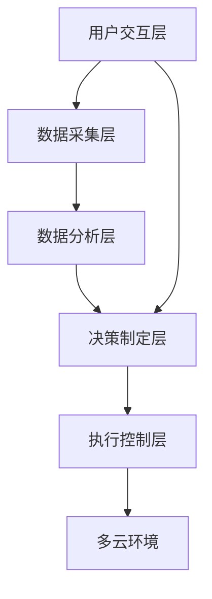

# 企业AI Agent的多云环境管理策略

> 关键词：企业AI Agent、多云环境、管理策略、资源优化、安全保障

> 摘要：随着企业数字化转型的加速，多云环境在企业中得到了广泛应用。企业AI Agent作为一种智能工具，在多云环境管理中发挥着重要作用。本文深入探讨了企业AI Agent在多云环境下的管理策略，从背景介绍出发，阐述核心概念与联系，详细讲解核心算法原理及操作步骤，通过数学模型和公式进行理论分析，结合项目实战给出代码案例和解释，探讨实际应用场景，推荐相关工具和资源，最后总结未来发展趋势与挑战，并解答常见问题，为企业在多云环境中更好地运用AI Agent提供全面的技术指导和管理思路。

## 1. 背景介绍 
### 1.1 目的和范围
在当今数字化时代，企业为了满足业务的多样化需求和提高资源利用率，越来越多地采用多云环境。多云环境允许企业将工作负载分布在多个云服务提供商（如亚马逊云服务AWS、微软Azure、谷歌云平台GCP等）的基础设施上。然而，多云环境的管理面临着诸多挑战，如资源调度复杂、安全管理难度大、成本控制困难等。企业AI Agent作为一种智能化的管理工具，可以帮助企业更高效地管理多云环境。本文的目的在于深入研究企业AI Agent在多云环境下的管理策略，范围涵盖从核心概念的阐述到实际应用案例的分析，旨在为企业提供全面、可行的管理方案。

### 1.2 预期读者
本文预期读者包括企业的IT管理人员、云计算工程师、人工智能研发人员、企业的技术决策者等。对于IT管理人员，本文可以帮助他们了解如何利用AI Agent优化多云环境的管理流程；云计算工程师可以从中学到AI Agent在多云环境中的技术实现细节；人工智能研发人员可以获得AI Agent在特定场景下的应用思路；企业技术决策者则可以依据本文的内容制定合理的多云环境管理战略。

### 1.3 文档结构概述
本文首先介绍企业AI Agent的多云环境管理策略的背景信息，包括目的、预期读者和文档结构概述等。接着阐述核心概念与联系，通过文本示意图和Mermaid流程图展示其原理和架构。然后详细讲解核心算法原理及具体操作步骤，结合Python源代码进行说明。之后给出数学模型和公式，并进行详细讲解和举例。再通过项目实战，介绍开发环境搭建、源代码实现和代码解读。随后探讨实际应用场景，推荐相关工具和资源。最后总结未来发展趋势与挑战，解答常见问题，并提供扩展阅读和参考资料。

### 1.4 术语表
#### 1.4.1 核心术语定义
- **企业AI Agent**：是一种基于人工智能技术的智能体，能够在企业环境中自主执行任务、做出决策，辅助企业进行各种管理和运营活动。在多云环境管理中，AI Agent可以自动监测资源状态、进行资源调度、优化成本等。
- **多云环境**：指企业同时使用多个云服务提供商的云计算资源，包括公有云、私有云等，以满足不同业务需求。
- **资源调度**：根据业务需求和资源状态，合理分配云计算资源（如计算资源、存储资源、网络资源等）的过程。
- **安全保障**：采取一系列措施确保多云环境中数据和系统的安全性，防止数据泄露、恶意攻击等。

#### 1.4.2 相关概念解释
- **智能决策**：AI Agent通过分析大量的数据和信息，运用机器学习、深度学习等算法，自动做出最优决策的过程。
- **自动化运维**：利用软件工具和脚本，自动执行系统维护、监控、配置等运维任务，提高运维效率和准确性。
- **成本优化**：通过合理规划和管理资源使用，降低企业在多云环境中的运营成本。

#### 1.4.3 缩略词列表
- **AWS**：Amazon Web Services，亚马逊云服务
- **Azure**：Microsoft Azure，微软云平台
- **GCP**：Google Cloud Platform，谷歌云平台
- **SLA**：Service Level Agreement，服务级别协议

## 2. 核心概念与联系 

### 核心概念原理
企业AI Agent在多云环境管理中的核心原理是通过感知、决策和执行三个主要阶段实现对多云环境的有效管理。

感知阶段，AI Agent通过各种传感器和监控工具收集多云环境中各个云服务提供商的资源状态信息，包括计算资源的使用率、存储资源的剩余空间、网络带宽的占用情况等，以及业务系统的运行状态，如应用程序的响应时间、吞吐量等。

决策阶段，AI Agent利用收集到的信息，运用机器学习、深度学习等人工智能算法进行分析和预测。例如，通过对历史资源使用数据的分析，预测未来业务高峰时期的资源需求；通过对安全事件数据的学习，识别潜在的安全威胁。然后，根据分析结果和预设的管理目标（如资源优化、成本控制、安全保障等），制定最优的管理决策。

执行阶段，AI Agent将决策转化为具体的操作指令，并发送到相应的云服务提供商的管理接口，实现对资源的动态调度、安全策略的调整等操作。

### 架构的文本示意图
企业AI Agent的多云环境管理架构主要包括以下几个部分：

- **数据采集层**：负责收集多云环境中各个云服务提供商的资源状态信息和业务系统的运行状态信息。数据采集层可以通过云服务提供商提供的API接口、监控工具（如Prometheus、Grafana等）以及自定义的传感器来实现。
- **数据分析层**：对采集到的数据进行清洗、预处理和分析。数据分析层运用机器学习、深度学习等算法，挖掘数据中的潜在模式和规律，为决策提供依据。
- **决策制定层**：根据数据分析层的结果和预设的管理目标，制定最优的管理决策。决策制定层可以采用规则引擎、优化算法等技术实现。
- **执行控制层**：将决策转化为具体的操作指令，并发送到相应的云服务提供商的管理接口，实现对资源的动态调度、安全策略的调整等操作。执行控制层可以通过云服务提供商提供的SDK、自动化脚本等方式实现。
- **用户交互层**：提供用户界面，允许企业管理人员对AI Agent进行配置、监控和管理。用户交互层可以采用Web界面、命令行工具等方式实现。

### Mermaid流程图


## 3. 核心算法原理 & 具体操作步骤 

### 核心算法原理
在企业AI Agent的多云环境管理中，资源调度是一个关键问题。我们可以采用基于强化学习的资源调度算法来实现资源的优化分配。强化学习是一种通过智能体与环境进行交互，不断尝试和学习，以最大化累积奖励的机器学习方法。

在资源调度问题中，智能体（即AI Agent）的状态可以定义为多云环境中各个云服务提供商的资源状态信息和业务系统的运行状态信息，动作可以定义为对资源的调度操作（如增加或减少计算资源、调整存储资源等），奖励可以定义为与管理目标相关的指标（如资源利用率、成本、业务系统的性能等）。

### Python源代码详细阐述
以下是一个简单的基于强化学习的资源调度算法的Python示例代码：

```python
import numpy as np

# 定义环境类
class CloudEnvironment:
    def __init__(self):
        # 初始化资源状态
        self.resource_state = np.array([100, 100, 100])  # 三个云服务提供商的初始资源量
        self.reward = 0

    def step(self, action):
        # 根据动作更新资源状态
        self.resource_state += action
        # 计算奖励
        self.reward = np.sum(self.resource_state) / (np.max(self.resource_state) + 1)
        return self.resource_state, self.reward

# 定义智能体类
class ResourceAgent:
    def __init__(self):
        self.q_table = np.zeros((100, 100, 100, 3))  # Q表
        self.learning_rate = 0.1
        self.discount_factor = 0.9
        self.epsilon = 0.1

    def choose_action(self, state):
        if np.random.uniform(0, 1) < self.epsilon:
            action = np.random.randint(-10, 11, 3)  # 随机选择动作
        else:
            state_index = tuple(state)
            action_index = np.argmax(self.q_table[state_index])
            action = np.array([-10, 0, 10])[action_index]
        return action

    def update_q_table(self, state, action, reward, next_state):
        state_index = tuple(state)
        next_state_index = tuple(next_state)
        action_index = np.where(np.array([-10, 0, 10]) == action)[0][0]
        self.q_table[state_index][action_index] += self.learning_rate * (
            reward + self.discount_factor * np.max(self.q_table[next_state_index]) - self.q_table[state_index][action_index]
        )

# 训练过程
env = CloudEnvironment()
agent = ResourceAgent()

for episode in range(1000):
    state = env.resource_state
    for step in range(100):
        action = agent.choose_action(state)
        next_state, reward = env.step(action)
        agent.update_q_table(state, action, reward, next_state)
        state = next_state
```

### 具体操作步骤
1. **初始化环境和智能体**：创建云环境对象和资源智能体对象，初始化资源状态和Q表。
2. **训练智能体**：在多个训练周期内，智能体不断与环境进行交互，选择动作，更新资源状态，计算奖励，并更新Q表。
3. **部署智能体**：将训练好的智能体部署到实际的多云环境中，根据实时的资源状态选择最优的资源调度动作。

## 4. 数学模型和公式 & 详细讲解 & 举例说明 

### 数学模型
在基于强化学习的资源调度算法中，我们可以使用马尔可夫决策过程（MDP）来描述智能体与环境的交互过程。MDP是一个五元组 $<S, A, P, R, \gamma>$，其中：
- $S$ 是状态空间，表示多云环境中所有可能的资源状态和业务系统运行状态的集合。
- $A$ 是动作空间，表示所有可能的资源调度操作的集合。
- $P$ 是状态转移概率函数，表示在当前状态 $s \in S$ 下采取动作 $a \in A$ 后转移到下一个状态 $s' \in S$ 的概率，即 $P(s'|s, a)$。
- $R$ 是奖励函数，表示在当前状态 $s \in S$ 下采取动作 $a \in A$ 后获得的奖励，即 $R(s, a)$。
- $\gamma$ 是折扣因子，用于平衡短期奖励和长期奖励，取值范围为 $[0, 1]$。

### 公式
智能体的目标是最大化累积折扣奖励，即：
$$G_t = \sum_{k=0}^{\infty} \gamma^k R_{t+k+1}$$
其中，$G_t$ 是在时刻 $t$ 的累积折扣奖励，$R_{t+k+1}$ 是在时刻 $t+k+1$ 获得的奖励。

Q学习算法是一种用于求解MDP的无模型强化学习算法，其核心思想是通过不断更新Q表来估计每个状态-动作对的价值。Q表中的值 $Q(s, a)$ 表示在状态 $s$ 下采取动作 $a$ 后获得的累积折扣奖励的期望值。Q学习算法的更新公式为：
$$Q(s, a) \leftarrow Q(s, a) + \alpha [R(s, a) + \gamma \max_{a'} Q(s', a') - Q(s, a)]$$
其中，$\alpha$ 是学习率，$s'$ 是采取动作 $a$ 后转移到的下一个状态。

### 详细讲解
状态空间 $S$ 可以通过对多云环境中各个云服务提供商的资源状态和业务系统的运行状态进行量化得到。例如，计算资源的使用率可以用一个百分比表示，存储资源的剩余空间可以用字节数表示等。动作空间 $A$ 则根据具体的资源调度需求来定义，如增加或减少计算资源的数量、调整存储资源的分配等。

状态转移概率函数 $P(s'|s, a)$ 描述了在当前状态 $s$ 下采取动作 $a$ 后转移到下一个状态 $s'$ 的可能性。在实际应用中，由于环境的复杂性，状态转移概率往往是难以精确计算的，因此可以采用无模型的强化学习算法，如Q学习算法，来避免对状态转移概率的估计。

奖励函数 $R(s, a)$ 是根据管理目标来设计的。例如，如果管理目标是提高资源利用率，则奖励函数可以定义为资源利用率的增加量；如果管理目标是降低成本，则奖励函数可以定义为成本的减少量。

折扣因子 $\gamma$ 用于平衡短期奖励和长期奖励。当 $\gamma$ 接近1时，智能体更注重长期奖励；当 $\gamma$ 接近0时，智能体更注重短期奖励。

### 举例说明
假设我们有一个简单的多云环境，包含两个云服务提供商，每个云服务提供商的计算资源初始量为100。状态空间 $S$ 可以表示为 $(x_1, x_2)$，其中 $x_1$ 和 $x_2$ 分别表示两个云服务提供商的计算资源剩余量。动作空间 $A$ 可以表示为 $(-10, 0, 10)$，表示减少10个计算资源、不做操作、增加10个计算资源。

奖励函数 $R(s, a)$ 可以定义为：
$$R(s, a) = \frac{x_1 + x_2}{\max(x_1, x_2) + 1}$$
表示资源利用率的指标。

假设当前状态 $s = (80, 60)$，智能体选择动作 $a = 10$，即增加10个计算资源到第一个云服务提供商。则下一个状态 $s' = (90, 60)$，奖励 $R(s, a) = \frac{90 + 60}{\max(90, 60) + 1} = \frac{150}{91} \approx 1.65$。

根据Q学习算法的更新公式，假设学习率 $\alpha = 0.1$，折扣因子 $\gamma = 0.9$，Q表中 $Q(s, a) = 0.5$，$\max_{a'} Q(s', a') = 0.6$，则更新后的 $Q(s, a)$ 为：
$$Q(s, a) = 0.5 + 0.1 \times (1.65 + 0.9 \times 0.6 - 0.5) = 0.5 + 0.1 \times (1.65 + 0.54 - 0.5) = 0.5 + 0.1 \times 1.69 = 0.669$$

## 5. 项目实战：代码实际案例和详细解释说明 

### 5.1  开发环境搭建
#### 硬件环境
- 服务器：可以选择具有足够计算资源和存储资源的物理服务器或云服务器，如AWS EC2实例、Azure虚拟机等。建议至少具有4核CPU、8GB内存和100GB硬盘空间。
- 网络：保证服务器具有稳定的网络连接，能够访问各个云服务提供商的API接口。

#### 软件环境
- 操作系统：可以选择Linux操作系统，如Ubuntu、CentOS等。
- 编程语言：Python 3.x，建议使用Python 3.7及以上版本。
- 开发工具：可以选择PyCharm、VS Code等集成开发环境。
- 依赖库：需要安装numpy、pandas、tensorflow、scikit-learn等Python库，用于数据处理、机器学习等任务。可以使用pip命令进行安装：
```sh
pip install numpy pandas tensorflow scikit-learn
```

### 5.2  源代码详细实现和代码解读
以下是一个完整的企业AI Agent的多云环境管理项目的Python代码示例：

```python
import numpy as np
import pandas as pd
from sklearn.preprocessing import StandardScaler
from tensorflow.keras.models import Sequential
from tensorflow.keras.layers import Dense

# 定义云环境类
class CloudEnvironment:
    def __init__(self, num_clouds=3):
        self.num_clouds = num_clouds
        self.resource_state = np.random.randint(50, 100, num_clouds)  # 随机初始化资源状态
        self.reward = 0

    def step(self, action):
        # 根据动作更新资源状态
        self.resource_state += action
        # 计算奖励
        self.reward = np.sum(self.resource_state) / (np.max(self.resource_state) + 1)
        return self.resource_state, self.reward

# 定义智能体类
class ResourceAgent:
    def __init__(self, num_clouds=3):
        self.num_clouds = num_clouds
        self.model = self.build_model()
        self.learning_rate = 0.001
        self.discount_factor = 0.9
        self.epsilon = 0.1

    def build_model(self):
        model = Sequential()
        model.add(Dense(64, input_dim=self.num_clouds, activation='relu'))
        model.add(Dense(64, activation='relu'))
        model.add(Dense(3, activation='linear'))  # 3个动作
        model.compile(loss='mse', optimizer='adam', lr=self.learning_rate)
        return model

    def choose_action(self, state):
        if np.random.uniform(0, 1) < self.epsilon:
            action = np.random.randint(-10, 11, self.num_clouds)  # 随机选择动作
        else:
            state = np.array([state])
            q_values = self.model.predict(state)
            action_index = np.argmax(q_values)
            action = np.array([-10, 0, 10])[action_index]
        return action

    def update_model(self, state, action, reward, next_state):
        state = np.array([state])
        next_state = np.array([next_state])
        q_values = self.model.predict(state)
        next_q_values = self.model.predict(next_state)
        max_next_q_value = np.max(next_q_values)
        target_q_value = reward + self.discount_factor * max_next_q_value
        action_index = np.where(np.array([-10, 0, 10]) == action)[0][0]
        q_values[0][action_index] = target_q_value
        self.model.fit(state, q_values, epochs=1, verbose=0)

# 训练过程
env = CloudEnvironment()
agent = ResourceAgent()

for episode in range(1000):
    state = env.resource_state
    for step in range(100):
        action = agent.choose_action(state)
        next_state, reward = env.step(action)
        agent.update_model(state, action, reward, next_state)
        state = next_state
```

### 5.3  代码解读与分析
#### 云环境类 `CloudEnvironment`
- `__init__` 方法：初始化云环境的资源状态，随机生成每个云服务提供商的初始资源量。
- `step` 方法：根据智能体选择的动作更新资源状态，并计算奖励。奖励的计算方式为资源利用率的指标。

#### 智能体类 `ResourceAgent`
- `build_model` 方法：构建一个简单的神经网络模型，用于估计Q值。模型包含两个隐藏层，输出层有3个神经元，分别对应3个动作。
- `choose_action` 方法：根据当前状态选择动作。以一定的概率随机选择动作（探索），否则选择Q值最大的动作（利用）。
- `update_model` 方法：根据当前状态、动作、奖励和下一个状态更新神经网络模型的参数。采用Q学习算法的思想，更新目标Q值。

#### 训练过程
在多个训练周期内，智能体不断与环境进行交互，选择动作，更新资源状态，计算奖励，并更新神经网络模型的参数。通过不断的训练，智能体可以学习到最优的资源调度策略。

## 6. 实际应用场景 
### 资源优化
企业AI Agent可以实时监测多云环境中各个云服务提供商的资源状态，根据业务需求和资源使用情况，自动进行资源调度。例如，在业务高峰时期，AI Agent可以自动增加计算资源和存储资源，以满足业务的高并发需求；在业务低谷时期，AI Agent可以自动减少资源，降低成本。

### 成本控制
AI Agent可以通过分析各个云服务提供商的价格策略和资源使用情况，选择最优的资源配置方案，降低企业在多云环境中的运营成本。例如，AI Agent可以根据不同云服务提供商的价格波动，动态调整资源的分配，选择价格较低的云服务提供商。

### 安全保障
AI Agent可以实时监测多云环境中的安全事件，如网络攻击、数据泄露等。一旦发现安全威胁，AI Agent可以自动采取措施，如隔离受攻击的节点、更新安全策略等，保障企业数据和系统的安全。

### 业务连续性
AI Agent可以在多云环境中实现业务的自动迁移和备份。当某个云服务提供商出现故障或维护时，AI Agent可以自动将业务迁移到其他可用的云服务提供商，确保业务的连续性。

## 7. 工具和资源推荐
### 7.1 学习资源推荐
#### 7.1.1 书籍推荐
- 《人工智能：一种现代的方法》：全面介绍了人工智能的基本概念、算法和应用，是人工智能领域的经典教材。
- 《强化学习：原理与Python实现》：详细讲解了强化学习的原理和算法，并通过Python代码实现了多个实际案例，适合初学者学习。
- 《云计算与分布式系统：从并行处理到物联网》：介绍了云计算的基本概念、架构和应用，以及云计算与分布式系统的关系，对于理解多云环境有很大帮助。

#### 7.1.2 在线课程
- Coursera上的“人工智能基础”课程：由知名大学的教授授课，系统地介绍了人工智能的基本概念和算法。
- edX上的“强化学习基础”课程：深入讲解了强化学习的原理和应用，通过实际案例帮助学员掌握强化学习的编程技巧。
- Udemy上的“云计算实战”课程：通过实际项目，介绍了云计算的部署、管理和优化，适合想要学习多云环境管理的学员。

#### 7.1.3 技术博客和网站
- 人工智能领域的博客：如Medium上的Towards Data Science、Analytics Vidhya等，经常发布关于人工智能的最新研究成果和技术文章。
- 云计算领域的网站：如AWS官方博客、Azure官方博客、GCP官方博客等，提供了关于各个云服务提供商的最新产品和技术信息。

### 7.2 开发工具框架推荐
#### 7.2.1 IDE和编辑器
- PyCharm：一款专业的Python集成开发环境，提供了代码编辑、调试、版本控制等功能，适合Python开发。
- VS Code：一款轻量级的代码编辑器，支持多种编程语言，具有丰富的插件生态系统，可以通过安装插件来实现Python开发的各种功能。

#### 7.2.2 调试和性能分析工具
- TensorBoard：TensorFlow提供的可视化工具，可以用于查看神经网络模型的训练过程、性能指标等。
- cProfile：Python内置的性能分析工具，可以用于分析Python代码的性能瓶颈。

#### 7.2.3 相关框架和库
- TensorFlow：一个开源的机器学习框架，提供了丰富的工具和库，用于构建和训练深度学习模型。
- PyTorch：另一个流行的深度学习框架，具有简洁的API和高效的计算性能。
- OpenAI Gym：一个用于开发和比较强化学习算法的工具包，提供了多种环境和任务。

### 7.3 相关论文著作推荐
#### 7.3.1 经典论文
- “Reinforcement Learning: An Introduction”：强化学习领域的经典论文，系统地介绍了强化学习的基本概念、算法和应用。
- “Cloud Computing: State-of-the-Art and Research Challenges”：云计算领域的经典论文，分析了云计算的发展现状和面临的研究挑战。

#### 7.3.2 最新研究成果
- 每年的ACM SIGKDD、NeurIPS、ICML等会议上都会发表关于人工智能和云计算的最新研究成果，可以关注这些会议的论文。
- 相关学术期刊，如Journal of Artificial Intelligence Research、IEEE Transactions on Cloud Computing等，也会发表高质量的研究论文。

#### 7.3.3 应用案例分析
- 各大云服务提供商的官方网站上会发布一些关于多云环境管理的应用案例，可以参考这些案例了解实际应用中的经验和方法。
- 一些行业报告和白皮书，如Gartner的云计算报告、Forrester的多云环境研究报告等，也会提供一些应用案例和分析。

## 8. 总结：未来发展趋势与挑战
### 未来发展趋势
- **智能化程度不断提高**：企业AI Agent将越来越智能化，能够自动处理更加复杂的管理任务，做出更加精准的决策。例如，通过结合自然语言处理技术，AI Agent可以与企业管理人员进行自然语言交互，更好地理解业务需求。
- **与其他技术的融合**：企业AI Agent将与区块链、物联网等技术深度融合。例如，通过区块链技术可以实现多云环境中数据的安全共享和可信交互；通过物联网技术可以实时获取物理设备的状态信息，为资源调度提供更准确的依据。
- **跨行业应用拓展**：企业AI Agent的多云环境管理策略将在更多行业得到应用，如金融、医疗、制造业等。不同行业的业务需求和特点不同，需要对AI Agent进行定制化开发和优化。

### 挑战
- **数据安全和隐私保护**：在多云环境中，企业的数据分布在多个云服务提供商的基础设施上，数据安全和隐私保护面临着更大的挑战。需要采取更加严格的安全措施，如数据加密、访问控制、安全审计等，确保数据的安全性和隐私性。
- **技术复杂性**：企业AI Agent的开发和部署涉及到人工智能、云计算、网络等多个领域的技术，技术复杂性较高。需要企业具备专业的技术团队和技术能力，才能有效地实现AI Agent的功能。
- **标准和规范缺失**：目前，关于企业AI Agent的多云环境管理还缺乏统一的标准和规范。不同云服务提供商的API接口和管理方式存在差异，给AI Agent的开发和集成带来了困难。需要行业组织和相关机构制定统一的标准和规范，促进企业AI Agent的发展和应用。

## 9. 附录：常见问题与解答
### 1. 企业AI Agent在多云环境中如何保证数据的一致性？
企业AI Agent可以通过数据同步和复制技术来保证数据的一致性。例如，采用主从复制、多主复制等方式，将数据在多个云服务提供商的存储系统中进行复制和同步。同时，AI Agent可以实时监测数据的状态，当发现数据不一致时，自动进行数据修复和同步。

### 2. 如何评估企业AI Agent在多云环境管理中的性能？
可以从多个方面评估企业AI Agent的性能，如资源利用率、成本控制效果、业务系统的性能指标（如响应时间、吞吐量等）、安全事件的发生率等。通过对这些指标的监测和分析，可以评估AI Agent在多云环境管理中的性能。

### 3. 企业AI Agent在多云环境中如何处理不同云服务提供商的兼容性问题？
企业AI Agent可以采用抽象层和适配器模式来处理不同云服务提供商的兼容性问题。抽象层将不同云服务提供商的API接口进行抽象和封装，提供统一的接口给AI Agent使用；适配器模式则根据不同云服务提供商的特点，实现具体的适配逻辑，将AI Agent的操作指令转换为相应云服务提供商的API调用。

## 10. 扩展阅读 & 参考资料
### 扩展阅读
- 《人工智能时代的企业数字化转型》：探讨了人工智能技术在企业数字化转型中的应用和挑战，为企业AI Agent的应用提供了更广阔的视角。
- 《云计算安全技术与实践》：详细介绍了云计算安全的相关技术和实践经验，对于企业AI Agent在多云环境中的安全保障具有重要的参考价值。

### 参考资料
- 各云服务提供商的官方文档和技术白皮书，如AWS、Azure、GCP等。
- 相关的学术论文和研究报告，如ACM SIGKDD、NeurIPS、ICML等会议的论文。
- 开源项目和代码库，如GitHub上的相关项目。