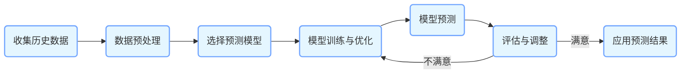

# 企业AI Agent的时间序列预测技术应用

> 关键词：企业AI Agent、时间序列预测、技术应用、数据分析、机器学习、深度学习、业务决策

> 摘要：本文聚焦于企业AI Agent的时间序列预测技术应用，全面且深入地探讨了该技术的背景、核心概念、算法原理、数学模型等内容。通过详细的代码案例展示了如何在实际项目中运用时间序列预测技术，分析了其在不同企业场景下的实际应用价值。同时，推荐了相关的学习资源、开发工具和研究论文，最后对该技术的未来发展趋势与挑战进行了总结，旨在为企业更好地利用时间序列预测技术提供全面且深入的参考和指导。

## 1. 背景介绍 
### 1.1 目的和范围
在当今数字化时代，企业面临着海量的数据，如何从这些数据中提取有价值的信息并做出明智的决策成为关键。时间序列预测技术能够基于历史数据对未来趋势进行预测，为企业的战略规划、资源分配、风险防控等提供有力支持。本文章的目的在于深入探讨企业AI Agent如何应用时间序列预测技术，涵盖了从基础概念到实际应用的各个方面，包括算法原理、数学模型、代码实现以及实际应用场景等，旨在帮助企业更好地理解和运用这一技术。

### 1.2 预期读者
本文预期读者包括企业的技术人员，如数据科学家、AI工程师、软件开发者等，他们可以从文中获取时间序列预测技术的详细技术细节和代码实现；企业的管理人员和决策者也可以通过本文了解时间序列预测技术在企业中的应用价值和潜在影响，从而更好地制定企业战略和决策；此外，对时间序列预测技术感兴趣的研究人员和学生也可以从本文中获得相关的理论知识和实践经验。

### 1.3 文档结构概述
本文首先介绍时间序列预测技术的背景信息，包括目的、预期读者和文档结构概述等。接着阐述核心概念与联系，通过文本示意图和Mermaid流程图展示时间序列预测的原理和架构。然后详细讲解核心算法原理和具体操作步骤，并使用Python源代码进行阐述。之后介绍数学模型和公式，并举例说明。在项目实战部分，展示代码实际案例并进行详细解释。随后分析实际应用场景，推荐相关的工具和资源。最后总结未来发展趋势与挑战，提供常见问题与解答以及扩展阅读和参考资料。

### 1.4 术语表
#### 1.4.1 核心术语定义
- **企业AI Agent**：指在企业环境中运行的人工智能代理，它能够感知环境、收集数据、进行推理和决策，并与其他系统或人员进行交互，以实现企业的特定目标。
- **时间序列**：是指将同一统计指标的数值按其发生的时间先后顺序排列而成的数列。时间序列数据通常包含趋势、季节性、周期性和随机性等特征。
- **时间序列预测**：是指基于历史时间序列数据，运用统计方法、机器学习或深度学习等技术，对未来时间点的数值进行预测的过程。

#### 1.4.2 相关概念解释
- **平稳性**：时间序列的平稳性是指时间序列的统计特性不随时间的推移而发生变化。平稳性是许多时间序列分析方法的前提条件，因为平稳序列更容易进行建模和预测。
- **自相关**：自相关是指时间序列中不同时间点的数值之间的相关性。自相关分析可以帮助我们了解时间序列的周期性和趋势性特征。
- **季节性**：季节性是指时间序列在固定的时间间隔内呈现出重复的模式。例如，某些商品的销售量在每年的特定季节会出现高峰。

#### 1.4.3 缩略词列表
- **ARIMA**：Autoregressive Integrated Moving Average，自回归积分滑动平均模型。
- **LSTM**：Long Short-Term Memory，长短期记忆网络。
- **GRU**：Gated Recurrent Unit，门控循环单元。

## 2. 核心概念与联系 

### 时间序列预测的原理
时间序列预测的基本原理是基于历史数据的模式和规律，通过建立合适的模型来预测未来的数值。时间序列数据通常具有趋势性、季节性和随机性等特征，预测模型的任务就是从这些数据中提取有用的信息，并对未来的趋势进行推断。

### 企业AI Agent与时间序列预测的联系
企业AI Agent可以利用时间序列预测技术来实现更智能的决策和行动。例如，在销售预测方面，AI Agent可以收集历史销售数据，运用时间序列预测模型预测未来的销售量，从而帮助企业合理安排生产、库存和销售策略。在风险管理方面，AI Agent可以通过时间序列预测技术对市场趋势、财务指标等进行预测，及时发现潜在的风险并采取相应的措施。

### 文本示意图
时间序列预测的一般流程可以描述为：首先收集历史时间序列数据，然后对数据进行预处理，包括数据清洗、缺失值处理、归一化等。接着选择合适的预测模型，如ARIMA、LSTM等，并对模型进行训练和优化。最后使用训练好的模型对未来的数值进行预测，并对预测结果进行评估和调整。

### Mermaid流程图


## 3. 核心算法原理 & 具体操作步骤 

### ARIMA算法原理
ARIMA（Autoregressive Integrated Moving Average）模型是一种广泛应用的时间序列预测模型，它结合了自回归（AR）、差分（I）和移动平均（MA）三个部分。

- **自回归（AR）**：自回归模型假设当前时刻的数值与过去若干时刻的数值之间存在线性关系。其数学表达式为：
$$
y_t = c + \sum_{i = 1}^{p} \varphi_i y_{t - i} + \epsilon_t
$$
其中，$y_t$ 是当前时刻的数值，$c$ 是常数，$\varphi_i$ 是自回归系数，$p$ 是自回归阶数，$\epsilon_t$ 是白噪声。

- **差分（I）**：差分是为了使时间序列数据具有平稳性。通过对原始时间序列进行差分运算，可以消除趋势和季节性的影响。例如，一阶差分的表达式为：
$$
\Delta y_t = y_t - y_{t - 1}
$$

- **移动平均（MA）**：移动平均模型假设当前时刻的数值与过去若干时刻的白噪声之间存在线性关系。其数学表达式为：
$$
y_t = c + \epsilon_t + \sum_{i = 1}^{q} \theta_i \epsilon_{t - i}
$$
其中，$\theta_i$ 是移动平均系数，$q$ 是移动平均阶数。

### ARIMA算法的Python实现
```python
import pandas as pd
import numpy as np
from statsmodels.tsa.arima.model import ARIMA
import matplotlib.pyplot as plt

# 生成示例数据
np.random.seed(0)
time_index = pd.date_range(start='2020-01-01', periods=100, freq='D')
data = np.random.randn(100).cumsum()
time_series = pd.Series(data, index=time_index)

# 拟合ARIMA模型
p = 1  # 自回归阶数
d = 1  # 差分阶数
q = 1  # 移动平均阶数
model = ARIMA(time_series, order=(p, d, q))
model_fit = model.fit()

# 进行预测
n_steps = 10
forecast = model_fit.get_forecast(steps=n_steps)
forecast_mean = forecast.predicted_mean
forecast_conf_int = forecast.conf_int()

# 绘制原始数据和预测结果
plt.figure(figsize=(12, 6))
plt.plot(time_series, label='Original Data')
plt.plot(pd.date_range(start=time_index[-1], periods=n_steps + 1, freq='D')[1:], forecast_mean, label='Forecast', color='red')
plt.fill_between(forecast_conf_int.index, forecast_conf_int.iloc[:, 0], forecast_conf_int.iloc[:, 1], color='k', alpha=0.1)
plt.title('ARIMA Time Series Forecast')
plt.xlabel('Date')
plt.ylabel('Value')
plt.legend()
plt.show()
```
### 具体操作步骤
1. **数据准备**：收集和整理时间序列数据，并进行必要的预处理，如数据清洗、缺失值处理等。
2. **模型选择**：根据数据的特点和需求，选择合适的预测模型，如ARIMA、LSTM等。
3. **模型训练**：使用历史数据对模型进行训练，确定模型的参数。
4. **模型评估**：使用评估指标（如均方误差、平均绝对误差等）对模型的性能进行评估。
5. **预测与应用**：使用训练好的模型对未来的数值进行预测，并将预测结果应用到实际业务中。

## 4. 数学模型和公式 & 详细讲解 & 举例说明 

### ARIMA模型的数学公式
ARIMA模型的一般形式可以表示为：
$$
\Phi(B)(1 - B)^d y_t = \Theta(B) \epsilon_t
$$
其中，$\Phi(B)$ 是自回归算子，$B$ 是滞后算子，$(1 - B)^d$ 是差分算子，$\Theta(B)$ 是移动平均算子。

### LSTM模型的数学公式
LSTM（Long Short-Term Memory）是一种特殊的循环神经网络，它能够处理序列数据中的长期依赖关系。LSTM单元的数学公式如下：

- **输入门**：
$$
i_t = \sigma(W_{ii} x_t + W_{hi} h_{t - 1} + b_i)
$$

- **遗忘门**：
$$
f_t = \sigma(W_{if} x_t + W_{hf} h_{t - 1} + b_f)
$$

- **细胞状态更新**：
$$
\tilde{C}_t = \tanh(W_{ic} x_t + W_{hc} h_{t - 1} + b_c)
$$
$$
C_t = f_t \odot C_{t - 1} + i_t \odot \tilde{C}_t
$$

- **输出门**：
$$
o_t = \sigma(W_{io} x_t + W_{ho} h_{t - 1} + b_o)
$$
$$
h_t = o_t \odot \tanh(C_t)
$$

其中，$x_t$ 是输入，$h_{t - 1}$ 是上一时刻的隐藏状态，$C_{t - 1}$ 是上一时刻的细胞状态，$\sigma$ 是sigmoid函数，$\tanh$ 是双曲正切函数，$\odot$ 是逐元素相乘，$W$ 是权重矩阵，$b$ 是偏置向量。

### 举例说明
假设我们有一个销售数据的时间序列，我们可以使用ARIMA模型对未来的销售量进行预测。首先，我们需要对数据进行差分处理，使其具有平稳性。然后，通过自相关和偏自相关分析确定自回归阶数 $p$ 和移动平均阶数 $q$。最后，使用确定的参数拟合ARIMA模型并进行预测。

## 5. 项目实战：代码实际案例和详细解释说明 

### 5.1  开发环境搭建
- **Python环境**：建议使用Python 3.7及以上版本。
- **相关库**：安装`pandas`、`numpy`、`statsmodels`、`matplotlib`、`tensorflow`等库。可以使用以下命令进行安装：
```sh
pip install pandas numpy statsmodels matplotlib tensorflow
```

### 5.2  源代码详细实现和代码解读
以下是一个使用LSTM模型进行时间序列预测的完整代码示例：
```python
import numpy as np
import pandas as pd
from tensorflow.keras.models import Sequential
from tensorflow.keras.layers import LSTM, Dense
import matplotlib.pyplot as plt

# 生成示例数据
np.random.seed(0)
time_index = pd.date_range(start='2020-01-01', periods=100, freq='D')
data = np.random.randn(100).cumsum()
time_series = pd.Series(data, index=time_index)

# 数据预处理
def create_dataset(dataset, look_back=1):
    dataX, dataY = [], []
    for i in range(len(dataset)-look_back-1):
        a = dataset[i:(i+look_back), 0]
        dataX.append(a)
        dataY.append(dataset[i + look_back, 0])
    return np.array(dataX), np.array(dataY)

# 归一化数据
from sklearn.preprocessing import MinMaxScaler
scaler = MinMaxScaler(feature_range=(0, 1))
dataset = time_series.values.reshape(-1, 1)
dataset = scaler.fit_transform(dataset)

# 划分训练集和测试集
train_size = int(len(dataset) * 0.8)
test_size = len(dataset) - train_size
train, test = dataset[0:train_size,:], dataset[train_size:len(dataset),:]

# 创建数据集
look_back = 3
trainX, trainY = create_dataset(train, look_back)
testX, testY = create_dataset(test, look_back)

# 调整输入数据的形状 [样本数, 时间步长, 特征数]
trainX = np.reshape(trainX, (trainX.shape[0], trainX.shape[1], 1))
testX = np.reshape(testX, (testX.shape[0], testX.shape[1], 1))

# 构建LSTM模型
model = Sequential()
model.add(LSTM(50, input_shape=(look_back, 1)))
model.add(Dense(1))
model.compile(loss='mean_squared_error', optimizer='adam')

# 训练模型
model.fit(trainX, trainY, epochs=100, batch_size=1, verbose=2)

# 进行预测
trainPredict = model.predict(trainX)
testPredict = model.predict(testX)

# 反归一化预测结果
trainPredict = scaler.inverse_transform(trainPredict)
trainY = scaler.inverse_transform([trainY])
testPredict = scaler.inverse_transform(testPredict)
testY = scaler.inverse_transform([testY])

# 绘制原始数据和预测结果
plt.figure(figsize=(12, 6))
plt.plot(time_series, label='Original Data')
trainPredictPlot = np.empty_like(dataset)
trainPredictPlot[:, :] = np.nan
trainPredictPlot[look_back:len(trainPredict)+look_back, :] = trainPredict
testPredictPlot = np.empty_like(dataset)
testPredictPlot[:, :] = np.nan
testPredictPlot[len(trainPredict)+(look_back*2)+1:len(dataset)-1, :] = testPredict
plt.plot(pd.Series(trainPredictPlot.flatten(), index=time_index), label='Train Predict', color='orange')
plt.plot(pd.Series(testPredictPlot.flatten(), index=time_index), label='Test Predict', color='red')
plt.title('LSTM Time Series Forecast')
plt.xlabel('Date')
plt.ylabel('Value')
plt.legend()
plt.show()
```

### 5.3  代码解读与分析
1. **数据生成与预处理**：首先生成一个示例时间序列数据，然后使用`MinMaxScaler`对数据进行归一化处理，将数据缩放到0到1的范围内。
2. **数据集划分**：将数据集划分为训练集和测试集，比例为8:2。
3. **数据准备**：使用`create_dataset`函数将时间序列数据转换为适合LSTM模型输入的格式，即 [样本数, 时间步长, 特征数]。
4. **模型构建**：构建一个简单的LSTM模型，包含一个LSTM层和一个全连接层，使用均方误差作为损失函数，Adam优化器进行训练。
5. **模型训练**：使用训练集对模型进行训练，训练100个epoch。
6. **预测与可视化**：使用训练好的模型对训练集和测试集进行预测，然后将预测结果反归一化，最后绘制原始数据和预测结果的可视化图表。

## 6. 实际应用场景 
### 销售预测
企业可以利用时间序列预测技术对产品的销售量进行预测，从而合理安排生产、库存和销售策略。例如，通过分析历史销售数据，预测未来某个时间段的销售量，企业可以提前采购原材料、安排生产计划，避免库存积压或缺货的情况发生。

### 需求预测
在供应链管理中，时间序列预测技术可以用于预测客户的需求。通过对历史需求数据的分析，企业可以预测未来的需求趋势，从而优化供应链的运作，提高效率和降低成本。

### 金融预测
在金融领域，时间序列预测技术可以用于预测股票价格、汇率、利率等金融指标。投资者可以根据预测结果做出投资决策，金融机构可以进行风险评估和管理。

### 能源管理
能源公司可以利用时间序列预测技术对能源需求进行预测，从而合理安排能源生产和分配。例如，预测电力需求，优化发电计划，提高能源利用效率。

### 交通流量预测
交通管理部门可以使用时间序列预测技术对交通流量进行预测，从而合理规划交通路线、安排交通信号灯的时间，缓解交通拥堵。

## 7. 工具和资源推荐
### 7.1 学习资源推荐
#### 7.1.1 书籍推荐
- 《Python数据分析实战》：本书介绍了Python在数据分析领域的应用，包括数据处理、可视化和机器学习等内容，对于学习时间序列分析和预测有很大的帮助。
- 《时间序列分析及其应用：R语言实例》：本书详细介绍了时间序列分析的理论和方法，并结合R语言进行实例演示，是学习时间序列分析的经典教材。
- 《深度学习》：由Ian Goodfellow、Yoshua Bengio和Aaron Courville合著，是深度学习领域的权威著作，对于学习LSTM等深度学习模型有很大的帮助。

#### 7.1.2 在线课程
- Coursera上的“时间序列预测”课程：该课程由知名教授授课，系统地介绍了时间序列预测的理论和方法，包括ARIMA、LSTM等模型的应用。
- edX上的“深度学习基础”课程：该课程介绍了深度学习的基本概念和算法，对于学习LSTM等深度学习模型有很大的帮助。

#### 7.1.3 技术博客和网站
- Kaggle：是一个数据科学竞赛平台，上面有很多关于时间序列预测的优秀案例和代码，可以学习和借鉴。
- Medium：上面有很多数据科学家和AI工程师分享的关于时间序列预测的技术文章，可以及时了解最新的技术动态。

### 7.2 开发工具框架推荐
#### 7.2.1 IDE和编辑器
- PyCharm：是一款专业的Python集成开发环境，具有强大的代码编辑、调试和分析功能，适合开发时间序列预测项目。
- Jupyter Notebook：是一个交互式的开发环境，适合进行数据探索、模型训练和可视化等工作。

#### 7.2.2 调试和性能分析工具
- TensorBoard：是TensorFlow的可视化工具，可以用于查看模型的训练过程、损失函数变化等信息，帮助调试和优化模型。
- Py-Spy：是一个Python性能分析工具，可以帮助分析代码的性能瓶颈，提高代码的运行效率。

#### 7.2.3 相关框架和库
- Statsmodels：是一个Python库，提供了多种统计模型和时间序列分析方法，包括ARIMA、SARIMAX等模型的实现。
- TensorFlow：是一个开源的深度学习框架，提供了LSTM、GRU等深度学习模型的实现，适合处理复杂的时间序列预测问题。
- Prophet：是Facebook开发的一个时间序列预测库，具有简单易用、自动调参等特点，适合快速搭建时间序列预测模型。

### 7.3 相关论文著作推荐
#### 7.3.1 经典论文
- “Long Short-Term Memory”：由Sepp Hochreiter和Jürgen Schmidhuber发表，介绍了LSTM模型的基本原理和结构，是深度学习领域的经典论文。
- “Autoregressive Integrated Moving Average Models for Time Series Forecasting”：介绍了ARIMA模型的理论和应用，是时间序列分析领域的经典论文。

#### 7.3.2 最新研究成果
- 关注顶级学术会议（如NeurIPS、ICML等）和期刊（如Journal of Machine Learning Research、IEEE Transactions on Neural Networks and Learning Systems等）上发表的关于时间序列预测的最新研究成果。

#### 7.3.3 应用案例分析
- 可以参考一些企业或研究机构发布的关于时间序列预测技术在实际应用中的案例分析，了解该技术在不同场景下的应用效果和经验教训。

## 8. 总结：未来发展趋势与挑战
### 未来发展趋势
- **多模态数据融合**：未来的时间序列预测技术将不仅仅依赖于单一类型的数据，而是会融合多种模态的数据，如文本、图像、传感器数据等，以提高预测的准确性和可靠性。
- **深度学习与传统方法结合**：将深度学习模型与传统的时间序列分析方法相结合，充分发挥两者的优势，提高预测性能。
- **实时预测与在线学习**：随着物联网和实时数据采集技术的发展，时间序列预测将越来越多地应用于实时场景，需要模型能够实时更新和学习，以适应数据的动态变化。
- **可解释性增强**：随着人工智能技术的广泛应用，模型的可解释性变得越来越重要。未来的时间序列预测模型将更加注重可解释性，以便用户更好地理解模型的决策过程和结果。

### 挑战
- **数据质量问题**：时间序列数据通常存在噪声、缺失值等问题，这些问题会影响模型的训练和预测性能。如何有效地处理数据质量问题是一个挑战。
- **模型复杂度与计算资源**：深度学习模型通常具有较高的复杂度，需要大量的计算资源和时间进行训练。如何在有限的计算资源下提高模型的效率是一个挑战。
- **不确定性量化**：时间序列预测结果通常存在一定的不确定性，如何准确地量化这种不确定性并在决策中进行合理的考虑是一个挑战。
- **模型泛化能力**：不同的时间序列数据可能具有不同的特征和模式，如何提高模型的泛化能力，使其能够在不同的数据集上都取得较好的性能是一个挑战。

## 9. 附录：常见问题与解答
### 问题1：时间序列数据不平稳怎么办？
答：如果时间序列数据不平稳，可以通过差分、对数变换等方法使其具有平稳性。差分是一种常用的方法，通过对原始数据进行差分运算，可以消除趋势和季节性的影响。

### 问题2：如何选择合适的预测模型？
答：选择合适的预测模型需要考虑数据的特点、预测的精度要求、计算资源等因素。对于简单的时间序列数据，可以选择ARIMA等传统模型；对于复杂的时间序列数据，如具有长期依赖关系的数据，可以选择LSTM、GRU等深度学习模型。

### 问题3：如何评估时间序列预测模型的性能？
答：常用的评估指标包括均方误差（MSE）、平均绝对误差（MAE）、均方根误差（RMSE）等。这些指标可以衡量预测值与真实值之间的误差程度，误差越小，模型的性能越好。

### 问题4：时间序列预测模型的训练时间过长怎么办？
答：可以尝试以下方法来缩短训练时间：减少模型的复杂度，如减少LSTM层的神经元数量；使用更高效的优化算法，如Adam优化器；增加计算资源，如使用GPU进行训练。

## 10. 扩展阅读 & 参考资料
### 扩展阅读
- 《人工智能：现代方法》：本书全面介绍了人工智能的理论和方法，对于深入理解企业AI Agent和时间序列预测技术有很大的帮助。
- 《数据挖掘：概念与技术》：本书介绍了数据挖掘的基本概念和算法，包括时间序列分析和预测的相关内容。

### 参考资料
- 相关的学术论文和研究报告，如在IEEE Xplore、ACM Digital Library等数据库中搜索关于时间序列预测的论文。
- 开源代码库，如GitHub上的时间序列预测相关项目，可以参考其代码实现和文档说明。