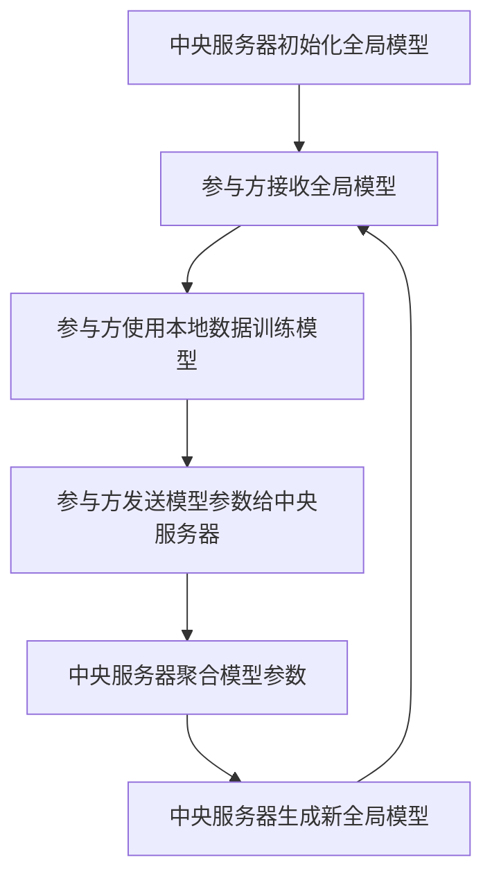

# 企业AI Agent的联邦学习性能优化策略

> 关键词：企业AI Agent、联邦学习、性能优化、数据隐私、模型训练

> 摘要：本文聚焦于企业AI Agent的联邦学习性能优化策略。随着企业对数据隐私和安全的重视以及分布式数据处理需求的增长，联邦学习成为一种极具潜力的技术。然而，联邦学习在实际应用中面临着诸多性能挑战。本文将深入探讨联邦学习的核心概念与联系，详细剖析其核心算法原理，借助数学模型和公式进行理论阐述，通过项目实战展示具体的代码实现和分析，介绍其实际应用场景，推荐相关的工具和资源，并对未来发展趋势与挑战进行总结，旨在为企业提供全面且有效的联邦学习性能优化方案。

## 1. 背景介绍 
### 1.1 目的和范围
联邦学习作为一种新兴的机器学习范式，允许在不共享原始数据的情况下进行模型训练，这对于企业保护数据隐私和合规性具有重要意义。本文的目的在于研究和探讨如何优化企业AI Agent在联邦学习过程中的性能，包括提高训练效率、减少通信开销、增强模型准确性等方面。范围涵盖联邦学习的基本原理、核心算法、性能优化策略、实际应用场景以及相关工具和资源推荐等内容。

### 1.2 预期读者
本文预期读者包括企业的技术决策者、AI工程师、数据科学家、机器学习研究人员以及对联邦学习和企业AI Agent感兴趣的技术爱好者。这些读者可以从本文中获取关于联邦学习性能优化的全面知识和实用技术，为实际项目提供指导和参考。

### 1.3 文档结构概述
本文首先介绍联邦学习的背景知识，包括目的、预期读者和文档结构。接着阐述核心概念与联系，包括联邦学习的原理和架构。然后详细讲解核心算法原理和具体操作步骤，结合Python源代码进行说明。随后介绍数学模型和公式，并举例说明。通过项目实战展示代码实际案例和详细解释。之后介绍实际应用场景。再推荐相关的工具和资源。最后总结未来发展趋势与挑战，提供常见问题与解答和扩展阅读参考资料。

### 1.4 术语表
#### 1.4.1 核心术语定义
- **企业AI Agent**：企业环境中具备智能决策和执行能力的软件或硬件实体，可代表企业进行各种任务，如数据处理、模型训练等。
- **联邦学习**：一种分布式机器学习技术，允许多个参与方在不共享原始数据的情况下协作训练模型，通过交换模型参数来实现知识共享。
- **性能优化**：通过各种技术和策略提高系统或算法的性能，如提高训练速度、降低通信开销、增强模型准确性等。
- **数据隐私**：保护数据不被未经授权的访问、使用或泄露，确保数据的安全性和保密性。
- **模型训练**：通过使用数据和算法来调整模型的参数，使模型能够对未知数据进行准确预测的过程。

#### 1.4.2 相关概念解释
- **分布式系统**：由多个独立的计算节点组成的系统，这些节点通过网络进行通信和协作，共同完成任务。
- **机器学习**：一门多领域交叉学科，涉及概率论、统计学、逼近论、凸分析、算法复杂度理论等多门学科。它专门研究计算机怎样模拟或实现人类的学习行为，以获取新的知识或技能，重新组织已有的知识结构使之不断改善自身的性能。
- **加密技术**：一种通过数学算法将数据转换为密文的技术，只有授权的用户才能解密和访问数据，用于保护数据的隐私和安全。

#### 1.4.3 缩略词列表
- **FL**：Federated Learning（联邦学习）
- **AI**：Artificial Intelligence（人工智能）
- **ML**：Machine Learning（机器学习）
- **SGD**：Stochastic Gradient Descent（随机梯度下降）

## 2. 核心概念与联系 
### 2.1 联邦学习的基本原理
联邦学习的基本思想是在多个参与方（如企业的不同部门、不同企业等）之间进行协作模型训练，而不直接共享原始数据。每个参与方在本地使用自己的数据进行模型训练，然后将训练得到的模型参数（如梯度）发送给中央服务器。中央服务器对这些参数进行聚合，得到一个全局模型，并将全局模型发送回各个参与方。参与方使用全局模型更新自己的本地模型，然后继续进行下一轮的训练。这个过程不断重复，直到模型收敛。

### 2.2 联邦学习的架构
联邦学习的架构主要包括以下几个部分：
- **参与方**：拥有本地数据并进行本地模型训练的实体，可以是企业的不同部门、不同企业、移动设备等。
- **中央服务器**：负责接收参与方发送的模型参数，进行聚合操作，生成全局模型，并将全局模型发送回参与方。
- **通信网络**：用于参与方和中央服务器之间的数据传输，确保模型参数的安全和高效传输。

### 2.3 联邦学习与企业AI Agent的联系
企业AI Agent可以作为联邦学习的参与方，利用自身的本地数据进行模型训练。通过联邦学习，企业AI Agent可以在不泄露本地数据的情况下，与其他参与方协作训练更强大的模型，提高自身的智能决策能力。同时，联邦学习的性能优化策略也可以应用于企业AI Agent，提高其在联邦学习过程中的效率和准确性。

### 2.4 文本示意图
联邦学习的基本流程可以用以下文本描述：
1. 中央服务器初始化全局模型。
2. 参与方接收全局模型。
3. 参与方使用本地数据对全局模型进行训练。
4. 参与方将训练得到的模型参数发送给中央服务器。
5. 中央服务器对模型参数进行聚合，得到新的全局模型。
6. 中央服务器将新的全局模型发送回参与方。
7. 重复步骤3 - 6，直到模型收敛。

### 2.5 Mermaid流程图


## 3. 核心算法原理 & 具体操作步骤 
### 3.1 联邦平均算法（Federated Averaging, FedAvg）原理
联邦平均算法是联邦学习中最常用的算法之一。其基本思想是在每个参与方本地进行多次迭代训练，然后将训练得到的模型参数发送给中央服务器。中央服务器对这些参数进行加权平均，得到全局模型的更新。

### 3.2 具体操作步骤
1. **初始化**：中央服务器初始化全局模型的参数 $\theta_0$。
2. **本地训练**：对于每一轮迭代 $t$，中央服务器选择一部分参与方 $S_t$，将全局模型参数 $\theta_t$ 发送给这些参与方。每个参与方 $k \in S_t$ 在本地使用自己的数据进行 $E$ 次迭代训练，得到本地模型参数 $\theta_{k,t+1}$。
3. **参数聚合**：中央服务器收集参与方发送的本地模型参数 $\theta_{k,t+1}$，并根据参与方的数据量 $n_k$ 进行加权平均，得到新的全局模型参数 $\theta_{t+1}$：
   $$\theta_{t+1} = \sum_{k \in S_t} \frac{n_k}{n} \theta_{k,t+1}$$
   其中 $n = \sum_{k \in S_t} n_k$ 是参与方的总数据量。
4. **重复**：重复步骤2 - 3，直到模型收敛。

### 3.3 Python源代码实现
```python
import torch
import torch.nn as nn
import torch.optim as optim
from torch.utils.data import DataLoader, Dataset

# 定义一个简单的神经网络模型
class SimpleNet(nn.Module):
    def __init__(self):
        super(SimpleNet, self).__init__()
        self.fc1 = nn.Linear(10, 20)
        self.fc2 = nn.Linear(20, 1)

    def forward(self, x):
        x = torch.relu(self.fc1(x))
        x = self.fc2(x)
        return x

# 模拟参与方数据
class LocalDataset(Dataset):
    def __init__(self, num_samples):
        self.data = torch.randn(num_samples, 10)
        self.labels = torch.randn(num_samples, 1)

    def __len__(self):
        return len(self.data)

    def __getitem__(self, idx):
        return self.data[idx], self.labels[idx]

# 本地训练函数
def local_train(model, local_data, num_epochs):
    criterion = nn.MSELoss()
    optimizer = optim.SGD(model.parameters(), lr=0.01)
    for epoch in range(num_epochs):
        for data, labels in local_data:
            optimizer.zero_grad()
            outputs = model(data)
            loss = criterion(outputs, labels)
            loss.backward()
            optimizer.step()
    return model.state_dict()

# 联邦平均算法
def federated_averaging(global_model, local_models, data_sizes):
    total_size = sum(data_sizes)
    global_dict = global_model.state_dict()
    for key in global_dict.keys():
        global_dict[key] = torch.zeros_like(global_dict[key])
        for i, local_model in enumerate(local_models):
            global_dict[key] += (data_sizes[i] / total_size) * local_model[key]
    global_model.load_state_dict(global_dict)
    return global_model

# 主函数
if __name__ == '__main__':
    # 初始化全局模型
    global_model = SimpleNet()
    # 模拟参与方数据和数据量
    num_parties = 3
    data_sizes = [100, 200, 300]
    local_datasets = [LocalDataset(size) for size in data_sizes]
    local_dataloaders = [DataLoader(dataset, batch_size=10, shuffle=True) for dataset in local_datasets]
    num_rounds = 10
    num_epochs = 5
    for round in range(num_rounds):
        local_models = []
        for i in range(num_parties):
            local_model = SimpleNet()
            local_model.load_state_dict(global_model.state_dict())
            local_params = local_train(local_model, local_dataloaders[i], num_epochs)
            local_models.append(local_params)
        global_model = federated_averaging(global_model, local_models, data_sizes)
    print("Training finished.")
```

## 4. 数学模型和公式 & 详细讲解 & 举例说明 
### 4.1 联邦平均算法的数学模型
联邦平均算法的目标是最小化全局损失函数 $L(\theta)$，其中 $\theta$ 是全局模型的参数。在每一轮迭代中，参与方 $k$ 在本地使用自己的数据 $D_k$ 进行训练，最小化本地损失函数 $L_k(\theta)$。

本地损失函数可以表示为：
$$L_k(\theta) = \frac{1}{|D_k|} \sum_{(x,y) \in D_k} \ell(f(x; \theta), y)$$
其中 $|D_k|$ 是参与方 $k$ 的数据量，$\ell$ 是损失函数，$f(x; \theta)$ 是模型的预测值，$y$ 是真实标签。

中央服务器通过加权平均的方式聚合参与方的本地模型参数，得到全局模型的更新。全局损失函数的更新可以表示为：
$$\theta_{t+1} = \arg\min_{\theta} \sum_{k \in S_t} \frac{n_k}{n} L_k(\theta)$$

### 4.2 详细讲解
- **本地训练**：参与方在本地使用随机梯度下降（SGD）等优化算法对本地损失函数进行优化，得到本地模型参数的更新。
- **参数聚合**：中央服务器根据参与方的数据量对本地模型参数进行加权平均，确保数据量较大的参与方对全局模型的更新贡献更大。

### 4.3 举例说明
假设我们有两个参与方 $A$ 和 $B$，数据量分别为 $n_A = 100$ 和 $n_B = 200$。在某一轮迭代中，参与方 $A$ 的本地模型参数为 $\theta_A$，参与方 $B$ 的本地模型参数为 $\theta_B$。中央服务器进行参数聚合时，全局模型参数的更新为：
$$\theta_{new} = \frac{100}{100 + 200} \theta_A + \frac{200}{100 + 200} \theta_B$$

## 5. 项目实战：代码实际案例和详细解释说明 
### 5.1  开发环境搭建
- **操作系统**：推荐使用 Linux 或 macOS 系统，也可以使用 Windows 系统。
- **编程语言**：Python 3.7 及以上版本。
- **深度学习框架**：PyTorch 1.7 及以上版本。
- **其他依赖库**：`numpy`、`torchvision` 等。

可以使用以下命令安装 PyTorch：
```bash
pip install torch torchvision
```

### 5.2  源代码详细实现和代码解读
```python
import torch
import torch.nn as nn
import torch.optim as optim
from torch.utils.data import DataLoader, Dataset

# 定义一个简单的神经网络模型
class SimpleNet(nn.Module):
    def __init__(self):
        super(SimpleNet, self).__init__()
        self.fc1 = nn.Linear(10, 20)
        self.fc2 = nn.Linear(20, 1)

    def forward(self, x):
        x = torch.relu(self.fc1(x))
        x = self.fc2(x)
        return x

# 模拟参与方数据
class LocalDataset(Dataset):
    def __init__(self, num_samples):
        self.data = torch.randn(num_samples, 10)
        self.labels = torch.randn(num_samples, 1)

    def __len__(self):
        return len(self.data)

    def __getitem__(self, idx):
        return self.data[idx], self.labels[idx]

# 本地训练函数
def local_train(model, local_data, num_epochs):
    criterion = nn.MSELoss()
    optimizer = optim.SGD(model.parameters(), lr=0.01)
    for epoch in range(num_epochs):
        for data, labels in local_data:
            optimizer.zero_grad()
            outputs = model(data)
            loss = criterion(outputs, labels)
            loss.backward()
            optimizer.step()
    return model.state_dict()

# 联邦平均算法
def federated_averaging(global_model, local_models, data_sizes):
    total_size = sum(data_sizes)
    global_dict = global_model.state_dict()
    for key in global_dict.keys():
        global_dict[key] = torch.zeros_like(global_dict[key])
        for i, local_model in enumerate(local_models):
            global_dict[key] += (data_sizes[i] / total_size) * local_model[key]
    global_model.load_state_dict(global_dict)
    return global_model

# 主函数
if __name__ == '__main__':
    # 初始化全局模型
    global_model = SimpleNet()
    # 模拟参与方数据和数据量
    num_parties = 3
    data_sizes = [100, 200, 300]
    local_datasets = [LocalDataset(size) for size in data_sizes]
    local_dataloaders = [DataLoader(dataset, batch_size=10, shuffle=True) for dataset in local_datasets]
    num_rounds = 10
    num_epochs = 5
    for round in range(num_rounds):
        local_models = []
        for i in range(num_parties):
            local_model = SimpleNet()
            local_model.load_state_dict(global_model.state_dict())
            local_params = local_train(local_model, local_dataloaders[i], num_epochs)
            local_models.append(local_params)
        global_model = federated_averaging(global_model, local_models, data_sizes)
    print("Training finished.")
```

### 5.3  代码解读与分析
- **模型定义**：`SimpleNet` 类定义了一个简单的两层神经网络模型，包含一个输入层、一个隐藏层和一个输出层。
- **数据模拟**：`LocalDataset` 类模拟了参与方的本地数据，每个参与方的数据是随机生成的。
- **本地训练**：`local_train` 函数在本地使用随机梯度下降算法对模型进行训练，返回训练后的模型参数。
- **联邦平均**：`federated_averaging` 函数根据参与方的数据量对本地模型参数进行加权平均，更新全局模型的参数。
- **主函数**：在主函数中，我们初始化全局模型，模拟参与方数据，进行多轮联邦学习训练，直到训练完成。

## 6. 实际应用场景 
### 6.1 金融行业
在金融行业，不同银行或金融机构可能拥有大量的客户数据，但由于数据隐私和合规性要求，不能直接共享这些数据。通过联邦学习，这些机构可以在不共享原始数据的情况下协作训练风险评估模型、欺诈检测模型等，提高模型的准确性和泛化能力。

### 6.2 医疗行业
医疗数据包含患者的敏感信息，如病历、诊断结果等，需要严格保护数据隐私。医院或医疗研究机构可以利用联邦学习技术，在不泄露患者数据的情况下协作训练疾病诊断模型、药物研发模型等，加速医疗研究和创新。

### 6.3 智能交通
在智能交通领域，不同的交通管理部门、车辆制造商和出行服务提供商拥有各自的交通数据。通过联邦学习，这些参与方可以协作训练交通流量预测模型、自动驾驶模型等，提高交通效率和安全性。

### 6.4 工业互联网
在工业互联网中，不同的工厂或企业拥有各自的生产数据。通过联邦学习，这些企业可以在不共享原始数据的情况下协作训练设备故障预测模型、质量控制模型等，提高生产效率和产品质量。

## 7. 工具和资源推荐
### 7.1 学习资源推荐
#### 7.1.1 书籍推荐
- 《联邦学习》：全面介绍了联邦学习的原理、算法、应用和发展趋势，是学习联邦学习的权威书籍。
- 《深度学习》：深度学习领域的经典教材，介绍了深度学习的基本原理、算法和应用，为学习联邦学习提供了基础知识。

#### 7.1.2 在线课程
- Coursera 上的“Federated Learning for Privacy-Preserving AI”：由知名专家授课，系统介绍了联邦学习的原理、算法和应用。
- edX 上的“Introduction to Machine Learning”：机器学习的入门课程，为学习联邦学习打下基础。

#### 7.1.3 技术博客和网站
- FedML 官方博客：提供了联邦学习的最新技术动态、研究成果和应用案例。
- Towards Data Science：数据科学领域的知名博客，有很多关于联邦学习的技术文章。

### 7.2 开发工具框架推荐
#### 7.2.1 IDE和编辑器
- PyCharm：功能强大的 Python 集成开发环境，提供了代码编辑、调试、版本控制等功能。
- Visual Studio Code：轻量级的代码编辑器，支持多种编程语言和插件，适合快速开发和调试。

#### 7.2.2 调试和性能分析工具
- TensorBoard：用于可视化深度学习模型的训练过程和性能指标，帮助开发者调试和优化模型。
- PyTorch Profiler：PyTorch 提供的性能分析工具，用于分析模型的运行时间、内存使用等性能指标。

#### 7.2.3 相关框架和库
- Flower：一个开源的联邦学习框架，提供了简单易用的 API，支持多种深度学习框架。
- TensorFlow Federated：Google 开发的联邦学习框架，与 TensorFlow 深度集成，提供了丰富的联邦学习算法和工具。

### 7.3 相关论文著作推荐
#### 7.3.1 经典论文
- 《Communication-Efficient Learning of Deep Networks from Decentralized Data》：首次提出了联邦平均算法，是联邦学习领域的经典论文。
- 《Federated Learning: Challenges, Methods, and Future Directions》：全面介绍了联邦学习的挑战、方法和未来发展方向，是联邦学习领域的重要综述论文。

#### 7.3.2 最新研究成果
- 关注顶级学术会议如 NeurIPS、ICML、CVPR 等上的联邦学习相关论文，了解最新的研究成果和技术趋势。

#### 7.3.3 应用案例分析
- 一些企业和研究机构发布的联邦学习应用案例，如金融行业的风险评估、医疗行业的疾病诊断等，可从中学习实际应用中的经验和技巧。

## 8. 总结：未来发展趋势与挑战
### 8.1 未来发展趋势
- **多模态联邦学习**：结合图像、文本、语音等多模态数据进行联邦学习，提高模型的表达能力和泛化能力。
- **联邦强化学习**：将联邦学习与强化学习相结合，实现多智能体的协作学习，应用于智能交通、机器人控制等领域。
- **边缘联邦学习**：将联邦学习与边缘计算相结合，减少数据传输和延迟，提高系统的效率和响应速度。

### 8.2 挑战
- **通信开销**：联邦学习中需要频繁地在参与方和中央服务器之间传输模型参数，通信开销较大。如何降低通信开销是一个重要的挑战。
- **数据异构性**：不同参与方的数据可能具有不同的分布和特征，导致模型训练的收敛速度慢和准确性低。如何处理数据异构性是联邦学习面临的另一个挑战。
- **安全和隐私**：虽然联邦学习本身具有一定的隐私保护机制，但仍然存在安全风险，如模型参数泄露、恶意攻击等。如何进一步提高联邦学习的安全和隐私性能是一个亟待解决的问题。

## 9. 附录：常见问题与解答
### 9.1 联邦学习与传统机器学习有什么区别？
传统机器学习通常需要将所有数据集中到一个中心节点进行训练，而联邦学习允许在不共享原始数据的情况下进行模型训练，通过交换模型参数来实现知识共享，更注重数据隐私和安全。

### 9.2 联邦学习的性能优化有哪些方法？
联邦学习的性能优化方法包括减少通信开销（如使用模型压缩、异步通信等）、处理数据异构性（如使用自适应学习率、数据预处理等）、提高模型准确性（如使用集成学习、模型融合等）。

### 9.3 联邦学习在实际应用中面临哪些挑战？
联邦学习在实际应用中面临的挑战包括通信开销大、数据异构性、安全和隐私问题、参与方之间的协调和信任等。

## 10. 扩展阅读 & 参考资料
- 《Federated Machine Learning: Concept and Applications》
- 《Advances and Open Problems in Federated Learning》
- FedML 官方文档：https://fedml.ai/docs/
- TensorFlow Federated 官方文档：https://www.tensorflow.org/federated

通过以上内容，我们对企业AI Agent的联邦学习性能优化策略进行了全面的探讨，希望能为相关领域的研究和实践提供有价值的参考。