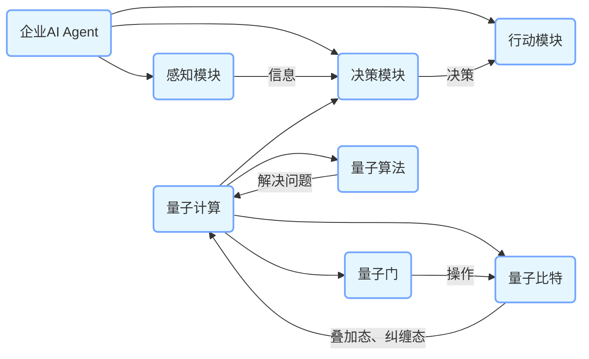

# 企业AI Agent的量子计算应用

> 关键词：企业AI Agent、量子计算、应用场景、算法原理、发展趋势

> 摘要：本文围绕企业AI Agent的量子计算应用展开，深入探讨了企业AI Agent和量子计算的核心概念及其联系，详细阐述了相关算法原理、数学模型与公式。通过项目实战展示了具体的代码实现和解读，分析了实际应用场景。同时推荐了学习资源、开发工具框架以及相关论文著作。最后总结了未来发展趋势与挑战，并对常见问题进行了解答，旨在为企业在AI Agent与量子计算结合的应用方面提供全面且深入的参考。

## 1. 背景介绍 
### 1.1 目的和范围
随着人工智能和量子计算技术的飞速发展，企业AI Agent与量子计算的结合成为了一个极具潜力的研究和应用领域。本文的目的在于全面深入地探讨企业AI Agent的量子计算应用，包括其原理、算法、实际应用场景等方面。范围涵盖了从基本概念的介绍到具体项目实战的分析，以及对未来发展趋势的展望，旨在为企业和相关技术人员提供一个系统的知识体系和实践指导。

### 1.2 预期读者
本文预期读者包括企业管理人员、技术研发人员、对人工智能和量子计算领域感兴趣的科研人员以及相关专业的学生。对于企业管理人员，本文可以帮助他们了解量子计算在企业AI Agent中的应用价值和潜在收益，为企业的战略决策提供参考；对于技术研发人员，文中详细的算法原理、代码实现和应用案例可以为他们的研发工作提供技术支持和创新思路；对于科研人员和学生，本文可以作为学习和研究该领域的重要参考资料。

### 1.3 文档结构概述
本文共分为十个部分。第一部分为背景介绍，阐述了文章的目的、范围、预期读者和文档结构概述，并对相关术语进行了解释。第二部分介绍了企业AI Agent和量子计算的核心概念及其联系，通过文本示意图和Mermaid流程图进行说明。第三部分详细讲解了核心算法原理，并给出了Python源代码示例。第四部分介绍了数学模型和公式，并进行详细讲解和举例说明。第五部分通过项目实战展示了代码的实际案例和详细解释说明。第六部分分析了实际应用场景。第七部分推荐了学习资源、开发工具框架以及相关论文著作。第八部分总结了未来发展趋势与挑战。第九部分为附录，解答了常见问题。第十部分提供了扩展阅读和参考资料。

### 1.4 术语表
#### 1.4.1 核心术语定义
- **企业AI Agent**：指在企业环境中运行的人工智能代理，它能够感知环境信息，根据预设的目标和规则进行决策和行动，以实现企业的特定业务目标。
- **量子计算**：基于量子力学原理的计算方式，利用量子比特的叠加和纠缠等特性，能够在某些问题上实现比经典计算更快的计算速度和更高的计算效率。
- **量子比特（Qubit）**：量子计算中的基本信息单元，与经典比特（0或1）不同，量子比特可以处于0和1的叠加态。
- **叠加态**：量子比特的一种状态，它可以同时处于0和1的多种组合状态，使得量子计算能够并行处理大量信息。
- **纠缠态**：多个量子比特之间存在的一种特殊关联状态，一个量子比特的状态变化会瞬间影响其他纠缠量子比特的状态。

#### 1.4.2 相关概念解释
- **量子门**：类似于经典计算中的逻辑门，用于对量子比特进行操作，改变其状态。常见的量子门有单比特门（如Pauli门、Hadamard门等）和多比特门（如CNOT门等）。
- **量子算法**：基于量子计算原理设计的算法，利用量子比特的特性来解决特定问题，如Shor算法用于大数分解，Grover算法用于搜索问题。
- **AI Agent架构**：企业AI Agent的系统结构，包括感知模块、决策模块、行动模块等，用于实现Agent的智能行为。

#### 1.4.3 缩略词列表
- **AI**：Artificial Intelligence（人工智能）
- **QPU**：Quantum Processing Unit（量子处理单元）
- **IBM Q**：IBM Quantum（IBM的量子计算平台）

## 2. 核心概念与联系 

### 企业AI Agent的核心概念
企业AI Agent是一种智能化的软件实体，它在企业的业务环境中运行，通过感知环境信息，运用自身的知识和算法进行决策，并采取相应的行动来实现企业的目标。其架构通常包括以下几个部分：
- **感知模块**：负责收集企业内外的各种信息，如市场数据、客户反馈、生产状态等。
- **决策模块**：根据感知到的信息和预设的目标，运用人工智能算法进行推理和决策，选择最优的行动方案。
- **行动模块**：根据决策结果，执行相应的任务，如发送指令、调整生产计划、与客户沟通等。

### 量子计算的核心概念
量子计算基于量子力学原理，利用量子比特的独特性质进行计算。量子比特可以处于0和1的叠加态，这意味着一个量子比特可以同时表示0和1，多个量子比特的叠加态可以表示更多的信息。此外，量子比特之间还可以存在纠缠态，使得它们的状态相互关联。量子计算通过量子门对量子比特进行操作，实现信息的处理和计算。

### 两者的联系
企业AI Agent在处理复杂的决策和优化问题时，往往需要大量的计算资源和时间。量子计算的强大计算能力可以为企业AI Agent提供更高效的计算支持，加速决策过程，提高决策的准确性。例如，在企业的供应链优化、风险管理等问题中，量子计算可以快速搜索和分析大量的数据，为AI Agent提供更优的解决方案。

### 文本示意图
```plaintext
企业AI Agent
|-- 感知模块
|   |-- 收集企业内外信息
|-- 决策模块
|   |-- 运用AI算法推理决策
|   |-- 借助量子计算加速计算
|-- 行动模块
|   |-- 执行决策任务

量子计算
|-- 量子比特
|   |-- 叠加态
|   |-- 纠缠态
|-- 量子门
|   |-- 操作量子比特
|-- 量子算法
|   |-- 解决特定问题
```

### Mermaid流程图


## 3. 核心算法原理 & 具体操作步骤 

### 量子算法原理
在企业AI Agent的量子计算应用中，常用的量子算法有Grover算法和Shor算法。

#### Grover算法原理
Grover算法是一种用于搜索未排序数据库的量子算法，其核心思想是通过量子叠加和量子相位反转操作，提高目标元素的概率振幅，从而在更少的步骤内找到目标元素。

Python源代码示例：
```python
import numpy as np
from qiskit import QuantumCircuit, Aer, execute

# 定义数据库大小
N = 4
# 目标元素的索引
target = 2

# 计算量子比特数
n = int(np.log2(N))

# 创建量子电路
qc = QuantumCircuit(n)

# 初始化所有量子比特为叠加态
for qubit in range(n):
    qc.h(qubit)

# 定义Oracle函数
def oracle(qc, target):
    target_binary = format(target, 'b').zfill(n)
    for qubit in range(n):
        if target_binary[qubit] == '0':
            qc.x(qubit)
    qc.mct(list(range(n - 1)), n - 1)
    for qubit in range(n):
        if target_binary[qubit] == '0':
            qc.x(qubit)
    return qc

# 定义扩散算子
def diffusion_operator(qc):
    for qubit in range(n):
        qc.h(qubit)
        qc.x(qubit)
    qc.mct(list(range(n - 1)), n - 1)
    for qubit in range(n):
        qc.x(qubit)
        qc.h(qubit)
    return qc

# 迭代Grover算法
iterations = int(np.floor(np.pi / 4 * np.sqrt(N)))
for _ in range(iterations):
    qc = oracle(qc, target)
    qc = diffusion_operator(qc)

# 测量量子比特
qc.measure_all()

# 模拟量子电路
backend = Aer.get_backend('qasm_simulator')
job = execute(qc, backend, shots=1024)
result = job.result()
counts = result.get_counts(qc)

print("测量结果:", counts)
```

#### 具体操作步骤
1. **初始化量子比特**：将所有量子比特初始化为叠加态，使得它们可以同时表示所有可能的状态。
2. **应用Oracle函数**：Oracle函数用于标记目标元素，通过相位反转操作，将目标元素的相位反转，从而改变其概率振幅。
3. **应用扩散算子**：扩散算子用于放大目标元素的概率振幅，同时减小其他元素的概率振幅。
4. **迭代操作**：重复应用Oracle函数和扩散算子，直到目标元素的概率振幅足够大。
5. **测量量子比特**：对量子比特进行测量，得到最终的结果。

### Shor算法原理
Shor算法是一种用于大数分解的量子算法，其核心思想是利用量子傅里叶变换和数论中的一些定理，将大数分解问题转化为周期查找问题，从而在量子计算机上实现高效的分解。

Python源代码示例：
```python
from qiskit.algorithms.factorizers import Shor
from qiskit.utils import QuantumInstance
from qiskit import Aer

# 定义要分解的大数
N = 15

# 创建量子实例
quantum_instance = QuantumInstance(Aer.get_backend('qasm_simulator'), shots=1024)

# 创建Shor算法实例
shor = Shor(quantum_instance=quantum_instance)

# 执行Shor算法
result = shor.factor(N)

print("分解结果:", result.factors)
```

#### 具体操作步骤
1. **选择随机数**：选择一个小于要分解的大数 $N$ 的随机数 $a$。
2. **计算周期**：利用量子傅里叶变换计算函数 $f(x) = a^x \mod N$ 的周期 $r$。
3. **判断条件**：如果 $r$ 是偶数且 $a^{r/2} \not\equiv -1 \mod N$，则可以计算 $p = \gcd(a^{r/2} + 1, N)$ 和 $q = \gcd(a^{r/2} - 1, N)$，得到 $N$ 的两个因子。
4. **重复操作**：如果不满足条件，则重新选择随机数 $a$，重复上述步骤。

## 4. 数学模型和公式 & 详细讲解 & 举例说明 

### Grover算法的数学模型和公式
#### 量子态表示
在Grover算法中，$n$ 个量子比特的量子态可以表示为：
$$|\psi\rangle = \sum_{x = 0}^{2^n - 1} \alpha_x |x\rangle$$
其中，$\alpha_x$ 是量子态 $|x\rangle$ 的概率振幅，满足 $\sum_{x = 0}^{2^n - 1} |\alpha_x|^2 = 1$。

#### Oracle函数
Oracle函数 $U_f$ 对量子态的作用可以表示为：
$$U_f |x\rangle = (-1)^{f(x)} |x\rangle$$
其中，$f(x)$ 是一个布尔函数，当 $x$ 是目标元素时，$f(x) = 1$，否则 $f(x) = 0$。

#### 扩散算子
扩散算子 $U_s$ 可以表示为：
$$U_s = 2 |s\rangle \langle s| - I$$
其中，$|s\rangle = \frac{1}{\sqrt{2^n}} \sum_{x = 0}^{2^n - 1} |x\rangle$ 是所有量子态的等权重叠加态，$I$ 是单位矩阵。

#### 迭代公式
经过一次迭代后，量子态的变化可以表示为：
$$|\psi_{k + 1}\rangle = U_s U_f |\psi_k\rangle$$
其中，$|\psi_k\rangle$ 是第 $k$ 次迭代后的量子态。

#### 举例说明
假设数据库大小 $N = 4$，目标元素的索引 $x_0 = 2$。初始量子态为：
$$|\psi_0\rangle = \frac{1}{2} (|0\rangle + |1\rangle + |2\rangle + |3\rangle)$$
Oracle函数对量子态的作用为：
$$U_f |\psi_0\rangle = \frac{1}{2} (|0\rangle + |1\rangle - |2\rangle + |3\rangle)$$
扩散算子对量子态的作用为：
$$U_s U_f |\psi_0\rangle = \frac{1}{\sqrt{2}} (-|0\rangle - |1\rangle + |2\rangle - |3\rangle)$$
经过多次迭代后，目标元素 $|2\rangle$ 的概率振幅会逐渐增大。

### Shor算法的数学模型和公式
#### 周期查找问题
Shor算法的核心是解决周期查找问题，即找到函数 $f(x) = a^x \mod N$ 的最小正周期 $r$。

#### 量子傅里叶变换（QFT）
量子傅里叶变换是Shor算法中的关键步骤，其对量子态的作用可以表示为：
$$\text{QFT} |x\rangle = \frac{1}{\sqrt{M}} \sum_{y = 0}^{M - 1} e^{2\pi i \frac{xy}{M}} |y\rangle$$
其中，$M$ 是量子寄存器的大小。

#### 数论定理
根据数论中的定理，如果 $r$ 是偶数且 $a^{r/2} \not\equiv -1 \mod N$，则可以计算 $p = \gcd(a^{r/2} + 1, N)$ 和 $q = \gcd(a^{r/2} - 1, N)$，得到 $N$ 的两个因子。

#### 举例说明
假设要分解的大数 $N = 15$，选择随机数 $a = 2$。计算函数 $f(x) = 2^x \mod 15$ 的值：
$$f(0) = 1, f(1) = 2, f(2) = 4, f(3) = 8, f(4) = 1$$
可以得到周期 $r = 4$。计算 $a^{r/2} = 2^2 = 4$，$4 \not\equiv -1 \mod 15$。计算 $p = \gcd(4 + 1, 15) = 5$ 和 $q = \gcd(4 - 1, 15) = 3$，得到 $15 = 3 \times 5$。

## 5. 项目实战：代码实际案例和详细解释说明 

### 5.1  开发环境搭建
#### 安装Python
首先，需要安装Python环境。可以从Python官方网站（https://www.python.org/downloads/） 下载适合自己操作系统的Python安装包，并按照安装向导进行安装。

#### 安装Qiskit
Qiskit是一个开源的量子计算框架，用于开发和模拟量子算法。可以使用以下命令安装Qiskit：
```sh
pip install qiskit
```

#### 安装其他依赖库
根据具体的项目需求，可能还需要安装其他依赖库，如NumPy、Matplotlib等。可以使用以下命令安装：
```sh
pip install numpy matplotlib
```

### 5.2  源代码详细实现和代码解读
#### 企业AI Agent的量子优化决策案例
以下是一个简单的企业AI Agent的量子优化决策案例，假设企业需要在多个项目中选择最优的投资方案。

```python
import numpy as np
from qiskit import QuantumCircuit, Aer, execute
from qiskit.visualization import plot_histogram
import matplotlib.pyplot as plt

# 定义项目数量
num_projects = 3

# 定义每个项目的收益和成本
profits = [10, 20, 15]
costs = [5, 8, 6]

# 定义企业的预算
budget = 12

# 计算量子比特数
n = num_projects

# 创建量子电路
qc = QuantumCircuit(n)

# 初始化所有量子比特为叠加态
for qubit in range(n):
    qc.h(qubit)

# 定义Oracle函数
def oracle(qc, profits, costs, budget):
    num_states = 2 ** n
    for state in range(num_states):
        binary_state = format(state, 'b').zfill(n)
        total_cost = 0
        total_profit = 0
        for qubit in range(n):
            if binary_state[qubit] == '1':
                total_cost += costs[qubit]
                total_profit += profits[qubit]
        if total_cost <= budget:
            for qubit in range(n):
                if binary_state[qubit] == '0':
                    qc.x(qubit)
            qc.mct(list(range(n - 1)), n - 1)
            for qubit in range(n):
                if binary_state[qubit] == '0':
                    qc.x(qubit)
    return qc

# 定义扩散算子
def diffusion_operator(qc):
    for qubit in range(n):
        qc.h(qubit)
        qc.x(qubit)
    qc.mct(list(range(n - 1)), n - 1)
    for qubit in range(n):
        qc.x(qubit)
        qc.h(qubit)
    return qc

# 迭代Grover算法
iterations = int(np.floor(np.pi / 4 * np.sqrt(2 ** n)))
for _ in range(iterations):
    qc = oracle(qc, profits, costs, budget)
    qc = diffusion_operator(qc)

# 测量量子比特
qc.measure_all()

# 模拟量子电路
backend = Aer.get_backend('qasm_simulator')
job = execute(qc, backend, shots=1024)
result = job.result()
counts = result.get_counts(qc)

# 找到最优方案
max_profit = 0
optimal_solution = None
for state, count in counts.items():
    binary_state = state[::-1]
    total_cost = 0
    total_profit = 0
    for qubit in range(n):
        if binary_state[qubit] == '1':
            total_cost += costs[qubit]
            total_profit += profits[qubit]
    if total_cost <= budget and total_profit > max_profit:
        max_profit = total_profit
        optimal_solution = binary_state

print("最优方案:", optimal_solution)
print("最大收益:", max_profit)

# 绘制测量结果直方图
plot_histogram(counts)
plt.show()
```

#### 代码解读
1. **初始化部分**：定义了项目数量、每个项目的收益和成本、企业的预算，并计算了量子比特数。创建了一个量子电路，并将所有量子比特初始化为叠加态。
2. **Oracle函数**：遍历所有可能的状态，计算每个状态的总成本和总收益。如果总成本不超过预算，则对该状态进行相位反转操作。
3. **扩散算子**：用于放大满足条件的状态的概率振幅。
4. **迭代操作**：重复应用Oracle函数和扩散算子，直到满足条件的状态的概率振幅足够大。
5. **测量和结果分析**：对量子比特进行测量，得到所有可能状态的测量结果。遍历测量结果，找到总成本不超过预算且总收益最大的方案。

### 5.3  代码解读与分析
#### 复杂度分析
该算法的时间复杂度主要取决于Grover算法的迭代次数，为 $O(\sqrt{2^n})$，其中 $n$ 是量子比特数。空间复杂度主要取决于量子电路的规模，为 $O(n)$。

#### 局限性
该算法是基于模拟的量子计算，在实际的量子计算机上运行时，可能会受到量子比特的噪声和退相干等问题的影响。此外，该算法的可扩展性也有限，当项目数量增加时，量子比特数也会相应增加，导致算法的复杂度和资源需求急剧增加。

## 6. 实际应用场景 
### 供应链优化
在企业的供应链管理中，涉及到多个环节的决策和优化问题，如供应商选择、库存管理、物流配送等。量子计算可以帮助企业AI Agent快速搜索和分析大量的供应链数据，找到最优的供应链方案，降低成本，提高效率。例如，通过量子算法可以在短时间内找到最优的供应商组合，使得采购成本最低，同时满足企业的生产需求。

### 风险管理
企业在运营过程中面临着各种风险，如市场风险、信用风险、操作风险等。量子计算可以帮助企业AI Agent更准确地评估和预测风险，制定相应的风险管理策略。例如，通过量子算法可以对大量的市场数据进行分析，预测市场趋势，帮助企业及时调整投资策略，降低市场风险。

### 产品研发
在产品研发过程中，企业需要进行大量的实验和模拟，以优化产品的性能和质量。量子计算可以加速这些实验和模拟的过程，帮助企业更快地找到最优的产品设计方案。例如，在药物研发中，量子计算可以模拟分子的结构和相互作用，帮助科学家更快地筛选出潜在的药物分子，提高研发效率。

### 客户关系管理
企业需要了解客户的需求和偏好，以便提供个性化的产品和服务，提高客户满意度和忠诚度。量子计算可以帮助企业AI Agent分析大量的客户数据，挖掘客户的潜在需求和行为模式。例如，通过量子算法可以对客户的购买历史、浏览记录等数据进行分析，为客户提供个性化的推荐和营销方案。

## 7. 工具和资源推荐
### 7.1 学习资源推荐
#### 7.1.1 书籍推荐
- 《量子计算与量子信息》（Quantum Computation and Quantum Information）：由Michael A. Nielsen和Isaac L. Chuang所著，是量子计算领域的经典教材，全面介绍了量子计算的基本原理、算法和应用。
- 《Python量子计算实战》（Programming Quantum Computers）：由Eric R. Johnston、Nicolas P. Rubin和Merlin J. P. Ryan所著，通过Python代码示例介绍了量子计算的基本概念和编程方法。
- 《人工智能：一种现代的方法》（Artificial Intelligence: A Modern Approach）：由Stuart J. Russell和Peter Norvig所著，是人工智能领域的经典教材，介绍了人工智能的基本概念、算法和应用。

#### 7.1.2 在线课程
- Coursera上的“量子计算基础”（Fundamentals of Quantum Computation）课程：由University of Colorado Boulder提供，介绍了量子计算的基本原理和算法。
- edX上的“人工智能基础”（Introduction to Artificial Intelligence）课程：由Columbia University提供，介绍了人工智能的基本概念和算法。
- Qiskit官方教程：提供了丰富的量子计算编程教程和示例代码，帮助学习者快速上手。

#### 7.1.3 技术博客和网站
- Quantum Computing Report：提供了量子计算领域的最新技术、研究成果和行业动态。
- Medium上的量子计算相关博客：有许多量子计算领域的专家和爱好者分享他们的研究成果和经验。
- AI Trends：提供了人工智能领域的最新技术、研究成果和行业动态。

### 7.2 开发工具框架推荐
#### 7.2.1 IDE和编辑器
- PyCharm：是一款专业的Python集成开发环境，提供了丰富的代码编辑、调试和分析功能，适合开发量子计算和人工智能相关的Python代码。
- Visual Studio Code：是一款轻量级的代码编辑器，支持多种编程语言和插件，可通过安装相关插件来开发量子计算和人工智能代码。

#### 7.2.2 调试和性能分析工具
- Qiskit Aer：是Qiskit框架中的量子模拟工具，可用于模拟量子电路的运行，帮助开发者调试和验证量子算法。
- IBM Quantum Experience：提供了在线的量子计算平台，开发者可以在该平台上运行和测试量子算法，同时还提供了性能分析工具。

#### 7.2.3 相关框架和库
- Qiskit：是一个开源的量子计算框架，提供了丰富的量子算法库、量子电路构建工具和量子模拟工具。
- PennyLane：是一个开源的量子机器学习框架，支持多种量子计算后端，可用于开发量子机器学习算法。
- TensorFlow：是一个开源的机器学习框架，可用于开发人工智能算法，与量子计算结合可以实现量子机器学习。

### 7.3 相关论文著作推荐
#### 7.3.1 经典论文
- “Algorithms for Quantum Computation: Discrete Logarithms and Factoring”（Peter W. Shor）：提出了Shor算法，为大数分解问题提供了量子计算解决方案。
- “A Fast Quantum Mechanical Algorithm for Database Search”（Lov Grover）：提出了Grover算法，为未排序数据库的搜索问题提供了量子计算解决方案。

#### 7.3.2 最新研究成果
- 关注arXiv.org上的量子计算和人工智能相关论文，了解最新的研究进展和技术成果。
- 参加国际量子计算和人工智能领域的学术会议，如IEEE International Conference on Quantum Computing and Engineering（QCE）、Neural Information Processing Systems（NeurIPS）等，获取最新的研究动态。

#### 7.3.3 应用案例分析
- 许多企业和研究机构会发布量子计算和人工智能在实际应用中的案例分析报告，可通过相关企业的官方网站、研究机构的出版物等渠道获取。

## 8. 总结：未来发展趋势与挑战
### 未来发展趋势
- **融合发展**：企业AI Agent与量子计算的融合将越来越深入，量子计算将为企业AI Agent提供更强大的计算支持，使其能够处理更复杂的问题。
- **行业应用拓展**：量子计算在企业的各个行业中的应用将不断拓展，如金融、医疗、能源等领域，为企业带来更大的价值。
- **量子云服务**：量子云服务将逐渐普及，企业可以通过云平台使用量子计算资源，降低量子计算的使用门槛。
- **量子机器学习**：量子机器学习将成为一个重要的研究方向，结合量子计算和机器学习的优势，开发出更高效的算法和模型。

### 挑战
- **技术难题**：量子计算技术还面临着许多技术难题，如量子比特的噪声、退相干等问题，需要进一步的研究和解决。
- **人才短缺**：量子计算和人工智能领域的专业人才短缺，需要加强相关人才的培养和引进。
- **成本高昂**：量子计算设备的研发和维护成本高昂，限制了其在企业中的广泛应用。
- **安全问题**：量子计算的强大计算能力可能会对现有的加密技术构成威胁，需要研究新的安全技术和加密算法。

## 9. 附录：常见问题与解答
### 量子计算与经典计算有什么区别？
量子计算基于量子力学原理，利用量子比特的叠加和纠缠等特性进行计算，能够在某些问题上实现比经典计算更快的计算速度和更高的计算效率。经典计算基于二进制位，每次只能处理一个状态，而量子计算可以同时处理多个状态。

### 企业AI Agent如何利用量子计算进行决策？
企业AI Agent可以将复杂的决策问题转化为量子计算问题，利用量子算法（如Grover算法、Shor算法等）进行快速搜索和分析，找到最优的决策方案。例如，在供应链优化问题中，企业AI Agent可以利用量子算法在短时间内找到最优的供应商组合和物流配送方案。

### 量子计算在企业中的应用面临哪些挑战？
量子计算在企业中的应用面临着技术难题、人才短缺、成本高昂和安全问题等挑战。技术难题包括量子比特的噪声、退相干等问题，需要进一步的研究和解决；人才短缺需要加强相关人才的培养和引进；成本高昂限制了其在企业中的广泛应用；安全问题需要研究新的安全技术和加密算法。

### 如何学习量子计算和企业AI Agent相关知识？
可以通过阅读相关书籍（如《量子计算与量子信息》《人工智能：一种现代的方法》等）、参加在线课程（如Coursera上的“量子计算基础”课程、edX上的“人工智能基础”课程等）、参考技术博客和网站（如Quantum Computing Report、AI Trends等）来学习相关知识。同时，可以通过实践项目，如使用Qiskit框架进行量子算法的开发和模拟，来加深对知识的理解和掌握。

## 10. 扩展阅读 & 参考资料
- Nielsen, M. A., & Chuang, I. L. (2000). Quantum Computation and Quantum Information. Cambridge University Press.
- Johnston, E. R., Rubin, N. P., & Ryan, M. J. P. (2019). Programming Quantum Computers. O'Reilly Media.
- Russell, S. J., & Norvig, P. (2020). Artificial Intelligence: A Modern Approach. Pearson.
- Qiskit官方文档：https://qiskit.org/documentation/
- IBM Quantum Experience：https://quantum-computing.ibm.com/
- arXiv.org：https://arxiv.org/
- IEEE International Conference on Quantum Computing and Engineering（QCE）：https://qce.quantum.ieee.org/
- Neural Information Processing Systems（NeurIPS）：https://neurips.cc/