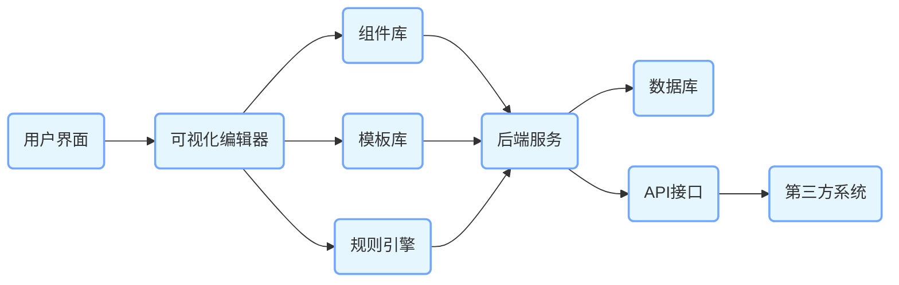

# 低代码平台革命：开发模式的颠覆者

> 关键词：低代码平台、开发模式、颠覆、可视化编程、快速开发

> 摘要：本文深入探讨了低代码平台这一开发模式的颠覆者。首先介绍了低代码平台出现的背景、目的和适用读者群体，对相关术语进行了清晰定义。接着阐述了低代码平台的核心概念、架构以及工作流程，通过 Python 代码详细讲解了其核心算法原理和操作步骤，并结合数学模型和公式进行深入剖析。然后通过项目实战案例，从开发环境搭建到源代码实现与解读，全面展示了低代码平台的实际应用。还列举了低代码平台的常见实际应用场景，推荐了相关的学习资源、开发工具框架和论文著作。最后对低代码平台的未来发展趋势与挑战进行了总结，并提供了常见问题解答和扩展阅读参考资料，旨在帮助读者全面了解低代码平台及其对开发模式带来的变革。

## 1. 背景介绍 
### 1.1 目的和范围
随着数字化时代的加速发展，企业对软件应用的需求呈现出爆发式增长。传统的软件开发模式由于开发周期长、成本高、对专业开发人员依赖大等问题，已经难以满足企业快速响应市场变化的需求。低代码平台应运而生，其目的在于降低软件开发的技术门槛，让非专业开发人员也能参与到软件应用的开发中来，从而实现快速开发和部署。

本文的范围将涵盖低代码平台的核心概念、算法原理、数学模型、实际应用案例等多个方面，旨在全面深入地介绍低代码平台及其对传统开发模式的颠覆作用。

### 1.2 预期读者
本文的预期读者包括企业 IT 管理人员、业务部门负责人、软件开发人员、对数字化转型感兴趣的创业者以及希望了解新兴技术趋势的技术爱好者。对于企业 IT 管理人员和业务部门负责人，本文将帮助他们了解低代码平台如何助力企业快速实现业务需求，提高企业的竞争力；对于软件开发人员，本文将深入剖析低代码平台的技术原理和实现方式，为他们在低代码开发领域的实践提供参考；对于创业者和技术爱好者，本文将展示低代码平台带来的创新机遇和发展趋势。

### 1.3 文档结构概述
本文将按照以下结构进行阐述：首先介绍低代码平台的背景信息，包括目的、预期读者和文档结构概述，以及相关术语的定义；接着深入探讨低代码平台的核心概念、联系、架构和工作流程；然后详细讲解核心算法原理和具体操作步骤，并通过 Python 代码进行说明；再结合数学模型和公式对低代码平台进行进一步的分析；通过项目实战案例展示低代码平台的实际应用；列举低代码平台的常见实际应用场景；推荐相关的学习资源、开发工具框架和论文著作；最后对低代码平台的未来发展趋势与挑战进行总结，并提供常见问题解答和扩展阅读参考资料。

### 1.4 术语表
#### 1.4.1 核心术语定义
- **低代码平台（Low-Code Platform）**：一种可视化的软件开发平台，通过少量的代码编写甚至无需编写代码，利用图形化界面和预制的组件、模板，快速创建软件应用。
- **可视化编程（Visual Programming）**：一种编程方式，通过图形化的界面和元素，如拖拽组件、设置属性等，来创建程序逻辑，而不是传统的文本代码编写方式。
- **无代码开发（No-Code Development）**：低代码开发的一种极端形式，完全不需要编写代码，用户通过简单的配置和操作即可创建软件应用。
- **组件（Component）**：低代码平台中可复用的软件模块，具有特定的功能和属性，如按钮、文本框、表格等。
- **模板（Template）**：预定义的软件应用框架或结构，包含了一些基本的组件和布局，用户可以在此基础上进行定制和扩展。

#### 1.4.2 相关概念解释
- **低代码与传统开发的区别**：传统开发需要专业的开发人员使用编程语言进行大量的代码编写，开发周期长、成本高；而低代码平台通过可视化编程和预制组件，降低了开发门槛，提高了开发效率。
- **低代码与无代码的关系**：无代码开发是低代码开发的一种特殊情况，无代码开发完全不需要编写代码，更适合非技术人员；而低代码开发允许在必要时编写少量代码，以实现更复杂的功能，适用于有一定技术基础的人员。

#### 1.4.3 缩略词列表
- **LC（Low-Code）**：低代码
- **NCD（No-Code Development）**：无代码开发
- **MVP（Minimum Viable Product）**：最小可行产品

## 2. 核心概念与联系 

### 核心概念原理
低代码平台的核心原理是将软件开发过程中的常见功能和业务逻辑进行抽象和封装，形成可复用的组件和模板。用户通过可视化的界面，以拖拽、配置的方式将这些组件和模板组合在一起，形成软件应用的基本框架。同时，低代码平台提供了一定的编程接口和工具，允许用户在必要时编写少量代码来实现特定的功能。

### 架构示意图
以下是低代码平台的架构示意图：


### 架构解释
- **用户界面**：提供给用户操作的可视化界面，用户可以通过该界面进行组件的拖拽、配置和应用的预览。
- **可视化编辑器**：低代码平台的核心组件，负责处理用户的操作，将组件和模板组合成软件应用的逻辑结构。
- **组件库**：包含了各种可复用的软件组件，如界面组件、业务逻辑组件等。
- **模板库**：预定义的软件应用模板，用户可以根据需求选择合适的模板进行快速开发。
- **规则引擎**：用于处理业务规则和逻辑，用户可以通过配置规则来实现复杂的业务流程。
- **后端服务**：负责处理业务逻辑和数据存储，与数据库和第三方系统进行交互。
- **数据库**：用于存储软件应用的数据。
- **API接口**：提供与第三方系统的集成接口，实现数据的交换和共享。
- **第三方系统**：如企业的 ERP、CRM 等系统，通过 API 接口与低代码平台进行集成。

### 工作流程
低代码平台的工作流程主要包括以下几个步骤：
1. **需求分析**：明确软件应用的功能需求和业务流程。
2. **选择模板**：根据需求从模板库中选择合适的模板作为基础。
3. **组件拖拽与配置**：在可视化编辑器中，将组件从组件库中拖拽到设计界面，并进行属性配置。
4. **业务规则配置**：使用规则引擎配置业务规则和逻辑。
5. **数据集成**：通过 API 接口与数据库和第三方系统进行数据集成。
6. **预览与测试**：在可视化编辑器中预览软件应用，并进行测试，确保功能正常。
7. **部署上线**：将开发好的软件应用部署到生产环境中。

## 3. 核心算法原理 & 具体操作步骤 

### 核心算法原理
低代码平台的核心算法主要涉及组件的布局算法、业务规则的解析算法和数据的处理算法。以下是一个简单的组件布局算法的 Python 实现示例：

```python
class Component:
    def __init__(self, name, width, height):
        self.name = name
        self.width = width
        self.height = height

class LayoutManager:
    def __init__(self, container_width, container_height):
        self.container_width = container_width
        self.container_height = container_height
        self.components = []
        self.current_x = 0
        self.current_y = 0

    def add_component(self, component):
        if self.current_x + component.width > self.container_width:
            self.current_x = 0
            self.current_y += component.height

        self.components.append((component, self.current_x, self.current_y))
        self.current_x += component.width

    def print_layout(self):
        for component, x, y in self.components:
            print(f"Component: {component.name}, Position: ({x}, {y})")

# 使用示例
layout_manager = LayoutManager(800, 600)
button = Component("Button", 100, 50)
text_box = Component("TextBox", 200, 30)
layout_manager.add_component(button)
layout_manager.add_component(text_box)
layout_manager.print_layout()
```

### 代码解释
- `Component` 类表示一个组件，包含组件的名称、宽度和高度。
- `LayoutManager` 类负责组件的布局管理，通过 `add_component` 方法将组件添加到布局中，并根据组件的宽度和容器的宽度进行布局调整。
- `print_layout` 方法用于打印组件的布局信息。

### 具体操作步骤
1. **创建组件对象**：根据需求创建不同类型的组件对象，如按钮、文本框等。
2. **创建布局管理器对象**：指定容器的宽度和高度。
3. **添加组件到布局管理器**：调用 `add_component` 方法将组件添加到布局管理器中。
4. **打印布局信息**：调用 `print_layout` 方法查看组件的布局信息。

## 4. 数学模型和公式 & 详细讲解 & 举例说明 

### 组件布局的数学模型
在低代码平台中，组件的布局可以用二维平面上的坐标来表示。假设容器的宽度为 $W$，高度为 $H$，组件 $i$ 的宽度为 $w_i$，高度为 $h_i$，其左上角的坐标为 $(x_i, y_i)$。

组件布局的目标是在容器内合理安排组件的位置，使得组件之间不重叠，并且尽可能充分利用容器的空间。可以使用贪心算法来实现组件的布局，即按照组件添加的顺序依次放置组件，如果当前位置无法放置组件，则将组件放置到下一行。

### 布局算法的数学公式
设当前行的剩余宽度为 $r_w$，当前行的起始高度为 $y$。当添加一个新的组件 $i$ 时，有以下两种情况：
1. 如果 $r_w \geq w_i$，则将组件 $i$ 放置在当前行，其坐标为 $(x, y)$，其中 $x = W - r_w$，并更新 $r_w = r_w - w_i$。
2. 如果 $r_w < w_i$，则将组件 $i$ 放置在下一行，其坐标为 $(0, y + h_{prev})$，其中 $h_{prev}$ 是上一个组件的高度，并更新 $r_w = W - w_i$，$y = y + h_{prev}$。

### 举例说明
假设容器的宽度 $W = 800$，高度 $H = 600$，有三个组件：
- 组件 1：宽度 $w_1 = 200$，高度 $h_1 = 50$
- 组件 2：宽度 $w_2 = 300$，高度 $h_2 = 30$
- 组件 3：宽度 $w_3 = 400$，高度 $h_3 = 40$

初始时，$r_w = 800$，$y = 0$。
- 添加组件 1：$r_w = 800 - 200 = 600$，$x_1 = 0$，$y_1 = 0$
- 添加组件 2：$r_w = 600 - 300 = 300$，$x_2 = 200$，$y_2 = 0$
- 添加组件 3：由于 $r_w = 300 < w_3 = 400$，将组件 3 放置在下一行，$r_w = 800 - 400 = 400$，$x_3 = 0$，$y_3 = 50$

最终的布局结果为：
- 组件 1：$(0, 0)$
- 组件 2：$(200, 0)$
- 组件 3：$(0, 50)$

## 5. 项目实战：代码实际案例和详细解释说明 

### 5.1 开发环境搭建
#### 选择低代码平台
目前市场上有许多低代码平台可供选择，如 OutSystems、Mendix、简道云等。这里以简道云为例，介绍开发环境的搭建。

#### 注册账号
访问简道云官网（https://www.jiandaoyun.com/），注册一个账号。

#### 创建应用
登录简道云账号后，在控制台中创建一个新的应用。

### 5.2 源代码详细实现和代码解读
在简道云中，主要通过可视化操作来创建应用，一般不需要编写大量的代码。但简道云也提供了一些脚本编程的功能，用于实现复杂的业务逻辑。以下是一个简单的脚本示例，用于在表单提交时进行数据验证：

```javascript
// 表单提交前的验证函数
function beforeSubmit(formData) {
    // 验证姓名是否为空
    if (!formData.name) {
        alert('姓名不能为空');
        return false;
    }
    // 验证年龄是否为正整数
    if (!/^\d+$/.test(formData.age) || parseInt(formData.age) <= 0) {
        alert('年龄必须为正整数');
        return false;
    }
    return true;
}

// 绑定表单提交事件
$('form').on('submit', function() {
    var formData = $(this).serializeObject();
    if (!beforeSubmit(formData)) {
        return false;
    }
});
```

### 代码解读
- `beforeSubmit` 函数用于在表单提交前进行数据验证。它接受一个表单数据对象 `formData` 作为参数，检查姓名是否为空，年龄是否为正整数。如果验证不通过，弹出提示框并返回 `false`，阻止表单提交；否则返回 `true`。
- `$('form').on('submit', ...)` 用于绑定表单的提交事件。当表单提交时，获取表单数据并调用 `beforeSubmit` 函数进行验证。如果验证不通过，返回 `false` 阻止表单提交。

### 5.3 代码解读与分析
通过上述代码可以看出，简道云的脚本编程主要是基于 JavaScript 语言，结合 jQuery 库来实现表单操作和数据验证。这种方式使得非专业开发人员也能够通过编写简单的脚本代码来实现一些复杂的业务逻辑。同时，简道云的可视化界面提供了丰富的组件和模板，大大提高了开发效率。

## 6. 实际应用场景 
### 企业管理系统
低代码平台可以快速创建企业的各种管理系统，如人力资源管理系统、财务管理系统、项目管理系统等。通过可视化的界面和预制的组件，业务人员可以根据企业的实际需求进行定制开发，无需等待专业开发人员的漫长开发周期。

### 数据采集与分析系统
在企业的数据管理中，需要快速采集和分析各种数据。低代码平台可以创建数据采集表单和报表，实现数据的快速录入和可视化展示。同时，通过与数据库和数据分析工具的集成，还可以进行数据的深度分析和挖掘。

### 客户关系管理系统
低代码平台可以帮助企业快速搭建客户关系管理系统（CRM），实现客户信息的管理、销售机会的跟踪、客户服务的管理等功能。通过可视化的界面和工作流配置，企业可以根据自身的业务流程进行定制开发，提高客户管理的效率和质量。

### 移动应用开发
随着移动互联网的发展，企业对移动应用的需求也越来越大。低代码平台可以快速创建移动应用，支持多种移动设备和操作系统。通过可视化的界面设计和响应式布局，开发出的移动应用具有良好的用户体验。

## 7. 工具和资源推荐
### 7.1 学习资源推荐
#### 7.1.1 书籍推荐
- 《低代码开发实战》：本书详细介绍了低代码开发的原理、方法和实践案例，适合初学者和有一定经验的开发人员阅读。
- 《可视化编程技术》：深入探讨了可视化编程的技术原理和应用场景，对理解低代码平台的核心概念有很大帮助。

#### 7.1.2 在线课程
- Coursera 上的“低代码开发基础”课程：由知名高校的教授授课，系统地介绍了低代码开发的基础知识和实践技能。
- Udemy 上的“低代码应用开发实战”课程：通过实际项目案例，帮助学员掌握低代码平台的开发技巧。

#### 7.1.3 技术博客和网站
- 低代码开发社区：提供了丰富的低代码开发案例、技术文章和交流论坛，是学习和交流低代码开发的好去处。
- InfoQ 网站：经常发布关于低代码平台的最新技术动态和行业趋势分析。

### 7.2 开发工具框架推荐
#### 7.2.1 IDE和编辑器
- Visual Studio Code：一款轻量级的代码编辑器，支持多种编程语言和插件扩展，可用于低代码平台的脚本编程。
- IntelliJ IDEA：功能强大的 Java 开发 IDE，也可以用于低代码平台的后端开发。

#### 7.2.2 调试和性能分析工具
- Chrome DevTools：Chrome 浏览器自带的调试工具，可用于调试前端代码和分析性能。
- New Relic：一款专业的应用性能监控工具，可用于监控低代码平台开发的应用的性能和稳定性。

#### 7.2.3 相关框架和库
- jQuery：一个快速、简洁的 JavaScript 库，可用于简化前端代码的编写，在低代码平台的脚本编程中经常使用。
- React：一个用于构建用户界面的 JavaScript 库，可用于开发复杂的前端应用。

### 7.3 相关论文著作推荐
#### 7.3.1 经典论文
- 《低代码开发平台的架构与设计》：该论文详细介绍了低代码开发平台的架构设计和关键技术，对深入理解低代码平台的原理有重要参考价值。
- 《可视化编程在软件开发中的应用研究》：探讨了可视化编程在软件开发中的应用优势和挑战，为低代码平台的发展提供了理论支持。

#### 7.3.2 最新研究成果
- 近年来，关于低代码平台的研究主要集中在提高开发效率、降低开发成本、增强平台的可扩展性等方面。可以通过学术数据库，如 IEEE Xplore、ACM Digital Library 等，查找相关的最新研究论文。

#### 7.3.3 应用案例分析
- 许多企业和研究机构都发布了低代码平台的应用案例分析报告，这些报告可以帮助我们了解低代码平台在不同行业和场景中的实际应用效果和经验教训。可以通过企业官网、行业报告网站等渠道获取相关案例。

## 8. 总结：未来发展趋势与挑战
### 未来发展趋势
- **与人工智能的融合**：未来低代码平台将与人工智能技术深度融合，实现智能代码生成、智能业务流程优化等功能。例如，通过人工智能算法自动分析业务需求，生成相应的代码和业务规则。
- **行业定制化**：低代码平台将向行业定制化方向发展，针对不同行业的特点和需求，提供专门的行业模板和解决方案。如金融行业的风险管理系统、医疗行业的病历管理系统等。
- **跨平台兼容性**：随着移动设备和云计算的普及，低代码平台将更加注重跨平台兼容性，支持在不同的操作系统和设备上运行，实现一次开发，多平台部署。

### 挑战
- **安全与隐私问题**：低代码平台的广泛应用涉及到大量的企业数据和用户信息，安全与隐私问题成为了重要挑战。需要加强平台的安全防护机制，确保数据的安全性和保密性。
- **技术标准和规范的缺失**：目前低代码平台市场缺乏统一的技术标准和规范，不同平台之间的兼容性和互操作性较差。需要行业组织和企业共同努力，制定相关的标准和规范。
- **专业人才的培养**：虽然低代码平台降低了开发门槛，但仍然需要一定的技术知识和技能。如何培养既懂业务又懂技术的复合型人才，是低代码平台发展面临的重要挑战。

## 9. 附录：常见问题与解答
### 低代码平台适合所有类型的项目吗？
低代码平台适合快速开发一些功能相对简单、需求变化较快的项目，如企业内部的管理系统、数据采集系统等。对于一些对性能、安全性要求极高，或者需要复杂算法和大规模数据处理的项目，可能仍然需要传统的软件开发方式。

### 低代码平台开发的应用性能如何？
低代码平台开发的应用性能取决于平台的架构设计和优化程度。一般来说，低代码平台通过优化组件和模板的设计，以及采用高效的后端服务，可以提供较好的性能。但对于一些高并发、大数据量的应用场景，可能需要进行额外的性能优化。

### 低代码平台的学习成本高吗？
低代码平台的学习成本相对较低。由于采用了可视化编程和预制组件的方式，非专业开发人员也可以快速上手。但如果需要实现一些复杂的功能，仍然需要学习一定的编程知识和业务规则。

## 10. 扩展阅读 & 参考资料
### 扩展阅读
- 《数字化转型：低代码平台的实践与应用》
- 《低代码开发：开启软件开发新时代》

### 参考资料
- 各低代码平台官方文档和技术博客
- 相关学术期刊和会议论文
- 行业报告和研究机构发布的白皮书