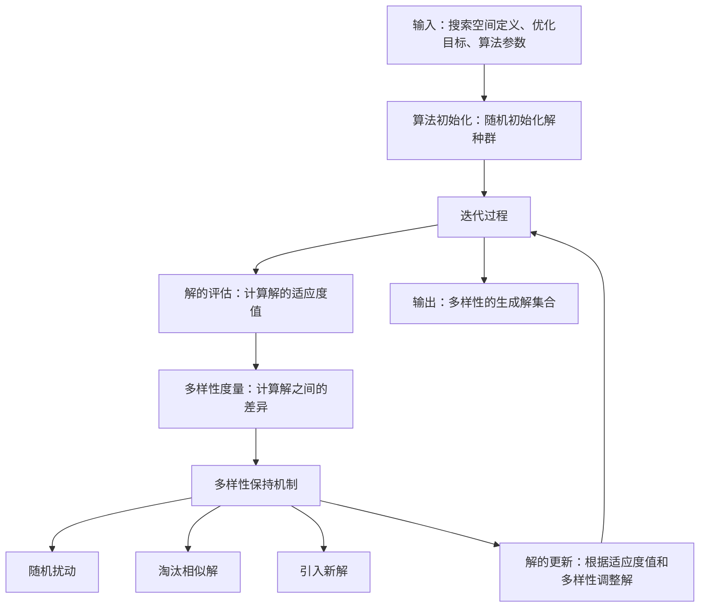

# 保证生成解多样性的技术手段

> 关键词：生成解多样性、优化算法、随机策略、搜索空间、多样性度量

> 摘要：在众多的优化和生成问题中，保证生成解的多样性具有至关重要的意义。它有助于避免算法陷入局部最优，提升算法的泛化能力，还能为决策者提供更多样的选择。本文全面深入地探讨了保证生成解多样性的技术手段，从核心概念、算法原理、数学模型，到项目实战、实际应用场景等多个方面进行了详细阐述。通过理论分析与实际案例相结合，旨在为读者提供一套系统且实用的技术方案，帮助其在不同的应用场景中有效地实现生成解的多样性。

## 1. 背景介绍 
### 1.1 目的和范围
在各种优化问题和生成任务中，如遗传算法、粒子群算法、神经网络生成模型等，生成解的多样性是一个关键的性能指标。本文的目的在于深入探讨保证生成解多样性的各种技术手段，涵盖从基础的理论原理到实际的应用案例。范围包括对常见优化算法和生成模型中多样性保持技术的研究，以及如何在实际项目中应用这些技术来提高生成解的质量和多样性。

### 1.2 预期读者
本文预期读者包括对优化算法、人工智能、机器学习等领域感兴趣的科研人员、工程师、学生以及相关从业者。无论是想要深入了解生成解多样性理论的研究者，还是希望在实际项目中应用相关技术的开发者，都能从本文中获得有价值的信息。

### 1.3 文档结构概述
本文将首先介绍与生成解多样性相关的核心概念及其联系，接着详细阐述保证生成解多样性的核心算法原理和具体操作步骤，并给出相应的数学模型和公式。然后通过项目实战，展示代码实际案例并进行详细解释说明。之后探讨生成解多样性在实际应用场景中的应用，推荐相关的工具和资源。最后总结未来发展趋势与挑战，提供常见问题与解答以及扩展阅读和参考资料。

### 1.4 术语表
#### 1.4.1 核心术语定义
- **生成解**：在优化问题或生成任务中，算法通过一定的搜索策略得到的一组可能的解决方案。
- **多样性**：指生成解集合中各个解之间的差异程度，通常用距离、相似度等指标来度量。
- **搜索空间**：所有可能解的集合，算法在这个空间中进行搜索以寻找最优解或生成满足特定条件的解。
- **局部最优**：在搜索空间中，某个区域内的最优解，但不是全局最优解。

#### 1.4.2 相关概念解释
- **探索与利用平衡**：在优化算法中，探索是指在搜索空间中广泛地寻找不同的区域，以发现新的潜在解；利用是指在已发现的较优解附近进行精细搜索，以提高解的质量。保证生成解多样性需要在探索和利用之间找到平衡。
- **解的分布**：生成解在搜索空间中的分布情况，理想情况下，解应该均匀地分布在搜索空间中，以保证多样性。

#### 1.4.3 缩略词列表
- **GA**：Genetic Algorithm，遗传算法
- **PSO**：Particle Swarm Optimization，粒子群算法
- **CNN**：Convolutional Neural Network，卷积神经网络
- **GAN**：Generative Adversarial Network，生成对抗网络

## 2. 核心概念与联系 

### 核心概念原理
生成解多样性的核心在于确保生成的解集合中包含足够多不同的解，避免解的趋同。这涉及到多个方面的原理：
- **搜索空间的覆盖**：算法需要尽可能广泛地覆盖搜索空间，以发现不同区域的解。例如，在一个高维的优化问题中，搜索空间可能非常大，算法需要有策略地在各个维度上进行搜索，而不是集中在某个局部区域。
- **解的差异度量**：为了评估生成解的多样性，需要定义合适的差异度量方法。常见的度量方法包括欧几里得距离、曼哈顿距离、余弦相似度等。通过计算解之间的距离或相似度，可以判断解的差异程度。
- **多样性保持机制**：在算法运行过程中，需要引入一些机制来保持解的多样性。这些机制可以是基于随机策略的，如随机初始化、随机扰动等；也可以是基于竞争机制的，如淘汰相似解、选择不同解等。

### 架构的文本示意图
```plaintext
生成解多样性系统架构

输入：搜索空间定义、优化目标、算法参数
|
V
算法初始化：随机初始化解种群
|
V
迭代过程：
    |
    V
    解的评估：计算解的适应度值
    |
    V
    多样性度量：计算解之间的差异
    |
    V
    多样性保持机制：
        - 随机扰动
        - 淘汰相似解
        - 引入新解
    |
    V
    解的更新：根据适应度值和多样性调整解
    |
    V
输出：多样性的生成解集合
```

### Mermaid 流程图


## 3. 核心算法原理 & 具体操作步骤 

### 基于遗传算法的多样性保持
遗传算法是一种常用的优化算法，通过模拟生物进化过程来寻找最优解。为了保证生成解的多样性，可以在遗传算法中引入以下机制：

#### 算法原理
- **随机初始化**：在算法开始时，随机生成初始种群，确保种群中的个体具有一定的多样性。
- **交叉操作**：通过交叉操作，将不同个体的基因进行交换，产生新的个体。为了增加多样性，可以采用多种交叉策略，如单点交叉、多点交叉、均匀交叉等。
- **变异操作**：对个体的基因进行随机变异，引入新的基因信息，避免种群陷入局部最优。变异概率可以根据种群的多样性情况进行动态调整。
- **精英保留策略**：在每一代中，保留一定数量的最优个体，同时淘汰一些相似的个体，以保持种群的多样性。

#### Python 源代码实现
```python
import numpy as np

# 定义问题的维度和种群大小
dim = 10
pop_size = 50

# 随机初始化种群
def initialize_population():
    population = np.random.rand(pop_size, dim)
    return population

# 定义适应度函数
def fitness_function(x):
    return np.sum(x**2)

# 交叉操作
def crossover(parent1, parent2):
    crossover_point = np.random.randint(1, dim)
    child1 = np.concatenate((parent1[:crossover_point], parent2[crossover_point:]))
    child2 = np.concatenate((parent2[:crossover_point], parent1[crossover_point:]))
    return child1, child2

# 变异操作
def mutation(individual, mutation_rate=0.1):
    for i in range(dim):
        if np.random.rand() < mutation_rate:
            individual[i] = np.random.rand()
    return individual

# 遗传算法主函数
def genetic_algorithm(max_generations=100):
    population = initialize_population()
    for generation in range(max_generations):
        # 计算适应度值
        fitness_values = np.array([fitness_function(individual) for individual in population])
        # 选择操作（简单的轮盘赌选择）
        selection_probabilities = fitness_values / np.sum(fitness_values)
        selected_indices = np.random.choice(pop_size, pop_size, p=selection_probabilities)
        selected_population = population[selected_indices]
        # 交叉操作
        new_population = []
        for i in range(0, pop_size, 2):
            parent1 = selected_population[i]
            parent2 = selected_population[i + 1]
            child1, child2 = crossover(parent1, parent2)
            new_population.append(child1)
            new_population.append(child2)
        new_population = np.array(new_population)
        # 变异操作
        for i in range(pop_size):
            new_population[i] = mutation(new_population[i])
        population = new_population
    return population

# 运行遗传算法
final_population = genetic_algorithm()
print("Final population:", final_population)
```

#### 具体操作步骤
1. **初始化种群**：调用 `initialize_population` 函数随机生成初始种群。
2. **迭代过程**：在每一代中，计算种群中每个个体的适应度值，然后进行选择、交叉和变异操作。
3. **选择操作**：使用轮盘赌选择方法，根据个体的适应度值选择下一代的个体。
4. **交叉操作**：对选择的个体进行交叉操作，产生新的个体。
5. **变异操作**：对新产生的个体进行变异操作，引入新的基因信息。
6. **更新种群**：将新产生的个体作为下一代的种群，继续迭代，直到达到最大迭代次数。

### 基于粒子群算法的多样性保持
粒子群算法是一种基于群体智能的优化算法，通过模拟鸟群或鱼群的行为来寻找最优解。为了保证生成解的多样性，可以在粒子群算法中引入以下机制：

#### 算法原理
- **随机初始化**：在算法开始时，随机初始化粒子的位置和速度，确保粒子在搜索空间中具有一定的分布。
- **惯性权重调整**：通过调整惯性权重，控制粒子的搜索范围。在算法初期，较大的惯性权重可以使粒子在搜索空间中广泛搜索，增加多样性；在算法后期，较小的惯性权重可以使粒子在局部区域进行精细搜索，提高解的质量。
- **邻域拓扑结构**：采用不同的邻域拓扑结构，如环形拓扑、星形拓扑等，使粒子能够与不同的邻居进行信息交流，增加解的多样性。
- **随机扰动**：在粒子的速度更新过程中，引入随机扰动，避免粒子陷入局部最优。

#### Python 源代码实现
```python
import numpy as np

# 定义问题的维度和粒子数量
dim = 10
num_particles = 50

# 定义搜索空间的范围
x_min = -10
x_max = 10
v_min = -1
v_max = 1

# 定义适应度函数
def fitness_function(x):
    return np.sum(x**2)

# 初始化粒子群
def initialize_particles():
    particles = np.random.uniform(x_min, x_max, (num_particles, dim))
    velocities = np.random.uniform(v_min, v_max, (num_particles, dim))
    pbest_positions = particles.copy()
    pbest_fitness = np.array([fitness_function(particle) for particle in particles])
    gbest_index = np.argmin(pbest_fitness)
    gbest_position = pbest_positions[gbest_index]
    gbest_fitness = pbest_fitness[gbest_index]
    return particles, velocities, pbest_positions, pbest_fitness, gbest_position, gbest_fitness

# 粒子群算法主函数
def particle_swarm_optimization(max_iterations=100, w=0.7, c1=1.4, c2=1.4):
    particles, velocities, pbest_positions, pbest_fitness, gbest_position, gbest_fitness = initialize_particles()
    for iteration in range(max_iterations):
        # 更新粒子的速度和位置
        r1 = np.random.rand(num_particles, dim)
        r2 = np.random.rand(num_particles, dim)
        velocities = w * velocities + c1 * r1 * (pbest_positions - particles) + c2 * r2 * (gbest_position - particles)
        # 限制速度范围
        velocities = np.clip(velocities, v_min, v_max)
        particles += velocities
        # 限制位置范围
        particles = np.clip(particles, x_min, x_max)
        # 计算适应度值
        fitness_values = np.array([fitness_function(particle) for particle in particles])
        # 更新个体最优和全局最优
        update_indices = fitness_values < pbest_fitness
        pbest_positions[update_indices] = particles[update_indices]
        pbest_fitness[update_indices] = fitness_values[update_indices]
        new_gbest_index = np.argmin(pbest_fitness)
        if pbest_fitness[new_gbest_index] < gbest_fitness:
            gbest_position = pbest_positions[new_gbest_index]
            gbest_fitness = pbest_fitness[new_gbest_index]
        # 随机扰动
        if iteration % 10 == 0:
            random_indices = np.random.choice(num_particles, 5)
            velocities[random_indices] += np.random.uniform(-0.1, 0.1, (5, dim))
    return particles

# 运行粒子群算法
final_particles = particle_swarm_optimization()
print("Final particles:", final_particles)
```

#### 具体操作步骤
1. **初始化粒子群**：调用 `initialize_particles` 函数随机初始化粒子的位置、速度、个体最优位置和全局最优位置。
2. **迭代过程**：在每一代中，更新粒子的速度和位置，计算适应度值，更新个体最优和全局最优。
3. **速度更新**：根据惯性权重、个体最优和全局最优位置更新粒子的速度。
4. **位置更新**：根据更新后的速度更新粒子的位置。
5. **限制范围**：限制粒子的速度和位置在搜索空间范围内。
6. **随机扰动**：每隔一定的迭代次数，对部分粒子的速度进行随机扰动，增加解的多样性。
7. **更新最优值**：根据适应度值更新个体最优和全局最优位置。

## 4. 数学模型和公式 & 详细讲解 & 举例说明 

### 多样性度量公式
#### 欧几里得距离
欧几里得距离是一种常用的距离度量方法，用于计算两个解之间的差异程度。对于两个 $n$ 维向量 $\mathbf{x}=(x_1,x_2,\cdots,x_n)$ 和 $\mathbf{y}=(y_1,y_2,\cdots,y_n)$，它们之间的欧几里得距离定义为：
$$d(\mathbf{x},\mathbf{y})=\sqrt{\sum_{i=1}^{n}(x_i - y_i)^2}$$

**详细讲解**：欧几里得距离衡量了两个向量在 $n$ 维空间中的直线距离。距离越大，说明两个向量之间的差异越大。

**举例说明**：假设有两个二维向量 $\mathbf{x}=(1,2)$ 和 $\mathbf{y}=(4,6)$，则它们之间的欧几里得距离为：
$$d(\mathbf{x},\mathbf{y})=\sqrt{(1 - 4)^2+(2 - 6)^2}=\sqrt{9 + 16}=\sqrt{25}=5$$

#### 余弦相似度
余弦相似度用于衡量两个向量之间的夹角余弦值，反映了两个向量的方向相似性。对于两个 $n$ 维向量 $\mathbf{x}=(x_1,x_2,\cdots,x_n)$ 和 $\mathbf{y}=(y_1,y_2,\cdots,y_n)$，它们之间的余弦相似度定义为：
$$\text{cosine}(\mathbf{x},\mathbf{y})=\frac{\mathbf{x}\cdot\mathbf{y}}{\|\mathbf{x}\|\|\mathbf{y}\|}=\frac{\sum_{i=1}^{n}x_iy_i}{\sqrt{\sum_{i=1}^{n}x_i^2}\sqrt{\sum_{i=1}^{n}y_i^2}}$$

**详细讲解**：余弦相似度的取值范围在 $[-1,1]$ 之间。当余弦相似度为 1 时，说明两个向量方向相同；当余弦相似度为 -1 时，说明两个向量方向相反；当余弦相似度为 0 时，说明两个向量正交。

**举例说明**：假设有两个二维向量 $\mathbf{x}=(1,2)$ 和 $\mathbf{y}=(2,4)$，则它们之间的余弦相似度为：
$$\text{cosine}(\mathbf{x},\mathbf{y})=\frac{1\times2 + 2\times4}{\sqrt{1^2 + 2^2}\sqrt{2^2 + 4^2}}=\frac{2 + 8}{\sqrt{5}\sqrt{20}}=\frac{10}{10}=1$$

### 遗传算法中的数学模型
#### 选择概率
在遗传算法中，选择操作通常采用轮盘赌选择方法。对于个体 $i$，其选择概率 $p_i$ 定义为：
$$p_i=\frac{f_i}{\sum_{j=1}^{N}f_j}$$
其中，$f_i$ 是个体 $i$ 的适应度值，$N$ 是种群大小。

**详细讲解**：选择概率反映了个体被选中的可能性。适应度值越高的个体，被选中的概率越大。

**举例说明**：假设有一个种群大小为 3 的种群，个体的适应度值分别为 $f_1 = 2$，$f_2 = 3$，$f_3 = 5$，则个体 1 的选择概率为：
$$p_1=\frac{2}{2 + 3 + 5}=\frac{2}{10}=0.2$$

#### 交叉和变异操作
交叉操作和变异操作是遗传算法中产生新个体的重要手段。交叉操作通过交换两个父个体的部分基因来产生新个体，变异操作通过随机改变个体的部分基因来引入新的基因信息。

### 粒子群算法中的数学模型
#### 速度更新公式
在粒子群算法中，粒子的速度更新公式为：
$$v_{i,d}(t + 1)=w\cdot v_{i,d}(t)+c_1\cdot r_1\cdot(p_{i,d}-x_{i,d}(t))+c_2\cdot r_2\cdot(g_d - x_{i,d}(t))$$
其中，$v_{i,d}(t)$ 是粒子 $i$ 在第 $d$ 维上的速度，$w$ 是惯性权重，$c_1$ 和 $c_2$ 是学习因子，$r_1$ 和 $r_2$ 是 $[0,1]$ 之间的随机数，$p_{i,d}$ 是粒子 $i$ 的个体最优位置在第 $d$ 维上的值，$g_d$ 是全局最优位置在第 $d$ 维上的值，$x_{i,d}(t)$ 是粒子 $i$ 在第 $d$ 维上的位置。

**详细讲解**：速度更新公式由三部分组成：惯性项、个体认知项和社会认知项。惯性项表示粒子保持当前速度的趋势，个体认知项表示粒子向自身最优位置移动的趋势，社会认知项表示粒子向全局最优位置移动的趋势。

**举例说明**：假设有一个二维粒子，当前位置为 $\mathbf{x}=(1,2)$，当前速度为 $\mathbf{v}=(0.1,0.2)$，个体最优位置为 $\mathbf{p}=(3,4)$，全局最优位置为 $\mathbf{g}=(5,6)$，惯性权重 $w = 0.7$，学习因子 $c_1 = c_2 = 1.4$，随机数 $r_1 = 0.5$，$r_2 = 0.6$，则粒子在第一维上的速度更新为：
$$v_{1,1}(t + 1)=0.7\times0.1+1.4\times0.5\times(3 - 1)+1.4\times0.6\times(5 - 1)=0.07 + 1.4 + 3.36 = 4.83$$

## 5. 项目实战：代码实际案例和详细解释说明 

### 5.1  开发环境搭建
本项目使用 Python 语言进行开发，需要安装以下库：
- **NumPy**：用于数值计算和数组操作。
- **Matplotlib**：用于数据可视化。

可以使用以下命令安装所需库：
```sh
pip install numpy matplotlib
```

### 5.2  源代码详细实现和代码解读
#### 问题描述
我们以一个简单的二维函数优化问题为例，目标是找到函数 $f(x,y)=(x - 2)^2+(y - 3)^2$ 的最小值。

#### 代码实现
```python
import numpy as np
import matplotlib.pyplot as plt

# 定义目标函数
def objective_function(x, y):
    return (x - 2)**2+(y - 3)**2

# 定义多样性度量函数（欧几里得距离）
def diversity(population):
    num_solutions = len(population)
    total_distance = 0
    for i in range(num_solutions):
        for j in range(i + 1, num_solutions):
            total_distance += np.sqrt((population[i][0] - population[j][0])**2+(population[i][1] - population[j][1])**2)
    return total_distance

# 遗传算法实现
def genetic_algorithm(pop_size=50, max_generations=100, mutation_rate=0.1):
    # 初始化种群
    population = np.random.uniform(-10, 10, (pop_size, 2))
    diversities = []
    for generation in range(max_generations):
        # 计算适应度值
        fitness_values = np.array([objective_function(solution[0], solution[1]) for solution in population])
        # 选择操作（轮盘赌选择）
        selection_probabilities = fitness_values / np.sum(fitness_values)
        selected_indices = np.random.choice(pop_size, pop_size, p=selection_probabilities)
        selected_population = population[selected_indices]
        # 交叉操作
        new_population = []
        for i in range(0, pop_size, 2):
            parent1 = selected_population[i]
            parent2 = selected_population[i + 1]
            crossover_point = np.random.randint(1, 2)
            child1 = np.concatenate((parent1[:crossover_point], parent2[crossover_point:]))
            child2 = np.concatenate((parent2[:crossover_point], parent1[crossover_point:]))
            new_population.append(child1)
            new_population.append(child2)
        new_population = np.array(new_population)
        # 变异操作
        for i in range(pop_size):
            if np.random.rand() < mutation_rate:
                new_population[i] += np.random.uniform(-1, 1, 2)
        population = new_population
        # 计算多样性
        current_diversity = diversity(population)
        diversities.append(current_diversity)
    return population, diversities

# 运行遗传算法
final_population, diversities = genetic_algorithm()

# 绘制多样性变化曲线
plt.plot(diversities)
plt.xlabel('Generation')
plt.ylabel('Diversity')
plt.title('Diversity Change in Genetic Algorithm')
plt.show()

# 绘制最终解的分布
x = final_population[:, 0]
y = final_population[:, 1]
plt.scatter(x, y)
plt.xlabel('x')
plt.ylabel('y')
plt.title('Final Solution Distribution')
plt.show()
```

#### 代码解读
1. **目标函数定义**：`objective_function` 函数定义了我们要优化的目标函数。
2. **多样性度量函数**：`diversity` 函数使用欧几里得距离计算种群中所有解之间的总距离，作为多样性的度量。
3. **遗传算法实现**：
    - **初始化种群**：随机生成初始种群。
    - **迭代过程**：在每一代中，计算适应度值，进行选择、交叉和变异操作。
    - **选择操作**：使用轮盘赌选择方法选择下一代的个体。
    - **交叉操作**：随机选择交叉点，交换两个父个体的部分基因。
    - **变异操作**：以一定的概率对个体的基因进行随机扰动。
    - **多样性计算**：在每一代中，计算当前种群的多样性，并记录下来。
4. **结果可视化**：
    - 绘制多样性变化曲线，展示遗传算法运行过程中多样性的变化情况。
    - 绘制最终解的分布，展示最终生成解在搜索空间中的分布情况。

### 5.3  代码解读与分析
#### 多样性变化分析
从多样性变化曲线可以看出，在遗传算法的初期，多样性较高，因为初始种群是随机生成的，解的分布比较广泛。随着迭代次数的增加，多样性逐渐降低，这是因为算法逐渐收敛到最优解附近，解的分布变得更加集中。但是，由于变异操作的存在，多样性不会降为零，保证了一定的解的多样性。

#### 最终解的分布分析
从最终解的分布可以看出，最终生成的解主要集中在目标函数的最小值点附近，说明算法能够有效地找到最优解。同时，解的分布也有一定的分散性，说明算法在寻找最优解的过程中保持了一定的多样性。

## 6. 实际应用场景 
### 机器学习中的模型选择
在机器学习中，模型选择是一个重要的任务。不同的模型可能具有不同的性能和特点，通过保证生成解的多样性，可以生成多个不同的模型，然后根据具体的任务需求选择最合适的模型。例如，在神经网络中，可以通过不同的初始化方法、网络结构和训练参数生成多个不同的神经网络模型，然后选择性能最优的模型。

### 多目标优化问题
在多目标优化问题中，通常存在多个相互冲突的目标，需要找到一组 Pareto 最优解。保证生成解的多样性可以帮助我们找到更多不同的 Pareto 最优解，为决策者提供更多的选择。例如，在工程设计中，需要同时考虑成本、性能和可靠性等多个目标，通过生成多样性的解，可以找到不同的设计方案，满足不同的需求。

### 数据生成与合成
在数据生成和合成任务中，如生成对抗网络（GAN），保证生成解的多样性可以生成更加丰富和多样的数据。例如，在图像生成中，多样性的生成解可以生成不同风格、不同内容的图像，提高生成图像的质量和真实性。

### 智能决策系统
在智能决策系统中，需要根据不同的情况做出决策。保证生成解的多样性可以提供更多的决策方案，增加决策的灵活性和适应性。例如，在交通调度系统中，可以生成多个不同的调度方案，根据实时的交通情况选择最优的方案。

## 7. 工具和资源推荐
### 7.1 学习资源推荐
#### 7.1.1 书籍推荐
- 《遗传算法原理及应用》：详细介绍了遗传算法的基本原理、算法实现和应用案例。
- 《粒子群算法：理论、应用与实践》：全面阐述了粒子群算法的理论基础、算法改进和实际应用。
- 《机器学习》：对机器学习的基本概念、算法和应用进行了系统的介绍，其中包括一些与多样性保持相关的内容。

#### 7.1.2 在线课程
- Coursera 上的“Genetic Algorithms and Evolutionary Computing”：由知名教授授课，深入讲解遗传算法和进化计算的相关知识。
- edX 上的“Particle Swarm Optimization”：介绍了粒子群算法的原理、实现和应用。
- 中国大学 MOOC 上的“机器学习基础”：提供了机器学习的基础知识和相关算法的讲解。

#### 7.1.3 技术博客和网站
- Medium：上面有很多关于优化算法、人工智能和机器学习的技术博客，其中不乏关于生成解多样性的文章。
- arXiv：提供了大量的学术论文，包括最新的研究成果和应用案例。
- 博客园：有很多开发者分享的技术文章，其中包括一些关于优化算法和多样性保持的实践经验。

### 7.2 开发工具框架推荐
#### 7.2.1 IDE和编辑器
- PyCharm：功能强大的 Python 集成开发环境，提供了代码编辑、调试、版本控制等功能。
- Visual Studio Code：轻量级的代码编辑器，支持多种编程语言，并且有丰富的插件扩展。
- Jupyter Notebook：交互式的开发环境，适合进行数据探索、算法实验和结果展示。

#### 7.2.2 调试和性能分析工具
- PDB：Python 自带的调试器，可以帮助我们调试代码，查找问题。
- cProfile：Python 自带的性能分析工具，可以分析代码的性能瓶颈。
- Py-Spy：用于实时分析 Python 程序的性能，找出性能瓶颈。

#### 7.2.3 相关框架和库
- DEAP：Python 中的进化算法框架，提供了遗传算法、粒子群算法等多种优化算法的实现。
- Optuna：用于超参数优化的框架，支持多种优化算法，并且可以自动调整超参数，提高算法的性能。
- TensorFlow 和 PyTorch：深度学习框架，提供了丰富的工具和函数，用于构建和训练神经网络模型。

### 7.3 相关论文著作推荐
#### 7.3.1 经典论文
- Holland, J. H. (1975). Adaptation in natural and artificial systems. University of Michigan Press. 这篇论文是遗传算法的经典著作，奠定了遗传算法的理论基础。
- Kennedy, J., & Eberhart, R. C. (1995, November). Particle swarm optimization. In Proceedings of ICNN'95 - International Conference on Neural Networks (Vol. 4, pp. 1942-1948). IEEE. 这篇论文首次提出了粒子群算法，是粒子群算法的经典文献。

#### 7.3.2 最新研究成果
- 通过 arXiv 等学术平台可以查找关于生成解多样性的最新研究成果，了解该领域的前沿动态。

#### 7.3.3 应用案例分析
- 许多学术期刊和会议上都有关于生成解多样性在不同领域应用的案例分析，如《Journal of Artificial Intelligence Research》《Proceedings of the ACM SIGKDD International Conference on Knowledge Discovery and Data Mining》等。

## 8. 总结：未来发展趋势与挑战
### 未来发展趋势
- **融合多种算法**：将不同的优化算法和多样性保持技术进行融合，发挥各自的优势，提高生成解的多样性和质量。例如，将遗传算法和粒子群算法相结合，利用遗传算法的全局搜索能力和粒子群算法的局部搜索能力。
- **深度学习与多样性保持**：随着深度学习的发展，将深度学习技术应用于多样性保持领域是一个重要的发展趋势。例如，利用生成对抗网络生成多样性的数据，或者利用深度强化学习优化多样性保持策略。
- **多智能体系统中的应用**：在多智能体系统中，保证生成解的多样性可以提高系统的鲁棒性和适应性。未来，将多样性保持技术应用于多智能体系统的协同决策、任务分配等问题中，具有广阔的应用前景。

### 挑战
- **计算复杂度**：随着问题规模的增大和搜索空间的复杂化，保证生成解多样性的计算复杂度也会增加。如何在保证多样性的同时，降低计算复杂度，是一个亟待解决的问题。
- **多样性度量的准确性**：目前的多样性度量方法大多基于距离、相似度等指标，这些指标可能无法准确地反映解的多样性。如何设计更加准确和有效的多样性度量方法，是一个挑战。
- **实际应用中的适应性**：在实际应用中，不同的问题和场景对生成解多样性的要求可能不同。如何根据具体的应用需求，选择合适的多样性保持技术和参数，是一个需要解决的问题。

## 9. 附录：常见问题与解答
### 如何判断生成解的多样性是否足够？
可以通过多样性度量方法，如欧几里得距离、余弦相似度等，计算解之间的差异程度。如果解之间的距离较大，相似度较低，则说明生成解的多样性较高。同时，也可以通过可视化的方法，观察解在搜索空间中的分布情况，如果解的分布比较广泛，则说明多样性较好。

### 多样性保持技术会影响算法的收敛速度吗？
在一定程度上，多样性保持技术可能会影响算法的收敛速度。因为多样性保持技术通常会引入一些随机因素，使算法在搜索空间中进行更广泛的搜索，这可能会导致算法收敛速度变慢。但是，通过合理地调整多样性保持策略和参数，可以在保证多样性的同时，尽量减少对收敛速度的影响。

### 如何选择合适的多样性保持技术？
选择合适的多样性保持技术需要考虑问题的特点、搜索空间的大小、算法的类型等因素。例如，对于复杂的高维问题，可以选择具有较强全局搜索能力的算法和多样性保持技术；对于简单的低维问题，可以选择相对简单的多样性保持技术。同时，也可以通过实验和比较，选择最适合的多样性保持技术。

## 10. 扩展阅读 & 参考资料
- Goldberg, D. E. (1989). Genetic algorithms in search, optimization, and machine learning. Addison-Wesley.
- Eberhart, R. C., & Shi, Y. (2001). Particle swarm optimization: developments, applications and resources. In Proceedings of the 2001 congress on evolutionary computation (Vol. 1, pp. 81-86). IEEE.
- Goodfellow, I. J., et al. (2014). Generative adversarial nets. Advances in neural information processing systems.
- 相关学术期刊和会议论文，如《Artificial Intelligence》《IEEE Transactions on Evolutionary Computation》等。