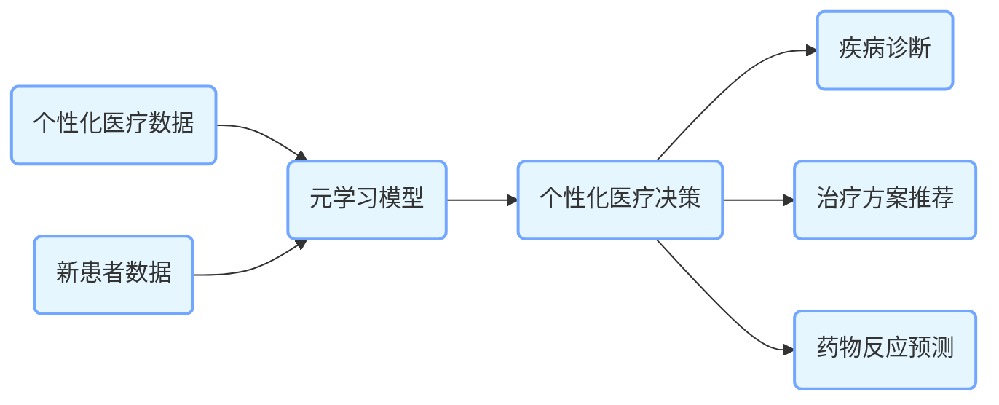

# 元学习在个性化医疗AI中的应用研究

> 关键词：元学习、个性化医疗、人工智能、机器学习、医疗应用、算法原理、临床决策

> 摘要：本文聚焦于元学习在个性化医疗AI中的应用研究。首先介绍了研究的背景，包括目的、预期读者、文档结构和相关术语。接着阐述了元学习和个性化医疗的核心概念及联系，详细讲解了元学习的核心算法原理并给出Python示例代码。同时，给出了相关数学模型和公式并举例说明。通过项目实战展示了元学习在个性化医疗中的代码实现和分析。探讨了元学习在个性化医疗中的实际应用场景，推荐了相关的学习资源、开发工具框架和论文著作。最后总结了元学习在个性化医疗领域的未来发展趋势与挑战，提供常见问题解答和扩展阅读参考资料，旨在全面深入地研究元学习在个性化医疗AI中的应用，为相关领域的研究和实践提供有价值的参考。

## 1. 背景介绍 
### 1.1 目的和范围
个性化医疗旨在根据个体的基因、生活方式、环境等多方面信息，为患者提供量身定制的医疗方案，以提高治疗效果和减少副作用。然而，医疗数据具有高维度、异质性和小样本等特点，传统机器学习方法在处理这些数据时面临诸多挑战。元学习作为一种能够快速学习和适应新任务的机器学习范式，为解决个性化医疗中的问题提供了新的思路和方法。

本文的研究范围涵盖元学习的基本概念、算法原理，以及其在个性化医疗AI中的具体应用，包括疾病诊断、治疗方案推荐、药物反应预测等方面。通过对相关理论和实践的研究，旨在深入探讨元学习在个性化医疗中的有效性和应用前景。

### 1.2 预期读者
本文预期读者包括医疗领域的科研人员、临床医生、人工智能和机器学习领域的研究人员和工程师，以及对个性化医疗和元学习感兴趣的相关专业学生。对于医疗从业者，本文可以帮助他们了解元学习在医疗领域的应用潜力，为临床决策提供新的技术支持；对于技术人员，本文提供了元学习算法的详细原理和实现代码，有助于他们将元学习技术应用到个性化医疗的实际项目中。

### 1.3 文档结构概述
本文共分为十个部分。第一部分为背景介绍，阐述研究的目的、范围、预期读者和文档结构。第二部分介绍元学习和个性化医疗的核心概念及联系，并给出相应的文本示意图和Mermaid流程图。第三部分详细讲解元学习的核心算法原理，并使用Python源代码进行阐述。第四部分给出元学习的数学模型和公式，并举例说明。第五部分通过项目实战展示元学习在个性化医疗中的代码实现和详细解释。第六部分探讨元学习在个性化医疗中的实际应用场景。第七部分推荐相关的学习资源、开发工具框架和论文著作。第八部分总结元学习在个性化医疗领域的未来发展趋势与挑战。第九部分为附录，提供常见问题与解答。第十部分给出扩展阅读和参考资料。

### 1.4 术语表
#### 1.4.1 核心术语定义
- **元学习（Meta - Learning）**：也称为“学习如何学习”，是一种让模型从多个学习任务中学习到通用的学习策略，从而能够快速适应新任务的机器学习范式。
- **个性化医疗（Personalized Medicine）**：根据个体的遗传信息、生理特征、生活方式等多方面因素，为患者制定个性化的医疗决策和治疗方案的医疗模式。
- **机器学习（Machine Learning）**：一门多领域交叉学科，涉及概率论、统计学、逼近论、凸分析、算法复杂度理论等多门学科。它专门研究计算机怎样模拟或实现人类的学习行为，以获取新的知识或技能，重新组织已有的知识结构使之不断改善自身的性能。
- **小样本学习（Few - Shot Learning）**：元学习中的一个重要应用场景，指在只有少量标注样本的情况下，模型能够快速学习并做出准确预测的能力。
- **模型泛化（Model Generalization）**：模型在未见过的数据上能够表现出良好性能的能力，即模型能够从训练数据中学习到通用的模式，而不是仅仅记忆训练数据。

#### 1.4.2 相关概念解释
- **元知识（Meta - Knowledge）**：元学习中学习到的关于学习过程的知识，包括如何选择合适的模型、如何调整模型的参数等。元知识可以帮助模型在新任务中更快地收敛和取得更好的性能。
- **任务分布（Task Distribution）**：在元学习中，通常会有多个不同的学习任务，这些任务构成一个任务分布。模型需要从这个任务分布中学习到通用的学习策略，以便能够适应新的任务。
- **元训练（Meta - Training）**：元学习中的一个训练阶段，在这个阶段，模型从多个训练任务中学习元知识。元训练的目的是让模型能够学习到通用的学习策略，而不是针对某个特定任务进行优化。
- **元测试（Meta - Testing）**：在元训练之后，使用新的测试任务来评估模型的性能。元测试的任务通常与元训练的任务不同，模型需要利用在元训练中学习到的元知识来快速适应新任务。

#### 1.4.3 缩略词列表
- **AI**：Artificial Intelligence，人工智能
- **ML**：Machine Learning，机器学习
- **MAML**：Model - Agnostic Meta - Learning，模型无关元学习
- **FSL**：Few - Shot Learning，小样本学习

## 2. 核心概念与联系 
### 2.1 元学习的核心概念
元学习的核心思想是“学习如何学习”。传统的机器学习方法通常是针对单个任务进行训练，模型的参数是根据该任务的训练数据进行优化的。而元学习则是从多个不同的学习任务中学习到通用的学习策略，使得模型能够在面对新任务时，快速适应并取得较好的性能。

元学习可以看作是在任务分布上进行学习，它的目标是学习到一个初始化的模型参数，这个参数在经过少量的梯度更新后，能够在新任务上取得较好的性能。元学习的一个重要应用场景是小样本学习，在小样本学习中，训练数据的样本数量非常有限，传统的机器学习方法很难在这样的数据上取得良好的性能，而元学习可以通过学习到的元知识，在少量样本的情况下快速学习。

### 2.2 个性化医疗的核心概念
个性化医疗是一种以个体为中心的医疗模式，它考虑了个体的遗传信息、生理特征、生活方式、环境等多方面因素，为患者制定个性化的医疗决策和治疗方案。个性化医疗的目标是提高医疗效果，减少副作用，实现精准医疗。

个性化医疗的实现需要大量的医疗数据，包括基因数据、临床数据、影像数据等。通过对这些数据的分析和挖掘，可以发现个体之间的差异，从而为每个患者提供最适合的医疗方案。然而，医疗数据具有高维度、异质性和小样本等特点，传统的数据分析方法在处理这些数据时面临诸多挑战。

### 2.3 元学习与个性化医疗的联系
元学习与个性化医疗有着密切的联系。在个性化医疗中，每个患者都可以看作是一个独特的学习任务，由于患者之间存在个体差异，传统的机器学习方法很难为每个患者都提供准确的诊断和治疗方案。而元学习可以从多个患者的数据中学习到通用的学习策略，在面对新患者时，能够快速适应并为其提供个性化的医疗建议。

例如，在疾病诊断中，不同患者的症状和体征可能存在差异，元学习可以通过学习多个患者的诊断案例，学习到通用的诊断策略，在面对新患者时，能够根据患者的症状快速做出准确的诊断。在治疗方案推荐中，元学习可以根据患者的基因数据、临床数据等信息，快速推荐适合患者的治疗方案。

### 2.4 文本示意图
元学习在个性化医疗中的应用可以用以下文本示意图表示：

个性化医疗数据（基因数据、临床数据、影像数据等） -> 元学习模型（学习通用学习策略） -> 新患者数据 -> 个性化医疗决策（疾病诊断、治疗方案推荐、药物反应预测等）

### 2.5 Mermaid流程图


## 3. 核心算法原理 & 具体操作步骤 
### 3.1 模型无关元学习（MAML）算法原理
模型无关元学习（MAML）是一种经典的元学习算法，它的核心思想是学习一个初始化的模型参数，使得这个参数在经过少量的梯度更新后，能够在新任务上取得较好的性能。

MAML的算法步骤如下：
1. **初始化模型参数**：随机初始化模型的参数 $\theta$。
2. **采样任务**：从任务分布 $\mathcal{T}$ 中采样一批任务 $\{T_1, T_2, \cdots, T_n\}$。
3. **内循环更新**：对于每个任务 $T_i$，从任务 $T_i$ 的训练数据中采样一个小批量的数据 $D_{i}^{tr}$，使用梯度下降法对模型参数 $\theta$ 进行一次或多次更新，得到更新后的参数 $\theta_i'$。更新公式为：
   - $\theta_i' = \theta - \alpha \nabla_{\theta} L(T_i, \theta)$，其中 $\alpha$ 是内循环的学习率，$L(T_i, \theta)$ 是任务 $T_i$ 在参数 $\theta$ 下的损失函数。
4. **外循环更新**：使用更新后的参数 $\theta_i'$ 对任务 $T_i$ 的测试数据 $D_{i}^{te}$ 计算损失函数 $L(T_i, \theta_i')$，然后对所有任务的损失函数求和，得到元损失函数 $\mathcal{L}(\theta)$。使用梯度下降法对元损失函数进行更新，更新公式为：
   - $\theta = \theta - \beta \nabla_{\theta} \mathcal{L}(\theta)$，其中 $\beta$ 是外循环的学习率。
5. **重复步骤2 - 4**：直到模型收敛。

### 3.2 Python源代码实现
```python
import torch
import torch.nn as nn
import torch.optim as optim

# 定义一个简单的神经网络模型
class SimpleModel(nn.Module):
    def __init__(self, input_size, hidden_size, output_size):
        super(SimpleModel, self).__init__()
        self.fc1 = nn.Linear(input_size, hidden_size)
        self.relu = nn.ReLU()
        self.fc2 = nn.Linear(hidden_size, output_size)

    def forward(self, x):
        out = self.fc1(x)
        out = self.relu(out)
        out = self.fc2(out)
        return out

# MAML算法实现
def maml(train_tasks, test_tasks, num_epochs, inner_lr, outer_lr, input_size, hidden_size, output_size):
    # 初始化模型参数
    model = SimpleModel(input_size, hidden_size, output_size)
    meta_optimizer = optim.Adam(model.parameters(), lr=outer_lr)

    for epoch in range(num_epochs):
        meta_loss = 0
        # 采样任务
        for task in train_tasks:
            # 复制模型参数
            fast_weights = list(model.parameters())
            # 内循环更新
            for _ in range(1):  # 内循环更新一次
                x_train, y_train = task[0]
                logits = model(x_train)
                loss = nn.CrossEntropyLoss()(logits, y_train)
                grads = torch.autograd.grad(loss, fast_weights)
                fast_weights = [w - inner_lr * g for w, g in zip(fast_weights, grads)]

            # 外循环更新
            x_test, y_test = task[1]
            logits = model(x_test)
            loss = nn.CrossEntropyLoss()(logits, y_test)
            meta_loss += loss

        meta_loss /= len(train_tasks)
        meta_optimizer.zero_grad()
        meta_loss.backward()
        meta_optimizer.step()

        if (epoch + 1) % 10 == 0:
            print(f'Epoch {epoch + 1}, Meta Loss: {meta_loss.item()}')

    return model
```

### 3.3 具体操作步骤
1. **数据准备**：将个性化医疗数据划分为多个任务，每个任务包含训练数据和测试数据。
2. **模型初始化**：使用上述代码中的 `SimpleModel` 类初始化一个神经网络模型。
3. **设置超参数**：设置内循环学习率 `inner_lr`、外循环学习率 `outer_lr` 和训练轮数 `num_epochs` 等超参数。
4. **训练模型**：调用 `maml` 函数进行元学习训练，传入训练任务、测试任务、超参数等信息。
5. **模型评估**：使用测试任务评估训练好的模型的性能。

## 4. 数学模型和公式 & 详细讲解 & 举例说明 
### 4.1 元学习的数学模型
元学习的目标是学习一个初始化的模型参数 $\theta$，使得在新任务 $T$ 上，经过少量的梯度更新后，模型能够取得较好的性能。假设任务 $T$ 的损失函数为 $L(T, \theta)$，经过一次梯度更新后的参数为 $\theta' = \theta - \alpha \nabla_{\theta} L(T, \theta)$，其中 $\alpha$ 是学习率。

元学习的元损失函数可以定义为：
$$\mathcal{L}(\theta) = \sum_{T \in \mathcal{T}} L(T, \theta')$$
其中 $\mathcal{T}$ 是任务分布。元学习的目标是最小化元损失函数 $\mathcal{L}(\theta)$，即：
$$\theta^* = \arg\min_{\theta} \mathcal{L}(\theta)$$

### 4.2 详细讲解
- **任务分布 $\mathcal{T}$**：任务分布 $\mathcal{T}$ 包含多个不同的学习任务，每个任务可以看作是一个独立的数据集。在元学习中，模型需要从任务分布中学习到通用的学习策略，以便能够适应新的任务。
- **损失函数 $L(T, \theta)$**：损失函数 $L(T, \theta)$ 衡量了模型在任务 $T$ 上的性能。常见的损失函数包括交叉熵损失、均方误差损失等。
- **梯度更新**：在元学习中，有内循环和外循环两个梯度更新过程。内循环使用任务 $T$ 的训练数据对模型参数进行更新，得到更新后的参数 $\theta'$；外循环使用更新后的参数 $\theta'$ 对任务 $T$ 的测试数据计算损失函数，然后对所有任务的损失函数求和，得到元损失函数 $\mathcal{L}(\theta)$，并对元损失函数进行更新。

### 4.3 举例说明
假设我们有一个简单的分类任务，输入数据是二维向量，输出是一个类别标签。我们有三个任务 $T_1$、$T_2$ 和 $T_3$，每个任务包含训练数据和测试数据。

- **初始化模型参数**：随机初始化模型的参数 $\theta$。
- **内循环更新**：对于任务 $T_1$，从训练数据中采样一个小批量的数据，计算损失函数 $L(T_1, \theta)$，然后使用梯度下降法对模型参数 $\theta$ 进行一次更新，得到更新后的参数 $\theta_1'$。
- **外循环更新**：使用更新后的参数 $\theta_1'$ 对任务 $T_1$ 的测试数据计算损失函数 $L(T_1, \theta_1')$。同样的方法对任务 $T_2$ 和 $T_3$ 进行处理，得到 $L(T_2, \theta_2')$ 和 $L(T_3, \theta_3')$。将这三个损失函数求和，得到元损失函数 $\mathcal{L}(\theta) = L(T_1, \theta_1') + L(T_2, \theta_2') + L(T_3, \theta_3')$。使用梯度下降法对元损失函数进行更新，更新模型的参数 $\theta$。
- **重复步骤2 - 3**：直到模型收敛。

## 5. 项目实战：代码实际案例和详细解释说明 
### 5.1 开发环境搭建
1. **安装Python**：建议使用Python 3.7及以上版本。可以从Python官方网站（https://www.python.org/downloads/） 下载并安装。
2. **安装深度学习框架**：本文使用PyTorch作为深度学习框架，可以根据自己的系统和CUDA版本选择合适的安装方式。可以参考PyTorch官方网站（https://pytorch.org/get-started/locally/） 进行安装。
3. **安装其他依赖库**：安装 `numpy`、`matplotlib` 等常用的Python库，可以使用 `pip` 进行安装，例如：
```bash
pip install numpy matplotlib
```

### 5.2 源代码详细实现和代码解读
以下是一个完整的元学习在个性化医疗模拟数据上的代码示例：

```python
import torch
import torch.nn as nn
import torch.optim as optim
import numpy as np

# 生成模拟的个性化医疗数据
def generate_tasks(num_tasks, num_samples_per_task, input_size, output_size):
    tasks = []
    for _ in range(num_tasks):
        # 生成训练数据
        x_train = torch.randn(num_samples_per_task, input_size)
        y_train = torch.randint(0, output_size, (num_samples_per_task,))

        # 生成测试数据
        x_test = torch.randn(num_samples_per_task, input_size)
        y_test = torch.randint(0, output_size, (num_samples_per_task,))

        tasks.append(((x_train, y_train), (x_test, y_test)))
    return tasks

# 定义一个简单的神经网络模型
class SimpleModel(nn.Module):
    def __init__(self, input_size, hidden_size, output_size):
        super(SimpleModel, self).__init__()
        self.fc1 = nn.Linear(input_size, hidden_size)
        self.relu = nn.ReLU()
        self.fc2 = nn.Linear(hidden_size, output_size)

    def forward(self, x):
        out = self.fc1(x)
        out = self.relu(out)
        out = self.fc2(out)
        return out

# MAML算法实现
def maml(train_tasks, test_tasks, num_epochs, inner_lr, outer_lr, input_size, hidden_size, output_size):
    # 初始化模型参数
    model = SimpleModel(input_size, hidden_size, output_size)
    meta_optimizer = optim.Adam(model.parameters(), lr=outer_lr)

    for epoch in range(num_epochs):
        meta_loss = 0
        # 采样任务
        for task in train_tasks:
            # 复制模型参数
            fast_weights = list(model.parameters())
            # 内循环更新
            for _ in range(1):  # 内循环更新一次
                x_train, y_train = task[0]
                logits = model(x_train)
                loss = nn.CrossEntropyLoss()(logits, y_train)
                grads = torch.autograd.grad(loss, fast_weights)
                fast_weights = [w - inner_lr * g for w, g in zip(fast_weights, grads)]

            # 外循环更新
            x_test, y_test = task[1]
            logits = model(x_test)
            loss = nn.CrossEntropyLoss()(logits, y_test)
            meta_loss += loss

        meta_loss /= len(train_tasks)
        meta_optimizer.zero_grad()
        meta_loss.backward()
        meta_optimizer.step()

        if (epoch + 1) % 10 == 0:
            print(f'Epoch {epoch + 1}, Meta Loss: {meta_loss.item()}')

    return model

# 主函数
if __name__ == '__main__':
    # 超参数设置
    num_tasks = 10
    num_samples_per_task = 100
    input_size = 10
    hidden_size = 20
    output_size = 5
    num_epochs = 100
    inner_lr = 0.01
    outer_lr = 0.001

    # 生成训练任务和测试任务
    train_tasks = generate_tasks(num_tasks, num_samples_per_task, input_size, output_size)
    test_tasks = generate_tasks(5, num_samples_per_task, input_size, output_size)

    # 训练模型
    model = maml(train_tasks, test_tasks, num_epochs, inner_lr, outer_lr, input_size, hidden_size, output_size)

    # 模型评估
    total_correct = 0
    total_samples = 0
    for task in test_tasks:
        x_test, y_test = task[1]
        logits = model(x_test)
        _, predicted = torch.max(logits, 1)
        total_correct += (predicted == y_test).sum().item()
        total_samples += y_test.size(0)

    accuracy = total_correct / total_samples
    print(f'Test Accuracy: {accuracy * 100:.2f}%')
```

### 5.3 代码解读与分析
1. **数据生成**：`generate_tasks` 函数用于生成模拟的个性化医疗数据。每个任务包含训练数据和测试数据，数据是随机生成的。
2. **模型定义**：`SimpleModel` 类定义了一个简单的两层神经网络模型，包含一个全连接层、一个ReLU激活函数和另一个全连接层。
3. **MAML算法实现**：`maml` 函数实现了MAML算法的核心逻辑，包括内循环更新和外循环更新。内循环使用任务的训练数据对模型参数进行更新，外循环使用更新后的参数对任务的测试数据计算损失函数，并对元损失函数进行更新。
4. **主函数**：在主函数中，设置了超参数，生成了训练任务和测试任务，调用 `maml` 函数进行模型训练，最后使用测试任务评估模型的性能。

通过这个代码示例，我们可以看到元学习在个性化医疗模拟数据上的应用过程，包括数据生成、模型训练和模型评估。

## 6. 实际应用场景 
### 6.1 疾病诊断
在疾病诊断中，不同患者的症状和体征可能存在差异，传统的机器学习方法很难为每个患者都提供准确的诊断。元学习可以从多个患者的诊断案例中学习到通用的诊断策略，在面对新患者时，能够根据患者的症状快速做出准确的诊断。

例如，在肺癌诊断中，元学习可以学习到不同类型肺癌的特征和诊断方法，在面对新的肺癌患者时，能够根据患者的影像数据、临床症状等信息，快速判断患者的肺癌类型和分期，为临床医生提供准确的诊断建议。

### 6.2 治疗方案推荐
个性化医疗的一个重要目标是为患者提供个性化的治疗方案。元学习可以根据患者的基因数据、临床数据等信息，快速推荐适合患者的治疗方案。

例如，在癌症治疗中，不同患者的癌症类型、基因特征等可能不同，治疗方案也会有所差异。元学习可以学习到不同癌症患者的治疗方案和治疗效果，在面对新的癌症患者时，能够根据患者的基因数据、临床症状等信息，推荐最适合患者的治疗方案，提高治疗效果。

### 6.3 药物反应预测
药物反应预测是个性化医疗中的一个重要问题，不同患者对同一种药物的反应可能不同。元学习可以从多个患者的药物反应数据中学习到通用的药物反应模式，在面对新患者时，能够预测患者对不同药物的反应，为临床医生选择合适的药物提供参考。

例如，在高血压治疗中，不同患者对降压药物的反应可能不同。元学习可以学习到不同高血压患者的药物反应数据，在面对新的高血压患者时，能够预测患者对不同降压药物的反应，帮助临床医生选择最适合患者的降压药物，提高治疗效果。

### 6.4 医疗影像分析
医疗影像分析是个性化医疗中的一个重要环节，包括X光、CT、MRI等影像数据的分析。元学习可以从多个患者的医疗影像数据中学习到通用的影像特征和分析方法，在面对新患者的医疗影像数据时，能够快速准确地分析影像数据，为临床医生提供诊断建议。

例如，在乳腺癌筛查中，元学习可以学习到不同乳腺癌患者的乳腺X光影像特征，在面对新患者的乳腺X光影像数据时，能够快速判断患者是否患有乳腺癌，提高乳腺癌的早期诊断率。

## 7. 工具和资源推荐
### 7.1 学习资源推荐
#### 7.1.1 书籍推荐
- 《深度学习》（Deep Learning）：由Ian Goodfellow、Yoshua Bengio和Aaron Courville合著，是深度学习领域的经典教材，涵盖了深度学习的基本概念、算法和应用。
- 《机器学习》（Machine Learning）：由Tom M. Mitchell著，是机器学习领域的经典教材，介绍了机器学习的基本概念、算法和应用。
- 《元学习：基础与应用》（Meta - Learning: Foundations and Applications）：专门介绍元学习的书籍，涵盖了元学习的基本概念、算法和应用。

#### 7.1.2 在线课程
- Coursera上的“深度学习专项课程”（Deep Learning Specialization）：由Andrew Ng教授授课，是深度学习领域的经典在线课程，涵盖了深度学习的基本概念、算法和应用。
- edX上的“强化学习”（Reinforcement Learning）：介绍了强化学习的基本概念、算法和应用，强化学习与元学习有一定的关联。
- B站等平台上的元学习相关课程：有很多博主分享的元学习相关课程，适合初学者快速入门。

#### 7.1.3 技术博客和网站
- Medium：有很多关于元学习和个性化医疗的技术博客文章，可以了解到最新的研究成果和应用案例。
- arXiv：是一个预印本服务器，提供了大量的学术论文，包括元学习和个性化医疗领域的最新研究成果。
- Kaggle：是一个数据科学竞赛平台，有很多关于医疗数据挖掘和机器学习的竞赛和数据集，可以通过参与竞赛和学习他人的代码来提高自己的技术水平。

### 7.2 开发工具框架推荐
#### 7.2.1 IDE和编辑器
- PyCharm：是一款专门为Python开发设计的集成开发环境（IDE），提供了丰富的功能，如代码编辑、调试、代码分析等，适合开发Python深度学习项目。
- Jupyter Notebook：是一个交互式的开发环境，适合进行数据探索、模型训练和可视化等工作，在深度学习领域广泛应用。
- Visual Studio Code：是一款轻量级的代码编辑器，支持多种编程语言和插件，安装相关插件后可以进行Python深度学习项目的开发。

#### 7.2.2 调试和性能分析工具
- PyTorch Profiler：是PyTorch提供的性能分析工具，可以帮助开发者分析模型的性能瓶颈，优化模型的训练和推理速度。
- TensorBoard：是TensorFlow提供的可视化工具，也可以与PyTorch结合使用，用于可视化模型的训练过程、损失函数变化、模型结构等信息。
- cProfile：是Python内置的性能分析工具，可以帮助开发者分析Python代码的性能瓶颈，找出耗时较长的函数和代码段。

#### 7.2.3 相关框架和库
- PyTorch：是一个开源的深度学习框架，提供了丰富的深度学习模型和工具，支持GPU加速，在学术界和工业界广泛应用。
- TensorFlow：是另一个开源的深度学习框架，由Google开发，提供了丰富的深度学习模型和工具，支持分布式训练和移动端部署。
- Scikit - learn：是一个开源的机器学习库，提供了丰富的机器学习算法和工具，适合进行数据预处理、模型选择和评估等工作。

### 7.3 相关论文著作推荐
#### 7.3.1 经典论文
- "Model - Agnostic Meta - Learning for Fast Adaptation of Deep Networks"：提出了模型无关元学习（MAML）算法，是元学习领域的经典论文。
- "Matching Networks for One Shot Learning"：提出了匹配网络（Matching Networks）算法，用于小样本学习，是元学习领域的重要论文。
- "Prototypical Networks for Few - Shot Learning"：提出了原型网络（Prototypical Networks）算法，用于小样本学习，在元学习领域有广泛的应用。

#### 7.3.2 最新研究成果
- 可以关注arXiv上的最新论文，了解元学习和个性化医疗领域的最新研究成果。例如，一些关于将元学习与强化学习结合应用于个性化医疗的研究，以及使用元学习处理高维医疗数据的研究。
- 参加相关的学术会议，如NeurIPS、ICML、KDD等，了解元学习和个性化医疗领域的最新研究动态。

#### 7.3.3 应用案例分析
- 可以在ACM Digital Library、IEEE Xplore等学术数据库中查找元学习在个性化医疗中的应用案例分析论文，了解元学习在实际医疗场景中的应用效果和挑战。
- 一些医疗科技公司的官方网站也会发布相关的应用案例，如IBM Watson Health在个性化医疗中的应用案例，可以从中学习到元学习在实际项目中的应用经验。

## 8. 总结：未来发展趋势与挑战
### 8.1 未来发展趋势
- **与多模态数据融合**：未来元学习将与多模态医疗数据（如基因数据、影像数据、临床数据等）融合，综合利用多种数据信息，提高个性化医疗的准确性和有效性。例如，结合基因数据和影像数据进行疾病诊断和治疗方案推荐。
- **强化学习与元学习结合**：强化学习可以用于优化个性化医疗中的决策过程，元学习可以帮助强化学习算法快速适应新的患者和医疗场景。两者结合可以为患者提供更加智能和个性化的医疗决策。
- **可解释性元学习**：随着人工智能在医疗领域的应用越来越广泛，模型的可解释性变得越来越重要。未来的元学习模型将更加注重可解释性，以便临床医生能够理解模型的决策过程，提高模型的可信度和实用性。
- **边缘计算与元学习**：边缘计算可以在本地设备上进行数据处理和模型推理，减少数据传输延迟和隐私风险。未来元学习将与边缘计算结合，在本地设备上实现个性化医疗的快速诊断和决策。

### 8.2 挑战
- **数据隐私和安全**：个性化医疗数据包含患者的敏感信息，如基因数据、临床数据等，数据隐私和安全是一个重要的挑战。在元学习中，需要采取有效的数据加密、访问控制等措施，保护患者的隐私和数据安全。
- **数据质量和标注**：医疗数据的质量和标注是影响元学习性能的重要因素。医疗数据通常存在噪声、缺失值等问题，需要进行数据清洗和预处理。同时，医疗数据的标注需要专业的医学知识，标注成本较高，标注的准确性也会影响模型的性能。
- **模型可解释性**：元学习模型通常是复杂的深度学习模型，模型的可解释性较差。在医疗领域，临床医生需要理解模型的决策过程，以便做出合理的医疗决策。因此，提高元学习模型的可解释性是一个重要的挑战。
- **计算资源需求**：元学习通常需要大量的计算资源和时间，尤其是在处理大规模医疗数据时。如何在有限的计算资源下提高元学习的效率和性能是一个需要解决的问题。

## 9. 附录：常见问题与解答
### 9.1 元学习与传统机器学习有什么区别？
传统机器学习通常是针对单个任务进行训练，模型的参数是根据该任务的训练数据进行优化的。而元学习是从多个不同的学习任务中学习到通用的学习策略，使得模型能够在面对新任务时，快速适应并取得较好的性能。元学习更注重学习的通用性和快速适应性，而传统机器学习更注重对单个任务的优化。

### 9.2 元学习在个性化医疗中的应用有哪些优势？
元学习在个性化医疗中的应用具有以下优势：
- **快速适应新患者**：元学习可以从多个患者的数据中学习到通用的学习策略，在面对新患者时，能够快速适应并为其提供个性化的医疗建议。
- **处理小样本数据**：医疗数据通常具有小样本的特点，元学习可以在少量样本的情况下快速学习，提高模型的性能。
- **提高模型泛化能力**：元学习可以学习到通用的学习策略，提高模型的泛化能力，使得模型在不同患者和医疗场景中都能取得较好的性能。

### 9.3 如何选择合适的元学习算法？
选择合适的元学习算法需要考虑以下因素：
- **任务类型**：不同的元学习算法适用于不同的任务类型，如分类任务、回归任务、强化学习任务等。
- **数据特点**：数据的规模、维度、分布等特点会影响元学习算法的性能。例如，对于小样本数据，可以选择适合小样本学习的元学习算法。
- **计算资源**：不同的元学习算法对计算资源的需求不同，需要根据自己的计算资源选择合适的算法。

### 9.4 元学习模型的可解释性如何提高？
提高元学习模型的可解释性可以从以下几个方面入手：
- **使用可解释的模型结构**：选择结构简单、可解释的模型，如决策树、线性回归等，代替复杂的深度学习模型。
- **特征重要性分析**：分析模型输入特征的重要性，了解哪些特征对模型的决策影响较大。
- **可视化方法**：使用可视化方法展示模型的决策过程和结果，如绘制决策树、热力图等。

## 10. 扩展阅读 & 参考资料
### 10.1 扩展阅读
- "Meta - Learning in Neural Networks: A Survey"：对元学习在神经网络中的应用进行了全面的综述，涵盖了元学习的基本概念、算法和应用。
- "Personalized Medicine: A Revolution in Healthcare"：介绍了个性化医疗的基本概念、发展历程和应用前景。
- "Deep Learning in Healthcare: A Comprehensive Overview"：对深度学习在医疗领域的应用进行了全面的综述，包括疾病诊断、治疗方案推荐、医疗影像分析等方面。

### 10.2 参考资料
- 相关学术论文：在撰写本文过程中参考了大量的学术论文，如MAML、Matching Networks、Prototypical Networks等相关论文。
- 开源代码库：参考了PyTorch、TensorFlow等开源代码库中的相关代码实现。
- 医疗数据库：参考了一些公开的医疗数据库，如TCGA、Cochrane等，了解医疗数据的特点和应用。