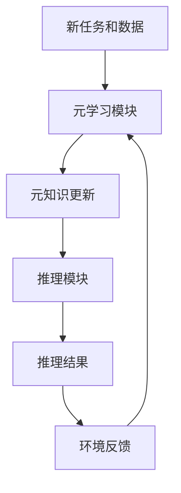

# 元学习框架下的终身推理能力动态调整

> 关键词：元学习、终身推理、动态调整、学习框架、智能系统

> 摘要：本文聚焦于元学习框架下的终身推理能力动态调整这一前沿课题。随着人工智能技术的不断发展，智能系统需要具备持续学习和动态适应环境变化的能力，终身推理能力的动态调整显得尤为重要。元学习作为一种强大的学习范式，为实现这一目标提供了有效的途径。文章深入探讨了元学习和终身推理的核心概念及其联系，详细阐述了相关算法原理和具体操作步骤，借助数学模型和公式对其本质进行剖析，并通过项目实战展示了代码实现和实际应用场景。同时，推荐了相关的学习资源、开发工具和论文著作，最后对未来发展趋势与挑战进行了总结，旨在为相关领域的研究和实践提供全面而深入的参考。

## 1. 背景介绍 
### 1.1 目的和范围
在当今快速变化的环境中，智能系统面临着不断涌现的新任务和新数据。传统的机器学习方法往往需要大量的数据进行训练，且难以快速适应新的任务和环境变化。元学习（Meta - Learning）作为一种新型的学习范式，旨在让智能系统学会如何学习，从而能够快速适应新的任务。终身推理能力动态调整则是在元学习的基础上，使智能系统能够在整个生命周期内持续优化其推理能力，以应对不断变化的环境和任务需求。

本文的范围涵盖了元学习框架下终身推理能力动态调整的理论基础、算法原理、数学模型、项目实战以及实际应用场景等方面。通过对这些内容的详细阐述，希望能够为研究人员和开发者提供一个全面的技术参考，推动相关领域的发展。

### 1.2 预期读者
本文预期读者包括人工智能领域的研究人员、机器学习工程师、软件开发者以及对元学习和终身学习感兴趣的技术爱好者。对于希望深入了解元学习和终身推理能力动态调整的原理、算法和应用的读者，本文将提供有价值的信息和指导。

### 1.3 文档结构概述
本文将按照以下结构进行组织：
- 核心概念与联系：介绍元学习、终身推理等核心概念及其相互关系，通过文本示意图和 Mermaid 流程图进行直观展示。
- 核心算法原理 & 具体操作步骤：详细讲解元学习框架下终身推理能力动态调整的核心算法，使用 Python 源代码进行阐述，并给出具体的操作步骤。
- 数学模型和公式 & 详细讲解 & 举例说明：通过数学模型和公式对算法原理进行深入分析，并结合具体例子进行说明。
- 项目实战：代码实际案例和详细解释说明，包括开发环境搭建、源代码详细实现和代码解读。
- 实际应用场景：介绍元学习框架下终身推理能力动态调整在不同领域的实际应用场景。
- 工具和资源推荐：推荐相关的学习资源、开发工具框架和论文著作。
- 总结：未来发展趋势与挑战：对元学习框架下终身推理能力动态调整的未来发展趋势和面临的挑战进行总结。
- 附录：常见问题与解答：解答读者在阅读过程中可能遇到的常见问题。
- 扩展阅读 & 参考资料：提供相关的扩展阅读材料和参考资料。

### 1.4 术语表
#### 1.4.1 核心术语定义
- **元学习（Meta - Learning）**：也称为“学习如何学习”，是一种旨在让模型从多个学习任务中学习通用的学习策略和知识，从而能够快速适应新任务的学习范式。
- **终身推理（Lifelong Reasoning）**：指智能系统在整个生命周期内持续进行推理，并根据新的知识和经验不断调整和优化其推理能力的过程。
- **动态调整（Dynamic Adjustment）**：在终身推理过程中，根据环境变化、新任务需求等因素，实时调整推理策略和模型参数的过程。

#### 1.4.2 相关概念解释
- **学习任务（Learning Task）**：指需要智能系统学习和解决的具体问题，例如图像分类、语音识别等。
- **元知识（Meta - Knowledge）**：在元学习中，从多个学习任务中学习到的通用知识和策略，用于指导新任务的学习。
- **推理能力（Reasoning Ability）**：智能系统根据已知信息和知识，推导出未知信息和结论的能力。

#### 1.4.3 缩略词列表
- **MAML（Model - Agnostic Meta - Learning）**：模型无关元学习，一种经典的元学习算法。
- **RL（Reinforcement Learning）**：强化学习，一种通过智能体与环境交互来学习最优策略的学习方法。

## 2. 核心概念与联系 

### 核心概念原理
#### 元学习原理
元学习的核心思想是在多个学习任务上进行训练，学习到通用的学习策略和知识，使得模型能够快速适应新的任务。传统的机器学习方法通常是在单个任务上进行训练，而元学习则考虑了多个任务之间的共性和差异。例如，在图像分类任务中，不同的数据集可能有不同的类别和图像特征，但它们都涉及到图像的特征提取和分类决策。元学习通过在多个这样的任务上进行学习，能够找到通用的特征提取方法和分类策略，从而在新的图像分类任务上快速收敛。

#### 终身推理原理
终身推理强调智能系统在整个生命周期内持续进行推理。随着时间的推移，智能系统会不断接收到新的数据和知识，需要根据这些新信息来更新自己的推理模型和策略。例如，在一个智能客服系统中，随着用户问题的不断变化和新的业务规则的出现，系统需要不断调整自己的推理策略，以准确回答用户的问题。

#### 动态调整原理
动态调整是在终身推理过程中，根据环境变化、新任务需求等因素实时调整推理策略和模型参数。例如，在一个自动驾驶系统中，当道路状况、交通规则或天气条件发生变化时，系统需要动态调整自己的决策策略，以确保行驶的安全和高效。

### 架构的文本示意图
元学习框架下的终身推理能力动态调整架构可以描述如下：

智能系统包含一个元学习模块和一个推理模块。元学习模块从多个学习任务中学习元知识，这些元知识包括通用的学习策略、模型初始化参数等。推理模块根据当前的任务和环境信息，利用元知识进行推理。在终身学习过程中，系统不断接收到新的任务和数据，元学习模块会根据这些新信息更新元知识，推理模块则根据更新后的元知识动态调整推理策略和模型参数。

### Mermaid 流程图


这个流程图展示了元学习框架下终身推理能力动态调整的过程。新任务和数据输入到元学习模块，元学习模块更新元知识，推理模块利用更新后的元知识进行推理，得到推理结果。环境反馈会再次输入到元学习模块，形成一个闭环的学习和推理过程。

## 3. 核心算法原理 & 具体操作步骤 

### 核心算法原理
#### Model - Agnostic Meta - Learning (MAML)
MAML 是一种经典的元学习算法，其核心思想是找到一个通用的模型初始化参数，使得模型在经过少量的梯度更新后，能够在新的任务上快速收敛。具体来说，MAML 的训练过程包括两个阶段：

1. **元训练阶段**：
   - 从任务分布中采样一组任务。
   - 对于每个任务，使用当前的模型参数进行前向传播，计算损失。
   - 对每个任务的损失进行梯度计算，得到局部梯度。
   - 使用局部梯度对模型参数进行一次梯度更新，得到临时参数。
   - 再次使用临时参数在同一个任务上进行前向传播，计算元损失。
   - 对元损失进行梯度计算，得到元梯度。
   - 使用元梯度更新模型的初始参数。

2. **元测试阶段**：
   - 给定一个新的任务。
   - 使用元训练得到的初始参数，在新任务上进行少量的梯度更新。
   - 使用更新后的模型进行推理。

### Python 源代码实现
```python
import torch
import torch.nn as nn
import torch.optim as optim

# 定义一个简单的神经网络模型
class SimpleNet(nn.Module):
    def __init__(self, input_size, hidden_size, output_size):
        super(SimpleNet, self).__init__()
        self.fc1 = nn.Linear(input_size, hidden_size)
        self.relu = nn.ReLU()
        self.fc2 = nn.Linear(hidden_size, output_size)

    def forward(self, x):
        out = self.fc1(x)
        out = self.relu(out)
        out = self.fc2(out)
        return out

# 定义 MAML 算法
class MAML:
    def __init__(self, model, inner_lr, meta_lr):
        self.model = model
        self.inner_lr = inner_lr
        self.meta_lr = meta_lr
        self.meta_optimizer = optim.Adam(self.model.parameters(), lr=meta_lr)

    def inner_update(self, task_data, fast_weights=None):
        if fast_weights is None:
            fast_weights = self.model.parameters()
        criterion = nn.CrossEntropyLoss()
        for x, y in task_data:
            logits = self.model(x)
            loss = criterion(logits, y)
            grads = torch.autograd.grad(loss, fast_weights)
            fast_weights = [w - self.inner_lr * g for w, g in zip(fast_weights, grads)]
        return fast_weights

    def meta_train(self, task_distribution, num_tasks, num_updates):
        meta_losses = []
        for _ in range(num_tasks):
            task_data = task_distribution.sample_task()
            fast_weights = self.inner_update(task_data)
            meta_loss = 0
            for x, y in task_data:
                logits = self.model.forward_with_weights(x, fast_weights)
                loss = nn.CrossEntropyLoss()(logits, y)
                meta_loss += loss
            meta_losses.append(meta_loss)
        meta_loss = sum(meta_losses) / num_tasks
        self.meta_optimizer.zero_grad()
        meta_loss.backward()
        self.meta_optimizer.step()
        return meta_loss

    def meta_test(self, new_task_data, num_updates):
        fast_weights = self.model.parameters()
        for _ in range(num_updates):
            fast_weights = self.inner_update(new_task_data, fast_weights)
        test_loss = 0
        criterion = nn.CrossEntropyLoss()
        for x, y in new_task_data:
            logits = self.model.forward_with_weights(x, fast_weights)
            loss = criterion(logits, y)
            test_loss += loss
        return test_loss
```

### 具体操作步骤
1. **模型初始化**：定义一个神经网络模型，并初始化其参数。
2. **元训练**：
   - 定义任务分布，从任务分布中采样任务。
   - 对于每个采样的任务，进行内部更新，得到临时参数。
   - 使用临时参数计算元损失，并更新模型的初始参数。
3. **元测试**：
   - 给定一个新的任务。
   - 使用元训练得到的初始参数，在新任务上进行少量的内部更新。
   - 使用更新后的模型进行推理，并计算测试损失。

## 4. 数学模型和公式 & 详细讲解 & 举例说明 

### 数学模型
在 MAML 算法中，我们的目标是找到一个通用的模型参数 $\theta$，使得模型在经过少量的梯度更新后，能够在新的任务上取得较好的性能。

设 $T$ 是任务分布，对于一个任务 $\tau \in T$，其训练数据为 $D_{\tau}^{train}$，测试数据为 $D_{\tau}^{test}$。模型的损失函数为 $L(\theta, D)$，其中 $\theta$ 是模型参数，$D$ 是数据。

在元训练阶段，我们的目标是最小化元损失：

$$\min_{\theta} \sum_{\tau \in T} L(\theta', D_{\tau}^{test})$$

其中 $\theta'$ 是在任务 $\tau$ 上经过一次梯度更新后的参数，即：

$$\theta' = \theta - \alpha \nabla_{\theta} L(\theta, D_{\tau}^{train})$$

这里 $\alpha$ 是内部学习率。

### 详细讲解
元损失的目标是使得模型在经过一次梯度更新后，能够在测试数据上取得较小的损失。通过最小化元损失，我们可以找到一个通用的初始参数 $\theta$，使得模型能够快速适应新的任务。

在内部更新过程中，我们使用当前的模型参数 $\theta$ 和训练数据 $D_{\tau}^{train}$ 计算损失，并对损失进行梯度计算，得到梯度 $\nabla_{\theta} L(\theta, D_{\tau}^{train})$。然后使用内部学习率 $\alpha$ 对模型参数进行更新，得到临时参数 $\theta'$。

在元更新过程中，我们使用临时参数 $\theta'$ 和测试数据 $D_{\tau}^{test}$ 计算元损失，并对元损失进行梯度计算，得到元梯度。最后使用元学习率对模型的初始参数 $\theta$ 进行更新。

### 举例说明
假设我们有一个简单的线性回归任务，任务的目标是根据输入 $x$ 预测输出 $y$。模型的参数为 $\theta = [w, b]$，其中 $w$ 是权重，$b$ 是偏置。损失函数为均方误差损失：

$$L(\theta, D) = \frac{1}{n} \sum_{i = 1}^{n} (y_i - (w x_i + b))^2$$

其中 $n$ 是数据的数量，$(x_i, y_i)$ 是第 $i$ 个数据点。

在元训练阶段，我们从任务分布中采样一个任务 $\tau$，其训练数据为 $D_{\tau}^{train} = \{(x_1, y_1), (x_2, y_2)\}$。当前的模型参数为 $\theta = [w_0, b_0]$。

首先进行内部更新：

$$\nabla_{\theta} L(\theta, D_{\tau}^{train}) = \left[\frac{\partial L}{\partial w}, \frac{\partial L}{\partial b}\right]$$

$$\theta' = \theta - \alpha \nabla_{\theta} L(\theta, D_{\tau}^{train})$$

然后使用临时参数 $\theta'$ 和测试数据 $D_{\tau}^{test}$ 计算元损失，并进行元更新。

## 5. 项目实战：代码实际案例和详细解释说明 

### 5.1  开发环境搭建
#### 安装 Python
首先，确保你已经安装了 Python 3.x 版本。可以从 Python 官方网站（https://www.python.org/downloads/） 下载并安装。

#### 安装深度学习框架
我们使用 PyTorch 作为深度学习框架。可以使用以下命令安装 PyTorch：

```bash
pip install torch torchvision
```

#### 安装其他依赖库
还需要安装一些其他的依赖库，如 NumPy、Matplotlib 等：

```bash
pip install numpy matplotlib
```

### 5.2  源代码详细实现和代码解读
```python
import torch
import torch.nn as nn
import torch.optim as optim
import numpy as np
import matplotlib.pyplot as plt

# 定义一个简单的神经网络模型
class SimpleNet(nn.Module):
    def __init__(self, input_size, hidden_size, output_size):
        super(SimpleNet, self).__init__()
        self.fc1 = nn.Linear(input_size, hidden_size)
        self.relu = nn.ReLU()
        self.fc2 = nn.Linear(hidden_size, output_size)

    def forward(self, x):
        out = self.fc1(x)
        out = self.relu(out)
        out = self.fc2(out)
        return out

# 定义 MAML 算法
class MAML:
    def __init__(self, model, inner_lr, meta_lr):
        self.model = model
        self.inner_lr = inner_lr
        self.meta_lr = meta_lr
        self.meta_optimizer = optim.Adam(self.model.parameters(), lr=meta_lr)

    def inner_update(self, task_data, fast_weights=None):
        if fast_weights is None:
            fast_weights = list(self.model.parameters())
        criterion = nn.MSELoss()
        for x, y in task_data:
            logits = self.model.forward_with_weights(x, fast_weights)
            loss = criterion(logits, y)
            grads = torch.autograd.grad(loss, fast_weights)
            fast_weights = [w - self.inner_lr * g for w, g in zip(fast_weights, grads)]
        return fast_weights

    def meta_train(self, task_distribution, num_tasks, num_updates):
        meta_losses = []
        for _ in range(num_tasks):
            task_data = task_distribution.sample_task()
            fast_weights = self.inner_update(task_data)
            meta_loss = 0
            for x, y in task_data:
                logits = self.model.forward_with_weights(x, fast_weights)
                loss = nn.MSELoss()(logits, y)
                meta_loss += loss
            meta_losses.append(meta_loss)
        meta_loss = sum(meta_losses) / num_tasks
        self.meta_optimizer.zero_grad()
        meta_loss.backward()
        self.meta_optimizer.step()
        return meta_loss

    def meta_test(self, new_task_data, num_updates):
        fast_weights = list(self.model.parameters())
        for _ in range(num_updates):
            fast_weights = self.inner_update(new_task_data, fast_weights)
        test_loss = 0
        criterion = nn.MSELoss()
        for x, y in new_task_data:
            logits = self.model.forward_with_weights(x, fast_weights)
            loss = criterion(logits, y)
            test_loss += loss
        return test_loss

# 定义任务分布
class TaskDistribution:
    def __init__(self, num_tasks, input_size, output_size):
        self.num_tasks = num_tasks
        self.input_size = input_size
        self.output_size = output_size

    def sample_task(self):
        # 生成随机数据
        x = torch.randn(10, self.input_size)
        y = torch.randn(10, self.output_size)
        return [(x, y)]

# 初始化模型和 MAML 算法
input_size = 1
hidden_size = 10
output_size = 1
model = SimpleNet(input_size, hidden_size, output_size)
maml = MAML(model, inner_lr=0.01, meta_lr=0.001)

# 任务分布
task_distribution = TaskDistribution(num_tasks=100, input_size=input_size, output_size=output_size)

# 元训练
num_epochs = 100
meta_losses = []
for epoch in range(num_epochs):
    meta_loss = maml.meta_train(task_distribution, num_tasks=10, num_updates=5)
    meta_losses.append(meta_loss.item())
    print(f'Epoch {epoch}: Meta Loss = {meta_loss.item()}')

# 绘制元损失曲线
plt.plot(meta_losses)
plt.xlabel('Epoch')
plt.ylabel('Meta Loss')
plt.title('Meta Training Loss')
plt.show()

# 元测试
new_task_data = task_distribution.sample_task()
test_loss = maml.meta_test(new_task_data, num_updates=5)
print(f'Test Loss: {test_loss.item()}')
```

### 5.3  代码解读与分析
#### 模型定义
`SimpleNet` 类定义了一个简单的神经网络模型，包含一个输入层、一个隐藏层和一个输出层。

#### MAML 算法实现
`MAML` 类实现了 MAML 算法的核心功能，包括内部更新和元训练、元测试。

#### 任务分布
`TaskDistribution` 类定义了任务分布，用于生成随机的任务数据。

#### 元训练
在元训练阶段，我们从任务分布中采样任务，进行内部更新和元更新，不断更新模型的初始参数。

#### 元测试
在元测试阶段，我们给定一个新的任务，使用元训练得到的初始参数进行少量的内部更新，然后计算测试损失。

#### 损失曲线绘制
我们使用 Matplotlib 库绘制元训练过程中的元损失曲线，以便观察训练过程的收敛情况。

## 6. 实际应用场景 

### 自然语言处理
在自然语言处理中，元学习框架下的终身推理能力动态调整可以应用于多个方面。例如，在文本分类任务中，不同的领域可能有不同的文本特征和分类标准。通过元学习，模型可以学习到通用的文本特征提取和分类策略，当遇到新的领域时，能够快速调整分类策略，提高分类准确率。

在机器翻译任务中，语言之间的语法和语义差异很大。元学习可以帮助模型学习到不同语言之间的通用翻译模式，当遇到新的语言对时，能够快速适应并进行准确的翻译。

### 计算机视觉
在计算机视觉领域，图像识别任务面临着不断变化的场景和目标。元学习可以让模型从多个图像识别任务中学习到通用的特征提取方法，当遇到新的图像类别或场景时，能够快速调整识别策略。

在目标检测任务中，不同的场景可能有不同的目标分布和特征。通过元学习，模型可以学习到通用的目标检测策略，当遇到新的场景时，能够快速适应并准确检测目标。

### 自动驾驶
在自动驾驶系统中，环境和交通规则不断变化。元学习框架下的终身推理能力动态调整可以让自动驾驶系统从多个驾驶场景中学习到通用的决策策略，当遇到新的路况、天气条件或交通规则变化时，能够快速调整驾驶策略，确保行驶的安全和高效。

### 医疗诊断
在医疗诊断领域，疾病的种类和症状不断变化。元学习可以帮助医疗诊断系统从多个病例中学习到通用的诊断策略，当遇到新的疾病或症状时，能够快速调整诊断方法，提高诊断准确率。

## 7. 工具和资源推荐
### 7.1 学习资源推荐
#### 7.1.1 书籍推荐
- 《Deep Learning》（Ian Goodfellow、Yoshua Bengio 和 Aaron Courville 著）：深度学习领域的经典书籍，介绍了深度学习的基本原理和算法。
- 《Reinforcement Learning: An Introduction》（Richard S. Sutton 和 Andrew G. Barto 著）：强化学习领域的经典书籍，介绍了强化学习的基本概念和算法。
- 《Meta - Learning: A Survey》（Antreas Antoniou 等著）：元学习领域的综述性书籍，详细介绍了元学习的各种方法和应用。

#### 7.1.2 在线课程
- Coursera 上的“Deep Learning Specialization”：由 Andrew Ng 教授讲授的深度学习系列课程，涵盖了深度学习的各个方面。
- edX 上的“Reinforcement Learning”：介绍了强化学习的基本概念和算法。
- OpenAI 的“Spinning Up in Deep Reinforcement Learning”：提供了强化学习的实践教程和代码示例。

#### 7.1.3 技术博客和网站
- Medium 上的 AI 相关博客：有很多关于元学习、深度学习和强化学习的技术文章。
- arXiv.org：提供了大量的学术论文，包括元学习领域的最新研究成果。
- Towards Data Science：一个专注于数据科学和人工智能的技术博客，有很多实用的技术文章和案例分析。

### 7.2 开发工具框架推荐
#### 7.2.1 IDE和编辑器
- PyCharm：一款功能强大的 Python 集成开发环境，提供了代码编辑、调试、版本控制等功能。
- Jupyter Notebook：一个交互式的开发环境，适合进行数据探索和模型实验。
- Visual Studio Code：一款轻量级的代码编辑器，支持多种编程语言和插件扩展。

#### 7.2.2 调试和性能分析工具
- PyTorch Profiler：PyTorch 提供的性能分析工具，可以帮助用户分析模型的性能瓶颈。
- TensorBoard：一个可视化工具，可以帮助用户可视化模型的训练过程和性能指标。
- cProfile：Python 内置的性能分析工具，可以帮助用户分析代码的性能瓶颈。

#### 7.2.3 相关框架和库
- PyTorch：一个开源的深度学习框架，提供了丰富的深度学习模型和工具。
- TensorFlow：另一个流行的深度学习框架，具有强大的分布式训练和部署能力。
- Scikit - learn：一个机器学习库，提供了各种机器学习算法和工具。

### 7.3 相关论文著作推荐
#### 7.3.1 经典论文
- “Model - Agnostic Meta - Learning for Fast Adaptation of Deep Networks”（Chelsea Finn 等著）：介绍了 MAML 算法的原理和实现。
- “Matching Networks for One Shot Learning”（Oriol Vinyals 等著）：提出了匹配网络用于一次性学习的方法。
- “Prototypical Networks for Few - Shot Learning”（Jake Snell 等著）：介绍了原型网络用于少样本学习的方法。

#### 7.3.2 最新研究成果
- 关注 arXiv.org 上的最新论文，了解元学习领域的最新研究进展。
- 参加相关的学术会议，如 NeurIPS、ICML 等，获取最新的研究成果。

#### 7.3.3 应用案例分析
- 一些技术博客和网站会分享元学习在不同领域的应用案例，可以从中学习到实际应用的经验和技巧。

## 8. 总结：未来发展趋势与挑战

### 未来发展趋势
#### 多模态元学习
随着数据类型的不断丰富，未来的元学习将更加注重多模态数据的处理。例如，结合图像、文本和语音等多种模态的数据进行学习，以提高模型的泛化能力和适应能力。

#### 与强化学习的深度融合
元学习和强化学习的结合将是未来的一个重要发展方向。通过元学习学习到通用的学习策略，再结合强化学习进行环境交互和决策优化，可以提高智能系统的性能和适应性。

#### 终身学习系统的规模化应用
随着计算能力的不断提升和算法的不断优化，终身学习系统将在更多的领域得到规模化应用。例如，在工业自动化、智能家居等领域，终身学习系统可以持续优化系统的性能，提高生产效率和用户体验。

### 挑战
#### 计算资源需求
元学习和终身推理能力动态调整通常需要大量的计算资源。随着任务的增加和模型的复杂度提高，计算资源的需求将进一步增加。如何在有限的计算资源下实现高效的元学习和终身推理是一个亟待解决的问题。

#### 数据隐私和安全
在终身学习过程中，智能系统会不断接收到新的数据。如何保护这些数据的隐私和安全，防止数据泄露和恶意攻击是一个重要的挑战。

#### 模型可解释性
元学习和终身推理模型通常比较复杂，其决策过程难以解释。如何提高模型的可解释性，让用户理解模型的决策依据，是未来需要解决的问题之一。

## 9. 附录：常见问题与解答

### 问题 1：元学习和传统机器学习有什么区别？
元学习的目标是学习如何学习，从多个学习任务中学习通用的学习策略和知识，以便快速适应新的任务。而传统机器学习通常是在单个任务上进行训练，模型的泛化能力和适应新任务的能力相对较弱。

### 问题 2：MAML 算法的复杂度如何？
MAML 算法的复杂度主要取决于模型的复杂度、任务的数量和内部更新的次数。在实际应用中，需要根据具体情况进行优化，以降低计算复杂度。

### 问题 3：如何选择合适的内部学习率和元学习率？
内部学习率和元学习率的选择通常需要通过实验进行调整。一般来说，可以从较小的学习率开始，逐步调整，观察模型的训练效果和收敛情况。

### 问题 4：元学习在少样本学习中的应用效果如何？
元学习在少样本学习中具有很好的应用效果。通过从多个任务中学习元知识，模型可以在少量样本的情况下快速适应新的任务，提高分类准确率。

## 10. 扩展阅读 & 参考资料
- Finn, C., Abbeel, P., & Levine, S. (2017). Model - Agnostic Meta - Learning for Fast Adaptation of Deep Networks. arXiv preprint arXiv:1703.03400.
- Vinyals, O., Blundell, C., Lillicrap, T., Wierstra, D., & others. (2016). Matching Networks for One Shot Learning. In Advances in neural information processing systems (pp. 3630 - 3638).
- Snell, J., Swersky, K., & Zemel, R. S. (2017). Prototypical Networks for Few - Shot Learning. arXiv preprint arXiv:1703.05175.
- Goodfellow, I., Bengio, Y., & Courville, A. (2016). Deep Learning. MIT press.
- Sutton, R. S., & Barto, A. G. (2018). Reinforcement Learning: An Introduction. MIT press.