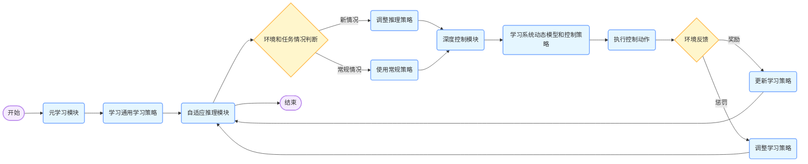

# 元强化学习驱动的自适应推理深度控制

> 关键词：元强化学习、自适应推理、深度控制、智能决策、学习效率

> 摘要：本文围绕元强化学习驱动的自适应推理深度控制展开深入探讨。首先介绍相关背景知识，明确研究目的、范围、预期读者及文档结构。接着阐述核心概念及其联系，包括原理和架构的文本示意图与Mermaid流程图。详细讲解核心算法原理，结合Python源代码进行具体操作步骤的说明。深入分析数学模型和公式，并举例阐释。通过项目实战展示代码实际案例并进行详细解释。探讨该技术的实际应用场景，推荐相关工具和资源，涵盖学习资源、开发工具框架以及论文著作等。最后总结未来发展趋势与挑战，解答常见问题并提供扩展阅读和参考资料，旨在全面深入地剖析元强化学习驱动的自适应推理深度控制这一前沿技术。

## 1. 背景介绍 
### 1.1 目的和范围
元强化学习驱动的自适应推理深度控制旨在解决传统强化学习在复杂动态环境下学习效率低、适应性差的问题。通过元学习的思想，让智能体能够快速适应新的任务和环境变化，实现高效的自适应推理和深度控制。本研究的范围涵盖从理论基础的探讨，到算法的设计与优化，再到实际应用场景的验证，旨在为相关领域的研究和应用提供全面的技术支持。

### 1.2 预期读者
本文预期读者包括人工智能、机器学习、控制理论等相关领域的研究人员、工程师和学生。对于希望深入了解元强化学习和自适应推理深度控制技术的专业人士，以及对智能决策和控制领域感兴趣的初学者都具有参考价值。

### 1.3 文档结构概述
本文首先介绍背景知识，让读者对研究的目的和意义有清晰的认识。接着阐述核心概念及其联系，为后续的算法和模型讲解奠定基础。详细讲解核心算法原理和具体操作步骤，通过Python代码进行说明。深入分析数学模型和公式，并举例说明。通过项目实战展示代码的实际应用和详细解释。探讨实际应用场景，推荐相关工具和资源。最后总结未来发展趋势与挑战，解答常见问题并提供扩展阅读和参考资料。

### 1.4 术语表
#### 1.4.1 核心术语定义
- **元强化学习（Meta-Reinforcement Learning）**：是一种强化学习的扩展，旨在让智能体能够快速学习如何学习，通过在多个相关任务上进行训练，获取通用的学习策略，从而能够在新的任务上快速适应和学习。
- **自适应推理（Adaptive Inference）**：指智能体在面对不断变化的环境和任务时，能够根据当前的情况动态地调整推理策略，以实现高效准确的决策。
- **深度控制（Deep Control）**：利用深度神经网络来实现复杂系统的控制，通过学习系统的动态模型和最优控制策略，实现对系统的精确控制。

#### 1.4.2 相关概念解释
- **强化学习（Reinforcement Learning）**：是一种通过智能体与环境进行交互，根据环境反馈的奖励信号来学习最优行为策略的机器学习方法。
- **元学习（Meta-Learning）**：也称为“学习如何学习”，旨在学习一种通用的学习策略，使得智能体能够在新的任务上快速学习和适应。
- **深度神经网络（Deep Neural Network）**：是一种由多个神经元层组成的神经网络，能够自动学习数据的复杂特征和模式。

#### 1.4.3 缩略词列表
- **RL**：Reinforcement Learning（强化学习）
- **MRL**：Meta-Reinforcement Learning（元强化学习）
- **DNN**：Deep Neural Network（深度神经网络）

## 2. 核心概念与联系 

### 核心概念原理
元强化学习驱动的自适应推理深度控制结合了元强化学习、自适应推理和深度控制三个核心概念。元强化学习通过在多个相关任务上进行训练，让智能体学习到一种通用的学习策略，使得智能体能够快速适应新的任务和环境变化。自适应推理则是在元强化学习的基础上，让智能体能够根据当前的环境和任务情况，动态地调整推理策略，以实现高效准确的决策。深度控制利用深度神经网络来学习系统的动态模型和最优控制策略，实现对系统的精确控制。

### 架构的文本示意图
元强化学习驱动的自适应推理深度控制架构主要包括元学习模块、自适应推理模块和深度控制模块。元学习模块负责在多个相关任务上进行训练，学习通用的学习策略。自适应推理模块根据当前的环境和任务情况，动态地调整推理策略。深度控制模块利用深度神经网络来学习系统的动态模型和最优控制策略，实现对系统的精确控制。三个模块相互协作，形成一个闭环的智能决策和控制系统。

### Mermaid流程图


## 3. 核心算法原理 & 具体操作步骤 

### 核心算法原理
元强化学习驱动的自适应推理深度控制的核心算法基于元强化学习算法，如MAML（Model-Agnostic Meta-Learning）。MAML的核心思想是通过在多个任务上进行训练，找到一个初始的模型参数，使得模型在经过少量的梯度更新后，能够在新的任务上快速收敛到最优解。

### Python源代码详细阐述
以下是一个简化的MAML算法的Python实现示例：

```python
import torch
import torch.nn as nn
import torch.optim as optim

# 定义一个简单的神经网络模型
class SimpleNet(nn.Module):
    def __init__(self):
        super(SimpleNet, self).__init__()
        self.fc1 = nn.Linear(10, 20)
        self.fc2 = nn.Linear(20, 1)

    def forward(self, x):
        x = torch.relu(self.fc1(x))
        x = self.fc2(x)
        return x

# 定义元训练函数
def meta_train(model, tasks, inner_lr, outer_lr, num_inner_steps, num_outer_steps):
    meta_optimizer = optim.Adam(model.parameters(), lr=outer_lr)

    for outer_step in range(num_outer_steps):
        meta_loss = 0

        for task in tasks:
            # 复制模型参数
            fast_weights = list(model.parameters())

            # 内循环训练
            for inner_step in range(num_inner_steps):
                inputs, labels = task.sample_batch()
                outputs = model.forward_with_weights(inputs, fast_weights)
                loss = nn.MSELoss()(outputs, labels)
                grads = torch.autograd.grad(loss, fast_weights)
                fast_weights = [w - inner_lr * g for w, g in zip(fast_weights, grads)]

            # 计算元损失
            inputs, labels = task.sample_batch()
            outputs = model.forward_with_weights(inputs, fast_weights)
            meta_loss += nn.MSELoss()(outputs, labels)

        # 元优化步骤
        meta_optimizer.zero_grad()
        meta_loss.backward()
        meta_optimizer.step()

    return model

# 示例使用
model = SimpleNet()
tasks = [...]  # 定义任务列表
inner_lr = 0.01
outer_lr = 0.001
num_inner_steps = 5
num_outer_steps = 100

trained_model = meta_train(model, tasks, inner_lr, outer_lr, num_inner_steps, num_outer_steps)
```

### 具体操作步骤
1. **定义任务分布**：首先需要定义一组相关的任务，这些任务可以来自不同的环境或具有不同的目标。
2. **初始化模型参数**：初始化一个神经网络模型的参数。
3. **元训练过程**：
    - **内循环训练**：对于每个任务，使用当前的模型参数进行少量的梯度更新，得到快速适应的模型参数。
    - **外循环优化**：计算所有任务上的元损失，使用元优化器更新模型的初始参数。
4. **自适应推理和深度控制**：在新的任务上，使用训练好的模型参数进行自适应推理，根据当前的环境和任务情况动态调整推理策略，并利用深度控制模块实现对系统的精确控制。

## 4. 数学模型和公式 & 详细讲解 & 举例说明 

### 数学模型
元强化学习驱动的自适应推理深度控制的数学模型可以基于强化学习的框架进行描述。假设智能体与环境进行交互，在每个时间步 $t$，智能体根据当前的状态 $s_t$ 选择一个动作 $a_t$，环境根据动作 $a_t$ 转移到下一个状态 $s_{t+1}$ 并返回一个奖励 $r_t$。智能体的目标是最大化长期累积奖励 $R = \sum_{t=0}^{T} \gamma^t r_t$，其中 $\gamma$ 是折扣因子。

### 公式详细讲解
- **策略网络**：智能体的策略 $\pi(a_t|s_t; \theta)$ 表示在状态 $s_t$ 下选择动作 $a_t$ 的概率，其中 $\theta$ 是策略网络的参数。
- **价值网络**：价值函数 $V(s_t; \phi)$ 表示在状态 $s_t$ 下的预期累积奖励，其中 $\phi$ 是价值网络的参数。
- **元学习目标**：元学习的目标是找到一个初始的模型参数 $\theta_0$，使得在新的任务上，经过少量的梯度更新后，模型能够快速收敛到最优解。可以表示为：
$$\min_{\theta_0} \sum_{\tau \in \mathcal{T}} \mathcal{L}(\theta_{\tau}^K)$$
其中 $\mathcal{T}$ 是任务集合，$\theta_{\tau}^K$ 是在任务 $\tau$ 上经过 $K$ 次梯度更新后的模型参数。

### 举例说明
假设我们有一个机器人控制任务，机器人需要在不同的环境中移动到目标位置。每个环境可以看作是一个不同的任务。我们可以使用元强化学习来训练机器人的策略网络和价值网络，使得机器人能够快速适应新的环境。在新的环境中，机器人根据当前的状态进行自适应推理，选择最优的动作，实现对自身的深度控制，最终到达目标位置。

## 5. 项目实战：代码实际案例和详细解释说明 

### 5.1  开发环境搭建
- **操作系统**：推荐使用Linux或macOS，也可以使用Windows。
- **编程语言**：Python 3.x
- **深度学习框架**：PyTorch
- **安装依赖库**：可以使用以下命令安装所需的库：
```sh
pip install torch numpy matplotlib
```

### 5.2  源代码详细实现和代码解读
以下是一个简单的机器人导航任务的项目实战代码示例：

```python
import torch
import torch.nn as nn
import torch.optim as optim
import numpy as np
import matplotlib.pyplot as plt

# 定义环境类
class RobotEnv:
    def __init__(self):
        self.state_dim = 4
        self.action_dim = 2
        self.target = np.array([10, 10])
        self.state = np.array([0, 0, 0, 0])

    def reset(self):
        self.state = np.array([0, 0, 0, 0])
        return self.state

    def step(self, action):
        self.state[:2] += action
        reward = -np.linalg.norm(self.state[:2] - self.target)
        done = np.linalg.norm(self.state[:2] - self.target) < 1
        return self.state, reward, done, {}

# 定义策略网络
class PolicyNet(nn.Module):
    def __init__(self, state_dim, action_dim):
        super(PolicyNet, self).__init__()
        self.fc1 = nn.Linear(state_dim, 20)
        self.fc2 = nn.Linear(20, action_dim)

    def forward(self, x):
        x = torch.relu(self.fc1(x))
        x = self.fc2(x)
        return x

# 定义训练函数
def train(env, policy_net, num_episodes, lr):
    optimizer = optim.Adam(policy_net.parameters(), lr=lr)
    rewards = []

    for episode in range(num_episodes):
        state = env.reset()
        episode_reward = 0
        done = False

        while not done:
            state_tensor = torch.FloatTensor(state).unsqueeze(0)
            action = policy_net(state_tensor).detach().numpy()[0]
            next_state, reward, done, _ = env.step(action)
            episode_reward += reward
            state = next_state

        optimizer.zero_grad()
        loss = -episode_reward
        loss.backward()
        optimizer.step()
        rewards.append(episode_reward)

    return rewards

# 主函数
if __name__ == "__main__":
    env = RobotEnv()
    policy_net = PolicyNet(env.state_dim, env.action_dim)
    num_episodes = 100
    lr = 0.001

    rewards = train(env, policy_net, num_episodes, lr)

    plt.plot(rewards)
    plt.xlabel('Episode')
    plt.ylabel('Reward')
    plt.show()
```

### 代码解读与分析
- **环境类 `RobotEnv`**：定义了机器人导航的环境，包括状态维度、动作维度、目标位置等。`reset` 方法用于重置环境状态，`step` 方法用于执行动作并返回下一个状态、奖励和是否完成的信息。
- **策略网络 `PolicyNet`**：定义了一个简单的神经网络，用于根据当前状态预测动作。
- **训练函数 `train`**：使用梯度下降法训练策略网络，通过不断与环境交互，最大化累积奖励。
- **主函数**：创建环境和策略网络，调用训练函数进行训练，并绘制奖励曲线。

## 6. 实际应用场景 
元强化学习驱动的自适应推理深度控制在许多领域都有广泛的应用：
- **机器人控制**：机器人在不同的环境中执行任务，如导航、抓取等，需要快速适应环境变化，元强化学习可以帮助机器人快速学习和调整控制策略。
- **自动驾驶**：自动驾驶车辆需要在复杂多变的交通环境中做出决策，元强化学习可以提高车辆的适应性和安全性。
- **游戏智能体**：在游戏中，智能体需要根据不同的游戏场景和对手策略进行决策，元强化学习可以让智能体快速适应新的游戏环境和对手。
- **资源管理**：在云计算、能源管理等领域，需要根据不同的资源需求和环境变化进行资源分配和调度，元强化学习可以实现高效的资源管理。

## 7. 工具和资源推荐
### 7.1 学习资源推荐
#### 7.1.1 书籍推荐
- 《Reinforcement Learning: An Introduction》：这是一本强化学习领域的经典教材，全面介绍了强化学习的基本概念、算法和应用。
- 《Deep Learning》：深度学习领域的权威书籍，介绍了深度神经网络的原理和应用。
- 《Meta-Learning: A Survey》：对元学习进行了全面的综述，包括元学习的算法、应用和未来发展方向。

#### 7.1.2 在线课程
- Coursera上的“Reinforcement Learning Specialization”：由DeepMind的研究人员授课，系统地介绍了强化学习的理论和实践。
- edX上的“Deep Learning Fundamentals”：介绍了深度学习的基本概念和算法。
- OpenAI的“Spinning Up in Deep Reinforcement Learning”：提供了强化学习的教程和代码实现。

#### 7.1.3 技术博客和网站
- OpenAI Blog：OpenAI发布的最新研究成果和技术文章。
- DeepMind Blog：DeepMind的官方博客，介绍了他们在人工智能领域的最新研究和应用。
- Towards Data Science：一个数据科学和机器学习领域的技术博客，有很多关于强化学习和元学习的文章。

### 7.2 开发工具框架推荐
#### 7.2.1 IDE和编辑器
- PyCharm：一个功能强大的Python集成开发环境，提供了代码编辑、调试、版本控制等功能。
- Jupyter Notebook：一个交互式的开发环境，适合进行数据探索和模型实验。
- Visual Studio Code：一个轻量级的代码编辑器，支持多种编程语言和插件。

#### 7.2.2 调试和性能分析工具
- PyTorch Profiler：PyTorch提供的性能分析工具，可以帮助开发者分析模型的性能瓶颈。
- TensorBoard：一个可视化工具，可以帮助开发者可视化模型的训练过程和性能指标。
- cProfile：Python内置的性能分析工具，可以帮助开发者分析代码的性能瓶颈。

#### 7.2.3 相关框架和库
- PyTorch：一个开源的深度学习框架，提供了丰富的深度学习模型和算法。
- TensorFlow：另一个流行的深度学习框架，也提供了丰富的深度学习模型和算法。
- Stable Baselines3：一个基于PyTorch的强化学习库，提供了多种强化学习算法的实现。

### 7.3 相关论文著作推荐
#### 7.3.1 经典论文
- “Model-Agnostic Meta-Learning for Fast Adaptation of Deep Networks”：介绍了MAML算法，是元学习领域的经典论文。
- “Proximal Policy Optimization Algorithms”：介绍了PPO算法，是一种高效的强化学习算法。
- “Deep Reinforcement Learning with Double Q-learning”：介绍了Double DQN算法，解决了传统DQN算法的高估问题。

#### 7.3.2 最新研究成果
- 关注NeurIPS、ICML、AAAI等顶级人工智能会议的最新研究成果，了解元强化学习和自适应推理深度控制领域的最新进展。

#### 7.3.3 应用案例分析
- 查看相关领域的应用案例论文，了解元强化学习驱动的自适应推理深度控制在实际应用中的效果和挑战。

## 8. 总结：未来发展趋势与挑战
### 未来发展趋势
- **多模态融合**：将元强化学习与多模态数据（如视觉、语音、触觉等）相结合，提高智能体的感知和决策能力。
- **跨领域应用**：将元强化学习应用到更多的领域，如医疗、金融、教育等，解决复杂的实际问题。
- **与人类协作**：研究元强化学习智能体与人类的协作机制，实现人机协同工作，提高工作效率和质量。

### 挑战
- **计算资源需求**：元强化学习通常需要大量的计算资源和时间，如何降低计算成本是一个挑战。
- **可解释性**：深度神经网络的黑盒性质使得元强化学习智能体的决策过程难以解释，如何提高智能体的可解释性是一个重要问题。
- **泛化能力**：如何提高元强化学习智能体在不同任务和环境中的泛化能力，使其能够快速适应新的情况，是未来研究的重点。

## 9. 附录：常见问题与解答
### 1. 元强化学习和传统强化学习有什么区别？
元强化学习旨在让智能体能够快速学习如何学习，通过在多个相关任务上进行训练，获取通用的学习策略，从而能够在新的任务上快速适应和学习。而传统强化学习通常是针对单个任务进行训练，学习效率较低，在新的任务上需要重新训练。

### 2. 元强化学习的计算复杂度高吗？
元强化学习通常需要在多个任务上进行训练，计算复杂度相对较高。但是，通过优化算法和使用高效的计算资源，可以在一定程度上降低计算成本。

### 3. 如何评估元强化学习智能体的性能？
可以使用多种指标来评估元强化学习智能体的性能，如平均奖励、学习速度、泛化能力等。在实际应用中，还需要根据具体的任务和需求选择合适的评估指标。

## 10. 扩展阅读 & 参考资料
### 扩展阅读
- [OpenAI官方文档](https://openai.com/)
- [DeepMind官方文档](https://deepmind.com/)
- [PyTorch官方文档](https://pytorch.org/)

### 参考资料
- Finn, C., Abbeel, P., & Levine, S. (2017). Model-agnostic meta-learning for fast adaptation of deep networks. In Proceedings of the 34th International Conference on Machine Learning-Volume 70 (pp. 1126-1135).
- Schulman, J., Wolski, F., Dhariwal, P., Radford, A., & Klimov, O. (2017). Proximal policy optimization algorithms. arXiv preprint arXiv:1707.06347.
- Hasselt, H. V., Guez, A., & Silver, D. (2015). Deep reinforcement learning with double Q-learning. In Thirtieth AAAI conference on artificial intelligence.