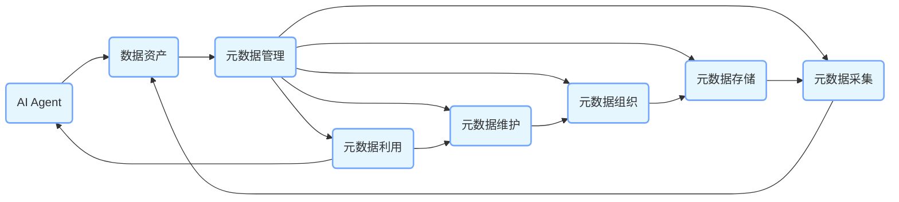

# 元数据管理：组织和利用AI Agent的数据资产

> 关键词：元数据管理、AI Agent、数据资产、组织、利用

> 摘要：本文围绕元数据管理在组织和利用AI Agent的数据资产方面展开深入探讨。首先介绍元数据管理的背景，包括其目的、预期读者等。接着阐述元数据管理的核心概念与联系，通过示意图和流程图展示其架构。详细讲解核心算法原理，并用Python代码进行说明，同时给出相关数学模型和公式。通过项目实战，展示元数据管理在实际中的应用和代码实现。分析元数据管理在不同场景下的实际应用，推荐相关的学习资源、开发工具和论文著作。最后总结元数据管理的未来发展趋势与挑战，并提供常见问题解答和参考资料，旨在为读者全面深入地了解元数据管理在AI Agent数据资产管理中的作用和实现方法提供有价值的参考。

## 1. 背景介绍 
### 1.1 目的和范围
随着人工智能技术的快速发展，AI Agent在各个领域的应用越来越广泛。AI Agent在运行过程中会产生大量的数据，这些数据资产对于提升AI Agent的性能、优化决策等具有重要价值。然而，这些数据往往具有复杂性、多样性和分散性的特点，给数据的管理和利用带来了挑战。元数据管理作为一种有效的数据管理方法，旨在通过对数据的描述性信息（元数据）进行组织和管理，提高数据的可发现性、可理解性和可重用性，从而更好地组织和利用AI Agent的数据资产。

本文的范围涵盖元数据管理的基本概念、核心算法、数学模型、项目实战、实际应用场景等方面，旨在为读者提供全面、深入的元数据管理知识，帮助读者掌握如何有效地组织和利用AI Agent的数据资产。

### 1.2 预期读者
本文的预期读者包括但不限于以下几类人群：
- 人工智能领域的研究人员和开发者，希望了解元数据管理在AI Agent数据资产管理中的应用，以提升AI Agent的性能和数据利用效率。
- 数据管理人员和分析师，对元数据管理有一定的了解，希望深入学习如何将元数据管理应用到AI Agent的数据管理中，提高数据的质量和价值。
- 企业的技术管理人员和决策者，关注AI Agent在企业中的应用和数据资产的管理，希望通过元数据管理提升企业的竞争力和创新能力。
- 对人工智能和数据管理感兴趣的学生和爱好者，希望通过本文了解元数据管理的基本原理和应用方法，拓宽自己的知识面。

### 1.3 文档结构概述
本文将按照以下结构进行组织：
1. **背景介绍**：介绍元数据管理的目的、范围、预期读者和文档结构概述，以及相关术语的定义和解释。
2. **核心概念与联系**：阐述元数据管理的核心概念，包括元数据、数据资产、AI Agent等，通过文本示意图和Mermaid流程图展示它们之间的关系和架构。
3. **核心算法原理 & 具体操作步骤**：详细讲解元数据管理的核心算法原理，并用Python代码进行说明，同时给出具体的操作步骤。
4. **数学模型和公式 & 详细讲解 & 举例说明**：给出元数据管理的数学模型和公式，并进行详细讲解，通过具体的例子说明其应用。
5. **项目实战：代码实际案例和详细解释说明**：通过一个实际的项目案例，展示元数据管理在AI Agent数据资产管理中的应用，包括开发环境搭建、源代码详细实现和代码解读。
6. **实际应用场景**：分析元数据管理在不同领域和场景下的实际应用，如医疗、金融、交通等。
7. **工具和资源推荐**：推荐相关的学习资源、开发工具和论文著作，帮助读者进一步深入学习和实践元数据管理。
8. **总结：未来发展趋势与挑战**：总结元数据管理的未来发展趋势和面临的挑战，为读者提供参考和思考。
9. **附录：常见问题与解答**：解答读者在学习和实践过程中可能遇到的常见问题。
10. **扩展阅读 & 参考资料**：提供相关的扩展阅读材料和参考资料，方便读者进一步深入研究。

### 1.4 术语表
#### 1.4.1 核心术语定义
- **元数据（Metadata）**：关于数据的数据，用于描述数据的定义、来源、结构、质量、使用方法等信息。元数据可以帮助用户更好地理解和管理数据。
- **数据资产（Data Asset）**：指企业或组织拥有的、具有一定价值的数据资源。数据资产可以是结构化数据、非结构化数据或半结构化数据，包括业务数据、客户数据、市场数据等。
- **AI Agent（人工智能代理）**：一种能够感知环境、自主决策并采取行动的智能实体。AI Agent可以是软件程序、机器人或其他智能设备，通过学习和推理来完成各种任务。
- **元数据管理（Metadata Management）**：对元数据进行采集、存储、组织、维护和利用的过程。元数据管理的目的是提高数据的可发现性、可理解性和可重用性，从而更好地管理和利用数据资产。

#### 1.4.2 相关概念解释
- **数据治理（Data Governance）**：指企业或组织对数据资产进行全面管理和控制的过程。数据治理包括数据策略制定、数据标准制定、数据质量管理、数据安全管理等方面，旨在确保数据的一致性、准确性、完整性和安全性。
- **数据仓库（Data Warehouse）**：一种用于存储和管理企业或组织历史数据的数据库系统。数据仓库通常采用星型或雪花型架构，对数据进行集成、清洗和转换，以便于数据分析和决策支持。
- **数据湖（Data Lake）**：一种用于存储和管理企业或组织原始数据的存储系统。数据湖可以存储各种类型的数据，包括结构化数据、非结构化数据和半结构化数据，采用“先存储后处理”的方式，为数据分析和挖掘提供了更丰富的数据资源。

#### 1.4.3 缩略词列表
- **ETL（Extract, Transform, Load）**：数据抽取、转换和加载的过程，用于将数据从源系统抽取到目标系统，并进行清洗、转换和加载。
- **OLAP（Online Analytical Processing）**：联机分析处理，一种用于数据分析和决策支持的技术，通过对数据进行多维分析和聚合，帮助用户快速获取有价值的信息。
- **API（Application Programming Interface）**：应用程序编程接口，一种用于实现不同软件系统之间通信和交互的接口，通过API可以方便地调用其他系统的功能和数据。

## 2. 核心概念与联系 

### 核心概念原理
元数据管理的核心在于通过对数据的描述性信息（元数据）进行有效的组织和管理，来实现对数据资产的更好利用。元数据就像是数据的“说明书”，它包含了数据的各种属性和特征，例如数据的名称、类型、来源、格式、创建时间、修改时间等。这些元数据可以帮助用户快速地找到他们需要的数据，理解数据的含义和用途，评估数据的质量和可靠性，以及确定数据的使用权限和安全级别。

对于AI Agent来说，元数据管理尤为重要。AI Agent在运行过程中会产生大量的数据，这些数据可能来自不同的数据源，具有不同的格式和结构。通过元数据管理，可以对这些数据进行分类、标注和索引，使得AI Agent能够更高效地访问和利用这些数据。例如，元数据可以帮助AI Agent识别哪些数据是训练数据，哪些数据是测试数据，哪些数据是实时数据等，从而提高AI Agent的训练效率和决策准确性。

### 架构的文本示意图
```plaintext
+----------------------+
|      AI Agent        |
|----------------------|
| - 数据产生           |
| - 数据使用           |
+----------------------+
          |
          v
+----------------------+
|     数据资产         |
|----------------------|
| - 结构化数据         |
| - 非结构化数据       |
| - 半结构化数据       |
+----------------------+
          |
          v
+----------------------+
|     元数据管理       |
|----------------------|
| - 元数据采集         |
| - 元数据存储         |
| - 元数据组织         |
| - 元数据维护         |
| - 元数据利用         |
+----------------------+
```

### Mermaid 流程图


这个流程图展示了AI Agent、数据资产和元数据管理之间的关系。AI Agent产生和使用数据资产，元数据管理对数据资产的元数据进行采集、存储、组织、维护和利用，最终元数据的利用又反馈到AI Agent，形成一个闭环的管理过程。

## 3. 核心算法原理 & 具体操作步骤 

### 核心算法原理
元数据管理的核心算法主要包括元数据采集算法、元数据匹配算法和元数据更新算法。

#### 元数据采集算法
元数据采集算法的目的是从各种数据源中提取元数据信息。对于结构化数据，如关系型数据库中的表和字段，可以通过数据库管理系统提供的元数据接口来获取。对于非结构化数据，如文本文件、图像文件等，可以通过解析文件的头部信息、标签信息或使用自然语言处理技术来提取元数据。

以下是一个简单的Python代码示例，用于从CSV文件中采集元数据：
```python
import csv

def collect_metadata_from_csv(file_path):
    metadata = {}
    try:
        with open(file_path, 'r', newline='') as csvfile:
            reader = csv.reader(csvfile)
            # 获取列名
            headers = next(reader)
            metadata['columns'] = headers
            metadata['file_path'] = file_path
            metadata['file_type'] = 'csv'
    except Exception as e:
        print(f"Error collecting metadata from {file_path}: {e}")
    return metadata

# 示例使用
file_path = 'example.csv'
metadata = collect_metadata_from_csv(file_path)
print(metadata)
```

#### 元数据匹配算法
元数据匹配算法用于在元数据仓库中查找与给定数据或查询条件匹配的元数据。常见的匹配算法包括基于关键字的匹配、基于语义的匹配和基于相似度的匹配。

以下是一个简单的基于关键字的元数据匹配算法的Python代码示例：
```python
def metadata_matching(metadata_list, keyword):
    matched_metadata = []
    for metadata in metadata_list:
        for value in metadata.values():
            if isinstance(value, str) and keyword in value:
                matched_metadata.append(metadata)
                break
    return matched_metadata

# 示例使用
metadata_list = [
    {'columns': ['id', 'name', 'age'], 'file_path': 'file1.csv', 'file_type': 'csv'},
    {'columns': ['product_id', 'product_name', 'price'], 'file_path': 'file2.csv', 'file_type': 'csv'}
]
keyword = 'name'
matched_metadata = metadata_matching(metadata_list, keyword)
print(matched_metadata)
```

#### 元数据更新算法
元数据更新算法用于在数据资产发生变化时，及时更新相应的元数据信息。例如，当数据文件被修改或删除时，需要更新元数据仓库中关于该文件的元数据信息。

以下是一个简单的元数据更新算法的Python代码示例：
```python
def update_metadata(metadata_list, file_path, new_metadata):
    for i, metadata in enumerate(metadata_list):
        if metadata['file_path'] == file_path:
            metadata_list[i] = new_metadata
            break
    return metadata_list

# 示例使用
metadata_list = [
    {'columns': ['id', 'name', 'age'], 'file_path': 'file1.csv', 'file_type': 'csv'}
]
file_path = 'file1.csv'
new_metadata = {'columns': ['id', 'full_name', 'age'], 'file_path': 'file1.csv', 'file_type': 'csv'}
updated_metadata_list = update_metadata(metadata_list, file_path, new_metadata)
print(updated_metadata_list)
```

### 具体操作步骤
1. **元数据采集**
    - 确定需要采集元数据的数据源，包括数据库、文件系统、API等。
    - 选择合适的元数据采集工具或开发自定义的采集脚本，根据数据源的类型和特点进行元数据采集。
    - 将采集到的元数据存储到元数据仓库中。
2. **元数据组织**
    - 对采集到的元数据进行分类和标注，例如按照数据类型、业务领域、数据来源等进行分类。
    - 建立元数据之间的关联关系，例如表与表之间的关联、字段与字段之间的关联等。
    - 为元数据建立索引，提高元数据的查询效率。
3. **元数据维护**
    - 定期检查元数据的准确性和完整性，发现问题及时进行修正。
    - 当数据资产发生变化时，及时更新相应的元数据信息。
    - 对元数据进行备份，防止元数据丢失。
4. **元数据利用**
    - 提供元数据查询接口，方便用户查找和使用元数据。
    - 根据元数据信息，对数据资产进行质量管理、安全管理和访问控制。
    - 利用元数据进行数据挖掘和分析，发现数据的潜在价值。

## 4. 数学模型和公式 & 详细讲解 & 举例说明 

### 数学模型
元数据管理可以用一个三元组模型来表示：$M = (D, A, R)$，其中：
- $D$ 表示数据资产集合，即所有需要管理的数据的集合。
- $A$ 表示元数据属性集合，即描述数据资产的各种属性的集合，例如数据的名称、类型、来源、格式等。
- $R$ 表示元数据之间的关系集合，即元数据属性之间的关联关系，例如表与表之间的关联、字段与字段之间的关联等。

### 公式
#### 元数据相似度计算
在元数据匹配过程中，需要计算两个元数据之间的相似度。常用的相似度计算方法包括余弦相似度、编辑距离等。

**余弦相似度**：对于两个元数据向量 $\vec{x} = (x_1, x_2, \cdots, x_n)$ 和 $\vec{y} = (y_1, y_2, \cdots, y_n)$，它们的余弦相似度定义为：
$$
\cos(\vec{x}, \vec{y}) = \frac{\vec{x} \cdot \vec{y}}{\|\vec{x}\| \|\vec{y}\|} = \frac{\sum_{i=1}^{n} x_i y_i}{\sqrt{\sum_{i=1}^{n} x_i^2} \sqrt{\sum_{i=1}^{n} y_i^2}}
$$

**编辑距离**：编辑距离是指将一个字符串转换为另一个字符串所需的最少编辑操作次数，包括插入、删除和替换操作。

### 详细讲解
#### 余弦相似度
余弦相似度通过计算两个向量之间的夹角余弦值来衡量它们的相似度。余弦值越接近1，表示两个向量越相似；余弦值越接近0，表示两个向量越不相似。在元数据匹配中，可以将元数据的属性值表示为向量，然后计算它们的余弦相似度，以确定两个元数据是否匹配。

#### 编辑距离
编辑距离可以用于比较两个字符串的相似度。例如，在元数据匹配中，如果两个元数据的名称或描述存在拼写错误或轻微差异，可以使用编辑距离来判断它们是否相似。

### 举例说明
#### 余弦相似度举例
假设我们有两个元数据向量 $\vec{x} = (1, 2, 3)$ 和 $\vec{y} = (2, 4, 6)$，则它们的余弦相似度计算如下：
$$
\vec{x} \cdot \vec{y} = 1 \times 2 + 2 \times 4 + 3 \times 6 = 2 + 8 + 18 = 28
$$
$$
\|\vec{x}\| = \sqrt{1^2 + 2^2 + 3^2} = \sqrt{1 + 4 + 9} = \sqrt{14}
$$
$$
\|\vec{y}\| = \sqrt{2^2 + 4^2 + 6^2} = \sqrt{4 + 16 + 36} = \sqrt{56} = 2\sqrt{14}
$$
$$
\cos(\vec{x}, \vec{y}) = \frac{28}{\sqrt{14} \times 2\sqrt{14}} = \frac{28}{2 \times 14} = 1
$$
由于余弦相似度为1，说明这两个元数据向量非常相似。

#### 编辑距离举例
假设我们有两个元数据名称 “customer_info” 和 “custmer_info”，它们的编辑距离为1，因为只需要将 “custmer” 中的 “m” 插入一个 “o” 就可以得到 “customer”。因此，我们可以认为这两个元数据名称是相似的。

## 5. 项目实战：代码实际案例和详细解释说明 

### 5.1  开发环境搭建
本项目实战将使用Python语言进行开发，需要安装以下开发环境和库：
- **Python**：建议使用Python 3.7及以上版本。
- **Pandas**：用于数据处理和分析。
- **SQLAlchemy**：用于与数据库进行交互。
- **Flask**：用于开发Web应用程序，提供元数据查询接口。

可以使用以下命令安装所需的库：
```sh
pip install pandas sqlalchemy flask
```

### 5.2  源代码详细实现和代码解读
以下是一个简单的元数据管理系统的Python代码示例：

```python
from flask import Flask, request, jsonify
from sqlalchemy import create_engine, Column, Integer, String
from sqlalchemy.orm import sessionmaker
from sqlalchemy.ext.declarative import declarative_base
import pandas as pd

# 数据库连接配置
engine = create_engine('sqlite:///metadata.db')
Base = declarative_base()

# 定义元数据模型
class Metadata(Base):
    __tablename__ = 'metadata'
    id = Column(Integer, primary_key=True)
    file_path = Column(String)
    file_type = Column(String)
    columns = Column(String)

# 创建数据库表
Base.metadata.create_all(engine)
Session = sessionmaker(bind=engine)

app = Flask(__name__)

# 采集元数据
@app.route('/collect_metadata', methods=['POST'])
def collect_metadata():
    data = request.get_json()
    file_path = data.get('file_path')
    file_type = data.get('file_type')
    if file_type == 'csv':
        try:
            df = pd.read_csv(file_path)
            columns = ','.join(df.columns)
            session = Session()
            metadata = Metadata(file_path=file_path, file_type=file_type, columns=columns)
            session.add(metadata)
            session.commit()
            session.close()
            return jsonify({'message': 'Metadata collected successfully'})
        except Exception as e:
            return jsonify({'error': str(e)}), 500
    else:
        return jsonify({'error': 'Unsupported file type'}), 400

# 查询元数据
@app.route('/query_metadata', methods=['GET'])
def query_metadata():
    keyword = request.args.get('keyword')
    session = Session()
    metadata_list = []
    if keyword:
        results = session.query(Metadata).filter(Metadata.columns.like(f'%{keyword}%')).all()
    else:
        results = session.query(Metadata).all()
    for result in results:
        metadata = {
            'id': result.id,
            'file_path': result.file_path,
            'file_type': result.file_type,
            'columns': result.columns.split(',')
        }
        metadata_list.append(metadata)
    session.close()
    return jsonify(metadata_list)

if __name__ == '__main__':
    app.run(debug=True)
```

### 5.3  代码解读与分析
- **数据库连接配置**：使用SQLAlchemy创建一个SQLite数据库连接，并定义元数据模型 `Metadata`，用于存储元数据信息。
- **采集元数据**：通过 `/collect_metadata` 接口接收POST请求，从请求中获取文件路径和文件类型。如果文件类型为CSV，则使用Pandas读取文件，并将列名存储到数据库中。
- **查询元数据**：通过 `/query_metadata` 接口接收GET请求，从请求中获取关键字。如果关键字存在，则查询包含该关键字的元数据信息；否则，查询所有元数据信息。
- **Flask应用程序**：使用Flask框架开发Web应用程序，提供元数据采集和查询接口。

这个元数据管理系统通过Web接口实现了元数据的采集和查询功能，方便用户对数据资产的元数据进行管理和利用。

## 6. 实际应用场景 
### 医疗领域
在医疗领域，AI Agent可以用于疾病诊断、治疗方案推荐等。元数据管理可以帮助医疗人员更好地组织和利用AI Agent产生的数据资产。例如，元数据可以记录患者的基本信息、病历数据、检查报告等，以及这些数据的来源、采集时间、数据质量等信息。通过元数据管理，医疗人员可以快速找到所需的患者数据，评估数据的可靠性，从而提高疾病诊断的准确性和治疗方案的有效性。

### 金融领域
在金融领域，AI Agent可以用于风险评估、投资决策等。元数据管理可以帮助金融机构更好地管理和利用AI Agent产生的数据资产。例如，元数据可以记录客户的基本信息、交易记录、信用评级等，以及这些数据的来源、更新时间、数据安全级别等信息。通过元数据管理，金融机构可以更好地了解客户的需求和风险状况，制定更加合理的投资策略，降低金融风险。

### 交通领域
在交通领域，AI Agent可以用于智能交通管理、自动驾驶等。元数据管理可以帮助交通部门更好地组织和利用AI Agent产生的数据资产。例如，元数据可以记录交通流量数据、道路状况数据、车辆行驶数据等，以及这些数据的采集地点、采集时间、数据精度等信息。通过元数据管理，交通部门可以实时了解交通状况，优化交通信号控制，提高交通效率，减少交通事故。

## 7. 工具和资源推荐
### 7.1 学习资源推荐
#### 7.1.1 书籍推荐
- 《数据管理实战：从数据战略到执行》：本书介绍了数据管理的理论和实践，包括数据战略、数据治理、数据质量管理、元数据管理等方面的内容，是一本全面系统的数据管理指南。
- 《Python数据分析实战》：本书介绍了Python在数据分析中的应用，包括数据采集、数据处理、数据分析和数据可视化等方面的内容，是一本适合初学者的Python数据分析入门书籍。
- 《人工智能：现代方法》：本书介绍了人工智能的基本概念、算法和应用，是一本经典的人工智能教材。

#### 7.1.2 在线课程
- Coursera上的“Data Science Specialization”：该课程由约翰霍普金斯大学提供，介绍了数据科学的基本概念、算法和工具，包括数据采集、数据处理、数据分析和数据可视化等方面的内容。
- edX上的“Artificial Intelligence”：该课程由伯克利大学提供，介绍了人工智能的基本概念、算法和应用，包括搜索算法、机器学习、自然语言处理等方面的内容。
- 中国大学MOOC上的“Python语言程序设计”：该课程由北京大学提供，介绍了Python语言的基本语法和编程技巧，是一门适合初学者的Python编程入门课程。

#### 7.1.3 技术博客和网站
- 数据观（https://www.dataview.cn/）：提供数据管理、数据分析、人工智能等领域的技术文章和案例分享。
- 开源中国（https://www.oschina.net/）：提供开源技术的资讯、教程和代码分享。
- 博客园（https://www.cnblogs.com/）：提供程序员的技术博客和经验分享。

### 7.2 开发工具框架推荐
#### 7.2.1 IDE和编辑器
- PyCharm：一款专业的Python集成开发环境，提供代码编辑、调试、版本控制等功能。
- Visual Studio Code：一款轻量级的代码编辑器，支持多种编程语言，通过安装插件可以实现Python开发的各种功能。
- Jupyter Notebook：一款交互式的开发环境，适合进行数据分析和机器学习的实验和演示。

#### 7.2.2 调试和性能分析工具
- PDB：Python自带的调试工具，可以帮助开发者定位和解决代码中的问题。
- cProfile：Python自带的性能分析工具，可以帮助开发者分析代码的性能瓶颈。
- Py-Spy：一款轻量级的Python性能分析工具，可以实时监测Python程序的性能。

#### 7.2.3 相关框架和库
- Pandas：用于数据处理和分析的Python库，提供了高效的数据结构和数据操作方法。
- SQLAlchemy：用于与数据库进行交互的Python库，支持多种数据库管理系统。
- Flask：用于开发Web应用程序的Python框架，简单易用，适合快速开发。

### 7.3 相关论文著作推荐
#### 7.3.1 经典论文
- “A Taxonomy of Metadata for Digital Libraries”：该论文介绍了数字图书馆中元数据的分类和应用，为元数据管理提供了理论基础。
- “Metadata Management in Data Warehousing”：该论文介绍了数据仓库中元数据管理的重要性和方法，为数据仓库的建设和管理提供了参考。
- “Semantic Metadata for Data Integration”：该论文介绍了语义元数据在数据集成中的应用，为解决数据集成中的语义异构问题提供了思路。

#### 7.3.2 最新研究成果
- “Metadata Management for Big Data: A Survey”：该论文对大数据环境下的元数据管理进行了综述，介绍了元数据管理的挑战和解决方案。
- “Artificial Intelligence and Metadata Management: A New Paradigm”：该论文探讨了人工智能与元数据管理的结合，提出了一种新的元数据管理范式。
- “Blockchain-based Metadata Management for Data Sharing”：该论文介绍了基于区块链的元数据管理方法，为数据共享中的元数据安全和可信性提供了保障。

#### 7.3.3 应用案例分析
- “Metadata Management in Healthcare: A Case Study”：该论文介绍了医疗领域中元数据管理的应用案例，分析了元数据管理在提高医疗数据质量和利用效率方面的作用。
- “Metadata Management in Finance: A Case Study”：该论文介绍了金融领域中元数据管理的应用案例，分析了元数据管理在风险评估和投资决策中的作用。
- “Metadata Management in Transportation: A Case Study”：该论文介绍了交通领域中元数据管理的应用案例，分析了元数据管理在智能交通管理和自动驾驶中的作用。

## 8. 总结：未来发展趋势与挑战
### 未来发展趋势
- **智能化**：随着人工智能技术的不断发展，元数据管理将越来越智能化。例如，利用自然语言处理技术实现元数据的自动采集和标注，利用机器学习技术实现元数据的自动分类和匹配，利用深度学习技术实现元数据的语义理解和分析等。
- **可视化**：元数据管理将越来越注重可视化，通过可视化工具和界面，让用户更加直观地了解和管理元数据。例如，通过数据地图、元数据图谱等可视化方式，展示数据资产的分布和关联关系，帮助用户快速找到所需的元数据。
- **云化**：随着云计算技术的普及，元数据管理将越来越云化。通过云平台提供元数据管理服务，用户可以更加方便地进行元数据的采集、存储、组织和利用，降低元数据管理的成本和难度。
- **标准化**：元数据管理将越来越注重标准化，通过制定统一的元数据标准和规范，提高元数据的互操作性和共享性。例如，国际标准化组织（ISO）已经制定了一系列元数据标准，如ISO 11179、ISO 23009等。

### 挑战
- **数据安全和隐私**：元数据包含了数据的敏感信息，如数据的来源、所有者、使用权限等。在元数据管理过程中，需要采取有效的安全措施，保护元数据的安全和隐私，防止元数据泄露和滥用。
- **数据质量**：元数据的质量直接影响到数据资产的管理和利用。在元数据采集和维护过程中，需要保证元数据的准确性、完整性和一致性，避免元数据错误和缺失。
- **数据集成**：随着数据资产的不断增长和多样化，元数据管理需要面对不同数据源、不同格式、不同结构的数据集成问题。需要开发有效的数据集成工具和方法，实现元数据的无缝集成和共享。
- **技术更新换代**：信息技术的发展日新月异，元数据管理技术也在不断更新换代。需要不断学习和掌握新的技术和方法，以适应不断变化的业务需求和技术环境。

## 9. 附录：常见问题与解答
### 问题1：元数据和数据有什么区别？
元数据是关于数据的数据，用于描述数据的定义、来源、结构、质量、使用方法等信息。数据是指实际的业务数据或原始数据。例如，对于一个包含员工信息的数据库表，数据是指表中的每一行员工记录，而元数据是指表的名称、列名、数据类型、约束条件等信息。

### 问题2：元数据管理有哪些主要步骤？
元数据管理的主要步骤包括元数据采集、元数据存储、元数据组织、元数据维护和元数据利用。元数据采集是指从各种数据源中提取元数据信息；元数据存储是指将采集到的元数据存储到元数据仓库中；元数据组织是指对元数据进行分类、标注和索引，建立元数据之间的关联关系；元数据维护是指定期检查和更新元数据信息，保证元数据的准确性和完整性；元数据利用是指提供元数据查询接口，方便用户查找和使用元数据，以及利用元数据进行数据质量管理、安全管理和访问控制等。

### 问题3：如何保证元数据的质量？
保证元数据的质量可以从以下几个方面入手：
- **制定元数据标准和规范**：明确元数据的定义、格式、采集方法和维护要求，确保元数据的一致性和规范性。
- **建立元数据审核机制**：对采集到的元数据进行审核，检查元数据的准确性、完整性和一致性，发现问题及时进行修正。
- **定期检查和更新元数据**：随着数据资产的变化，及时更新相应的元数据信息，保证元数据的时效性。
- **培训和教育**：对相关人员进行元数据管理培训，提高他们对元数据质量的认识和重视程度。

### 问题4：元数据管理在AI Agent中有什么作用？
元数据管理在AI Agent中具有重要作用，主要体现在以下几个方面：
- **提高数据的可发现性**：通过对AI Agent产生的数据资产的元数据进行管理，用户可以快速找到所需的数据，提高数据的利用效率。
- **增强数据的可理解性**：元数据可以提供数据的详细描述和解释，帮助用户更好地理解数据的含义和用途，从而提高AI Agent的决策准确性。
- **优化数据的使用**：通过元数据管理，可以对数据的质量、安全级别、使用权限等进行管理，优化数据的使用，提高数据的可靠性和安全性。
- **促进数据的共享和协作**：元数据管理可以提供统一的数据描述和标准，促进不同AI Agent之间的数据共享和协作，提高团队的工作效率。

## 10. 扩展阅读 & 参考资料
### 扩展阅读
- 《数据治理：从战略到执行》：深入介绍了数据治理的理论和实践，包括数据战略、数据标准、数据质量、元数据管理等方面的内容。
- 《人工智能与机器学习实战》：介绍了人工智能和机器学习的基本概念、算法和应用，通过实际案例展示了如何使用Python进行人工智能和机器学习的开发。
- 《大数据时代的数据质量管理》：探讨了大数据环境下的数据质量管理问题，介绍了数据质量管理的方法和工具。

### 参考资料
- ISO 11179 - Metadata registries (MDR)：国际标准化组织制定的元数据注册系统标准。
- ISO 23009 - MPEG systems technologies - Common encryption in ISO base media file format files：国际标准化组织制定的基于ISO基本媒体文件格式的通用加密标准。
- SQLAlchemy Documentation：SQLAlchemy官方文档，提供了SQLAlchemy的详细使用说明和示例代码。
- Flask Documentation：Flask官方文档，提供了Flask的详细使用说明和示例代码。
- Pandas Documentation：Pandas官方文档，提供了Pandas的详细使用说明和示例代码。