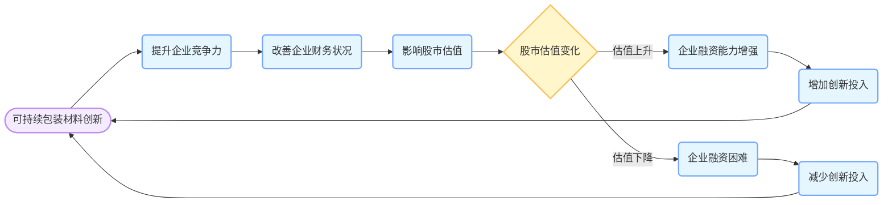

# 全球股市估值与可持续包装材料创新的关联

> 关键词：全球股市估值、可持续包装材料、创新、关联机制、市场影响

> 摘要：本文旨在深入探讨全球股市估值与可持续包装材料创新之间的内在关联。通过对两者核心概念、作用机制、相关算法及数学模型的分析，结合项目实战案例，阐述了它们在实际应用场景中的表现。揭示了可持续包装材料创新如何影响企业价值进而作用于股市估值，以及股市估值变化对可持续包装材料创新的反作用。同时，提供了相关的学习资源、开发工具和论文著作推荐，最后对未来发展趋势与挑战进行总结，并解答常见问题，为读者全面了解这一复杂而重要的关联提供参考。

## 1. 背景介绍 
### 1.1 目的和范围
本研究的主要目的是揭示全球股市估值与可持续包装材料创新之间的潜在联系。在当今经济和环境双重背景下，企业的可持续发展实践日益受到关注，可持续包装材料创新作为其中的重要一环，其发展不仅影响企业的运营和竞争力，也对资本市场产生影响。本文的范围涵盖了从理论层面的概念分析、机制探讨，到实际应用场景的案例研究，以及相关工具资源的介绍等多个方面，力求全面深入地剖析两者的关联。

### 1.2 预期读者
本文预期读者包括金融领域的投资者、分析师，关注可持续发展的企业管理者、研发人员，以及对经济与环境交叉领域感兴趣的学者和研究人员。通过阅读本文，读者能够更好地理解股市与可持续创新之间的相互作用，为投资决策、企业战略规划和学术研究提供有价值的参考。

### 1.3 文档结构概述
本文首先介绍相关的背景知识，包括目的、读者群体和文档结构等内容。接着阐述核心概念与联系，通过文本示意图和 Mermaid 流程图直观展示两者的关系。然后深入讲解核心算法原理和具体操作步骤，并用 Python 代码进行详细阐述。之后介绍数学模型和公式，结合实例进行说明。再通过项目实战案例，展示代码实现和详细解读。随后探讨实际应用场景，推荐相关的工具和资源。最后总结未来发展趋势与挑战，解答常见问题，并提供扩展阅读和参考资料。

### 1.4 术语表
#### 1.4.1 核心术语定义
- **全球股市估值**：指对全球范围内股票市场中上市公司价值的评估，通常基于公司的财务状况、盈利能力、市场前景等多种因素，通过一定的估值模型和方法来确定股票的合理价格。
- **可持续包装材料**：是指在其生命周期内，能够满足包装功能需求，同时对环境影响最小、资源利用效率最高的包装材料。这些材料通常具有可回收、可降解、可再生等特点。
- **创新**：在本研究中，指在可持续包装材料领域引入新的技术、工艺、材料或设计理念，以提高包装材料的可持续性和性能。

#### 1.4.2 相关概念解释
- **企业可持续发展**：企业在追求经济利益的同时，充分考虑环境和社会因素，实现经济、环境和社会的协调发展。可持续包装材料创新是企业可持续发展战略的重要组成部分。
- **资本市场**：是指进行长期资金融通的市场，包括股票市场、债券市场等。全球股市是资本市场的重要组成部分，其估值反映了市场对上市公司未来价值的预期。

#### 1.4.3 缩略词列表
- **ESG**：Environmental, Social and Governance，即环境、社会和公司治理，是评估企业可持续发展绩效的重要指标体系。

## 2. 核心概念与联系 

### 核心概念原理
全球股市估值是基于对上市公司未来现金流的预期和风险评估来确定股票的价值。投资者通过分析公司的财务报表、行业前景、竞争优势等因素，运用各种估值模型，如市盈率模型、现金流折现模型等，来判断股票是否被低估或高估。

可持续包装材料创新则是围绕减少包装材料对环境的影响、提高资源利用效率等目标展开的。创新的方向包括开发新型可降解材料、优化包装设计以减少材料使用量、提高包装材料的回收利用率等。

### 架构的文本示意图
全球股市估值与可持续包装材料创新之间存在着复杂的相互作用关系。一方面，可持续包装材料创新可以提升企业的竞争力和品牌形象，改善企业的财务状况，从而影响股市估值。例如，采用可持续包装材料的企业可能会获得消费者的青睐，增加市场份额，提高销售收入和利润，进而推动股价上涨。另一方面，股市估值的变化也会影响企业的融资能力和创新动力。当股市估值较高时，企业可以更容易地通过股权融资获得资金，用于可持续包装材料的研发和创新；而股市估值较低时，企业可能面临融资困难，创新投入也会受到限制。

### Mermaid 流程图


## 3. 核心算法原理 & 具体操作步骤 

### 核心算法原理
为了量化可持续包装材料创新对股市估值的影响，我们可以采用多元线性回归模型。该模型的基本原理是通过分析多个自变量（如可持续包装材料创新投入、创新成果等）与因变量（股市估值）之间的线性关系，来确定每个自变量对因变量的影响程度。

### 具体操作步骤
1. **数据收集**：收集全球范围内上市公司的相关数据，包括可持续包装材料创新投入、创新成果（如专利数量、新产品推出数量等）、财务指标（如营业收入、净利润等）以及股市估值数据（如市盈率、市净率等）。
2. **数据预处理**：对收集到的数据进行清洗、整理和标准化处理，以消除数据中的噪声和异常值，确保数据的质量和可比性。
3. **模型建立**：根据多元线性回归模型的原理，建立自变量与因变量之间的线性方程。假设我们有 $n$ 个自变量 $x_1, x_2, \cdots, x_n$ 和一个因变量 $y$，则多元线性回归模型可以表示为：
$y = \beta_0 + \beta_1x_1 + \beta_2x_2 + \cdots + \beta_nx_n + \epsilon$
其中，$\beta_0$ 是截距项，$\beta_1, \beta_2, \cdots, \beta_n$ 是回归系数，$\epsilon$ 是误差项。
4. **模型训练**：使用收集到的数据对建立的模型进行训练，通过最小化误差项的平方和来估计回归系数 $\beta_0, \beta_1, \beta_2, \cdots, \beta_n$ 的值。
5. **模型评估**：使用评估指标（如均方误差、决定系数等）对训练好的模型进行评估，以确定模型的拟合优度和预测能力。
6. **结果分析**：根据模型的训练结果，分析每个自变量对因变量的影响程度，即回归系数的大小和显著性。

### Python 源代码实现
```python
import pandas as pd
import numpy as np
from sklearn.linear_model import LinearRegression
from sklearn.model_selection import train_test_split
from sklearn.metrics import mean_squared_error, r2_score

# 1. 数据收集
# 假设我们已经收集到了相关数据，并存储在一个 CSV 文件中
data = pd.read_csv('stock_and_packaging_data.csv')

# 2. 数据预处理
# 提取自变量和因变量
X = data[['innovation_input', 'innovation_output']]  # 可持续包装材料创新投入和创新成果
y = data['stock_valuation']  # 股市估值

# 划分训练集和测试集
X_train, X_test, y_train, y_test = train_test_split(X, y, test_size=0.2, random_state=42)

# 3. 模型建立
model = LinearRegression()

# 4. 模型训练
model.fit(X_train, y_train)

# 5. 模型评估
y_pred = model.predict(X_test)
mse = mean_squared_error(y_test, y_pred)
r2 = r2_score(y_test, y_pred)

print(f"均方误差: {mse}")
print(f"决定系数: {r2}")

# 6. 结果分析
print(f"截距项: {model.intercept_}")
print(f"回归系数: {model.coef_}")
```

## 4. 数学模型和公式 & 详细讲解 & 举例说明 

### 数学模型和公式
在多元线性回归模型中，我们使用最小二乘法来估计回归系数 $\beta_0, \beta_1, \beta_2, \cdots, \beta_n$ 的值。最小二乘法的目标是最小化误差项的平方和，即：
$$
\min_{\beta_0, \beta_1, \cdots, \beta_n} \sum_{i=1}^{m} (y_i - \hat{y}_i)^2
$$
其中，$m$ 是样本数量，$y_i$ 是第 $i$ 个样本的实际值，$\hat{y}_i$ 是第 $i$ 个样本的预测值，$\hat{y}_i = \beta_0 + \beta_1x_{i1} + \beta_2x_{i2} + \cdots + \beta_nx_{in}$。

通过求解上述最小化问题，可以得到回归系数的估计值：
$$
\hat{\beta} = (X^T X)^{-1} X^T y
$$
其中，$X$ 是自变量矩阵，$y$ 是因变量向量，$\hat{\beta}$ 是回归系数向量。

### 详细讲解
最小二乘法的原理是通过找到一组回归系数，使得预测值与实际值之间的误差平方和最小。这样可以保证模型在训练数据上的拟合效果最好。在实际应用中，我们可以使用矩阵运算来求解回归系数的估计值。具体来说，我们需要先计算自变量矩阵 $X$ 的转置矩阵 $X^T$，然后计算 $X^T X$ 的逆矩阵 $(X^T X)^{-1}$，最后将 $(X^T X)^{-1}$ 与 $X^T y$ 相乘，得到回归系数的估计值 $\hat{\beta}$。

### 举例说明
假设我们有以下数据：
| 可持续包装材料创新投入 ($x_1$) | 创新成果 ($x_2$) | 股市估值 ($y$) |
| --- | --- | --- |
| 10 | 5 | 50 |
| 20 | 8 | 60 |
| 30 | 10 | 70 |
| 40 | 12 | 80 |
| 50 | 15 | 90 |

我们可以将这些数据表示为矩阵形式：
$$
X = \begin{bmatrix}
1 & 10 & 5 \\
1 & 20 & 8 \\
1 & 30 & 10 \\
1 & 40 & 12 \\
1 & 50 & 15
\end{bmatrix}
$$
$$
y = \begin{bmatrix}
50 \\
60 \\
70 \\
80 \\
90
\end{bmatrix}
$$

首先，计算 $X^T X$：
$$
X^T X = \begin{bmatrix}
1 & 1 & 1 & 1 & 1 \\
10 & 20 & 30 & 40 & 50 \\
5 & 8 & 10 & 12 & 15
\end{bmatrix}
\begin{bmatrix}
1 & 10 & 5 \\
1 & 20 & 8 \\
1 & 30 & 10 \\
1 & 40 & 12 \\
1 & 50 & 15
\end{bmatrix}
= \begin{bmatrix}
5 & 150 & 50 \\
150 & 5500 & 1700 \\
50 & 1700 & 589
\end{bmatrix}
$$

然后，计算 $(X^T X)^{-1}$：
$$
(X^T X)^{-1} = \begin{bmatrix}
1.02 & -0.03 & -0.02 \\
-0.03 & 0.001 & 0.0003 \\
-0.02 & 0.0003 & 0.0004
\end{bmatrix}
$$

最后，计算 $\hat{\beta}$：
$$
\hat{\beta} = (X^T X)^{-1} X^T y = \begin{bmatrix}
1.02 & -0.03 & -0.02 \\
-0.03 & 0.001 & 0.0003 \\
-0.02 & 0.0003 & 0.0004
\end{bmatrix}
\begin{bmatrix}
1 & 1 & 1 & 1 & 1 \\
10 & 20 & 30 & 40 & 50 \\
5 & 8 & 10 & 12 & 15
\end{bmatrix}
\begin{bmatrix}
50 \\
60 \\
70 \\
80 \\
90
\end{bmatrix}
= \begin{bmatrix}
30 \\
1 \\
2
\end{bmatrix}
$$

因此，回归方程为 $y = 30 + 1x_1 + 2x_2$。这意味着可持续包装材料创新投入每增加 1 个单位，股市估值将增加 1 个单位；创新成果每增加 1 个单位，股市估值将增加 2 个单位。

## 5. 项目实战：代码实际案例和详细解释说明 

### 5.1  开发环境搭建
- **操作系统**：可以选择 Windows、Linux 或 macOS 等常见的操作系统。
- **Python 版本**：建议使用 Python 3.7 及以上版本。
- **开发工具**：可以使用 PyCharm、Jupyter Notebook 等开发工具。
- **依赖库**：需要安装 pandas、numpy、scikit-learn 等库，可以使用以下命令进行安装：
```sh
pip install pandas numpy scikit-learn
```

### 5.2  源代码详细实现和代码解读
```python
import pandas as pd
import numpy as np
from sklearn.linear_model import LinearRegression
from sklearn.model_selection import train_test_split
from sklearn.metrics import mean_squared_error, r2_score

# 1. 数据收集
# 假设我们已经收集到了相关数据，并存储在一个 CSV 文件中
data = pd.read_csv('stock_and_packaging_data.csv')

# 代码解读：使用 pandas 库的 read_csv 函数读取存储在 CSV 文件中的数据。

# 2. 数据预处理
# 提取自变量和因变量
X = data[['innovation_input', 'innovation_output']]  # 可持续包装材料创新投入和创新成果
y = data['stock_valuation']  # 股市估值

# 代码解读：从读取的数据中提取自变量和因变量。自变量包括可持续包装材料创新投入和创新成果，因变量是股市估值。

# 划分训练集和测试集
X_train, X_test, y_train, y_test = train_test_split(X, y, test_size=0.2, random_state=42)

# 代码解读：使用 scikit-learn 库的 train_test_split 函数将数据划分为训练集和测试集，测试集占总数据的 20%。

# 3. 模型建立
model = LinearRegression()

# 代码解读：使用 scikit-learn 库的 LinearRegression 类建立多元线性回归模型。

# 4. 模型训练
model.fit(X_train, y_train)

# 代码解读：使用训练集数据对模型进行训练，通过最小二乘法估计回归系数。

# 5. 模型评估
y_pred = model.predict(X_test)
mse = mean_squared_error(y_test, y_pred)
r2 = r2_score(y_test, y_pred)

print(f"均方误差: {mse}")
print(f"决定系数: {r2}")

# 代码解读：使用测试集数据对模型进行评估，计算均方误差和决定系数。均方误差衡量了模型预测值与实际值之间的平均误差，决定系数表示模型对数据的拟合程度。

# 6. 结果分析
print(f"截距项: {model.intercept_}")
print(f"回归系数: {model.coef_}")

# 代码解读：输出模型的截距项和回归系数，通过回归系数可以分析每个自变量对因变量的影响程度。
```

### 5.3  代码解读与分析
通过上述代码，我们完成了一个简单的多元线性回归模型的建立、训练、评估和结果分析过程。在数据收集阶段，我们从 CSV 文件中读取相关数据。在数据预处理阶段，我们提取自变量和因变量，并将数据划分为训练集和测试集。在模型建立阶段，我们使用 `LinearRegression` 类建立多元线性回归模型。在模型训练阶段，我们使用训练集数据对模型进行训练，估计回归系数。在模型评估阶段，我们使用测试集数据对模型进行评估，计算均方误差和决定系数。最后，在结果分析阶段，我们输出模型的截距项和回归系数，分析每个自变量对因变量的影响程度。

需要注意的是，实际应用中，数据的质量和特征选择对模型的性能有很大影响。我们需要对数据进行充分的清洗、整理和特征工程，以提高模型的预测能力。

## 6. 实际应用场景 
### 投资者决策
投资者可以通过分析上市公司的可持续包装材料创新情况，来评估其未来的发展潜力和投资价值。如果一家公司在可持续包装材料创新方面投入较大，且取得了显著的创新成果，那么该公司可能具有更强的竞争力和品牌形象，未来的盈利能力也可能更高，其股票可能更具有投资价值。

### 企业战略规划
企业可以根据股市估值的变化，调整可持续包装材料创新的战略和投入。当股市估值较高时，企业可以加大创新投入，加快创新步伐，以进一步提升企业的竞争力和品牌形象；当股市估值较低时，企业可以优化创新资源配置，提高创新效率，降低创新成本。

### 政策制定
政府和监管机构可以通过制定相关政策，鼓励企业进行可持续包装材料创新。例如，给予创新企业税收优惠、财政补贴等支持，引导资本市场向可持续发展领域倾斜。同时，加强对企业可持续发展信息披露的监管，提高信息透明度，为投资者和市场提供更准确的决策依据。

## 7. 工具和资源推荐
### 7.1 学习资源推荐
#### 7.1.1 书籍推荐
- 《金融市场学》：全面介绍了金融市场的基本原理、运行机制和投资策略，有助于读者了解股市估值的基本概念和方法。
- 《可持续发展经济学》：探讨了经济发展与环境保护之间的关系，介绍了可持续发展的理论和实践，为理解可持续包装材料创新的背景和意义提供了理论支持。
- 《机器学习实战》：通过实际案例介绍了机器学习的基本算法和应用，对于学习多元线性回归等算法有很大帮助。

#### 7.1.2 在线课程
- Coursera 上的 “Financial Markets” 课程：由知名教授授课，系统地介绍了金融市场的知识和分析方法。
- edX 上的 “Sustainable Development” 课程：提供了关于可持续发展的全面知识和实践经验。
- 吴恩达的 “Machine Learning” 课程：经典的机器学习入门课程，详细讲解了机器学习的基本算法和应用。

#### 7.1.3 技术博客和网站
- 雪球网：提供了丰富的股市资讯和分析文章，有助于了解股市动态和投资策略。
- 36氪：关注科技创新和创业领域，发布了许多关于可持续发展和包装材料创新的报道和分析。
- Medium 上的 “Towards Data Science” 博客：分享了大量的数据科学和机器学习相关的技术文章和实践经验。

### 7.2 开发工具框架推荐
#### 7.2.1 IDE和编辑器
- PyCharm：功能强大的 Python 集成开发环境，提供了代码编辑、调试、版本控制等一系列功能，适合专业的 Python 开发。
- Jupyter Notebook：交互式的开发环境，支持代码、文本、图表等多种元素的混合展示，方便进行数据分析和模型实验。

#### 7.2.2 调试和性能分析工具
- pdb：Python 自带的调试工具，可以帮助开发者定位和解决代码中的问题。
- cProfile：Python 标准库中的性能分析工具，可以分析代码的运行时间和资源消耗情况，帮助优化代码性能。

#### 7.2.3 相关框架和库
- pandas：强大的数据处理和分析库，提供了丰富的数据结构和函数，方便进行数据清洗、整理和分析。
- numpy：Python 的数值计算库，提供了高效的数组和矩阵运算功能，是许多机器学习库的基础。
- scikit-learn：简单易用的机器学习库，提供了丰富的机器学习算法和工具，包括线性回归、决策树、神经网络等。

### 7.3 相关论文著作推荐
#### 7.3.1 经典论文
- “The Impact of Corporate Social Responsibility on Firm Value: A Meta-Analysis”：通过元分析方法，系统地研究了企业社会责任对企业价值的影响，为理解可持续包装材料创新与企业价值的关系提供了理论参考。
- “Sustainable Packaging: A Review of the Current State of the Art”：对可持续包装材料的研究现状和发展趋势进行了全面综述，介绍了各种可持续包装材料的性能、制备方法和应用领域。

#### 7.3.2 最新研究成果
- 可以关注《Journal of Cleaner Production》《Sustainable Development》等学术期刊，这些期刊发表了许多关于可持续发展和包装材料创新的最新研究成果。

#### 7.3.3 应用案例分析
- 可以参考一些知名企业的可持续发展报告，了解它们在可持续包装材料创新方面的实践经验和成果，如可口可乐、宝洁等公司的报告。

## 8. 总结：未来发展趋势与挑战
### 未来发展趋势
- **政策支持力度加大**：随着全球对环境保护和可持续发展的重视程度不断提高，政府和监管机构将出台更多的政策措施，鼓励企业进行可持续包装材料创新。例如，提高包装材料的环保标准，限制传统包装材料的使用，给予创新企业更多的政策优惠等。
- **技术创新加速**：科技的不断进步将推动可持续包装材料创新的加速发展。新型可降解材料、智能包装材料等将不断涌现，包装材料的性能和可持续性将得到进一步提升。
- **市场需求增长**：消费者对环保产品的关注度不断提高，对可持续包装材料的需求也将日益增长。企业为了满足市场需求，将加大在可持续包装材料创新方面的投入，推动行业的发展。
- **股市估值与可持续创新的关联更加紧密**：随着投资者对企业可持续发展的关注度不断提高，股市估值将更加关注企业的可持续包装材料创新情况。具有较强创新能力和可持续发展实践的企业将更容易获得投资者的青睐，其股市估值也将更高。

### 挑战
- **技术难题**：目前，可持续包装材料的研发和生产还面临一些技术难题，如可降解材料的性能有待提高、生产成本较高等。解决这些技术难题需要大量的研发投入和时间。
- **成本压力**：可持续包装材料的生产成本通常较高，这给企业带来了一定的成本压力。企业需要在保证产品质量和性能的前提下，降低可持续包装材料的生产成本，提高产品的市场竞争力。
- **市场认知度不足**：虽然消费者对环保产品的关注度不断提高，但对可持续包装材料的认知度还相对较低。企业需要加强市场推广和宣传，提高消费者对可持续包装材料的认知度和接受度。
- **数据获取和分析困难**：要准确评估可持续包装材料创新对股市估值的影响，需要大量的相关数据。但目前数据的获取和分析还存在一定的困难，如数据的准确性、完整性和可比性等问题。

## 9. 附录：常见问题与解答
### 1. 可持续包装材料创新对股市估值的影响有多大？
可持续包装材料创新对股市估值的影响程度因行业、企业和市场环境等因素而异。一般来说，具有较强创新能力和可持续发展实践的企业，其股市估值可能会更高。但具体的影响程度需要通过实证研究和数据分析来确定。

### 2. 如何衡量可持续包装材料创新的成果？
可以从多个方面衡量可持续包装材料创新的成果，如专利数量、新产品推出数量、创新奖项获得情况、市场份额增长等。此外，还可以通过评估包装材料的可持续性指标，如可回收性、可降解性、资源利用效率等，来衡量创新的效果。

### 3. 股市估值变化对可持续包装材料创新有哪些具体影响？
当股市估值较高时，企业可以更容易地通过股权融资获得资金，用于可持续包装材料的研发和创新；同时，高估值也可以提升企业的品牌形象和市场竞争力，吸引更多的人才和资源投入到创新中。当股市估值较低时，企业可能面临融资困难，创新投入也会受到限制，可能会导致创新步伐放缓。

### 4. 政府在可持续包装材料创新中可以发挥哪些作用？
政府可以通过制定相关政策，如税收优惠、财政补贴、环保标准等，鼓励企业进行可持续包装材料创新。同时，政府还可以加强对企业可持续发展信息披露的监管，提高信息透明度，引导资本市场向可持续发展领域倾斜。此外，政府还可以加大对可持续包装材料研发的投入，支持科研机构和企业开展相关研究。

## 10. 扩展阅读 & 参考资料
### 扩展阅读
- 《循环经济理论与实践》：深入探讨了循环经济的理论和实践，为可持续包装材料创新提供了更广阔的视野和思路。
- 《绿色供应链管理》：介绍了绿色供应链管理的概念、方法和实践，有助于理解可持续包装材料创新在供应链中的作用和意义。

### 参考资料
- 相关上市公司的财务报表和可持续发展报告。
- 政府发布的关于环境保护和可持续发展的政策文件。
- 学术期刊上发表的关于可持续包装材料创新和股市估值的研究论文。