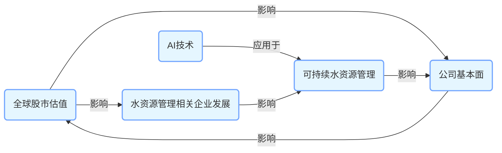

# 全球股市估值与可持续水资源管理AI技术的关联

> 关键词：全球股市估值、可持续水资源管理、AI技术、关联分析、金融与环境融合

> 摘要：本文聚焦于全球股市估值与可持续水资源管理AI技术之间的关联。在当今经济与环境相互影响日益加深的背景下，研究两者的联系具有重要意义。通过对相关核心概念的阐述、算法原理的讲解、数学模型的分析，结合实际案例和应用场景探讨，揭示了股市估值与水资源管理AI技术在金融市场和环境领域的相互作用机制，为投资者、企业和政策制定者提供有价值的参考，同时展望了未来发展趋势与面临的挑战。

## 1. 背景介绍 
### 1.1 目的和范围
本文旨在深入探究全球股市估值与可持续水资源管理AI技术之间的内在关联。通过多学科的视角，综合运用金融、环境科学、人工智能等领域的知识，分析两者在不同层面的相互影响。范围涵盖全球主要金融市场以及各类与水资源管理相关的企业和项目，试图全面揭示这种关联的本质和潜在影响。

### 1.2 预期读者
本文预期读者包括金融领域的投资者、分析师、基金经理，环境科学和水资源管理领域的研究人员、从业者，以及关注可持续发展和科技应用的政策制定者和企业管理者。希望为不同专业背景的读者提供深入了解这一跨领域关联的机会，促进不同领域之间的交流与合作。

### 1.3 文档结构概述
本文首先介绍背景信息，包括目的、预期读者和文档结构。接着阐述核心概念与联系，通过文本示意图和Mermaid流程图展示相关概念的架构。然后讲解核心算法原理和具体操作步骤，结合Python源代码进行详细说明。之后分析数学模型和公式，并举例说明。再通过项目实战展示代码实际案例和详细解释。随后探讨实际应用场景，推荐相关工具和资源。最后总结未来发展趋势与挑战，提供常见问题解答和扩展阅读参考资料。

### 1.4 术语表
#### 1.4.1 核心术语定义
- **全球股市估值**：指对全球范围内各个股票市场上上市公司的价值进行评估的过程和结果。通常通过各种估值模型和指标，如市盈率（P/E）、市净率（P/B）等，来衡量股票的相对价值。
- **可持续水资源管理**：以长期、公平和环境友好的方式管理水资源，确保水资源的合理利用、保护和分配，满足当前和未来社会经济发展的需求，同时维持生态系统的健康。
- **AI技术**：即人工智能技术，是研究、开发用于模拟、延伸和扩展人的智能的理论、方法、技术及应用系统的一门新的技术科学。包括机器学习、深度学习、自然语言处理等多种技术手段。

#### 1.4.2 相关概念解释
- **金融市场效率**：指金融市场能够快速、准确地反映所有相关信息，使资产价格合理地反映其内在价值的程度。在有效市场中，股价能够及时反映公司的财务状况、行业前景等信息。
- **环境、社会和治理（ESG）因素**：是一种关注企业环境责任、社会责任和公司治理的投资理念和评价标准。在可持续发展的背景下，ESG因素越来越受到投资者的重视，对企业的估值和股价产生影响。
- **水资源风险**：指由于水资源短缺、水质污染、水灾害等因素给企业和社会带来的潜在风险，包括生产中断、成本增加、声誉受损等。

#### 1.4.3 缩略词列表
- **P/E**：市盈率（Price-to-Earnings Ratio）
- **P/B**：市净率（Price-to-Book Ratio）
- **AI**：人工智能（Artificial Intelligence）
- **ESG**：环境、社会和治理（Environmental, Social and Governance）

## 2. 核心概念与联系 

### 核心概念原理
全球股市估值是金融市场的重要组成部分，其受到多种因素的影响，包括宏观经济环境、公司财务状况、行业竞争态势等。股票价格是市场对公司未来盈利能力和价值的预期体现。而可持续水资源管理是应对全球水资源挑战的关键举措，旨在保障水资源的可持续利用，维护生态平衡和社会经济的稳定发展。

AI技术在可持续水资源管理中发挥着重要作用。通过机器学习算法，可以对水资源数据进行分析和预测，如水质监测、水量预测等。深度学习模型可以处理复杂的水文数据，提高水资源管理的效率和准确性。同时，AI技术还可以优化水资源分配方案，实现水资源的合理利用。

### 架构的文本示意图
全球股市估值与可持续水资源管理AI技术的关联架构可以描述如下：

全球股市估值受到宏观经济因素、行业发展趋势和公司基本面的影响。在可持续发展的背景下，水资源管理情况成为影响公司基本面的重要因素之一。水资源管理不善可能导致企业面临生产中断、成本增加等风险，从而影响公司的盈利能力和股价。

AI技术作为一种工具，应用于可持续水资源管理中，提高水资源管理的效率和效果。有效的水资源管理可以降低企业的水资源风险，提升企业的可持续发展能力，进而对公司的估值产生积极影响。同时，水资源管理相关企业的发展也会受到股市估值的影响，股市的资金流向和市场预期会影响企业的融资能力和发展战略。

### Mermaid流程图


## 3. 核心算法原理 & 具体操作步骤 

### 核心算法原理
在分析全球股市估值与可持续水资源管理AI技术的关联时，可以采用机器学习中的回归分析算法。回归分析用于研究变量之间的定量关系，通过建立回归模型，可以预测一个变量（因变量）如何随着其他变量（自变量）的变化而变化。

以股票价格作为因变量，以水资源管理相关指标（如水资源使用效率、水资源风险评估等）和AI技术应用指标（如AI技术投入、AI技术应用效果等）作为自变量，建立多元线性回归模型。

多元线性回归模型的一般形式为：

$$y = \beta_0 + \beta_1x_1 + \beta_2x_2 + \cdots + \beta_nx_n + \epsilon$$

其中，$y$ 是因变量（股票价格），$x_1, x_2, \cdots, x_n$ 是自变量（水资源管理相关指标和AI技术应用指标），$\beta_0, \beta_1, \beta_2, \cdots, \beta_n$ 是回归系数，$\epsilon$ 是误差项。

### 具体操作步骤
1. **数据收集**：收集全球股市中相关企业的股票价格数据、水资源管理相关数据和AI技术应用数据。数据来源可以包括金融数据库、企业年报、政府部门发布的统计数据等。
2. **数据预处理**：对收集到的数据进行清洗、整理和标准化处理。去除缺失值、异常值，将数据转换为适合模型输入的格式。
3. **特征选择**：从收集到的自变量中选择对因变量有显著影响的特征。可以使用相关性分析、特征重要性排序等方法进行特征选择。
4. **模型训练**：将处理后的数据分为训练集和测试集，使用训练集数据对多元线性回归模型进行训练，估计回归系数。
5. **模型评估**：使用测试集数据对训练好的模型进行评估，计算模型的评估指标，如均方误差（MSE）、决定系数（$R^2$）等，评估模型的性能。
6. **模型应用**：使用训练好的模型对股票价格进行预测，分析水资源管理和AI技术应用对股票价格的影响。

### Python源代码实现
```python
import pandas as pd
from sklearn.model_selection import train_test_split
from sklearn.linear_model import LinearRegression
from sklearn.metrics import mean_squared_error, r2_score

# 1. 数据收集
# 假设数据存储在CSV文件中，文件名为 'stock_water_ai_data.csv'
data = pd.read_csv('stock_water_ai_data.csv')

# 2. 数据预处理
# 去除缺失值
data = data.dropna()

# 分离自变量和因变量
X = data.drop('stock_price', axis=1)
y = data['stock_price']

# 3. 特征选择
# 这里简单选择所有特征，实际应用中可以进行更复杂的特征选择
# 例如使用相关性分析等方法

# 4. 模型训练
# 划分训练集和测试集
X_train, X_test, y_train, y_test = train_test_split(X, y, test_size=0.2, random_state=42)

# 创建线性回归模型
model = LinearRegression()

# 训练模型
model.fit(X_train, y_train)

# 5. 模型评估
# 预测测试集数据
y_pred = model.predict(X_test)

# 计算均方误差
mse = mean_squared_error(y_test, y_pred)

# 计算决定系数
r2 = r2_score(y_test, y_pred)

print(f"均方误差: {mse}")
print(f"决定系数: {r2}")

# 6. 模型应用
# 可以使用训练好的模型对新数据进行预测
# 例如，假设 new_data 是新的自变量数据
# new_data = pd.read_csv('new_data.csv')
# new_predictions = model.predict(new_data)
```

## 4. 数学模型和公式 & 详细讲解 & 举例说明 

### 数学模型和公式
在前面提到的多元线性回归模型中，回归系数 $\beta_0, \beta_1, \beta_2, \cdots, \beta_n$ 是需要估计的参数。最小二乘法是常用的估计方法，其目标是使误差项 $\epsilon$ 的平方和最小。

误差项的平方和可以表示为：

$$S(\beta) = \sum_{i=1}^{m}(y_i - \hat{y}_i)^2 = \sum_{i=1}^{m}(y_i - (\beta_0 + \beta_1x_{i1} + \beta_2x_{i2} + \cdots + \beta_nx_{in}))^2$$

其中，$m$ 是样本数量，$y_i$ 是第 $i$ 个样本的实际值，$\hat{y}_i$ 是第 $i$ 个样本的预测值。

通过对 $S(\beta)$ 求关于 $\beta_0, \beta_1, \beta_2, \cdots, \beta_n$ 的偏导数，并令其等于零，可以得到一组正规方程：

$$\begin{cases}
\frac{\partial S(\beta)}{\partial \beta_0} = -2\sum_{i=1}^{m}(y_i - (\beta_0 + \beta_1x_{i1} + \beta_2x_{i2} + \cdots + \beta_nx_{in})) = 0 \\
\frac{\partial S(\beta)}{\partial \beta_1} = -2\sum_{i=1}^{m}(y_i - (\beta_0 + \beta_1x_{i1} + \beta_2x_{i2} + \cdots + \beta_nx_{in}))x_{i1} = 0 \\
\cdots \\
\frac{\partial S(\beta)}{\partial \beta_n} = -2\sum_{i=1}^{m}(y_i - (\beta_0 + \beta_1x_{i1} + \beta_2x_{i2} + \cdots + \beta_nx_{in}))x_{in} = 0
\end{cases}$$

解这个正规方程组，可以得到回归系数的估计值。

### 详细讲解
最小二乘法的原理是通过最小化误差项的平方和，使得模型的预测值尽可能接近实际值。误差项的平方和反映了模型的拟合误差，通过最小化这个误差，可以得到最优的回归系数估计值。

正规方程组是通过对误差项的平方和求偏导数得到的，求解正规方程组可以得到回归系数的解析解。在实际应用中，由于数据量较大，求解正规方程组可能会比较复杂，可以使用矩阵运算的方法来求解。

### 举例说明
假设我们有一个简单的二元线性回归模型，只有两个自变量 $x_1$ 和 $x_2$，模型形式为：

$$y = \beta_0 + \beta_1x_1 + \beta_2x_2 + \epsilon$$

我们有以下样本数据：

| $x_1$ | $x_2$ | $y$ |
| --- | --- | --- |
| 1 | 2 | 5 |
| 2 | 3 | 7 |
| 3 | 4 | 9 |

根据最小二乘法的原理，我们可以列出正规方程组：

$$\begin{cases}
3\beta_0 + 6\beta_1 + 9\beta_2 = 21 \\
6\beta_0 + 14\beta_1 + 22\beta_2 = 50 \\
9\beta_0 + 22\beta_1 + 34\beta_2 = 77
\end{cases}$$

解这个方程组，可以得到回归系数 $\beta_0 = 1, \beta_1 = 1, \beta_2 = 1$。

因此，回归模型为：

$$y = 1 + x_1 + x_2$$

这个模型可以用来预测 $y$ 的值，例如当 $x_1 = 4$，$x_2 = 5$ 时，$y$ 的预测值为 $y = 1 + 4 + 5 = 10$。

## 5. 项目实战：代码实际案例和详细解释说明 

### 5.1  开发环境搭建
- **操作系统**：可以选择Windows、Linux或macOS等常见操作系统。
- **Python环境**：安装Python 3.x版本，可以从Python官方网站（https://www.python.org/downloads/）下载安装。
- **开发工具**：推荐使用Anaconda集成开发环境，它包含了常用的Python库和工具，方便进行数据处理和机器学习模型开发。也可以使用PyCharm等专业的Python开发工具。
- **相关库安装**：使用pip或conda安装必要的库，如pandas、scikit-learn等。可以使用以下命令进行安装：
```sh
pip install pandas scikit-learn
```

### 5.2  源代码详细实现和代码解读
以下是一个完整的项目实战代码示例，结合前面的算法原理和操作步骤，实现全球股市估值与可持续水资源管理AI技术关联的分析。

```python
import pandas as pd
from sklearn.model_selection import train_test_split
from sklearn.linear_model import LinearRegression
from sklearn.metrics import mean_squared_error, r2_score
import matplotlib.pyplot as plt

# 1. 数据收集
# 假设数据存储在CSV文件中，文件名为 'stock_water_ai_data.csv'
data = pd.read_csv('stock_water_ai_data.csv')

# 2. 数据预处理
# 去除缺失值
data = data.dropna()

# 分离自变量和因变量
X = data.drop('stock_price', axis=1)
y = data['stock_price']

# 3. 特征选择
# 这里简单选择所有特征，实际应用中可以进行更复杂的特征选择
# 例如使用相关性分析等方法

# 4. 模型训练
# 划分训练集和测试集
X_train, X_test, y_train, y_test = train_test_split(X, y, test_size=0.2, random_state=42)

# 创建线性回归模型
model = LinearRegression()

# 训练模型
model.fit(X_train, y_train)

# 5. 模型评估
# 预测测试集数据
y_pred = model.predict(X_test)

# 计算均方误差
mse = mean_squared_error(y_test, y_pred)

# 计算决定系数
r2 = r2_score(y_test, y_pred)

print(f"均方误差: {mse}")
print(f"决定系数: {r2}")

# 6. 模型应用和可视化
# 绘制实际值和预测值的散点图
plt.scatter(y_test, y_pred)
plt.xlabel('实际值')
plt.ylabel('预测值')
plt.title('实际值 vs 预测值')
plt.show()

# 打印回归系数
print("回归系数:")
for i, col in enumerate(X.columns):
    print(f"{col}: {model.coef_[i]}")
print(f"截距: {model.intercept_}")
```

### 代码解读与分析
1. **数据收集**：使用 `pandas` 库的 `read_csv` 函数读取存储在CSV文件中的数据。
2. **数据预处理**：使用 `dropna` 函数去除数据中的缺失值，确保数据的完整性。然后分离自变量和因变量。
3. **特征选择**：在这个示例中，简单地选择所有特征作为自变量。在实际应用中，可以使用相关性分析、特征重要性排序等方法进行特征选择，以提高模型的性能。
4. **模型训练**：使用 `train_test_split` 函数将数据分为训练集和测试集，比例为80%训练集和20%测试集。然后创建 `LinearRegression` 模型，并使用训练集数据进行训练。
5. **模型评估**：使用训练好的模型对测试集数据进行预测，计算均方误差和决定系数，评估模型的性能。均方误差越小，决定系数越接近1，说明模型的拟合效果越好。
6. **模型应用和可视化**：绘制实际值和预测值的散点图，直观地展示模型的预测效果。同时，打印回归系数和截距，分析每个自变量对因变量的影响程度。

## 6. 实际应用场景 
### 投资者决策
对于投资者来说，了解全球股市估值与可持续水资源管理AI技术的关联可以帮助他们做出更明智的投资决策。水资源管理良好且积极应用AI技术的企业可能具有更低的水资源风险和更高的可持续发展能力，其股票可能具有更好的投资价值。投资者可以通过分析相关企业的水资源管理指标和AI技术应用情况，筛选出具有潜力的投资标的。

### 企业战略规划
企业可以通过关注全球股市估值与可持续水资源管理AI技术的关联，制定更合理的战略规划。一方面，企业可以加大在水资源管理和AI技术应用方面的投入，降低水资源风险，提高企业的可持续发展能力，从而提升企业的市场估值。另一方面，企业可以根据股市的反馈，调整自身的发展战略，优化资源配置。

### 政策制定
政策制定者可以利用这种关联制定相关政策，促进可持续水资源管理和AI技术的发展。例如，政府可以出台鼓励企业进行水资源管理和AI技术应用的政策，如税收优惠、补贴等。同时，政策制定者可以加强对金融市场的监管，引导资金流向水资源管理和AI技术相关领域，推动经济的可持续发展。

### 环境监测与管理
在环境监测与管理方面，AI技术可以用于实时监测水资源的质量和数量，及时发现水资源问题。通过分析股市估值与水资源管理的关联，可以了解企业对水资源管理的重视程度和投入情况，为环境管理部门提供参考，加强对企业水资源管理的监管。

## 7. 工具和资源推荐
### 7.1 学习资源推荐
#### 7.1.1 书籍推荐
- 《机器学习》（周志华著）：全面介绍了机器学习的基本概念、算法和应用，是机器学习领域的经典教材。
- 《Python数据分析实战》（Sebastian Raschka著）：详细介绍了使用Python进行数据分析的方法和技巧，包括数据处理、可视化和机器学习等方面。
- 《金融市场与金融机构基础》（Frank J. Fabozzi等著）：系统介绍了金融市场和金融机构的基本原理和运作机制，有助于了解金融市场的基本知识。

#### 7.1.2 在线课程
- Coursera平台上的“机器学习”课程（Andrew Ng教授主讲）：该课程是机器学习领域的经典在线课程，内容全面，讲解深入浅出。
- edX平台上的“数据分析与可视化”课程：介绍了数据分析和可视化的基本方法和工具，适合初学者学习。
- Udemy平台上的“金融数据分析与建模”课程：结合实际案例，介绍了金融数据分析和建模的方法和技巧。

#### 7.1.3 技术博客和网站
- 机器之心（https://www.alienai.com/）：提供人工智能领域的最新技术资讯、学术论文解读和技术教程。
- 数据派THU（http://datapai.cn/）：专注于数据分析和数据科学领域，分享相关的技术文章和案例。
- 雪球网（https://xueqiu.com/）：提供金融市场的资讯、股票分析和投资者交流平台，有助于了解股市动态。

### 7.2 开发工具框架推荐
#### 7.2.1 IDE和编辑器
- PyCharm：专业的Python集成开发环境，具有强大的代码编辑、调试和项目管理功能。
- Jupyter Notebook：交互式的开发环境，适合进行数据探索和模型开发，支持多种编程语言。
- Visual Studio Code：轻量级的代码编辑器，支持多种编程语言和插件扩展，方便进行快速开发。

#### 7.2.2 调试和性能分析工具
- PDB：Python自带的调试工具，可以帮助开发者定位代码中的错误。
- cProfile：Python的性能分析工具，可以分析代码的运行时间和函数调用情况，帮助优化代码性能。
- TensorBoard：用于可视化深度学习模型训练过程的工具，方便开发者监控模型的训练效果。

#### 7.2.3 相关框架和库
- pandas：用于数据处理和分析的Python库，提供了高效的数据结构和数据操作方法。
- scikit-learn：机器学习领域的常用库，提供了丰富的机器学习算法和工具，方便进行模型开发和评估。
- TensorFlow：开源的深度学习框架，广泛应用于图像识别、自然语言处理等领域。

### 7.3 相关论文著作推荐
#### 7.3.1 经典论文
- Fama, E. F., & French, K. R. (1992). The cross-section of expected stock returns. The Journal of Finance, 47(2), 427-465. 该论文提出了Fama-French三因子模型，对股票收益率的横截面进行了深入分析。
- Copeland, T. E., & Weston, J. F. (1988). Financial theory and corporate policy. Addison-Wesley. 这本书系统介绍了金融理论和公司财务政策，是金融领域的经典著作。

#### 7.3.2 最新研究成果
- 关注《Journal of Financial Economics》、《Review of Financial Studies》等金融领域的顶级期刊，以及《Water Resources Research》、《Journal of Hydrology》等环境科学领域的期刊，获取最新的研究成果。

#### 7.3.3 应用案例分析
- 可以参考世界银行、国际货币基金组织等国际组织发布的报告和研究成果，了解全球范围内可持续水资源管理和金融市场的应用案例。同时，关注一些大型企业的可持续发展报告，了解企业在水资源管理和AI技术应用方面的实践经验。

## 8. 总结：未来发展趋势与挑战
### 未来发展趋势
- **融合趋势加强**：全球股市估值与可持续水资源管理AI技术的融合将越来越紧密。随着可持续发展理念的深入人心，投资者和企业将更加关注水资源管理和AI技术的应用，水资源管理和AI技术将成为影响企业估值和股市表现的重要因素。
- **技术创新推动**：AI技术的不断创新将为可持续水资源管理带来更多的机遇。例如，深度学习、物联网等技术的应用将提高水资源监测和管理的效率和准确性，进一步降低企业的水资源风险，提升企业的价值。
- **政策支持引导**：政府将出台更多的政策支持可持续水资源管理和AI技术的发展。例如，制定水资源管理的标准和规范，鼓励企业加大在AI技术应用方面的投入，引导资金流向相关领域，促进经济的可持续发展。

### 挑战
- **数据质量和可用性**：准确、全面的数据是分析全球股市估值与可持续水资源管理AI技术关联的基础。然而，目前水资源管理和AI技术应用的数据存在质量参差不齐、可用性差等问题，需要进一步加强数据收集、整理和共享。
- **技术复杂性**：AI技术的应用涉及到复杂的算法和模型，需要专业的技术人才进行开发和维护。同时，水资源管理是一个复杂的系统工程，需要综合考虑多种因素。如何将AI技术有效地应用于水资源管理，提高水资源管理的效率和效果，是一个面临的挑战。
- **市场不确定性**：金融市场具有不确定性，股票价格受到多种因素的影响。如何准确地分析全球股市估值与可持续水资源管理AI技术的关联，排除其他因素的干扰，是一个需要解决的问题。

## 9. 附录：常见问题与解答
### 1. 如何选择合适的自变量进行回归分析？
可以使用相关性分析、特征重要性排序等方法进行特征选择。相关性分析可以计算自变量与因变量之间的相关性系数，选择相关性较高的自变量。特征重要性排序可以通过机器学习算法（如随机森林）计算每个自变量的重要性，选择重要性较高的自变量。

### 2. 如何评估回归模型的性能？
可以使用均方误差（MSE）、决定系数（$R^2$）等指标评估回归模型的性能。均方误差反映了模型的预测误差，均方误差越小，模型的预测效果越好。决定系数反映了模型对数据的拟合程度，决定系数越接近1，模型的拟合效果越好。

### 3. 如何处理数据中的缺失值和异常值？
对于缺失值，可以采用删除含有缺失值的样本、填充缺失值（如使用均值、中位数等）等方法进行处理。对于异常值，可以使用统计方法（如Z-score方法）进行识别和处理，或者根据业务逻辑进行判断和处理。

### 4. AI技术在可持续水资源管理中有哪些具体应用？
AI技术在可持续水资源管理中的应用包括水质监测、水量预测、水资源分配优化、水灾害预警等。例如，通过机器学习算法对水质监测数据进行分析，及时发现水质污染问题；使用深度学习模型对水量进行预测，为水资源管理提供决策支持。

## 10. 扩展阅读 & 参考资料
- 相关学术论文和研究报告，可以在学术数据库（如IEEE Xplore、ACM Digital Library等）中查找。
- 金融市场和环境科学领域的专业书籍和文献。
- 国际组织（如世界银行、联合国环境规划署等）发布的相关报告和资料。

通过阅读这些扩展阅读和参考资料，可以进一步深入了解全球股市估值与可持续水资源管理AI技术的关联，以及相关领域的最新研究成果和实践经验。