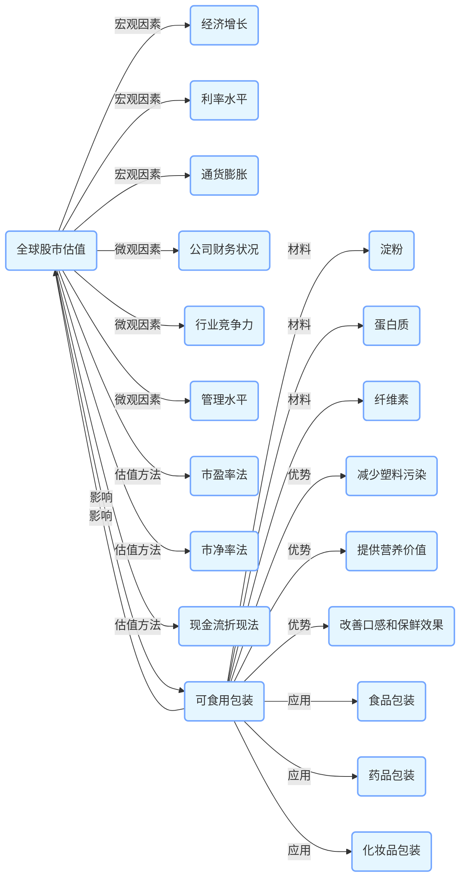

# 全球股市估值与可食用包装在减少塑料污染中的作用

> 关键词：全球股市估值、可食用包装、塑料污染、可持续发展、金融市场、环保技术、经济与环境

> 摘要：本文旨在探讨全球股市估值与可食用包装在减少塑料污染中的作用这一跨领域话题。一方面，详细分析全球股市估值的影响因素、评估方法及其在经济体系中的重要性，揭示金融市场对不同行业的价值判断机制。另一方面，深入研究可食用包装作为一种创新的环保技术，其在减少塑料污染方面的原理、优势和应用现状。通过对两者关系的探讨，阐述金融市场如何通过估值影响可食用包装行业的发展，以及可食用包装行业的进步又如何反过来影响全球股市的结构和估值体系，从而为实现经济与环境的可持续发展提供新的思路和视角。

## 1. 背景介绍 
### 1.1 目的和范围
本文的目的在于综合分析全球股市估值体系和可食用包装在减少塑料污染中的作用，并探讨两者之间的内在联系。范围涵盖全球股市的主要板块和市场，包括发达经济体和新兴经济体的股市表现。同时，对可食用包装的技术原理、生产应用、市场前景等方面进行全面研究，以及分析其在不同行业和地区减少塑料污染的实际效果。

### 1.2 预期读者
本文预期读者包括金融领域的投资者、分析师、研究人员，关注环保技术和可持续发展的专业人士，以及对经济与环境交叉领域感兴趣的普通读者。希望通过本文，为不同背景的读者提供有价值的信息和思考方向。

### 1.3 文档结构概述
本文首先介绍全球股市估值和可食用包装的相关背景知识，包括术语定义和概念解释。接着阐述两者的核心概念与联系，通过示意图和流程图展示其内在逻辑。然后详细讲解全球股市估值的核心算法原理和可食用包装的技术操作步骤，并用数学模型和公式进行分析。之后通过项目实战案例，展示可食用包装在实际应用中的代码实现和效果分析。再探讨可食用包装的实际应用场景和相关工具资源推荐。最后总结未来发展趋势与挑战，提供常见问题解答和扩展阅读参考资料。

### 1.4 术语表
#### 1.4.1 核心术语定义
- **全球股市估值**：指对全球范围内股票市场中各类股票价值的评估过程和结果，反映了市场对上市公司未来盈利能力和风险水平的预期。
- **可食用包装**：一种由可食用材料制成的包装，在完成包装功能后可以直接食用或自然降解，不会对环境造成污染。
- **塑料污染**：指由于塑料废弃物在环境中大量积累，难以自然降解，从而对生态系统、土壤、水体等造成的一系列负面影响。

#### 1.4.2 相关概念解释
- **市盈率（P/E）**：是股票价格除以每股收益的比率，用于衡量股票的相对估值水平，反映投资者为获取公司每股收益所愿意支付的价格。
- **市净率（P/B）**：是股票价格与每股净资产的比率，用于评估股票的估值是否合理，反映了市场对公司净资产的认可程度。
- **生物可降解材料**：指在自然环境中，能被微生物分解为二氧化碳、水和生物质等无害物质的材料，可食用包装材料通常具有生物可降解性。

#### 1.4.3 缩略词列表
- **P/E**：市盈率（Price-to-Earnings Ratio）
- **P/B**：市净率（Price-to-Book Ratio）
- **GDP**：国内生产总值（Gross Domestic Product）

## 2. 核心概念与联系 

### 全球股市估值的核心概念
全球股市估值是一个复杂的过程，受到多种因素的影响。从宏观层面来看，经济增长、利率水平、通货膨胀等因素会影响整个股市的估值水平。例如，在经济增长强劲的时期，企业的盈利能力通常会增强，股市估值也会相应提高；而利率上升会增加企业的融资成本，降低股票的吸引力，导致股市估值下降。

从微观层面来看，公司的财务状况、行业竞争力、管理水平等因素会影响个股的估值。例如，一家具有高盈利能力、稳定现金流和良好发展前景的公司，其股票估值往往会较高。

全球股市估值的常用方法包括市盈率法、市净率法、现金流折现法等。市盈率法是通过比较公司的市盈率与同行业平均市盈率或历史市盈率来评估股票的估值是否合理；市净率法是通过比较公司的市净率与同行业平均市净率或历史市净率来评估股票的估值是否合理；现金流折现法是通过预测公司未来的现金流，并将其折现到当前来评估股票的内在价值。

### 可食用包装的核心概念
可食用包装是一种创新的环保技术，旨在解决塑料包装带来的环境污染问题。可食用包装材料通常由天然的可食用物质制成，如淀粉、蛋白质、纤维素等。这些材料具有良好的生物相容性和可降解性，在完成包装功能后可以直接食用或自然降解，不会对环境造成污染。

可食用包装具有多种优势。首先，它可以减少塑料包装的使用，从而降低塑料污染对环境的影响。其次，可食用包装可以提供额外的营养价值，例如一些可食用包装材料中含有维生素、矿物质等营养成分。此外，可食用包装还可以改善食品的口感和保鲜效果，延长食品的保质期。

### 两者的联系
全球股市估值与可食用包装之间存在着密切的联系。一方面，金融市场对可食用包装行业的估值会影响该行业的发展。如果股市对可食用包装企业的估值较高，会吸引更多的资金流入该行业，促进企业的研发和生产，推动可食用包装技术的进步和应用。另一方面，可食用包装行业的发展也会影响全球股市的结构和估值体系。随着可食用包装技术的不断成熟和应用范围的扩大，相关企业的盈利能力和市场竞争力会逐渐增强，从而提高其在股市中的估值。同时，可食用包装行业的发展也会带动相关产业链的发展，如原材料供应、生产设备制造等，进一步影响股市的整体结构。

### 文本示意图
```plaintext
全球股市估值
|-- 宏观因素
|   |-- 经济增长
|   |-- 利率水平
|   |-- 通货膨胀
|-- 微观因素
|   |-- 公司财务状况
|   |-- 行业竞争力
|   |-- 管理水平
|-- 估值方法
|   |-- 市盈率法
|   |-- 市净率法
|   |-- 现金流折现法

可食用包装
|-- 材料
|   |-- 淀粉
|   |-- 蛋白质
|   |-- 纤维素
|-- 优势
|   |-- 减少塑料污染
|   |-- 提供营养价值
|   |-- 改善口感和保鲜效果
|-- 应用
|   |-- 食品包装
|   |-- 药品包装
|   |-- 化妆品包装

两者联系
|-- 股市估值影响可食用包装行业发展
|-- 可食用包装行业发展影响股市结构和估值体系
```

### Mermaid 流程图


## 3. 核心算法原理 & 具体操作步骤 

### 全球股市估值的核心算法原理及 Python 实现

#### 市盈率法
市盈率法是通过比较公司的市盈率与同行业平均市盈率或历史市盈率来评估股票的估值是否合理。计算公式为：

$$P/E = \frac{股价}{每股收益}$$

以下是一个简单的 Python 代码示例，用于计算某公司的市盈率并与同行业平均市盈率进行比较：

```python
# 定义某公司的股价和每股收益
stock_price = 50
earnings_per_share = 5

# 计算该公司的市盈率
pe_ratio = stock_price / earnings_per_share

# 假设同行业平均市盈率为 10
industry_average_pe = 10

# 判断该公司的估值情况
if pe_ratio < industry_average_pe:
    print("该公司股票可能被低估")
elif pe_ratio > industry_average_pe:
    print("该公司股票可能被高估")
else:
    print("该公司股票估值合理")
```

#### 市净率法
市净率法是通过比较公司的市净率与同行业平均市净率或历史市净率来评估股票的估值是否合理。计算公式为：

$$P/B = \frac{股价}{每股净资产}$$

以下是一个简单的 Python 代码示例，用于计算某公司的市净率并与同行业平均市净率进行比较：

```python
# 定义某公司的股价和每股净资产
stock_price = 50
book_value_per_share = 10

# 计算该公司的市净率
pb_ratio = stock_price / book_value_per_share

# 假设同行业平均市净率为 3
industry_average_pb = 3

# 判断该公司的估值情况
if pb_ratio < industry_average_pb:
    print("该公司股票可能被低估")
elif pb_ratio > industry_average_pb:
    print("该公司股票可能被高估")
else:
    print("该公司股票估值合理")
```

#### 现金流折现法
现金流折现法是通过预测公司未来的现金流，并将其折现到当前来评估股票的内在价值。计算公式为：

$$V = \sum_{t=1}^{n} \frac{CF_t}{(1 + r)^t}$$

其中，$V$ 表示股票的内在价值，$CF_t$ 表示第 $t$ 期的现金流，$r$ 表示折现率，$n$ 表示预测期数。

以下是一个简单的 Python 代码示例，用于计算某公司股票的内在价值：

```python
# 定义预测期数、折现率和各期现金流
n = 5
r = 0.1
cash_flows = [10, 12, 15, 18, 20]

# 计算股票的内在价值
intrinsic_value = 0
for t in range(n):
    intrinsic_value += cash_flows[t] / (1 + r) ** (t + 1)

print(f"该公司股票的内在价值为: {intrinsic_value}")
```

### 可食用包装的具体操作步骤

#### 材料选择
根据包装的用途和要求，选择合适的可食用包装材料。例如，对于食品包装，可以选择淀粉、蛋白质等天然可食用物质；对于药品包装，可以选择具有良好生物相容性和稳定性的材料。

#### 材料处理
对选择的材料进行处理，使其具有良好的成膜性和包装性能。例如，对于淀粉材料，可以通过加热、糊化等处理方法，使其形成均匀的溶液；对于蛋白质材料，可以通过调节 pH 值、添加交联剂等方法，提高其成膜性能。

#### 包装制备
采用适当的方法制备可食用包装。常见的方法包括溶液浇铸法、挤出法、吹塑法等。例如，溶液浇铸法是将处理好的材料溶液均匀地浇铸在模具上，然后通过干燥等方法使其形成薄膜；挤出法是将材料通过挤出机挤出成所需的形状；吹塑法是将材料通过吹塑机吹制成薄膜或容器。

#### 性能测试
对制备好的可食用包装进行性能测试，确保其满足包装的要求。测试内容包括机械性能、阻隔性能、保鲜性能等。例如，通过拉伸试验测试包装的拉伸强度和断裂伸长率；通过气体透过率测试包装的阻隔性能。

## 4. 数学模型和公式 & 详细讲解 & 举例说明 

### 全球股市估值的数学模型和公式

#### 市盈率模型
市盈率模型是基于公司的盈利能力来评估股票的价值。其基本公式为：

$$P = E \times P/E$$

其中，$P$ 表示股票价格，$E$ 表示每股收益，$P/E$ 表示市盈率。

例如，某公司的每股收益为 2 元，同行业平均市盈率为 15，则该公司股票的合理价格为：

$$P = 2 \times 15 = 30 \text{ 元}$$

#### 市净率模型
市净率模型是基于公司的净资产来评估股票的价值。其基本公式为：

$$P = B \times P/B$$

其中，$P$ 表示股票价格，$B$ 表示每股净资产，$P/B$ 表示市净率。

例如，某公司的每股净资产为 10 元，同行业平均市净率为 2，则该公司股票的合理价格为：

$$P = 10 \times 2 = 20 \text{ 元}$$

#### 现金流折现模型
现金流折现模型是基于公司未来的现金流来评估股票的内在价值。其基本公式为：

$$V = \sum_{t=1}^{n} \frac{CF_t}{(1 + r)^t} + \frac{TV}{(1 + r)^n}$$

其中，$V$ 表示股票的内在价值，$CF_t$ 表示第 $t$ 期的现金流，$r$ 表示折现率，$n$ 表示预测期数，$TV$ 表示终值。

例如，某公司未来 5 年的现金流分别为 100 万元、120 万元、150 万元、180 万元、200 万元，折现率为 10%，终值为 1000 万元，则该公司股票的内在价值为：

$$V = \frac{100}{(1 + 0.1)^1} + \frac{120}{(1 + 0.1)^2} + \frac{150}{(1 + 0.1)^3} + \frac{180}{(1 + 0.1)^4} + \frac{200}{(1 + 0.1)^5} + \frac{1000}{(1 + 0.1)^5} \approx 1175.23 \text{ 万元}$$

### 可食用包装的数学模型和公式

#### 阻隔性能模型
可食用包装的阻隔性能是其重要的性能指标之一，通常用气体透过率来表示。气体透过率的计算公式为：

$$Q = \frac{D \times S \times \Delta p}{L}$$

其中，$Q$ 表示气体透过率，$D$ 表示气体在包装材料中的扩散系数，$S$ 表示气体在包装材料中的溶解度系数，$\Delta p$ 表示包装两侧的气体压力差，$L$ 表示包装材料的厚度。

例如，某可食用包装材料的扩散系数为 $10^{-10} \text{ m}^2/\text{s}$，溶解度系数为 $10^{-3} \text{ mol}/(\text{m}^3 \cdot \text{Pa})$，包装两侧的氧气压力差为 $10^5 \text{ Pa}$，包装材料的厚度为 $0.1 \text{ mm}$，则该包装材料的氧气透过率为：

$$Q = \frac{10^{-10} \times 10^{-3} \times 10^5}{0.1 \times 10^{-3}} = 10^{-5} \text{ mol}/(\text{m}^2 \cdot \text{s} \cdot \text{Pa})$$

#### 机械性能模型
可食用包装的机械性能通常用拉伸强度和断裂伸长率来表示。拉伸强度的计算公式为：

$$\sigma = \frac{F}{A}$$

其中，$\sigma$ 表示拉伸强度，$F$ 表示最大拉伸力，$A$ 表示试样的横截面积。

断裂伸长率的计算公式为：

$$\varepsilon = \frac{L - L_0}{L_0} \times 100\%$$

其中，$\varepsilon$ 表示断裂伸长率，$L$ 表示试样断裂时的长度，$L_0$ 表示试样的原始长度。

例如，某可食用包装材料的最大拉伸力为 100 N，试样的横截面积为 $10 \text{ mm}^2$，则该材料的拉伸强度为：

$$\sigma = \frac{100}{10 \times 10^{-6}} = 10^7 \text{ Pa}$$

如果该材料的原始长度为 100 mm，断裂时的长度为 150 mm，则该材料的断裂伸长率为：

$$\varepsilon = \frac{150 - 100}{100} \times 100\% = 50\%$$

## 5. 项目实战：代码实际案例和详细解释说明 

### 5.1  开发环境搭建
在进行可食用包装相关的项目实战时，我们主要使用 Python 进行数据处理和分析。以下是开发环境的搭建步骤：

1. **安装 Python**：从 Python 官方网站（https://www.python.org/downloads/）下载并安装 Python 3.x 版本。
2. **安装必要的库**：使用以下命令安装所需的库：
```bash
pip install pandas numpy matplotlib scikit-learn
```

### 5.2  源代码详细实现和代码解读

#### 数据收集与预处理
假设我们要研究可食用包装材料的性能与成本之间的关系，我们可以收集相关的数据并进行预处理。以下是一个简单的示例代码：

```python
import pandas as pd
import numpy as np

# 读取数据
data = pd.read_csv('edible_packaging_data.csv')

# 查看数据基本信息
print(data.info())

# 处理缺失值
data = data.dropna()

# 分离特征和标签
X = data.drop('cost', axis=1)
y = data['cost']

# 数据标准化
from sklearn.preprocessing import StandardScaler
scaler = StandardScaler()
X_scaled = scaler.fit_transform(X)
```

**代码解读**：
- `pd.read_csv('edible_packaging_data.csv')`：读取存储可食用包装数据的 CSV 文件。
- `data.dropna()`：删除包含缺失值的行，以确保数据的完整性。
- `data.drop('cost', axis=1)`：将特征数据（除成本列外的所有列）分离出来。
- `data['cost']`：将标签数据（成本列）分离出来。
- `StandardScaler().fit_transform(X)`：对特征数据进行标准化处理，使数据具有零均值和单位方差，有助于提高模型的训练效果。

#### 模型训练与评估
我们可以使用线性回归模型来预测可食用包装材料的成本。以下是示例代码：

```python
from sklearn.model_selection import train_test_split
from sklearn.linear_model import LinearRegression
from sklearn.metrics import mean_squared_error

# 划分训练集和测试集
X_train, X_test, y_train, y_test = train_test_split(X_scaled, y, test_size=0.2, random_state=42)

# 创建线性回归模型
model = LinearRegression()

# 训练模型
model.fit(X_train, y_train)

# 预测
y_pred = model.predict(X_test)

# 评估模型
mse = mean_squared_error(y_test, y_pred)
rmse = np.sqrt(mse)
print(f"均方误差 (MSE): {mse}")
print(f"均方根误差 (RMSE): {rmse}")
```

**代码解读**：
- `train_test_split(X_scaled, y, test_size=0.2, random_state=42)`：将数据集划分为训练集和测试集，测试集占总数据的 20%。
- `LinearRegression()`：创建线性回归模型。
- `model.fit(X_train, y_train)`：使用训练集数据对模型进行训练。
- `model.predict(X_test)`：使用训练好的模型对测试集数据进行预测。
- `mean_squared_error(y_test, y_pred)`：计算预测值与真实值之间的均方误差，用于评估模型的性能。
- `np.sqrt(mse)`：计算均方根误差，更直观地反映模型的预测误差。

### 5.3  代码解读与分析
通过上述代码，我们完成了可食用包装材料成本预测的项目实战。从数据预处理阶段，我们确保了数据的质量和可用性；在模型训练阶段，我们使用线性回归模型对数据进行拟合；在模型评估阶段，我们使用均方误差和均方根误差来评估模型的性能。

均方误差和均方根误差越小，说明模型的预测效果越好。如果误差较大，我们可以考虑使用其他模型（如决策树、随机森林等）或对数据进行进一步的特征工程处理，以提高模型的性能。

## 6. 实际应用场景 

### 食品行业
在食品行业，可食用包装具有广阔的应用前景。例如，糖果、巧克力等食品可以使用可食用包装膜进行包装，消费者在食用食品时可以直接将包装一起吃掉，既方便又环保。此外，一些快餐食品可以使用可食用餐具进行包装，减少一次性塑料餐具的使用。

### 药品行业
在药品行业，可食用包装可以用于胶囊、片剂等药品的包装。可食用包装材料可以保证药品的安全性和稳定性，同时减少塑料包装对环境的污染。例如，一些植物提取物制成的可食用胶囊可以替代传统的明胶胶囊，更加环保和健康。

### 化妆品行业
在化妆品行业，可食用包装可以用于一些天然化妆品的包装。例如，一些植物精华液可以使用可食用包装瓶进行包装，消费者在使用完化妆品后可以将包装瓶进行自然降解，减少对环境的影响。

### 物流行业
在物流行业，可食用包装可以用于一些易腐食品的运输包装。例如，一些新鲜水果、蔬菜等可以使用可食用保鲜袋进行包装，既能保证食品的新鲜度，又能减少塑料包装的使用。

## 7. 工具和资源推荐
### 7.1 学习资源推荐
#### 7.1.1 书籍推荐
- 《金融市场与金融机构基础》：全面介绍了金融市场的基本概念、运行机制和金融机构的业务模式，对于理解全球股市估值具有重要的参考价值。
- 《环境科学概论》：系统阐述了环境科学的基本原理和方法，包括塑料污染的来源、危害和治理措施，有助于深入了解可食用包装在减少塑料污染中的作用。
- 《Python 数据分析实战》：通过实际案例介绍了 Python 在数据分析领域的应用，对于学习如何使用 Python 进行全球股市估值和可食用包装相关的数据处理和分析非常有帮助。

#### 7.1.2 在线课程
- Coursera 上的“Financial Markets”课程：由耶鲁大学教授授课，深入讲解了金融市场的理论和实践，包括股票市场的估值方法和投资策略。
- edX 上的“Environmental Science and Sustainability”课程：提供了环境科学和可持续发展的全面知识，包括塑料污染的现状和解决方案，以及可食用包装等创新技术。
- 中国大学 MOOC 上的“Python 语言程序设计”课程：适合初学者学习 Python 编程语言，为后续进行相关的数据分析和建模打下基础。

#### 7.1.3 技术博客和网站
- Seeking Alpha（https://seekingalpha.com/）：提供全球股市的分析和评论，包括公司财报解读、行业趋势分析等，对于了解全球股市估值的最新动态非常有帮助。
- ScienceDirect（https://www.sciencedirect.com/）：是一个科学文献数据库，包含了大量关于环境科学、材料科学等领域的研究论文，对于深入研究可食用包装的技术原理和应用具有重要的参考价值。
- Medium（https://medium.com/）：有许多技术博客和文章，涵盖了金融、科技、环保等多个领域，用户可以从中获取关于全球股市估值和可食用包装的最新观点和研究成果。

### 7.2 开发工具框架推荐
#### 7.2.1 IDE和编辑器
- PyCharm：是一款专业的 Python 集成开发环境，具有代码编辑、调试、版本控制等功能，适合进行大规模的 Python 项目开发。
- Jupyter Notebook：是一个交互式的开发环境，支持多种编程语言，尤其适合进行数据分析和可视化，方便用户快速验证想法和展示结果。
- Visual Studio Code：是一款轻量级的代码编辑器，支持多种编程语言和插件扩展，具有丰富的功能和良好的用户体验。

#### 7.2.2 调试和性能分析工具
- pdb：是 Python 自带的调试工具，可以帮助用户在代码中设置断点、查看变量值等，方便进行代码调试。
- cProfile：是 Python 标准库中的性能分析工具，可以统计代码的执行时间和函数调用次数，帮助用户找出代码中的性能瓶颈。
- Py-Spy：是一个跨平台的 Python 性能分析工具，可以实时监测 Python 程序的性能，提供直观的性能分析报告。

#### 7.2.3 相关框架和库
- Pandas：是一个强大的数据分析库，提供了高效的数据结构和数据处理工具，适合进行金融数据和可食用包装相关数据的处理和分析。
- NumPy：是 Python 中用于科学计算的基础库，提供了高效的数组操作和数学函数，为数据分析和建模提供了基础支持。
- Scikit-learn：是一个开源的机器学习库，提供了丰富的机器学习算法和工具，适合进行全球股市估值和可食用包装相关的预测和建模任务。

### 7.3 相关论文著作推荐
#### 7.3.1 经典论文
- “Valuation of Stocks: A Review of the Literature”：对股票估值的理论和方法进行了全面的综述，为研究全球股市估值提供了重要的理论基础。
- “Edible Films and Coatings: Tomorrow's Packagings: A Review”：对可食用包装的发展历程、技术原理和应用前景进行了系统的阐述，是可食用包装领域的经典论文。
- “Plastic Pollution in the Marine Environment: A Review of the Sources, Fate and Effects of Microplastics”：深入分析了海洋环境中塑料污染的来源、命运和影响，为研究可食用包装在减少塑料污染中的作用提供了重要的背景信息。

#### 7.3.2 最新研究成果
- 关注《Nature》《Science》等国际顶级学术期刊，以及《Journal of Food Science》《Environmental Science & Technology》等专业期刊，获取可食用包装和全球股市估值领域的最新研究成果。

#### 7.3.3 应用案例分析
- 一些行业报告和研究机构发布的关于可食用包装和全球股市估值的应用案例分析，如麦肯锡、波士顿咨询等机构的报告，通过实际案例展示了可食用包装在不同行业的应用效果和全球股市估值的实践经验。

## 8. 总结：未来发展趋势与挑战

### 全球股市估值的未来发展趋势与挑战
#### 趋势
- **数字化和智能化**：随着信息技术的不断发展，全球股市估值将越来越依赖于数字化和智能化的分析工具和方法。例如，利用大数据、人工智能等技术可以更准确地分析市场数据和公司基本面，提高估值的准确性和效率。
- **全球化和一体化**：全球金融市场的联系日益紧密，股市估值将越来越受到全球经济和政治环境的影响。投资者需要更加关注全球市场的动态，进行跨市场、跨行业的估值分析。
- **可持续发展导向**：随着社会对可持续发展的关注度不断提高，股市估值将越来越注重公司的环境、社会和治理（ESG）表现。具有良好 ESG 表现的公司将更容易获得投资者的青睐，其股票估值也可能更高。

#### 挑战
- **市场不确定性增加**：全球经济和政治环境的不确定性增加，如贸易摩擦、地缘政治冲突等，将给股市估值带来更大的挑战。投资者需要更加谨慎地评估风险，调整估值模型和方法。
- **数据质量和隐私问题**：数字化和智能化的估值方法依赖于大量的数据，但数据质量和隐私问题可能会影响估值的准确性和可靠性。投资者需要加强数据管理和保护，确保数据的真实性和安全性。
- **新经济模式和技术的挑战**：新兴经济模式和技术的不断涌现，如共享经济、区块链等，给传统的股市估值方法带来了挑战。投资者需要不断学习和创新，开发适应新经济模式和技术的估值方法。

### 可食用包装的未来发展趋势与挑战
#### 趋势
- **技术创新和性能提升**：随着材料科学和生物技术的不断发展，可食用包装的技术将不断创新，其性能将得到进一步提升。例如，开发具有更高阻隔性能、更好机械性能和更长保鲜期的可食用包装材料。
- **应用领域拓展**：可食用包装的应用领域将不断拓展，除了食品、药品、化妆品等行业外，还将在其他领域得到广泛应用。例如，在电子、建材等行业，可食用包装可以作为一种环保的包装解决方案。
- **产业化和规模化发展**：随着市场需求的增加和技术的成熟，可食用包装将逐渐实现产业化和规模化发展。生产企业将不断扩大生产规模，降低生产成本，提高产品质量和市场竞争力。

#### 挑战
- **成本较高**：目前可食用包装的生产成本相对较高，限制了其大规模应用。需要进一步研发和改进生产工艺，降低生产成本，提高可食用包装的性价比。
- **消费者接受度**：部分消费者对可食用包装的安全性和口感存在疑虑，影响了其市场推广。需要加强宣传和教育，提高消费者对可食用包装的认知度和接受度。
- **标准和法规不完善**：目前可食用包装的标准和法规还不完善，缺乏统一的质量标准和监管体系。需要加快制定相关标准和法规，规范可食用包装的生产和应用。

### 两者关系的未来发展趋势与挑战
#### 趋势
- **相互促进和融合**：全球股市估值将更加关注可食用包装等环保产业的发展，为其提供更多的资金支持和市场认可。同时，可食用包装行业的发展也将为股市带来新的投资机会和增长点，促进股市的结构优化和可持续发展。
- **绿色金融的兴起**：随着可持续发展理念的深入人心，绿色金融将逐渐兴起。股市估值将更加注重公司的绿色发展表现，可食用包装企业将更容易获得绿色金融的支持，推动其技术创新和产业发展。

#### 挑战
- **估值方法的适应性**：目前的股市估值方法主要基于传统行业的特点和规律，对于可食用包装等新兴环保产业的适应性可能不足。需要开发更加适合新兴产业的估值方法，准确评估其价值和潜力。
- **市场波动和风险**：可食用包装行业作为新兴产业，其发展过程中可能会面临市场波动和风险。股市估值需要更加准确地评估这些风险，为投资者提供合理的投资建议。

## 9. 附录：常见问题与解答

### 全球股市估值相关问题
- **问**：市盈率和市净率哪个更重要？
**答**：市盈率和市净率都是常用的股票估值指标，它们各有优缺点，不能简单地说哪个更重要。市盈率主要反映公司的盈利能力，适用于盈利稳定的公司；市净率主要反映公司的净资产价值，适用于资产规模较大的公司。在实际应用中，投资者通常会综合考虑市盈率、市净率等多个指标，以及公司的基本面和行业前景，进行全面的估值分析。

- **问**：现金流折现法中的折现率如何确定？
**答**：折现率的确定是现金流折现法中的关键环节，它反映了投资者对投资风险的预期。折现率的确定通常需要考虑多个因素，如无风险利率、市场风险溢价、公司特定风险等。一般来说，可以使用资本资产定价模型（CAPM）来计算折现率：

$$r = R_f + \beta \times (R_m - R_f)$$

其中，$r$ 表示折现率，$R_f$ 表示无风险利率，$\beta$ 表示公司的贝塔系数，$R_m$ 表示市场收益率。

### 可食用包装相关问题
- **问**：可食用包装安全吗？
**答**：可食用包装通常由天然的可食用物质制成，如淀粉、蛋白质、纤维素等，这些物质在食品和药品领域已经有广泛的应用，安全性有一定的保障。同时，可食用包装的生产和使用也需要遵循相关的食品安全标准和法规，确保其安全性。

- **问**：可食用包装的保鲜效果如何？
**答**：可食用包装的保鲜效果取决于其材料和结构。一些可食用包装材料具有良好的阻隔性能，可以有效地阻止氧气、水分和微生物的侵入，延长食品的保质期。例如，一些含有抗菌成分的可食用包装可以抑制微生物的生长，提高食品的保鲜效果。

### 两者关系相关问题
- **问**：股市估值如何影响可食用包装行业的发展？
**答**：股市估值对可食用包装行业的发展具有重要的影响。如果股市对可食用包装企业的估值较高，会吸引更多的资金流入该行业，促进企业的研发和生产，推动可食用包装技术的进步和应用。相反，如果股市对可食用包装企业的估值较低，可能会导致企业融资困难，限制其发展。

- **问**：可食用包装行业的发展对股市有哪些影响？
**答**：可食用包装行业的发展对股市有多个方面的影响。一方面，随着可食用包装行业的发展，相关企业的盈利能力和市场竞争力会逐渐增强，从而提高其在股市中的估值，为投资者带来投资机会。另一方面，可食用包装行业的发展也会带动相关产业链的发展，如原材料供应、生产设备制造等，进一步影响股市的整体结构。

## 10. 扩展阅读 & 参考资料
### 扩展阅读
- 《金融炼金术》：乔治·索罗斯的经典著作，深入探讨了金融市场的运行机制和投资者的行为心理，对于理解全球股市估值的复杂性具有重要的启示作用。
- 《创新者的窘境》：克莱顿·克里斯坦森的著作，阐述了创新在企业发展中的重要性和挑战，对于可食用包装等新兴产业的发展具有一定的借鉴意义。
- 《寂静的春天》：蕾切尔·卡森的经典著作，引发了全球对环境污染问题的关注，对于深入了解塑料污染的危害和可食用包装在减少塑料污染中的作用具有重要的意义。

### 参考资料
- 国际货币基金组织（IMF）发布的《世界经济展望》报告，提供了全球经济增长和金融市场的最新数据和分析。
- 世界银行发布的《全球发展金融》报告，对全球金融市场的发展和趋势进行了深入的研究和分析。
- 联合国环境规划署（UNEP）发布的相关报告和研究成果，提供了关于塑料污染和可持续发展的最新信息和政策建议。
- 各证券交易所发布的上市公司财报和相关公告，是研究全球股市估值的重要数据来源。
- 相关学术期刊和会议论文，如《Journal of Financial Economics》《Journal of Food Science》等，提供了全球股市估值和可食用包装领域的最新研究成果和技术进展。