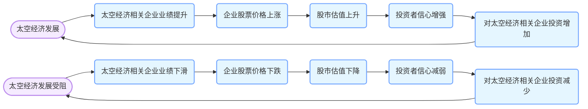

# 全球股市估值与太空经济发展的关系

> 关键词：全球股市估值、太空经济、股票市场、经济发展、产业关联、投资趋势、市场动态

> 摘要：本文聚焦于全球股市估值与太空经济发展之间的关系。在当今科技迅速发展的时代，太空经济作为新兴领域正蓬勃兴起，其发展态势对全球股市产生着越来越重要的影响。文章深入剖析了两者之间的内在联系，包括太空经济如何影响相关企业的股价及整体股市估值，以及股市估值的变化又如何反作用于太空经济的发展。通过对核心概念、算法原理、数学模型、实际案例等多方面的探讨，旨在为投资者、政策制定者和相关研究人员提供全面且深入的参考，以更好地理解和把握全球股市与太空经济的发展趋势。

## 1. 背景介绍 
### 1.1 目的和范围
本研究的主要目的在于全面、深入地探究全球股市估值与太空经济发展之间的相互关系。通过对两者关系的研究，为投资者提供关于太空经济相关股票投资的决策依据，帮助政策制定者制定更有利于太空经济发展的政策，同时为学术研究人员提供新的研究视角和思路。

研究范围涵盖全球主要股票市场，包括美国的纽约证券交易所、纳斯达克证券交易所，欧洲的伦敦证券交易所、泛欧证券交易所，亚洲的东京证券交易所、上海证券交易所等。同时，对太空经济的研究范围包括太空探索、卫星通信、太空旅游、太空资源开发等多个领域。

### 1.2 预期读者
本文的预期读者主要包括以下几类：
- **投资者**：希望通过了解太空经济与股市估值的关系，寻找有潜力的投资机会，优化投资组合。
- **政策制定者**：需要依据太空经济的发展趋势和股市表现，制定合理的产业政策和金融政策，促进太空经济的健康发展。
- **学术研究人员**：对全球股市和太空经济领域的学术研究感兴趣，希望从本文中获取相关的理论和实证研究成果。
- **企业管理者**：关注太空经济相关企业的发展，以便在企业战略规划、市场定位等方面做出更明智的决策。

### 1.3 文档结构概述
本文将按照以下结构展开：
- **核心概念与联系**：介绍全球股市估值和太空经济的核心概念，分析两者之间的内在联系，并通过文本示意图和 Mermaid 流程图进行直观展示。
- **核心算法原理 & 具体操作步骤**：阐述用于分析全球股市估值与太空经济发展关系的核心算法原理，并给出具体的操作步骤，同时使用 Python 源代码进行详细说明。
- **数学模型和公式 & 详细讲解 & 举例说明**：建立数学模型和公式来描述两者之间的关系，对模型和公式进行详细讲解，并通过具体例子进行说明。
- **项目实战：代码实际案例和详细解释说明**：通过实际的项目案例，展示如何运用相关算法和模型来分析全球股市估值与太空经济发展的关系，包括开发环境搭建、源代码实现和代码解读。
- **实际应用场景**：探讨全球股市估值与太空经济发展关系在投资决策、政策制定、企业战略规划等实际场景中的应用。
- **工具和资源推荐**：推荐相关的学习资源、开发工具框架和论文著作，帮助读者进一步深入学习和研究。
- **总结：未来发展趋势与挑战**：总结全球股市估值与太空经济发展的未来趋势，并分析可能面临的挑战。
- **附录：常见问题与解答**：对读者可能关心的常见问题进行解答。
- **扩展阅读 & 参考资料**：提供相关的扩展阅读材料和参考资料，方便读者进一步查阅。

### 1.4 术语表
#### 1.4.1 核心术语定义
- **全球股市估值**：指对全球范围内各个股票市场上所有上市公司股票价值的总体评估。它反映了市场对这些公司未来盈利能力和发展前景的预期。
- **太空经济**：指包括太空探索、卫星通信、太空旅游、太空资源开发等在内的与太空相关的经济活动的总和。太空经济涵盖了从基础研究、技术开发到商业应用的整个产业链。
- **股票市场**：是股票发行和交易的场所，是资本市场的重要组成部分。股票市场通过买卖股票的方式，实现资金的融通和资源的配置。
- **经济发展**：指一个国家或地区在经济、社会、技术等方面的全面进步和增长。经济发展不仅包括经济总量的增加，还包括经济结构的优化、人民生活水平的提高等方面。

#### 1.4.2 相关概念解释
- **股市指数**：是反映股票市场整体价格水平和变动趋势的指标。常见的股市指数包括道琼斯工业平均指数、标准普尔 500 指数、纳斯达克综合指数、上证指数、深证成指等。股市指数的涨跌可以反映股市的整体表现。
- **市盈率**：是股票价格与每股盈利的比率，反映了市场对公司盈利的预期和估值水平。市盈率越高，说明市场对公司的未来发展前景越看好，但也可能意味着股票价格被高估。
- **市净率**：是股票价格与每股净资产的比率，反映了市场对公司净资产的估值水平。市净率越低，说明股票价格相对净资产越便宜，但也可能意味着公司的盈利能力较弱。

#### 1.4.3 缩略词列表
- **NYSE**：纽约证券交易所（New York Stock Exchange）
- **NASDAQ**：纳斯达克证券交易所（National Association of Securities Dealers Automated Quotations）
- **LSE**：伦敦证券交易所（London Stock Exchange）
- **TSE**：东京证券交易所（Tokyo Stock Exchange）
- **SSE**：上海证券交易所（Shanghai Stock Exchange）

## 2. 核心概念与联系 
### 2.1 全球股市估值的核心概念
全球股市估值是一个综合性的概念，它受到多种因素的影响，包括宏观经济环境、公司基本面、市场情绪等。从宏观经济环境来看，经济增长、通货膨胀、利率水平等因素都会对股市估值产生影响。例如，在经济增长强劲的时期，企业的盈利能力通常会增强，市场对股票的预期也会提高，从而推动股市估值上升；而在通货膨胀率较高或利率上升的情况下，股票的吸引力可能会下降，导致股市估值下降。

公司基本面也是影响股市估值的重要因素。公司的盈利能力、资产质量、市场竞争力等都会影响市场对其股票的估值。例如，一家盈利能力强、资产质量好、市场竞争力高的公司，其股票通常会获得较高的估值；而一家盈利能力弱、资产质量差、市场竞争力低的公司，其股票估值则可能较低。

市场情绪也会对股市估值产生影响。当市场情绪乐观时，投资者对股票的需求会增加，推动股市估值上升；而当市场情绪悲观时，投资者对股票的需求会减少，导致股市估值下降。

### 2.2 太空经济的核心概念
太空经济是一个新兴的经济领域，它涉及到多个方面的活动。太空探索是太空经济的基础，包括对月球、火星等天体的探测和研究。通过太空探索，人类可以获取更多关于宇宙的知识，为未来的太空开发和利用奠定基础。

卫星通信是太空经济的重要组成部分。卫星通信具有覆盖范围广、通信质量高、不受地理条件限制等优点，广泛应用于广播电视、移动通信、气象预报等领域。随着技术的不断进步，卫星通信的应用范围还在不断扩大。

太空旅游是近年来兴起的一种太空经济活动。随着太空技术的发展和成本的降低，越来越多的人有机会体验太空旅游。太空旅游不仅可以为游客带来独特的体验，还可以促进太空技术的发展和应用。

太空资源开发是太空经济的未来发展方向。太空中蕴含着丰富的资源，如太阳能、矿产资源等。随着技术的不断进步，人类有望实现对太空资源的开发和利用，为地球的可持续发展提供支持。

### 2.3 全球股市估值与太空经济发展的联系
太空经济的发展对全球股市估值有着重要的影响。一方面，太空经济相关企业的发展会直接影响其股票价格和市值，从而影响股市估值。例如，一家成功研发出新型卫星技术的企业，其股票价格可能会大幅上涨，市值也会相应增加，进而推动整个股市估值上升。

另一方面，太空经济的发展还会带动相关产业链的发展，从而间接影响股市估值。例如，太空探索的发展会带动航天设备制造、电子信息、材料科学等相关产业的发展，这些产业的企业股票价格和市值也会相应增加，从而推动股市估值上升。

反之，全球股市估值的变化也会对太空经济的发展产生影响。当股市估值上升时，投资者对太空经济相关企业的信心会增强，会增加对这些企业的投资，从而促进太空经济的发展。例如，在股市繁荣时期，太空经济相关企业更容易获得融资，用于技术研发和项目拓展。

当股市估值下降时，投资者对太空经济相关企业的信心会减弱，会减少对这些企业的投资，从而制约太空经济的发展。例如，在股市低迷时期，太空经济相关企业可能会面临融资困难，影响其技术研发和项目拓展。

### 2.4 文本示意图
全球股市估值与太空经济发展的关系可以用以下文本示意图表示：

太空经济发展 -> 太空经济相关企业业绩提升 -> 企业股票价格上涨 -> 股市估值上升
股市估值上升 -> 投资者信心增强 -> 对太空经济相关企业投资增加 -> 太空经济发展加速

太空经济发展受阻 -> 太空经济相关企业业绩下滑 -> 企业股票价格下跌 -> 股市估值下降
股市估值下降 -> 投资者信心减弱 -> 对太空经济相关企业投资减少 -> 太空经济发展放缓

### 2.5 Mermaid 流程图


## 3. 核心算法原理 & 具体操作步骤 
### 3.1 核心算法原理
为了分析全球股市估值与太空经济发展的关系，我们可以采用回归分析的方法。回归分析是一种统计方法，用于研究自变量与因变量之间的关系。在本研究中，我们可以将太空经济发展的相关指标作为自变量，将全球股市估值的相关指标作为因变量，建立回归模型，通过对模型的估计和检验，来分析两者之间的关系。

假设我们选择太空经济相关企业的营业收入作为太空经济发展的指标，选择全球股市的总市值作为全球股市估值的指标。我们可以建立如下的线性回归模型：

$$Y = \beta_0 + \beta_1X + \epsilon$$

其中，$Y$ 表示全球股市的总市值，$X$ 表示太空经济相关企业的营业收入，$\beta_0$ 是截距项，$\beta_1$ 是斜率项，$\epsilon$ 是误差项。

### 3.2 具体操作步骤
#### 3.2.1 数据收集
首先，我们需要收集太空经济相关企业的营业收入数据和全球股市的总市值数据。太空经济相关企业的营业收入数据可以从企业的财务报表中获取，全球股市的总市值数据可以从金融数据提供商处获取。

#### 3.2.2 数据预处理
收集到的数据可能存在缺失值、异常值等问题，需要进行预处理。对于缺失值，可以采用插值法、删除法等方法进行处理；对于异常值，可以采用基于统计方法的离群值检测和处理方法进行处理。

#### 3.2.3 模型估计
使用收集到的数据，对回归模型进行估计。可以使用最小二乘法等方法来估计模型的参数 $\beta_0$ 和 $\beta_1$。

#### 3.2.4 模型检验
对估计得到的模型进行检验，包括拟合优度检验、显著性检验等。拟合优度检验用于检验模型对数据的拟合程度，显著性检验用于检验模型的参数是否显著不为零。

#### 3.2.5 结果分析
根据模型的估计和检验结果，分析太空经济发展与全球股市估值之间的关系。如果 $\beta_1$ 显著不为零，则说明太空经济发展与全球股市估值之间存在显著的线性关系；如果 $\beta_1$ 为正，则说明太空经济发展与全球股市估值呈正相关关系；如果 $\beta_1$ 为负，则说明太空经济发展与全球股市估值呈负相关关系。

### 3.3 Python 源代码详细阐述
```python
import pandas as pd
import numpy as np
import statsmodels.api as sm
import matplotlib.pyplot as plt

# 数据收集（假设已经收集到数据并保存为 CSV 文件）
data = pd.read_csv('space_economy_stock_market.csv')

# 数据预处理
# 处理缺失值
data = data.dropna()

# 提取自变量和因变量
X = data['space_enterprise_revenue']
y = data['global_stock_market_cap']

# 添加常数项
X = sm.add_constant(X)

# 模型估计
model = sm.OLS(y, X)
results = model.fit()

# 模型检验
print(results.summary())

# 结果分析
beta_1 = results.params[1]
if beta_1 > 0:
    print("太空经济发展与全球股市估值呈正相关关系。")
elif beta_1 < 0:
    print("太空经济发展与全球股市估值呈负相关关系。")
else:
    print("太空经济发展与全球股市估值之间不存在线性关系。")

# 绘制散点图和回归直线
plt.scatter(data['space_enterprise_revenue'], data['global_stock_market_cap'])
plt.plot(data['space_enterprise_revenue'], results.predict(X), color='red')
plt.xlabel('太空经济相关企业营业收入')
plt.ylabel('全球股市总市值')
plt.title('太空经济发展与全球股市估值的关系')
plt.show()
```

## 4. 数学模型和公式 & 详细讲解 & 举例说明 
### 4.1 数学模型
在前面的章节中，我们建立了线性回归模型：

$$Y = \beta_0 + \beta_1X + \epsilon$$

其中，$Y$ 表示全球股市的总市值，$X$ 表示太空经济相关企业的营业收入，$\beta_0$ 是截距项，$\beta_1$ 是斜率项，$\epsilon$ 是误差项。

### 4.2 公式详细讲解
- **截距项 $\beta_0$**：表示当太空经济相关企业的营业收入为零时，全球股市的总市值。在实际应用中，$\beta_0$ 可能没有实际的经济意义，但它是回归模型的一个重要参数。
- **斜率项 $\beta_1$**：表示太空经济相关企业的营业收入每增加一个单位，全球股市的总市值平均增加的单位数。$\beta_1$ 的符号和大小反映了太空经济发展与全球股市估值之间的关系。
- **误差项 $\epsilon$**：表示模型无法解释的部分，即除了太空经济相关企业的营业收入之外，其他因素对全球股市总市值的影响。误差项通常假设服从均值为零、方差为常数的正态分布。

### 4.3 举例说明
假设我们通过回归分析得到的回归模型为：

$$Y = 1000 + 2X + \epsilon$$

其中，$Y$ 表示全球股市的总市值（单位：万亿美元），$X$ 表示太空经济相关企业的营业收入（单位：千亿美元）。

- **截距项 $\beta_0 = 1000$**：表示当太空经济相关企业的营业收入为零时，全球股市的总市值为 1000 万亿美元。
- **斜率项 $\beta_1 = 2$**：表示太空经济相关企业的营业收入每增加 1 千亿美元，全球股市的总市值平均增加 2 万亿美元。

例如，如果太空经济相关企业的营业收入为 500 千亿美元，则根据回归模型预测的全球股市总市值为：

$$Y = 1000 + 2\times500 = 2000$$（万亿美元）

当然，这只是一个预测值，实际的全球股市总市值可能会受到其他因素的影响而有所不同。

## 5. 项目实战：代码实际案例和详细解释说明 
### 5.1  开发环境搭建
#### 5.1.1 安装 Python
首先，需要安装 Python 编程语言。可以从 Python 官方网站（https://www.python.org/downloads/） 下载适合自己操作系统的 Python 安装包，并按照安装向导进行安装。

#### 5.1.2 安装必要的库
在本项目中，需要使用 pandas、numpy、statsmodels、matplotlib 等库。可以使用以下命令来安装这些库：

```sh
pip install pandas numpy statsmodels matplotlib
```

### 5.2  源代码详细实现和代码解读
```python
import pandas as pd
import numpy as np
import statsmodels.api as sm
import matplotlib.pyplot as plt

# 数据收集（假设已经收集到数据并保存为 CSV 文件）
data = pd.read_csv('space_economy_stock_market.csv')

# 代码解读：使用 pandas 库的 read_csv 函数读取保存有太空经济相关企业营业收入和全球股市总市值数据的 CSV 文件，并将数据存储在 DataFrame 对象 data 中。

# 数据预处理
# 处理缺失值
data = data.dropna()

# 代码解读：使用 DataFrame 对象的 dropna 函数删除包含缺失值的行，以确保数据的完整性。

# 提取自变量和因变量
X = data['space_enterprise_revenue']
y = data['global_stock_market_cap']

# 代码解读：从 DataFrame 对象 data 中提取太空经济相关企业的营业收入数据作为自变量 X，提取全球股市的总市值数据作为因变量 y。

# 添加常数项
X = sm.add_constant(X)

# 代码解读：使用 statsmodels 库的 add_constant 函数为自变量 X 添加常数项，以便进行回归分析。

# 模型估计
model = sm.OLS(y, X)
results = model.fit()

# 代码解读：使用 statsmodels 库的 OLS 函数创建一个普通最小二乘回归模型对象 model，将因变量 y 和自变量 X 作为参数传入。然后使用 model 对象的 fit 方法对模型进行估计，得到估计结果对象 results。

# 模型检验
print(results.summary())

# 代码解读：使用 results 对象的 summary 方法打印回归模型的详细统计信息，包括模型的拟合优度、参数估计值、显著性检验结果等。

# 结果分析
beta_1 = results.params[1]
if beta_1 > 0:
    print("太空经济发展与全球股市估值呈正相关关系。")
elif beta_1 < 0:
    print("太空经济发展与全球股市估值呈负相关关系。")
else:
    print("太空经济发展与全球股市估值之间不存在线性关系。")

# 代码解读：从 results 对象的 params 属性中提取斜率项 $\beta_1$ 的估计值，根据 $\beta_1$ 的符号判断太空经济发展与全球股市估值之间的关系，并打印相应的结果。

# 绘制散点图和回归直线
plt.scatter(data['space_enterprise_revenue'], data['global_stock_market_cap'])
plt.plot(data['space_enterprise_revenue'], results.predict(X), color='red')
plt.xlabel('太空经济相关企业营业收入')
plt.ylabel('全球股市总市值')
plt.title('太空经济发展与全球股市估值的关系')
plt.show()

# 代码解读：使用 matplotlib 库的 scatter 函数绘制太空经济相关企业营业收入和全球股市总市值的散点图，使用 plot 函数绘制回归直线。设置坐标轴标签和标题，最后使用 show 函数显示图形。
```

### 5.3  代码解读与分析
通过上述代码，我们可以完成对全球股市估值与太空经济发展关系的分析。代码的主要步骤包括数据收集、数据预处理、模型估计、模型检验、结果分析和可视化。

在数据收集阶段，我们假设已经将太空经济相关企业的营业收入和全球股市的总市值数据保存为 CSV 文件，并使用 pandas 库的 read_csv 函数读取数据。

在数据预处理阶段，我们使用 dropna 函数删除包含缺失值的行，以确保数据的完整性。

在模型估计阶段，我们使用 statsmodels 库的 OLS 函数创建一个普通最小二乘回归模型对象，并使用 fit 方法对模型进行估计。

在模型检验阶段，我们使用 results 对象的 summary 方法打印回归模型的详细统计信息，包括模型的拟合优度、参数估计值、显著性检验结果等。

在结果分析阶段，我们根据斜率项 $\beta_1$ 的符号判断太空经济发展与全球股市估值之间的关系，并打印相应的结果。

在可视化阶段，我们使用 matplotlib 库的 scatter 函数和 plot 函数绘制散点图和回归直线，直观地展示太空经济发展与全球股市估值之间的关系。

## 6. 实际应用场景 
### 6.1 投资决策
对于投资者来说，了解全球股市估值与太空经济发展的关系可以帮助他们做出更明智的投资决策。如果太空经济发展呈现出良好的态势，相关企业的业绩有望提升，股票价格可能会上涨，投资者可以考虑增加对太空经济相关企业股票的投资。例如，当太空探索技术公司（SpaceX）成功发射火箭或取得其他重大技术突破时，市场对太空经济的信心会增强，相关企业的股票价格可能会上涨，投资者可以抓住这个机会进行投资。

反之，如果太空经济发展遇到困难，相关企业的业绩可能会下滑，股票价格可能会下跌，投资者可以考虑减少对太空经济相关企业股票的投资。例如，当卫星通信市场竞争激烈，相关企业的市场份额下降时，投资者可以考虑减持这些企业的股票。

### 6.2 政策制定
对于政策制定者来说，了解全球股市估值与太空经济发展的关系可以帮助他们制定更合理的政策。如果太空经济发展对全球股市估值有积极的影响，政策制定者可以出台更多支持太空经济发展的政策，如加大对太空技术研发的投入、给予太空经济相关企业税收优惠等，以促进太空经济的发展，进而推动股市的繁荣。

例如，政府可以设立太空技术研发专项资金，支持企业开展太空探索、卫星通信等领域的技术研发；可以对太空经济相关企业给予税收减免，降低企业的运营成本，提高企业的盈利能力。

如果太空经济发展对全球股市估值有消极的影响，政策制定者可以采取相应的措施来稳定股市。例如，政府可以加强对太空经济相关企业的监管，规范企业的经营行为，防范市场风险；可以通过货币政策和财政政策来调节市场流动性，稳定股市。

### 6.3 企业战略规划
对于太空经济相关企业来说，了解全球股市估值与太空经济发展的关系可以帮助他们制定更合理的战略规划。如果股市估值上升，投资者对太空经济相关企业的信心增强，企业可以更容易地获得融资，用于技术研发和项目拓展。企业可以加大对新技术、新产品的研发投入，提高自身的核心竞争力；可以扩大生产规模，提高市场份额。

例如，一家卫星通信企业在股市估值上升的情况下，可以获得更多的资金支持，用于研发更先进的卫星技术，提高通信质量和覆盖范围；可以扩大卫星的发射规模，满足市场对卫星通信服务的需求。

如果股市估值下降，投资者对太空经济相关企业的信心减弱，企业可能会面临融资困难。此时，企业可以调整战略规划，降低成本，提高效率。例如，企业可以减少不必要的研发项目，优化生产流程，降低生产成本；可以加强市场营销，提高产品的市场占有率。

## 7. 工具和资源推荐
### 7.1 学习资源推荐
#### 7.1.1 书籍推荐
- 《太空经济学》：本书系统地介绍了太空经济的概念、发展历程、产业结构等内容，对太空经济的各个领域进行了深入的分析，是学习太空经济的经典教材。
- 《金融市场与金融机构》：本书全面介绍了金融市场和金融机构的基本原理和运行机制，对股票市场的估值方法、投资策略等内容进行了详细的讲解，有助于读者了解全球股市估值的相关知识。
- 《计量经济学》：本书是计量经济学领域的经典教材，介绍了回归分析、时间序列分析等计量经济学方法，对于分析全球股市估值与太空经济发展的关系具有重要的指导作用。

#### 7.1.2 在线课程
- Coursera 平台上的“太空经济导论”课程：该课程由知名学者授课，系统地介绍了太空经济的基本概念、发展现状和未来趋势，通过视频讲解、案例分析等方式，帮助学习者深入了解太空经济。
- edX 平台上的“金融市场分析”课程：该课程介绍了金融市场的基本原理和分析方法，包括股票市场的估值模型、投资组合理论等内容，有助于学习者掌握全球股市估值的相关知识。
- 中国大学 MOOC 平台上的“计量经济学”课程：该课程由国内知名高校的教授授课，详细介绍了计量经济学的基本理论和方法，通过实际案例演示，帮助学习者掌握回归分析等计量经济学方法的应用。

#### 7.1.3 技术博客和网站
- 太空探索技术公司（SpaceX）官方博客：该博客发布了 SpaceX 公司的最新技术进展、项目动态等信息，对于了解太空经济的发展前沿具有重要的参考价值。
- 纳斯达克证券交易所官方网站：该网站提供了全球股市的实时行情、上市公司的财务报表等信息，有助于投资者了解全球股市的动态。
- 计量经济学社区（Econometrics Community）：该网站是计量经济学领域的专业社区，提供了计量经济学的最新研究成果、软件使用教程等资源，对于学习和应用计量经济学方法具有重要的帮助。

### 7.2 开发工具框架推荐
#### 7.2.1 IDE和编辑器
- PyCharm：是一款专业的 Python 集成开发环境，具有代码编辑、调试、版本控制等功能，适合开发 Python 数据分析和机器学习项目。
- Jupyter Notebook：是一款交互式的开发环境，支持多种编程语言，适合进行数据分析、模型开发和可视化等工作。

#### 7.2.2 调试和性能分析工具
- pdb：是 Python 自带的调试工具，可以帮助开发者调试 Python 代码，查找代码中的错误。
- cProfile：是 Python 自带的性能分析工具，可以帮助开发者分析 Python 代码的性能瓶颈，优化代码性能。

#### 7.2.3 相关框架和库
- pandas：是 Python 中用于数据处理和分析的库，提供了 DataFrame 等数据结构，方便进行数据的读取、清洗、转换等操作。
- numpy：是 Python 中用于科学计算的库，提供了高效的数组操作和数学函数，是许多数据分析和机器学习库的基础。
- statsmodels：是 Python 中用于统计建模和分析的库，提供了线性回归、时间序列分析等多种统计模型和方法。
- matplotlib：是 Python 中用于数据可视化的库，提供了多种绘图函数，方便绘制各种类型的图形。

### 7.3 相关论文著作推荐
#### 7.3.1 经典论文
- "The Economic Impact of Space Exploration"：该论文分析了太空探索对经济发展的影响，包括技术创新、产业升级、就业创造等方面，为研究太空经济的发展提供了重要的理论基础。
- "Stock Market Valuation and Economic Growth"：该论文研究了股票市场估值与经济增长之间的关系，提出了股票市场估值的理论模型，对于理解全球股市估值的变化具有重要的参考价值。

#### 7.3.2 最新研究成果
- "The Future of Space Economy: Opportunities and Challenges"：该研究报告探讨了太空经济的未来发展趋势和面临的挑战，提出了促进太空经济发展的政策建议。
- "The Relationship between Space Economy and Global Stock Market: An Empirical Study"：该论文通过实证研究方法，分析了太空经济发展与全球股市估值之间的关系，为进一步研究两者之间的关系提供了实证依据。

#### 7.3.3 应用案例分析
- "Case Study: The Impact of SpaceX on the Space Economy and Stock Market"：该案例分析了太空探索技术公司（SpaceX）的发展对太空经济和股票市场的影响，通过对 SpaceX 公司的财务数据、市场表现等方面的分析，揭示了太空经济相关企业的发展规律和投资价值。

## 8. 总结：未来发展趋势与挑战
### 8.1 未来发展趋势
#### 8.1.1 太空经济规模持续增长
随着技术的不断进步和成本的不断降低，太空经济的规模将持续增长。太空探索、卫星通信、太空旅游、太空资源开发等领域将迎来更多的发展机遇，相关企业的数量和规模也将不断扩大。例如，太空旅游市场有望在未来几年内实现商业化运营，吸引更多的游客参与；太空资源开发也有望在技术突破的基础上取得实质性进展。

#### 8.1.2 全球股市对太空经济的关注度不断提高
随着太空经济的发展，全球股市对太空经济的关注度将不断提高。太空经济相关企业的股票将成为投资者关注的热点，股市估值也将受到太空经济发展的影响越来越大。例如，一些新兴的太空科技企业在上市后可能会受到投资者的追捧，股价大幅上涨。

#### 8.1.3 太空经济与其他产业的融合不断加深
太空经济将与其他产业的融合不断加深，形成新的产业生态。例如，太空技术可以应用于农业、能源、环保等领域，推动这些领域的技术创新和产业升级；太空经济也可以与金融、物流、旅游等服务业相结合，拓展新的业务领域。

### 8.2 挑战
#### 8.2.1 技术难题
太空经济的发展面临着许多技术难题，如太空探索中的航天器研发、太空资源开发中的资源提取和利用等。这些技术难题需要大量的研发投入和时间来解决，技术突破的不确定性较大。

#### 8.2.2 政策法规不完善
太空经济是一个新兴的领域，相关的政策法规还不完善。例如，太空资源开发的产权归属、太空活动的安全监管等问题还没有明确的法律规定，这给太空经济的发展带来了一定的风险。

#### 8.2.3 市场竞争激烈
随着太空经济的发展，市场竞争将越来越激烈。太空经济相关企业需要不断提高自身的技术水平和市场竞争力，才能在市场中立足。例如，卫星通信市场已经面临着激烈的竞争，企业需要不断降低成本、提高服务质量，才能吸引更多的客户。

#### 8.2.4 投资风险较大
太空经济的发展需要大量的投资，而且投资回报周期较长，投资风险较大。例如，太空探索项目的研发成本高、成功率低，投资者需要承担较大的风险。因此，如何吸引更多的投资者参与太空经济的发展，是一个需要解决的问题。

## 9. 附录：常见问题与解答
### 9.1 太空经济的发展对全球股市估值的影响有多大？
太空经济的发展对全球股市估值的影响程度取决于多个因素，如太空经济的规模、发展速度、相关企业的业绩等。一般来说，太空经济的发展对全球股市估值有一定的积极影响，但具体的影响程度需要通过实证研究来确定。

### 9.2 如何衡量太空经济的发展水平？
可以通过多个指标来衡量太空经济的发展水平，如太空经济相关企业的营业收入、太空探索项目的数量和规模、卫星的发射数量和质量等。这些指标可以从不同的角度反映太空经济的发展状况。

### 9.3 太空经济相关企业的股票投资风险大吗？
太空经济相关企业的股票投资风险相对较大。一方面，太空经济是一个新兴的领域，技术创新和市场竞争的不确定性较大；另一方面，太空经济相关企业的研发成本高、投资回报周期长，企业的盈利能力和发展前景存在一定的不确定性。因此，投资者在投资太空经济相关企业的股票时，需要充分考虑投资风险。

### 9.4 政府在太空经济发展中应该发挥什么作用？
政府在太空经济发展中应该发挥重要的作用。政府可以通过制定政策法规、加大研发投入、加强监管等方式，促进太空经济的发展。例如，政府可以出台支持太空技术研发的政策，给予太空经济相关企业税收优惠；可以加强对太空活动的安全监管，保障太空经济的健康发展。

## 10. 扩展阅读 & 参考资料
### 10.1 扩展阅读
- 《太空时代的经济发展》：本书探讨了太空时代的经济发展模式和趋势，对太空经济的未来发展进行了深入的思考。
- 《金融科技与股票市场》：本书介绍了金融科技在股票市场中的应用，对于了解股票市场的创新发展具有重要的参考价值。
- 《科技创新与产业升级》：本书分析了科技创新对产业升级的推动作用，对于理解太空经济与其他产业的融合发展具有重要的启示。

### 10.2 参考资料
- 太空基金会（Space Foundation）发布的《太空报告》：该报告提供了全球太空经济的最新数据和发展趋势，是研究太空经济的重要参考资料。
- 世界银行（World Bank）发布的《全球经济展望》：该报告提供了全球经济的最新数据和发展预测，对于了解全球经济环境对股市估值的影响具有重要的参考价值。
- 国际货币基金组织（IMF）发布的《世界经济展望》：该报告提供了全球经济的宏观经济分析和政策建议，对于理解全球经济形势和股市动态具有重要的参考价值。