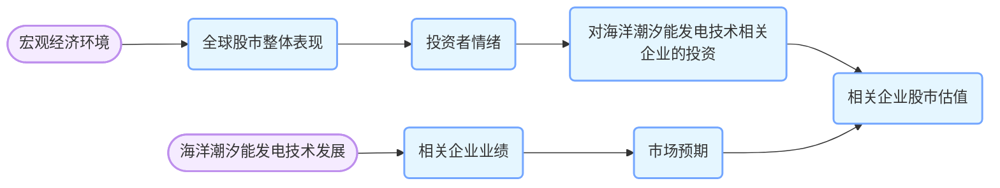

# 全球股市估值与海洋潮汐能发电技术的关系

> 关键词：全球股市估值、海洋潮汐能发电技术、金融市场、能源产业、经济发展、相关性分析、投资趋势

> 摘要：本文旨在深入探讨全球股市估值与海洋潮汐能发电技术之间的关系。通过对全球股市估值的原理、海洋潮汐能发电技术的发展现状和原理进行剖析，运用数学模型和算法分析两者之间可能存在的内在联系。同时结合项目实战案例，阐述在实际经济环境中这种关系的体现。此外，介绍了相关的实际应用场景、推荐了学习和开发所需的工具与资源。最后对未来发展趋势与挑战进行总结，并对常见问题进行解答，为读者全面呈现这一跨领域话题的全貌。

## 1. 背景介绍 
### 1.1 目的和范围
本研究的目的在于揭示全球股市估值与海洋潮汐能发电技术之间潜在的关联，通过综合分析金融市场数据和能源技术发展情况，为投资者、政策制定者和科研人员提供有价值的参考信息。研究范围涵盖全球主要股票市场的估值情况，以及海洋潮汐能发电技术在不同国家和地区的发展现状、技术原理、应用前景等方面。

### 1.2 预期读者
本文预期读者包括金融领域的投资者、分析师、基金经理，能源行业的科研人员、工程师、企业管理者，以及关注经济发展和能源技术进步的政策制定者和学者。

### 1.3 文档结构概述
本文首先介绍背景信息，包括目的、预期读者和文档结构。接着阐述全球股市估值和海洋潮汐能发电技术的核心概念与联系，通过流程图直观展示。然后详细讲解相关的核心算法原理和具体操作步骤，给出Python源代码示例。之后介绍数学模型和公式，并举例说明。再通过项目实战案例，包括开发环境搭建、源代码实现和代码解读，深入分析两者关系在实际中的体现。随后介绍实际应用场景，推荐相关的学习和开发工具与资源。最后总结未来发展趋势与挑战，解答常见问题，并提供扩展阅读和参考资料。

### 1.4 术语表
#### 1.4.1 核心术语定义
- **全球股市估值**：指对全球范围内各个股票市场中上市公司的价值进行评估的过程和结果，通常通过各种估值指标来衡量，如市盈率（P/E）、市净率（P/B）等。
- **海洋潮汐能发电技术**：利用海洋潮汐的涨落所具有的势能和动能，通过一定的技术设备将其转化为电能的技术。

#### 1.4.2 相关概念解释
- **金融市场**：资金融通的市场，包括股票市场、债券市场、期货市场等，是企业融资和投资者进行投资的重要场所。
- **能源产业**：从事能源开发、生产、加工、转换、输送、储存和销售等活动的产业部门，海洋潮汐能发电属于新能源产业的一部分。

#### 1.4.3 缩略词列表
- **P/E**：市盈率（Price-to-Earnings Ratio）
- **P/B**：市净率（Price-to-Book Ratio）

## 2. 核心概念与联系 
### 2.1 全球股市估值原理
全球股市估值是基于对上市公司未来盈利能力、资产价值、市场前景等多方面因素的综合评估。常见的估值方法包括绝对估值法和相对估值法。绝对估值法如现金流折现法（DCF），通过预测公司未来的现金流，并将其折现到当前时点来确定公司的价值；相对估值法如市盈率法、市净率法等，通过与同行业或市场平均水平进行比较来评估公司的价值。

### 2.2 海洋潮汐能发电技术原理
海洋潮汐能发电技术主要基于潮汐的周期性涨落。在涨潮时，海水水位上升，大量海水被蓄积在水库或水坝中，形成势能；在落潮时，海水水位下降，蓄积的海水通过水轮机，带动发电机旋转，将势能转化为电能。常见的潮汐能发电形式包括单库单向发电、单库双向发电和双库连续发电等。

### 2.3 两者的联系
全球股市估值与海洋潮汐能发电技术之间存在着多方面的联系。一方面，海洋潮汐能发电技术的发展前景和商业潜力会影响相关企业的业绩和市场预期，进而影响其在股市中的估值。例如，如果某项潮汐能发电技术取得重大突破，提高了发电效率和降低了成本，那么相关企业的盈利能力可能会增强，其股票价格可能会上涨，股市估值也会相应提高。另一方面，全球股市的整体表现和投资者情绪也会影响对海洋潮汐能发电技术相关企业的投资和估值。在股市繁荣时期，投资者更愿意投资新兴的能源技术企业，推动相关企业的股市估值上升；而在股市低迷时期，投资者可能会更加谨慎，对潮汐能发电技术企业的投资也会减少，导致其股市估值下降。

### 2.4 文本示意图
全球股市估值受到多种因素的影响，包括宏观经济环境、行业发展趋势、公司基本面等。海洋潮汐能发电技术的发展也受到技术创新、政策支持、成本效益等因素的制约。两者之间通过相关企业的业绩和市场预期相互影响。具体关系如下：

宏观经济环境 -> 全球股市整体表现 -> 投资者情绪 -> 对海洋潮汐能发电技术相关企业的投资 -> 相关企业股市估值
海洋潮汐能发电技术发展 -> 相关企业业绩 -> 市场预期 -> 相关企业股市估值

### 2.5 Mermaid 流程图


## 3. 核心算法原理 & 具体操作步骤 
### 3.1 股市估值算法原理
以市盈率法为例，市盈率（P/E）是指股票价格与每股收益（EPS）的比值。计算公式为：

$P/E = \frac{股票价格}{每股收益}$

通过与同行业或市场平均市盈率进行比较，可以评估股票的估值水平。如果某只股票的市盈率高于同行业平均水平，可能表示该股票被高估；反之，则可能被低估。

### 3.2 相关性分析算法原理
为了分析全球股市估值与海洋潮汐能发电技术之间的关系，可以使用相关性分析方法，如皮尔逊相关系数。皮尔逊相关系数是衡量两个变量之间线性关系强度的统计指标，取值范围在 -1 到 1 之间。计算公式为：

$r = \frac{\sum_{i=1}^{n}(x_i - \bar{x})(y_i - \bar{y})}{\sqrt{\sum_{i=1}^{n}(x_i - \bar{x})^2\sum_{i=1}^{n}(y_i - \bar{y})^2}}$

其中，$x_i$ 和 $y_i$ 分别是两个变量的第 $i$ 个观测值，$\bar{x}$ 和 $\bar{y}$ 分别是两个变量的均值，$n$ 是观测值的数量。

### 3.3 Python 源代码实现
```python
import pandas as pd
import numpy as np
from scipy.stats import pearsonr

# 模拟全球股市估值数据
stock_valuations = np.random.rand(100)

# 模拟海洋潮汐能发电技术发展指标数据
tidal_energy_indicators = np.random.rand(100)

# 计算皮尔逊相关系数和 p 值
corr, p_value = pearsonr(stock_valuations, tidal_energy_indicators)

print(f"皮尔逊相关系数: {corr}")
print(f"p 值: {p_value}")
```

### 3.4 具体操作步骤
1. 数据收集：收集全球股市估值数据和海洋潮汐能发电技术发展相关数据，如股票价格、每股收益、潮汐能发电量、技术研发投入等。
2. 数据预处理：对收集到的数据进行清洗、整理和标准化处理，确保数据的质量和一致性。
3. 计算相关指标：根据需要计算股市估值指标（如市盈率、市净率等）和潮汐能发电技术发展指标（如发电效率、成本降低率等）。
4. 相关性分析：使用皮尔逊相关系数等方法计算全球股市估值与海洋潮汐能发电技术发展指标之间的相关性。
5. 结果分析：根据相关性分析结果，判断两者之间的关系强度和显著性，并进行进一步的分析和解释。

## 4. 数学模型和公式 & 详细讲解 & 举例说明 
### 4.1 股市估值数学模型
除了市盈率法，现金流折现法（DCF）是另一种常用的股市估值方法。DCF 模型的基本思想是将公司未来的现金流折现到当前时点，以确定公司的内在价值。其计算公式为：

$V = \sum_{t=1}^{n}\frac{CF_t}{(1 + r)^t}$

其中，$V$ 是公司的内在价值，$CF_t$ 是第 $t$ 期的现金流，$r$ 是折现率，$n$ 是预测期数。

### 4.2 相关性分析数学模型
如前所述，皮尔逊相关系数是衡量两个变量之间线性关系强度的常用指标。其数学模型的详细推导过程如下：

设两个变量 $X$ 和 $Y$ 的观测值分别为 $x_1, x_2, \cdots, x_n$ 和 $y_1, y_2, \cdots, y_n$，则它们的均值分别为：

$\bar{x} = \frac{1}{n}\sum_{i=1}^{n}x_i$

$\bar{y} = \frac{1}{n}\sum_{i=1}^{n}y_i$

协方差 $Cov(X, Y)$ 衡量了两个变量之间的协同变化程度，计算公式为：

$Cov(X, Y) = \frac{1}{n}\sum_{i=1}^{n}(x_i - \bar{x})(y_i - \bar{y})$

标准差 $\sigma_X$ 和 $\sigma_Y$ 分别衡量了变量 $X$ 和 $Y$ 的离散程度，计算公式为：

$\sigma_X = \sqrt{\frac{1}{n}\sum_{i=1}^{n}(x_i - \bar{x})^2}$

$\sigma_Y = \sqrt{\frac{1}{n}\sum_{i=1}^{n}(y_i - \bar{y})^2}$

皮尔逊相关系数 $r$ 可以表示为：

$r = \frac{Cov(X, Y)}{\sigma_X\sigma_Y}$

### 4.3 举例说明
假设我们收集了某地区 10 年的股市平均市盈率数据和海洋潮汐能发电技术研发投入数据，如下表所示：

| 年份 | 股市平均市盈率 | 潮汐能研发投入（万元） |
| ---- | -------------- | ---------------------- |
| 2010 | 15             | 100                    |
| 2011 | 16             | 120                    |
| 2012 | 14             | 110                    |
| 2013 | 17             | 130                    |
| 2014 | 15             | 105                    |
| 2015 | 16             | 125                    |
| 2016 | 14             | 115                    |
| 2017 | 18             | 140                    |
| 2018 | 15             | 108                    |
| 2019 | 16             | 128                    |

首先，计算股市平均市盈率和潮汐能研发投入的均值：

$\bar{x} = \frac{15 + 16 + 14 + 17 + 15 + 16 + 14 + 18 + 15 + 16}{10} = 15.6$

$\bar{y} = \frac{100 + 120 + 110 + 130 + 105 + 125 + 115 + 140 + 108 + 128}{10} = 118.1$

然后，计算协方差和标准差：

$Cov(X, Y) = \frac{1}{10}\sum_{i=1}^{10}(x_i - 15.6)(y_i - 118.1)$

$\sigma_X = \sqrt{\frac{1}{10}\sum_{i=1}^{10}(x_i - 15.6)^2}$

$\sigma_Y = \sqrt{\frac{1}{10}\sum_{i=1}^{10}(y_i - 118.1)^2}$

最后，计算皮尔逊相关系数：

$r = \frac{Cov(X, Y)}{\sigma_X\sigma_Y}$

通过计算得到的皮尔逊相关系数可以判断股市平均市盈率和潮汐能研发投入之间的线性关系强度。如果 $r$ 接近 1，表示两者之间存在较强的正线性关系；如果 $r$ 接近 -1，表示两者之间存在较强的负线性关系；如果 $r$ 接近 0，表示两者之间线性关系较弱。

## 5. 项目实战：代码实际案例和详细解释说明 
### 5.1  开发环境搭建
1. **安装 Python**：从 Python 官方网站（https://www.python.org/downloads/）下载并安装适合你操作系统的 Python 版本，建议使用 Python 3.7 及以上版本。
2. **安装必要的库**：使用 pip 命令安装所需的库，如 pandas、numpy、scipy 等。
```sh
pip install pandas numpy scipy
```
3. **选择开发工具**：可以选择 PyCharm、Jupyter Notebook 等开发工具进行代码编写和调试。

### 5.2  源代码详细实现和代码解读
```python
import pandas as pd
import numpy as np
from scipy.stats import pearsonr

# 读取数据
data = pd.read_csv('stock_and_tidal_energy.csv')

# 提取股市估值数据和潮汐能发电技术指标数据
stock_valuations = data['stock_valuation'].values
tidal_energy_indicators = data['tidal_energy_indicator'].values

# 计算皮尔逊相关系数和 p 值
corr, p_value = pearsonr(stock_valuations, tidal_energy_indicators)

# 输出结果
print(f"皮尔逊相关系数: {corr}")
print(f"p 值: {p_value}")

# 根据 p 值判断相关性的显著性
if p_value < 0.05:
    print("两者之间的相关性具有统计学意义。")
else:
    print("两者之间的相关性不具有统计学意义。")
```

### 5.3  代码解读与分析
1. **数据读取**：使用 `pandas` 库的 `read_csv` 函数读取存储在 CSV 文件中的股市估值数据和潮汐能发电技术指标数据。
2. **数据提取**：从读取的数据中提取股市估值数据和潮汐能发电技术指标数据，并将其转换为 `numpy` 数组。
3. **相关性分析**：使用 `scipy.stats` 库的 `pearsonr` 函数计算皮尔逊相关系数和 p 值。
4. **结果输出**：打印皮尔逊相关系数和 p 值，并根据 p 值判断相关性的显著性。如果 p 值小于 0.05，表示两者之间的相关性具有统计学意义；否则，表示相关性不具有统计学意义。

## 6. 实际应用场景 
### 6.1 投资决策
对于投资者来说，了解全球股市估值与海洋潮汐能发电技术之间的关系可以帮助他们做出更明智的投资决策。如果海洋潮汐能发电技术发展前景良好，相关企业的业绩有望提升，其股票估值可能会上升，投资者可以考虑增加对这些企业的投资。反之，如果潮汐能发电技术面临技术瓶颈或市场风险，相关企业的股票估值可能会下降，投资者应谨慎投资。

### 6.2 政策制定
政策制定者可以根据全球股市估值与海洋潮汐能发电技术之间的关系，制定相应的政策来促进海洋潮汐能发电技术的发展。例如，如果股市对潮汐能发电技术相关企业的估值较低，政府可以通过提供补贴、税收优惠等政策措施，鼓励企业加大研发投入，提高技术水平，从而提升企业的业绩和股市估值。

### 6.3 行业发展规划
海洋潮汐能发电技术企业可以根据股市估值情况，制定合理的发展规划。如果股市对企业的估值较高，说明市场对企业的发展前景看好，企业可以加大投资，扩大生产规模，加快技术创新；如果股市估值较低，企业需要反思自身的发展战略，寻找提升企业价值的途径。

## 7. 工具和资源推荐
### 7.1 学习资源推荐
#### 7.1.1 书籍推荐
- 《金融市场学》：介绍了金融市场的基本概念、运行机制和投资策略，对于理解全球股市估值有很大帮助。
- 《新能源技术与应用》：详细阐述了包括海洋潮汐能发电技术在内的各种新能源技术的原理、发展现状和应用前景。
- 《统计学基础》：提供了统计学的基本理论和方法，对于进行相关性分析等数据分析工作非常有用。

#### 7.1.2 在线课程
- Coursera 上的“金融市场分析”课程：由知名高校教授授课，系统讲解金融市场的分析方法和工具。
- edX 上的“新能源技术导论”课程：介绍了新能源技术的发展趋势和应用案例，帮助学习者了解海洋潮汐能发电技术。
- Udemy 上的“Python 数据分析实战”课程：通过实际案例学习 Python 在数据分析中的应用，提高数据分析能力。

#### 7.1.3 技术博客和网站
- 雪球网：提供了丰富的股市资讯和分析文章，有助于了解全球股市的动态和估值情况。
- 能源局官网：发布了关于能源产业的政策法规、发展规划和统计数据，是了解海洋潮汐能发电技术发展情况的重要渠道。
- 博客园、CSDN 等技术博客平台：有很多关于数据分析、金融建模和能源技术的技术文章和经验分享。

### 7.2 开发工具框架推荐
#### 7.2.1 IDE和编辑器
- PyCharm：功能强大的 Python 集成开发环境，提供了代码编辑、调试、版本控制等一系列功能，适合专业开发者使用。
- Jupyter Notebook：交互式的开发环境，支持代码、文本、图表等多种形式的展示，非常适合数据分析和实验。

#### 7.2.2 调试和性能分析工具
- pdb：Python 自带的调试工具，可以帮助开发者定位代码中的问题。
- cProfile：Python 的性能分析工具，可以分析代码的运行时间和资源消耗情况，帮助优化代码性能。

#### 7.2.3 相关框架和库
- pandas：强大的数据处理和分析库，提供了数据结构和数据操作工具，方便进行数据清洗、整理和分析。
- numpy：用于科学计算的基础库，提供了高效的数组操作和数学函数，是进行数值计算的重要工具。
- scipy：基于 numpy 的科学计算库，提供了丰富的统计分析、优化、信号处理等功能，适用于相关性分析等数据分析任务。

### 7.3 相关论文著作推荐
#### 7.3.1 经典论文
- “The Relationship between Stock Market Valuation and Energy Technology Innovation”：探讨了股市估值与能源技术创新之间的关系，为本文的研究提供了理论基础。
- “Tidal Energy Generation: A Review of Technology and Economics”：对海洋潮汐能发电技术的原理、发展现状和经济可行性进行了全面的综述。

#### 7.3.2 最新研究成果
- 关注《能源研究与利用》、《金融研究》等学术期刊，及时了解全球股市估值与海洋潮汐能发电技术领域的最新研究成果。

#### 7.3.3 应用案例分析
- 参考相关的行业报告和案例分析，了解海洋潮汐能发电技术企业在股市中的表现和发展经验，为实际应用提供参考。

## 8. 总结：未来发展趋势与挑战
### 8.1 未来发展趋势
- **技术创新加速**：随着科技的不断进步，海洋潮汐能发电技术将不断创新，发电效率将进一步提高，成本将不断降低，这将提升相关企业的业绩和股市估值。
- **政策支持加强**：为了应对气候变化和能源危机，各国政府将加大对海洋潮汐能发电技术的支持力度，出台更多的优惠政策和补贴措施，促进该技术的发展和应用，从而推动相关企业的股市估值上升。
- **市场需求增长**：随着全球对清洁能源的需求不断增加，海洋潮汐能作为一种可再生的清洁能源，市场需求将持续增长，相关企业的市场前景广阔，股市估值也将有望提高。

### 8.2 挑战
- **技术难题**：海洋潮汐能发电技术仍面临一些技术难题，如潮汐能转换效率低、设备维护成本高、对海洋生态环境的影响等，这些问题需要进一步研究和解决。
- **市场竞争**：随着海洋潮汐能发电技术的发展，市场竞争将日益激烈，相关企业需要不断提高自身的技术水平和竞争力，才能在市场中立足。
- **金融风险**：全球股市的波动性较大，金融市场的不确定性增加了海洋潮汐能发电技术相关企业的融资难度和成本，也影响了其股市估值的稳定性。

## 9. 附录：常见问题与解答
### 9.1 全球股市估值与海洋潮汐能发电技术之间的关系一定是正相关吗？
不一定。虽然一般情况下，海洋潮汐能发电技术的发展会带动相关企业的业绩提升，从而提高其股市估值，但这种关系并不是绝对的。全球股市的表现受到多种因素的影响，如宏观经济环境、政策变化、投资者情绪等，这些因素可能会导致股市估值与海洋潮汐能发电技术之间的关系出现波动。

### 9.2 如何准确评估海洋潮汐能发电技术对股市估值的影响？
要准确评估海洋潮汐能发电技术对股市估值的影响，需要综合考虑多个因素。首先，要深入了解海洋潮汐能发电技术的发展现状、技术瓶颈和未来发展趋势；其次，要分析相关企业的基本面，包括业绩、财务状况、市场竞争力等；最后，要结合全球股市的整体表现和投资者情绪，运用合适的估值方法和数据分析工具进行评估。

### 9.3 海洋潮汐能发电技术的发展面临哪些风险？
海洋潮汐能发电技术的发展面临多种风险，包括技术风险、市场风险、环境风险等。技术风险主要包括潮汐能转换效率低、设备可靠性差等问题；市场风险主要包括市场需求不足、竞争激烈、价格波动等；环境风险主要包括对海洋生态环境的影响等。

## 10. 扩展阅读 & 参考资料
### 10.1 扩展阅读
- 《可再生能源发展战略研究》：对可再生能源的发展战略进行了深入研究，为海洋潮汐能发电技术的发展提供了战略指导。
- 《金融风险管理》：介绍了金融风险管理的理论和方法，有助于理解全球股市估值的波动性和风险。

### 10.2 参考资料
- 相关行业协会发布的统计数据和研究报告。
- 政府部门发布的政策文件和发展规划。
- 学术期刊和会议论文中的相关研究成果。