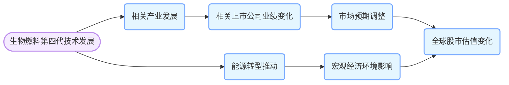

# 全球股市估值与生物燃料第四代技术的关系

> 关键词：全球股市估值、生物燃料第四代技术、市场趋势、能源转型、投资策略、技术创新、经济影响

> 摘要：本文深入探讨了全球股市估值与生物燃料第四代技术之间的关系。随着全球对可持续能源的需求不断增长，生物燃料第四代技术作为新兴的能源解决方案备受关注。股市作为经济的重要晴雨表，其估值变化与该技术的发展相互影响。文章首先介绍了相关背景，包括目的、预期读者、文档结构和术语表。接着阐述了核心概念与联系，通过文本示意图和 Mermaid 流程图进行清晰展示。详细讲解了核心算法原理及操作步骤，并结合数学模型和公式进行深入分析。通过项目实战案例，对代码实现和解读进行了详细说明。探讨了实际应用场景，推荐了相关的工具和资源。最后总结了未来发展趋势与挑战，提供了常见问题解答和扩展阅读参考资料，旨在为投资者、研究者和相关从业者提供全面的参考和深入的思考。

## 1. 背景介绍 
### 1.1 目的和范围
本研究的目的在于全面深入地剖析全球股市估值与生物燃料第四代技术之间的内在联系和相互影响机制。随着全球经济的发展和能源需求结构的变化，生物燃料第四代技术作为具有潜力的新兴能源技术，其发展状况必然会对相关产业和金融市场产生影响。本研究将涵盖全球范围内的股市数据以及生物燃料第四代技术的研发、应用和市场推广等各个方面，通过综合分析，揭示两者之间的动态关系，为投资者、政策制定者和相关企业提供决策依据。

### 1.2 预期读者
本文的预期读者包括金融市场的投资者，他们希望通过了解生物燃料第四代技术对股市的影响，优化投资组合，获取更高的投资回报；能源行业的从业者，包括生物燃料企业的管理人员、研发人员等，他们可以从股市的反应中了解市场对该技术的预期，调整企业的发展战略；政策制定者，他们可以根据两者的关系制定合理的能源政策和金融政策，促进能源转型和经济的可持续发展；以及对能源和金融领域感兴趣的研究人员和学者，为他们的研究提供参考和启发。

### 1.3 文档结构概述
本文将按照以下结构展开：首先介绍相关背景信息，包括目的、读者、文档结构和术语表，为后续的分析奠定基础。接着阐述核心概念与联系，通过文本示意图和 Mermaid 流程图直观展示两者的关系。然后详细讲解核心算法原理及具体操作步骤，并结合数学模型和公式进行理论分析。通过项目实战案例，展示代码实现和解读，加深对两者关系的理解。探讨实际应用场景，为读者提供实际应用的思路。推荐相关的工具和资源，帮助读者进一步学习和研究。最后总结未来发展趋势与挑战，解答常见问题，并提供扩展阅读和参考资料。

### 1.4 术语表
#### 1.4.1 核心术语定义
- **全球股市估值**：指对全球范围内各个股票市场中上市公司的价值进行评估的过程和结果。通常通过股票价格、市盈率、市净率等指标来衡量，反映了市场对上市公司未来盈利能力和发展前景的预期。
- **生物燃料第四代技术**：是指利用先进的生物技术和工程方法，将非粮食生物质资源转化为高效、清洁、可持续的生物燃料的技术。与前三代生物燃料技术相比，第四代技术具有更高的能源转化效率、更低的环境影响和更广泛的原料来源。

#### 1.4.2 相关概念解释
- **能源转型**：指从传统的化石能源向可再生能源和清洁能源的转变过程。生物燃料第四代技术作为可再生能源的一种，是能源转型的重要组成部分。
- **可持续发展**：强调经济、社会和环境的协调发展，既要满足当代人的需求，又不损害后代人满足其需求的能力。生物燃料第四代技术的发展符合可持续发展的理念。

#### 1.4.3 缩略词列表
- **ETF**：交易型开放式指数基金（Exchange Traded Fund）
- **IRR**：内部收益率（Internal Rate of Return）
- **NPV**：净现值（Net Present Value）

## 2. 核心概念与联系 

### 核心概念原理
全球股市估值是由多种因素共同作用的结果，包括宏观经济环境、公司基本面、行业发展趋势、市场情绪等。生物燃料第四代技术作为新兴的能源技术，其发展状况会对相关产业的公司基本面产生影响，进而影响股市估值。从宏观层面来看，生物燃料第四代技术的发展有助于推动能源转型，减少对传统化石能源的依赖，降低能源供应的风险，从而对宏观经济环境产生积极影响，间接影响股市估值。从行业层面来看，生物燃料第四代技术的进步会带动相关产业链的发展，如生物质原料种植、生物燃料生产设备制造、生物燃料销售等，这些行业的发展会影响相关上市公司的业绩和市场预期，从而直接影响股市估值。

### 架构的文本示意图
全球股市估值与生物燃料第四代技术的关系可以用以下文本示意图表示：

生物燃料第四代技术的发展 -> 相关产业发展 -> 相关上市公司业绩变化 -> 市场预期调整 -> 全球股市估值变化

宏观经济环境影响 <- 能源转型推动 <- 生物燃料第四代技术发展

### Mermaid 流程图


## 3. 核心算法原理 & 具体操作步骤 

### 核心算法原理
为了分析全球股市估值与生物燃料第四代技术的关系，我们可以采用回归分析的方法。回归分析是一种统计方法，用于研究一个或多个自变量与因变量之间的关系。在本研究中，我们将全球股市估值作为因变量，将生物燃料第四代技术的相关指标作为自变量，通过建立回归模型来分析两者之间的关系。

### Python 源代码实现
```python
import pandas as pd
import numpy as np
from sklearn.linear_model import LinearRegression
import matplotlib.pyplot as plt

# 假设我们已经获取了全球股市估值数据和生物燃料第四代技术相关指标数据
# 这里使用模拟数据进行演示
np.random.seed(0)
# 生成生物燃料第四代技术相关指标数据
biofuel_tech_data = np.random.rand(100, 1) * 100
# 生成全球股市估值数据，假设存在线性关系并加入一定噪声
stock_valuation_data = 2 * biofuel_tech_data + 50 + np.random.randn(100, 1) * 10

# 创建 DataFrame
data = pd.DataFrame({
    'Biofuel_Tech_Indicator': biofuel_tech_data.flatten(),
    'Stock_Valuation': stock_valuation_data.flatten()
})

# 划分自变量和因变量
X = data[['Biofuel_Tech_Indicator']]
y = data['Stock_Valuation']

# 创建线性回归模型
model = LinearRegression()

# 拟合模型
model.fit(X, y)

# 打印模型参数
print('斜率 (系数):', model.coef_[0])
print('截距:', model.intercept_)

# 预测
new_tech_indicator = np.array([[50]])
predicted_valuation = model.predict(new_tech_indicator)
print('预测的股市估值:', predicted_valuation[0])

# 绘制散点图和回归直线
plt.scatter(X, y, color='blue', label='实际数据')
plt.plot(X, model.predict(X), color='red', linewidth=2, label='回归直线')
plt.xlabel('生物燃料第四代技术指标')
plt.ylabel('全球股市估值')
plt.title('全球股市估值与生物燃料第四代技术的关系')
plt.legend()
plt.show()
```

### 具体操作步骤
1. **数据收集**：收集全球股市估值数据和生物燃料第四代技术的相关指标数据。全球股市估值数据可以从金融数据提供商如 Bloomberg、Wind 等获取，生物燃料第四代技术的相关指标数据可以从科研机构、行业报告等渠道获取。
2. **数据预处理**：对收集到的数据进行清洗、整理和标准化处理，确保数据的质量和一致性。
3. **模型选择**：根据数据的特点和研究目的，选择合适的回归模型，如线性回归、多项式回归等。
4. **模型训练**：将处理后的数据划分为训练集和测试集，使用训练集对模型进行训练，调整模型的参数。
5. **模型评估**：使用测试集对训练好的模型进行评估，计算模型的评估指标，如均方误差、决定系数等，评估模型的性能。
6. **结果分析**：根据模型的参数和评估结果，分析全球股市估值与生物燃料第四代技术的关系，解释模型的含义。

## 4. 数学模型和公式 & 详细讲解 & 举例说明 

### 数学模型
在回归分析中，线性回归模型的一般形式为：

$$y = \beta_0 + \beta_1x_1 + \beta_2x_2 + \cdots + \beta_nx_n + \epsilon$$

其中，$y$ 是因变量（全球股市估值），$x_1, x_2, \cdots, x_n$ 是自变量（生物燃料第四代技术的相关指标），$\beta_0$ 是截距，$\beta_1, \beta_2, \cdots, \beta_n$ 是回归系数，$\epsilon$ 是误差项。

在简单线性回归中，只有一个自变量，模型可以简化为：

$$y = \beta_0 + \beta_1x + \epsilon$$

### 公式讲解
- **回归系数 $\beta_1$**：表示自变量 $x$ 每变化一个单位，因变量 $y$ 平均变化的单位数。在本研究中，$\beta_1$ 表示生物燃料第四代技术指标每变化一个单位，全球股市估值平均变化的单位数。
- **截距 $\beta_0$**：表示当自变量 $x$ 为 0 时，因变量 $y$ 的取值。在实际应用中，截距的含义需要根据具体情况进行解释。
- **误差项 $\epsilon$**：表示模型无法解释的随机误差，反映了实际值与预测值之间的差异。

### 举例说明
假设我们通过回归分析得到的线性回归模型为：

$$Stock\_Valuation = 50 + 2 \times Biofuel\_Tech\_Indicator + \epsilon$$

这意味着当生物燃料第四代技术指标为 0 时，全球股市估值的预测值为 50。生物燃料第四代技术指标每增加 1 个单位，全球股市估值平均增加 2 个单位。例如，如果生物燃料第四代技术指标从 20 增加到 30，那么全球股市估值的预测增加量为 $2 \times (30 - 20) = 20$ 个单位。

## 5. 项目实战：代码实际案例和详细解释说明 

### 5.1  开发环境搭建
- **Python 安装**：从 Python 官方网站（https://www.python.org/downloads/）下载并安装 Python 3.x 版本。
- **依赖库安装**：使用 pip 命令安装所需的依赖库，包括 pandas、numpy、scikit-learn、matplotlib 等。

```bash
pip install pandas numpy scikit-learn matplotlib
```

### 5.2  源代码详细实现和代码解读
```python
import pandas as pd
import numpy as np
from sklearn.linear_model import LinearRegression
import matplotlib.pyplot as plt

# 假设我们已经获取了全球股市估值数据和生物燃料第四代技术相关指标数据
# 这里使用模拟数据进行演示
np.random.seed(0)
# 生成生物燃料第四代技术相关指标数据
biofuel_tech_data = np.random.rand(100, 1) * 100
# 生成全球股市估值数据，假设存在线性关系并加入一定噪声
stock_valuation_data = 2 * biofuel_tech_data + 50 + np.random.randn(100, 1) * 10

# 创建 DataFrame
data = pd.DataFrame({
    'Biofuel_Tech_Indicator': biofuel_tech_data.flatten(),
    'Stock_Valuation': stock_valuation_data.flatten()
})

# 划分自变量和因变量
X = data[['Biofuel_Tech_Indicator']]
y = data['Stock_Valuation']

# 创建线性回归模型
model = LinearRegression()

# 拟合模型
model.fit(X, y)

# 打印模型参数
print('斜率 (系数):', model.coef_[0])
print('截距:', model.intercept_)

# 预测
new_tech_indicator = np.array([[50]])
predicted_valuation = model.predict(new_tech_indicator)
print('预测的股市估值:', predicted_valuation[0])

# 绘制散点图和回归直线
plt.scatter(X, y, color='blue', label='实际数据')
plt.plot(X, model.predict(X), color='red', linewidth=2, label='回归直线')
plt.xlabel('生物燃料第四代技术指标')
plt.ylabel('全球股市估值')
plt.title('全球股市估值与生物燃料第四代技术的关系')
plt.legend()
plt.show()
```

### 代码解读与分析
1. **数据生成**：使用 `np.random.rand` 函数生成生物燃料第四代技术相关指标数据，使用 `np.random.randn` 函数生成噪声，并根据假设的线性关系生成全球股市估值数据。
2. **数据处理**：将生成的数据转换为 `pandas` 的 `DataFrame` 格式，方便后续处理。
3. **模型创建**：使用 `sklearn.linear_model.LinearRegression` 创建线性回归模型。
4. **模型训练**：使用 `model.fit(X, y)` 方法对模型进行训练，其中 `X` 是自变量，`y` 是因变量。
5. **模型参数输出**：使用 `model.coef_` 和 `model.intercept_` 输出模型的斜率和截距。
6. **预测**：使用 `model.predict` 方法对新的生物燃料第四代技术指标进行预测，输出预测的全球股市估值。
7. **可视化**：使用 `matplotlib` 库绘制散点图和回归直线，直观展示全球股市估值与生物燃料第四代技术的关系。

## 6. 实际应用场景 
### 投资决策
投资者可以根据生物燃料第四代技术的发展趋势和相关指标，预测全球股市中相关行业和公司的估值变化，从而调整投资组合。例如，如果生物燃料第四代技术取得重大突破，相关生物燃料企业的业绩有望提升，投资者可以增加对这些企业股票的投资。

### 政策制定
政策制定者可以通过分析全球股市估值与生物燃料第四代技术的关系，了解市场对该技术的预期和反应，制定合理的能源政策和金融政策。例如，如果股市对生物燃料第四代技术的发展持乐观态度，政策制定者可以加大对该技术的研发和推广支持力度。

### 企业战略规划
生物燃料企业可以根据股市的反应，了解市场对自身技术和发展前景的评价，调整企业的战略规划。例如，如果股市估值上升，企业可以加大研发投入，扩大生产规模；如果股市估值下降，企业需要重新评估技术路线和市场策略。

### 风险管理
金融机构和投资者可以通过分析两者的关系，识别潜在的风险因素，采取相应的风险管理措施。例如，如果生物燃料第四代技术的发展遇到瓶颈，可能会导致相关企业的业绩下滑，从而影响股市估值，投资者可以提前调整投资组合，降低风险。

## 7. 工具和资源推荐
### 7.1 学习资源推荐
#### 7.1.1 书籍推荐
- 《金融市场与金融机构基础》：介绍了金融市场的基本概念、运行机制和金融机构的业务，为理解全球股市估值提供了基础。
- 《生物燃料技术原理与应用》：详细讲解了生物燃料的各种技术原理和应用案例，有助于深入了解生物燃料第四代技术。
- 《计量经济学》：提供了回归分析等统计方法的理论和实践指导，为分析两者关系提供了方法支持。

#### 7.1.2 在线课程
- Coursera 上的“金融市场”课程：由知名教授授课，系统介绍了金融市场的知识和分析方法。
- edX 上的“生物能源技术”课程：讲解了生物能源的最新技术和发展趋势。
- Udemy 上的“Python 数据分析实战”课程：通过实际案例学习 Python 在数据分析中的应用，有助于实现相关算法。

#### 7.1.3 技术博客和网站
- Seeking Alpha：提供金融市场的分析和评论，包括对能源行业的深入报道。
- Biofuels Digest：专注于生物燃料行业的新闻和分析，提供生物燃料第四代技术的最新动态。
- Towards Data Science：分享数据分析和机器学习的技术文章和案例，有助于学习相关算法和技术。

### 7.2 开发工具框架推荐
#### 7.2.1 IDE和编辑器
- PyCharm：功能强大的 Python 集成开发环境，提供代码编辑、调试、版本控制等功能。
- Jupyter Notebook：交互式的开发环境，适合数据分析和模型实验，方便展示代码和结果。

#### 7.2.2 调试和性能分析工具
- PDB：Python 内置的调试器，用于调试 Python 代码。
- cProfile：Python 的性能分析工具，用于分析代码的运行时间和性能瓶颈。

#### 7.2.3 相关框架和库
- Pandas：用于数据处理和分析的 Python 库，提供高效的数据结构和数据操作方法。
- NumPy：Python 的数值计算库，提供高效的数组操作和数学函数。
- Scikit-learn：用于机器学习的 Python 库，提供各种机器学习算法和工具。
- Matplotlib：用于数据可视化的 Python 库，提供丰富的绘图功能。

### 7.3 相关论文著作推荐
#### 7.3.1 经典论文
- “The Impact of Renewable Energy Technologies on Financial Markets”：研究了可再生能源技术对金融市场的影响，为分析生物燃料第四代技术与股市估值的关系提供了理论基础。
- “Advances in Fourth Generation Biofuel Technologies”：详细介绍了生物燃料第四代技术的研究进展和发展趋势。

#### 7.3.2 最新研究成果
- 关注能源和金融领域的顶级学术期刊，如《Energy Economics》、《Journal of Financial Economics》等，获取最新的研究成果。

#### 7.3.3 应用案例分析
- 国际能源署（IEA）发布的相关报告，提供了生物燃料技术在不同国家和地区的应用案例和分析。
- 金融机构的研究报告，分析了能源行业的投资机会和风险，包括生物燃料第四代技术对股市的影响。

## 8. 总结：未来发展趋势与挑战
### 未来发展趋势
- **技术创新加速**：随着生物技术、基因工程等领域的不断发展，生物燃料第四代技术将不断取得突破，提高能源转化效率，降低生产成本。
- **市场需求增长**：全球对可持续能源的需求不断增加，生物燃料作为可再生能源的重要组成部分，市场需求将持续增长，推动相关企业的发展和股市估值的上升。
- **政策支持加强**：各国政府为了实现能源转型和可持续发展目标，将加大对生物燃料第四代技术的政策支持力度，包括补贴、税收优惠等，促进该技术的研发和推广。
- **产业整合加剧**：生物燃料行业将面临整合，大型企业将通过并购、重组等方式扩大规模，提高市场竞争力，行业集中度将逐渐提高。

### 挑战
- **技术难题**：生物燃料第四代技术仍面临一些技术难题，如生物质原料的高效转化、生物燃料的稳定性等，需要进一步的研究和创新。
- **成本较高**：目前生物燃料第四代技术的生产成本相对较高，与传统化石能源相比缺乏竞争力，需要通过技术进步和规模效应降低成本。
- **市场不确定性**：全球股市受到多种因素的影响，生物燃料第四代技术的发展也存在不确定性，市场对该技术的预期可能会发生变化，导致股市估值的波动。
- **政策风险**：政策的变化可能会对生物燃料第四代技术的发展产生影响，如补贴政策的调整、环保标准的变化等，增加了企业的经营风险。

## 9. 附录：常见问题与解答
### 1. 生物燃料第四代技术与前三代技术有什么区别？
生物燃料第四代技术与前三代技术的主要区别在于原料来源和能源转化效率。前三代生物燃料技术主要以粮食作物、植物油等为原料，存在与人争粮、与粮争地等问题。而第四代技术利用非粮食生物质资源，如藻类、木质纤维素等，原料来源广泛，且对环境的影响较小。同时，第四代技术采用先进的生物技术和工程方法，能源转化效率更高。

### 2. 如何衡量生物燃料第四代技术的发展水平？
可以从多个方面衡量生物燃料第四代技术的发展水平，包括技术指标（如能源转化效率、生物燃料产量等）、研发投入、专利数量、产业化程度等。此外，市场对该技术的接受程度和相关企业的业绩也可以作为参考。

### 3. 全球股市估值与生物燃料第四代技术的关系是线性的吗？
不一定。虽然在本研究中我们使用了线性回归模型进行分析，但实际情况可能更为复杂。全球股市估值与生物燃料第四代技术的关系可能受到多种因素的影响，呈现出非线性的关系。在实际分析中，可以尝试使用非线性模型进行拟合，以提高模型的准确性。

### 4. 生物燃料第四代技术的发展对传统能源行业有什么影响？
生物燃料第四代技术的发展将对传统能源行业产生一定的冲击。随着生物燃料的市场份额逐渐增加，对传统化石能源的需求将减少，可能导致传统能源企业的业绩下滑。同时，传统能源企业也可能会加大对可再生能源的投资和研发，实现转型发展。

## 10. 扩展阅读 & 参考资料
### 扩展阅读
- 《可再生能源革命》：探讨了可再生能源在全球能源转型中的作用和发展前景。
- 《金融科技与创新》：介绍了金融科技在金融市场中的应用和创新，为研究金融市场与新兴技术的关系提供了新的视角。

### 参考资料
- Bloomberg 金融数据库
- Wind 金融终端
- 国际能源署（IEA）官方网站
- 世界银行官方网站
- 相关学术期刊和研究报告