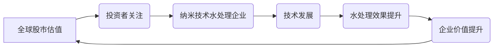

# 全球股市估值与纳米技术在水处理中的应用

> 关键词：全球股市估值、纳米技术、水处理、金融市场、环境科学、投资分析、技术应用

> 摘要：本文将两个看似不相关的领域——全球股市估值与纳米技术在水处理中的应用结合起来进行探讨。一方面详细剖析全球股市估值的方法、影响因素以及其在金融市场中的重要性；另一方面深入研究纳米技术在水处理中的原理、优势和实际应用案例。旨在让读者了解这两个领域各自的核心要点，同时探索它们之间可能存在的潜在联系，为跨领域的研究和投资决策提供一定的参考。

## 1. 背景介绍 
### 1.1 目的和范围
本研究的目的在于全面且深入地阐述全球股市估值和纳米技术在水处理中的应用这两个不同领域的知识体系。对于全球股市估值，我们将研究不同的估值方法、影响估值的因素以及其在投资决策中的应用。而对于纳米技术在水处理中的应用，我们会探讨其原理、技术优势、实际应用案例以及发展前景。范围涵盖了从理论基础到实际应用的多个层面，旨在为相关领域的研究者、投资者和从业者提供全面的参考资料。

### 1.2 预期读者
本文预期读者包括金融领域的投资者、分析师、基金经理，环境科学领域的科研人员、工程师，以及对金融市场和新兴技术应用感兴趣的普通读者。对于金融从业者，有助于他们了解新兴技术领域的投资机会；对于环境科学工作者，能提供金融视角的思考；对于普通读者，可以拓宽知识面，了解两个重要领域的发展动态。

### 1.3 文档结构概述
本文首先介绍全球股市估值和纳米技术在水处理中应用的背景信息，包括目的、读者和术语表。接着阐述两个领域的核心概念与联系，分析核心算法原理和具体操作步骤。然后介绍相关的数学模型和公式，并通过举例说明。之后通过项目实战展示代码案例和详细解释。再探讨实际应用场景，推荐相关的工具和资源。最后总结未来发展趋势与挑战，提供常见问题解答和扩展阅读参考资料。

### 1.4 术语表
#### 1.4.1 核心术语定义
- **全球股市估值**：是指对全球范围内各个股票市场上的股票价值进行评估的过程和方法，通过综合考虑多种因素来确定股票的合理价格。
- **纳米技术**：是指在纳米尺度（1 - 100 纳米）上研究物质的特性和相互作用，以及利用这些特性和相互作用来制造具有特定功能产品的技术。
- **水处理**：是指通过物理、化学和生物等方法，去除水中的杂质、污染物和有害物质，使水达到一定的水质标准，满足不同使用需求的过程。

#### 1.4.2 相关概念解释
- **市盈率（P/E）**：是指股票价格除以每股收益的比率，反映了市场对公司盈利预期的高低，是股市估值中常用的指标之一。
- **纳米材料**：是指具有纳米尺度结构的材料，其具有独特的物理、化学和生物学性质，在水处理中可用于吸附、催化等过程。
- **膜分离技术**：是一种利用半透膜的选择透过性，对混合物中的不同组分进行分离、提纯和浓缩的技术，纳米技术可用于制备高性能的分离膜。

#### 1.4.3 缩略词列表
- **P/E**：市盈率（Price - Earnings Ratio）
- **ROE**：净资产收益率（Return on Equity）
- **NPs**：纳米粒子（Nanoparticles）

## 2. 核心概念与联系 

### 全球股市估值核心概念
全球股市估值是金融市场中至关重要的环节，它是投资者判断股票是否具有投资价值的关键依据。常见的估值方法包括相对估值法和绝对估值法。相对估值法通过比较同行业或类似公司的估值指标，如市盈率、市净率等，来确定目标股票的价值。绝对估值法则是通过预测公司未来的现金流，并将其折现到当前，以计算股票的内在价值。

其原理基于市场的供求关系和对公司未来盈利能力的预期。如果市场对某公司的未来发展前景看好，其股票价格往往会高于其账面价值，反之则会低于账面价值。

### 纳米技术在水处理中应用的核心概念
纳米技术在水处理中的应用主要基于纳米材料的特殊性质。纳米材料具有高比表面积、量子尺寸效应和表面效应等特性，这些特性使其在吸附、催化、杀菌等方面表现出优异的性能。

例如，纳米吸附材料可以通过物理或化学吸附作用，高效地去除水中的重金属离子、有机污染物等。纳米催化材料可以在光、热等条件下，加速水中污染物的分解和转化。

### 核心概念联系
虽然全球股市估值和纳米技术在水处理中的应用属于不同领域，但它们之间存在一定的联系。随着环保意识的增强和对水资源质量要求的提高，纳米技术在水处理领域的应用前景广阔，相关企业的发展潜力巨大。这会吸引投资者的关注，从而影响这些企业的股票估值。例如，如果一家纳米水处理技术公司取得了重大的技术突破，其股票价格可能会上涨，市盈率等估值指标也会相应提高。

### 文本示意图
全球股市估值和纳米技术在水处理中的应用联系可以用以下文本示意图表示：

全球股市估值 <---- 投资者关注 ----> 纳米技术水处理企业 <---- 技术发展 ----> 水处理效果提升

### Mermaid 流程图


## 3. 核心算法原理 & 具体操作步骤 

### 全球股市估值核心算法原理及 Python 实现
#### 市盈率估值法原理
市盈率估值法是一种相对估值法，其基本原理是通过比较目标公司与同行业其他公司的市盈率，来确定目标公司的合理股价。计算公式为：

合理股价 = 每股收益 × 行业平均市盈率

#### Python 代码实现
```python
# 定义计算合理股价的函数
def pe_valuation(eps, industry_pe):
    """
    eps: 每股收益
    industry_pe: 行业平均市盈率
    """
    fair_price = eps * industry_pe
    return fair_price

# 示例数据
eps = 2.5  # 每股收益
industry_pe = 15  # 行业平均市盈率

# 计算合理股价
fair_price = pe_valuation(eps, industry_pe)
print(f"合理股价为: {fair_price}")
```
#### 具体操作步骤
1. 收集目标公司的财务报表，计算每股收益（EPS）。
2. 收集同行业其他公司的市盈率数据，计算行业平均市盈率。
3. 将每股收益和行业平均市盈率代入上述公式，计算目标公司的合理股价。
4. 将计算得到的合理股价与当前市场股价进行比较，判断股票是否被低估或高估。

### 纳米技术在水处理中应用的核心算法原理及 Python 实现
#### 纳米吸附材料吸附量计算原理
纳米吸附材料对水中污染物的吸附量可以通过吸附等温线模型来描述。常见的吸附等温线模型有 Langmuir 模型和 Freundlich 模型。

Langmuir 模型的表达式为：

$$\frac{C_e}{q_e}=\frac{C_e}{q_m}+\frac{1}{q_mK_L}$$

其中，$C_e$ 是吸附平衡时溶液中污染物的浓度，$q_e$ 是吸附平衡时单位质量吸附剂的吸附量，$q_m$ 是最大吸附量，$K_L$ 是 Langmuir 常数。

#### Python 代码实现
```python
import numpy as np
import matplotlib.pyplot as plt

# 示例数据
Ce = np.array([1, 2, 3, 4, 5])  # 吸附平衡时溶液中污染物的浓度
qe = np.array([0.5, 0.8, 1.2, 1.5, 1.8])  # 吸附平衡时单位质量吸附剂的吸附量

# 线性拟合 Langmuir 模型
x = Ce
y = Ce / qe
coefficients = np.polyfit(x, y, 1)
slope = coefficients[0]
intercept = coefficients[1]

# 计算 qm 和 KL
qm = 1 / slope
KL = slope / intercept

print(f"最大吸附量 qm: {qm}")
print(f"Langmuir 常数 KL: {KL}")

# 绘制线性拟合图
plt.plot(x, y, 'o', label='Data')
plt.plot(x, np.polyval(coefficients, x), 'r-', label='Fit')
plt.xlabel('Ce')
plt.ylabel('Ce/qe')
plt.title('Langmuir Isotherm')
plt.legend()
plt.show()
```
#### 具体操作步骤
1. 进行吸附实验，测定不同初始浓度下吸附平衡时溶液中污染物的浓度 $C_e$ 和单位质量吸附剂的吸附量 $q_e$。
2. 根据 Langmuir 模型的线性表达式，将 $C_e$ 作为自变量，$C_e/q_e$ 作为因变量进行线性拟合。
3. 从线性拟合的结果中计算出最大吸附量 $q_m$ 和 Langmuir 常数 $K_L$。
4. 根据计算得到的参数，评估纳米吸附材料的吸附性能。

## 4. 数学模型和公式 & 详细讲解 & 举例说明 

### 全球股市估值数学模型和公式
#### 股息折现模型（DDM）
股息折现模型是一种绝对估值法，其基本原理是将股票的内在价值定义为未来所有股息的现值之和。公式为：

$$V=\sum_{t = 1}^{\infty}\frac{D_t}{(1 + r)^t}$$

其中，$V$ 是股票的内在价值，$D_t$ 是第 $t$ 期的股息，$r$ 是折现率。

#### 详细讲解
该模型假设股票的价值来源于其未来的股息分配。折现率 $r$ 反映了投资者对投资该股票所要求的回报率，通常可以用无风险利率加上风险溢价来确定。

#### 举例说明
假设某公司每年的股息固定为 $D = 2$ 元，投资者要求的回报率 $r = 10\%$。根据股息折现模型，该股票的内在价值为：

$$V=\frac{D}{r}=\frac{2}{0.1}=20$$（元）

### 纳米技术在水处理中应用的数学模型和公式
#### 扩散方程
在纳米技术水处理过程中，污染物在纳米材料表面的扩散过程可以用扩散方程来描述。一维扩散方程的表达式为：

$$\frac{\partial C}{\partial t}=D\frac{\partial^2 C}{\partial x^2}$$

其中，$C$ 是污染物的浓度，$t$ 是时间，$x$ 是空间坐标，$D$ 是扩散系数。

#### 详细讲解
该方程描述了污染物浓度随时间和空间的变化关系。扩散系数 $D$ 反映了污染物在介质中的扩散能力，其大小与污染物的性质、介质的性质和温度等因素有关。

#### 举例说明
假设在一个纳米膜分离过程中，污染物在膜内的扩散系数 $D = 1\times10^{-9} m^2/s$。已知初始时刻污染物在膜内的浓度分布为 $C(x,0)=C_0\sin(\frac{\pi x}{L})$，其中 $C_0 = 100 mg/L$，$L = 0.1 m$。求解在 $t = 100 s$ 时污染物在膜内的浓度分布。

可以使用有限差分法对扩散方程进行数值求解。以下是 Python 代码示例：
```python
import numpy as np
import matplotlib.pyplot as plt

# 参数设置
L = 0.1  # 膜的长度
D = 1e-9  # 扩散系数
C0 = 100  # 初始浓度峰值
N = 100  # 空间网格点数
dx = L / (N - 1)  # 空间步长
T = 100  # 总时间
dt = 0.1  # 时间步长
M = int(T / dt)  # 时间网格点数

# 初始化浓度数组
C = np.zeros((M, N))
x = np.linspace(0, L, N)

# 初始条件
C[0, :] = C0 * np.sin(np.pi * x / L)

# 有限差分法求解
for m in range(1, M):
    for n in range(1, N - 1):
        C[m, n] = C[m - 1, n] + D * dt / dx**2 * (C[m - 1, n + 1] - 2 * C[m - 1, n] + C[m - 1, n - 1])

# 绘制结果
plt.plot(x, C[0, :], label='t = 0 s')
plt.plot(x, C[-1, :], label='t = 100 s')
plt.xlabel('x (m)')
plt.ylabel('C (mg/L)')
plt.title('Diffusion of Pollutants in Nanomembrane')
plt.legend()
plt.show()
```

## 5. 项目实战：代码实际案例和详细解释说明 

### 5.1  开发环境搭建
#### 全球股市估值项目开发环境
- **操作系统**：Windows、Linux 或 macOS 均可。
- **Python 版本**：建议使用 Python 3.7 及以上版本。
- **安装依赖库**：使用 `pip` 安装 `pandas`、`numpy`、`matplotlib` 等库，用于数据处理、数值计算和可视化。

```sh
pip install pandas numpy matplotlib
```

#### 纳米技术在水处理中应用项目开发环境
- **操作系统**：同样可以选择 Windows、Linux 或 macOS。
- **Python 版本**：Python 3.7 及以上。
- **安装依赖库**：除了 `pandas`、`numpy`、`matplotlib` 外，还可能需要安装 `scipy` 用于科学计算。

```sh
pip install pandas numpy matplotlib scipy
```

### 5.2  源代码详细实现和代码解读
#### 全球股市估值项目代码实现
```python
import pandas as pd
import numpy as np
import matplotlib.pyplot as plt

# 模拟股票数据
data = {
    'Stock': ['A', 'B', 'C', 'D', 'E'],
    'EPS': [1.5, 2.0, 1.8, 2.2, 1.6],
    'Industry_PE': [12, 13, 12, 14, 13]
}

df = pd.DataFrame(data)

# 计算合理股价
df['Fair_Price'] = df['EPS'] * df['Industry_PE']

# 绘制柱状图
plt.bar(df['Stock'], df['Fair_Price'])
plt.xlabel('Stock')
plt.ylabel('Fair Price')
plt.title('Stock Fair Price Calculation')
plt.show()
```
#### 代码解读
1. **数据模拟**：使用 `pandas` 库创建一个包含股票名称、每股收益（EPS）和行业平均市盈率（Industry_PE）的 DataFrame。
2. **计算合理股价**：通过将每股收益和行业平均市盈率相乘，计算出每只股票的合理股价，并将结果添加到 DataFrame 中。
3. **可视化**：使用 `matplotlib` 库绘制柱状图，展示每只股票的合理股价。

#### 纳米技术在水处理中应用项目代码实现
```python
import numpy as np
import matplotlib.pyplot as plt
from scipy.integrate import odeint

# 定义吸附动力学方程
def adsorption_kinetics(q, t, k, C0, qm):
    dqdt = k * (C0 - q / qm * C0) * (qm - q)
    return dqdt

# 参数设置
k = 0.1  # 吸附速率常数
C0 = 100  # 初始污染物浓度
qm = 50  # 最大吸附量
t = np.linspace(0, 100, 100)  # 时间范围

# 初始条件
q0 = 0

# 求解微分方程
q = odeint(adsorption_kinetics, q0, t, args=(k, C0, qm))

# 绘制吸附曲线
plt.plot(t, q)
plt.xlabel('Time (s)')
plt.ylabel('Adsorption Capacity (mg/g)')
plt.title('Adsorption Kinetics')
plt.show()
```
#### 代码解读
1. **定义吸附动力学方程**：使用 `scipy.integrate.odeint` 函数求解吸附动力学的微分方程。该方程描述了吸附量随时间的变化关系。
2. **参数设置**：设置吸附速率常数 $k$、初始污染物浓度 $C_0$、最大吸附量 $q_m$ 和时间范围 $t$。
3. **初始条件**：设置初始吸附量 $q_0 = 0$。
4. **求解微分方程**：使用 `odeint` 函数求解微分方程，得到不同时间点的吸附量 $q$。
5. **可视化**：使用 `matplotlib` 库绘制吸附曲线，展示吸附量随时间的变化。

### 5.3  代码解读与分析
#### 全球股市估值项目
通过上述代码，我们可以快速计算出多只股票的合理股价，并进行可视化展示。这种方法简单直观，适用于初步的股票估值分析。但需要注意的是，市盈率估值法存在一定的局限性，它没有考虑公司的未来增长潜力、财务风险等因素。

#### 纳米技术在水处理中应用项目
该代码模拟了纳米吸附材料的吸附动力学过程。通过求解微分方程，我们可以得到吸附量随时间的变化曲线。这有助于我们了解吸附过程的速率和机理，为优化纳米吸附材料的性能提供理论依据。但实际的吸附过程可能受到多种因素的影响，如温度、pH 值等，需要进一步考虑这些因素的影响。

## 6. 实际应用场景 

### 全球股市估值的实际应用场景
#### 投资决策
投资者可以通过对全球股市的估值分析，选择被低估的股票进行投资，以获取更高的收益。例如，当某只股票的市盈率低于行业平均水平，且公司的基本面良好时，投资者可能认为该股票具有投资价值。
#### 风险管理
股市估值可以帮助投资者评估投资组合的风险。如果投资组合中的股票整体估值过高，可能面临较大的下跌风险，投资者可以及时调整投资组合，降低风险。
#### 宏观经济分析
全球股市估值的变化可以反映宏观经济的运行状况。当股市整体估值上升时，可能预示着经济的复苏和增长；反之，当股市估值下降时，可能暗示着经济的衰退。

### 纳米技术在水处理中应用的实际应用场景
#### 饮用水处理
纳米技术可以用于去除饮用水中的重金属离子、微生物和有机污染物等，提高饮用水的质量。例如，纳米过滤膜可以有效截留水中的细菌和病毒，纳米吸附材料可以去除水中的铅、汞等重金属离子。
#### 工业废水处理
工业废水中含有大量的有害物质，如重金属、有机物和放射性物质等。纳米技术可以通过吸附、催化等作用，高效地去除这些污染物，实现工业废水的达标排放和回用。
#### 海水淡化
纳米技术在海水淡化领域也具有广阔的应用前景。纳米膜分离技术可以提高海水淡化的效率和降低成本，纳米光催化技术可以分解海水中的有机物，减少膜污染。

## 7. 工具和资源推荐
### 7.1 学习资源推荐
#### 7.1.1 书籍推荐
- **《金融市场与金融机构》**：这本书全面介绍了金融市场的基本知识和运行机制，包括股票市场、债券市场等，对于理解全球股市估值的背景和原理非常有帮助。
- **《纳米技术与纳米材料》**：详细阐述了纳米技术的基本概念、制备方法和应用领域，是学习纳米技术在水处理中应用的经典教材。
- **《水处理工程》**：系统介绍了水处理的基本原理、工艺和技术，结合纳米技术的相关内容，可以更深入地了解纳米技术在水处理中的应用。

#### 7.1.2 在线课程
- **Coursera 上的“金融市场”课程**：由知名教授授课，涵盖了金融市场的各个方面，包括股票估值、投资组合管理等内容。
- **edX 上的“纳米科学与技术”课程**：提供了纳米技术的前沿知识和研究动态，对于学习纳米技术在水处理中的应用有很大的帮助。
- **中国大学 MOOC 上的“水处理生物学”课程**：从生物学的角度介绍了水处理的原理和方法，与纳米技术在水处理中的应用有一定的关联。

#### 7.1.3 技术博客和网站
- **雪球网**：是一个专注于股票投资的社区，提供了丰富的股票分析和估值报告，投资者可以在这里获取全球股市的最新信息和投资建议。
- **纳米技术资讯网**：汇集了纳米技术领域的最新研究成果和应用案例，对于了解纳米技术在水处理中的应用动态非常有帮助。
- **水世界**：是一个专业的水处理行业网站，提供了水处理技术、工程案例和行业资讯等内容，有助于深入了解水处理领域的发展趋势。

### 7.2 开发工具框架推荐
#### 7.2.1 IDE和编辑器
- **PyCharm**：是一款功能强大的 Python 集成开发环境，提供了代码编辑、调试、版本控制等功能，非常适合 Python 项目的开发。
- **Jupyter Notebook**：是一个交互式的开发环境，支持代码、文本、图像等多种格式的展示，方便进行数据分析和可视化。

#### 7.2.2 调试和性能分析工具
- **pdb**：是 Python 自带的调试工具，可以帮助开发者逐行调试代码，查找问题所在。
- **cProfile**：是 Python 的性能分析工具，可以分析代码的运行时间和函数调用情况，帮助开发者优化代码性能。

#### 7.2.3 相关框架和库
- **pandas**：是一个强大的数据处理库，提供了 DataFrame 等数据结构，方便进行数据的读取、清洗和分析。
- **numpy**：是 Python 的数值计算库，提供了高效的数组操作和数学函数，对于科学计算非常有用。
- **scikit - learn**：是一个机器学习库，提供了多种机器学习算法和工具，可用于股票估值预测和纳米技术水处理过程的建模。

### 7.3 相关论文著作推荐
#### 7.3.1 经典论文
- **Fama, E. F., & French, K. R. (1992). The cross - section of expected stock returns. The Journal of Finance, 47(2), 427 - 465.**：该论文提出了著名的 Fama - French 三因子模型，对股票估值和投资组合理论产生了深远的影响。
- **Elimelech, M., & Phillip, W. A. (2011). The future of seawater desalination: energy, technology, and the environment. Science, 333(6043), 712 - 717.**：探讨了海水淡化技术的发展趋势和面临的挑战，其中涉及到纳米技术在海水淡化中的应用前景。

#### 7.3.2 最新研究成果
- 可以通过 Google Scholar、Web of Science 等学术搜索引擎，搜索关于全球股市估值和纳米技术在水处理中应用的最新研究论文。这些论文通常反映了该领域的前沿研究动态和最新技术进展。

#### 7.3.3 应用案例分析
- 可以参考相关的行业报告和案例分析，了解全球股市估值和纳米技术在水处理中应用的实际案例。例如，一些投资机构发布的股票研究报告，以及水处理企业的技术应用案例等。

## 8. 总结：未来发展趋势与挑战
### 全球股市估值的未来发展趋势与挑战
#### 发展趋势
- **智能化估值**：随着人工智能和机器学习技术的发展，股市估值将越来越智能化。通过大数据分析和深度学习算法，可以更准确地预测公司的未来盈利能力和股票价格走势。
- **全球化估值**：全球金融市场的一体化趋势日益明显，股市估值将更加注重全球范围内的比较和分析。投资者需要考虑不同国家和地区的经济、政治和文化因素对股票估值的影响。
- **多因素估值**：传统的估值方法往往只考虑少数几个因素，未来的股市估值将综合考虑更多的因素，如公司的创新能力、社会责任、环境影响等，以更全面地评估公司的价值。

#### 挑战
- **市场不确定性**：全球股市受到多种因素的影响，如宏观经济政策、地缘政治冲突、自然灾害等，这些因素增加了市场的不确定性，给股市估值带来了挑战。
- **数据质量和可靠性**：股市估值需要大量的财务数据和市场数据，数据的质量和可靠性直接影响估值的准确性。然而，数据的获取和处理过程中可能存在误差和偏差，需要加强数据管理和质量控制。
- **模型的局限性**：现有的股市估值模型都存在一定的局限性，无法完全准确地反映市场的实际情况。需要不断改进和创新估值模型，提高估值的准确性和可靠性。

### 纳米技术在水处理中应用的未来发展趋势与挑战
#### 发展趋势
- **高性能纳米材料的研发**：未来将不断研发出具有更高吸附容量、更快吸附速率和更好稳定性的纳米材料，以提高水处理的效率和效果。
- **纳米技术与其他技术的集成**：纳米技术将与生物技术、膜技术、电化学技术等其他技术相结合，形成更高效、更环保的水处理工艺。
- **大规模应用**：随着纳米技术的不断发展和成本的降低，纳米技术在水处理中的应用将逐渐从实验室研究走向大规模工业化应用。

#### 挑战
- **纳米材料的安全性**：纳米材料的特殊性质可能对环境和人体健康产生潜在的影响，需要加强对纳米材料安全性的研究和评估，制定相应的安全标准和规范。
- **成本问题**：目前纳米技术在水处理中的应用成本较高，限制了其大规模推广。需要通过技术创新和工艺优化，降低纳米材料的制备成本和水处理过程的运行成本。
- **技术标准和规范的缺失**：纳米技术在水处理中的应用还缺乏统一的技术标准和规范，这给技术的推广和应用带来了一定的困难。需要加快制定相关的技术标准和规范，促进纳米技术在水处理中的健康发展。

## 9. 附录：常见问题与解答
### 全球股市估值相关问题
#### 问：市盈率估值法有哪些局限性？
答：市盈率估值法的局限性主要包括：没有考虑公司的未来增长潜力，对于高成长型公司可能会低估其价值；行业平均市盈率的计算可能存在偏差，不同的计算方法和样本选择会导致结果不同；市盈率容易受到市场情绪和短期波动的影响，不能准确反映公司的内在价值。

#### 问：如何选择合适的折现率进行股息折现模型的计算？
答：折现率的选择需要综合考虑多种因素。一般来说，可以用无风险利率加上风险溢价来确定。无风险利率可以参考国债收益率，风险溢价则需要根据公司的行业特点、财务状况、经营风险等因素进行评估。不同的投资者对风险的偏好不同，折现率的选择也会有所差异。

### 纳米技术在水处理中应用相关问题
#### 问：纳米材料在水处理中的应用会对环境造成污染吗？
答：纳米材料的特殊性质可能使其在使用过程中存在一定的环境风险。例如，纳米粒子可能会进入水体和土壤中，对生态系统造成潜在的影响。但是，目前的研究表明，通过合理的设计和控制纳米材料的制备和使用过程，可以降低其对环境的污染风险。同时，也需要加强对纳米材料环境安全性的研究和监测。

#### 问：纳米技术在水处理中的应用成本高吗？
答：目前纳米技术在水处理中的应用成本相对较高，主要原因包括纳米材料的制备成本较高、纳米技术的设备和工艺要求较为复杂等。但是，随着技术的不断发展和规模化生产的实现，纳米技术的应用成本有望逐渐降低。此外，纳米技术在提高水处理效率和水质方面具有显著的优势，从长远来看，其综合成本可能并不高。

## 10. 扩展阅读 & 参考资料
### 扩展阅读
- **《聪明的投资者》**：本杰明·格雷厄姆的经典著作，深入探讨了股票投资的理念和方法，对于理解全球股市估值和投资决策有很大的帮助。
- **《纳米技术：从基础到应用》**：全面介绍了纳米技术的基础知识、制备方法和应用领域，适合对纳米技术感兴趣的读者深入学习。
- **《水与可持续发展》**：探讨了水资源的可持续利用和水处理技术的发展趋势，对于了解纳米技术在水处理中的应用背景和意义有一定的启发。

### 参考资料
- 相关的金融财经网站，如新浪财经、东方财富网等，提供了全球股市的实时行情和相关的研究报告。
- 纳米技术领域的学术期刊，如《Nano Letters》、《ACS Nano》等，发表了纳米技术在水处理中应用的最新研究成果。
- 水处理行业的标准和规范文件，如《生活饮用水卫生标准》、《污水综合排放标准》等，为纳米技术在水处理中的应用提供了技术依据。