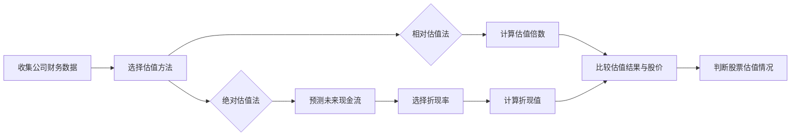
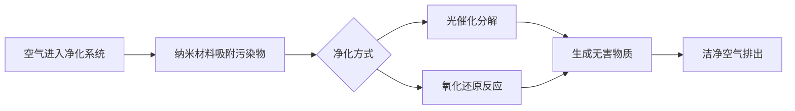

# 全球股市估值与纳米材料在空气净化中的应用

> 关键词：全球股市估值、纳米材料、空气净化、估值模型、应用原理

> 摘要：本文旨在探讨两个看似不相关领域——全球股市估值与纳米材料在空气净化中的应用。在全球股市估值方面，深入研究不同的估值方法及其原理，以更好地理解股市的内在价值和投资潜力。对于纳米材料在空气净化中的应用，详细阐述纳米材料的特性以及如何利用这些特性实现高效的空气净化。通过对这两个领域的研究，不仅能为投资者和环保工作者提供有价值的参考，也有助于揭示跨领域研究的潜在意义和价值。

## 1. 背景介绍 
### 1.1 目的和范围
本研究的目的有两个方面。一方面，在全球股市估值领域，希望通过对各种估值方法的梳理和分析，帮助投资者更准确地评估股票的价值，降低投资风险，提高投资收益。另一方面，在纳米材料在空气净化中的应用方面，旨在深入了解纳米材料的特性和作用机制，为开发更高效、更环保的空气净化技术提供理论支持和实践指导。研究范围涵盖全球主要股票市场的估值情况以及纳米材料在空气净化领域的各种应用场景。

### 1.2 预期读者
本文预期读者包括金融投资者、金融分析师、环保科研人员、空气净化技术开发者以及对这两个领域感兴趣的广大科技爱好者。对于投资者和分析师，股市估值部分的内容将为他们的投资决策提供参考；对于科研人员和技术开发者，纳米材料在空气净化中的应用部分将激发他们的研究思路和创新灵感；对于科技爱好者，本文将帮助他们拓宽知识面，了解前沿科技动态。

### 1.3 文档结构概述
本文首先介绍研究的背景信息，包括目的、预期读者和文档结构概述等内容。接着阐述全球股市估值和纳米材料在空气净化中的应用的核心概念与联系，通过文本示意图和 Mermaid 流程图进行直观展示。然后详细讲解核心算法原理和具体操作步骤，包括股市估值的算法和纳米材料应用的相关算法，并使用 Python 源代码进行阐述。之后介绍相关的数学模型和公式，结合具体例子进行详细讲解。再通过项目实战部分，展示代码实际案例并进行详细解释说明。随后探讨实际应用场景，分析这两个领域在现实生活中的具体应用。接着推荐相关的工具和资源，包括学习资源、开发工具框架和相关论文著作。最后总结未来发展趋势与挑战，列出常见问题与解答，并提供扩展阅读和参考资料。

### 1.4 术语表
#### 1.4.1 核心术语定义
- **全球股市估值**：指对全球范围内各个股票市场中上市公司的股票价值进行评估的过程和方法，以确定股票的合理价格和投资价值。
- **纳米材料**：是指在三维空间中至少有一维处于纳米尺度范围（1 - 100 纳米）或由它们作为基本单元构成的材料，具有独特的物理、化学和生物学特性。
- **空气净化**：通过各种技术和方法去除空气中的有害物质，如颗粒物、有害气体、微生物等，以改善空气质量，保护人们的健康和环境。

#### 1.4.2 相关概念解释
- **市盈率（P/E）**：是指股票价格除以每股收益（EPS）的比率，反映了投资者为获取公司每一元盈利所愿意支付的价格，是股市估值中常用的指标之一。
- **比表面积**：单位质量的纳米材料所具有的总面积，纳米材料由于其尺寸小，比表面积大，这使得它们具有更高的反应活性和吸附能力。
- **光催化**：是指在光的作用下，催化剂能够加速化学反应的过程，纳米材料常被用作光催化剂，用于分解空气中的有害污染物。

#### 1.4.3 缩略词列表
- **P/E**：市盈率（Price - Earnings Ratio）
- **EPS**：每股收益（Earnings Per Share）
- **VOCs**：挥发性有机化合物（Volatile Organic Compounds）

## 2. 核心概念与联系 

### 全球股市估值核心概念
全球股市估值是金融领域的重要研究内容，其核心目标是确定股票的内在价值。常见的估值方法包括相对估值法和绝对估值法。相对估值法是通过与同行业或类似公司的相关指标进行比较来评估股票价值，例如市盈率法、市净率法等。绝对估值法是基于公司未来的现金流折现来计算股票的价值，如股利贴现模型（DDM）、自由现金流贴现模型（FCFF）等。

#### 全球股市估值原理和架构的文本示意图
全球股市估值的过程可以看作是一个多因素综合分析的过程。首先，需要收集公司的财务数据，包括收入、利润、资产等。然后，根据不同的估值方法选择合适的指标进行计算。对于相对估值法，需要找到可比公司，并计算相应的估值倍数；对于绝对估值法，需要预测公司未来的现金流，并选择合适的折现率进行折现。最后，将计算结果与当前股票价格进行比较，判断股票是否被高估或低估。

#### 全球股市估值 Mermaid 流程图


### 纳米材料在空气净化中的应用核心概念
纳米材料由于其独特的物理和化学性质，在空气净化领域具有广阔的应用前景。纳米材料的小尺寸效应、表面效应和量子尺寸效应使其具有高比表面积、高反应活性和特殊的光学、电学性质。这些特性使得纳米材料能够有效地吸附、分解和催化空气中的有害物质。

#### 纳米材料在空气净化中应用原理和架构的文本示意图
纳米材料在空气净化中的应用过程主要包括吸附和净化两个阶段。在吸附阶段，纳米材料利用其高比表面积和表面活性，吸附空气中的颗粒物、有害气体等污染物。在净化阶段，纳米材料通过光催化、氧化还原等反应将吸附的污染物分解为无害物质，从而实现空气净化的目的。

#### 纳米材料在空气净化中应用 Mermaid 流程图


### 两者的联系
虽然全球股市估值和纳米材料在空气净化中的应用看似是两个不同的领域，但实际上它们之间存在一定的联系。一方面，纳米材料在空气净化领域的发展和应用会影响相关企业的业绩和前景，进而影响其股票价格和估值。例如，一家专注于纳米材料空气净化技术研发和生产的企业，如果其技术取得重大突破，产品市场需求增加，那么该企业的盈利能力将提升，其股票估值也可能相应提高。另一方面，股市的估值情况也会影响纳米材料空气净化产业的发展。如果股市对该产业的预期乐观，企业能够更容易地获得融资，从而加大研发和生产投入，推动产业的发展。

## 3. 核心算法原理 & 具体操作步骤 

### 全球股市估值核心算法原理及 Python 实现
#### 市盈率法
市盈率法是一种简单而常用的相对估值方法，其基本原理是通过比较目标公司与同行业可比公司的市盈率来评估目标公司的股票价值。计算公式为：

目标公司股票价值 = 目标公司每股收益 × 可比公司平均市盈率

以下是使用 Python 实现市盈率法的代码示例：
```python
# 定义目标公司每股收益和可比公司市盈率列表
target_eps = 2.5
comparable_pe_list = [15, 18, 20, 16]

# 计算可比公司平均市盈率
average_pe = sum(comparable_pe_list) / len(comparable_pe_list)

# 计算目标公司股票价值
target_stock_value = target_eps * average_pe

print(f"目标公司股票价值: {target_stock_value}")
```

#### 股利贴现模型（DDM）
股利贴现模型是一种绝对估值方法，其基本原理是将公司未来的股利现金流折现到当前时刻，以计算股票的内在价值。假设公司的股利以固定增长率 $g$ 增长，折现率为 $r$，则股票的内在价值 $V$ 可以通过以下公式计算：

$V = \frac{D_1}{r - g}$

其中，$D_1$ 是下一期的股利。

以下是使用 Python 实现股利贴现模型的代码示例：
```python
# 定义下一期股利、折现率和股利增长率
d1 = 1.2
r = 0.1
g = 0.05

# 计算股票内在价值
stock_value = d1 / (r - g)

print(f"股票内在价值: {stock_value}")
```

### 纳米材料在空气净化中应用的核心算法原理及 Python 实现
#### 吸附动力学模型
吸附动力学模型用于描述纳米材料对污染物的吸附过程。常见的吸附动力学模型包括准一级动力学模型和准二级动力学模型。准二级动力学模型的表达式为：

$\frac{t}{q_t} = \frac{1}{k_2 q_e^2} + \frac{t}{q_e}$

其中，$q_t$ 是 $t$ 时刻的吸附量，$q_e$ 是平衡吸附量，$k_2$ 是准二级吸附速率常数。

以下是使用 Python 实现准二级动力学模型拟合吸附数据的代码示例：
```python
import numpy as np
from scipy.optimize import curve_fit
import matplotlib.pyplot as plt

# 定义准二级动力学模型函数
def pseudo_second_order(t, qe, k2):
    return (t / ((1 / (k2 * qe ** 2)) + (t / qe)))

# 生成模拟吸附数据
t = np.linspace(0, 100, 50)
qe_true = 10
k2_true = 0.01
q_t_true = pseudo_second_order(t, qe_true, k2_true)
q_t_noisy = q_t_true + np.random.normal(0, 0.5, len(t))

# 拟合数据
popt, pcov = curve_fit(pseudo_second_order, t, q_t_noisy)

# 提取拟合参数
qe_fit, k2_fit = popt

# 绘制拟合结果
plt.scatter(t, q_t_noisy, label='Experimental data')
plt.plot(t, pseudo_second_order(t, qe_fit, k2_fit), 'r-', label='Fitted curve')
plt.xlabel('Time (min)')
plt.ylabel('Adsorption capacity (mg/g)')
plt.legend()
plt.show()

print(f"拟合的平衡吸附量: {qe_fit}")
print(f"拟合的准二级吸附速率常数: {k2_fit}")
```

## 4. 数学模型和公式 & 详细讲解 & 举例说明 

### 全球股市估值数学模型和公式
#### 市盈率法
市盈率法的数学公式为：

$P = EPS \times PE$

其中，$P$ 是股票价格，$EPS$ 是每股收益，$PE$ 是市盈率。

例如，某公司的每股收益为 3 元，同行业可比公司的平均市盈率为 20 倍，则该公司的股票价值为：

$P = 3 \times 20 = 60$（元）

#### 股利贴现模型（DDM）
股利贴现模型的基本公式为：

$V = \frac{D_1}{r - g}$

其中，$V$ 是股票的内在价值，$D_1$ 是下一期的股利，$r$ 是折现率，$g$ 是股利增长率。

假设某公司下一期的股利为 1.5 元，折现率为 0.1，股利增长率为 0.03，则该公司股票的内在价值为：

$V = \frac{1.5}{0.1 - 0.03} = \frac{1.5}{0.07} \approx 21.43$（元）

### 纳米材料在空气净化中应用的数学模型和公式
#### 吸附等温线模型
吸附等温线模型用于描述在一定温度下，纳米材料对污染物的吸附量与平衡浓度之间的关系。常见的吸附等温线模型包括 Langmuir 等温线模型和 Freundlich 等温线模型。

Langmuir 等温线模型的表达式为：

$\frac{C_e}{q_e} = \frac{1}{q_m K_L} + \frac{C_e}{q_m}$

其中，$C_e$ 是平衡浓度，$q_e$ 是平衡吸附量，$q_m$ 是最大吸附量，$K_L$ 是 Langmuir 常数。

Freundlich 等温线模型的表达式为：

$\ln q_e = \ln K_F + \frac{1}{n} \ln C_e$

其中，$K_F$ 和 $n$ 是 Freundlich 常数。

例如，通过实验得到一组纳米材料对某污染物的吸附数据，将数据分别拟合 Langmuir 等温线模型和 Freundlich 等温线模型，可以得到相应的模型参数。通过比较两个模型的拟合效果，可以选择更适合描述该吸附过程的模型。

#### 光催化反应动力学模型
光催化反应动力学模型用于描述光催化反应的速率与反应物浓度、光照强度等因素之间的关系。常见的光催化反应动力学模型是 Langmuir - Hinshelwood 动力学模型，其表达式为：

$r = \frac{k K C}{1 + K C}$

其中，$r$ 是反应速率，$k$ 是反应速率常数，$K$ 是吸附平衡常数，$C$ 是反应物浓度。

假设在某光催化反应中，反应速率常数 $k = 0.1$，吸附平衡常数 $K = 0.05$，反应物浓度 $C = 10$，则反应速率为：

$r = \frac{0.1 \times 0.05 \times 10}{1 + 0.05 \times 10} = \frac{0.05}{1 + 0.5} = \frac{0.05}{1.5} \approx 0.033$

## 5. 项目实战：代码实际案例和详细解释说明 

### 5.1  开发环境搭建
#### 全球股市估值项目
- **操作系统**：Windows、Linux 或 macOS 均可。
- **编程语言**：Python 3.x。
- **开发工具**：推荐使用 PyCharm 或 Jupyter Notebook。
- **所需库**：pandas、numpy、matplotlib 等。可以使用以下命令进行安装：
```sh
pip install pandas numpy matplotlib
```

#### 纳米材料在空气净化中应用项目
- **操作系统**：同样支持 Windows、Linux 或 macOS。
- **编程语言**：Python 3.x。
- **开发工具**：PyCharm 或 Jupyter Notebook。
- **所需库**：scipy、numpy、matplotlib 等。安装命令如下：
```sh
pip install scipy numpy matplotlib
```

### 5.2  源代码详细实现和代码解读
#### 全球股市估值项目
以下是一个简单的全球股市估值项目示例，通过获取某公司的财务数据，使用市盈率法和股利贴现模型进行估值。

```python
import pandas as pd
import numpy as np

# 模拟获取某公司的财务数据
data = {
    'EPS': [2.8],
    'Next_Dividend': [1.3],
    'Dividend_Growth_Rate': [0.04],
    'Discount_Rate': [0.1]
}
df = pd.DataFrame(data)

# 可比公司平均市盈率
comparable_pe = 18

# 市盈率法估值
pe_value = df['EPS'].values[0] * comparable_pe

# 股利贴现模型估值
ddm_value = df['Next_Dividend'].values[0] / (df['Discount_Rate'].values[0] - df['Dividend_Growth_Rate'].values[0])

print(f"市盈率法估值结果: {pe_value}")
print(f"股利贴现模型估值结果: {ddm_value}")
```

**代码解读**：
1. 首先，使用 `pandas` 库创建一个包含公司财务数据的 DataFrame，包括每股收益（EPS）、下一期股利（Next_Dividend）、股利增长率（Dividend_Growth_Rate）和折现率（Discount_Rate）。
2. 定义可比公司的平均市盈率。
3. 使用市盈率法计算股票价值，即每股收益乘以可比公司平均市盈率。
4. 使用股利贴现模型计算股票价值，根据公式 $\frac{D_1}{r - g}$ 进行计算。
5. 最后打印出两种估值方法的结果。

#### 纳米材料在空气净化中应用项目
以下是一个纳米材料吸附实验数据拟合准二级动力学模型的项目示例。

```python
import numpy as np
from scipy.optimize import curve_fit
import matplotlib.pyplot as plt

# 实验数据
t = np.array([10, 20, 30, 40, 50, 60, 70, 80, 90, 100])
q_t = np.array([2.5, 4.2, 5.6, 6.8, 7.5, 8.2, 8.8, 9.2, 9.5, 9.8])

# 定义准二级动力学模型函数
def pseudo_second_order(t, qe, k2):
    return (t / ((1 / (k2 * qe ** 2)) + (t / qe)))

# 拟合数据
popt, pcov = curve_fit(pseudo_second_order, t, q_t)

# 提取拟合参数
qe_fit, k2_fit = popt

# 绘制拟合结果
plt.scatter(t, q_t, label='Experimental data')
plt.plot(t, pseudo_second_order(t, qe_fit, k2_fit), 'r-', label='Fitted curve')
plt.xlabel('Time (min)')
plt.ylabel('Adsorption capacity (mg/g)')
plt.legend()
plt.show()

print(f"拟合的平衡吸附量: {qe_fit}")
print(f"拟合的准二级吸附速率常数: {k2_fit}")
```

**代码解读**：
1. 定义实验数据，包括时间 $t$ 和对应的吸附量 $q_t$。
2. 定义准二级动力学模型函数 `pseudo_second_order`。
3. 使用 `scipy.optimize.curve_fit` 函数对实验数据进行拟合，得到拟合参数 `popt` 和协方差矩阵 `pcov`。
4. 提取拟合的平衡吸附量 `qe_fit` 和准二级吸附速率常数 `k2_fit`。
5. 使用 `matplotlib` 库绘制实验数据和拟合曲线。
6. 最后打印出拟合的参数值。

### 5.3  代码解读与分析
#### 全球股市估值项目
- **优点**：代码简单易懂，能够快速计算出股票的估值结果。通过不同的估值方法，可以从多个角度评估股票的价值，提高估值的准确性。
- **局限性**：市盈率法依赖于可比公司的选择，不同的可比公司可能会导致不同的估值结果。股利贴现模型需要准确预测股利增长率和折现率，而这些参数的估计存在一定的主观性和不确定性。

#### 纳米材料在空气净化中应用项目
- **优点**：通过拟合实验数据，可以得到纳米材料吸附过程的动力学参数，有助于深入了解吸附机制。使用 Python 进行数据处理和拟合，代码简洁高效，并且可以方便地进行可视化展示。
- **局限性**：准二级动力学模型是一种简化的模型，实际的吸附过程可能更加复杂。实验数据可能存在误差，会影响拟合结果的准确性。

## 6. 实际应用场景 
### 全球股市估值的实际应用场景
#### 投资决策
投资者可以使用股市估值方法来评估股票的价值，判断股票是否被高估或低估。如果股票的估值低于当前市场价格，则可能被认为是被高估的，投资者可以考虑卖出；如果股票的估值高于当前市场价格，则可能被认为是被低估的，投资者可以考虑买入。

#### 公司并购
在公司并购过程中，估值是确定并购价格的重要依据。通过对目标公司的估值，可以评估其价值，为并购谈判提供参考，避免过高或过低的并购价格。

#### 金融监管
金融监管机构可以使用股市估值方法来监测市场的估值水平，判断市场是否存在泡沫或风险。如果市场整体估值过高，可能意味着市场存在泡沫，监管机构可以采取相应的措施来防范风险。

### 纳米材料在空气净化中应用的实际应用场景
#### 室内空气净化
在家庭、办公室、学校等室内环境中，纳米材料空气净化器可以有效去除空气中的颗粒物、有害气体和微生物，改善室内空气质量，保护人们的健康。例如，纳米二氧化钛光催化空气净化器可以利用光催化作用分解空气中的挥发性有机化合物（VOCs）和细菌。

#### 工业废气处理
在工业生产过程中，会产生大量的废气，其中含有各种有害物质。纳米材料可以用于工业废气处理，如纳米吸附剂可以吸附废气中的重金属、有机污染物等，纳米催化剂可以促进废气中污染物的分解和转化，实现废气的净化和达标排放。

#### 汽车尾气净化
汽车尾气是城市空气污染的主要来源之一。纳米材料可以应用于汽车尾气净化装置中，如纳米催化剂可以加速尾气中一氧化碳、碳氢化合物和氮氧化物的氧化和还原反应，降低尾气中污染物的排放浓度。

## 7. 工具和资源推荐
### 7.1 学习资源推荐
#### 7.1.1 书籍推荐
- **《证券分析》（Security Analysis）**：由本杰明·格雷厄姆（Benjamin Graham）和戴维·多德（David Dodd）所著，是股市估值领域的经典著作，介绍了多种估值方法和投资理念。
- **《纳米材料科学与技术》**：全面介绍了纳米材料的基本概念、制备方法、性能和应用，是学习纳米材料的重要参考书。
- **《空气净化技术》**：详细阐述了空气净化的原理、技术和设备，对于了解纳米材料在空气净化中的应用有很大的帮助。

#### 7.1.2 在线课程
- **Coursera 上的“金融市场”课程**：由耶鲁大学教授罗伯特·席勒（Robert Shiller）授课，介绍了金融市场的基本原理和估值方法。
- **edX 上的“纳米技术基础”课程**：系统地讲解了纳米技术的基础知识和前沿进展，包括纳米材料的制备和应用。
- **中国大学 MOOC 上的“空气净化工程”课程**：从工程应用的角度介绍了空气净化的技术和方法。

#### 7.1.3 技术博客和网站
- **雪球网**：是国内知名的财经社区，提供了丰富的股市分析和估值相关的文章和讨论。
- **纳米技术网**：专注于纳米技术领域的资讯和研究成果发布，是了解纳米材料最新动态的重要平台。
- **中国空气净化网**：提供空气净化行业的政策法规、技术标准和产品信息等内容。

### 7.2 开发工具框架推荐
#### 7.2.1 IDE和编辑器
- **PyCharm**：是一款专业的 Python 集成开发环境，具有代码编辑、调试、版本控制等功能，适合开发复杂的 Python 项目。
- **Jupyter Notebook**：是一个交互式的开发环境，支持多种编程语言，方便进行数据处理、分析和可视化展示。
- **Visual Studio Code**：是一款轻量级的代码编辑器，具有丰富的插件和扩展功能，支持多种编程语言的开发。

#### 7.2.2 调试和性能分析工具
- **pdb**：是 Python 内置的调试工具，可以帮助开发者定位和解决代码中的问题。
- **cProfile**：是 Python 的性能分析工具，可以分析代码的运行时间和函数调用情况，帮助开发者优化代码性能。
- **Numba**：是一个用于加速 Python 代码的编译器，可以将 Python 代码转换为高效的机器码，提高代码的执行速度。

#### 7.2.3 相关框架和库
- **pandas**：是一个强大的数据处理和分析库，提供了 DataFrame 等数据结构，方便进行数据的读取、处理和分析。
- **numpy**：是 Python 的数值计算库，提供了高效的数组操作和数学函数，是许多科学计算和数据分析库的基础。
- **scikit-learn**：是一个机器学习库，提供了多种机器学习算法和工具，可用于数据建模和预测。

### 7.3 相关论文著作推荐
#### 7.3.1 经典论文
- **“The Theory of Investment Value” by John Burr Williams**：提出了股利贴现模型的基本理论，是股市估值领域的经典论文。
- **“Size and Shape Effects in the Photocatalytic Activity of TiO₂ Nanoparticles for the Degradation of Phenol” by X. Chen and S. S. Mao**：研究了纳米二氧化钛颗粒的尺寸和形状对光催化降解苯酚性能的影响，是纳米材料光催化领域的经典论文。

#### 7.3.2 最新研究成果
- 可以通过学术数据库如 Web of Science、IEEE Xplore、ACS Publications 等搜索关于全球股市估值和纳米材料在空气净化中应用的最新研究论文，了解该领域的前沿动态和研究进展。

#### 7.3.3 应用案例分析
- 一些专业的金融研究报告和环保行业报告中会包含全球股市估值和纳米材料在空气净化中应用的实际案例分析，可以通过查阅这些报告了解实际应用中的经验和教训。

## 8. 总结：未来发展趋势与挑战
### 全球股市估值的未来发展趋势与挑战
#### 发展趋势
- **多元化估值方法**：随着金融市场的不断发展和创新，传统的估值方法可能无法满足复杂多变的市场需求。未来可能会出现更多多元化的估值方法，结合大数据、人工智能等技术，提高估值的准确性和效率。
- **跨市场估值**：全球金融市场的一体化程度不断提高，跨市场投资和并购活动日益频繁。未来股市估值将更加注重跨市场的比较和分析，考虑不同市场的特点和差异。
- **社会责任估值**：投资者越来越关注企业的社会责任和可持续发展能力。未来股市估值可能会将企业的社会责任因素纳入考虑范围，形成更加全面的估值体系。

#### 挑战
- **数据质量和可靠性**：股市估值依赖于大量的财务数据和市场信息，数据的质量和可靠性直接影响估值结果的准确性。然而，数据的获取和处理过程中可能存在误差和偏差，如何保证数据的质量是一个挑战。
- **市场不确定性**：金融市场受到多种因素的影响，如宏观经济环境、政策变化、突发事件等，市场不确定性增加。如何在不确定的市场环境中准确地进行估值是一个难题。
- **模型假设的局限性**：现有的估值模型都基于一定的假设条件，而这些假设在实际市场中可能并不完全成立。如何改进模型假设，提高模型的适用性和准确性是未来需要解决的问题。

### 纳米材料在空气净化中应用的未来发展趋势与挑战
#### 发展趋势
- **高性能纳米材料的研发**：未来将不断研发具有更高活性、选择性和稳定性的纳米材料，提高空气净化的效率和效果。例如，开发新型的纳米复合材料和掺杂纳米材料。
- **多功能一体化空气净化技术**：将纳米材料的吸附、催化、杀菌等多种功能集成在一起，开发多功能一体化的空气净化技术和设备，实现更加高效、全面的空气净化。
- **智能化空气净化系统**：结合传感器、物联网和人工智能技术，开发智能化的空气净化系统，能够实时监测空气质量，并根据空气质量自动调节净化参数，提高空气净化的智能化水平。

#### 挑战
- **纳米材料的安全性**：纳米材料由于其小尺寸和高活性，可能对人体和环境产生潜在的危害。如何评估和控制纳米材料的安全性是一个重要的挑战。
- **大规模制备和应用成本**：目前纳米材料的大规模制备技术还不够成熟，制备成本较高，限制了其在空气净化领域的广泛应用。如何降低纳米材料的制备成本，提高其大规模应用的可行性是需要解决的问题。
- **与现有空气净化技术的兼容性**：在实际应用中，需要将纳米材料空气净化技术与现有的空气净化技术相结合，如何实现两者的兼容性和协同作用是一个挑战。

## 9. 附录：常见问题与解答
### 全球股市估值常见问题与解答
#### 问题 1：不同的估值方法得出的结果差异很大，应该如何选择合适的估值方法？
解答：不同的估值方法适用于不同的情况。相对估值法适用于同行业可比公司较多、市场较为成熟的情况；绝对估值法适用于对公司未来现金流有较为准确预测的情况。在实际应用中，可以综合使用多种估值方法，相互验证，以提高估值的准确性。

#### 问题 2：股市估值中的折现率应该如何确定？
解答：折现率的确定需要考虑多个因素，如无风险利率、市场风险溢价、公司特定风险等。一般可以使用资本资产定价模型（CAPM）来计算折现率，公式为 $r = r_f + \beta (r_m - r_f)$，其中 $r_f$ 是无风险利率，$\beta$ 是公司的贝塔系数，$r_m$ 是市场收益率。

### 纳米材料在空气净化中应用常见问题与解答
#### 问题 1：纳米材料在空气净化中是否会产生二次污染？
解答：一般情况下，经过合理设计和处理的纳米材料在空气净化过程中不会产生二次污染。但如果纳米材料的选择和使用不当，可能会释放出有害物质或产生副反应。因此，在使用纳米材料进行空气净化时，需要对其安全性进行评估和监测。

#### 问题 2：纳米材料空气净化器的使用寿命是多久？
解答：纳米材料空气净化器的使用寿命受到多种因素的影响，如纳米材料的性能、使用环境、使用频率等。一般来说，纳米材料的活性会随着使用时间的增加而逐渐降低，需要定期更换纳米材料或对其进行再生处理，以保证空气净化器的净化效果。

## 10. 扩展阅读 & 参考资料
### 扩展阅读
- **《聪明的投资者》（The Intelligent Investor）**：本杰明·格雷厄姆的另一部经典著作，深入探讨了投资的智慧和策略。
- **《纳米技术：从基础到应用》**：进一步介绍了纳米技术的前沿研究和应用案例，有助于深入了解纳米材料的发展趋势。
- **《空气质量管理》**：全面介绍了空气质量管理的理论和实践，对于理解纳米材料在空气净化中的应用背景和意义有很大的帮助。

### 参考资料
- 相关上市公司的财务报表和年报。
- 金融机构发布的研究报告和市场分析。
- 学术期刊上发表的关于全球股市估值和纳米材料在空气净化中应用的研究论文。
- 行业标准和技术规范，如空气净化相关的国家标准和行业标准。