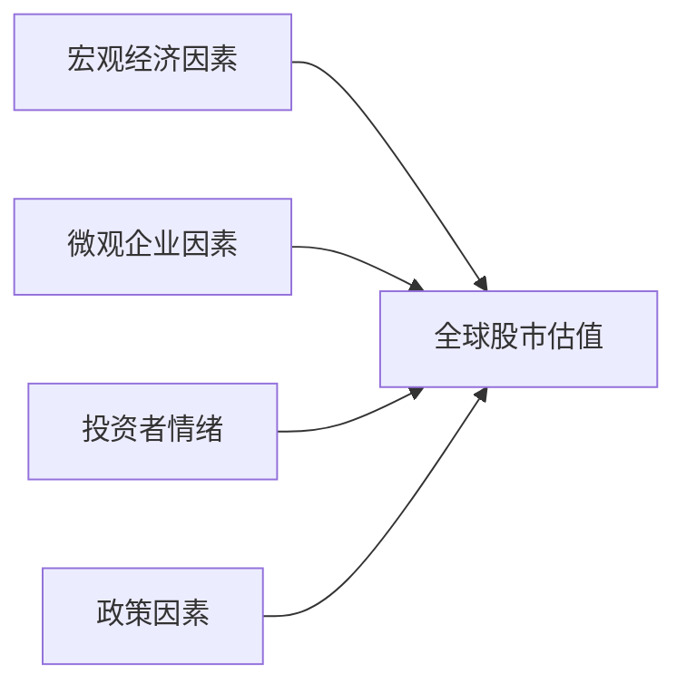
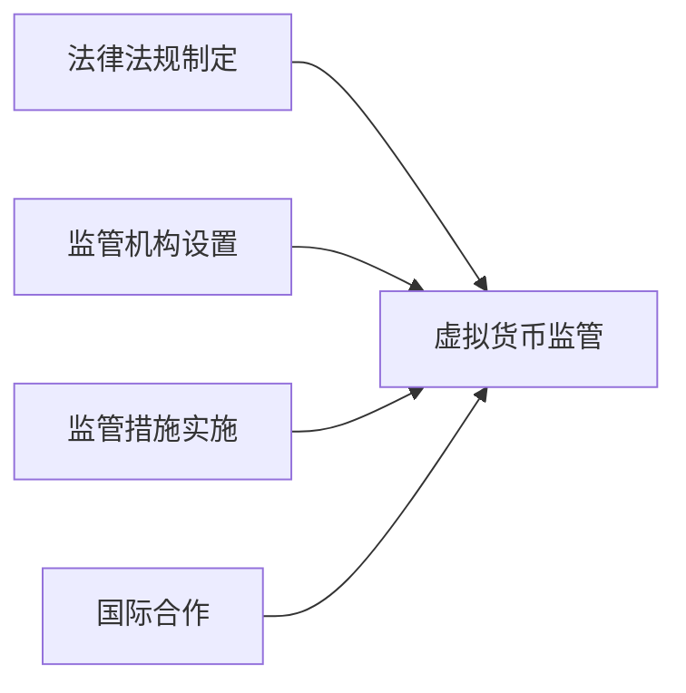

# 全球股市估值与虚拟货币监管的关系

> 关键词：全球股市估值、虚拟货币监管、金融市场、风险传导、市场联动

> 摘要：本文旨在深入探讨全球股市估值与虚拟货币监管之间的关系。随着虚拟货币市场的快速发展，其对全球金融市场的影响日益显著，而股市作为金融市场的重要组成部分，与虚拟货币市场存在着复杂的联系。通过分析全球股市估值的影响因素、虚拟货币监管的必要性及现状，阐述两者之间的相互作用机制，结合实际案例和数据进行深入研究，为投资者、监管机构和政策制定者提供有价值的参考，以更好地应对金融市场的变化和挑战。

## 1. 背景介绍 
### 1.1 目的和范围
本研究的目的在于全面剖析全球股市估值与虚拟货币监管之间的内在联系，探究虚拟货币监管政策的变化如何影响全球股市估值，以及股市估值的波动又会对虚拟货币监管产生怎样的反馈。研究范围涵盖全球主要股票市场和虚拟货币市场，包括美国、欧洲、亚洲等地区的主要股票指数和具有代表性的虚拟货币，如比特币、以太坊等。

### 1.2 预期读者
本文预期读者包括金融市场投资者、金融监管机构工作人员、政策制定者、金融研究学者以及对金融市场动态感兴趣的人士。投资者可以通过了解两者关系，更好地进行资产配置和风险管理；监管机构和政策制定者可以依据研究结果制定更合理的监管政策和金融政策；研究学者可以在此基础上进行更深入的学术研究。

### 1.3 文档结构概述
本文首先介绍研究的背景、目的、预期读者和文档结构，接着阐述相关的核心概念和联系，包括全球股市估值和虚拟货币监管的原理和架构。然后详细讲解影响全球股市估值和虚拟货币监管的核心算法原理及具体操作步骤，并运用数学模型和公式进行深入分析和举例说明。通过项目实战，展示实际案例并对代码进行详细解读。探讨两者关系在实际金融市场中的应用场景，推荐相关的学习资源、开发工具框架和论文著作。最后总结未来发展趋势与挑战，提供常见问题与解答以及扩展阅读和参考资料。

### 1.4 术语表
#### 1.4.1 核心术语定义
- **全球股市估值**：指对全球范围内各个股票市场中上市公司股票价值的评估，通常通过市盈率、市净率等指标来衡量。
- **虚拟货币**：是一种基于密码学技术，使用去中心化的分布式账本（区块链）进行交易记录和验证的数字化资产，不依赖于法定货币机构发行。
- **虚拟货币监管**：指政府或金融监管机构为了维护金融稳定、保护投资者权益、防范金融风险等目的，对虚拟货币的发行、交易、流通等环节进行的监督和管理。

#### 1.4.2 相关概念解释
- **金融市场联动性**：指不同金融市场之间由于资金流动、投资者情绪、宏观经济因素等原因而产生的相互影响和关联。全球股市和虚拟货币市场作为金融市场的重要组成部分，存在着一定的联动性。
- **风险传导**：指一个金融市场或金融机构的风险通过各种渠道传递到其他金融市场或金融机构的过程。虚拟货币市场的风险可能会传导至全球股市，影响股市估值。

#### 1.4.3 缩略词列表
- **GDP**：国内生产总值（Gross Domestic Product）
- **CPI**：消费者物价指数（Consumer Price Index）
- **BTC**：比特币（Bitcoin）
- **ETH**：以太坊（Ethereum）

## 2. 核心概念与联系 

### 全球股市估值原理和架构
全球股市估值是一个复杂的过程，受到多种因素的影响。从宏观层面来看，经济增长、通货膨胀、利率水平、货币政策等因素会对股市整体估值产生影响。例如，经济增长强劲时，企业盈利预期增加，股市估值往往会上升；而通货膨胀上升、利率提高则可能导致股市估值下降。

从微观层面来看，上市公司的业绩表现、行业前景、公司治理等因素也会影响其股票的估值。市盈率（P/E）、市净率（P/B）等是常用的估值指标。市盈率是指股票价格与每股盈利的比率，反映了投资者对公司未来盈利的预期；市净率是指股票价格与每股净资产的比率，反映了股票的账面价值。

其架构可以用以下示意图表示：



### 虚拟货币监管原理和架构
虚拟货币监管的主要目的是防范金融风险、保护投资者权益、维护金融稳定和打击违法犯罪活动。由于虚拟货币的去中心化、匿名性和跨境流通等特点，其监管面临着诸多挑战。

虚拟货币监管的架构通常包括法律法规制定、监管机构设置、监管措施实施等环节。监管机构通过制定相关法律法规，明确虚拟货币的合法地位、交易规则和监管要求；设置专门的监管机构对虚拟货币市场进行监督和管理；采取市场准入、信息披露、反洗钱等监管措施，防范虚拟货币市场的风险。

其架构可以用以下示意图表示：



### 全球股市估值与虚拟货币监管的联系
全球股市估值与虚拟货币监管之间存在着相互影响的关系。一方面，虚拟货币监管政策的变化会影响虚拟货币市场的发展，进而影响投资者的资产配置和投资决策，从而对全球股市估值产生影响。例如，当监管机构加强对虚拟货币的监管时，虚拟货币市场的资金可能会流出，部分资金可能会流入股市，导致股市估值上升。

另一方面，全球股市估值的波动也会影响虚拟货币监管政策的制定和实施。当股市出现大幅下跌时，投资者可能会寻求其他投资渠道，虚拟货币市场可能会吸引更多的资金流入，这可能会引起监管机构的关注，促使其加强对虚拟货币市场的监管。

两者的联系可以用以下示意图表示：


## 3. 核心算法原理 & 具体操作步骤 

### 全球股市估值算法原理
在计算全球股市估值时，常用的方法是基于市盈率模型。假设某股票市场的总市值为 $M$，上市公司的总盈利为 $E$，则该股票市场的市盈率 $P/E$ 可以表示为：

$P/E=\frac{M}{E}$

通过对不同股票市场的市盈率进行比较，可以评估其估值水平的高低。一般来说，市盈率较高的市场可能被高估，而市盈率较低的市场可能被低估。

以下是一个使用 Python 计算股票市场市盈率的示例代码：

```python
# 假设某股票市场的总市值为 10000 亿美元，上市公司的总盈利为 500 亿美元
total_market_cap = 10000
total_earnings = 500

# 计算市盈率
pe_ratio = total_market_cap / total_earnings

print(f"该股票市场的市盈率为: {pe_ratio}")
```

### 虚拟货币监管效果评估算法原理
评估虚拟货币监管效果可以从多个方面进行，如市场规模变化、价格波动、交易量变化等。一种简单的方法是计算虚拟货币市场在监管前后的市场规模变化率。

假设虚拟货币市场在监管前的总市值为 $M_1$，监管后的总市值为 $M_2$，则市场规模变化率 $r$ 可以表示为：

$r=\frac{M_2 - M_1}{M_1} \times 100\%$

如果市场规模变化率为负，说明监管措施可能对虚拟货币市场起到了抑制作用；如果市场规模变化率为正，说明监管措施可能对虚拟货币市场的影响较小或没有起到预期的效果。

以下是一个使用 Python 计算虚拟货币市场规模变化率的示例代码：

```python
# 假设虚拟货币市场在监管前的总市值为 5000 亿美元，监管后的总市值为 4000 亿美元
market_cap_before = 5000
market_cap_after = 4000

# 计算市场规模变化率
change_rate = ((market_cap_after - market_cap_before) / market_cap_before) * 100

print(f"虚拟货币市场规模变化率为: {change_rate}%")
```

### 具体操作步骤
1. **数据收集**：收集全球主要股票市场的总市值、上市公司盈利数据，以及虚拟货币市场的总市值、交易量等数据。
2. **数据处理**：对收集到的数据进行清洗、整理和分析，计算相关指标，如市盈率、市场规模变化率等。
3. **模型建立**：根据计算得到的指标，建立全球股市估值和虚拟货币监管效果评估的模型。
4. **结果分析**：对模型结果进行分析，评估全球股市估值水平和虚拟货币监管效果，探讨两者之间的关系。

## 4. 数学模型和公式 & 详细讲解 & 举例说明 

### 全球股市估值的数学模型
除了市盈率模型外，还可以使用股息贴现模型（DDM）来评估股票的价值。股息贴现模型的基本思想是，股票的价值等于其未来股息的现值之和。

假设某股票每年的股息为 $D$，股息增长率为 $g$，投资者要求的回报率为 $r$，则该股票的价值 $V$ 可以表示为：

$V=\frac{D_1}{r - g}$

其中，$D_1$ 为下一年的股息，$D_1 = D_0(1 + g)$，$D_0$ 为当前的股息。

例如，某股票当前的股息为 $2$ 元，股息增长率为 $5\%$，投资者要求的回报率为 $10\%$，则下一年的股息 $D_1 = 2\times(1 + 5\%) = 2.1$ 元。该股票的价值 $V=\frac{2.1}{10\% - 5\%} = 42$ 元。

### 虚拟货币市场与全球股市的联动模型
为了研究虚拟货币市场与全球股市的联动关系，可以使用向量自回归模型（VAR）。VAR 模型是一种多变量时间序列模型，用于描述多个变量之间的动态关系。

假设虚拟货币市场的收益率为 $y_{1t}$，全球股市的收益率为 $y_{2t}$，则 VAR(p) 模型可以表示为：

$\begin{cases}
y_{1t} = c_1 + \sum_{i = 1}^{p} \alpha_{1i}y_{1,t - i} + \sum_{i = 1}^{p} \beta_{1i}y_{2,t - i} + \epsilon_{1t}\\
y_{2t} = c_2 + \sum_{i = 1}^{p} \alpha_{2i}y_{1,t - i} + \sum_{i = 1}^{p} \beta_{2i}y_{2,t - i} + \epsilon_{2t}
\end{cases}$

其中，$c_1$ 和 $c_2$ 为常数项，$\alpha_{ij}$ 和 $\beta_{ij}$ 为系数，$\epsilon_{1t}$ 和 $\epsilon_{2t}$ 为误差项。

通过估计 VAR 模型的系数，可以分析虚拟货币市场收益率和全球股市收益率之间的相互影响关系。例如，如果 $\beta_{1i}$ 显著不为零，说明全球股市收益率的变化会对虚拟货币市场收益率产生影响；如果 $\alpha_{2i}$ 显著不为零，说明虚拟货币市场收益率的变化会对全球股市收益率产生影响。

### 举例说明
假设我们收集了 2018 年 1 月至 2022 年 12 月期间比特币的收益率和美国标准普尔 500 指数的收益率数据，使用 Python 的 statsmodels 库来估计 VAR 模型。

```python
import pandas as pd
import numpy as np
from statsmodels.tsa.api import VAR

# 模拟数据
np.random.seed(0)
n = 60
bitcoin_returns = np.random.randn(n)
sp500_returns = np.random.randn(n)

data = pd.DataFrame({'bitcoin_returns': bitcoin_returns, 'sp500_returns': sp500_returns})

# 建立 VAR 模型
model = VAR(data)

# 选择最优滞后阶数
lag_order = model.select_order(maxlags=10)
print(f"最优滞后阶数为: {lag_order.selected_orders['aic']}")

# 估计 VAR 模型
results = model.fit(lag_order.selected_orders['aic'])

# 查看模型结果
print(results.summary())
```

通过上述代码，我们可以得到 VAR 模型的估计结果，分析比特币收益率和美国标准普尔 500 指数收益率之间的相互影响关系。

## 5. 项目实战：代码实际案例和详细解释说明 

### 5.1  开发环境搭建
为了完成本项目实战，我们需要搭建以下开发环境：
1. **Python 环境**：建议使用 Python 3.7 及以上版本。可以从 Python 官方网站（https://www.python.org/downloads/） 下载并安装。
2. **相关库**：需要安装 pandas、numpy、statsmodels 等库。可以使用以下命令进行安装：
```sh
pip install pandas numpy statsmodels
```
3. **数据来源**：可以从金融数据提供商（如雅虎财经、Tushare 等）获取全球股市和虚拟货币市场的数据。

### 5.2  源代码详细实现和代码解读
以下是一个完整的项目实战代码示例，用于分析全球股市估值与虚拟货币监管之间的关系。

```python
import pandas as pd
import numpy as np
from statsmodels.tsa.api import VAR
import matplotlib.pyplot as plt

# 读取数据
def read_data():
    # 假设从 CSV 文件中读取数据
    stock_data = pd.read_csv('stock_data.csv')
    crypto_data = pd.read_csv('crypto_data.csv')
    return stock_data, crypto_data

# 数据预处理
def preprocess_data(stock_data, crypto_data):
    # 计算股票市场的市盈率
    stock_data['PE_ratio'] = stock_data['Market_Cap'] / stock_data['Earnings']
    
    # 计算虚拟货币市场的收益率
    crypto_data['Returns'] = crypto_data['Price'].pct_change()
    
    # 去除缺失值
    stock_data = stock_data.dropna()
    crypto_data = crypto_data.dropna()
    
    return stock_data, crypto_data

# 建立 VAR 模型
def build_var_model(stock_data, crypto_data):
    # 选择相关变量
    var_data = pd.DataFrame({
        'PE_ratio': stock_data['PE_ratio'],
        'Crypto_Returns': crypto_data['Returns']
    })
    
    # 建立 VAR 模型
    model = VAR(var_data)
    
    # 选择最优滞后阶数
    lag_order = model.select_order(maxlags=10)
    print(f"最优滞后阶数为: {lag_order.selected_orders['aic']}")
    
    # 估计 VAR 模型
    results = model.fit(lag_order.selected_orders['aic'])
    
    return results

# 绘制脉冲响应函数图
def plot_irf(results):
    irf = results.irf(10)
    irf.plot()
    plt.show()

# 主函数
def main():
    # 读取数据
    stock_data, crypto_data = read_data()
    
    # 数据预处理
    stock_data, crypto_data = preprocess_data(stock_data, crypto_data)
    
    # 建立 VAR 模型
    results = build_var_model(stock_data, crypto_data)
    
    # 绘制脉冲响应函数图
    plot_irf(results)

if __name__ == "__main__":
    main()
```

### 5.3  代码解读与分析
1. **读取数据**：`read_data` 函数从 CSV 文件中读取全球股市和虚拟货币市场的数据。
2. **数据预处理**：`preprocess_data` 函数计算股票市场的市盈率和虚拟货币市场的收益率，并去除缺失值。
3. **建立 VAR 模型**：`build_var_model` 函数选择相关变量，建立 VAR 模型，选择最优滞后阶数，并估计模型参数。
4. **绘制脉冲响应函数图**：`plot_irf` 函数绘制脉冲响应函数图，用于分析一个变量的冲击对另一个变量的动态影响。
5. **主函数**：`main` 函数调用上述函数，完成整个项目的流程。

通过分析 VAR 模型的估计结果和脉冲响应函数图，我们可以了解全球股市估值与虚拟货币市场收益率之间的相互影响关系，进而探讨虚拟货币监管对全球股市估值的影响。

## 6. 实际应用场景 
### 投资者资产配置
投资者可以根据全球股市估值和虚拟货币监管政策的变化，调整自己的资产配置。当虚拟货币监管政策收紧时，虚拟货币市场的风险可能增加，投资者可以减少对虚拟货币的投资，增加对股票等其他资产的配置；当全球股市估值过高时，投资者可以适当降低股票仓位，增加对虚拟货币等其他资产的投资。

### 监管机构决策
监管机构可以通过监测全球股市估值和虚拟货币市场的动态，制定合理的监管政策。当虚拟货币市场的波动对全球股市估值产生较大影响时，监管机构可以加强对虚拟货币市场的监管，防范金融风险的传导；当全球股市估值过低时，监管机构可以采取适当的政策措施，刺激股市的发展。

### 政策制定者参考
政策制定者可以参考全球股市估值与虚拟货币监管的关系，制定宏观经济政策。例如，当虚拟货币市场的发展对实体经济产生负面影响时，政策制定者可以出台相关政策，引导资金流向实体经济，促进经济的稳定增长。

## 7. 工具和资源推荐
### 7.1 学习资源推荐
#### 7.1.1 书籍推荐
- 《金融市场与金融机构》：这本书全面介绍了金融市场和金融机构的基本概念、运行机制和监管政策，对于理解全球股市和虚拟货币市场有很大的帮助。
- 《投资学》：系统地阐述了投资的基本理论、方法和策略，包括股票投资、债券投资、基金投资等，对于投资者进行资产配置和风险管理具有重要的指导意义。
- 《区块链：技术驱动金融》：详细介绍了区块链技术的原理、应用和发展趋势，对于理解虚拟货币的本质和运行机制非常有帮助。

#### 7.1.2 在线课程
- Coursera 上的“Financial Markets”：由耶鲁大学教授 Robert Shiller 授课，介绍了金融市场的基本概念、运行机制和投资策略。
- edX 上的“Blockchain and Cryptocurrencies”：由康奈尔大学教授 Emin Gün Sirer 授课，介绍了区块链技术和虚拟货币的基本原理、应用和发展趋势。
- 中国大学 MOOC 上的“投资学原理”：由清华大学教授朱武祥授课，系统地讲解了投资学的基本理论和方法。

#### 7.1.3 技术博客和网站
- 雪球网：提供股票市场的行情、资讯、分析和讨论，是投资者交流和学习的重要平台。
- CoinDesk：专注于虚拟货币和区块链技术的新闻和分析，提供最新的行业动态和市场信息。
- 东方财富网：提供全面的金融市场资讯、数据和分析工具，是投资者获取金融信息的重要渠道。

### 7.2 开发工具框架推荐
#### 7.2.1 IDE和编辑器
- PyCharm：是一款专业的 Python 集成开发环境，提供代码编辑、调试、版本控制等功能，适合开发 Python 项目。
- Jupyter Notebook：是一个交互式的开发环境，支持多种编程语言，适合进行数据分析和模型开发。
- Visual Studio Code：是一款轻量级的代码编辑器，支持多种编程语言和插件，适合快速开发和调试代码。

#### 7.2.2 调试和性能分析工具
- pdb：是 Python 内置的调试器，可以帮助开发者调试代码，查找错误。
- cProfile：是 Python 内置的性能分析工具，可以帮助开发者分析代码的性能瓶颈，优化代码。
- Py-Spy：是一个开源的 Python 性能分析工具，可以实时监测 Python 程序的性能，找出性能瓶颈。

#### 7.2.3 相关框架和库
- pandas：是一个强大的数据分析库，提供数据结构和数据分析工具，适合处理金融数据。
- numpy：是一个基础的科学计算库，提供多维数组和数学函数，适合进行数值计算。
- statsmodels：是一个统计分析库，提供各种统计模型和方法，适合进行时间序列分析和回归分析。

### 7.3 相关论文著作推荐
#### 7.3.1 经典论文
- Fama, E. F., & French, K. R. (1992). The cross-section of expected stock returns. The Journal of Finance, 47(2), 427-465. 该论文提出了著名的 Fama-French 三因子模型，用于解释股票收益率的横截面差异。
- Shiller, R. J. (1981). Do stock prices move too much to be justified by subsequent changes in dividends?. The American Economic Review, 71(3), 421-436. 该论文探讨了股票价格波动与股息变化之间的关系，提出了股票市场存在过度波动的观点。

#### 7.3.2 最新研究成果
- Cheah, J., & Fry, J. (2015). Speculative bubbles in Bitcoin markets? An empirical investigation into the fundamental value of Bitcoin. Economics Letters, 130, 32-36. 该论文研究了比特币市场是否存在投机泡沫，通过实证分析探讨了比特币的基本价值。
- Corbet, S., Lucey, B. M., Peat, M., & Vigne, S. A. (2018). Exploring the dynamic relationships between cryptocurrencies and other financial assets. Economics Letters, 165, 28-34. 该论文研究了虚拟货币与其他金融资产之间的动态关系，通过实证分析探讨了虚拟货币市场的风险传导机制。

#### 7.3.3 应用案例分析
- Yermack, D. (2013). Is Bitcoin a real currency? An economic appraisal. NBER working paper series. 该论文对比特币是否是一种真正的货币进行了经济评估，通过分析比特币的特点和应用案例，探讨了比特币的货币属性。
- Baur, D. G., Hong, S., & Lee, A. D. (2018). Bitcoin, gold and the dollar - A GARCH volatility analysis. Finance Research Letters, 25, 39-44. 该论文通过 GARCH 模型分析了比特币、黄金和美元之间的波动关系，通过应用案例探讨了比特币的避险属性。

## 8. 总结：未来发展趋势与挑战
### 未来发展趋势
1. **监管加强**：随着虚拟货币市场的不断发展，其对金融稳定的影响日益受到关注，未来各国监管机构可能会加强对虚拟货币市场的监管，制定更加严格的监管政策。
2. **市场融合**：全球股市和虚拟货币市场之间的联系可能会更加紧密，市场融合的趋势将更加明显。投资者可能会更加注重资产的多元化配置，将虚拟货币纳入投资组合。
3. **技术创新**：区块链技术的不断创新将推动虚拟货币市场的发展，新的虚拟货币和应用场景可能会不断涌现。同时，人工智能、大数据等技术的应用也将为全球股市估值和虚拟货币监管提供更加精准的分析和决策支持。

### 挑战
1. **监管协调**：由于虚拟货币的跨境流通性，各国监管政策的差异可能会导致监管套利和监管漏洞。因此，加强国际监管协调是未来面临的重要挑战。
2. **风险防范**：虚拟货币市场的高波动性和不确定性给投资者和金融市场带来了较大的风险。如何有效地防范虚拟货币市场的风险，保护投资者权益，是未来需要解决的关键问题。
3. **技术安全**：区块链技术的安全性是虚拟货币市场发展的重要保障。随着虚拟货币市场的不断发展，黑客攻击、数据泄露等技术安全问题可能会日益突出，如何保障区块链技术的安全是未来面临的重要挑战。

## 9. 附录：常见问题与解答
### 1. 虚拟货币监管政策的变化对全球股市估值的影响有多大？
虚拟货币监管政策的变化对全球股市估值的影响程度取决于多种因素，如监管政策的强度、虚拟货币市场的规模、投资者的情绪等。一般来说，当监管政策加强时，虚拟货币市场的资金可能会流出，部分资金可能会流入股市，导致股市估值上升；但如果监管政策过于严格，可能会引发市场恐慌，导致股市估值下降。

### 2. 如何判断全球股市估值是否过高或过低？
可以通过多种指标来判断全球股市估值是否过高或过低，如市盈率、市净率、股息率等。一般来说，市盈率较高、市净率较高、股息率较低的市场可能被高估；而市盈率较低、市净率较低、股息率较高的市场可能被低估。但需要注意的是，不同行业和市场的估值水平可能会有所差异，需要进行综合分析。

### 3. 虚拟货币市场的风险如何传导至全球股市？
虚拟货币市场的风险可以通过多种渠道传导至全球股市，如投资者情绪、资金流动、宏观经济影响等。当虚拟货币市场出现大幅波动时，投资者的情绪可能会受到影响，导致其对股票市场的信心下降，从而引发股票市场的抛售行为。同时，虚拟货币市场的资金流动也可能会影响股票市场的资金供求关系，进而影响股市估值。此外，虚拟货币市场的发展也可能会对宏观经济产生影响，如影响货币政策的实施等，从而间接影响全球股市估值。

## 10. 扩展阅读 & 参考资料
### 扩展阅读
- 《金融科技前沿：技术驱动的金融创新》：介绍了金融科技的最新发展和应用，包括区块链、人工智能、大数据等技术在金融领域的应用，对于理解虚拟货币市场和全球股市的发展趋势有很大的帮助。
- 《金融风险管理》：系统地阐述了金融风险管理的基本理论、方法和技术，包括市场风险、信用风险、操作风险等的管理，对于投资者和金融机构进行风险管理具有重要的指导意义。

### 参考资料
1. 雅虎财经：https://finance.yahoo.com/
2. Tushare：https://tushare.pro/
3. CoinMarketCap：https://coinmarketcap.com/
4. 中国人民银行官网：https://www.pbc.gov.cn/
5. 美国证券交易委员会官网：https://www.sec.gov/