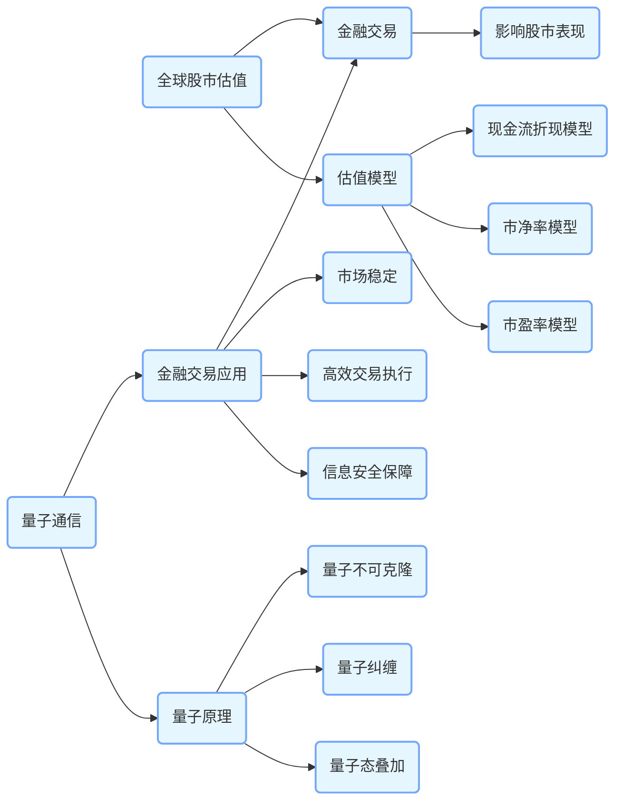

# 全球股市估值与量子通信在金融交易中的应用

> 关键词：全球股市估值、量子通信、金融交易、估值模型、信息安全

> 摘要：本文聚焦于全球股市估值以及量子通信在金融交易中的应用。首先深入探讨全球股市估值的多种方法和影响因素，剖析不同估值模型的原理与适用场景。接着详细阐述量子通信的核心概念、技术原理，以及其在金融交易领域的独特优势和潜在价值。通过实际案例和数学模型，揭示量子通信如何提升金融交易的安全性、效率和稳定性。旨在为金融从业者、科技研究者提供全面的理论参考和实践指导，促进金融与科技的深度融合。

## 1. 背景介绍 
### 1.1 目的和范围
全球股市作为金融市场的重要组成部分，其估值的准确性对于投资者决策、市场稳定至关重要。随着信息技术的飞速发展，金融交易的规模和速度不断提升，对信息安全和传输效率提出了更高要求。量子通信作为一种新兴的通信技术，具有极高的安全性和超快的传输速度，为金融交易带来了新的机遇。本文旨在深入研究全球股市估值的方法和模型，探讨量子通信在金融交易中的应用原理、优势和挑战，范围涵盖理论分析、技术研究、实际案例和未来展望。

### 1.2 预期读者
本文预期读者包括金融领域的专业人士，如股票分析师、投资经理、交易员等，他们可以从本文中获取关于全球股市估值的最新方法和思路，以及量子通信对金融交易的影响。同时，计算机科学、通信技术领域的研究者和工程师也能从本文中了解量子通信在金融场景的应用需求和实践案例。此外，对金融科技感兴趣的学生和爱好者也能通过本文系统地学习相关知识。

### 1.3 文档结构概述
本文首先介绍全球股市估值和量子通信的背景知识，包括目的、读者和术语表。接着阐述核心概念与联系，包括全球股市估值模型和量子通信的原理及架构。然后详细讲解核心算法原理和具体操作步骤，通过Python代码进行示例。之后介绍相关的数学模型和公式，并举例说明。在项目实战部分，给出代码实际案例和详细解释。随后探讨量子通信在金融交易中的实际应用场景。推荐相关的工具和资源，包括学习资源、开发工具框架和论文著作。最后总结未来发展趋势与挑战，提供常见问题解答和扩展阅读参考资料。

### 1.4 术语表
#### 1.4.1 核心术语定义
- **全球股市估值**：对全球范围内股票市场中上市公司的价值进行评估的过程，通过各种方法和模型确定股票的合理价格。
- **量子通信**：利用量子力学原理进行信息传递的通信方式，基于量子态的特性实现信息的安全传输和高效处理。
- **金融交易**：在金融市场中进行的各种买卖活动，包括股票、债券、期货等金融产品的交易。
- **估值模型**：用于评估股票价值的数学模型，如市盈率模型、现金流折现模型等。
- **量子纠缠**：量子力学中的一种现象，两个或多个量子系统之间存在一种特殊的关联，即使相隔很远，一个量子的状态变化会瞬间影响另一个量子的状态。

#### 1.4.2 相关概念解释
- **市场效率**：指市场价格反映所有可用信息的程度。有效市场中，股票价格能够及时、准确地反映公司的基本面信息和市场预期。
- **信息安全**：保护信息免受未经授权的访问、使用、披露、破坏或更改，确保信息的保密性、完整性和可用性。
- **量子密钥分发**：利用量子态的特性生成和分发密钥，保证密钥的安全性，防止密钥在传输过程中被窃取。

#### 1.4.3 缩略词列表
- **P/E**：市盈率（Price-to-Earnings Ratio）
- **DCF**：现金流折现（Discounted Cash Flow）
- **QKD**：量子密钥分发（Quantum Key Distribution）

## 2. 核心概念与联系 

### 全球股市估值模型
全球股市估值是一个复杂的过程，涉及多个因素和方法。常见的估值模型包括市盈率模型、市净率模型、现金流折现模型等。

- **市盈率模型**：市盈率（P/E）是指股票价格与每股收益的比率。其计算公式为 $P/E=\frac{股价}{每股收益}$。该模型假设市场对同行业公司的盈利预期具有相似性，通过比较不同公司的市盈率来评估股票的相对价值。例如，若某行业平均市盈率为20倍，而某公司市盈率为15倍，则该公司股票可能被低估。

- **市净率模型**：市净率（P/B）是指股票价格与每股净资产的比率。计算公式为 $P/B=\frac{股价}{每股净资产}$。市净率反映了市场对公司净资产的估值水平。一般来说，市净率较低的股票可能具有更高的投资价值。

- **现金流折现模型**：现金流折现模型（DCF）是一种基于公司未来现金流的估值方法。其基本原理是将公司未来的自由现金流折现到当前时点，得到公司的内在价值。公式为 $V=\sum_{t=1}^{n}\frac{FCF_t}{(1+r)^t}$，其中 $V$ 为公司内在价值，$FCF_t$ 为第 $t$ 期的自由现金流，$r$ 为折现率，$n$ 为预测期数。

### 量子通信原理
量子通信基于量子力学的基本原理，主要包括量子态的叠加性、量子纠缠和量子不可克隆定理。

- **量子态的叠加性**：量子系统可以处于多个状态的叠加态，即一个量子比特可以同时表示0和1。这种特性使得量子计算机能够并行处理大量信息，提高计算效率。

- **量子纠缠**：当两个或多个量子系统处于纠缠态时，它们之间存在一种特殊的关联。对其中一个量子的测量会瞬间影响另一个量子的状态，无论它们相隔多远。利用量子纠缠可以实现量子密钥分发和量子隐形传态。

- **量子不可克隆定理**：量子态不能被精确复制。这一特性保证了量子通信的安全性，因为任何试图窃听量子通信的行为都会改变量子态，从而被通信双方察觉。

### 量子通信与金融交易的联系
在金融交易中，信息的安全性和传输效率至关重要。量子通信的高安全性和超快传输速度可以为金融交易带来以下优势：

- **信息安全保障**：量子密钥分发可以生成绝对安全的密钥，用于加密金融交易信息，防止信息被窃取和篡改。

- **高效交易执行**：量子通信的高速传输能力可以减少交易延迟，提高交易效率，尤其在高频交易中具有重要意义。

- **市场稳定**：保障金融交易的安全性和效率可以增强市场参与者的信心，维护市场的稳定运行。

### 文本示意图
全球股市估值与量子通信在金融交易中的关系可以用以下示意图表示：

全球股市估值通过各种估值模型确定股票的合理价格，为投资者提供决策依据。量子通信作为一种新兴技术，为金融交易提供了安全可靠的通信保障。金融交易的高效、安全运行又会影响全球股市的表现。

### Mermaid 流程图


## 3. 核心算法原理 & 具体操作步骤 

### 全球股市估值算法原理
#### 市盈率模型
市盈率模型的核心思想是通过比较不同公司的市盈率来评估股票的相对价值。以下是一个简单的Python代码示例：

```python
def pe_ratio_valuation(price, earnings_per_share, industry_pe):
    """
    市盈率模型估值函数
    :param price: 股票当前价格
    :param earnings_per_share: 每股收益
    :param industry_pe: 行业平均市盈率
    :return: 股票的合理价格
    """
    pe = price / earnings_per_share
    fair_price = industry_pe * earnings_per_share
    if pe < industry_pe:
        print("该股票可能被低估，合理价格为：", fair_price)
    elif pe > industry_pe:
        print("该股票可能被高估，合理价格为：", fair_price)
    else:
        print("该股票价格合理，合理价格为：", fair_price)
    return fair_price

# 示例数据
price = 50
earnings_per_share = 2
industry_pe = 20

fair_price = pe_ratio_valuation(price, earnings_per_share, industry_pe)
```

#### 现金流折现模型
现金流折现模型的核心是将公司未来的自由现金流折现到当前时点。以下是一个简化的Python代码示例：

```python
def dcf_valuation(free_cash_flows, discount_rate):
    """
    现金流折现模型估值函数
    :param free_cash_flows: 未来各期的自由现金流列表
    :param discount_rate: 折现率
    :return: 公司的内在价值
    """
    value = 0
    for i, fcf in enumerate(free_cash_flows):
        discounted_fcf = fcf / (1 + discount_rate) ** (i + 1)
        value += discounted_fcf
    return value

# 示例数据
free_cash_flows = [100, 120, 150, 180, 200]
discount_rate = 0.1

company_value = dcf_valuation(free_cash_flows, discount_rate)
print("公司的内在价值为：", company_value)
```

### 量子密钥分发算法原理
量子密钥分发的核心是利用量子态的特性生成和分发密钥。其中，BB84协议是一种经典的量子密钥分发协议。以下是BB84协议的Python代码示例：

```python
import random

# 定义量子态
QUANTUM_STATES = ['+0', '+1', 'x0', 'x1']

def generate_random_bits(length):
    """
    生成随机比特序列
    :param length: 比特序列长度
    :return: 随机比特序列
    """
    return [random.randint(0, 1) for _ in range(length)]

def generate_random_bases(length):
    """
    生成随机基序列
    :param length: 基序列长度
    :return: 随机基序列
    """
    return [random.choice(['+', 'x']) for _ in range(length)]

def encode_bits(bits, bases):
    """
    根据基对比特进行编码
    :param bits: 比特序列
    :param bases: 基序列
    :return: 编码后的量子态序列
    """
    encoded_states = []
    for bit, base in zip(bits, bases):
        if base == '+':
            if bit == 0:
                encoded_states.append('+0')
            else:
                encoded_states.append('+1')
        else:
            if bit == 0:
                encoded_states.append('x0')
            else:
                encoded_states.append('x1')
    return encoded_states

def measure_states(states, bases):
    """
    根据基对量子态进行测量
    :param states: 量子态序列
    :param bases: 基序列
    :return: 测量后的比特序列
    """
    measured_bits = []
    for state, base in zip(states, bases):
        if base == '+':
            if state == '+0':
                measured_bits.append(0)
            elif state == '+1':
                measured_bits.append(1)
            else:
                # 测量错误，随机返回0或1
                measured_bits.append(random.randint(0, 1))
        else:
            if state == 'x0':
                measured_bits.append(0)
            elif state == 'x1':
                measured_bits.append(1)
            else:
                # 测量错误，随机返回0或1
                measured_bits.append(random.randint(0, 1))
    return measured_bits

def sift_bits(alice_bits, alice_bases, bob_bases):
    """
    筛选出相同基下的比特
    :param alice_bits: 发送方的比特序列
    :param alice_bases: 发送方的基序列
    :param bob_bases: 接收方的基序列
    :return: 筛选后的比特序列
    """
    sifted_bits = []
    for i in range(len(alice_bits)):
        if alice_bases[i] == bob_bases[i]:
            sifted_bits.append(alice_bits[i])
    return sifted_bits

# 示例
key_length = 100
alice_bits = generate_random_bits(key_length)
alice_bases = generate_random_bases(key_length)
encoded_states = encode_bits(alice_bits, alice_bases)

bob_bases = generate_random_bases(key_length)
bob_bits = measure_states(encoded_states, bob_bases)

sifted_key = sift_bits(alice_bits, alice_bases, bob_bases)
print("筛选后的密钥：", sifted_key)
```

### 具体操作步骤
#### 全球股市估值操作步骤
1. **数据收集**：收集股票的相关数据，包括股价、每股收益、每股净资产、自由现金流等。
2. **选择估值模型**：根据公司的特点和市场情况选择合适的估值模型，如市盈率模型、现金流折现模型等。
3. **参数确定**：确定估值模型中的参数，如行业平均市盈率、折现率等。
4. **计算估值**：将收集到的数据和确定的参数代入估值模型中，计算股票的合理价格或公司的内在价值。
5. **结果分析**：根据计算结果分析股票的投资价值，判断股票是被低估、高估还是价格合理。

#### 量子密钥分发操作步骤
1. **密钥生成**：发送方（Alice）生成随机的比特序列和基序列，并根据基序列对比特进行编码，生成量子态序列。
2. **量子态传输**：将编码后的量子态序列通过量子信道发送给接收方（Bob）。
3. **测量**：接收方（Bob）生成随机的基序列，并根据基序列对收到的量子态进行测量，得到测量后的比特序列。
4. **基比对**：发送方（Alice）和接收方（Bob）通过经典信道交换基序列，筛选出相同基下的比特，得到筛选后的密钥。
5. **安全性检测**：对筛选后的密钥进行安全性检测，确保密钥没有被窃听。

## 4. 数学模型和公式 & 详细讲解 & 举例说明 

### 全球股市估值数学模型和公式
#### 市盈率模型
市盈率模型的基本公式为 $P/E=\frac{股价}{每股收益}$，变形可得 $股价 = P/E \times 每股收益$。

**详细讲解**：市盈率反映了市场对公司盈利的预期。较高的市盈率可能表示市场对公司的未来发展前景看好，愿意为其支付更高的价格；较低的市盈率可能表示市场对公司的预期较低，或者公司被低估。

**举例说明**：假设某公司的每股收益为2元，行业平均市盈率为20倍。根据市盈率模型，该公司的合理股价为 $20 \times 2 = 40$ 元。如果该公司当前股价为30元，则可能被低估；如果当前股价为50元，则可能被高估。

#### 市净率模型
市净率模型的基本公式为 $P/B=\frac{股价}{每股净资产}$，变形可得 $股价 = P/B \times 每股净资产$。

**详细讲解**：市净率反映了市场对公司净资产的估值水平。一般来说，市净率较低的股票可能具有更高的投资价值，因为投资者可以以较低的价格购买到公司的净资产。

**举例说明**：假设某公司的每股净资产为5元，行业平均市净率为3倍。根据市净率模型，该公司的合理股价为 $3 \times 5 = 15$ 元。如果该公司当前股价为12元，则可能被低估；如果当前股价为18元，则可能被高估。

#### 现金流折现模型
现金流折现模型的基本公式为 $V=\sum_{t=1}^{n}\frac{FCF_t}{(1+r)^t}$，其中 $V$ 为公司内在价值，$FCF_t$ 为第 $t$ 期的自由现金流，$r$ 为折现率，$n$ 为预测期数。

**详细讲解**：现金流折现模型的核心思想是将公司未来的自由现金流折现到当前时点，得到公司的内在价值。折现率反映了投资者对投资回报的要求，一般可以采用资本资产定价模型（CAPM）来确定。

**举例说明**：假设某公司未来5年的自由现金流分别为100万元、120万元、150万元、180万元、200万元，折现率为10%。则该公司的内在价值为：

\[
\begin{align*}
V&=\frac{100}{(1 + 0.1)^1}+\frac{120}{(1 + 0.1)^2}+\frac{150}{(1 + 0.1)^3}+\frac{180}{(1 + 0.1)^4}+\frac{200}{(1 + 0.1)^5}\\
&=\frac{100}{1.1}+\frac{120}{1.21}+\frac{150}{1.331}+\frac{180}{1.4641}+\frac{200}{1.61051}\\
&\approx 90.91 + 99.17 + 112.70 + 122.94 + 124.18\\
&= 549.90 \text{（万元）}
\end{align*}
\]

### 量子通信数学模型和公式
#### 量子态的表示
量子比特可以用二维希尔伯特空间中的向量表示。例如，基态 $|0\rangle$ 和 $|1\rangle$ 可以表示为：

$|0\rangle=\begin{bmatrix}1\\0\end{bmatrix}$，$|1\rangle=\begin{bmatrix}0\\1\end{bmatrix}$

量子比特的叠加态可以表示为 $|\psi\rangle = \alpha|0\rangle + \beta|1\rangle$，其中 $\alpha$ 和 $\beta$ 是复数，且满足 $|\alpha|^2 + |\beta|^2 = 1$。

#### 量子纠缠态
以两个量子比特的纠缠态为例，贝尔态 $|\Phi^+\rangle=\frac{1}{\sqrt{2}}(|00\rangle + |11\rangle)$ 是一种典型的纠缠态。其中，$|00\rangle = |0\rangle \otimes |0\rangle$，$|11\rangle = |1\rangle \otimes |1\rangle$。

#### 量子密钥分发的安全性分析
在BB84协议中，假设窃听者（Eve）试图窃听量子通信。由于量子不可克隆定理，Eve的窃听行为会改变量子态，从而被通信双方（Alice和Bob）察觉。

设Alice发送的量子态为 $|\psi\rangle$，Bob测量得到的量子态为 $|\varphi\rangle$。如果没有窃听，$|\psi\rangle$ 和 $|\varphi\rangle$ 应该相同；如果存在窃听，$|\psi\rangle$ 和 $|\varphi\rangle$ 会出现差异。通过比较双方的测量结果，可以检测到窃听行为。

例如，假设Alice发送的量子态为 $|+0\rangle$，Bob使用正确的基（$+$ 基）测量得到的结果应该为0。如果Eve在传输过程中进行窃听，她的测量行为会改变量子态，导致Bob测量得到的结果可能为1。通过统计测量结果的差异率，可以判断是否存在窃听。

## 5. 项目实战：代码实际案例和详细解释说明 

### 5.1  开发环境搭建
#### 全球股市估值项目
- **编程语言**：Python 3.x
- **开发工具**：PyCharm 或 Jupyter Notebook
- **所需库**：`pandas`、`numpy` 用于数据处理，`matplotlib` 用于数据可视化。

安装所需库的命令：
```sh
pip install pandas numpy matplotlib
```

#### 量子通信项目
- **编程语言**：Python 3.x
- **开发工具**：PyCharm 或 Jupyter Notebook
- **所需库**：`qiskit` 用于量子计算和量子通信模拟。

安装 `qiskit` 的命令：
```sh
pip install qiskit
```

### 5.2  源代码详细实现和代码解读
#### 全球股市估值项目
以下是一个完整的全球股市估值项目示例，包括数据收集、市盈率模型估值和数据可视化：

```python
import pandas as pd
import numpy as np
import matplotlib.pyplot as plt

# 模拟数据收集
data = {
    '股票代码': ['A', 'B', 'C', 'D', 'E'],
    '股价': [50, 60, 40, 70, 80],
    '每股收益': [2, 3, 1.5, 3.5, 4],
    '行业平均市盈率': [20, 20, 20, 20, 20]
}

df = pd.DataFrame(data)

# 市盈率模型估值
def pe_ratio_valuation(price, earnings_per_share, industry_pe):
    pe = price / earnings_per_share
    fair_price = industry_pe * earnings_per_share
    if pe < industry_pe:
        valuation_result = '低估'
    elif pe > industry_pe:
        valuation_result = '高估'
    else:
        valuation_result = '合理'
    return fair_price, valuation_result

df['合理价格'], df['估值结果'] = zip(*df.apply(lambda row: pe_ratio_valuation(row['股价'], row['每股收益'], row['行业平均市盈率']), axis=1))

# 数据可视化
plt.figure(figsize=(10, 6))
plt.bar(df['股票代码'], df['股价'], label='当前股价')
plt.bar(df['股票代码'], df['合理价格'], label='合理价格', alpha=0.7)
plt.xlabel('股票代码')
plt.ylabel('价格')
plt.title('全球股市估值（市盈率模型）')
plt.legend()
plt.show()

print(df)
```

**代码解读**：
1. **数据收集**：使用 `pandas` 库创建一个包含股票代码、股价、每股收益和行业平均市盈率的 DataFrame。
2. **市盈率模型估值**：定义 `pe_ratio_valuation` 函数，根据市盈率模型计算股票的合理价格，并判断股票是被低估、高估还是价格合理。
3. **数据处理**：使用 `apply` 函数将 `pe_ratio_valuation` 函数应用到 DataFrame 的每一行，计算合理价格和估值结果，并将结果添加到 DataFrame 中。
4. **数据可视化**：使用 `matplotlib` 库绘制柱状图，比较当前股价和合理价格。

#### 量子通信项目
以下是一个使用 `qiskit` 库模拟量子密钥分发（BB84协议）的项目示例：

```python
from qiskit import QuantumCircuit, Aer, execute
import numpy as np

# 生成随机比特序列
def generate_random_bits(length):
    return np.random.randint(0, 2, length)

# 生成随机基序列
def generate_random_bases(length):
    return np.random.randint(0, 2, length)

# 编码量子比特
def encode_qubits(bits, bases):
    qc = QuantumCircuit(len(bits), len(bits))
    for i in range(len(bits)):
        if bases[i] == 0:  # 标准基
            if bits[i] == 1:
                qc.x(i)
        else:  # 哈达玛基
            if bits[i] == 0:
                qc.h(i)
            else:
                qc.x(i)
                qc.h(i)
    return qc

# 测量量子比特
def measure_qubits(qc, bases):
    backend = Aer.get_backend('qasm_simulator')
    for i in range(len(bases)):
        if bases[i] == 0:  # 标准基
            qc.measure(i, i)
        else:  # 哈达玛基
            qc.h(i)
            qc.measure(i, i)
    job = execute(qc, backend, shots=1)
    result = job.result()
    counts = result.get_counts(qc)
    measured_bits = [int(bit) for bit in list(counts.keys())[0][::-1]]
    return measured_bits

# 筛选比特
def sift_bits(alice_bits, alice_bases, bob_bases):
    sifted_bits = []
    for i in range(len(alice_bits)):
        if alice_bases[i] == bob_bases[i]:
            sifted_bits.append(alice_bits[i])
    return sifted_bits

# 示例
key_length = 10
alice_bits = generate_random_bits(key_length)
alice_bases = generate_random_bases(key_length)
qc = encode_qubits(alice_bits, alice_bases)

bob_bases = generate_random_bases(key_length)
bob_bits = measure_qubits(qc, bob_bases)

sifted_key = sift_bits(alice_bits, alice_bases, bob_bases)
print("筛选后的密钥：", sifted_key)
```

**代码解读**：
1. **随机比特和基序列生成**：定义 `generate_random_bits` 和 `generate_random_bases` 函数，生成随机的比特序列和基序列。
2. **量子比特编码**：定义 `encode_qubits` 函数，根据基序列对比特进行编码，创建量子电路。
3. **量子比特测量**：定义 `measure_qubits` 函数，根据基序列对量子比特进行测量，得到测量后的比特序列。
4. **比特筛选**：定义 `sift_bits` 函数，筛选出相同基下的比特，得到筛选后的密钥。
5. **示例运行**：生成随机的比特序列和基序列，进行量子比特编码、测量和比特筛选，输出筛选后的密钥。

### 5.3  代码解读与分析
#### 全球股市估值项目分析
- **优点**：使用 `pandas` 库进行数据处理，代码简洁高效；使用 `matplotlib` 库进行数据可视化，直观展示估值结果。
- **缺点**：模拟数据可能与实际情况存在偏差；市盈率模型只是一种简单的估值方法，没有考虑公司的未来发展和市场变化。

#### 量子通信项目分析
- **优点**：使用 `qiskit` 库进行量子计算和量子通信模拟，代码具有较高的可扩展性；模拟了量子密钥分发的基本过程，有助于理解量子通信的原理。
- **缺点**：只是简单的模拟，没有考虑实际量子通信中的噪声和误差；没有进行安全性检测，实际应用中需要进一步完善。

## 6. 实际应用场景 
### 全球股市估值的应用场景
#### 投资决策
投资者可以根据全球股市估值结果，选择被低估的股票进行投资，以获取更高的收益。例如，通过市盈率模型和现金流折现模型评估不同公司的价值，选择具有投资潜力的股票。

#### 风险管理
金融机构可以利用全球股市估值方法，评估投资组合的风险。通过对不同股票的估值分析，合理配置资产，降低投资组合的风险。

#### 市场监测
监管机构可以通过监测全球股市估值水平，了解市场的整体状况。当股市估值过高或过低时，采取相应的政策措施，维护市场的稳定运行。

### 量子通信在金融交易中的应用场景
#### 信息安全保障
金融机构在进行交易时，需要传输大量的敏感信息，如客户账户信息、交易指令等。量子通信的高安全性可以保证这些信息在传输过程中不被窃取和篡改，保护客户的隐私和资金安全。

#### 高频交易
在高频交易中，交易速度至关重要。量子通信的高速传输能力可以减少交易延迟，提高交易效率，使金融机构能够在更短的时间内完成交易，获取更多的利润。

#### 分布式金融系统
随着区块链技术的发展，分布式金融系统越来越受到关注。量子通信可以为分布式金融系统提供安全可靠的通信保障，确保节点之间的信息传输安全，促进分布式金融系统的发展。

## 7. 工具和资源推荐
### 7.1 学习资源推荐
#### 7.1.1 书籍推荐
- 《金融市场学》：全面介绍金融市场的基本概念、运行机制和投资策略，是学习金融知识的经典教材。
- 《量子力学原理》：深入讲解量子力学的基本原理和数学基础，是学习量子通信的必备书籍。
- 《Python数据分析实战》：介绍如何使用Python进行数据分析和处理，对于全球股市估值项目的开发具有重要参考价值。

#### 7.1.2 在线课程
- Coursera上的“金融市场”课程：由知名教授授课，系统讲解金融市场的理论和实践知识。
- edX上的“量子计算与量子信息”课程：介绍量子计算和量子通信的基本原理和应用。
- 慕课网上的“Python数据分析从入门到精通”课程：详细讲解Python数据分析的方法和技巧。

#### 7.1.3 技术博客和网站
- 金融界：提供全球股市的实时行情、分析报告和投资建议。
- 量子信息科学网站：介绍量子通信、量子计算等领域的最新研究成果和技术进展。
- 掘金：提供大量的技术文章和代码示例，对于学习Python编程和量子通信开发具有参考价值。

### 7.2 开发工具框架推荐
#### 7.2.1 IDE和编辑器
- PyCharm：功能强大的Python集成开发环境，提供代码编辑、调试、版本控制等功能。
- Jupyter Notebook：交互式的开发环境，适合进行数据探索和代码演示。

#### 7.2.2 调试和性能分析工具
- `pdb`：Python自带的调试工具，可以帮助开发者定位代码中的错误。
- `cProfile`：Python的性能分析工具，可以分析代码的运行时间和内存使用情况。

#### 7.2.3 相关框架和库
- `pandas`：用于数据处理和分析的Python库，提供高效的数据结构和数据操作方法。
- `numpy`：Python的数值计算库，提供高效的数组操作和数学函数。
- `qiskit`：用于量子计算和量子通信模拟的Python框架，提供丰富的量子算法和工具。

### 7.3 相关论文著作推荐
#### 7.3.1 经典论文
- “A Scheme for Efficient Quantum Computation with Linear Optics”：介绍了线性光学量子计算的基本原理和方法。
- “Quantum Cryptography Based on Bell's Theorem”：提出了基于贝尔定理的量子密码学方案。

#### 7.3.2 最新研究成果
- 关注《Nature》、《Science》等顶级学术期刊，了解量子通信和金融科技领域的最新研究成果。

#### 7.3.3 应用案例分析
- 查看金融机构和科技公司的官方网站，了解量子通信在金融交易中的实际应用案例和经验分享。

## 8. 总结：未来发展趋势与挑战
### 全球股市估值的未来发展趋势与挑战
#### 未来发展趋势
- **多因素模型的应用**：随着金融市场的复杂性增加，单一的估值模型可能无法准确评估股票的价值。未来，多因素模型将得到更广泛的应用，综合考虑公司的财务状况、行业前景、宏观经济环境等因素。
- **大数据和人工智能的结合**：大数据和人工智能技术的发展将为全球股市估值提供更丰富的数据和更强大的分析工具。通过对海量数据的挖掘和分析，结合人工智能算法，可以提高估值的准确性和效率。
- **国际化和跨市场估值**：随着全球经济一体化的发展，跨国投资和跨市场交易越来越频繁。未来，全球股市估值将更加注重国际化和跨市场的因素，考虑不同国家和地区的市场差异和风险。

#### 挑战
- **数据质量和可靠性**：全球股市估值需要大量的数据支持，数据的质量和可靠性直接影响估值的准确性。如何获取准确、及时、完整的数据是一个挑战。
- **市场不确定性**：金融市场充满不确定性，宏观经济环境、政策变化、突发事件等因素都会对股市产生影响。如何在不确定性的环境下进行准确的估值是一个难题。
- **模型的局限性**：现有的估值模型都有一定的局限性，无法完全反映市场的复杂性和变化。如何改进和完善估值模型，提高模型的适应性和准确性是一个重要的挑战。

### 量子通信在金融交易中的未来发展趋势与挑战
#### 未来发展趋势
- **商业化应用的推广**：随着量子通信技术的不断成熟，其在金融交易中的商业化应用将逐渐推广。金融机构将越来越多地采用量子通信技术来保障信息安全和提高交易效率。
- **与其他技术的融合**：量子通信将与区块链、云计算、人工智能等技术融合，形成更强大的金融科技解决方案。例如，量子通信与区块链结合可以实现更安全的分布式金融系统。
- **国际合作与标准化**：量子通信是一个全球性的研究领域，国际合作和标准化将促进量子通信技术的发展和应用。各国将加强在量子通信领域的合作，制定统一的标准和规范。

#### 挑战
- **技术成本**：目前，量子通信技术的成本较高，限制了其大规模应用。如何降低技术成本，提高量子通信设备的性价比是一个关键问题。
- **技术稳定性和可靠性**：量子通信技术还处于发展阶段，技术的稳定性和可靠性有待提高。如何解决量子通信中的噪声、误差和损耗等问题，确保通信的稳定性和可靠性是一个挑战。
- **人才短缺**：量子通信是一个新兴领域，相关的专业人才短缺。如何培养和吸引更多的量子通信专业人才，满足市场的需求是一个重要的挑战。

## 9. 附录：常见问题与解答
### 全球股市估值相关问题
#### 问题1：不同估值模型的适用场景有哪些？
答：市盈率模型适用于盈利稳定、行业竞争格局相对稳定的公司；市净率模型适用于资产规模较大、净资产较为稳定的公司；现金流折现模型适用于具有明确现金流预测的公司，尤其适用于成长型公司。

#### 问题2：如何确定估值模型中的参数？
答：行业平均市盈率可以通过统计同行业公司的市盈率数据来确定；折现率可以采用资本资产定价模型（CAPM）来计算，考虑无风险利率、市场风险溢价和公司的贝塔系数等因素。

### 量子通信相关问题
#### 问题1：量子通信是否完全安全？
答：量子通信基于量子力学的基本原理，具有极高的安全性。量子不可克隆定理保证了量子通信中的密钥无法被窃听和复制，只要通信过程中没有外界干扰和技术故障，量子通信可以实现绝对安全。

#### 问题2：量子通信的传输距离有限制吗？
答：目前，量子通信的传输距离受到技术限制。随着量子中继技术的发展，量子通信的传输距离正在不断提高。未来，有望实现长距离、全球化的量子通信网络。

## 10. 扩展阅读 & 参考资料
### 扩展阅读
- 《金融炼金术》：乔治·索罗斯的经典著作，介绍了他的投资哲学和金融市场分析方法。
- 《上帝掷骰子吗？——量子物理史话》：以生动有趣的方式介绍量子力学的发展历程和基本原理。

### 参考资料
- 相关学术期刊：《Journal of Finance》、《Physical Review Letters》等。
- 金融机构和科技公司的官方报告和研究成果。
- 相关的行业标准和规范文件。