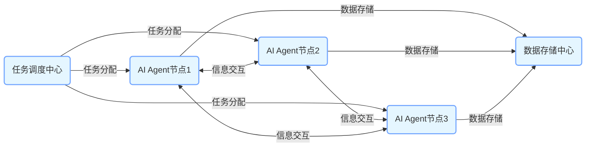

# 分布式AI Agent系统：设计与实现

> 关键词：分布式系统、AI Agent、设计架构、实现步骤、通信机制、任务调度、可扩展性

> 摘要：本文聚焦于分布式AI Agent系统的设计与实现。随着人工智能和分布式计算技术的发展，分布式AI Agent系统在多个领域展现出巨大潜力。文章将深入探讨该系统的核心概念、架构原理、算法机制，通过数学模型和公式进行理论分析，并结合具体的项目实战案例详细介绍实现过程。同时，分析其实际应用场景，推荐相关的学习资源、开发工具和研究论文，最后总结系统的未来发展趋势与挑战，以期为相关领域的研究者和开发者提供全面而深入的参考。

## 1. 背景介绍 
### 1.1 目的和范围
分布式AI Agent系统的设计与实现旨在将人工智能的智能决策能力与分布式计算的强大处理能力相结合，以应对大规模、复杂的任务需求。其范围涵盖了从单个AI Agent的智能行为建模到多个Agent在分布式环境下的协作与交互，涉及到计算机科学、人工智能、分布式系统等多个领域的知识和技术。

### 1.2 预期读者
本文预期读者包括对分布式系统和人工智能领域感兴趣的研究人员、开发者，以及相关专业的学生。对于希望深入了解分布式AI Agent系统的原理、设计和实现方法的读者，本文将提供有价值的参考。

### 1.3 文档结构概述
本文将首先介绍分布式AI Agent系统的背景知识，包括相关术语和概念。接着阐述核心概念与联系，通过文本示意图和Mermaid流程图展示系统架构。然后详细讲解核心算法原理和具体操作步骤，并给出Python源代码示例。之后介绍数学模型和公式，进行理论分析和举例说明。再通过项目实战案例，介绍开发环境搭建、源代码实现和代码解读。随后分析实际应用场景，推荐相关的工具和资源。最后总结系统的未来发展趋势与挑战，并提供常见问题解答和扩展阅读参考资料。

### 1.4 术语表
#### 1.4.1 核心术语定义
- **AI Agent（人工智能智能体）**：能够感知环境、做出决策并执行相应动作的智能实体。它可以是软件程序、机器人等，具有一定的自主性和智能性。
- **分布式系统**：由多个独立的计算节点通过网络连接而成的系统，这些节点可以并行地处理任务，实现资源共享和协同工作。
- **通信机制**：用于在分布式系统中各个节点之间传递信息的方法和协议。
- **任务调度**：根据系统的资源状态和任务需求，合理分配任务到各个节点的过程。
- **可扩展性**：系统能够随着需求的增长，方便地增加计算资源和功能的能力。

#### 1.4.2 相关概念解释
- **多Agent系统（Multi - Agent System，MAS）**：由多个AI Agent组成的系统，这些Agent之间可以通过通信和协作来完成复杂的任务。
- **智能决策**：AI Agent根据感知到的环境信息和自身的目标，选择最优行动方案的过程。
- **分布式计算**：将一个大的计算任务分解成多个小的子任务，分配到不同的计算节点上并行执行，以提高计算效率。

#### 1.4.3 缩略词列表
- **MAS**：Multi - Agent System（多Agent系统）
- **RPC**：Remote Procedure Call（远程过程调用）
- **REST**：Representational State Transfer（表现层状态转移）

## 2. 核心概念与联系 

### 核心概念原理
分布式AI Agent系统的核心在于将多个AI Agent分布在不同的计算节点上，通过通信机制实现Agent之间的信息交互和协作。每个AI Agent具有独立的智能决策能力，能够根据自身的目标和感知到的环境信息做出相应的决策。

AI Agent的智能决策通常基于一定的算法和模型，如机器学习、深度学习等。在分布式环境下，Agent之间的协作可以通过任务分配、信息共享等方式实现，以提高系统的整体性能和效率。

### 架构的文本示意图
分布式AI Agent系统主要由以下几个部分组成：
- **AI Agent节点**：包含多个AI Agent，每个Agent负责执行特定的任务。
- **通信网络**：用于连接各个AI Agent节点，实现信息的传递和共享。
- **任务调度中心**：负责根据系统的资源状态和任务需求，合理分配任务到各个AI Agent节点。
- **数据存储中心**：用于存储系统的相关数据，如Agent的状态信息、任务执行结果等。

### Mermaid流程图


## 3. 核心算法原理 & 具体操作步骤 

### 核心算法原理
在分布式AI Agent系统中，核心算法主要包括任务调度算法和Agent决策算法。

#### 任务调度算法
任务调度算法的目标是根据系统的资源状态和任务需求，合理分配任务到各个AI Agent节点，以提高系统的整体性能和效率。常见的任务调度算法有贪心算法、遗传算法等。

以下是一个简单的贪心任务调度算法的Python实现：
```python
# 任务列表，每个任务用一个元组表示 (任务ID, 任务执行时间)
tasks = [(1, 5), (2, 3), (3, 7), (4, 2)]
# 节点列表，每个节点用一个元组表示 (节点ID, 剩余可用时间)
nodes = [(1, 10), (2, 8), (3, 12)]

def greedy_task_scheduling(tasks, nodes):
    scheduled_tasks = []
    for task in tasks:
        min_load_node = None
        min_load = float('inf')
        for node in nodes:
            if node[1] >= task[1] and node[1] < min_load:
                min_load = node[1]
                min_load_node = node
        if min_load_node:
            # 更新节点的剩余可用时间
            node_index = nodes.index(min_load_node)
            nodes[node_index] = (min_load_node[0], min_load_node[1] - task[1])
            scheduled_tasks.append((task[0], min_load_node[0]))
    return scheduled_tasks

scheduled_tasks = greedy_task_scheduling(tasks, nodes)
print("任务调度结果:", scheduled_tasks)
```

#### Agent决策算法
Agent决策算法用于AI Agent根据感知到的环境信息和自身的目标，选择最优行动方案。常见的Agent决策算法有强化学习算法、基于规则的决策算法等。

以下是一个简单的基于规则的Agent决策算法的Python实现：
```python
# 环境信息示例
environment_info = {
    "enemy_distance": 10,
    "ammo": 20
}

# Agent的目标示例
agent_goal = "attack_enemy"

def rule_based_decision(environment_info, agent_goal):
    if agent_goal == "attack_enemy":
        if environment_info["enemy_distance"] < 5 and environment_info["ammo"] > 0:
            return "shoot"
        else:
            return "move_closer"
    else:
        return "unknown_action"

decision = rule_based_decision(environment_info, agent_goal)
print("Agent的决策:", decision)
```

### 具体操作步骤
1. **任务提交**：用户将任务提交到任务调度中心。
2. **任务调度**：任务调度中心根据任务调度算法，将任务分配到合适的AI Agent节点。
3. **Agent决策**：AI Agent节点接收到任务后，根据Agent决策算法做出相应的决策。
4. **任务执行**：AI Agent根据决策执行相应的任务。
5. **信息交互**：在任务执行过程中，AI Agent之间通过通信机制进行信息交互和协作。
6. **结果存储**：任务执行完成后，将结果存储到数据存储中心。

## 4. 数学模型和公式 & 详细讲解 & 举例说明 

### 任务调度的数学模型
设任务集合为 $T = \{t_1, t_2, \cdots, t_n\}$，节点集合为 $N = \{n_1, n_2, \cdots, n_m\}$。每个任务 $t_i$ 有一个执行时间 $e_i$，每个节点 $n_j$ 有一个初始可用时间 $a_j$。

任务调度的目标是找到一个任务分配方案 $x_{ij}$，其中 $x_{ij} \in \{0, 1\}$，表示任务 $t_i$ 是否分配给节点 $n_j$，使得所有节点的最大负载最小。

数学模型可以表示为：
$$
\begin{align*}
\min_{x_{ij}} &\quad \max_{j = 1}^{m} \sum_{i = 1}^{n} x_{ij} e_i \\
\text{s.t.} &\quad \sum_{j = 1}^{m} x_{ij} = 1, \quad \forall i = 1, \cdots, n \\
&\quad \sum_{i = 1}^{n} x_{ij} e_i \leq a_j, \quad \forall j = 1, \cdots, m \\
&\quad x_{ij} \in \{0, 1\}, \quad \forall i = 1, \cdots, n, \forall j = 1, \cdots, m
\end{align*}
$$

### 详细讲解
- 目标函数：$\min_{x_{ij}} \max_{j = 1}^{m} \sum_{i = 1}^{n} x_{ij} e_i$ 表示最小化所有节点的最大负载。
- 约束条件：
  - $\sum_{j = 1}^{m} x_{ij} = 1, \forall i = 1, \cdots, n$ 表示每个任务只能分配给一个节点。
  - $\sum_{i = 1}^{n} x_{ij} e_i \leq a_j, \forall j = 1, \cdots, m$ 表示每个节点的负载不能超过其初始可用时间。
  - $x_{ij} \in \{0, 1\}, \forall i = 1, \cdots, n, \forall j = 1, \cdots, m$ 表示任务分配方案是一个二进制变量。

### 举例说明
假设有3个任务 $T = \{t_1, t_2, t_3\}$，执行时间分别为 $e_1 = 5, e_2 = 3, e_3 = 7$，有2个节点 $N = \{n_1, n_2\}$，初始可用时间分别为 $a_1 = 10, a_2 = 8$。

任务分配方案 $x_{ij}$ 可以表示为一个 $3 \times 2$ 的矩阵：
$$
X = \begin{bmatrix}
x_{11} & x_{12} \\
x_{21} & x_{22} \\
x_{31} & x_{32}
\end{bmatrix}
$$

根据约束条件，我们可以列出以下方程组：
$$
\begin{align*}
x_{11} + x_{12} &= 1 \\
x_{21} + x_{22} &= 1 \\
x_{31} + x_{32} &= 1 \\
5x_{11} + 3x_{21} + 7x_{31} &\leq 10 \\
5x_{12} + 3x_{22} + 7x_{32} &\leq 8 \\
x_{ij} &\in \{0, 1\}, \quad \forall i = 1, 2, 3, \forall j = 1, 2
\end{align*}
$$

通过求解这个方程组，可以得到最优的任务分配方案。

## 5. 项目实战：代码实际案例和详细解释说明 

### 5.1  开发环境搭建
#### 硬件环境
- 多台计算机或服务器，用于模拟分布式环境。
- 网络连接，确保各个节点之间可以相互通信。

#### 软件环境
- 操作系统：Linux（如Ubuntu）或Windows。
- 编程语言：Python 3.x。
- 相关库和框架：
  - `Flask`：用于构建Web服务，实现节点之间的通信。
  - `Redis`：用于数据存储和共享。

### 5.2  源代码详细实现和代码解读
#### 任务调度中心代码
```python
from flask import Flask, request
import redis

app = Flask(__name__)
r = redis.Redis(host='localhost', port=6379, db=0)

# 存储节点信息
nodes = {}

# 注册节点
@app.route('/register_node', methods=['POST'])
def register_node():
    data = request.get_json()
    node_id = data.get('node_id')
    available_time = data.get('available_time')
    nodes[node_id] = available_time
    return 'Node registered successfully'

# 提交任务
@app.route('/submit_task', methods=['POST'])
def submit_task():
    data = request.get_json()
    task_id = data.get('task_id')
    execution_time = data.get('execution_time')
    # 简单的贪心任务调度
    min_load_node = None
    min_load = float('inf')
    for node_id, available_time in nodes.items():
        if available_time >= execution_time and available_time < min_load:
            min_load = available_time
            min_load_node = node_id
    if min_load_node:
        nodes[min_load_node] -= execution_time
        # 将任务分配给节点
        r.rpush(min_load_node, task_id)
        return f'Task {task_id} assigned to node {min_load_node}'
    else:
        return 'No available node'

if __name__ == '__main__':
    app.run(host='0.0.0.0', port=5000)
```
**代码解读**：
- `register_node` 函数：用于节点注册，将节点的ID和可用时间存储在 `nodes` 字典中。
- `submit_task` 函数：用于提交任务，使用贪心算法将任务分配给可用时间最小的节点，并将任务ID存储在Redis中。

#### AI Agent节点代码
```python
from flask import Flask, request
import redis
import time

app = Flask(__name__)
r = redis.Redis(host='localhost', port=6379, db=0)

node_id = 'node_1'
available_time = 10

# 注册节点
def register_node():
    import requests
    data = {
        'node_id': node_id,
        'available_time': available_time
    }
    response = requests.post('http://localhost:5000/register_node', json=data)
    print(response.text)

# 执行任务
def execute_task():
    while True:
        task_id = r.lpop(node_id)
        if task_id:
            task_id = task_id.decode('utf-8')
            print(f'Executing task {task_id}')
            # 模拟任务执行时间
            time.sleep(1)
            print(f'Task {task_id} completed')
        else:
            time.sleep(1)

if __name__ == '__main__':
    register_node()
    execute_task()
```
**代码解读**：
- `register_node` 函数：向任务调度中心注册节点。
- `execute_task` 函数：从Redis中获取任务，模拟任务执行过程。

### 5.3  代码解读与分析
- **任务调度中心**：通过Flask构建Web服务，接收节点注册和任务提交请求。使用贪心算法进行任务调度，将任务分配给可用时间最小的节点。
- **AI Agent节点**：向任务调度中心注册节点，从Redis中获取任务并执行。

通过这种方式，实现了一个简单的分布式AI Agent系统。

## 6. 实际应用场景 
### 智能交通系统
在智能交通系统中，分布式AI Agent系统可以用于交通流量控制、车辆调度等。每个车辆可以作为一个AI Agent，根据交通状况和自身的目标做出决策，如选择最优路线、调整车速等。多个车辆之间通过通信机制进行信息交互和协作，以提高整个交通系统的效率和安全性。

### 工业自动化
在工业自动化领域，分布式AI Agent系统可以用于生产调度、设备监控等。每个生产设备可以作为一个AI Agent，根据生产任务和设备状态做出决策，如启动、停止、调整生产参数等。多个设备之间通过通信机制进行信息交互和协作，以提高生产效率和质量。

### 智能电网
在智能电网中，分布式AI Agent系统可以用于电力调度、负荷控制等。每个发电设备、用电设备可以作为一个AI Agent，根据电网的状态和自身的需求做出决策，如发电功率调整、用电设备的开关控制等。多个设备之间通过通信机制进行信息交互和协作，以实现电网的稳定运行和优化调度。

## 7. 工具和资源推荐
### 7.1 学习资源推荐
#### 7.1.1 书籍推荐
- 《人工智能：一种现代的方法》：全面介绍了人工智能的基本概念、算法和应用，是人工智能领域的经典教材。
- 《分布式系统原理与范型》：详细讲解了分布式系统的原理、架构和实现技术，是分布式系统领域的权威书籍。
- 《多Agent系统》：深入探讨了多Agent系统的理论、方法和应用，对于理解分布式AI Agent系统有很大帮助。

#### 7.1.2 在线课程
- Coursera上的“人工智能基础”课程：由知名教授授课，系统地介绍了人工智能的基础知识和算法。
- edX上的“分布式系统”课程：讲解了分布式系统的核心概念和技术，通过实际案例进行演示和实践。
- Udemy上的“多Agent系统开发”课程：介绍了多Agent系统的开发方法和工具，适合初学者和有一定经验的开发者。

#### 7.1.3 技术博客和网站
- 开源中国（https://www.oschina.net/）：提供了丰富的开源项目和技术文章，涵盖了分布式系统、人工智能等多个领域。
- 博客园（https://www.cnblogs.com/）：有很多技术开发者分享的经验和心得，对于学习分布式AI Agent系统有一定的参考价值。
- arXiv（https://arxiv.org/）：提供了大量的学术论文，包括分布式系统、人工智能等领域的最新研究成果。

### 7.2 开发工具框架推荐
#### 7.2.1 IDE和编辑器
- PyCharm：是一款专业的Python集成开发环境，提供了丰富的功能和插件，适合开发分布式AI Agent系统。
- Visual Studio Code：是一款轻量级的代码编辑器，支持多种编程语言和插件，方便进行快速开发和调试。

#### 7.2.2 调试和性能分析工具
- GDB：是一款强大的调试工具，可用于调试Python程序，帮助开发者定位和解决问题。
- cProfile：是Python内置的性能分析工具，可以分析程序的性能瓶颈，优化代码。

#### 7.2.3 相关框架和库
- Celery：是一个分布式任务队列框架，可用于实现任务的异步执行和调度。
- ZeroMQ：是一个高性能的消息队列库，可用于实现节点之间的通信。
- TensorFlow：是一个开源的机器学习框架，可用于实现AI Agent的智能决策算法。

### 7.3 相关论文著作推荐
#### 7.3.1 经典论文
- “Distributed Artificial Intelligence”：介绍了分布式人工智能的基本概念和方法，是该领域的经典论文。
- “Multi - Agent Systems: A Modern Approach to Distributed Artificial Intelligence”：深入探讨了多Agent系统的理论和应用，具有重要的参考价值。

#### 7.3.2 最新研究成果
- 关注顶级学术会议，如AAAI（Association for the Advancement of Artificial Intelligence）、IJCAI（International Joint Conference on Artificial Intelligence）等，获取分布式AI Agent系统的最新研究成果。

#### 7.3.3 应用案例分析
- 研究实际应用案例，如智能交通系统、工业自动化等领域的应用案例，了解分布式AI Agent系统在实际中的应用和实现方法。

## 8. 总结：未来发展趋势与挑战
### 未来发展趋势
- **更加智能化**：随着人工智能技术的不断发展，AI Agent将具备更强的智能决策能力，能够更好地适应复杂的环境和任务需求。
- **更加分布式化**：分布式AI Agent系统将向更加分布式的方向发展，节点之间的协作和交互将更加高效和灵活。
- **与其他技术融合**：分布式AI Agent系统将与区块链、物联网等技术融合，拓展其应用领域和功能。

### 挑战
- **通信开销**：在分布式环境下，节点之间的通信开销是一个重要的问题，需要优化通信机制，减少通信延迟和带宽消耗。
- **任务调度复杂性**：随着系统规模的增大，任务调度的复杂性也会增加，需要研究更加高效的任务调度算法。
- **安全性**：分布式AI Agent系统涉及到多个节点之间的信息交互和协作，安全性是一个关键问题，需要加强安全机制的设计和实现。

## 9. 附录：常见问题与解答
### 问题1：分布式AI Agent系统与传统的分布式系统有什么区别？
答：分布式AI Agent系统在传统分布式系统的基础上，引入了AI Agent的智能决策能力。传统分布式系统主要关注任务的分配和执行，而分布式AI Agent系统中的AI Agent能够根据环境信息和自身目标做出智能决策，并且可以通过协作来完成复杂的任务。

### 问题2：如何保证分布式AI Agent系统中节点之间的通信安全？
答：可以采用加密技术对通信数据进行加密，如SSL/TLS协议。同时，建立身份认证机制，确保只有合法的节点可以进行通信。还可以采用访问控制策略，限制节点之间的访问权限。

### 问题3：如何选择合适的任务调度算法？
答：选择任务调度算法需要考虑系统的特点和任务需求。如果系统规模较小，任务执行时间较短，可以选择简单的贪心算法；如果系统规模较大，任务执行时间较长，需要考虑使用更复杂的算法，如遗传算法、蚁群算法等。

## 10. 扩展阅读 & 参考资料
- 《人工智能：一种现代的方法》（Stuart J. Russell, Peter Norvig 著）
- 《分布式系统原理与范型》（Andrew S. Tanenbaum, Maarten van Steen 著）
- 《多Agent系统》（Michael Wooldridge 著）
- 相关学术论文和技术报告
- 开源项目代码和文档