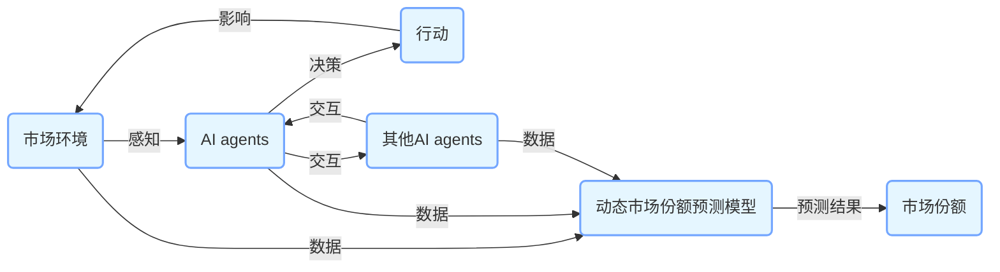

# 利用AI agents构建动态市场份额预测模型：把握竞争态势

> 关键词：AI agents、动态市场份额预测、竞争态势、预测模型、多智能体系统

> 摘要：本文聚焦于利用AI agents构建动态市场份额预测模型，以更好地把握市场竞争态势。首先介绍了相关背景知识，包括目的范围、预期读者等。接着阐述了核心概念与联系，深入讲解了AI agents和动态市场份额预测的原理及架构。通过Python源代码详细阐述了核心算法原理和具体操作步骤，并给出了相应的数学模型和公式。结合项目实战，给出代码实际案例并进行详细解释。探讨了该模型的实际应用场景，推荐了学习、开发相关的工具和资源。最后总结了未来发展趋势与挑战，还设置了附录解答常见问题，并提供了扩展阅读和参考资料，旨在为相关领域的研究者和从业者提供全面深入的技术指导。

## 1. 背景介绍 
### 1.1 目的和范围
在当今竞争激烈的商业环境中，准确预测市场份额对于企业制定战略决策、评估竞争地位至关重要。传统的市场份额预测方法往往基于静态数据和简单的统计模型，难以应对市场的动态变化和复杂的竞争关系。本研究的目的是利用AI agents构建动态市场份额预测模型，充分考虑市场中各参与者的行为和交互，实现对市场份额的实时、准确预测。

本研究的范围涵盖了从AI agents的基本概念和原理到动态市场份额预测模型的构建、实现和应用的全过程。具体包括对AI agents的建模、市场环境的模拟、多智能体系统的设计与开发，以及模型的验证和评估等方面。

### 1.2 预期读者
本文预期读者包括对人工智能、机器学习、市场分析和预测等领域感兴趣的研究人员、学者和学生，以及从事市场营销、战略规划、企业管理等工作的专业人士。通过阅读本文，读者将能够了解如何利用AI agents构建动态市场份额预测模型，掌握相关的技术和方法，并将其应用于实际的市场分析和决策中。

### 1.3 文档结构概述
本文共分为十个部分。第一部分介绍了研究的背景，包括目的和范围、预期读者、文档结构概述和术语表。第二部分阐述了核心概念与联系，包括AI agents和动态市场份额预测的原理和架构。第三部分详细讲解了核心算法原理和具体操作步骤，并给出了Python源代码示例。第四部分介绍了数学模型和公式，并通过举例进行了详细说明。第五部分结合项目实战，给出了代码实际案例并进行了详细解释。第六部分探讨了该模型的实际应用场景。第七部分推荐了学习、开发相关的工具和资源。第八部分总结了未来发展趋势与挑战。第九部分设置了附录解答常见问题。第十部分提供了扩展阅读和参考资料。

### 1.4 术语表
#### 1.4.1 核心术语定义
- **AI agents（人工智能智能体）**：是指能够感知环境、自主决策并采取行动以实现特定目标的智能实体。在本研究中，AI agents代表市场中的各个参与者，如企业、消费者等。
- **动态市场份额预测**：是指考虑市场的动态变化和各参与者的行为交互，对市场份额进行实时、准确的预测。
- **多智能体系统（Multi - Agent System，MAS）**：是由多个AI agents组成的系统，这些智能体之间可以进行通信、协作和竞争，以实现共同的或各自的目标。

#### 1.4.2 相关概念解释
- **智能体建模**：是指对AI agents的属性、行为和决策规则进行描述和定义的过程。
- **市场环境模拟**：是指对市场的各种因素，如消费者需求、产品价格、竞争策略等进行模拟和建模的过程。
- **模型验证和评估**：是指对构建的动态市场份额预测模型进行验证和评估，以确保其准确性和可靠性的过程。

#### 1.4.3 缩略词列表
- **MAS**：Multi - Agent System（多智能体系统）
- **AI**：Artificial Intelligence（人工智能）

## 2. 核心概念与联系 

### 2.1 AI agents原理
AI agents是一种具有自主性、反应性、社会性和主动性的智能实体。自主性是指AI agents能够在没有外部干预的情况下自主地感知环境、决策和行动；反应性是指AI agents能够对环境的变化做出及时的反应；社会性是指AI agents能够与其他智能体进行通信和协作；主动性是指AI agents能够主动地采取行动以实现自己的目标。

AI agents通常由感知模块、决策模块和行动模块组成。感知模块用于感知环境的信息，决策模块根据感知到的信息进行决策，行动模块根据决策结果采取相应的行动。

### 2.2 动态市场份额预测原理
动态市场份额预测是基于市场的动态变化和各参与者的行为交互进行的。市场的动态变化包括消费者需求的变化、产品价格的波动、竞争策略的调整等。各参与者的行为交互包括企业之间的竞争、合作，消费者的购买决策等。

动态市场份额预测模型通过对市场环境的模拟和AI agents的建模，来预测市场份额的变化。模型需要考虑各种因素的影响，如产品质量、价格、品牌形象、促销活动等。

### 2.3 核心概念架构示意图

该示意图展示了市场环境、AI agents、动态市场份额预测模型和市场份额之间的关系。市场环境的信息被AI agents感知，AI agents根据这些信息进行决策和行动，行动又会影响市场环境。AI agents之间也会进行交互。所有这些信息都被输入到动态市场份额预测模型中，模型输出市场份额的预测结果。

## 3. 核心算法原理 & 具体操作步骤 

### 3.1 核心算法原理
本研究采用基于强化学习的方法来训练AI agents。强化学习是一种通过智能体与环境进行交互，不断尝试不同的行动并根据行动的结果获得奖励或惩罚，从而学习到最优策略的机器学习方法。

在动态市场份额预测模型中，AI agents（如企业）的目标是最大化自己的市场份额。AI agents根据当前的市场环境（如消费者需求、竞争对手的策略等）选择行动（如调整产品价格、进行促销活动等），行动会影响市场环境和其他AI agents，同时AI agents会根据行动的结果获得相应的奖励（如市场份额的增加）或惩罚（如市场份额的减少）。通过不断地与环境进行交互，AI agents学习到最优的行动策略，从而实现市场份额的最大化。

### 3.2 具体操作步骤

#### 3.2.1 环境建模
首先，需要对市场环境进行建模。市场环境包括消费者需求、产品价格、竞争策略等因素。可以使用数学模型或数据驱动的方法来描述这些因素。例如，可以使用线性回归模型来描述消费者需求与产品价格之间的关系。

#### 3.2.2 AI agents建模
然后，对AI agents进行建模。AI agents的属性包括产品质量、品牌形象等，行为包括调整产品价格、进行促销活动等。AI agents的决策规则可以使用强化学习算法来定义。

#### 3.2.3 多智能体系统设计
设计多智能体系统，定义AI agents之间的通信和交互规则。例如，AI agents可以通过交换信息来了解竞争对手的策略。

#### 3.2.4 模型训练
使用强化学习算法对AI agents进行训练。在训练过程中，AI agents不断地与环境进行交互，根据行动的结果更新自己的策略。

#### 3.2.5 模型评估
对训练好的模型进行评估，使用测试数据来验证模型的准确性和可靠性。

### 3.3 Python源代码示例
```python
import numpy as np
import random

# 定义市场环境类
class MarketEnvironment:
    def __init__(self, num_agents, demand_factor=100, price_sensitivity=0.5):
        self.num_agents = num_agents
        self.demand_factor = demand_factor
        self.price_sensitivity = price_sensitivity
        self.agent_prices = [random.uniform(10, 50) for _ in range(num_agents)]

    def get_demand(self, agent_id):
        total_price = sum(self.agent_prices)
        demand = self.demand_factor - self.price_sensitivity * self.agent_prices[agent_id]
        return demand

    def update_prices(self, agent_id, new_price):
        self.agent_prices[agent_id] = new_price

# 定义AI agents类
class Agent:
    def __init__(self, agent_id, learning_rate=0.1, discount_factor=0.9):
        self.agent_id = agent_id
        self.learning_rate = learning_rate
        self.discount_factor = discount_factor
        self.q_table = {}

    def choose_action(self, state):
        if state not in self.q_table:
            self.q_table[state] = [0 for _ in range(10)]  # 假设有10个可能的价格调整动作
        actions = self.q_table[state]
        max_action_value = max(actions)
        max_actions = [i for i, value in enumerate(actions) if value == max_action_value]
        return random.choice(max_actions)

    def update_q_table(self, state, action, reward, next_state):
        if state not in self.q_table:
            self.q_table[state] = [0 for _ in range(10)]
        if next_state not in self.q_table:
            self.q_table[next_state] = [0 for _ in range(10)]
        max_next_action_value = max(self.q_table[next_state])
        current_q_value = self.q_table[state][action]
        new_q_value = current_q_value + self.learning_rate * (reward + self.discount_factor * max_next_action_value - current_q_value)
        self.q_table[state][action] = new_q_value

# 训练模型
num_agents = 3
market_env = MarketEnvironment(num_agents)
agents = [Agent(i) for i in range(num_agents)]

num_episodes = 1000
for episode in range(num_episodes):
    for agent in agents:
        current_state = tuple(market_env.agent_prices)
        action = agent.choose_action(current_state)
        new_price = market_env.agent_prices[agent.agent_id] + (action - 5)  # 价格调整范围
        market_env.update_prices(agent.agent_id, new_price)
        demand = market_env.get_demand(agent.agent_id)
        reward = demand  # 奖励为需求
        next_state = tuple(market_env.agent_prices)
        agent.update_q_table(current_state, action, reward, next_state)
```
在上述代码中，首先定义了市场环境类`MarketEnvironment`，用于模拟市场环境，包括消费者需求和产品价格的计算。然后定义了AI agents类`Agent`，使用Q - learning算法来更新Q表。最后进行模型训练，AI agents不断地与环境进行交互，根据行动的结果更新自己的Q表。

## 4. 数学模型和公式 & 详细讲解 & 举例说明 

### 4.1 强化学习数学模型
在强化学习中，智能体与环境的交互可以用马尔可夫决策过程（Markov Decision Process，MDP）来描述。MDP由一个四元组 $(S, A, P, R)$ 组成，其中：
- $S$ 是状态空间，表示环境的所有可能状态。
- $A$ 是动作空间，表示智能体可以采取的所有可能动作。
- $P$ 是状态转移概率函数，$P(s'|s, a)$ 表示在状态 $s$ 下采取动作 $a$ 后转移到状态 $s'$ 的概率。
- $R$ 是奖励函数，$R(s, a, s')$ 表示在状态 $s$ 下采取动作 $a$ 转移到状态 $s'$ 时获得的奖励。

智能体的目标是找到一个最优策略 $\pi^*: S \to A$，使得长期累积奖励最大化。长期累积奖励可以用折扣累积奖励来表示：
$$G_t = \sum_{k = 0}^{\infty} \gamma^k R_{t + k + 1}$$
其中，$\gamma \in [0, 1]$ 是折扣因子，$R_{t + k + 1}$ 是在时刻 $t + k + 1$ 获得的奖励。

### 4.2 Q - learning算法公式
Q - learning算法是一种无模型的强化学习算法，通过学习动作价值函数 $Q(s, a)$ 来找到最优策略。动作价值函数 $Q(s, a)$ 表示在状态 $s$ 下采取动作 $a$ 后获得的长期累积奖励的期望值。

Q - learning算法的更新公式为：
$$Q(s_t, a_t) \leftarrow Q(s_t, a_t) + \alpha [R_{t + 1} + \gamma \max_{a} Q(s_{t + 1}, a) - Q(s_t, a_t)]$$
其中，$\alpha$ 是学习率，$R_{t + 1}$ 是在时刻 $t + 1$ 获得的奖励，$\gamma$ 是折扣因子。

### 4.3 举例说明
假设市场环境中有两个企业（AI agents），每个企业可以选择三种价格策略：低价、中价、高价。状态空间 $S$ 可以表示为两个企业的价格组合，例如 $(低价, 中价)$。动作空间 $A$ 是每个企业可以选择的价格策略。

初始时，两个企业的价格都为中价，即状态 $s_0 = (中价, 中价)$。企业1选择了低价策略，即动作 $a_0 = 低价$。由于企业1降低了价格，其市场需求增加，获得了奖励 $R_1 = 10$。此时，状态转移到 $s_1 = (低价, 中价)$。

根据Q - learning算法的更新公式，企业1更新其Q表中的 $Q(s_0, a_0)$ 值：
假设学习率 $\alpha = 0.1$，折扣因子 $\gamma = 0.9$，$Q(s_0, a_0)$ 的初始值为0，$\max_{a} Q(s_1, a)$ 的值为5。
则 $Q(s_0, a_0) = 0 + 0.1\times[10 + 0.9\times5 - 0]= 0 + 0.1\times(10 + 4.5)= 1.45$

通过不断地与环境进行交互，企业可以学习到最优的价格策略，从而最大化自己的市场份额。

## 5. 项目实战：代码实际案例和详细解释说明 

### 5.1  开发环境搭建
#### 5.1.1 安装Python
首先，需要安装Python。可以从Python官方网站（https://www.python.org/downloads/） 下载适合自己操作系统的Python版本。建议安装Python 3.6及以上版本。

#### 5.1.2 安装必要的库
在本项目中，需要使用`numpy`库进行数值计算。可以使用以下命令安装`numpy`库：
```sh
pip install numpy
```

### 5.2  源代码详细实现和代码解读
```python
import numpy as np
import random

# 定义市场环境类
class MarketEnvironment:
    def __init__(self, num_agents, demand_factor=100, price_sensitivity=0.5):
        """
        初始化市场环境
        :param num_agents: 智能体（企业）的数量
        :param demand_factor: 需求因子
        :param price_sensitivity: 价格敏感度
        """
        self.num_agents = num_agents
        self.demand_factor = demand_factor
        self.price_sensitivity = price_sensitivity
        self.agent_prices = [random.uniform(10, 50) for _ in range(num_agents)]

    def get_demand(self, agent_id):
        """
        计算指定智能体的需求
        :param agent_id: 智能体的ID
        :return: 需求值
        """
        total_price = sum(self.agent_prices)
        demand = self.demand_factor - self.price_sensitivity * self.agent_prices[agent_id]
        return demand

    def update_prices(self, agent_id, new_price):
        """
        更新指定智能体的价格
        :param agent_id: 智能体的ID
        :param new_price: 新的价格
        """
        self.agent_prices[agent_id] = new_price

# 定义AI agents类
class Agent:
    def __init__(self, agent_id, learning_rate=0.1, discount_factor=0.9):
        """
        初始化AI智能体
        :param agent_id: 智能体的ID
        :param learning_rate: 学习率
        :param discount_factor: 折扣因子
        """
        self.agent_id = agent_id
        self.learning_rate = learning_rate
        self.discount_factor = discount_factor
        self.q_table = {}

    def choose_action(self, state):
        """
        根据当前状态选择动作
        :param state: 当前状态
        :return: 选择的动作
        """
        if state not in self.q_table:
            self.q_table[state] = [0 for _ in range(10)]  # 假设有10个可能的价格调整动作
        actions = self.q_table[state]
        max_action_value = max(actions)
        max_actions = [i for i, value in enumerate(actions) if value == max_action_value]
        return random.choice(max_actions)

    def update_q_table(self, state, action, reward, next_state):
        """
        更新Q表
        :param state: 当前状态
        :param action: 选择的动作
        :param reward: 获得的奖励
        :param next_state: 下一个状态
        """
        if state not in self.q_table:
            self.q_table[state] = [0 for _ in range(10)]
        if next_state not in self.q_table:
            self.q_table[next_state] = [0 for _ in range(10)]
        max_next_action_value = max(self.q_table[next_state])
        current_q_value = self.q_table[state][action]
        new_q_value = current_q_value + self.learning_rate * (reward + self.discount_factor * max_next_action_value - current_q_value)
        self.q_table[state][action] = new_q_value

# 训练模型
num_agents = 3
market_env = MarketEnvironment(num_agents)
agents = [Agent(i) for i in range(num_agents)]

num_episodes = 1000
for episode in range(num_episodes):
    for agent in agents:
        current_state = tuple(market_env.agent_prices)
        action = agent.choose_action(current_state)
        new_price = market_env.agent_prices[agent.agent_id] + (action - 5)  # 价格调整范围
        market_env.update_prices(agent.agent_id, new_price)
        demand = market_env.get_demand(agent.agent_id)
        reward = demand  # 奖励为需求
        next_state = tuple(market_env.agent_prices)
        agent.update_q_table(current_state, action, reward, next_state)
```
### 5.3  代码解读与分析
#### 5.3.1 市场环境类`MarketEnvironment`
- `__init__`方法：初始化市场环境，包括智能体的数量、需求因子、价格敏感度和每个智能体的初始价格。
- `get_demand`方法：根据当前的价格计算指定智能体的需求。需求与价格成反比，价格越高，需求越低。
- `update_prices`方法：更新指定智能体的价格。

#### 5.3.2 AI agents类`Agent`
- `__init__`方法：初始化AI智能体，包括智能体的ID、学习率、折扣因子和Q表。
- `choose_action`方法：根据当前状态选择动作。如果当前状态不在Q表中，则初始化Q表。选择Q值最大的动作，如果有多个最大Q值的动作，则随机选择一个。
- `update_q_table`方法：根据Q - learning算法的更新公式更新Q表。

#### 5.3.3 训练过程
在训练过程中，每个智能体不断地与环境进行交互。首先获取当前状态，然后选择动作，根据动作更新价格，计算需求作为奖励，获取下一个状态，最后更新Q表。通过多次迭代，智能体学习到最优的价格策略，从而最大化自己的市场份额。

## 6. 实际应用场景 
### 6.1 企业战略规划
企业可以利用动态市场份额预测模型来制定战略规划。通过预测不同竞争策略下的市场份额变化，企业可以选择最优的策略，如产品定价、市场推广、新产品研发等。例如，企业可以模拟不同价格策略下的市场份额变化，选择能够最大化市场份额和利润的价格。

### 6.2 市场竞争分析
动态市场份额预测模型可以帮助企业分析市场竞争态势。企业可以通过模型了解竞争对手的策略和市场份额变化，及时调整自己的策略。例如，当竞争对手推出新产品或进行价格调整时，企业可以利用模型预测自己的市场份额变化，从而采取相应的措施。

### 6.3 投资决策
投资者可以利用动态市场份额预测模型来评估企业的竞争力和发展潜力。通过预测企业的市场份额变化，投资者可以判断企业的未来盈利能力，从而做出投资决策。例如，如果一个企业的市场份额呈上升趋势，那么投资者可能会认为该企业具有较好的发展前景，从而选择投资该企业。

### 6.4 政策制定
政府部门可以利用动态市场份额预测模型来制定相关政策。例如，在反垄断政策制定中，模型可以帮助政府部门了解市场竞争格局，判断企业是否存在垄断行为。在产业政策制定中，模型可以帮助政府部门预测不同政策措施对市场份额和产业发展的影响，从而制定出更加有效的政策。

## 7. 工具和资源推荐
### 7.1 学习资源推荐
#### 7.1.1 书籍推荐
- 《人工智能：一种现代的方法》（Artificial Intelligence: A Modern Approach）：这本书是人工智能领域的经典教材，全面介绍了人工智能的基本概念、算法和应用。
- 《强化学习：原理与Python实现》（Reinforcement Learning: An Introduction）：这本书是强化学习领域的经典著作，详细介绍了强化学习的原理和算法，并给出了Python实现示例。
- 《多智能体系统：算法、博弈论与应用》（Multi - Agent Systems: Algorithmic, Game - Theoretic, and Logical Foundations）：这本书深入介绍了多智能体系统的理论和应用，包括智能体建模、通信、协作和竞争等方面。

#### 7.1.2 在线课程
- Coursera上的“人工智能基础”（Foundations of Artificial Intelligence）课程：该课程由斯坦福大学教授讲授，系统地介绍了人工智能的基本概念和算法。
- edX上的“强化学习”（Reinforcement Learning）课程：该课程由伯克利大学教授讲授，深入讲解了强化学习的原理和应用。
- Udemy上的“多智能体系统开发”（Multi - Agent System Development）课程：该课程通过实际项目介绍了多智能体系统的开发方法和技术。

#### 7.1.3 技术博客和网站
- Medium上的人工智能和强化学习相关博客：Medium上有很多人工智能和强化学习领域的优秀博客，作者们分享了自己的研究成果和实践经验。
- OpenAI官方网站：OpenAI是人工智能领域的知名研究机构，其官方网站上发布了很多关于人工智能和强化学习的最新研究成果和技术文章。
- AI Stack Exchange：这是一个人工智能领域的问答社区，用户可以在这里提问、交流和分享关于人工智能和强化学习的知识和经验。

### 7.2 开发工具框架推荐
#### 7.2.1 IDE和编辑器
- PyCharm：是一款专业的Python集成开发环境，具有代码编辑、调试、自动补全、代码分析等功能，非常适合Python开发。
- Visual Studio Code：是一款轻量级的代码编辑器，支持多种编程语言，通过安装Python扩展可以实现Python开发的各种功能。

#### 7.2.2 调试和性能分析工具
- pdb：是Python自带的调试工具，可以帮助开发者调试Python代码，查找和修复代码中的错误。
- cProfile：是Python的性能分析工具，可以帮助开发者分析代码的性能瓶颈，优化代码性能。

#### 7.2.3 相关框架和库
- Gym：是OpenAI开发的强化学习环境库，提供了各种模拟环境，方便开发者进行强化学习算法的开发和测试。
- Stable Baselines：是一个基于OpenAI Gym的强化学习库，提供了多种预训练的强化学习算法，方便开发者快速实现强化学习应用。
- Mesa：是一个用于开发多智能体系统的Python库，提供了智能体建模、环境模拟、交互规则定义等功能，方便开发者开发多智能体系统。

### 7.3 相关论文著作推荐
#### 7.3.1 经典论文
- “Reinforcement Learning: A Survey”：这篇论文是强化学习领域的经典综述论文，全面介绍了强化学习的发展历程、基本概念、算法和应用。
- “Multi - Agent Systems: A Modern Approach to Distributed Artificial Intelligence”：这篇论文是多智能体系统领域的经典论文，介绍了多智能体系统的基本概念、体系结构和应用。

#### 7.3.2 最新研究成果
- 可以关注NeurIPS（神经信息处理系统大会）、ICML（国际机器学习会议）、AAAI（美国人工智能协会会议）等顶级人工智能会议上的最新研究成果，这些会议上发表的论文代表了人工智能和强化学习领域的最新研究进展。

#### 7.3.3 应用案例分析
- 可以参考一些实际应用案例分析的论文，如“Using Multi - Agent Systems for Market Simulation and Prediction”等，这些论文介绍了如何利用多智能体系统进行市场模拟和预测的实际应用案例。

## 8. 总结：未来发展趋势与挑战
### 8.1 未来发展趋势
#### 8.1.1 融合多种人工智能技术
未来的动态市场份额预测模型将融合多种人工智能技术，如深度学习、自然语言处理等。深度学习可以用于处理复杂的市场数据，如文本、图像等，提高模型的预测准确性。自然语言处理可以用于分析市场新闻、社交媒体等文本数据，获取市场的实时信息和趋势。

#### 8.1.2 考虑更多的市场因素
未来的模型将考虑更多的市场因素，如消费者的情感、行为习惯、社会文化等。这些因素对市场份额的影响非常重要，考虑这些因素可以提高模型的预测精度和可靠性。

#### 8.1.3 实现实时预测和决策
随着技术的发展，未来的模型将实现实时预测和决策。通过实时获取市场数据，模型可以及时调整预测结果和决策策略，帮助企业更好地应对市场变化。

#### 8.1.4 跨领域应用
动态市场份额预测模型将在更多的领域得到应用，如金融、医疗、能源等。不同领域的市场环境和竞争关系各不相同，需要对模型进行相应的调整和优化，以适应不同领域的需求。

### 8.2 挑战
#### 8.2.1 数据质量和获取
动态市场份额预测模型需要大量的高质量数据来训练和验证。然而，市场数据往往存在噪声、缺失值等问题，数据的获取也面临着隐私保护、数据安全等挑战。因此，如何提高数据质量和获取数据是一个重要的挑战。

#### 8.2.2 模型复杂度和可解释性
随着模型融合多种人工智能技术和考虑更多的市场因素，模型的复杂度会不断增加。复杂的模型虽然可以提高预测准确性，但也会降低模型的可解释性。如何在提高模型准确性的同时保持模型的可解释性是一个需要解决的问题。

#### 8.2.3 多智能体系统的协调和管理
在多智能体系统中，智能体之间的协调和管理是一个挑战。智能体之间可能存在利益冲突、信息不对称等问题，如何设计有效的协调机制和管理策略，确保智能体之间的协作和竞争关系合理有序，是一个需要深入研究的问题。

#### 8.2.4 模型的泛化能力
不同的市场环境和竞争关系各不相同，模型需要具有良好的泛化能力，能够在不同的场景下都能取得较好的预测效果。如何提高模型的泛化能力，使其能够适应不同的市场环境和竞争关系，是一个重要的挑战。

## 9. 附录：常见问题与解答
### 9.1 如何选择合适的强化学习算法？
选择合适的强化学习算法需要考虑多个因素，如问题的复杂度、数据的规模、计算资源等。对于简单的问题，可以选择Q - learning、SARSA等算法；对于复杂的问题，可以选择深度强化学习算法，如DQN、A2C、PPO等。此外，还可以参考相关的研究文献和实验结果，选择在类似问题中表现较好的算法。

### 9.2 如何评估动态市场份额预测模型的准确性？
可以使用多种指标来评估动态市场份额预测模型的准确性，如均方误差（MSE）、平均绝对误差（MAE）、决定系数（$R^2$）等。这些指标可以衡量模型预测值与实际值之间的差异。此外，还可以进行交叉验证、留出法等实验，将数据集分为训练集和测试集，在测试集上评估模型的性能。

### 9.3 如何处理市场数据中的噪声和缺失值？
处理市场数据中的噪声和缺失值可以采用多种方法。对于噪声数据，可以使用滤波、平滑等方法进行处理，如移动平均滤波、高斯滤波等。对于缺失值，可以采用插值、填充等方法进行处理，如线性插值、均值填充等。此外，还可以使用机器学习算法来预测缺失值，如决策树、随机森林等。

### 9.4 如何提高多智能体系统中智能体之间的协作效率？
提高多智能体系统中智能体之间的协作效率可以从多个方面入手。首先，可以设计合理的通信机制，确保智能体之间能够及时、准确地交换信息。其次，可以设计有效的奖励机制，鼓励智能体之间进行协作。此外，还可以采用分布式优化算法，如分布式梯度下降算法，来协调智能体之间的行为。

## 10. 扩展阅读 & 参考资料
### 10.1 扩展阅读
- 《深度学习》（Deep Learning）：这本书是深度学习领域的经典著作，深入介绍了深度学习的原理、算法和应用。
- 《数据挖掘：概念与技术》（Data Mining: Concepts and Techniques）：这本书全面介绍了数据挖掘的基本概念、算法和应用，对于处理市场数据有很大的帮助。
- 《博弈论与经济行为》（Theory of Games and Economic Behavior）：这本书是博弈论领域的经典著作，对于理解多智能体系统中智能体之间的竞争和协作关系有很大的帮助。

### 10.2 参考资料
- Sutton, R. S., & Barto, A. G. (2018). Reinforcement Learning: An Introduction. MIT press.
- Wooldridge, M. (2009). An Introduction to Multi - Agent Systems. John Wiley & Sons.
- Goodfellow, I. J., Bengio, Y., & Courville, A. (2016). Deep Learning. MIT press.