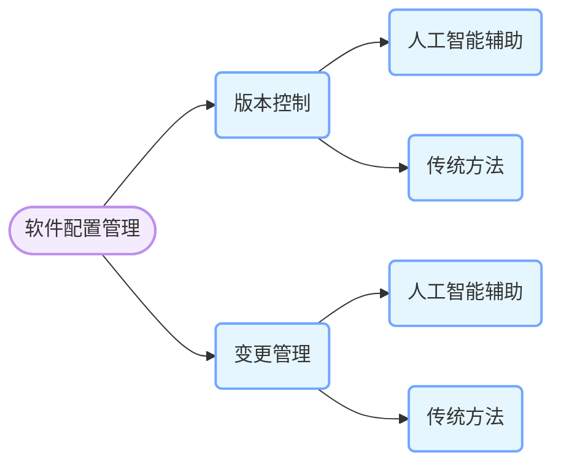

# 利用人工智能进行软件配置管理

> 关键词：人工智能、软件配置管理、版本控制、变更管理、自动化、机器学习

> 摘要：本文深入探讨了利用人工智能进行软件配置管理的相关内容。首先介绍了软件配置管理的背景知识，包括其目的、范围、预期读者和文档结构等。接着阐述了人工智能与软件配置管理相关的核心概念及联系，通过文本示意图和 Mermaid 流程图进行清晰展示。详细讲解了核心算法原理，并使用 Python 源代码进行说明。同时给出了相关的数学模型和公式，并举例解释。在项目实战部分，提供了开发环境搭建、源代码实现及解读。还介绍了人工智能在软件配置管理中的实际应用场景，推荐了学习资源、开发工具框架和相关论文著作。最后总结了未来发展趋势与挑战，解答了常见问题，并提供了扩展阅读和参考资料。

## 1. 背景介绍 
### 1.1 目的和范围
软件配置管理（Software Configuration Management，SCM）是确保软件系统在其整个生命周期内的完整性、一致性和可追溯性的过程。传统的软件配置管理方法虽然在一定程度上满足了需求，但随着软件系统的复杂性不断增加，开发团队规模的扩大以及开发周期的缩短，传统方法面临着诸多挑战。

利用人工智能进行软件配置管理的目的在于提高软件配置管理的效率和准确性，减少人为错误，实现自动化的配置管理任务。具体范围包括版本控制、变更管理、构建管理、发布管理等方面。通过人工智能技术，可以更好地预测变更的影响，优化版本控制策略，提高软件构建和发布的成功率。

### 1.2 预期读者
本文的预期读者包括软件开发者、软件项目经理、软件测试人员、软件配置管理人员以及对人工智能和软件配置管理感兴趣的研究人员。对于软件开发者来说，了解如何利用人工智能进行软件配置管理可以提高开发效率，减少代码冲突。软件项目经理可以借助人工智能技术更好地规划项目进度，控制项目风险。软件测试人员可以利用人工智能辅助进行测试用例的生成和执行。软件配置管理人员则可以通过人工智能实现更高效的配置管理流程。研究人员可以从本文中获取相关的研究思路和技术方法。

### 1.3 文档结构概述
本文将按照以下结构进行组织：
- 核心概念与联系：介绍人工智能与软件配置管理相关的核心概念，通过文本示意图和 Mermaid 流程图展示它们之间的联系。
- 核心算法原理 & 具体操作步骤：详细讲解利用人工智能进行软件配置管理的核心算法原理，并使用 Python 源代码进行说明。
- 数学模型和公式 & 详细讲解 & 举例说明：给出相关的数学模型和公式，并通过具体例子进行解释。
- 项目实战：代码实际案例和详细解释说明，包括开发环境搭建、源代码实现和代码解读。
- 实际应用场景：介绍人工智能在软件配置管理中的实际应用场景。
- 工具和资源推荐：推荐学习资源、开发工具框架和相关论文著作。
- 总结：未来发展趋势与挑战：总结利用人工智能进行软件配置管理的未来发展趋势和面临的挑战。
- 附录：常见问题与解答：解答读者可能遇到的常见问题。
- 扩展阅读 & 参考资料：提供相关的扩展阅读和参考资料。

### 1.4 术语表
#### 1.4.1 核心术语定义
- **软件配置管理（SCM）**：是一种跟踪和控制软件系统的配置项（如代码、文档、数据等）的方法，确保软件系统在整个生命周期内的完整性、一致性和可追溯性。
- **人工智能（AI）**：是研究、开发用于模拟、延伸和扩展人的智能的理论、方法、技术及应用系统的一门新的技术科学。
- **版本控制**：是软件配置管理的重要组成部分，用于记录软件配置项的不同版本，以便在需要时可以恢复到以前的版本。
- **变更管理**：是对软件系统中的变更进行管理的过程，包括变更的请求、评估、批准、实施和验证等环节。
- **机器学习（ML）**：是人工智能的一个分支，它允许计算机通过数据学习模式和规律，而无需明确编程。

#### 1.4.2 相关概念解释
- **配置项**：是软件系统中可识别的、可管理的组成部分，如源代码文件、文档、测试用例等。
- **基线**：是软件配置管理中的一个重要概念，它是软件配置项在某个特定时间点的一个稳定版本，作为后续开发和变更的基础。
- **软件构建**：是将源代码转换为可执行软件的过程，包括编译、链接、打包等步骤。
- **软件发布**：是将软件的一个版本提供给用户使用的过程，包括部署、安装、测试等环节。

#### 1.4.3 缩略词列表
- **SCM**：Software Configuration Management（软件配置管理）
- **AI**：Artificial Intelligence（人工智能）
- **ML**：Machine Learning（机器学习）
- **VCS**：Version Control System（版本控制系统）

## 2. 核心概念与联系 

### 核心概念原理
在利用人工智能进行软件配置管理中，主要涉及到以下几个核心概念：

#### 人工智能与软件配置管理的结合
人工智能技术可以应用于软件配置管理的各个环节，通过对大量的软件配置数据进行分析和学习，实现自动化的决策和操作。例如，利用机器学习算法可以预测变更的影响范围，帮助开发团队更好地评估变更的风险。

#### 版本控制与人工智能
版本控制系统（VCS）是软件配置管理的基础，它记录了软件配置项的历史版本。人工智能可以与 VCS 相结合，通过分析版本历史数据，发现代码变更的模式和规律，从而优化版本控制策略。例如，利用聚类算法可以将相似的代码变更分组，方便开发人员进行管理。

#### 变更管理与人工智能
变更管理是软件配置管理的关键环节，它确保软件系统的变更得到有效的控制和管理。人工智能可以帮助识别变更的类型和影响，自动评估变更的风险，并提供相应的建议。例如，利用自然语言处理技术可以分析变更请求的文本内容，提取关键信息，辅助进行变更评估。

### 架构的文本示意图
```plaintext
                          软件配置管理
                              |
           +------------------+------------------+
           |                                  |
       版本控制                          变更管理
           |                                  |
    +------+------+                    +------+------+
    |             |                    |             |
人工智能辅助      传统方法              人工智能辅助      传统方法
```

### Mermaid 流程图


## 3. 核心算法原理 & 具体操作步骤 

### 核心算法原理
在利用人工智能进行软件配置管理中，常用的算法包括机器学习算法和自然语言处理算法。下面以机器学习中的决策树算法为例，介绍如何利用该算法进行变更风险评估。

决策树算法是一种基于树结构进行决策的算法，它通过对训练数据进行学习，构建一棵决策树，用于对新的数据进行分类或预测。在变更风险评估中，决策树可以根据变更的特征（如变更的代码行数、变更的模块、变更的时间等）预测变更的风险等级（如高风险、中风险、低风险）。

### 具体操作步骤
#### 步骤 1：数据收集
收集软件配置管理中的相关数据，包括变更请求、变更记录、版本历史等。这些数据将作为训练数据用于决策树算法的学习。

#### 步骤 2：数据预处理
对收集到的数据进行预处理，包括数据清洗、特征提取和数据转换等。例如，将变更请求的文本内容进行分词处理，提取关键特征；将变更的时间转换为数值特征。

#### 步骤 3：模型训练
使用预处理后的数据对决策树模型进行训练。在 Python 中，可以使用 `scikit-learn` 库来实现决策树模型的训练。

#### 步骤 4：模型评估
使用测试数据对训练好的决策树模型进行评估，计算模型的准确率、召回率等指标，评估模型的性能。

#### 步骤 5：模型应用
将训练好的决策树模型应用于实际的变更风险评估中，根据变更的特征预测变更的风险等级。

### Python 源代码实现
```python
import pandas as pd
from sklearn.model_selection import train_test_split
from sklearn.tree import DecisionTreeClassifier
from sklearn.metrics import accuracy_score

# 步骤 1：数据收集
# 假设我们已经收集到了变更数据，存储在 CSV 文件中
data = pd.read_csv('change_data.csv')

# 步骤 2：数据预处理
# 提取特征和标签
X = data.drop('risk_level', axis=1)
y = data['risk_level']

# 划分训练集和测试集
X_train, X_test, y_train, y_test = train_test_split(X, y, test_size=0.2, random_state=42)

# 步骤 3：模型训练
# 创建决策树分类器
clf = DecisionTreeClassifier()
# 训练模型
clf.fit(X_train, y_train)

# 步骤 4：模型评估
# 预测测试集
y_pred = clf.predict(X_test)
# 计算准确率
accuracy = accuracy_score(y_test, y_pred)
print(f"模型准确率: {accuracy}")

# 步骤 5：模型应用
# 假设我们有一个新的变更数据
new_change = pd.DataFrame({
    'code_lines': [100],
    'module': [2],
    'time': [3]
})
# 预测新变更的风险等级
risk_level = clf.predict(new_change)
print(f"新变更的风险等级: {risk_level[0]}")
```

## 4. 数学模型和公式 & 详细讲解 & 举例说明 

### 决策树算法的数学模型
决策树算法的核心是信息熵和信息增益。信息熵是衡量数据不确定性的指标，信息增益是衡量特征对分类的重要性的指标。

#### 信息熵
信息熵的计算公式为：
$$H(X) = -\sum_{i=1}^{n} p(x_i) \log_2 p(x_i)$$
其中，$X$ 是一个随机变量，$p(x_i)$ 是 $X$ 取值为 $x_i$ 的概率，$n$ 是 $X$ 的取值个数。

#### 信息增益
信息增益的计算公式为：
$$IG(X, Y) = H(X) - H(X|Y)$$
其中，$IG(X, Y)$ 是特征 $Y$ 对随机变量 $X$ 的信息增益，$H(X)$ 是 $X$ 的信息熵，$H(X|Y)$ 是在已知特征 $Y$ 的条件下 $X$ 的条件熵。

### 详细讲解
决策树算法的基本思想是通过选择信息增益最大的特征作为节点，将数据集划分为不同的子集，直到子集中的数据属于同一类别或达到一定的停止条件。

在变更风险评估中，我们可以将变更的特征（如代码行数、变更的模块、变更的时间等）作为特征 $Y$，将变更的风险等级作为随机变量 $X$。通过计算每个特征的信息增益，选择信息增益最大的特征作为决策树的根节点，然后递归地构建决策树。

### 举例说明
假设我们有一个变更数据集，包含以下特征和标签：
| 代码行数 | 变更模块 | 变更时间 | 风险等级 |
|----------|----------|----------|----------|
| 50       | 1        | 1        | 低风险   |
| 100      | 2        | 2        | 中风险   |
| 200      | 3        | 3        | 高风险   |
| 80       | 1        | 2        | 中风险   |

首先，计算风险等级的信息熵：
$$H(X) = -\left(\frac{1}{4} \log_2 \frac{1}{4} + \frac{2}{4} \log_2 \frac{2}{4} + \frac{1}{4} \log_2 \frac{1}{4}\right) \approx 1.5$$

然后，计算每个特征的信息增益。以代码行数为例，假设我们将代码行数划分为两个区间：$[0, 100)$ 和 $[100, +\infty)$。
- 在 $[0, 100)$ 区间内，有 2 个低风险和 1 个中风险，信息熵为：
$$H(X_1) = -\left(\frac{2}{3} \log_2 \frac{2}{3} + \frac{1}{3} \log_2 \frac{1}{3}\right) \approx 0.92$$
- 在 $[100, +\infty)$ 区间内，有 1 个高风险和 1 个中风险，信息熵为：
$$H(X_2) = -\left(\frac{1}{2} \log_2 \frac{1}{2} + \frac{1}{2} \log_2 \frac{1}{2}\right) = 1$$
- 代码行数的条件熵为：
$$H(X|代码行数) = \frac{3}{4} H(X_1) + \frac{1}{4} H(X_2) \approx 0.94$$
- 代码行数的信息增益为：
$$IG(X, 代码行数) = H(X) - H(X|代码行数) \approx 1.5 - 0.94 = 0.56$$

同理，可以计算其他特征的信息增益，选择信息增益最大的特征作为决策树的根节点。

## 5. 项目实战：代码实际案例和详细解释说明 

### 5.1  开发环境搭建
#### 操作系统
可以选择 Windows、Linux 或 macOS 操作系统。

#### Python 环境
安装 Python 3.6 及以上版本。可以从 Python 官方网站（https://www.python.org/downloads/）下载并安装。

#### 第三方库
安装 `pandas`、`scikit-learn` 等第三方库。可以使用以下命令进行安装：
```sh
pip install pandas scikit-learn
```

### 5.2  源代码详细实现和代码解读
```python
import pandas as pd
from sklearn.model_selection import train_test_split
from sklearn.tree import DecisionTreeClassifier
from sklearn.metrics import accuracy_score

# 步骤 1：数据收集
# 假设我们已经收集到了变更数据，存储在 CSV 文件中
data = pd.read_csv('change_data.csv')

# 步骤 2：数据预处理
# 提取特征和标签
X = data.drop('risk_level', axis=1)
y = data['risk_level']

# 划分训练集和测试集
X_train, X_test, y_train, y_test = train_test_split(X, y, test_size=0.2, random_state=42)

# 步骤 3：模型训练
# 创建决策树分类器
clf = DecisionTreeClassifier()
# 训练模型
clf.fit(X_train, y_train)

# 步骤 4：模型评估
# 预测测试集
y_pred = clf.predict(X_test)
# 计算准确率
accuracy = accuracy_score(y_test, y_pred)
print(f"模型准确率: {accuracy}")

# 步骤 5：模型应用
# 假设我们有一个新的变更数据
new_change = pd.DataFrame({
    'code_lines': [100],
    'module': [2],
    'time': [3]
})
# 预测新变更的风险等级
risk_level = clf.predict(new_change)
print(f"新变更的风险等级: {risk_level[0]}")
```

### 代码解读与分析
- **数据收集**：使用 `pandas` 库的 `read_csv` 函数从 CSV 文件中读取变更数据。
- **数据预处理**：使用 `drop` 方法提取特征和标签，使用 `train_test_split` 函数将数据集划分为训练集和测试集。
- **模型训练**：创建 `DecisionTreeClassifier` 类的实例，使用 `fit` 方法对模型进行训练。
- **模型评估**：使用 `predict` 方法对测试集进行预测，使用 `accuracy_score` 函数计算模型的准确率。
- **模型应用**：创建一个新的变更数据，使用 `predict` 方法预测新变更的风险等级。

## 6. 实际应用场景 
### 变更风险评估
利用人工智能算法可以对软件变更的风险进行评估，帮助开发团队提前发现潜在的问题。例如，通过分析变更的代码行数、变更的模块、变更的时间等特征，预测变更的风险等级，从而决定是否需要进行更严格的测试或审核。

### 版本控制优化
人工智能可以分析版本历史数据，发现代码变更的模式和规律，从而优化版本控制策略。例如，通过聚类算法将相似的代码变更分组，方便开发人员进行管理；通过预测代码冲突的可能性，提前采取措施避免冲突的发生。

### 自动化构建和部署
人工智能可以根据软件的配置信息和历史数据，自动选择最佳的构建和部署策略。例如，根据代码的变更情况和服务器的负载情况，自动选择合适的构建工具和部署环境，提高构建和部署的效率和成功率。

### 缺陷预测
利用机器学习算法可以对软件中的缺陷进行预测，帮助开发团队提前发现潜在的缺陷。例如，通过分析代码的复杂度、变更频率等特征，预测代码中可能存在的缺陷，从而及时进行修复。

## 7. 工具和资源推荐
### 7.1 学习资源推荐
#### 7.1.1 书籍推荐
- 《Python 机器学习》：本书介绍了 Python 在机器学习中的应用，包括数据预处理、模型选择、评估和调优等内容。
- 《人工智能：一种现代的方法》：本书是人工智能领域的经典教材，全面介绍了人工智能的各个方面，包括搜索算法、知识表示、机器学习等。
- 《软件配置管理实践》：本书详细介绍了软件配置管理的原理、方法和实践，对于理解软件配置管理的基本概念和流程有很大帮助。

#### 7.1.2 在线课程
- Coursera 上的“机器学习”课程：由 Andrew Ng 教授主讲，是机器学习领域的经典课程，介绍了机器学习的基本概念、算法和应用。
- edX 上的“人工智能基础”课程：该课程介绍了人工智能的基本概念、技术和应用，适合初学者学习。
- Udemy 上的“Python 数据科学和机器学习实战”课程：该课程结合了 Python 和机器学习的知识，通过实际案例介绍了如何使用 Python 进行数据科学和机器学习的开发。

#### 7.1.3 技术博客和网站
- Medium：是一个技术博客平台，上面有很多关于人工智能和软件配置管理的文章和教程。
- Towards Data Science：是一个专注于数据科学和机器学习的博客，提供了很多高质量的技术文章和案例。
- GitHub：是一个开源代码托管平台，上面有很多关于人工智能和软件配置管理的开源项目和代码示例。

### 7.2 开发工具框架推荐
#### 7.2.1 IDE和编辑器
- PyCharm：是一款专门为 Python 开发设计的集成开发环境（IDE），提供了丰富的功能和插件，方便开发人员进行 Python 开发。
- Visual Studio Code：是一款轻量级的代码编辑器，支持多种编程语言，包括 Python。它提供了丰富的插件和扩展，方便开发人员进行开发和调试。
- Jupyter Notebook：是一个交互式的开发环境，适合进行数据科学和机器学习的开发。它可以将代码、文本和可视化结果集成在一起，方便开发人员进行数据分析和模型训练。

#### 7.2.2 调试和性能分析工具
- PDB：是 Python 自带的调试器，可以帮助开发人员调试 Python 代码。
- Py-Spy：是一个性能分析工具，可以帮助开发人员分析 Python 代码的性能瓶颈。
- TensorBoard：是 TensorFlow 提供的可视化工具，可以帮助开发人员可视化模型的训练过程和性能指标。

#### 7.2.3 相关框架和库
- scikit-learn：是一个常用的机器学习库，提供了丰富的机器学习算法和工具，方便开发人员进行机器学习的开发。
- TensorFlow：是一个开源的深度学习框架，提供了丰富的深度学习模型和工具，适合进行大规模的深度学习开发。
- PyTorch：是另一个开源的深度学习框架，具有动态图的特点，适合进行快速的模型开发和实验。

### 7.3 相关论文著作推荐
#### 7.3.1 经典论文
- "A Decision Tree Approach for Software Defect Prediction"：该论文介绍了如何使用决策树算法进行软件缺陷预测，为软件配置管理中的缺陷预测提供了一种有效的方法。
- "Applying Machine Learning Techniques to Software Configuration Management"：该论文探讨了如何将机器学习技术应用于软件配置管理，包括版本控制、变更管理等方面。
- "Automated Software Configuration Management Using Artificial Intelligence"：该论文介绍了如何利用人工智能实现自动化的软件配置管理，提高软件配置管理的效率和准确性。

#### 7.3.2 最新研究成果
- 在 IEEE Transactions on Software Engineering、ACM Transactions on Software Engineering and Methodology 等顶级期刊上可以找到关于利用人工智能进行软件配置管理的最新研究成果。
- 每年的 ICSE（International Conference on Software Engineering）、FSE（Foundations of Software Engineering）等国际会议也会发布相关的研究论文。

#### 7.3.3 应用案例分析
- 一些大型软件公司（如 Google、Microsoft、Amazon 等）会在其技术博客上分享利用人工智能进行软件配置管理的应用案例，这些案例可以为实际应用提供参考。

## 8. 总结：未来发展趋势与挑战
### 未来发展趋势
- **智能化程度不断提高**：随着人工智能技术的不断发展，软件配置管理将变得更加智能化。例如，人工智能可以自动识别软件配置中的问题，并提供相应的解决方案；可以根据软件的运行状态自动调整配置参数，提高软件的性能和稳定性。
- **与 DevOps 深度融合**：DevOps 强调软件开发和运维的一体化，人工智能可以为 DevOps 提供更强大的支持。例如，在持续集成和持续部署过程中，人工智能可以自动检测代码变更的影响，选择最佳的部署策略，提高软件交付的效率和质量。
- **多模态数据的应用**：除了代码和配置数据外，软件配置管理还可以利用多模态数据（如日志数据、性能数据、用户反馈等）进行分析和决策。人工智能可以对这些多模态数据进行融合和分析，提供更全面的软件配置管理解决方案。

### 挑战
- **数据质量和隐私问题**：人工智能算法需要大量的高质量数据进行训练，而软件配置管理中的数据往往存在噪声、缺失值等问题，影响算法的性能。此外，软件配置数据往往包含敏感信息，如何保护数据的隐私和安全也是一个挑战。
- **算法的可解释性**：一些人工智能算法（如深度学习算法）是黑盒模型，其决策过程难以解释。在软件配置管理中，开发人员和管理人员需要了解算法的决策依据，以便做出合理的决策。因此，提高算法的可解释性是一个重要的挑战。
- **人才短缺**：利用人工智能进行软件配置管理需要既懂人工智能又懂软件配置管理的复合型人才。目前，这类人才相对短缺，如何培养和吸引这类人才是一个挑战。

## 9. 附录：常见问题与解答
### 问题 1：人工智能在软件配置管理中的应用是否会取代人工？
答：不会。虽然人工智能可以提高软件配置管理的效率和准确性，但它不能完全取代人工。在软件配置管理中，人工的经验和判断力仍然是非常重要的。人工智能可以作为辅助工具，帮助人工更好地完成软件配置管理任务。

### 问题 2：如何选择适合的人工智能算法进行软件配置管理？
答：选择适合的人工智能算法需要考虑多个因素，如数据的特点、问题的类型、算法的性能等。例如，如果数据是结构化的，且问题是分类问题，可以选择决策树、支持向量机等算法；如果数据是非结构化的，且问题是文本处理问题，可以选择自然语言处理算法。此外，还可以通过实验和比较不同算法的性能，选择最优的算法。

### 问题 3：如何保证人工智能模型在软件配置管理中的可靠性？
答：保证人工智能模型的可靠性需要从多个方面入手。首先，要保证训练数据的质量，包括数据的准确性、完整性和一致性。其次，要对模型进行充分的评估和验证，使用多种评估指标（如准确率、召回率、F1 值等）来评估模型的性能。此外，还可以采用模型融合、模型更新等方法来提高模型的可靠性。

## 10. 扩展阅读 & 参考资料
### 扩展阅读
- 《Python 深度学习》：深入介绍了 Python 在深度学习中的应用，包括深度学习的基本概念、模型架构、训练方法等。
- 《软件测试的艺术》：介绍了软件测试的基本概念、方法和技术，对于理解软件配置管理中的测试环节有很大帮助。
- 《敏捷软件开发：原则、模式与实践》：介绍了敏捷软件开发的原则、模式和实践，对于理解软件配置管理与敏捷开发的结合有很大帮助。

### 参考资料
- [scikit-learn 官方文档](https://scikit-learn.org/stable/documentation.html)
- [TensorFlow 官方文档](https://www.tensorflow.org/api_docs)
- [PyTorch 官方文档](https://pytorch.org/docs/stable/index.html)
- [IEEE Transactions on Software Engineering](https://www.computer.org/csdl/journal/ts)
- [ACM Transactions on Software Engineering and Methodology](https://dl.acm.org/journal/tosem)