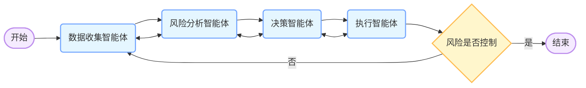

# 利用多智能体AI优化监管风险评估流程

> 关键词：多智能体AI、监管风险评估、优化流程、智能协作、风险预测

> 摘要：本文聚焦于利用多智能体AI优化监管风险评估流程这一前沿课题。首先介绍了监管风险评估的背景以及多智能体AI的相关概念，阐述了两者结合的重要性和意义。接着详细剖析了多智能体AI的核心概念与联系，包括其架构和原理，并给出了相应的示意图和流程图。深入讲解了多智能体AI在优化监管风险评估流程中所涉及的核心算法原理，通过Python代码进行了详细说明。同时，介绍了相关的数学模型和公式，并举例进行了阐释。在项目实战部分，给出了开发环境搭建的步骤、源代码实现及详细的代码解读。分析了多智能体AI在监管风险评估中的实际应用场景，推荐了相关的学习资源、开发工具框架以及论文著作。最后对未来发展趋势与挑战进行了总结，并在附录中给出常见问题与解答，还提供了扩展阅读和参考资料，旨在为相关领域的研究和实践提供全面且深入的指导。

## 1. 背景介绍 
### 1.1 目的和范围
监管风险评估在各个领域都具有至关重要的作用，如金融、医疗、交通等。准确、高效的风险评估能够帮助监管机构及时发现潜在问题，采取相应措施，保障行业的稳定发展和公众的利益。然而，传统的监管风险评估流程往往存在效率低下、缺乏灵活性、难以处理复杂多变的风险因素等问题。

本文章的目的在于探讨如何利用多智能体AI技术来优化监管风险评估流程，提高评估的准确性、效率和适应性。研究范围涵盖多智能体AI的基本原理、核心算法，以及其在不同行业监管风险评估中的应用和实现方法。

### 1.2 预期读者
本文预期读者包括但不限于以下几类人群：
- **监管机构工作人员**：希望了解多智能体AI技术在监管风险评估中的应用，以改进现有的工作流程，提高监管效率和质量。
- **人工智能研究人员**：对多智能体AI的理论和应用感兴趣，特别是其在监管领域的应用场景和挑战。
- **企业管理人员**：关注如何利用先进技术优化企业内部的风险评估和管理流程，以应对日益复杂的市场环境和监管要求。
- **高校师生**：相关专业的学生和教师，希望通过本文了解多智能体AI和监管风险评估的前沿知识，为学术研究和教学提供参考。

### 1.3 文档结构概述
本文将按照以下结构展开：
- **核心概念与联系**：介绍多智能体AI和监管风险评估的核心概念，阐述它们之间的联系，并给出相应的示意图和流程图。
- **核心算法原理 & 具体操作步骤**：详细讲解多智能体AI在优化监管风险评估流程中所涉及的核心算法原理，并通过Python代码进行具体实现和说明。
- **数学模型和公式 & 详细讲解 & 举例说明**：介绍相关的数学模型和公式，对其进行详细讲解，并通过具体例子进行阐释。
- **项目实战：代码实际案例和详细解释说明**：给出开发环境搭建的步骤，展示源代码的详细实现，并对代码进行解读和分析。
- **实际应用场景**：分析多智能体AI在不同行业监管风险评估中的实际应用场景。
- **工具和资源推荐**：推荐相关的学习资源、开发工具框架以及论文著作。
- **总结：未来发展趋势与挑战**：对多智能体AI在监管风险评估领域的未来发展趋势进行总结，并分析可能面临的挑战。
- **附录：常见问题与解答**：解答读者在阅读和实践过程中可能遇到的常见问题。
- **扩展阅读 & 参考资料**：提供相关的扩展阅读材料和参考资料，方便读者进一步深入学习。

### 1.4 术语表
#### 1.4.1 核心术语定义
- **多智能体AI（Multi - Agent AI）**：由多个智能体组成的人工智能系统，每个智能体具有一定的自主性、交互性和协作能力，能够在复杂的环境中通过相互协作完成特定的任务。
- **监管风险评估**：监管机构或相关部门对特定领域（如金融、医疗、交通等）的活动或对象进行风险识别、分析和评价的过程，旨在发现潜在的风险因素，采取相应的措施进行防范和控制。
- **智能体（Agent）**：在多智能体AI中，智能体是一个具有感知、决策和行动能力的实体，能够根据环境的变化和自身的目标进行自主决策和行动。

#### 1.4.2 相关概念解释
- **自主性**：智能体能够独立地感知环境、做出决策和采取行动，不需要外部的直接干预。
- **交互性**：智能体之间能够进行信息交流和通信，通过协作和协调来完成共同的任务。
- **协作能力**：多个智能体能够通过合作和分工，共同解决复杂的问题，实现整体的目标。

#### 1.4.3 缩略词列表
- **AI**：Artificial Intelligence（人工智能）
- **MAS**：Multi - Agent System（多智能体系统）

## 2. 核心概念与联系 

### 2.1 多智能体AI的核心概念
多智能体AI是一种分布式的人工智能系统，它由多个智能体组成。每个智能体都有自己的感知器，用于感知周围环境的信息；有自己的决策器，根据感知到的信息和自身的目标进行决策；还有自己的执行器，用于执行决策后的行动。

智能体之间通过通信机制进行信息交流和协作。它们可以在不同的层次上进行协作，如任务分配、资源共享、协调行动等。多智能体AI系统具有灵活性、适应性和可扩展性等优点，能够在复杂多变的环境中有效地完成任务。

### 2.2 监管风险评估的核心概念
监管风险评估是一个系统性的过程，主要包括以下几个步骤：
- **风险识别**：通过各种方法和手段，识别出可能存在的风险因素，如市场风险、信用风险、操作风险等。
- **风险分析**：对识别出的风险因素进行定量或定性的分析，评估其发生的可能性和影响程度。
- **风险评价**：根据风险分析的结果，对风险进行综合评价，确定风险的等级和优先级。
- **风险应对**：根据风险评价的结果，采取相应的措施进行风险防范和控制，如风险规避、风险降低、风险转移等。

### 2.3 多智能体AI与监管风险评估的联系
多智能体AI可以为监管风险评估带来多方面的改进和优化。具体如下：
- **提高信息收集能力**：多个智能体可以分布在不同的位置，同时收集各种相关信息，大大提高了信息收集的效率和全面性。
- **增强风险分析能力**：智能体可以利用自身的算法和模型对收集到的信息进行分析，多个智能体之间还可以通过协作进行更深入的分析，提高风险分析的准确性和可靠性。
- **优化决策过程**：多智能体系统可以根据风险分析的结果，通过协商和协作做出最优的决策，提高决策的科学性和合理性。
- **提高应对效率**：智能体可以根据决策结果迅速采取相应的行动，实现风险的快速应对和控制。

### 2.4 核心概念原理和架构的文本示意图
多智能体AI优化监管风险评估流程的架构可以描述为：多个智能体分布在监管环境的各个节点上，这些智能体可以是不同类型的，如数据收集智能体、风险分析智能体、决策智能体和执行智能体等。数据收集智能体负责收集各种相关信息，将其传递给风险分析智能体。风险分析智能体对信息进行处理和分析，将分析结果传递给决策智能体。决策智能体根据分析结果做出决策，并将决策指令传递给执行智能体。执行智能体负责执行决策指令，对风险进行应对和控制。同时，各个智能体之间通过通信机制进行信息交流和协作，形成一个有机的整体。

### 2.5 Mermaid 流程图


## 3. 核心算法原理 & 具体操作步骤 

### 3.1 核心算法原理
在多智能体AI优化监管风险评估流程中，常用的核心算法包括强化学习算法、博弈论算法等。

#### 3.1.1 强化学习算法
强化学习是一种通过智能体与环境进行交互，不断学习最优策略的算法。在监管风险评估中，智能体可以根据环境的反馈（如风险等级的变化）来调整自己的行动策略，以达到降低风险的目的。

强化学习的基本原理可以用马尔可夫决策过程（MDP）来描述。马尔可夫决策过程由一个四元组 $(S, A, P, R)$ 组成，其中：
- $S$ 是状态集合，表示智能体所处的环境状态。
- $A$ 是动作集合，表示智能体可以采取的行动。
- $P$ 是状态转移概率函数，表示在状态 $s$ 下采取动作 $a$ 后转移到状态 $s'$ 的概率，即 $P(s'|s, a)$。
- $R$ 是奖励函数，表示在状态 $s$ 下采取动作 $a$ 后获得的奖励 $R(s, a)$。

智能体的目标是找到一个最优策略 $\pi^*$，使得长期累积奖励最大。常用的强化学习算法有 Q - learning 算法、深度 Q 网络（DQN）算法等。

#### 3.1.2 博弈论算法
博弈论是研究多个智能体之间策略互动的数学理论。在监管风险评估中，不同的智能体（如监管机构和被监管对象）可以看作是博弈的参与者，它们的决策会相互影响。博弈论算法可以帮助智能体在这种互动环境中找到最优的策略。

常见的博弈类型包括合作博弈和非合作博弈。在非合作博弈中，每个智能体都以自身利益最大化为目标，通过分析其他智能体的策略来选择自己的最优策略。常用的非合作博弈算法有纳什均衡算法等。

### 3.2 具体操作步骤及Python源代码实现

#### 3.2.1 Q - learning 算法实现
```python
import numpy as np

# 定义状态和动作的数量
num_states = 10
num_actions = 4

# 初始化 Q 表
Q = np.zeros((num_states, num_actions))

# 定义超参数
alpha = 0.1  # 学习率
gamma = 0.9  # 折扣因子
epsilon = 0.1  # 探索率

# 定义奖励函数
def reward_function(state, action):
    # 这里简单假设一个奖励函数，实际应用中需要根据具体情况定义
    if state == 5 and action == 2:
        return 10
    else:
        return -1

# 定义状态转移函数
def state_transition(state, action):
    # 这里简单假设一个状态转移函数，实际应用中需要根据具体情况定义
    new_state = (state + action) % num_states
    return new_state

# Q - learning 算法
def q_learning(num_episodes):
    for episode in range(num_episodes):
        state = np.random.randint(0, num_states)  # 随机初始化状态
        done = False
        while not done:
            if np.random.uniform(0, 1) < epsilon:
                action = np.random.randint(0, num_actions)  # 探索
            else:
                action = np.argmax(Q[state, :])  # 利用

            reward = reward_function(state, action)
            new_state = state_transition(state, action)

            # 更新 Q 表
            Q[state, action] = Q[state, action] + alpha * (reward + gamma * np.max(Q[new_state, :]) - Q[state, action])

            state = new_state

            if state == 5:  # 达到目标状态，结束本回合
                done = True

    return Q

# 训练 Q 表
Q = q_learning(1000)
print("训练后的 Q 表：")
print(Q)
```
#### 3.2.2 代码解释
- **初始化 Q 表**：`Q = np.zeros((num_states, num_actions))` 初始化一个全零的 Q 表，用于存储每个状态下每个动作的价值。
- **定义超参数**：`alpha` 是学习率，控制 Q 表更新的步长；`gamma` 是折扣因子，用于权衡当前奖励和未来奖励的重要性；`epsilon` 是探索率，用于控制智能体的探索和利用行为。
- **奖励函数和状态转移函数**：`reward_function` 和 `state_transition` 分别定义了奖励和状态转移的规则，实际应用中需要根据具体问题进行定义。
- **Q - learning 算法核心**：在每个回合中，智能体根据 `epsilon` 贪心策略选择动作，根据奖励和下一个状态更新 Q 表，直到达到目标状态结束本回合。

## 4. 数学模型和公式 & 详细讲解 & 举例说明 

### 4.1 马尔可夫决策过程（MDP）
马尔可夫决策过程（MDP）是强化学习的基础数学模型，其定义为一个四元组 $(S, A, P, R)$，具体解释如下：
- **状态集合 $S$**：表示智能体所处的环境状态。例如，在一个简单的网格世界中，每个网格的位置可以看作一个状态，所有网格的位置构成状态集合 $S$。
- **动作集合 $A$**：表示智能体可以采取的行动。在网格世界中，动作可以是上下左右移动，即 $A = \{上, 下, 左, 右\}$。
- **状态转移概率函数 $P$**：$P(s'|s, a)$ 表示在状态 $s$ 下采取动作 $a$ 后转移到状态 $s'$ 的概率。例如，在确定性的网格世界中，如果智能体在某个网格中向右移动，那么它一定会转移到右边的网格，此时状态转移概率为 1。
- **奖励函数 $R$**：$R(s, a)$ 表示在状态 $s$ 下采取动作 $a$ 后获得的奖励。在网格世界中，如果智能体到达目标网格，可能会获得一个正的奖励，如 $R(目标网格, 到达动作) = 10$；如果智能体碰到障碍物，可能会获得一个负的奖励，如 $R(障碍物网格, 碰撞动作) = -5$。

智能体的目标是找到一个最优策略 $\pi^*$，使得长期累积奖励最大。长期累积奖励可以用折扣累积奖励来表示：
$$G_t = \sum_{k = 0}^{\infty} \gamma^k R_{t + k + 1}$$
其中，$G_t$ 是从时间步 $t$ 开始的折扣累积奖励，$\gamma$ 是折扣因子，$0 \leq \gamma \leq 1$，$R_{t + k + 1}$ 是时间步 $t + k + 1$ 获得的奖励。

### 4.2 Q - learning 算法的更新公式
Q - learning 算法的核心是更新 Q 表，其更新公式为：
$$Q(s, a) \leftarrow Q(s, a) + \alpha [R(s, a) + \gamma \max_{a'} Q(s', a') - Q(s, a)]$$
其中：
- $Q(s, a)$ 是状态 $s$ 下采取动作 $a$ 的 Q 值。
- $\alpha$ 是学习率，控制 Q 表更新的步长。
- $R(s, a)$ 是在状态 $s$ 下采取动作 $a$ 获得的奖励。
- $\gamma$ 是折扣因子，权衡当前奖励和未来奖励的重要性。
- $\max_{a'} Q(s', a')$ 是下一个状态 $s'$ 下所有动作中最大的 Q 值。

### 4.3 举例说明
假设一个简单的一维状态空间，状态集合 $S = \{0, 1, 2, 3\}$，动作集合 $A = \{0, 1\}$（0 表示向左移动，1 表示向右移动）。奖励函数定义为：当智能体到达状态 3 时，获得奖励 10，其他状态下获得奖励 -1。状态转移函数为：如果智能体在状态 $s$ 下采取动作 0，那么状态转移到 $\max(s - 1, 0)$；如果采取动作 1，那么状态转移到 $\min(s + 1, 3)$。

初始时，Q 表 $Q$ 全为 0。假设智能体当前状态 $s = 1$，采取动作 $a = 1$，转移到状态 $s' = 2$，获得奖励 $R(1, 1) = -1$。根据 Q - learning 更新公式，假设 $\alpha = 0.1$，$\gamma = 0.9$，则：
$$Q(1, 1) \leftarrow Q(1, 1) + 0.1 [-1 + 0.9 \max_{a'} Q(2, a') - Q(1, 1)]$$
由于初始时 $Q(2, 0) = Q(2, 1) = 0$，所以 $\max_{a'} Q(2, a') = 0$，则：
$$Q(1, 1) \leftarrow 0 + 0.1 [-1 + 0.9 \times 0 - 0] = -0.1$$

## 5. 项目实战：代码实际案例和详细解释说明 

### 5.1  开发环境搭建
#### 5.1.1 安装 Python
首先需要安装 Python 环境，建议安装 Python 3.7 及以上版本。可以从 Python 官方网站（https://www.python.org/downloads/） 下载对应的安装包，按照安装向导进行安装。

#### 5.1.2 安装必要的库
在本项目中，需要使用 `numpy` 库进行数值计算。可以使用以下命令进行安装：
```sh
pip install numpy
```

### 5.2  源代码详细实现和代码解读
#### 5.2.1 完整代码
```python
import numpy as np

# 定义状态和动作的数量
num_states = 4
num_actions = 2

# 初始化 Q 表
Q = np.zeros((num_states, num_actions))

# 定义超参数
alpha = 0.1  # 学习率
gamma = 0.9  # 折扣因子
epsilon = 0.1  # 探索率

# 定义奖励函数
def reward_function(state, action):
    if state == 3:
        return 10
    else:
        return -1

# 定义状态转移函数
def state_transition(state, action):
    if action == 0:  # 向左移动
        new_state = max(state - 1, 0)
    else:  # 向右移动
        new_state = min(state + 1, num_states - 1)
    return new_state

# Q - learning 算法
def q_learning(num_episodes):
    for episode in range(num_episodes):
        state = np.random.randint(0, num_states)  # 随机初始化状态
        done = False
        while not done:
            if np.random.uniform(0, 1) < epsilon:
                action = np.random.randint(0, num_actions)  # 探索
            else:
                action = np.argmax(Q[state, :])  # 利用

            reward = reward_function(state, action)
            new_state = state_transition(state, action)

            # 更新 Q 表
            Q[state, action] = Q[state, action] + alpha * (reward + gamma * np.max(Q[new_state, :]) - Q[state, action])

            state = new_state

            if state == 3:  # 达到目标状态，结束本回合
                done = True

    return Q

# 训练 Q 表
Q = q_learning(1000)
print("训练后的 Q 表：")
print(Q)

# 根据 Q 表选择最优策略
def get_optimal_policy(Q):
    optimal_policy = []
    for state in range(num_states):
        action = np.argmax(Q[state, :])
        optimal_policy.append(action)
    return optimal_policy

optimal_policy = get_optimal_policy(Q)
print("最优策略：", optimal_policy)
```
#### 5.2.2 代码解读
- **初始化部分**：定义了状态和动作的数量，初始化 Q 表，设置超参数 `alpha`、`gamma` 和 `epsilon`。
- **奖励函数和状态转移函数**：`reward_function` 根据状态和动作返回相应的奖励，`state_transition` 根据状态和动作返回下一个状态。
- **Q - learning 算法**：在每个回合中，智能体根据 `epsilon` 贪心策略选择动作，根据奖励和下一个状态更新 Q 表，直到达到目标状态结束本回合。
- **获取最优策略**：`get_optimal_policy` 函数根据训练好的 Q 表，为每个状态选择最优动作，得到最优策略。

### 5.3  代码解读与分析
#### 5.3.1 算法收敛性
Q - learning 算法在一定条件下是收敛的。当学习率 $\alpha$ 随着时间逐渐减小，并且智能体在足够多的回合中进行学习时，Q 表会收敛到最优 Q 值。在本代码中，固定了学习率 $\alpha$，在实际应用中，可以采用衰减的学习率来提高算法的收敛性。

#### 5.3.2 探索与利用的平衡
`epsilon` 控制了智能体的探索和利用行为。当 `epsilon` 较大时，智能体更多地进行探索，尝试不同的动作；当 `epsilon` 较小时，智能体更多地进行利用，选择当前认为最优的动作。在训练初期，可以设置较大的 `epsilon` 进行充分的探索，随着训练的进行，逐渐减小 `epsilon`，提高利用的比例。

#### 5.3.3 可扩展性
本代码只是一个简单的示例，实际应用中可以根据具体问题进行扩展。例如，可以增加状态和动作的数量，修改奖励函数和状态转移函数，采用更复杂的强化学习算法等。

## 6. 实际应用场景 
### 6.1 金融监管风险评估
在金融领域，多智能体AI可以用于优化监管风险评估流程。例如，不同的智能体可以分别负责收集市场数据、分析信用风险、监测流动性风险等。数据收集智能体可以实时收集股票价格、利率、汇率等市场数据，将其传递给风险分析智能体。风险分析智能体利用强化学习算法对数据进行分析，评估市场风险和信用风险的等级。决策智能体根据风险评估结果，制定相应的监管策略，如调整监管指标、加强对特定机构的监管等。执行智能体负责执行决策指令，对金融机构进行检查和监督。

### 6.2 医疗监管风险评估
在医疗领域，多智能体AI可以帮助优化医疗监管风险评估流程。数据收集智能体可以收集医院的病历数据、医疗设备运行数据、医护人员的操作记录等信息。风险分析智能体对这些信息进行分析，评估医疗质量风险、医疗安全风险等。决策智能体根据风险评估结果，制定相应的监管措施，如对存在问题的医院进行整改、对违规的医护人员进行处罚等。执行智能体负责执行这些措施，确保医疗监管的有效性。

### 6.3 交通监管风险评估
在交通领域，多智能体AI可以用于优化交通监管风险评估流程。数据收集智能体可以收集交通流量数据、车辆行驶轨迹数据、交通事故数据等信息。风险分析智能体对这些信息进行分析，评估交通拥堵风险、交通事故风险等。决策智能体根据风险评估结果，制定相应的交通管理策略，如调整信号灯时间、发布交通预警等。执行智能体负责执行这些策略，提高交通运行的安全性和效率。

## 7. 工具和资源推荐
### 7.1 学习资源推荐
#### 7.1.1 书籍推荐
- 《强化学习：原理与Python实现》：详细介绍了强化学习的基本原理和算法，并通过Python代码进行实现，适合初学者学习。
- 《多智能体系统：原理与应用》：系统地介绍了多智能体系统的理论和应用，包括智能体的建模、通信、协作等方面的内容。
- 《人工智能：一种现代的方法》：经典的人工智能教材，涵盖了人工智能的各个领域，包括多智能体AI和强化学习等内容。

#### 7.1.2 在线课程
- Coursera 上的“Reinforcement Learning Specialization”：由知名教授授课，全面介绍了强化学习的理论和实践。
- edX 上的“Artificial Intelligence”：涵盖了人工智能的多个领域，包括多智能体系统和强化学习等内容。
- 中国大学MOOC上的“人工智能基础”：国内高校开设的在线课程，讲解了人工智能的基本概念和算法，包括多智能体AI的相关内容。

#### 7.1.3 技术博客和网站
- OpenAI Blog（https://openai.com/blog/）：OpenAI 发布的技术博客，介绍了人工智能领域的最新研究成果和应用案例。
- Medium 上的人工智能相关专栏：有很多人工智能领域的专家和爱好者在 Medium 上分享自己的研究和实践经验。
- 机器之心（https://www.alldatasheet.com/）：专注于人工智能领域的资讯和技术文章，提供了丰富的学习资源和案例分析。

### 7.2 开发工具框架推荐
#### 7.2.1 IDE和编辑器
- PyCharm：功能强大的 Python 集成开发环境，提供了代码编辑、调试、版本控制等功能，适合开发 Python 项目。
- Visual Studio Code：轻量级的代码编辑器，支持多种编程语言，有丰富的插件扩展功能，适合快速开发和调试。
- Jupyter Notebook：交互式的开发环境，适合进行数据分析和算法实验，方便展示代码和结果。

#### 7.2.2 调试和性能分析工具
- PDB：Python 自带的调试工具，可以帮助开发者定位代码中的问题。
- cProfile：Python 自带的性能分析工具，可以分析代码的运行时间和函数调用关系，帮助优化代码性能。
- TensorBoard：TensorFlow 提供的可视化工具，可以用于可视化训练过程和模型性能，方便调试和优化深度学习模型。

#### 7.2.3 相关框架和库
- OpenAI Gym：一个开源的强化学习环境库，提供了多种经典的强化学习环境，方便开发者进行算法实验和验证。
- Stable Baselines：基于 OpenAI Gym 的强化学习算法库，实现了多种常见的强化学习算法，如 A2C、PPO 等，方便开发者快速应用。
- Mesa：一个用于开发多智能体系统的 Python 库，提供了智能体建模、环境模拟、交互机制等功能，适合开发多智能体 AI 应用。

### 7.3 相关论文著作推荐
#### 7.3.1 经典论文
- “Q - learning” by Watkins and Dayan：Q - learning 算法的经典论文，详细介绍了 Q - learning 算法的原理和实现。
- “Multi - Agent Systems: A Modern Approach to Distributed Artificial Intelligence” by Gerhard Weiss：多智能体系统领域的经典著作，系统地介绍了多智能体系统的理论和方法。
- “Reinforcement Learning: An Introduction” by Richard S. Sutton and Andrew G. Barto：强化学习领域的经典教材，全面介绍了强化学习的基本原理和算法。

#### 7.3.2 最新研究成果
- 关注 AAAI（Association for the Advancement of Artificial Intelligence）、IJCAI（International Joint Conference on Artificial Intelligence）等顶级人工智能会议的论文，了解多智能体 AI 和强化学习领域的最新研究成果。
- 关注《Journal of Artificial Intelligence Research》、《Artificial Intelligence》等人工智能领域的顶级期刊，获取最新的研究论文。

#### 7.3.3 应用案例分析
- 研究金融、医疗、交通等领域的实际应用案例，了解多智能体 AI 在监管风险评估中的具体应用和实践经验。可以通过行业报告、学术论文等渠道获取相关案例。

## 8. 总结：未来发展趋势与挑战
### 8.1 未来发展趋势
#### 8.1.1 与其他技术的融合
多智能体AI将与区块链、物联网、大数据等技术深度融合。例如，结合区块链技术可以实现智能体之间的可信通信和数据共享；结合物联网技术可以实时获取更多的环境信息，提高风险评估的准确性；结合大数据技术可以对海量数据进行分析和挖掘，发现更多的风险模式和规律。

#### 8.1.2 智能化和自主化程度不断提高
未来的多智能体AI系统将具有更高的智能化和自主化程度。智能体可以自动学习和适应环境的变化，自主调整决策和行动策略，实现更高效的风险评估和应对。

#### 8.1.3 应用领域不断拓展
多智能体AI在监管风险评估领域的应用将不断拓展到更多的行业和领域，如能源、教育、环保等。同时，也将在国际监管合作中发挥重要作用，实现全球范围内的风险评估和管理。

### 8.2 挑战
#### 8.2.1 算法复杂度和计算资源需求
多智能体AI的算法复杂度较高，需要大量的计算资源进行训练和推理。如何在有限的计算资源下提高算法的效率和性能，是一个亟待解决的问题。

#### 8.2.2 智能体之间的协作和协调
多个智能体之间的协作和协调是多智能体AI系统的关键。如何设计有效的通信机制和协作策略，确保智能体之间能够高效地协作，避免冲突和矛盾，是一个具有挑战性的问题。

#### 8.2.3 安全和隐私问题
在监管风险评估中，涉及大量的敏感数据和信息。如何保障智能体之间通信和数据共享的安全性和隐私性，防止数据泄露和恶意攻击，是一个重要的挑战。

## 9. 附录：常见问题与解答
### 9.1 多智能体AI和传统人工智能有什么区别？
传统人工智能通常是单个智能体的系统，主要关注单个智能体的决策和行动。而多智能体AI由多个智能体组成，强调智能体之间的交互、协作和协调。多智能体AI可以处理更复杂的问题，具有更高的灵活性和适应性。

### 9.2 Q - learning 算法的收敛性如何保证？
Q - learning 算法在一定条件下是收敛的。当学习率 $\alpha$ 随着时间逐渐减小，并且智能体在足够多的回合中进行学习时，Q 表会收敛到最优 Q 值。在实际应用中，可以采用衰减的学习率来提高算法的收敛性。

### 9.3 如何选择合适的超参数？
超参数的选择通常需要通过实验来确定。可以采用网格搜索、随机搜索等方法，在一定的参数范围内进行搜索，选择使得算法性能最优的超参数。同时，也可以参考相关的文献和经验，进行初步的参数设置。

### 9.4 多智能体AI在实际应用中如何进行测试和验证？
可以采用模拟实验和实际应用测试相结合的方法。在模拟实验中，可以构建虚拟的环境和场景，对多智能体AI系统进行测试和验证，评估其性能和效果。在实际应用测试中，可以将系统部署到实际环境中，收集实际数据，对系统进行进一步的验证和优化。

## 10. 扩展阅读 & 参考资料
### 10.1 扩展阅读
- 《复杂网络与多智能体系统》：介绍了复杂网络理论在多智能体系统中的应用，有助于深入理解多智能体之间的交互和协作机制。
- 《深度学习与强化学习》：探讨了深度学习和强化学习的结合，为多智能体AI的发展提供了新的思路和方法。
- 《智能交通系统中的多智能体技术》：详细介绍了多智能体技术在智能交通系统中的应用和实践，为交通监管风险评估提供了参考。

### 10.2 参考资料
- 相关的学术论文和研究报告，如 AAAI、IJCAI 等会议的论文，以及《Journal of Artificial Intelligence Research》、《Artificial Intelligence》等期刊的文章。
- 开源项目和代码库，如 OpenAI Gym、Stable Baselines、Mesa 等，提供了丰富的代码实现和示例。
- 行业标准和规范，如金融、医疗、交通等领域的监管标准和规范，为多智能体AI在监管风险评估中的应用提供了指导。