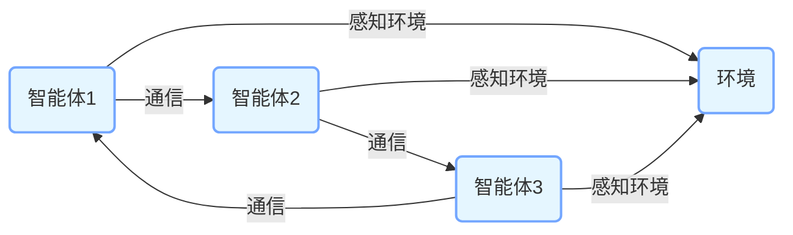

# 利用多智能体系统构建动态的经济护城河评估模型

> 关键词：多智能体系统、经济护城河评估模型、动态评估、智能体交互、经济建模

> 摘要：本文旨在探讨如何利用多智能体系统构建动态的经济护城河评估模型。首先介绍了研究的背景和相关概念，包括多智能体系统的原理和经济护城河的定义。接着详细阐述了核心算法原理，通过Python代码展示了智能体的行为和交互过程。同时给出了数学模型和公式，用于定量分析经济护城河的相关因素。在项目实战部分，提供了开发环境搭建的步骤、源代码的实现和解读。分析了该模型在实际经济场景中的应用，并推荐了相关的学习资源、开发工具和论文著作。最后总结了模型的未来发展趋势与挑战，解答了常见问题，并列出了扩展阅读和参考资料。

## 1. 背景介绍 
### 1.1 目的和范围
在当今复杂多变的经济环境中，准确评估企业的经济护城河对于投资者、管理者和政策制定者都具有至关重要的意义。经济护城河是指企业抵御竞争对手的优势，能够为企业带来长期稳定的现金流和超额利润。传统的经济护城河评估方法往往是静态的，难以适应快速变化的市场环境。本研究的目的是利用多智能体系统构建一个动态的经济护城河评估模型，能够实时反映企业经济护城河的变化情况，为决策提供更准确的依据。

本研究的范围主要包括以下几个方面：
- 多智能体系统的原理和应用，以及如何将其应用于经济护城河评估。
- 经济护城河的相关概念和评估指标，以及如何在多智能体系统中进行量化和模拟。
- 构建动态的经济护城河评估模型，包括智能体的设计、交互规则的制定和模型的验证。
- 分析该模型在实际经济场景中的应用，以及对决策的指导意义。

### 1.2 预期读者
本文的预期读者包括以下几类人群：
- 投资者：希望通过准确评估企业的经济护城河，做出更明智的投资决策。
- 企业管理者：了解企业的竞争优势和劣势，制定更有效的战略规划。
- 政策制定者：评估产业竞争力，制定相关政策促进经济发展。
- 学术研究人员：对多智能体系统和经济建模感兴趣，希望深入了解相关理论和方法。

### 1.3 文档结构概述
本文的结构如下：
- 核心概念与联系：介绍多智能体系统和经济护城河的核心概念，以及它们之间的联系。
- 核心算法原理 & 具体操作步骤：详细阐述多智能体系统的算法原理，通过Python代码展示具体的操作步骤。
- 数学模型和公式 & 详细讲解 & 举例说明：给出经济护城河评估模型的数学模型和公式，并进行详细讲解和举例说明。
- 项目实战：代码实际案例和详细解释说明：提供项目实战的具体步骤，包括开发环境搭建、源代码实现和代码解读。
- 实际应用场景：分析该模型在实际经济场景中的应用，以及对决策的指导意义。
- 工具和资源推荐：推荐相关的学习资源、开发工具和论文著作。
- 总结：未来发展趋势与挑战：总结模型的未来发展趋势和面临的挑战。
- 附录：常见问题与解答：解答读者可能遇到的常见问题。
- 扩展阅读 & 参考资料：列出相关的扩展阅读和参考资料。

### 1.4 术语表
#### 1.4.1 核心术语定义
- 多智能体系统（Multi-Agent System，MAS）：由多个智能体组成的系统，每个智能体具有自主决策和交互的能力，通过相互协作实现系统的整体目标。
- 经济护城河（Economic Moat）：企业抵御竞争对手的优势，能够为企业带来长期稳定的现金流和超额利润。
- 智能体（Agent）：具有自主决策和交互能力的实体，能够感知环境并根据自身的目标和规则做出决策。
- 交互规则（Interaction Rules）：定义智能体之间如何进行交互的规则，包括通信、合作、竞争等。
- 评估指标（Evaluation Indicators）：用于评估企业经济护城河的指标，如品牌价值、成本优势、转换成本等。

#### 1.4.2 相关概念解释
- 自主决策：智能体能够根据自身的目标和规则，独立地做出决策，而不需要外部的干预。
- 交互能力：智能体能够与其他智能体进行通信和协作，共同完成系统的任务。
- 动态评估：能够实时反映企业经济护城河的变化情况，根据市场环境的变化及时调整评估结果。
- 量化分析：将经济护城河的相关因素进行量化，通过数学模型和公式进行分析和评估。

#### 1.4.3 缩略词列表
- MAS：Multi-Agent System，多智能体系统
- AI：Artificial Intelligence，人工智能
- ML：Machine Learning，机器学习
- IDE：Integrated Development Environment，集成开发环境

## 2. 核心概念与联系 
### 多智能体系统原理
多智能体系统是一种分布式人工智能系统，由多个智能体组成。每个智能体具有自主决策和交互的能力，能够感知环境并根据自身的目标和规则做出决策。智能体之间通过通信和协作来实现系统的整体目标。

多智能体系统的架构通常包括以下几个部分：
- 智能体：具有自主决策和交互能力的实体。
- 环境：智能体所处的外部环境，包括其他智能体和物理世界。
- 通信机制：智能体之间进行信息交换的方式。
- 交互规则：定义智能体之间如何进行交互的规则。

以下是一个简单的多智能体系统的Mermaid流程图：


### 经济护城河概念
经济护城河是指企业抵御竞争对手的优势，能够为企业带来长期稳定的现金流和超额利润。经济护城河的来源主要包括以下几个方面：
- 品牌价值：消费者对企业品牌的认知度和忠诚度，能够为企业带来更高的售价和市场份额。
- 成本优势：企业通过规模经济、技术创新等方式降低成本，从而在价格上具有竞争优势。
- 转换成本：消费者从一个产品或服务转换到另一个产品或服务时所面临的成本，包括时间、金钱、学习成本等。
- 网络效应：随着用户数量的增加，产品或服务的价值也随之增加，从而形成一种正反馈机制。
- 政府监管：政府通过法律法规等手段对某些行业进行监管，限制竞争对手的进入，为企业提供了一定的保护。

### 两者之间的联系
多智能体系统可以用于构建动态的经济护城河评估模型，通过模拟企业、竞争对手和市场环境之间的交互，实时反映企业经济护城河的变化情况。具体来说，多智能体系统中的智能体可以代表企业、竞争对手、消费者等不同的实体，它们之间的交互可以模拟市场竞争、消费者行为等过程。通过对这些交互过程的分析和建模，可以评估企业的经济护城河的强弱和变化趋势。

例如，一个代表企业的智能体可以根据自身的品牌价值、成本优势等因素制定营销策略，与代表竞争对手的智能体进行竞争。同时，代表消费者的智能体可以根据产品的价格、质量、品牌等因素做出购买决策，从而影响企业的市场份额和利润。通过不断地模拟这些交互过程，可以实时反映企业经济护城河的变化情况，为决策提供更准确的依据。

## 3. 核心算法原理 & 具体操作步骤 
### 智能体的设计
在构建多智能体系统的经济护城河评估模型时，我们需要设计不同类型的智能体，包括企业智能体、竞争对手智能体和消费者智能体。每个智能体都具有自己的属性和行为规则。

以下是一个简单的Python代码示例，用于定义企业智能体：
```python
class CompanyAgent:
    def __init__(self, name, brand_value, cost_advantage):
        self.name = name
        self.brand_value = brand_value
        self.cost_advantage = cost_advantage
        self.market_share = 0

    def set_market_share(self, share):
        self.market_share = share

    def get_market_share(self):
        return self.market_share

    def get_brand_value(self):
        return self.brand_value

    def get_cost_advantage(self):
        return self.cost_advantage

    def make_decision(self, competitors):
        # 这里可以根据品牌价值、成本优势等因素制定决策
        # 例如，根据品牌价值提高产品价格，根据成本优势降低价格等
        pass
```

### 交互规则的制定
智能体之间的交互规则定义了它们如何进行通信、合作和竞争。在经济护城河评估模型中，企业智能体和竞争对手智能体之间的交互主要包括市场竞争，而企业智能体和消费者智能体之间的交互主要包括产品销售。

以下是一个简单的Python代码示例，用于定义企业智能体和竞争对手智能体之间的市场竞争：
```python
def market_competition(company_agents):
    total_market_share = 1.0
    for agent in company_agents:
        # 根据品牌价值和成本优势计算市场份额
        brand_factor = agent.get_brand_value()
        cost_factor = agent.get_cost_advantage()
        share = (brand_factor + cost_factor) / sum([(a.get_brand_value() + a.get_cost_advantage()) for a in company_agents])
        agent.set_market_share(share * total_market_share)
```

### 模型的运行步骤
1. **初始化智能体**：创建企业智能体、竞争对手智能体和消费者智能体，并初始化它们的属性。
2. **模拟交互过程**：根据交互规则，模拟智能体之间的通信、合作和竞争过程。
3. **更新智能体状态**：根据交互结果，更新智能体的属性和状态。
4. **评估经济护城河**：根据智能体的状态和市场环境，评估企业的经济护城河的强弱和变化趋势。
5. **重复步骤2-4**：不断重复上述步骤，直到达到预设的模拟时间或满足其他终止条件。

以下是一个简单的Python代码示例，用于运行经济护城河评估模型：
```python
# 初始化企业智能体
company1 = CompanyAgent("Company1", 0.8, 0.7)
company2 = CompanyAgent("Company2", 0.6, 0.9)
company_agents = [company1, company2]

# 模拟市场竞争
for i in range(10):
    market_competition(company_agents)
    for agent in company_agents:
        print(f"{agent.name} market share: {agent.get_market_share()}")
```

## 4. 数学模型和公式 & 详细讲解 & 举例说明 
### 经济护城河评估指标的量化
为了评估企业的经济护城河，我们需要将相关的评估指标进行量化。以下是一些常见的评估指标及其量化方法：
- **品牌价值**：可以通过品牌知名度、品牌美誉度等指标进行量化，例如可以使用市场调研数据来评估品牌价值。假设品牌知名度用 $B_{awareness}$ 表示，品牌美誉度用 $B_{reputation}$ 表示，则品牌价值 $B$ 可以表示为：
$$B = \alpha B_{awareness} + \beta B_{reputation}$$
其中，$\alpha$ 和 $\beta$ 是权重系数，根据具体情况进行调整。

- **成本优势**：可以通过成本率、毛利率等指标进行量化，例如成本率 $C_{rate}$ 可以表示为：
$$C_{rate} = \frac{Cost}{Revenue}$$
成本优势 $C$ 可以表示为：
$$C = 1 - C_{rate}$$

- **转换成本**：可以通过消费者调查等方式进行量化，例如可以询问消费者从一个产品或服务转换到另一个产品或服务时所愿意支付的最大成本。假设转换成本用 $S$ 表示，则可以直接使用调查结果作为转换成本的量化值。

### 经济护城河综合评估模型
在量化了各个评估指标之后，我们可以构建一个经济护城河综合评估模型。假设经济护城河的综合评估值用 $M$ 表示，品牌价值用 $B$ 表示，成本优势用 $C$ 表示，转换成本用 $S$ 表示，则经济护城河综合评估模型可以表示为：
$$M = w_1 B + w_2 C + w_3 S$$
其中，$w_1$、$w_2$ 和 $w_3$ 是权重系数，根据各个评估指标的重要性进行调整。

### 举例说明
假设我们要评估两家企业的经济护城河，企业A和企业B。通过市场调研和数据分析，我们得到以下评估指标的值：

| 企业 | 品牌知名度 $B_{awareness}$ | 品牌美誉度 $B_{reputation}$ | 成本率 $C_{rate}$ | 转换成本 $S$ |
| ---- | ---- | ---- | ---- | ---- |
| 企业A | 0.8 | 0.7 | 0.3 | 50 |
| 企业B | 0.6 | 0.9 | 0.2 | 30 |

假设权重系数 $\alpha = 0.6$，$\beta = 0.4$，$w_1 = 0.4$，$w_2 = 0.3$，$w_3 = 0.3$。

首先，计算品牌价值：
- 企业A：$B_A = 0.6 \times 0.8 + 0.4 \times 0.7 = 0.76$
- 企业B：$B_B = 0.6 \times 0.6 + 0.4 \times 0.9 = 0.72$

然后，计算成本优势：
- 企业A：$C_A = 1 - 0.3 = 0.7$
- 企业B：$C_B = 1 - 0.2 = 0.8$

最后，计算经济护城河综合评估值：
- 企业A：$M_A = 0.4 \times 0.76 + 0.3 \times 0.7 + 0.3 \times 50 = 15.594$
- 企业B：$M_B = 0.4 \times 0.72 + 0.3 \times 0.8 + 0.3 \times 30 = 9.408$

通过比较 $M_A$ 和 $M_B$ 的值，我们可以看出企业A的经济护城河相对较强。

## 5. 项目实战：代码实际案例和详细解释说明 
### 5.1  开发环境搭建
在进行项目实战之前，我们需要搭建开发环境。以下是具体的步骤：
1. **安装Python**：从Python官方网站（https://www.python.org/downloads/）下载并安装Python 3.x版本。
2. **安装开发工具**：推荐使用PyCharm作为开发工具，它是一个功能强大的Python集成开发环境。可以从JetBrains官方网站（https://www.jetbrains.com/pycharm/download/）下载并安装。
3. **安装必要的库**：在项目中，我们需要使用一些Python库，如NumPy、Pandas等。可以使用以下命令进行安装：
```sh
pip install numpy pandas
```

### 5.2  源代码详细实现和代码解读
以下是一个完整的Python代码示例，用于实现动态的经济护城河评估模型：
```python
import numpy as np
import pandas as pd

class CompanyAgent:
    def __init__(self, name, brand_value, cost_advantage, conversion_cost):
        self.name = name
        self.brand_value = brand_value
        self.cost_advantage = cost_advantage
        self.conversion_cost = conversion_cost
        self.market_share = 0
        self.profit = 0

    def set_market_share(self, share):
        self.market_share = share

    def get_market_share(self):
        return self.market_share

    def get_brand_value(self):
        return self.brand_value

    def get_cost_advantage(self):
        return self.cost_advantage

    def get_conversion_cost(self):
        return self.conversion_cost

    def calculate_profit(self, market_size):
        # 简单假设利润与市场份额成正比
        self.profit = self.market_share * market_size
        return self.profit

    def make_decision(self, competitors):
        # 根据品牌价值、成本优势等因素制定决策
        # 这里简单假设根据品牌价值提高价格，根据成本优势降低价格
        brand_factor = self.get_brand_value()
        cost_factor = self.get_cost_advantage()
        price_adjustment = brand_factor - cost_factor
        return price_adjustment

class ConsumerAgent:
    def __init__(self, id):
        self.id = id
        self.purchase_choice = None

    def make_purchase_decision(self, company_agents):
        # 根据品牌价值、成本优势和转换成本做出购买决策
        scores = []
        for agent in company_agents:
            brand_value = agent.get_brand_value()
            cost_advantage = agent.get_cost_advantage()
            conversion_cost = agent.get_conversion_cost()
            score = brand_value + cost_advantage - conversion_cost
            scores.append(score)
        best_index = np.argmax(scores)
        self.purchase_choice = company_agents[best_index]
        return self.purchase_choice

def market_competition(company_agents, consumer_agents):
    total_market_share = 1.0
    purchase_counts = {agent: 0 for agent in company_agents}
    for consumer in consumer_agents:
        choice = consumer.make_purchase_decision(company_agents)
        purchase_counts[choice] += 1
    total_purchases = len(consumer_agents)
    for agent in company_agents:
        share = purchase_counts[agent] / total_purchases
        agent.set_market_share(share * total_market_share)

# 初始化企业智能体
company1 = CompanyAgent("Company1", 0.8, 0.7, 50)
company2 = CompanyAgent("Company2", 0.6, 0.9, 30)
company_agents = [company1, company2]

# 初始化消费者智能体
consumer_agents = [ConsumerAgent(i) for i in range(100)]

# 模拟市场竞争
market_size = 1000
results = []
for i in range(10):
    market_competition(company_agents, consumer_agents)
    for agent in company_agents:
        profit = agent.calculate_profit(market_size)
        result = {
            "step": i,
            "company": agent.name,
            "market_share": agent.get_market_share(),
            "profit": profit
        }
        results.append(result)

# 输出结果
df = pd.DataFrame(results)
print(df)
```

### 5.3  代码解读与分析
#### 代码结构
- **CompanyAgent类**：表示企业智能体，包含企业的属性（品牌价值、成本优势、转换成本等）和行为（制定决策、计算利润等）。
- **ConsumerAgent类**：表示消费者智能体，包含消费者的属性（ID）和行为（做出购买决策）。
- **market_competition函数**：模拟市场竞争过程，根据消费者的购买决策更新企业的市场份额。
- **主程序**：初始化企业智能体和消费者智能体，模拟市场竞争过程，并输出结果。

#### 代码分析
- **企业智能体的决策**：企业智能体根据品牌价值和成本优势制定价格调整决策，品牌价值越高，价格调整越高；成本优势越高，价格调整越低。
- **消费者的购买决策**：消费者智能体根据品牌价值、成本优势和转换成本做出购买决策，选择得分最高的企业。
- **市场竞争过程**：通过模拟消费者的购买决策，更新企业的市场份额，从而实现市场竞争的模拟。
- **结果输出**：使用Pandas库将模拟结果存储在DataFrame中，并输出。

通过这个代码示例，我们可以看到如何使用多智能体系统构建动态的经济护城河评估模型，模拟企业、消费者和市场环境之间的交互，实时反映企业经济护城河的变化情况。

## 6. 实际应用场景 
### 投资决策
对于投资者来说，准确评估企业的经济护城河是做出投资决策的关键。利用多智能体系统构建的动态经济护城河评估模型，可以实时反映企业经济护城河的变化情况，帮助投资者及时调整投资组合。例如，当模型显示某家企业的经济护城河在减弱时，投资者可以考虑减少对该企业的投资；反之，当模型显示某家企业的经济护城河在增强时，投资者可以考虑增加对该企业的投资。

### 企业战略规划
企业管理者可以利用该模型来评估企业的竞争优势和劣势，制定更有效的战略规划。例如，通过分析模型中的品牌价值、成本优势等指标，企业管理者可以找出企业的优势所在，并进一步加强这些优势；同时，也可以发现企业的劣势，采取相应的措施进行改进。此外，模型还可以模拟不同战略决策对企业经济护城河的影响，帮助企业管理者做出更明智的决策。

### 政策制定
政策制定者可以利用该模型来评估产业竞争力，制定相关政策促进经济发展。例如，通过分析模型中的行业竞争格局和企业经济护城河的分布情况，政策制定者可以了解哪些行业具有较强的竞争力，哪些行业需要政策支持。对于具有较强竞争力的行业，政策制定者可以采取措施进一步加强其优势；对于需要政策支持的行业，政策制定者可以出台相关政策，如税收优惠、补贴等，帮助企业提升经济护城河。

### 市场研究
市场研究机构可以利用该模型来分析市场动态和消费者行为。通过模拟不同市场环境下企业和消费者的交互过程，市场研究机构可以了解市场竞争的变化趋势和消费者的需求偏好。例如，模型可以模拟新产品推出后对市场格局的影响，帮助企业预测市场需求和制定营销策略。

## 7. 工具和资源推荐
### 7.1 学习资源推荐
#### 7.1.1 书籍推荐
- 《多智能体系统导论》：这本书全面介绍了多智能体系统的基本概念、理论和方法，是学习多智能体系统的经典教材。
- 《竞争优势》：作者迈克尔·波特在书中提出了著名的竞争优势理论，详细阐述了企业如何通过构建经济护城河来获得竞争优势。
- 《人工智能：一种现代方法》：这本书是人工智能领域的经典教材，涵盖了多智能体系统、机器学习等多个方面的内容。

#### 7.1.2 在线课程
- Coursera上的“多智能体系统”课程：由知名高校的教授授课，系统地介绍了多智能体系统的原理和应用。
- edX上的“人工智能基础”课程：该课程涵盖了人工智能的基本概念和方法，包括多智能体系统的相关内容。
- Udemy上的“经济建模与分析”课程：介绍了经济建模的基本方法和工具，对于理解经济护城河评估模型有很大的帮助。

#### 7.1.3 技术博客和网站
- 多智能体系统研究网（https://www.mas-group.org/）：提供了多智能体系统领域的最新研究成果和学术动态。
- 经济观察网（https://www.eeo.com.cn/）：专注于经济领域的新闻和分析，对于了解经济护城河的实际应用有很大的帮助。
- 开源中国（https://www.oschina.net/）：提供了大量的开源代码和技术文章，对于学习和实践多智能体系统有很大的帮助。

### 7.2 开发工具框架推荐
#### 7.2.1 IDE和编辑器
- PyCharm：功能强大的Python集成开发环境，提供了代码编辑、调试、版本控制等一系列功能。
- Jupyter Notebook：交互式的开发环境，适合进行数据分析和模型验证。
- Visual Studio Code：轻量级的代码编辑器，支持多种编程语言，具有丰富的插件生态系统。

#### 7.2.2 调试和性能分析工具
- PDB：Python自带的调试工具，可以帮助开发者定位代码中的问题。
- cProfile：Python的性能分析工具，可以分析代码的运行时间和内存使用情况。
- Py-Spy：一个简单易用的Python性能分析工具，可以实时监控Python程序的运行状态。

#### 7.2.3 相关框架和库
- Mesa：一个用于构建多智能体系统的Python框架，提供了丰富的智能体类型和交互规则。
- NumPy：Python的数值计算库，提供了高效的数组操作和数学函数。
- Pandas：Python的数据处理和分析库，提供了强大的数据结构和数据分析工具。

### 7.3 相关论文著作推荐
#### 7.3.1 经典论文
- "Multiagent Systems: A Modern Approach to Distributed Artificial Intelligence"：该论文系统地介绍了多智能体系统的基本概念和理论，是多智能体系统领域的经典之作。
- "Competitive Strategy: Techniques for Analyzing Industries and Competitors"：作者迈克尔·波特在论文中提出了竞争战略的分析方法，对于理解企业的经济护城河具有重要的指导意义。
- "The Economics of Networks"：该论文探讨了网络效应在经济中的作用，对于理解经济护城河的来源之一——网络效应有很大的帮助。

#### 7.3.2 最新研究成果
- 可以通过学术数据库，如IEEE Xplore、ACM Digital Library等，搜索多智能体系统和经济建模领域的最新研究成果。这些研究成果通常涉及到新的算法、模型和应用场景。
- 参加相关的学术会议，如国际多智能体系统会议（AAMAS）、国际人工智能联合会议（IJCAI）等，了解最新的研究动态和趋势。

#### 7.3.3 应用案例分析
- 可以通过商业杂志、行业报告等渠道，了解多智能体系统在经济领域的应用案例。这些案例通常包括企业如何利用多智能体系统进行市场竞争分析、战略规划等。
- 研究一些知名企业的案例，如亚马逊、苹果等，了解它们是如何构建和维护自己的经济护城河的。

## 8. 总结：未来发展趋势与挑战
### 未来发展趋势
- **与人工智能技术的深度融合**：随着人工智能技术的不断发展，多智能体系统将与机器学习、深度学习等技术深度融合，提高模型的智能水平和预测能力。例如，通过使用深度学习算法对大量的市场数据进行分析，智能体可以更好地理解市场动态和消费者行为，从而做出更准确的决策。
- **跨领域应用的拓展**：多智能体系统构建的经济护城河评估模型将不仅仅应用于金融、投资等领域，还将拓展到其他领域，如医疗、教育、交通等。例如，在医疗领域，可以使用该模型评估医疗机构的竞争力，制定合理的医疗资源分配策略。
- **实时动态评估的实现**：未来的模型将更加注重实时动态评估，能够实时反映企业经济护城河的变化情况。通过与实时数据接口的集成，模型可以及时获取市场信息和企业数据，对经济护城河进行动态调整和评估。
- **可视化和交互性的提升**：为了更好地展示模型的结果和分析过程，未来的模型将更加注重可视化和交互性。通过使用可视化工具，如图表、地图等，可以直观地展示企业经济护城河的变化趋势和市场竞争格局；同时，用户可以通过交互界面与模型进行互动，深入了解模型的运行机制和分析结果。

### 面临的挑战
- **数据质量和获取难度**：构建准确的经济护城河评估模型需要大量的高质量数据，包括企业财务数据、市场调研数据、消费者行为数据等。然而，数据的质量和获取难度是一个重要的挑战。一方面，数据可能存在不准确、不完整等问题，影响模型的准确性；另一方面，获取某些数据可能需要付出较高的成本和时间，限制了模型的应用范围。
- **模型的复杂性和可解释性**：随着模型的不断发展和完善，其复杂性也在不断增加。复杂的模型虽然可以提高预测能力，但也带来了可解释性的问题。在实际应用中，用户往往需要了解模型的决策过程和依据，以便做出合理的决策。因此，如何在提高模型准确性的同时，保证模型的可解释性是一个需要解决的问题。
- **智能体的行为建模和交互规则设计**：智能体的行为建模和交互规则设计是构建多智能体系统的关键。然而，由于现实世界的复杂性和不确定性，准确地建模智能体的行为和设计交互规则是一个具有挑战性的任务。例如，智能体的决策过程可能受到多种因素的影响，如何考虑这些因素并设计合理的行为规则是一个需要深入研究的问题。
- **模型的验证和评估**：为了保证模型的可靠性和有效性，需要对模型进行严格的验证和评估。然而，由于经济系统的复杂性和不确定性，模型的验证和评估是一个具有挑战性的任务。如何选择合适的验证方法和评估指标，以及如何在不同的场景下验证和评估模型的性能是一个需要解决的问题。

## 9. 附录：常见问题与解答
### 问题1：多智能体系统和传统的经济建模方法有什么区别？
多智能体系统与传统的经济建模方法的主要区别在于其强调个体的自主性和交互性。传统的经济建模方法通常将经济系统视为一个整体，通过宏观经济变量来描述经济现象。而多智能体系统将经济系统视为由多个自主的智能体组成的系统，每个智能体具有自己的目标和行为规则，通过相互交互来影响整个经济系统的运行。因此，多智能体系统能够更好地模拟现实世界中的复杂经济现象，如市场竞争、消费者行为等。

### 问题2：如何确定经济护城河评估指标的权重？
确定经济护城河评估指标的权重可以采用多种方法，如专家打分法、层次分析法、主成分分析法等。专家打分法是通过邀请相关领域的专家对各个评估指标的重要性进行打分，然后根据打分结果确定权重。层次分析法是一种将复杂问题分解为多个层次，通过比较不同层次之间的因素来确定权重的方法。主成分分析法是一种通过对原始数据进行降维处理，提取主要成分来确定权重的方法。在实际应用中，可以根据具体情况选择合适的方法来确定权重。

### 问题3：模型的准确性如何保证？
为了保证模型的准确性，可以采取以下措施：
- **数据质量控制**：确保使用的数据源可靠，对数据进行清洗和预处理，去除噪声和异常值。
- **模型验证和评估**：使用历史数据对模型进行验证和评估，比较模型的预测结果与实际情况的差异，不断调整模型的参数和结构。
- **多模型融合**：可以结合多种不同的模型进行预测，通过加权平均等方法综合各个模型的结果，提高预测的准确性。
- **实时更新和调整**：随着市场环境和企业情况的变化，及时更新模型的参数和数据，保证模型的实时性和准确性。

### 问题4：模型的应用范围有哪些限制？
模型的应用范围可能受到以下因素的限制：
- **数据可用性**：模型的构建和运行需要大量的数据支持，如果某些数据无法获取或质量不高，可能会影响模型的准确性和应用范围。
- **模型假设**：模型通常基于一定的假设条件，这些假设可能与实际情况存在差异，从而限制了模型的应用范围。
- **计算资源**：复杂的多智能体系统模型可能需要大量的计算资源，如果计算资源有限，可能会影响模型的运行效率和应用范围。
- **实际情况的复杂性**：现实世界的经济现象非常复杂，模型可能无法完全准确地模拟所有的因素和情况，从而限制了模型的应用范围。

## 10. 扩展阅读 & 参考资料
### 扩展阅读
- 《复杂经济学：经济思想的新框架》：作者布莱恩·阿瑟在书中提出了复杂经济学的概念，探讨了经济系统的复杂性和动态性，对于理解多智能体系统在经济建模中的应用有很大的帮助。
- 《大数据时代：生活、工作与思维的大变革》：介绍了大数据技术在各个领域的应用，包括经济领域。了解大数据技术可以为构建更准确的经济护城河评估模型提供思路。
- 《智能时代：大数据与智能革命重新定义未来》：探讨了人工智能和大数据技术对未来社会的影响，对于了解多智能体系统的发展趋势和应用前景有很大的启发。

### 参考资料
- 多智能体系统相关的学术论文和研究报告，可以通过学术数据库如IEEE Xplore、ACM Digital Library等进行查找。
- 经济护城河相关的书籍和文章，如迈克尔·波特的《竞争优势》、《竞争战略》等。
- 相关的开源代码和项目，可以通过开源代码托管平台如GitHub、GitLab等进行查找。