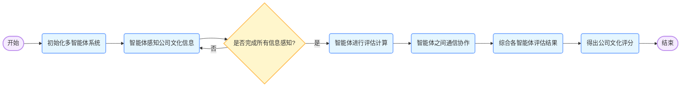

# 利用多智能体系统进行全面的公司文化评分

> 关键词：多智能体系统、公司文化评分、人工智能、数据分析、文化评估

> 摘要：本文深入探讨了如何利用多智能体系统进行全面的公司文化评分。首先介绍了相关背景，包括目的、预期读者、文档结构和术语表。接着阐述了多智能体系统与公司文化评分的核心概念及联系，详细讲解了核心算法原理和具体操作步骤，并通过Python代码进行示例。同时给出了数学模型和公式，结合实际案例进行说明。然后进行项目实战，包括开发环境搭建、源代码实现和解读。还探讨了实际应用场景，推荐了相关的工具和资源。最后总结了未来发展趋势与挑战，提供了常见问题解答和扩展阅读参考资料。旨在为企业提供一种科学、全面的公司文化评分方法，借助多智能体系统的优势提升评估的准确性和有效性。

## 1. 背景介绍 
### 1.1 目的和范围
在当今竞争激烈的商业环境中，公司文化对于企业的发展至关重要。良好的公司文化能够提高员工的满意度和忠诚度，增强企业的凝聚力和竞争力。然而，如何准确、全面地评估公司文化一直是企业面临的挑战。本文章的目的是介绍如何利用多智能体系统来进行全面的公司文化评分，为企业提供一种科学、有效的评估方法。

本文的范围涵盖了多智能体系统的基本原理、公司文化评分的相关概念、核心算法的实现、数学模型的构建、项目实战案例以及实际应用场景等方面。通过对这些内容的详细阐述，帮助读者深入理解如何利用多智能体系统进行公司文化评分。

### 1.2 预期读者
本文预期读者包括企业管理人员、人力资源专家、人工智能研究者、软件开发人员以及对公司文化评估和多智能体系统感兴趣的人士。企业管理人员可以通过本文了解如何利用先进的技术手段评估公司文化，为企业的发展提供决策依据；人力资源专家可以从中获取新的评估方法，优化员工管理和企业文化建设；人工智能研究者和软件开发人员可以借鉴本文的技术思路，开展相关的研究和开发工作。

### 1.3 文档结构概述
本文将按照以下结构进行组织：
- 核心概念与联系：介绍多智能体系统和公司文化评分的核心概念，以及它们之间的联系，并通过文本示意图和Mermaid流程图进行直观展示。
- 核心算法原理 & 具体操作步骤：详细讲解利用多智能体系统进行公司文化评分的核心算法原理，并给出具体的操作步骤，同时使用Python代码进行实现。
- 数学模型和公式 & 详细讲解 & 举例说明：构建数学模型和公式，对算法进行量化分析，并通过实际例子进行详细说明。
- 项目实战：代码实际案例和详细解释说明：通过一个实际的项目案例，介绍开发环境的搭建、源代码的实现和解读，帮助读者更好地理解和应用相关技术。
- 实际应用场景：探讨利用多智能体系统进行公司文化评分的实际应用场景，为企业提供参考。
- 工具和资源推荐：推荐相关的学习资源、开发工具框架和论文著作，帮助读者进一步深入学习和研究。
- 总结：未来发展趋势与挑战：总结利用多智能体系统进行公司文化评分的未来发展趋势和面临的挑战。
- 附录：常见问题与解答：提供常见问题的解答，帮助读者解决在学习和应用过程中遇到的问题。
- 扩展阅读 & 参考资料：提供扩展阅读的建议和相关参考资料，方便读者进一步深入研究。

### 1.4 术语表
#### 1.4.1 核心术语定义
- 多智能体系统（Multi-Agent System，MAS）：由多个智能体组成的系统，智能体之间可以相互通信、协作和竞争，共同完成复杂的任务。
- 公司文化：企业在长期的发展过程中形成的价值观、信仰、行为准则和工作方式等方面的总和。
- 公司文化评分：对公司文化的各个方面进行量化评估，得出一个综合的评分，以反映公司文化的优劣。
- 智能体（Agent）：具有自主性、反应性、社会性和能动性的实体，能够感知环境、做出决策并采取行动。

#### 1.4.2 相关概念解释
- 自主性：智能体能够独立地感知环境、做出决策并采取行动，不受外界的直接控制。
- 反应性：智能体能够对环境的变化做出及时的反应，调整自己的行为。
- 社会性：智能体能够与其他智能体进行通信和协作，共同完成任务。
- 能动性：智能体能够主动地寻找机会，实现自己的目标。

#### 1.4.3 缩略词列表
- MAS：Multi-Agent System（多智能体系统）

## 2. 核心概念与联系 

### 多智能体系统原理
多智能体系统是一种分布式人工智能系统，由多个智能体组成。每个智能体都具有一定的自主性和智能，能够感知环境、做出决策并采取行动。智能体之间可以通过通信机制进行信息交换和协作，共同完成复杂的任务。

多智能体系统的架构通常包括以下几个部分：
- 智能体：是系统的基本组成单元，具有自主性、反应性、社会性和能动性。
- 通信机制：用于智能体之间的信息交换和协作。
- 环境：智能体所处的外部环境，包括物理环境和社会环境。
- 协调机制：用于协调智能体之间的行为，避免冲突和竞争。

### 公司文化评分概念
公司文化评分是对公司文化的各个方面进行量化评估的过程。公司文化包括价值观、信仰、行为准则、工作方式等多个方面，通过对这些方面进行评估，可以得出一个综合的评分，以反映公司文化的优劣。

公司文化评分的目的是帮助企业了解自身的文化状况，发现存在的问题，并采取相应的措施进行改进。同时，公司文化评分也可以为企业的招聘、培训、绩效管理等人力资源管理活动提供参考依据。

### 两者联系
多智能体系统可以为公司文化评分提供一种有效的方法。通过将公司文化的各个方面抽象为不同的智能体，每个智能体负责评估公司文化的一个特定方面。智能体之间可以通过通信和协作，综合考虑各个方面的评估结果，得出一个全面的公司文化评分。

例如，可以设计一个智能体负责评估公司的价值观，另一个智能体负责评估公司的工作氛围，还有一个智能体负责评估公司的员工满意度等。这些智能体之间可以相互交流信息，共同完成公司文化的评估任务。

### 文本示意图
```plaintext
多智能体系统
|-- 智能体1（价值观评估）
|-- 智能体2（工作氛围评估）
|-- 智能体3（员工满意度评估）
|-- ...
|-- 通信机制
|-- 协调机制

公司文化评分
|-- 综合评分
|   |-- 价值观得分
|   |-- 工作氛围得分
|   |-- 员工满意度得分
|   |-- ...
```

### Mermaid流程图


## 3. 核心算法原理 & 具体操作步骤 

### 核心算法原理
我们采用基于加权平均的方法来计算公司文化评分。每个智能体负责评估公司文化的一个特定方面，并给出一个评分。然后，根据各个方面的重要性，为每个评分分配一个权重。最后，将所有评分乘以相应的权重并求和，得到公司文化的综合评分。

具体公式如下：
$$S = \sum_{i=1}^{n} w_i \times s_i$$
其中，$S$ 表示公司文化的综合评分，$n$ 表示智能体的数量，$w_i$ 表示第 $i$ 个智能体评分的权重，$s_i$ 表示第 $i$ 个智能体给出的评分。

### 具体操作步骤
1. **初始化多智能体系统**：创建多个智能体，每个智能体负责评估公司文化的一个特定方面，并初始化各个智能体的参数。
2. **智能体感知公司文化信息**：每个智能体通过各种方式（如问卷调查、员工访谈、观察等）收集公司文化的相关信息。
3. **智能体进行评估计算**：每个智能体根据收集到的信息，对公司文化的特定方面进行评估，并给出一个评分。
4. **智能体之间通信协作**：智能体之间通过通信机制交换信息，协调各自的评估结果。
5. **综合各智能体评估结果**：根据各个方面的重要性，为每个评分分配一个权重，然后将所有评分乘以相应的权重并求和，得到公司文化的综合评分。

### Python代码实现
```python
# 定义智能体类
class Agent:
    def __init__(self, aspect, weight):
        self.aspect = aspect  # 负责评估的方面
        self.weight = weight  # 权重
        self.score = 0  # 评分

    def evaluate(self, data):
        # 简单示例：根据数据计算评分
        # 这里可以根据具体情况实现复杂的评估算法
        self.score = sum(data) / len(data)
        return self.score

# 初始化多智能体系统
agents = [
    Agent("价值观", 0.3),
    Agent("工作氛围", 0.2),
    Agent("员工满意度", 0.5)
]

# 模拟公司文化信息
values_data = [8, 9, 7]
atmosphere_data = [7, 6, 8]
satisfaction_data = [9, 8, 9]

data_list = [values_data, atmosphere_data, satisfaction_data]

# 智能体进行评估计算
for i, agent in enumerate(agents):
    agent.evaluate(data_list[i])

# 综合各智能体评估结果
total_score = 0
for agent in agents:
    total_score += agent.weight * agent.score

print(f"公司文化综合评分: {total_score}")
```

## 4. 数学模型和公式 & 详细讲解 & 举例说明 

### 数学模型
我们建立的数学模型基于加权平均的思想，将公司文化的各个方面看作独立的变量，通过对每个方面的评分进行加权求和，得到公司文化的综合评分。

设公司文化有 $n$ 个方面，分别用 $x_1, x_2, \cdots, x_n$ 表示，每个方面的评分用 $s_1, s_2, \cdots, s_n$ 表示，对应的权重用 $w_1, w_2, \cdots, w_n$ 表示。则公司文化的综合评分 $S$ 可以表示为：

$$S = \sum_{i=1}^{n} w_i \times s_i$$

其中，$\sum_{i=1}^{n} w_i = 1$，即所有权重之和为 1。

### 公式详细讲解
- $w_i$：表示第 $i$ 个方面的权重，反映了该方面在公司文化中的重要程度。权重越大，说明该方面对公司文化的影响越大。
- $s_i$：表示第 $i$ 个方面的评分，是智能体根据收集到的信息对该方面进行评估得到的结果。
- $\sum_{i=1}^{n} w_i \times s_i$：表示将每个方面的评分乘以相应的权重，然后求和，得到公司文化的综合评分。

### 举例说明
假设公司文化有三个方面：价值观、工作氛围和员工满意度，对应的权重分别为 $w_1 = 0.3$，$w_2 = 0.2$，$w_3 = 0.5$。经过评估，这三个方面的评分分别为 $s_1 = 8$，$s_2 = 7$，$s_3 = 9$。

则公司文化的综合评分 $S$ 为：

$$S = 0.3 \times 8 + 0.2 \times 7 + 0.5 \times 9$$
$$S = 2.4 + 1.4 + 4.5$$
$$S = 8.3$$

因此，该公司的文化综合评分为 8.3 分。

## 5. 项目实战：代码实际案例和详细解释说明 

### 5.1  开发环境搭建
为了实现利用多智能体系统进行公司文化评分的项目，我们需要搭建相应的开发环境。以下是具体的步骤：

#### 安装Python
首先，确保你已经安装了Python。可以从Python官方网站（https://www.python.org/downloads/）下载并安装适合你操作系统的Python版本。建议使用Python 3.7 及以上版本。

#### 安装必要的库
我们需要使用一些Python库来辅助开发，如 `numpy` 用于数值计算。可以使用以下命令来安装这些库：
```sh
pip install numpy
```

#### 选择开发工具
可以选择使用集成开发环境（IDE）如 PyCharm，或者使用文本编辑器如 VS Code 来编写代码。

### 5.2  源代码详细实现和代码解读
以下是一个完整的Python代码示例，实现了利用多智能体系统进行公司文化评分的功能：

```python
import numpy as np

# 定义智能体类
class Agent:
    def __init__(self, aspect, weight):
        self.aspect = aspect  # 负责评估的方面
        self.weight = weight  # 权重
        self.score = 0  # 评分

    def evaluate(self, data):
        # 计算评分，这里简单使用平均值作为评分
        self.score = np.mean(data)
        return self.score

# 初始化多智能体系统
agents = [
    Agent("价值观", 0.3),
    Agent("工作氛围", 0.2),
    Agent("员工满意度", 0.5)
]

# 模拟公司文化信息
values_data = [8, 9, 7]
atmosphere_data = [7, 6, 8]
satisfaction_data = [9, 8, 9]

data_list = [values_data, atmosphere_data, satisfaction_data]

# 智能体进行评估计算
for i, agent in enumerate(agents):
    agent.evaluate(data_list[i])

# 综合各智能体评估结果
total_score = 0
for agent in agents:
    total_score += agent.weight * agent.score

print(f"公司文化综合评分: {total_score}")
```

### 代码解读与分析
- **智能体类（Agent）**：
    - `__init__` 方法：初始化智能体的属性，包括负责评估的方面、权重和评分。
    - `evaluate` 方法：根据输入的数据计算评分，这里简单使用平均值作为评分。在实际应用中，可以根据具体情况实现更复杂的评估算法。

- **初始化多智能体系统**：创建了三个智能体，分别负责评估价值观、工作氛围和员工满意度，并为每个智能体分配了相应的权重。

- **模拟公司文化信息**：使用列表模拟了三个方面的公司文化信息。

- **智能体进行评估计算**：遍历每个智能体，调用 `evaluate` 方法进行评估计算。

- **综合各智能体评估结果**：遍历每个智能体，将其评分乘以相应的权重并求和，得到公司文化的综合评分。

通过这个项目实战，我们可以看到如何利用多智能体系统实现公司文化评分的功能。在实际应用中，可以根据具体需求对代码进行扩展和优化。

## 6. 实际应用场景 
### 企业内部文化评估
企业可以利用多智能体系统进行定期的公司文化评估，了解自身文化的优势和不足。通过对不同部门、不同层级员工的文化信息进行收集和分析，发现公司文化中存在的问题，并及时采取措施进行改进。例如，某大型企业每季度利用多智能体系统进行一次公司文化评分，根据评分结果调整管理策略，优化员工福利，提升员工满意度。

### 企业并购中的文化融合
在企业并购过程中，文化融合是一个关键问题。多智能体系统可以帮助企业评估并购双方的文化差异，制定合理的文化融合策略。通过对双方公司文化的各个方面进行评分，找出文化冲突点，并采取相应的措施进行协调和整合。例如，两家企业在并购前利用多智能体系统对各自的文化进行评估，发现一方注重创新，另一方注重稳定，于是在并购后制定了兼顾创新和稳定的文化融合方案。

### 招聘与人才选拔
企业在招聘和人才选拔过程中，可以利用多智能体系统评估候选人与公司文化的匹配度。通过设计相关的智能体，对候选人的价值观、工作态度、团队合作能力等方面进行评估，选择与公司文化相符的人才。例如，某互联网公司在招聘时，利用多智能体系统对候选人进行文化评分，优先录用与公司创新、开放文化相匹配的人才。

### 员工培训与发展
多智能体系统可以为员工培训和发展提供依据。根据公司文化评分结果，企业可以了解员工在哪些方面需要加强培训，制定针对性的培训计划。例如，某制造企业通过公司文化评分发现员工在团队协作方面存在不足，于是开展了一系列团队建设培训活动，提升员工的团队协作能力。

## 7. 工具和资源推荐
### 7.1 学习资源推荐
#### 7.1.1 书籍推荐
- 《多智能体系统：原理与应用》：本书系统地介绍了多智能体系统的基本原理、模型和算法，以及在各个领域的应用。通过阅读本书，读者可以深入了解多智能体系统的理论知识。
- 《公司文化：企业生存的习俗和礼仪》：该书详细阐述了公司文化的概念、形成和发展，以及如何塑造和管理公司文化。对于理解公司文化的本质和重要性具有很大的帮助。

#### 7.1.2 在线课程
- Coursera 上的“多智能体系统”课程：由知名高校的教授授课，课程内容涵盖了多智能体系统的基础理论、算法设计和应用案例等方面。通过在线视频、作业和讨论等形式，帮助学习者掌握多智能体系统的知识和技能。
- edX 上的“公司文化与领导力”课程：该课程从领导力的角度出发，探讨了公司文化的建设和发展。学习者可以通过学习该课程，了解如何运用领导力来塑造积极的公司文化。

#### 7.1.3 技术博客和网站
- AI Stack Exchange：这是一个人工智能领域的问答社区，用户可以在上面提出关于多智能体系统和公司文化评分的问题，与其他专业人士进行交流和讨论。
- Medium 上的人工智能相关博客：Medium 上有许多人工智能领域的优秀博客，其中不乏关于多智能体系统和公司文化评估的文章。读者可以通过阅读这些博客，了解最新的技术动态和研究成果。

### 7.2 开发工具框架推荐
#### 7.2.1 IDE和编辑器
- PyCharm：一款专门为Python开发设计的集成开发环境，具有代码自动补全、调试、版本控制等功能，能够提高开发效率。
- VS Code：一款轻量级的代码编辑器，支持多种编程语言，拥有丰富的插件生态系统。通过安装相关插件，VS Code可以成为一个强大的Python开发工具。

#### 7.2.2 调试和性能分析工具
- PDB：Python自带的调试工具，可以帮助开发者定位代码中的问题。通过设置断点、单步执行等操作，开发者可以深入了解代码的执行过程。
- cProfile：Python的性能分析工具，可以统计代码的执行时间和函数调用次数，帮助开发者找出代码中的性能瓶颈。

#### 7.2.3 相关框架和库
- Mesa：一个用于构建多智能体系统的Python框架，提供了丰富的工具和接口，方便开发者快速搭建多智能体模型。
- NumPy：一个用于科学计算的Python库，提供了高效的数组操作和数学函数，在多智能体系统的开发中经常被使用。

### 7.3 相关论文著作推荐
#### 7.3.1 经典论文
- “Multiagent Systems: A Modern Approach to Distributed Artificial Intelligence”：该论文系统地介绍了多智能体系统的基本概念、模型和算法，是多智能体系统领域的经典之作。
- “Corporate Culture and Performance”：这篇论文研究了公司文化与企业绩效之间的关系，为公司文化评估提供了理论依据。

#### 7.3.2 最新研究成果
- 近年来，关于多智能体系统在公司文化评估中的应用研究不断涌现。可以通过学术数据库如 IEEE Xplore、ACM Digital Library 等搜索相关的最新研究论文，了解该领域的最新发展动态。

#### 7.3.3 应用案例分析
- 一些商业杂志和研究机构会发布关于企业公司文化评估的应用案例分析。通过阅读这些案例分析，读者可以了解多智能体系统在实际企业中的应用效果和经验教训。

## 8. 总结：未来发展趋势与挑战
### 未来发展趋势
- **智能化程度不断提高**：随着人工智能技术的不断发展，多智能体系统的智能化程度将不断提高。智能体将具备更强的学习能力和推理能力，能够更准确地感知公司文化信息，做出更合理的评估决策。
- **与其他技术的融合**：多智能体系统将与大数据、物联网、区块链等技术进行深度融合。例如，通过物联网技术收集更多的公司文化数据，利用大数据技术对数据进行分析和挖掘，借助区块链技术保证数据的安全性和可信度。
- **应用场景不断拓展**：除了企业内部文化评估、并购文化融合、招聘与人才选拔、员工培训与发展等应用场景外，多智能体系统在公司文化评分方面的应用场景将不断拓展。例如，在供应链管理、市场营销等领域，也可以利用多智能体系统评估合作伙伴和客户的文化匹配度。

### 挑战
- **数据质量和安全问题**：多智能体系统的评估结果依赖于大量的公司文化数据。数据的质量和安全直接影响评估的准确性和可靠性。如何保证数据的真实性、完整性和安全性是一个重要的挑战。
- **智能体的协作与协调**：在多智能体系统中，智能体之间的协作与协调是一个关键问题。由于智能体具有自主性和多样性，如何避免智能体之间的冲突和竞争，实现有效的协作和协调是一个挑战。
- **模型的可解释性**：多智能体系统的评估模型往往比较复杂，其决策过程难以解释。在实际应用中，企业需要了解评估结果的依据和原因。如何提高模型的可解释性是一个需要解决的问题。

## 9. 附录：常见问题与解答
### 问题1：多智能体系统如何保证评估的客观性？
解答：多智能体系统通过多个智能体从不同角度对公司文化进行评估，每个智能体都有其独立的评估标准和方法。同时，智能体之间通过通信和协作机制，综合考虑各个方面的评估结果，从而减少了单个评估者的主观因素影响，提高了评估的客观性。

### 问题2：如何确定各个智能体评分的权重？
解答：权重的确定可以根据公司的战略目标、发展阶段和实际需求来进行。可以邀请公司的管理层、人力资源专家和员工代表进行讨论和决策，也可以通过数据分析和机器学习的方法来确定权重。

### 问题3：多智能体系统的开发和维护成本高吗？
解答：多智能体系统的开发和维护成本取决于系统的规模和复杂度。一般来说，开发一个简单的多智能体系统相对成本较低，但如果系统需要处理大量的数据和复杂的任务，开发和维护成本可能会较高。不过，随着技术的发展和工具的不断完善，开发和维护成本有望逐渐降低。

### 问题4：多智能体系统评估结果的准确性如何保证？
解答：为了保证评估结果的准确性，需要从多个方面入手。首先，要确保收集到的公司文化数据的质量，数据要真实、完整、可靠。其次，要设计合理的评估算法和模型，确保智能体能够准确地对公司文化进行评估。最后，要对评估结果进行验证和校准，通过与实际情况进行对比和分析，不断优化评估系统。

## 10. 扩展阅读 & 参考资料
### 扩展阅读
- 《人工智能：一种现代的方法》：这本书全面介绍了人工智能的基本概念、方法和技术，对于深入理解多智能体系统的原理和应用具有很大的帮助。
- 《文化与组织：心理软件的力量》：该书从跨文化的角度探讨了文化对组织和管理的影响，为公司文化评估提供了更广阔的视角。

### 参考资料
- 相关学术论文：在学术数据库如 IEEE Xplore、ACM Digital Library、Web of Science 等上搜索关于多智能体系统和公司文化评估的学术论文，获取最新的研究成果和技术方法。
- 行业报告：一些咨询公司和研究机构会发布关于公司文化评估的行业报告，可以参考这些报告了解行业动态和最佳实践。
- 企业案例：关注一些知名企业在公司文化评估方面的实践案例，学习他们的经验和做法。

通过以上的文章，我们全面探讨了利用多智能体系统进行全面的公司文化评分的相关内容，希望能够为企业和相关领域的研究者提供有价值的参考。