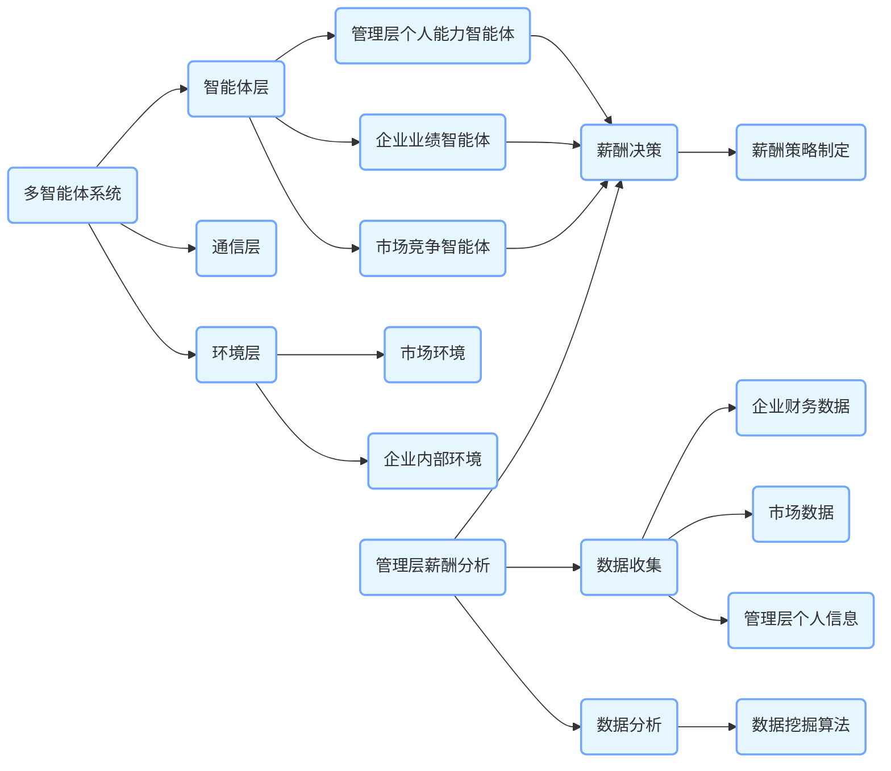

# 利用多智能体系统进行全面的管理层薪酬分析

> 关键词：多智能体系统、管理层薪酬分析、人工智能、数据分析、薪酬决策

> 摘要：本文聚焦于利用多智能体系统进行全面的管理层薪酬分析。首先介绍了研究的背景、目的、预期读者和文档结构，阐述了相关术语。接着深入探讨了多智能体系统和管理层薪酬分析的核心概念及其联系，给出了原理和架构的文本示意图与 Mermaid 流程图。详细讲解了核心算法原理，并用 Python 代码进行了说明，同时给出了数学模型和公式及具体举例。通过项目实战，展示了开发环境搭建、源代码实现与解读。分析了该方法的实际应用场景，推荐了学习资源、开发工具框架和相关论文著作。最后总结了未来发展趋势与挑战，提供了常见问题解答和扩展阅读参考资料，旨在为利用多智能体系统进行管理层薪酬分析提供全面且深入的技术指导。

## 1. 背景介绍 
### 1.1 目的和范围
管理层薪酬分析是企业治理中的关键环节，合理的薪酬设计能够激励管理层提升企业绩效，同时保障股东利益。传统的管理层薪酬分析方法往往依赖于单一的数据来源和简单的统计模型，难以全面考虑复杂的内外部因素。本研究的目的是利用多智能体系统，综合考虑多种因素，实现对管理层薪酬的全面、动态分析。

本研究的范围涵盖了多智能体系统在管理层薪酬分析中的应用原理、算法实现、实际案例分析等方面。通过建立多智能体模型，模拟不同因素对管理层薪酬的影响，为企业制定合理的薪酬策略提供科学依据。

### 1.2 预期读者
本文的预期读者包括企业高管、人力资源专家、薪酬设计师、数据分析师以及对人工智能在企业管理中应用感兴趣的研究人员。对于企业高管和人力资源专家，本文提供了一种新的薪酬分析思路和方法，有助于优化企业的薪酬体系；对于数据分析师和研究人员，本文详细介绍了多智能体系统的原理和实现，为相关领域的研究提供了参考。

### 1.3 文档结构概述
本文共分为十个部分。第一部分介绍研究的背景、目的、预期读者和文档结构；第二部分阐述多智能体系统和管理层薪酬分析的核心概念及其联系，并给出相关示意图和流程图；第三部分讲解核心算法原理，并用 Python 代码进行详细说明；第四部分给出数学模型和公式，并进行详细讲解和举例；第五部分通过项目实战，展示开发环境搭建、源代码实现与解读；第六部分分析该方法的实际应用场景；第七部分推荐学习资源、开发工具框架和相关论文著作；第八部分总结未来发展趋势与挑战；第九部分提供常见问题解答；第十部分给出扩展阅读和参考资料。

### 1.4 术语表
#### 1.4.1 核心术语定义
- **多智能体系统（Multi - Agent System，MAS）**：由多个自主智能体组成的系统，这些智能体可以相互交互、协作，以实现共同或各自的目标。在管理层薪酬分析中，每个智能体可以代表不同的影响因素或决策主体。
- **管理层薪酬**：企业为管理层人员支付的各种报酬，包括基本工资、奖金、股票期权等。
- **智能体（Agent）**：具有自主性、反应性、社会性和主动性的实体，能够感知环境并根据自身的目标和规则进行决策和行动。

#### 1.4.2 相关概念解释
- **自主性**：智能体能够独立地进行决策和行动，不受外部直接控制。
- **反应性**：智能体能够对环境的变化做出及时的反应。
- **社会性**：智能体能够与其他智能体进行交互和协作。
- **主动性**：智能体能够主动地追求自身的目标。

#### 1.4.3 缩略词列表
- MAS：Multi - Agent System（多智能体系统）
- AI：Artificial Intelligence（人工智能）

## 2. 核心概念与联系 

### 2.1 多智能体系统原理
多智能体系统是人工智能领域的一个重要分支，它由多个智能体组成，每个智能体具有一定的自主性和智能性。智能体之间可以通过通信、协作等方式相互作用，共同完成复杂的任务。在多智能体系统中，智能体的行为可以基于规则、学习或两者的结合。

多智能体系统的架构通常包括以下几个部分：
- **智能体层**：包含多个智能体，每个智能体具有自己的感知、决策和行动能力。
- **通信层**：负责智能体之间的信息传递和交互。
- **环境层**：智能体所处的外部环境，智能体可以感知环境的状态并对其做出反应。

### 2.2 管理层薪酬分析原理
管理层薪酬分析旨在确定合理的管理层薪酬水平和结构，以激励管理层为企业创造价值。传统的管理层薪酬分析主要考虑企业的财务指标，如净利润、营业收入等。然而，现代的薪酬分析需要综合考虑更多的因素，如市场竞争、行业特点、管理层的个人能力和业绩等。

管理层薪酬分析的过程通常包括以下几个步骤：
- **数据收集**：收集与管理层薪酬相关的数据，包括企业财务数据、市场数据、管理层个人信息等。
- **数据分析**：对收集到的数据进行分析，挖掘数据中的规律和关系。
- **薪酬决策**：根据数据分析的结果，制定合理的管理层薪酬策略。

### 2.3 两者的联系
多智能体系统可以为管理层薪酬分析提供一种新的方法和视角。在多智能体系统中，每个智能体可以代表不同的影响因素，如市场竞争、企业业绩、管理层个人能力等。智能体之间通过交互和协作，模拟这些因素之间的复杂关系，从而实现对管理层薪酬的全面、动态分析。

例如，一个代表市场竞争的智能体可以感知市场的变化，并将这些信息传递给其他智能体。其他智能体根据这些信息调整自己的行为，从而影响管理层薪酬的决策。通过这种方式，多智能体系统可以综合考虑多种因素，提高管理层薪酬分析的准确性和科学性。

### 2.4 文本示意图
```plaintext
多智能体系统
|-- 智能体层
|   |-- 市场竞争智能体
|   |-- 企业业绩智能体
|   |-- 管理层个人能力智能体
|   |-- ...
|-- 通信层
|   |-- 信息传递通道
|-- 环境层
|   |-- 市场环境
|   |-- 企业内部环境

管理层薪酬分析
|-- 数据收集
|   |-- 企业财务数据
|   |-- 市场数据
|   |-- 管理层个人信息
|-- 数据分析
|   |-- 数据挖掘算法
|-- 薪酬决策
|   |-- 薪酬策略制定

多智能体系统与管理层薪酬分析的联系
|-- 市场竞争智能体 --> 影响薪酬决策
|-- 企业业绩智能体 --> 影响薪酬决策
|-- 管理层个人能力智能体 --> 影响薪酬决策
```

### 2.5 Mermaid 流程图


## 3. 核心算法原理 & 具体操作步骤 

### 3.1 核心算法原理
在利用多智能体系统进行管理层薪酬分析时，主要涉及到智能体的决策算法和智能体之间的交互算法。

#### 3.1.1 智能体决策算法
每个智能体根据自身的目标和规则进行决策。例如，市场竞争智能体可以根据市场份额、竞争对手的薪酬水平等因素，确定一个市场竞争系数。企业业绩智能体可以根据企业的净利润、营业收入等指标，确定一个企业业绩系数。管理层个人能力智能体可以根据管理层的学历、工作经验、业绩表现等因素，确定一个个人能力系数。

智能体的决策算法可以采用基于规则的方法或机器学习的方法。基于规则的方法是根据预先定义的规则进行决策，而机器学习的方法是通过对历史数据的学习，自动生成决策规则。

#### 3.1.2 智能体交互算法
智能体之间通过通信层进行信息交互。当一个智能体感知到环境的变化时，它会将相关信息传递给其他智能体。其他智能体根据接收到的信息，调整自己的决策。

智能体交互算法可以采用基于消息传递的方法。每个智能体可以发送和接收消息，消息中包含了智能体的状态信息和决策信息。

### 3.2 具体操作步骤

#### 3.2.1 定义智能体
首先，需要定义不同类型的智能体，如市场竞争智能体、企业业绩智能体、管理层个人能力智能体等。每个智能体需要定义自己的属性和行为。

```python
class Agent:
    def __init__(self, name):
        self.name = name
        self.state = {}

    def perceive(self, environment):
        # 感知环境
        pass

    def decide(self):
        # 决策
        pass

    def communicate(self, other_agents):
        # 与其他智能体通信
        pass


class MarketCompetitionAgent(Agent):
    def __init__(self):
        super().__init__("MarketCompetitionAgent")

    def perceive(self, environment):
        # 感知市场竞争环境
        market_share = environment.get("market_share")
        competitor_salary = environment.get("competitor_salary")
        self.state["market_share"] = market_share
        self.state["competitor_salary"] = competitor_salary

    def decide(self):
        # 计算市场竞争系数
        market_share = self.state.get("market_share")
        competitor_salary = self.state.get("competitor_salary")
        market_competition_coefficient = market_share * competitor_salary
        return market_competition_coefficient


class CompanyPerformanceAgent(Agent):
    def __init__(self):
        super().__init__("CompanyPerformanceAgent")

    def perceive(self, environment):
        # 感知企业业绩环境
        net_profit = environment.get("net_profit")
        operating_income = environment.get("operating_income")
        self.state["net_profit"] = net_profit
        self.state["operating_income"] = operating_income

    def decide(self):
        # 计算企业业绩系数
        net_profit = self.state.get("net_profit")
        operating_income = self.state.get("operating_income")
        company_performance_coefficient = net_profit * operating_income
        return company_performance_coefficient


class ManagementAbilityAgent(Agent):
    def __init__(self):
        super().__init__("ManagementAbilityAgent")

    def perceive(self, environment):
        # 感知管理层个人能力环境
        education = environment.get("education")
        work_experience = environment.get("work_experience")
        performance = environment.get("performance")
        self.state["education"] = education
        self.state["work_experience"] = work_experience
        self.state["performance"] = performance

    def decide(self):
        # 计算管理层个人能力系数
        education = self.state.get("education")
        work_experience = self.state.get("work_experience")
        performance = self.state.get("performance")
        management_ability_coefficient = education * work_experience * performance
        return management_ability_coefficient
```

#### 3.2.2 初始化环境
创建一个环境对象，用于存储智能体感知到的环境信息。

```python
environment = {
    "market_share": 0.5,
    "competitor_salary": 10000,
    "net_profit": 1000000,
    "operating_income": 2000000,
    "education": 3,
    "work_experience": 5,
    "performance": 0.8
}
```

#### 3.2.3 创建智能体实例
创建不同类型的智能体实例。

```python
market_competition_agent = MarketCompetitionAgent()
company_performance_agent = CompanyPerformanceAgent()
management_ability_agent = ManagementAbilityAgent()
```

#### 3.2.4 智能体感知环境
每个智能体感知环境信息，并更新自己的状态。

```python
market_competition_agent.perceive(environment)
company_performance_agent.perceive(environment)
management_ability_agent.perceive(environment)
```

#### 3.2.5 智能体决策
每个智能体根据自己的状态进行决策。

```python
market_competition_coefficient = market_competition_agent.decide()
company_performance_coefficient = company_performance_agent.decide()
management_ability_coefficient = management_ability_agent.decide()
```

#### 3.2.6 综合决策
根据各个智能体的决策结果，进行综合决策，确定管理层薪酬。

```python
base_salary = 50000
total_coefficient = market_competition_coefficient + company_performance_coefficient + management_ability_coefficient
management_salary = base_salary * total_coefficient
print(f"管理层薪酬: {management_salary}")
```

## 4. 数学模型和公式 & 详细讲解 & 举例说明 

### 4.1 数学模型
在利用多智能体系统进行管理层薪酬分析时，可以建立以下数学模型：

设 $S$ 为管理层薪酬，$S_0$ 为基本工资，$C_1$ 为市场竞争系数，$C_2$ 为企业业绩系数，$C_3$ 为管理层个人能力系数，则有：

$$S = S_0\times(C_1 + C_2 + C_3)$$

### 4.2 公式详细讲解

#### 4.2.1 市场竞争系数 $C_1$
市场竞争系数 $C_1$ 反映了市场竞争对管理层薪酬的影响。可以定义为：

$$C_1 = M\times R$$

其中，$M$ 为市场份额，$R$ 为竞争对手的薪酬水平。市场份额越大，竞争对手的薪酬水平越高，市场竞争系数就越大，管理层薪酬也相应增加。

#### 4.2.2 企业业绩系数 $C_2$
企业业绩系数 $C_2$ 反映了企业业绩对管理层薪酬的影响。可以定义为：

$$C_2 = P\times I$$

其中，$P$ 为企业的净利润，$I$ 为企业的营业收入。企业的净利润和营业收入越高，企业业绩系数就越大，管理层薪酬也相应增加。

#### 4.2.3 管理层个人能力系数 $C_3$
管理层个人能力系数 $C_3$ 反映了管理层个人能力对管理层薪酬的影响。可以定义为：

$$C_3 = E\times W\times K$$

其中，$E$ 为管理层的学历，$W$ 为管理层的工作经验，$K$ 为管理层的业绩表现。管理层的学历越高，工作经验越丰富，业绩表现越好，管理层个人能力系数就越大，管理层薪酬也相应增加。

### 4.3 举例说明
假设基本工资 $S_0 = 50000$，市场份额 $M = 0.5$，竞争对手的薪酬水平 $R = 10000$，企业的净利润 $P = 1000000$，企业的营业收入 $I = 2000000$，管理层的学历 $E = 3$，管理层的工作经验 $W = 5$，管理层的业绩表现 $K = 0.8$。

首先，计算市场竞争系数 $C_1$：

$$C_1 = M\times R = 0.5\times10000 = 5000$$

然后，计算企业业绩系数 $C_2$：

$$C_2 = P\times I = 1000000\times2000000 = 2\times10^{12}$$

接着，计算管理层个人能力系数 $C_3$：

$$C_3 = E\times W\times K = 3\times5\times0.8 = 12$$

最后，计算管理层薪酬 $S$：

$$S = S_0\times(C_1 + C_2 + C_3)=50000\times(5000 + 2\times10^{12}+ 12)\approx1\times10^{18}$$

在实际应用中，需要对这些系数进行归一化处理，以避免数值过大或过小的问题。

## 5. 项目实战：代码实际案例和详细解释说明 

### 5.1  开发环境搭建
#### 5.1.1 安装 Python
首先，需要安装 Python 编程语言。可以从 Python 官方网站（https://www.python.org/downloads/）下载适合自己操作系统的 Python 安装包，并按照安装向导进行安装。

#### 5.1.2 安装必要的库
在利用多智能体系统进行管理层薪酬分析时，可能需要使用一些 Python 库，如 NumPy、Pandas 等。可以使用以下命令进行安装：

```bash
pip install numpy pandas
```

### 5.2  源代码详细实现和代码解读
以下是一个完整的 Python 代码示例，用于利用多智能体系统进行管理层薪酬分析：

```python
import numpy as np

# 定义智能体类
class Agent:
    def __init__(self, name):
        self.name = name
        self.state = {}

    def perceive(self, environment):
        # 感知环境
        pass

    def decide(self):
        # 决策
        pass

    def communicate(self, other_agents):
        # 与其他智能体通信
        pass


class MarketCompetitionAgent(Agent):
    def __init__(self):
        super().__init__("MarketCompetitionAgent")

    def perceive(self, environment):
        # 感知市场竞争环境
        market_share = environment.get("market_share")
        competitor_salary = environment.get("competitor_salary")
        self.state["market_share"] = market_share
        self.state["competitor_salary"] = competitor_salary

    def decide(self):
        # 计算市场竞争系数
        market_share = self.state.get("market_share")
        competitor_salary = self.state.get("competitor_salary")
        market_competition_coefficient = market_share * competitor_salary
        return market_competition_coefficient


class CompanyPerformanceAgent(Agent):
    def __init__(self):
        super().__init__("CompanyPerformanceAgent")

    def perceive(self, environment):
        # 感知企业业绩环境
        net_profit = environment.get("net_profit")
        operating_income = environment.get("operating_income")
        self.state["net_profit"] = net_profit
        self.state["operating_income"] = operating_income

    def decide(self):
        # 计算企业业绩系数
        net_profit = self.state.get("net_profit")
        operating_income = self.state.get("operating_income")
        company_performance_coefficient = net_profit * operating_income
        return company_performance_coefficient


class ManagementAbilityAgent(Agent):
    def __init__(self):
        super().__init__("ManagementAbilityAgent")

    def perceive(self, environment):
        # 感知管理层个人能力环境
        education = environment.get("education")
        work_experience = environment.get("work_experience")
        performance = environment.get("performance")
        self.state["education"] = education
        self.state["work_experience"] = work_experience
        self.state["performance"] = performance

    def decide(self):
        # 计算管理层个人能力系数
        education = self.state.get("education")
        work_experience = self.state.get("work_experience")
        performance = self.state.get("performance")
        management_ability_coefficient = education * work_experience * performance
        return management_ability_coefficient


# 初始化环境
environment = {
    "market_share": 0.5,
    "competitor_salary": 10000,
    "net_profit": 1000000,
    "operating_income": 2000000,
    "education": 3,
    "work_experience": 5,
    "performance": 0.8
}

# 创建智能体实例
market_competition_agent = MarketCompetitionAgent()
company_performance_agent = CompanyPerformanceAgent()
management_ability_agent = ManagementAbilityAgent()

# 智能体感知环境
market_competition_agent.perceive(environment)
company_performance_agent.perceive(environment)
management_ability_agent.perceive(environment)

# 智能体决策
market_competition_coefficient = market_competition_agent.decide()
company_performance_coefficient = company_performance_agent.decide()
management_ability_coefficient = management_ability_agent.decide()

# 综合决策
base_salary = 50000
total_coefficient = market_competition_coefficient + company_performance_coefficient + management_ability_coefficient
management_salary = base_salary * total_coefficient
print(f"管理层薪酬: {management_salary}")
```

### 5.3  代码解读与分析
#### 5.3.1 智能体类的定义
- `Agent` 类是所有智能体的基类，定义了智能体的基本属性和方法，如 `perceive` 方法用于感知环境，`decide` 方法用于决策，`communicate` 方法用于与其他智能体通信。
- `MarketCompetitionAgent` 类继承自 `Agent` 类，用于处理市场竞争相关的信息，计算市场竞争系数。
- `CompanyPerformanceAgent` 类继承自 `Agent` 类，用于处理企业业绩相关的信息，计算企业业绩系数。
- `ManagementAbilityAgent` 类继承自 `Agent` 类，用于处理管理层个人能力相关的信息，计算管理层个人能力系数。

#### 5.3.2 环境初始化
创建一个字典 `environment`，用于存储智能体感知到的环境信息，包括市场份额、竞争对手的薪酬水平、企业的净利润、营业收入、管理层的学历、工作经验和业绩表现等。

#### 5.3.3 智能体实例化和环境感知
创建不同类型的智能体实例，并调用它们的 `perceive` 方法，使智能体感知环境信息，并更新自己的状态。

#### 5.3.4 智能体决策
调用每个智能体的 `decide` 方法，计算市场竞争系数、企业业绩系数和管理层个人能力系数。

#### 5.3.5 综合决策
根据各个智能体的决策结果，计算总系数，并根据基本工资和总系数计算管理层薪酬。

## 6. 实际应用场景 
### 6.1 企业薪酬设计
在企业进行管理层薪酬设计时，利用多智能体系统可以综合考虑市场竞争、企业业绩和管理层个人能力等多种因素，制定更加合理的薪酬策略。例如，当市场竞争激烈时，企业可以通过提高管理层薪酬来吸引和留住优秀的管理人才；当企业业绩良好时，也可以适当提高管理层薪酬，以激励他们继续为企业创造价值。

### 6.2 薪酬调整
在企业运营过程中，市场环境、企业业绩和管理层个人能力等因素都会发生变化。利用多智能体系统可以实时监测这些变化，并根据变化情况及时调整管理层薪酬。例如，当企业的市场份额下降时，市场竞争智能体可以感知到这一变化，并将信息传递给其他智能体，从而促使企业降低管理层薪酬，以控制成本。

### 6.3 薪酬比较分析
企业可以利用多智能体系统对不同企业或不同行业的管理层薪酬进行比较分析。通过模拟不同企业的市场竞争、企业业绩和管理层个人能力等因素，分析这些因素对管理层薪酬的影响，从而为企业制定合理的薪酬水平提供参考。

### 6.4 风险管理
多智能体系统可以帮助企业识别管理层薪酬设计中的风险。例如，如果企业的管理层薪酬过高，可能会导致股东利益受损；如果管理层薪酬过低，可能会导致管理人才流失。通过多智能体系统的模拟和分析，企业可以提前发现这些风险，并采取相应的措施进行防范。

## 7. 工具和资源推荐
### 7.1 学习资源推荐
#### 7.1.1 书籍推荐
- 《多智能体系统：原理、算法与应用》：本书系统地介绍了多智能体系统的基本原理、算法和应用，是学习多智能体系统的经典教材。
- 《人工智能：一种现代的方法》：这本书涵盖了人工智能的各个领域，包括多智能体系统，对多智能体系统的理论和实践进行了深入的探讨。
- 《薪酬管理》：该书全面介绍了薪酬管理的理论和实践，包括管理层薪酬设计的方法和技巧，对于理解管理层薪酬分析有很大的帮助。

#### 7.2.2 在线课程
- Coursera 上的“Multi - Agent Systems”课程：由知名教授授课，详细介绍了多智能体系统的原理和应用。
- edX 上的“Artificial Intelligence”课程：涵盖了人工智能的多个方面，包括多智能体系统，课程内容丰富，适合初学者和有一定基础的学习者。
- 中国大学 MOOC 上的“薪酬管理”课程：由国内高校的教师授课，结合中国企业的实际情况，讲解了薪酬管理的理论和实践。

#### 7.2.3 技术博客和网站
- AI 社区：提供了大量关于人工智能和多智能体系统的技术文章和案例，是学习和交流的好平台。
- 数据科学网：涵盖了数据分析、机器学习等领域的知识，对于理解管理层薪酬分析中的数据处理和建模有很大的帮助。
- 人力资源管理网：专注于人力资源管理领域的资讯和知识，提供了很多关于薪酬管理的实用文章和案例。

### 7.2 开发工具框架推荐
#### 7.2.1 IDE和编辑器
- PyCharm：是一款专业的 Python 集成开发环境，具有代码编辑、调试、版本控制等功能，非常适合开发多智能体系统相关的 Python 代码。
- Jupyter Notebook：是一个交互式的开发环境，支持 Python 等多种编程语言，适合进行数据分析和模型实验。
- Visual Studio Code：是一款轻量级的代码编辑器，支持多种编程语言和插件，具有丰富的扩展功能，可用于开发多智能体系统。

#### 7.2.2 调试和性能分析工具
- PDB：Python 自带的调试工具，可以帮助开发者逐步执行代码，查找和解决问题。
- cProfile：Python 的性能分析工具，可以分析代码的运行时间和函数调用情况，帮助开发者优化代码性能。
- Py-Spy：是一个轻量级的 Python 性能分析工具，可以实时监控 Python 程序的性能，找出性能瓶颈。

#### 7.2.3 相关框架和库
- Mesa：是一个用于开发多智能体系统的 Python 框架，提供了丰富的智能体模型和可视化工具，方便开发者快速搭建多智能体系统。
- NumPy：是 Python 中用于科学计算的基础库，提供了高效的数组操作和数学函数，可用于处理多智能体系统中的数据。
- Pandas：是 Python 中用于数据处理和分析的库，提供了灵活的数据结构和数据操作方法，可用于管理和分析多智能体系统中的数据。

### 7.3 相关论文著作推荐
#### 7.3.1 经典论文
- “Multi - Agent Systems: A Survey from a Machine Learning Perspective”：该论文从机器学习的角度对多智能体系统进行了全面的综述，介绍了多智能体系统的研究现状和发展趋势。
- “A Taxonomy for Multi - Agent System Architectures”：提出了一种多智能体系统架构的分类方法，对于理解多智能体系统的架构设计有很大的帮助。
- “Executive Compensation: A Survey of Theory and Evidence”：对管理层薪酬的理论和实证研究进行了综述，分析了影响管理层薪酬的各种因素。

#### 7.3.2 最新研究成果
- 关注顶级学术会议如 IJCAI（国际人工智能联合会议）、AAMAS（自治个体和多智能体系统国际会议）上关于多智能体系统的最新研究成果，了解多智能体系统在管理层薪酬分析中的应用的最新进展。
- 查阅学术期刊如《Artificial Intelligence》、《Journal of Management》等，获取关于人工智能和管理层薪酬分析的最新研究论文。

#### 7.3.3 应用案例分析
- 一些咨询公司和研究机构会发布关于企业管理层薪酬分析的应用案例报告，可以通过他们的官方网站或专业数据库获取这些报告，了解多智能体系统在实际企业中的应用情况和效果。

## 8. 总结：未来发展趋势与挑战
### 8.1 未来发展趋势
#### 8.1.1 与大数据和人工智能的深度融合
随着大数据技术的发展，企业可以收集到更多与管理层薪酬相关的数据，如市场动态、员工绩效、行业趋势等。多智能体系统可以与大数据技术相结合，对这些海量数据进行分析和挖掘，从而更准确地评估管理层的价值和贡献。同时，人工智能技术如深度学习、强化学习等也可以应用到多智能体系统中，提高智能体的决策能力和适应性。

#### 8.1.2 跨领域应用拓展
多智能体系统在管理层薪酬分析中的应用可以拓展到其他领域，如供应链管理、市场营销、金融投资等。在这些领域中，多智能体系统可以模拟不同主体之间的交互和决策过程，为企业提供更加科学的决策支持。

#### 8.1.3 可视化和交互性增强
未来的多智能体系统将更加注重可视化和交互性。通过可视化技术，企业可以直观地展示多智能体系统的运行过程和分析结果，帮助决策者更好地理解和应用这些结果。同时，交互性的增强可以让决策者与多智能体系统进行实时互动，根据实际情况调整模型和参数，提高决策的灵活性和准确性。

### 8.2 挑战
#### 8.2.1 数据质量和安全问题
多智能体系统的运行依赖于大量的数据，数据的质量和安全直接影响到分析结果的准确性和可靠性。企业在收集和使用数据时，需要确保数据的真实性、完整性和及时性。同时，要加强数据安全保护，防止数据泄露和滥用。

#### 8.2.2 模型复杂度和可解释性
随着多智能体系统的不断发展，模型的复杂度也会不断增加。复杂的模型虽然可以提高分析的准确性，但也会降低模型的可解释性。决策者需要理解模型的运行机制和分析结果，才能做出合理的决策。因此，如何在提高模型准确性的同时，保持模型的可解释性是一个需要解决的问题。

#### 8.2.3 伦理和法律问题
多智能体系统在管理层薪酬分析中的应用可能会涉及到一些伦理和法律问题。例如，模型的决策结果可能会对管理层的利益产生影响，需要确保决策的公平性和合法性。同时，智能体的自主决策可能会引发一些伦理争议，如智能体的行为是否符合道德规范等。

## 9. 附录：常见问题与解答
### 9.1 多智能体系统在管理层薪酬分析中的优势是什么？
多智能体系统可以综合考虑多种因素，如市场竞争、企业业绩、管理层个人能力等，实现对管理层薪酬的全面、动态分析。与传统的薪酬分析方法相比，多智能体系统具有更高的准确性和灵活性，能够更好地适应复杂多变的市场环境。

### 9.2 如何选择合适的智能体类型和数量？
选择合适的智能体类型和数量需要根据具体的分析需求和问题来确定。一般来说，需要考虑影响管理层薪酬的主要因素，如市场竞争、企业业绩、管理层个人能力等，并为每个因素设计相应的智能体。智能体的数量也不宜过多，以免增加模型的复杂度和计算成本。

### 9.3 多智能体系统的计算复杂度高吗？
多智能体系统的计算复杂度取决于智能体的数量、智能体之间的交互方式和决策算法的复杂度。在实际应用中，可以通过优化算法、并行计算等方法来降低计算复杂度，提高系统的运行效率。

### 9.4 如何验证多智能体系统的分析结果？
可以通过与实际数据进行对比分析、进行敏感性分析等方法来验证多智能体系统的分析结果。同时，可以邀请专家对分析结果进行评估和验证，确保结果的准确性和可靠性。

### 9.5 多智能体系统在不同行业的应用有什么差异？
不同行业的市场竞争环境、企业业绩评价标准和管理层个人能力要求等都有所不同，因此多智能体系统在不同行业的应用也会存在差异。在应用多智能体系统进行管理层薪酬分析时，需要根据不同行业的特点，调整智能体的决策规则和参数，以适应行业的需求。

## 10. 扩展阅读 & 参考资料
### 10.1 扩展阅读
- 《智能系统原理与应用》：进一步深入介绍了智能系统的原理和应用，包括多智能体系统的高级技术和算法。
- 《企业战略管理》：从企业战略的角度出发，探讨了管理层薪酬设计与企业战略的关系，为管理层薪酬分析提供了更宏观的视角。
- 《数据分析实战》：介绍了数据分析的实际应用案例和方法，对于理解如何处理和分析管理层薪酬相关的数据有很大的帮助。

### 10.2 参考资料
- 相关学术期刊和会议论文，如《Artificial Intelligence》、《Journal of Management》、IJCAI、AAMAS 等。
- 咨询公司和研究机构发布的关于企业管理层薪酬分析的报告。
- 专业书籍，如《多智能体系统：原理、算法与应用》、《人工智能：一种现代的方法》、《薪酬管理》等。