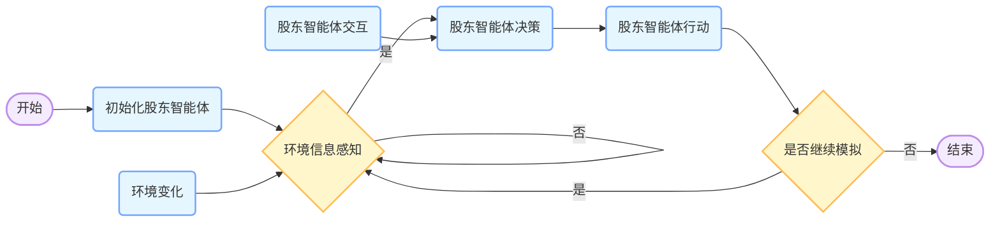

# 利用多智能体系统进行全面的股东结构分析

> 关键词：多智能体系统、股东结构分析、复杂系统建模、人工智能、数据分析

> 摘要：本文旨在探讨如何利用多智能体系统对股东结构进行全面分析。多智能体系统作为一种强大的建模工具，能够模拟股东之间复杂的交互关系和行为。通过详细介绍多智能体系统的核心概念、算法原理、数学模型，并结合实际项目案例，展示了其在股东结构分析中的应用。同时，分析了该方法在实际场景中的应用情况，推荐了相关的学习资源、开发工具和论文著作，最后对未来的发展趋势和挑战进行了总结，并提供了常见问题解答和扩展阅读参考资料。

## 1. 背景介绍 
### 1.1 目的和范围
股东结构分析对于企业的治理、决策以及投资者的投资策略都具有至关重要的意义。传统的股东结构分析方法往往侧重于静态的数据统计和简单的比例计算，难以全面反映股东之间复杂的动态关系和交互行为。本研究的目的是引入多智能体系统，通过模拟股东的行为和交互，实现对股东结构的全面、动态分析。研究范围涵盖了多智能体系统在股东结构分析中的理论基础、算法实现、实际应用等方面。

### 1.2 预期读者
本文的预期读者包括金融分析师、企业管理者、投资者、人工智能和计算机科学领域的研究人员和开发者。对于金融领域的专业人士，本文将提供一种新的分析视角和工具；对于技术领域的人员，本文将展示多智能体系统在金融领域的具体应用案例。

### 1.3 文档结构概述
本文将首先介绍多智能体系统和股东结构分析的相关核心概念，并阐述它们之间的联系。接着详细讲解多智能体系统用于股东结构分析的核心算法原理和具体操作步骤，同时给出相应的数学模型和公式。然后通过实际项目案例，展示如何运用多智能体系统进行股东结构分析。之后探讨该方法在实际场景中的应用情况，并推荐相关的学习资源、开发工具和论文著作。最后对未来的发展趋势和挑战进行总结，并提供常见问题解答和扩展阅读参考资料。

### 1.4 术语表
#### 1.4.1 核心术语定义
- **多智能体系统（Multi - Agent System, MAS）**：由多个自主的智能体组成的系统，这些智能体能够感知环境、进行决策并采取行动，通过相互之间的交互来实现系统的整体目标。
- **股东结构**：指公司股东的构成情况，包括股东的类型、持股比例、股东之间的关系等。
- **智能体（Agent）**：在多智能体系统中，具有自主性、反应性、社会性和能动性的实体，能够根据自身的知识和目标进行决策和行动。

#### 1.4.2 相关概念解释
- **自主性**：智能体能够在没有外部直接干预的情况下，独立地进行决策和行动。
- **反应性**：智能体能够感知环境的变化，并及时做出相应的反应。
- **社会性**：智能体能够与其他智能体进行交互和通信，以实现共同的目标或解决问题。
- **能动性**：智能体能够主动地追求自己的目标，而不仅仅是对环境的被动反应。

#### 1.4.3 缩略词列表
- MAS：Multi - Agent System（多智能体系统）

## 2. 核心概念与联系 
### 2.1 多智能体系统的原理
多智能体系统的核心思想是将复杂的系统分解为多个相对简单的智能体，每个智能体具有一定的自主性和智能性。智能体通过感知环境、与其他智能体进行交互，不断调整自己的行为，以实现系统的整体目标。

智能体的基本结构包括感知模块、决策模块和行动模块。感知模块用于获取环境信息，决策模块根据感知到的信息和自身的目标进行决策，行动模块则根据决策结果采取相应的行动。

### 2.2 股东结构分析的要点
股东结构分析主要关注股东的类型（如机构投资者、个人投资者等）、持股比例、股东之间的关系（如关联关系、控股关系等）以及股东的行为（如增持、减持等）。通过对这些要点的分析，可以了解公司的控制权分布、决策机制以及潜在的风险。

### 2.3 多智能体系统与股东结构分析的联系
在股东结构分析中，可以将每个股东视为一个智能体。股东智能体具有自主性，能够根据自身的利益和目标（如追求利润最大化、控制公司等）进行决策，如决定是否增持或减持股份。股东智能体之间存在着复杂的交互关系，例如竞争关系（争夺公司控制权）、合作关系（联合行动以影响公司决策）等。

通过多智能体系统，可以模拟股东之间的这些交互行为，从而更全面、动态地分析股东结构。例如，在不同的市场环境下，股东智能体的行为会发生变化，通过模拟这些变化，可以预测股东结构的演变趋势。

### 2.4 文本示意图
多智能体系统在股东结构分析中的应用可以用以下文本描述：

多智能体系统由多个股东智能体和环境组成。股东智能体包括感知模块，用于感知市场信息、公司业绩等环境信息；决策模块，根据感知到的信息和自身目标进行增持、减持或保持股份的决策；行动模块，执行决策结果。股东智能体之间通过交互模块进行信息交流和合作或竞争行为。环境包括市场环境、公司治理环境等，会影响股东智能体的决策和行为。

### 2.5 Mermaid 流程图


## 3. 核心算法原理 & 具体操作步骤 
### 3.1 核心算法原理
在利用多智能体系统进行股东结构分析时，主要采用基于规则的算法和机器学习算法相结合的方法。

#### 3.1.1 基于规则的算法
基于规则的算法是根据预先定义的规则来指导股东智能体的决策。例如，当公司业绩增长超过一定比例时，机构投资者智能体可能会选择增持股份；当市场利率上升时，个人投资者智能体可能会选择减持股份。

以下是一个简单的基于规则的算法示例，用于判断股东智能体是否增持股份：

```python
def should_increase_shares(company_performance, market_interest_rate, agent_type):
    if agent_type == 'institutional':
        if company_performance > 0.1:  # 公司业绩增长超过 10%
            return True
    elif agent_type == 'individual':
        if market_interest_rate < 0.05:  # 市场利率低于 5%
            return True
    return False
```

#### 3.1.2 机器学习算法
机器学习算法可以用于学习股东智能体的行为模式和决策规律。例如，可以使用神经网络算法来预测股东智能体在不同环境下的决策。

以下是一个简单的神经网络模型示例，用于预测股东智能体是否增持股份：

```python
import tensorflow as tf
from tensorflow.keras.models import Sequential
from tensorflow.keras.layers import Dense

# 构建神经网络模型
model = Sequential([
    Dense(10, input_shape=(2,), activation='relu'),
    Dense(1, activation='sigmoid')
])

# 编译模型
model.compile(optimizer='adam', loss='binary_crossentropy', metrics=['accuracy'])

# 示例数据
import numpy as np
X = np.array([[0.15, 0.03], [0.05, 0.06]])  # 公司业绩和市场利率
y = np.array([1, 0])  # 是否增持股份

# 训练模型
model.fit(X, y, epochs=100, batch_size=1)

# 预测
new_data = np.array([[0.2, 0.02]])
prediction = model.predict(new_data)
print("预测结果:", prediction)
```

### 3.2 具体操作步骤
#### 3.2.1 数据收集
收集股东的基本信息（如类型、初始持股比例等）、公司的财务数据（如业绩、资产负债表等）、市场环境数据（如市场利率、行业指数等）。

#### 3.2.2 智能体建模
根据股东的类型和行为特点，建立不同类型的股东智能体模型。每个智能体模型包括感知模块、决策模块和行动模块。

#### 3.2.3 规则定义
定义股东智能体的决策规则，这些规则可以基于领域知识和经验。同时，使用机器学习算法对规则进行优化和调整。

#### 3.2.4 模拟运行
在模拟环境中运行多智能体系统，让股东智能体根据感知到的环境信息进行决策和行动。记录每个时间步的股东结构变化。

#### 3.2.5 结果分析
对模拟运行的结果进行分析，包括股东持股比例的变化、股东之间关系的演变等。根据分析结果，评估公司的股东结构稳定性和潜在风险。

## 4. 数学模型和公式 & 详细讲解 & 举例说明 
### 4.1 股东智能体的决策模型
股东智能体的决策可以用效用函数来表示。假设股东智能体 $i$ 的效用函数为 $U_i$，它取决于多个因素，如公司的业绩 $P$、市场利率 $r$、股东自身的持股比例 $s_i$ 等。

$$U_i = f(P, r, s_i, \cdots)$$

其中，$f$ 是一个非线性函数。例如，一种简单的效用函数可以表示为：

$$U_i = \alpha P + \beta r + \gamma s_i$$

其中，$\alpha$、$\beta$ 和 $\gamma$ 是权重系数，分别表示公司业绩、市场利率和持股比例对股东效用的影响程度。

股东智能体在决策时，会选择使自身效用最大化的行动。例如，如果增持股份后的效用 $U_{i1}$ 大于不增持股份的效用 $U_{i0}$，则股东智能体 $i$ 会选择增持股份。

### 4.2 股东之间的交互模型
股东之间的交互可以用博弈论模型来描述。例如，在争夺公司控制权的情况下，股东之间的交互可以看作是一个非合作博弈。

假设股东 $A$ 和股东 $B$ 都想争夺公司的控制权，他们可以选择增持股份或不增持股份。设股东 $A$ 增持股份的概率为 $p$，不增持股份的概率为 $1 - p$；股东 $B$ 增持股份的概率为 $q$，不增持股份的概率为 $1 - q$。

股东 $A$ 的收益矩阵可以表示为：

|  | 股东 B 增持 | 股东 B 不增持 |
| --- | --- | --- |
| 股东 A 增持 | $R_{11}$ | $R_{12}$ |
| 股东 A 不增持 | $R_{21}$ | $R_{22}$ |

其中，$R_{ij}$ 表示股东 $A$ 在不同策略组合下的收益。

股东 $A$ 的期望收益为：

$$E_A = p[qR_{11}+(1 - q)R_{12}]+(1 - p)[qR_{21}+(1 - q)R_{22}]$$

同理，股东 $B$ 的期望收益为：

$$E_B = q[pR_{11}+(1 - p)R_{21}]+(1 - q)[pR_{12}+(1 - p)R_{22}]$$

在纳什均衡状态下，股东 $A$ 和股东 $B$ 都会选择使自己期望收益最大化的策略。

### 4.3 举例说明
假设公司的业绩 $P = 0.1$，市场利率 $r = 0.03$，股东 $i$ 的持股比例 $s_i = 0.2$，权重系数 $\alpha = 0.5$，$\beta = -0.2$，$\gamma = 0.3$。

则股东 $i$ 的效用为：

$$U_i = 0.5\times0.1 - 0.2\times0.03 + 0.3\times0.2 = 0.05 - 0.006 + 0.06 = 0.104$$

假设股东 $A$ 和股东 $B$ 的收益矩阵如下：

|  | 股东 B 增持 | 股东 B 不增持 |
| --- | --- | --- |
| 股东 A 增持 | 10 | 20 |
| 股东 A 不增持 | 5 | 15 |

设股东 $A$ 增持股份的概率为 $p$，股东 $B$ 增持股份的概率为 $q$。

股东 $A$ 的期望收益为：

$$E_A = p[q\times10+(1 - q)\times20]+(1 - p)[q\times5+(1 - q)\times15]$$

$$= p(10q + 20 - 20q)+(1 - p)(5q + 15 - 15q)$$

$$= p(20 - 10q)+(1 - p)(15 - 10q)$$

$$= 20p - 10pq + 15 - 15p - 10q + 10pq$$

$$= 5p - 10q + 15$$

为了使 $E_A$ 最大化，对 $p$ 求偏导数并令其等于 0：

$$\frac{\partial E_A}{\partial p}=5 = 0$$

由于偏导数恒大于 0，所以 $p = 1$ 时，$E_A$ 取得最大值。

同理，可以求出股东 $B$ 的最优策略。

## 5. 项目实战：代码实际案例和详细解释说明 
### 5.1  开发环境搭建
#### 5.1.1 安装 Python
首先，需要安装 Python 环境。可以从 Python 官方网站（https://www.python.org/downloads/）下载适合自己操作系统的 Python 版本，并按照安装向导进行安装。

#### 5.1.2 安装必要的库
在进行多智能体系统的开发时，需要安装一些必要的 Python 库，如 `numpy`、`tensorflow`、`matplotlib` 等。可以使用以下命令进行安装：

```sh
pip install numpy tensorflow matplotlib
```

### 5.2  源代码详细实现和代码解读
以下是一个简单的多智能体系统用于股东结构分析的代码示例：

```python
import numpy as np
import matplotlib.pyplot as plt

# 定义股东智能体类
class ShareholderAgent:
    def __init__(self, agent_type, initial_shares):
        self.agent_type = agent_type
        self.shares = initial_shares
        self.decision = None

    def make_decision(self, company_performance, market_interest_rate):
        if self.agent_type == 'institutional':
            if company_performance > 0.1:
                self.decision = 'increase'
            else:
                self.decision = 'hold'
        elif self.agent_type == 'individual':
            if market_interest_rate < 0.05:
                self.decision = 'increase'
            else:
                self.decision = 'hold'

    def take_action(self):
        if self.decision == 'increase':
            self.shares += 1
        return self.shares

# 初始化股东智能体
institutional_agent = ShareholderAgent('institutional', 10)
individual_agent = ShareholderAgent('individual', 5)

# 模拟多个时间步
num_steps = 10
institutional_shares_history = []
individual_shares_history = []

for step in range(num_steps):
    # 模拟环境信息
    company_performance = np.random.uniform(0, 0.2)
    market_interest_rate = np.random.uniform(0.01, 0.1)

    # 股东智能体决策
    institutional_agent.make_decision(company_performance, market_interest_rate)
    individual_agent.make_decision(company_performance, market_interest_rate)

    # 股东智能体行动
    institutional_shares = institutional_agent.take_action()
    individual_shares = individual_agent.take_action()

    # 记录持股比例
    institutional_shares_history.append(institutional_shares)
    individual_shares_history.append(individual_shares)

# 绘制持股比例变化图
plt.plot(range(num_steps), institutional_shares_history, label='Institutional Shareholder')
plt.plot(range(num_steps), individual_shares_history, label='Individual Shareholder')
plt.xlabel('Time Step')
plt.ylabel('Number of Shares')
plt.title('Shareholder Structure Changes')
plt.legend()
plt.show()
```

### 5.3  代码解读与分析
#### 5.3.1 股东智能体类的定义
`ShareholderAgent` 类表示股东智能体，包含了股东的类型（`agent_type`）、初始持股数量（`initial_shares`）和决策（`decision`）。`make_decision` 方法根据公司业绩和市场利率进行决策，`take_action` 方法根据决策结果更新持股数量。

#### 5.3.2 模拟过程
在模拟过程中，首先初始化了一个机构投资者智能体和一个个人投资者智能体。然后在每个时间步，模拟公司业绩和市场利率，让股东智能体进行决策和行动，并记录持股数量的变化。

#### 5.3.3 结果可视化
最后，使用 `matplotlib` 库绘制持股数量随时间的变化图，直观地展示了股东结构的变化情况。

## 6. 实际应用场景 
### 6.1 企业治理
在企业治理中，利用多智能体系统进行股东结构分析可以帮助企业管理者了解股东的行为模式和利益诉求，从而制定更加合理的治理策略。例如，通过模拟股东之间的博弈行为，预测股东对公司重大决策的反应，提前做好沟通和协调工作。

### 6.2 投资者决策
对于投资者来说，多智能体系统可以帮助他们分析目标公司的股东结构稳定性和潜在风险。例如，通过模拟不同市场环境下股东的行为变化，预测公司股价的走势，从而做出更加明智的投资决策。

### 6.3 监管机构监管
监管机构可以利用多智能体系统对上市公司的股东结构进行实时监测和分析。例如，监测股东之间的关联交易和联合行动，及时发现潜在的操纵市场和内幕交易行为，维护市场的公平和稳定。

## 7. 工具和资源推荐
### 7.1 学习资源推荐
#### 7.1.1 书籍推荐
- 《多智能体系统：原理、设计与应用》：全面介绍了多智能体系统的基本原理、设计方法和应用案例，是学习多智能体系统的经典教材。
- 《金融市场微观结构理论》：深入讲解了金融市场中投资者的行为和市场机制，对于理解股东结构分析有很大的帮助。

#### 7.1.2 在线课程
- Coursera 上的“Multi - Agent Systems”课程：由知名高校的教授授课，系统地介绍了多智能体系统的理论和实践。
- edX 上的“Financial Markets”课程：提供了金融市场的基础知识和分析方法，有助于将多智能体系统应用到金融领域。

#### 7.1.3 技术博客和网站
- Agent - Based Modeling and Simulation 博客：专注于多智能体建模和仿真的技术分享和案例分析。
- SSRN 网站：提供了大量的金融和经济领域的研究论文，包括股东结构分析和多智能体系统应用的相关文献。

### 7.2 开发工具框架推荐
#### 7.2.1 IDE和编辑器
- PyCharm：一款专业的 Python 集成开发环境，提供了丰富的代码编辑、调试和分析功能。
- Jupyter Notebook：交互式的编程环境，适合进行数据探索和模型实验。

#### 7.2.2 调试和性能分析工具
- pdb：Python 自带的调试工具，可以帮助开发者定位代码中的问题。
- cProfile：Python 的性能分析工具，可以分析代码的运行时间和资源消耗情况。

#### 7.2.3 相关框架和库
- Mesa：一个用于构建多智能体系统的 Python 框架，提供了丰富的智能体模型和仿真工具。
- TensorFlow：一个强大的机器学习框架，可以用于构建和训练股东智能体的决策模型。

### 7.3 相关论文著作推荐
#### 7.3.1 经典论文
- “Multi - Agent Systems: A Modern Approach to Distributed Artificial Intelligence”：介绍了多智能体系统的基本概念和理论框架。
- “The Structure and Governance of Venture - Capital Organizations”：研究了风险投资机构的股东结构和治理机制。

#### 7.3.2 最新研究成果
- 近年来，关于多智能体系统在金融领域应用的研究不断涌现。可以通过学术数据库（如 IEEE Xplore、ACM Digital Library 等）搜索相关的最新研究论文。

#### 7.3.3 应用案例分析
- 一些知名的金融机构和研究机构会发布关于股东结构分析的应用案例报告，可以关注这些报告，了解多智能体系统在实际应用中的效果和经验。

## 8. 总结：未来发展趋势与挑战
### 8.1 未来发展趋势
#### 8.1.1 与大数据和人工智能的深度融合
随着大数据技术的发展，多智能体系统可以获取更丰富、更准确的股东和市场数据，从而提高股东结构分析的精度和可靠性。同时，人工智能技术的不断进步，如深度学习、强化学习等，可以进一步优化股东智能体的决策模型，使其更加智能和自适应。

#### 8.1.2 跨领域应用拓展
多智能体系统在股东结构分析中的应用可以拓展到其他领域，如供应链管理、社交网络分析等。通过模拟不同主体之间的交互行为，可以更好地理解和优化复杂系统的运行。

#### 8.1.3 实时监测和动态调整
未来的多智能体系统将具备实时监测股东结构变化的能力，并能够根据监测结果进行动态调整。例如，当股东结构出现异常变化时，系统可以及时发出预警，并提供相应的调整策略。

### 8.2 挑战
#### 8.2.1 数据质量和隐私问题
多智能体系统的有效性依赖于高质量的数据。然而，在实际应用中，数据可能存在不准确、不完整和不一致的问题。此外，股东数据涉及到隐私问题，如何在保护隐私的前提下获取和使用数据是一个挑战。

#### 8.2.2 模型复杂性和计算资源需求
随着股东数量和交互关系的增加，多智能体系统的模型会变得越来越复杂，计算资源需求也会相应增加。如何在有限的计算资源下实现高效的模拟和分析是一个需要解决的问题。

#### 8.2.3 模型验证和解释性
多智能体系统的模型需要进行验证，以确保其准确性和可靠性。同时，由于模型的复杂性，如何解释模型的决策过程和结果也是一个挑战，这对于实际应用中的决策支持至关重要。

## 9. 附录：常见问题与解答
### 9.1 多智能体系统在股东结构分析中的准确性如何保证？
多智能体系统的准确性可以通过以下几个方面来保证：
- 数据质量：确保收集到的股东和市场数据准确、完整和一致。
- 模型验证：使用历史数据对模型进行验证和校准，调整模型参数以提高准确性。
- 多模型融合：结合多种不同的模型和算法，综合分析结果，提高准确性。

### 9.2 多智能体系统的计算复杂度高吗？
多智能体系统的计算复杂度取决于股东数量、交互关系的复杂程度和模拟的时间步长。在实际应用中，可以通过优化算法、并行计算等方法来降低计算复杂度。

### 9.3 如何处理股东数据的隐私问题？
可以采用数据脱敏、加密等技术来保护股东数据的隐私。同时，在数据使用过程中，严格遵守相关的法律法规和隐私政策。

## 10. 扩展阅读 & 参考资料
### 10.1 扩展阅读
- 《复杂系统理论与应用》：深入介绍了复杂系统的理论和方法，对于理解多智能体系统在股东结构分析中的应用有很大的帮助。
- 《人工智能：一种现代方法》：全面介绍了人工智能的基本概念、算法和应用，是学习人工智能的经典教材。

### 10.2 参考资料
- IEEE Transactions on Multi - Scale Computing Systems：发表了多智能体系统和计算系统相关的研究论文。
- Journal of Financial Economics：专注于金融经济学领域的研究，包含了股东结构分析和公司治理的相关文献。

以上就是关于利用多智能体系统进行全面的股东结构分析的详细内容，希望对读者有所帮助。通过多智能体系统，我们可以更深入地理解股东之间的复杂关系和行为，为企业治理、投资决策和监管提供有力的支持。 