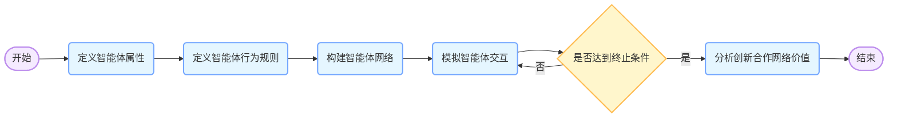

# 利用智能体网络分析公司的创新合作网络价值

> 关键词：智能体网络、创新合作网络、公司价值分析、复杂网络、网络动力学

> 摘要：本文聚焦于利用智能体网络对公司的创新合作网络价值进行深入分析。首先介绍了研究的背景、目的、预期读者等内容，接着阐述了智能体网络和创新合作网络的核心概念及联系，详细讲解了核心算法原理和具体操作步骤，给出了相关的数学模型和公式。通过项目实战，展示了如何运用代码实现对创新合作网络价值的分析，并对代码进行解读。同时探讨了实际应用场景，推荐了相关的学习资源、开发工具和论文著作。最后总结了未来发展趋势与挑战，解答了常见问题，并提供了扩展阅读和参考资料，旨在为研究公司创新合作网络价值提供全面且深入的技术指导。

## 1. 背景介绍 
### 1.1 目的和范围
在当今竞争激烈的商业环境中，公司的创新能力和合作关系对于其生存和发展至关重要。创新合作网络作为公司获取外部资源、知识和技术的重要途径，对公司的创新绩效和价值创造具有深远影响。本研究的目的在于利用智能体网络这一强大的工具，深入分析公司的创新合作网络价值，揭示网络结构、成员行为与公司价值之间的内在联系，为公司制定合理的创新合作策略提供科学依据。

研究范围涵盖了不同行业、不同规模的公司创新合作网络，从微观的智能体行为到宏观的网络动态演化，全面探讨创新合作网络价值的形成机制和影响因素。

### 1.2 预期读者
本文预期读者包括从事管理学、经济学、计算机科学等领域的研究人员，对公司创新战略和合作网络管理感兴趣的企业管理者，以及相关专业的研究生和本科生。希望通过本文的阐述，为他们提供新的研究视角和方法，促进跨学科的交流与合作。

### 1.3 文档结构概述
本文将按照以下结构展开：首先介绍相关背景知识，包括目的、预期读者和文档结构概述；接着阐述智能体网络和创新合作网络的核心概念及联系；详细讲解核心算法原理和具体操作步骤；给出相关的数学模型和公式并进行举例说明；通过项目实战展示代码实现和分析；探讨实际应用场景；推荐相关的学习资源、开发工具和论文著作；总结未来发展趋势与挑战；解答常见问题；最后提供扩展阅读和参考资料。

### 1.4 术语表
#### 1.4.1 核心术语定义
- **智能体网络**：由多个具有自主决策能力的智能体组成的网络，智能体之间通过信息交互和协作完成特定的任务。
- **创新合作网络**：公司之间为了实现创新目标而建立的合作关系网络，包括研发合作、技术转让、战略联盟等多种形式。
- **网络价值**：创新合作网络为公司带来的各种利益和优势，如知识共享、资源互补、市场拓展等。

#### 1.4.2 相关概念解释
- **复杂网络**：一种由节点和边组成的网络结构，节点表示个体或实体，边表示节点之间的关系。创新合作网络可以看作是一种复杂网络。
- **网络动力学**：研究网络中节点和边的动态变化规律，以及网络结构和功能的演化过程。智能体网络的动力学特性对于分析创新合作网络价值具有重要意义。

#### 1.4.3 缩略词列表
- **MAS**：Multi - Agent System（多智能体系统）
- **SNA**：Social Network Analysis（社会网络分析）

## 2. 核心概念与联系 

### 智能体网络原理
智能体网络是由多个智能体组成的系统，每个智能体具有一定的感知、决策和行动能力。智能体之间通过信息交互和协作来完成任务。智能体的行为可以基于规则、机器学习算法或其他决策机制。

智能体网络的架构可以分为层次结构、分布式结构等。在层次结构中，智能体被组织成不同的层次，高层智能体对低层智能体进行协调和控制；在分布式结构中，智能体之间平等地进行交互和协作。

下面是智能体网络原理的文本示意图：

智能体网络由多个智能体组成，每个智能体包含感知模块、决策模块和行动模块。感知模块用于获取环境信息，决策模块根据感知信息和自身的目标进行决策，行动模块执行决策结果。智能体之间通过通信通道进行信息交互，形成一个动态的网络系统。

### 创新合作网络原理
创新合作网络是公司之间为了实现创新目标而建立的合作关系网络。网络中的节点是参与合作的公司，边表示公司之间的合作关系。创新合作网络的结构和功能受到多种因素的影响，如公司的战略目标、资源禀赋、市场环境等。

创新合作网络的价值主要体现在知识共享、资源互补、风险分担等方面。通过合作，公司可以获取外部的知识和技术，提高自身的创新能力；共享资源，降低研发成本；共同承担风险，提高创新的成功率。

下面是创新合作网络原理的文本示意图：

创新合作网络由多个公司节点组成，节点之间通过合作关系连接。合作关系可以分为研发合作、技术转让、战略联盟等多种形式。网络中的知识、资源等信息在节点之间流动，促进公司的创新和发展。

### 智能体网络与创新合作网络的联系
智能体网络可以用来模拟和分析创新合作网络。将公司看作智能体，公司之间的合作关系看作智能体之间的交互，可以构建创新合作网络的智能体模型。通过对智能体网络的模拟和分析，可以深入了解创新合作网络的结构和动态演化过程，揭示网络价值的形成机制。

例如，智能体的决策行为可以模拟公司的合作策略选择，智能体之间的信息交互可以模拟公司之间的知识共享和资源流动。通过改变智能体的参数和行为规则，可以研究不同因素对创新合作网络价值的影响。

### Mermaid 流程图


## 3. 核心算法原理 & 具体操作步骤 

### 核心算法原理
我们采用基于多智能体系统（MAS）的算法来模拟和分析创新合作网络。每个智能体代表一个公司，智能体的行为包括选择合作伙伴、进行合作活动、更新自身的知识和资源等。

智能体的决策过程基于效用函数，即智能体选择能够最大化自身效用的合作伙伴和合作策略。效用函数考虑了多个因素，如合作伙伴的知识水平、资源禀赋、合作成本等。

以下是一个简化的智能体决策算法的 Python 代码示例：

```python
import random

# 定义智能体类
class Agent:
    def __init__(self, id, knowledge, resources):
        self.id = id
        self.knowledge = knowledge
        self.resources = resources
        self.partners = []

    def select_partner(self, agents):
        max_utility = -float('inf')
        best_partner = None
        for agent in agents:
            if agent.id != self.id:
                # 计算合作的效用
                utility = self.calculate_utility(agent)
                if utility > max_utility:
                    max_utility = utility
                    best_partner = agent
        if best_partner:
            self.partners.append(best_partner)
            best_partner.partners.append(self)
        return best_partner

    def calculate_utility(self, partner):
        # 简单的效用计算示例
        knowledge_complementarity = abs(self.knowledge - partner.knowledge)
        resource_complementarity = abs(self.resources - partner.resources)
        utility = knowledge_complementarity + resource_complementarity
        return utility

# 初始化智能体
agents = [Agent(i, random.randint(1, 10), random.randint(1, 10)) for i in range(10)]

# 模拟智能体选择合作伙伴
for agent in agents:
    agent.select_partner(agents)

# 输出每个智能体的合作伙伴
for agent in agents:
    partner_ids = [partner.id for partner in agent.partners]
    print(f"Agent {agent.id} partners: {partner_ids}")
```

### 具体操作步骤
1. **定义智能体属性**：包括智能体的标识、知识水平、资源禀赋等。
2. **定义智能体行为规则**：如选择合作伙伴的规则、进行合作活动的规则等。
3. **构建智能体网络**：将所有智能体连接成一个网络，初始化网络的结构和状态。
4. **模拟智能体交互**：按照定义的行为规则，模拟智能体之间的交互过程，更新智能体的状态和网络的结构。
5. **分析创新合作网络价值**：根据模拟结果，分析网络的结构特征、知识流动情况、资源分配情况等，评估创新合作网络的价值。

## 4. 数学模型和公式 & 详细讲解 & 举例说明 

### 智能体效用函数
智能体的决策基于效用函数，效用函数表示智能体从合作中获得的利益。假设智能体 $i$ 和智能体 $j$ 进行合作，效用函数 $U_{ij}$ 可以表示为：

$$U_{ij} = \alpha K_{ij} + \beta R_{ij} - \gamma C_{ij}$$

其中，$K_{ij}$ 表示智能体 $i$ 和智能体 $j$ 之间的知识互补性，$R_{ij}$ 表示资源互补性，$C_{ij}$ 表示合作成本，$\alpha$、$\beta$、$\gamma$ 是权重系数，且 $\alpha + \beta + \gamma = 1$。

知识互补性 $K_{ij}$ 可以定义为：

$$K_{ij} = \frac{\sum_{k = 1}^{n} |k_{ik} - k_{jk}|}{n}$$

其中，$k_{ik}$ 和 $k_{jk}$ 分别表示智能体 $i$ 和智能体 $j$ 在第 $k$ 个知识维度上的知识水平，$n$ 是知识维度的数量。

资源互补性 $R_{ij}$ 可以定义为：

$$R_{ij} = \frac{\sum_{l = 1}^{m} |r_{il} - r_{jl}|}{m}$$

其中，$r_{il}$ 和 $r_{jl}$ 分别表示智能体 $i$ 和智能体 $j$ 在第 $l$ 个资源维度上的资源水平，$m$ 是资源维度的数量。

合作成本 $C_{ij}$ 可以根据具体情况进行定义，例如与合作距离、沟通成本等因素有关。

### 举例说明
假设我们有两个智能体 $A$ 和 $B$，知识维度有两个（技术知识和市场知识），资源维度有一个（资金）。智能体 $A$ 的知识水平为 $(3, 5)$，资源水平为 $8$；智能体 $B$ 的知识水平为 $(6, 2)$，资源水平为 $4$。权重系数 $\alpha = 0.4$，$\beta = 0.4$，$\gamma = 0.2$，合作成本 $C_{AB} = 2$。

首先计算知识互补性：

$$K_{AB} = \frac{|3 - 6|+|5 - 2|}{2}=\frac{3 + 3}{2}=3$$

然后计算资源互补性：

$$R_{AB} = \frac{|8 - 4|}{1}=4$$

最后计算效用：

$$U_{AB}=0.4\times3 + 0.4\times4-0.2\times2=1.2 + 1.6 - 0.4 = 2.4$$

### 网络价值评估模型
创新合作网络的价值可以用多个指标来评估，如网络的连通性、知识传播效率、资源利用效率等。

网络的连通性可以用节点之间的平均最短路径长度来衡量，平均最短路径长度越短，网络的连通性越好。

知识传播效率可以用知识在网络中传播的速度和范围来衡量，例如可以通过模拟知识在网络中的扩散过程来计算。

资源利用效率可以用资源在网络中分配的合理性来衡量，例如可以计算资源的闲置率和利用率。

## 5. 项目实战：代码实际案例和详细解释说明 

### 5.1  开发环境搭建
为了实现利用智能体网络分析公司的创新合作网络价值的项目，我们需要搭建相应的开发环境。以下是具体步骤：

1. **安装 Python**：Python 是一种广泛使用的高级编程语言，我们将使用 Python 来实现智能体网络模型。可以从 Python 官方网站（https://www.python.org/downloads/）下载并安装适合自己操作系统的 Python 版本。
2. **安装必要的库**：我们需要安装一些 Python 库来辅助开发，如 `networkx` 用于构建和分析网络，`matplotlib` 用于可视化网络，`numpy` 用于数值计算等。可以使用 `pip` 命令来安装这些库：
```sh
pip install networkx matplotlib numpy
```

### 5.2  源代码详细实现和代码解读
以下是一个完整的 Python 代码示例，用于模拟和分析创新合作网络：

```python
import networkx as nx
import matplotlib.pyplot as plt
import numpy as np

# 定义智能体类
class Agent:
    def __init__(self, id, knowledge, resources):
        self.id = id
        self.knowledge = knowledge
        self.resources = resources
        self.partners = []

    def select_partner(self, agents):
        max_utility = -float('inf')
        best_partner = None
        for agent in agents:
            if agent.id != self.id:
                # 计算合作的效用
                utility = self.calculate_utility(agent)
                if utility > max_utility:
                    max_utility = utility
                    best_partner = agent
        if best_partner:
            self.partners.append(best_partner)
            best_partner.partners.append(self)
        return best_partner

    def calculate_utility(self, partner):
        # 简单的效用计算示例
        knowledge_complementarity = np.abs(self.knowledge - partner.knowledge).sum()
        resource_complementarity = np.abs(self.resources - partner.resources).sum()
        utility = knowledge_complementarity + resource_complementarity
        return utility

# 初始化智能体
num_agents = 10
agents = []
for i in range(num_agents):
    knowledge = np.random.randint(1, 10, 2)  # 两个知识维度
    resources = np.random.randint(1, 10)
    agent = Agent(i, knowledge, resources)
    agents.append(agent)

# 构建创新合作网络
G = nx.Graph()
for agent in agents:
    G.add_node(agent.id)
    partner = agent.select_partner(agents)
    if partner:
        G.add_edge(agent.id, partner.id)

# 可视化创新合作网络
pos = nx.spring_layout(G)
nx.draw(G, pos, with_labels=True, node_color='lightblue', edge_color='gray')
plt.title('Innovation Cooperation Network')
plt.show()

# 分析网络特征
print("Number of nodes:", G.number_of_nodes())
print("Number of edges:", G.number_of_edges())
print("Average degree:", np.mean([d for _, d in G.degree()]))
```

### 5.3  代码解读与分析
1. **智能体类的定义**：`Agent` 类表示一个智能体，包含智能体的标识、知识水平、资源禀赋和合作伙伴列表。`select_partner` 方法用于选择合作伙伴，`calculate_utility` 方法用于计算合作的效用。
2. **智能体的初始化**：随机生成每个智能体的知识水平和资源禀赋，并创建相应的智能体对象。
3. **创新合作网络的构建**：使用 `networkx` 库构建创新合作网络，每个智能体作为一个节点，智能体之间的合作关系作为边。
4. **网络的可视化**：使用 `matplotlib` 库将创新合作网络可视化，方便观察网络的结构。
5. **网络特征的分析**：计算网络的节点数、边数和平均度等特征，了解网络的基本情况。

## 6. 实际应用场景 
### 企业战略决策
企业可以利用智能体网络分析创新合作网络价值，制定合理的合作战略。通过模拟不同的合作方案，评估网络的价值和风险，选择最优的合作伙伴和合作模式。例如，企业可以根据智能体的知识和资源互补性，选择能够带来最大效用的合作伙伴，实现资源的优化配置和创新能力的提升。

### 政策制定
政府部门可以利用智能体网络分析创新合作网络价值，制定促进企业创新合作的政策。通过了解创新合作网络的结构和动态演化过程，政府可以采取相应的政策措施，如提供资金支持、建立创新平台、加强知识产权保护等，促进企业之间的合作和创新，提高整个产业的竞争力。

### 学术研究
学术研究人员可以利用智能体网络分析创新合作网络价值，开展相关的学术研究。例如，研究创新合作网络的形成机制、演化规律、价值创造过程等，为管理学、经济学、计算机科学等领域的理论发展提供实证支持。

## 7. 工具和资源推荐
### 7.1 学习资源推荐
#### 7.1.1 书籍推荐
- 《多智能体系统》：介绍了多智能体系统的基本概念、理论和方法，是学习智能体网络的经典教材。
- 《复杂网络理论及其应用》：详细讲解了复杂网络的结构、动力学特性和应用，对于理解创新合作网络的本质具有重要意义。
- 《社会网络分析方法与应用》：介绍了社会网络分析的基本方法和技术，可用于分析创新合作网络的结构和关系。

#### 7.1.2 在线课程
- Coursera 上的“Multi - Agent Systems”课程：由知名教授授课，系统地介绍了多智能体系统的相关知识。
- edX 上的“Complex Networks”课程：讲解了复杂网络的建模、分析和应用，适合对复杂网络感兴趣的学习者。

#### 7.1.3 技术博客和网站
- 开源中国（https://www.oschina.net/）：提供了丰富的技术文章和开源项目，可了解智能体网络和复杂网络的最新发展动态。
- 知乎（https://www.zhihu.com/）：有许多关于智能体网络和创新合作网络的讨论和分享，可从中获取不同的观点和经验。

### 7.2 开发工具框架推荐
#### 7.2.1 IDE和编辑器
- PyCharm：是一款专业的 Python 集成开发环境，具有强大的代码编辑、调试和分析功能，适合开发智能体网络相关的项目。
- Visual Studio Code：是一款轻量级的代码编辑器，支持多种编程语言和插件，可方便地进行 Python 代码的开发和调试。

#### 7.2.2 调试和性能分析工具
- pdb：是 Python 内置的调试工具，可用于调试 Python 代码，定位和解决问题。
- cProfile：是 Python 的性能分析工具，可用于分析代码的运行时间和资源消耗情况，优化代码性能。

#### 7.2.3 相关框架和库
- Mesa：是一个基于 Python 的多智能体建模框架，提供了丰富的智能体建模工具和函数，可快速实现智能体网络模型。
- NetworkX：是一个用于创建、操作和研究复杂网络的 Python 库，可用于构建和分析创新合作网络。

### 7.3 相关论文著作推荐
#### 7.3.1 经典论文
- “The Structure of Scientific Collaboration Networks”：研究了科学合作网络的结构和演化规律，为分析创新合作网络提供了重要的理论基础。
- “Emergence of Scaling in Random Networks”：提出了随机网络的无标度特性，对于理解创新合作网络的拓扑结构具有重要意义。

#### 7.3.2 最新研究成果
- 关注顶级学术期刊如《Management Science》、《Organization Science》等，可获取关于创新合作网络和智能体网络的最新研究成果。

#### 7.3.3 应用案例分析
- 许多企业和研究机构会发布关于创新合作网络应用的案例分析报告，可从中了解实际应用中的经验和教训。

## 8. 总结：未来发展趋势与挑战
### 未来发展趋势
1. **多学科融合**：利用智能体网络分析公司的创新合作网络价值将涉及管理学、经济学、计算机科学、数学等多个学科的知识和方法，未来的研究将更加注重多学科的融合，以更全面、深入地理解创新合作网络的本质和规律。
2. **大数据和人工智能的应用**：随着大数据技术的发展，我们可以获取更多关于公司创新合作网络的数据，利用人工智能算法对这些数据进行分析和挖掘，提高分析的准确性和效率。例如，使用机器学习算法预测创新合作网络的演化趋势，使用深度学习算法评估网络的价值。
3. **动态和实时分析**：未来的研究将更加注重创新合作网络的动态和实时分析，实时监测网络的变化，及时调整合作策略。例如，开发实时监测系统，对创新合作网络的关键指标进行实时跟踪和分析。

### 挑战
1. **数据获取和质量**：获取准确、完整的公司创新合作网络数据是一个挑战。数据可能存在缺失、错误等问题，影响分析结果的准确性。需要建立有效的数据采集和处理机制，提高数据的质量。
2. **模型的复杂性和可解释性**：智能体网络模型和创新合作网络模型可能非常复杂，难以理解和解释。需要开发简单、有效的模型，提高模型的可解释性，以便决策者能够理解和应用分析结果。
3. **伦理和法律问题**：在利用智能体网络分析公司的创新合作网络价值时，可能会涉及到伦理和法律问题，如数据隐私、知识产权保护等。需要制定相应的伦理和法律规范，确保研究和应用的合法性和道德性。

## 9. 附录：常见问题与解答
### 问题 1：智能体网络和传统的网络模型有什么区别？
智能体网络中的智能体具有自主决策能力，能够根据环境信息和自身目标进行决策和行动，而传统的网络模型通常只考虑网络的结构和静态属性。智能体网络更注重网络中个体的行为和交互，能够模拟复杂的动态过程。

### 问题 2：如何确定效用函数中的权重系数？
权重系数的确定可以根据具体的研究问题和实际情况进行。可以采用专家评估法、层次分析法等方法来确定权重系数。也可以通过实验和模拟，调整权重系数，使模型的结果更加符合实际情况。

### 问题 3：智能体网络模型的计算复杂度高吗？
智能体网络模型的计算复杂度与智能体的数量、行为规则的复杂程度等因素有关。在实际应用中，可以采用并行计算、近似算法等方法来降低计算复杂度，提高计算效率。

## 10. 扩展阅读 & 参考资料
### 扩展阅读
- 《智能系统中的多智能体》：深入探讨了多智能体系统在智能系统中的应用，为智能体网络的研究提供了更广阔的视角。
- 《创新网络与产业集群》：研究了创新网络与产业集群的关系，对于理解公司创新合作网络的产业背景具有重要意义。

### 参考资料
1. Bonabeau, E. (2002). Agent-based modeling: Methods and techniques for simulating human systems. Proceedings of the National Academy of Sciences, 99(suppl 3), 7280 - 7287.
2. Watts, D. J., & Strogatz, S. H. (1998). Collective dynamics of ‘small-world’ networks. Nature, 393(6684), 440 - 442.
3. Newman, M. E. J. (2001). The structure of scientific collaboration networks. Proceedings of the National Academy of Sciences, 98(2), 404 - 409.