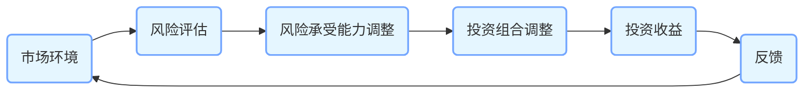

# 动态风险预算：根据市场环境调整风险承受能力

> 关键词：动态风险预算、市场环境、风险承受能力、风险调整、投资决策

> 摘要：本文围绕动态风险预算展开，深入探讨了如何依据市场环境的变化来调整风险承受能力。首先介绍了动态风险预算的背景，包括目的、预期读者等内容。接着阐述了核心概念及相互联系，详细讲解了核心算法原理与操作步骤，并结合数学模型和公式进行说明。通过项目实战案例展示了具体的代码实现与分析。还探讨了动态风险预算的实际应用场景，推荐了相关的学习资源、开发工具框架以及论文著作。最后总结了未来发展趋势与挑战，提供了常见问题解答和扩展阅读参考资料，旨在帮助读者全面理解和运用动态风险预算这一重要的投资管理理念。

## 1. 背景介绍 
### 1.1 目的和范围
在金融投资领域，市场环境时刻处于动态变化之中，传统的静态风险预算方法往往无法及时适应市场的波动，导致投资组合面临不必要的风险或错失潜在的收益机会。动态风险预算的目的在于构建一种能够根据市场环境的实时变化灵活调整风险承受能力的机制，从而优化投资组合的风险 - 收益特征。

本文的范围涵盖了动态风险预算的基本概念、核心算法原理、数学模型、实际应用案例以及相关的工具和资源推荐。通过全面深入的阐述，旨在为投资者、金融分析师、投资组合经理等提供一套系统的动态风险预算解决方案。

### 1.2 预期读者
本文的预期读者主要包括以下几类人群：
- **投资者**：无论是个人投资者还是机构投资者，都希望通过动态风险预算来更好地管理投资组合的风险，提高投资收益。
- **金融分析师**：需要深入理解动态风险预算的原理和方法，以便为客户提供更专业的投资建议。
- **投资组合经理**：负责构建和管理投资组合，动态风险预算可以帮助他们更灵活地调整投资策略，适应市场变化。
- **金融科技从业者**：关注金融领域的技术创新，动态风险预算涉及到数据分析、算法设计等技术，对他们有一定的参考价值。

### 1.3 文档结构概述
本文将按照以下结构进行组织：
- 核心概念与联系：介绍动态风险预算的基本概念，以及与市场环境、风险承受能力等相关概念的联系，并通过文本示意图和 Mermaid 流程图进行直观展示。
- 核心算法原理 & 具体操作步骤：详细讲解动态风险预算的核心算法原理，并给出具体的操作步骤，同时使用 Python 源代码进行详细阐述。
- 数学模型和公式 & 详细讲解 & 举例说明：建立动态风险预算的数学模型，给出相关公式，并通过具体例子进行详细说明。
- 项目实战：代码实际案例和详细解释说明：通过一个实际的项目案例，展示动态风险预算的具体实现过程，包括开发环境搭建、源代码实现和代码解读。
- 实际应用场景：探讨动态风险预算在不同金融场景中的实际应用。
- 工具和资源推荐：推荐学习动态风险预算相关的书籍、在线课程、技术博客和网站，以及开发工具框架和相关论文著作。
- 总结：未来发展趋势与挑战：总结动态风险预算的发展趋势，分析面临的挑战。
- 附录：常见问题与解答：解答读者在学习和应用动态风险预算过程中常见的问题。
- 扩展阅读 & 参考资料：提供进一步学习和研究动态风险预算的扩展阅读材料和参考资料。

### 1.4 术语表
#### 1.4.1 核心术语定义
- **动态风险预算**：一种根据市场环境的变化实时调整投资组合风险承受能力的风险管理方法。
- **市场环境**：包括宏观经济数据、行业趋势、市场波动率等影响投资市场的各种因素。
- **风险承受能力**：投资者或投资组合能够承受的最大风险水平，通常用风险度量指标（如方差、VaR 等）来表示。
- **风险调整**：根据市场环境的变化对投资组合的风险承受能力进行调整的过程。
- **投资组合**：由多种资产组成的集合，投资者通过合理配置资产来实现投资目标。

#### 1.4.2 相关概念解释
- **风险度量指标**：用于衡量投资组合风险水平的量化指标，常见的有方差、标准差、VaR（Value at Risk）、CVaR（Conditional Value at Risk）等。
- **市场波动率**：反映市场价格波动程度的指标，通常用历史数据的标准差来估计。
- **宏观经济数据**：如 GDP 增长率、通货膨胀率、利率等，这些数据会对市场环境产生重要影响。

#### 1.4.3 缩略词列表
- **VaR**：Value at Risk，风险价值
- **CVaR**：Conditional Value at Risk，条件风险价值
- **GDP**：Gross Domestic Product，国内生产总值

## 2. 核心概念与联系 

动态风险预算的核心在于建立市场环境与风险承受能力之间的动态联系，根据市场环境的变化实时调整投资组合的风险承受能力。下面通过文本示意图和 Mermaid 流程图来详细展示这些核心概念之间的关系。

### 文本示意图
市场环境是动态风险预算的外部驱动因素，它包括宏观经济数据、行业趋势、市场波动率等多个方面。这些因素的变化会影响投资组合的风险特征。风险承受能力是投资者或投资组合在特定市场环境下能够承受的最大风险水平，它是动态风险预算的核心指标。通过对市场环境的监测和分析，我们可以根据一定的规则或算法调整风险承受能力，进而调整投资组合的资产配置，以实现风险 - 收益的优化。

### Mermaid 流程图

该流程图展示了动态风险预算的基本流程：
1. 市场环境的变化触发风险评估过程。
2. 根据风险评估结果，对风险承受能力进行调整。
3. 根据调整后的风险承受能力，对投资组合进行调整。
4. 投资组合的调整会影响投资收益。
5. 投资收益反馈到市场环境中，形成一个闭环的动态调整过程。

## 3. 核心算法原理 & 具体操作步骤 

### 核心算法原理
动态风险预算的核心算法原理是基于市场环境的变化实时调整投资组合的风险承受能力。一种常见的方法是使用风险度量指标（如 VaR）来衡量投资组合的风险水平，并根据市场环境的变化动态调整 VaR 的阈值。

具体来说，我们可以通过以下步骤实现动态风险预算：
1. **市场环境监测**：实时收集和分析市场环境数据，包括宏观经济数据、行业趋势、市场波动率等。
2. **风险评估**：使用风险度量指标（如 VaR）对投资组合的风险水平进行评估。
3. **风险承受能力调整**：根据市场环境的变化和风险评估结果，调整投资组合的风险承受能力。
4. **投资组合调整**：根据调整后的风险承受能力，调整投资组合的资产配置。

### 具体操作步骤

#### 步骤 1：市场环境监测
使用 Python 代码从金融数据提供商（如雅虎财经、Tushare 等）获取市场环境数据，例如股票价格、指数收益率等。以下是一个使用 `pandas-datareader` 库获取股票价格数据的示例代码：
```python
import pandas as pd
import pandas_datareader.data as web
import datetime

# 设置数据获取的时间范围
start = datetime.datetime(2020, 1, 1)
end = datetime.datetime(2021, 1, 1)

# 获取股票价格数据
stock_data = web.DataReader('AAPL', 'yahoo', start, end)

print(stock_data.head())
```

#### 步骤 2：风险评估
使用风险度量指标（如 VaR）对投资组合的风险水平进行评估。以下是一个使用历史模拟法计算 VaR 的示例代码：
```python
import numpy as np

# 计算股票收益率
returns = stock_data['Close'].pct_change().dropna()

# 设置置信水平和时间周期
confidence_level = 0.95
time_period = 1

# 计算 VaR
sorted_returns = np.sort(returns)
var_index = int((1 - confidence_level) * len(sorted_returns))
var = -sorted_returns[var_index]

print(f"VaR at {confidence_level * 100}% confidence level: {var:.4f}")
```

#### 步骤 3：风险承受能力调整
根据市场环境的变化和风险评估结果，调整投资组合的风险承受能力。例如，如果市场波动率上升，我们可以降低风险承受能力；如果市场波动率下降，我们可以提高风险承受能力。以下是一个简单的风险承受能力调整示例代码：
```python
# 假设市场波动率上升，降低风险承受能力
if np.std(returns) > np.std(returns.rolling(window=30).std()):
    risk_tolerance = risk_tolerance * 0.9
else:
    risk_tolerance = risk_tolerance * 1.1

print(f"Adjusted risk tolerance: {risk_tolerance:.4f}")
```

#### 步骤 4：投资组合调整
根据调整后的风险承受能力，调整投资组合的资产配置。例如，如果风险承受能力降低，我们可以减少高风险资产的比例，增加低风险资产的比例。以下是一个简单的投资组合调整示例代码：
```python
# 假设投资组合中有两种资产：股票和债券
stock_weight = 0.6
bond_weight = 0.4

# 根据调整后的风险承受能力调整资产配置
if risk_tolerance < 0.1:
    stock_weight = 0.3
    bond_weight = 0.7
elif risk_tolerance > 0.2:
    stock_weight = 0.8
    bond_weight = 0.2

print(f"Adjusted stock weight: {stock_weight:.2f}")
print(f"Adjusted bond weight: {bond_weight:.2f}")
```

## 4. 数学模型和公式 & 详细讲解 & 举例说明 

### 数学模型
动态风险预算的数学模型可以基于风险度量指标（如 VaR）来建立。假设投资组合的收益率为 $R$，其概率密度函数为 $f(R)$，置信水平为 $c$，则在时间周期 $\Delta t$ 内的 VaR 可以定义为：
$$VaR_c(\Delta t) = -inf\{x: P(R \leq -x) \geq c\}$$

### 详细讲解
上述公式的含义是，在置信水平 $c$ 下，投资组合在时间周期 $\Delta t$ 内可能遭受的最大损失。具体来说，我们需要找到一个最小的 $x$，使得投资组合收益率小于等于 $-x$ 的概率大于等于 $c$。

### 举例说明
假设投资组合的收益率服从正态分布 $N(\mu, \sigma^2)$，其中 $\mu$ 为均值，$\sigma$ 为标准差。在置信水平 $c = 0.95$ 下，我们可以使用标准正态分布的分位数来计算 VaR。

标准正态分布的 $0.05$ 分位数为 $z_{0.05} = -1.645$，则投资组合在时间周期 $\Delta t$ 内的 VaR 可以计算为：
$$VaR_{0.95}(\Delta t) = -z_{0.05} \sigma \sqrt{\Delta t}$$

例如，假设投资组合的标准差 $\sigma = 0.1$，时间周期 $\Delta t = 1$ 天，则在置信水平 $0.95$ 下的 VaR 为：
$$VaR_{0.95}(1) = -(-1.645) \times 0.1 \times \sqrt{1} = 0.1645$$

这意味着在 $95\%$ 的置信水平下，投资组合在一天内可能遭受的最大损失为 $16.45\%$。

## 5. 项目实战：代码实际案例和详细解释说明 

### 5.1  开发环境搭建
为了实现动态风险预算的项目实战，我们需要搭建以下开发环境：
- **Python 环境**：建议使用 Python 3.7 及以上版本。
- **必要的 Python 库**：`pandas`、`numpy`、`pandas-datareader`、`matplotlib` 等。可以使用以下命令进行安装：
```sh
pip install pandas numpy pandas-datareader matplotlib
```

### 5.2  源代码详细实现和代码解读
以下是一个完整的动态风险预算项目实战代码示例：
```python
import pandas as pd
import pandas_datareader.data as web
import numpy as np
import matplotlib.pyplot as plt

# 设置数据获取的时间范围
start = pd.to_datetime('2020-01-01')
end = pd.to_datetime('2021-01-01')

# 获取股票价格数据
stock_data = web.DataReader('AAPL', 'yahoo', start, end)

# 计算股票收益率
returns = stock_data['Close'].pct_change().dropna()

# 设置置信水平和时间周期
confidence_level = 0.95
time_period = 1

# 计算 VaR
sorted_returns = np.sort(returns)
var_index = int((1 - confidence_level) * len(sorted_returns))
var = -sorted_returns[var_index]

print(f"VaR at {confidence_level * 100}% confidence level: {var:.4f}")

# 初始化风险承受能力
risk_tolerance = 0.1

# 动态调整风险承受能力
for i in range(len(returns)):
    if np.std(returns[:i+1]) > np.std(returns[:i+1].rolling(window=30).std()):
        risk_tolerance = risk_tolerance * 0.9
    else:
        risk_tolerance = risk_tolerance * 1.1

    # 根据调整后的风险承受能力调整资产配置
    if risk_tolerance < 0.05:
        stock_weight = 0.2
        bond_weight = 0.8
    elif risk_tolerance > 0.2:
        stock_weight = 0.8
        bond_weight = 0.2
    else:
        stock_weight = 0.5
        bond_weight = 0.5

    print(f"Step {i+1}: Risk tolerance = {risk_tolerance:.4f}, Stock weight = {stock_weight:.2f}, Bond weight = {bond_weight:.2f}")

# 绘制风险承受能力变化曲线
plt.plot(range(len(returns)), [risk_tolerance for _ in range(len(returns))])
plt.xlabel('Time')
plt.ylabel('Risk Tolerance')
plt.title('Dynamic Risk Tolerance Adjustment')
plt.show()
```

### 代码解读与分析
- **数据获取**：使用 `pandas-datareader` 库从雅虎财经获取苹果公司（AAPL）的股票价格数据。
- **收益率计算**：计算股票的日收益率。
- **VaR 计算**：使用历史模拟法计算在 $95\%$ 置信水平下的 VaR。
- **风险承受能力调整**：根据市场波动率的变化动态调整风险承受能力。
- **资产配置调整**：根据调整后的风险承受能力调整投资组合的资产配置。
- **可视化**：使用 `matplotlib` 库绘制风险承受能力的变化曲线。

## 6. 实际应用场景 
动态风险预算在金融投资领域有广泛的实际应用场景，以下是一些常见的应用场景：

### 个人投资
个人投资者可以使用动态风险预算来管理自己的投资组合。例如，在市场波动率上升时，降低风险承受能力，减少高风险资产的投资比例；在市场波动率下降时，提高风险承受能力，增加高风险资产的投资比例。这样可以在不同的市场环境下实现风险 - 收益的优化。

### 机构投资
机构投资者（如基金公司、保险公司等）通常管理着大规模的投资组合。动态风险预算可以帮助他们更好地应对市场变化，降低投资组合的风险。例如，基金经理可以根据市场环境的变化动态调整基金的资产配置，以满足投资者的风险偏好和收益目标。

### 风险管理
金融机构（如银行、证券公司等）需要对各种金融风险进行管理。动态风险预算可以作为一种有效的风险管理工具，帮助金融机构实时监测和调整投资组合的风险水平，确保风险在可控范围内。

### 资产配置决策
动态风险预算可以为资产配置决策提供重要的参考依据。通过根据市场环境的变化调整风险承受能力，投资者可以更合理地分配资产，提高投资组合的效率。

## 7. 工具和资源推荐
### 7.1 学习资源推荐
#### 7.1.1 书籍推荐
- 《金融风险管理师（FRM）考试手册》：全面介绍了金融风险管理的理论和方法，包括风险度量、风险预算等内容。
- 《投资组合管理：理论与应用》：深入探讨了投资组合管理的各个方面，包括资产配置、风险预算等。
- 《金融时间序列分析》：介绍了金融时间序列的分析方法，对于理解市场波动率和风险度量有很大帮助。

#### 7.1.2 在线课程
- Coursera 上的“Financial Risk Management”课程：由知名教授授课，系统介绍了金融风险管理的理论和实践。
- edX 上的“Investment Management”课程：提供了投资管理的全面知识，包括风险预算和资产配置等内容。

#### 7.1.3 技术博客和网站
- 量化投资与机器学习（https://www.joinquant.com/）：提供了丰富的量化投资和风险管理的技术文章和案例。
- 优矿（https://uqer.datayes.com/）：专注于金融数据和量化分析，有很多关于风险预算和投资组合管理的技术分享。

### 7.2 开发工具框架推荐
#### 7.2.1 IDE和编辑器
- PyCharm：一款专业的 Python 集成开发环境，具有强大的代码编辑、调试和项目管理功能。
- Jupyter Notebook：交互式的编程环境，适合进行数据分析和模型开发。

#### 7.2.2 调试和性能分析工具
- pdb：Python 自带的调试工具，可以帮助我们调试代码中的错误。
- cProfile：Python 的性能分析工具，可以帮助我们找出代码中的性能瓶颈。

#### 7.2.3 相关框架和库
- pandas：强大的数据处理和分析库，用于处理金融数据。
- numpy：用于科学计算和数值分析的库，在风险度量和模型计算中经常使用。
- scipy：提供了丰富的科学计算和统计分析功能，如优化算法、概率分布等。

### 7.3 相关论文著作推荐
#### 7.3.1 经典论文
- Jorion, Philippe. "Value at Risk: The New Benchmark for Managing Financial Risk." McGraw-Hill, 2007.：介绍了 VaR 的理论和应用，是金融风险管理领域的经典著作。
- Markowitz, Harry M. "Portfolio Selection." The Journal of Finance, 1952.：提出了现代投资组合理论，为风险预算和资产配置提供了理论基础。

#### 7.3.2 最新研究成果
- 可以通过学术数据库（如 IEEE Xplore、ACM Digital Library、ScienceDirect 等）搜索关于动态风险预算的最新研究论文。

#### 7.3.3 应用案例分析
- 一些金融机构和研究机构会发布关于动态风险预算的应用案例分析报告，可以通过他们的官方网站获取相关资料。

## 8. 总结：未来发展趋势与挑战
### 未来发展趋势
- **智能化和自动化**：随着人工智能和机器学习技术的发展，动态风险预算将越来越智能化和自动化。通过机器学习算法可以更准确地预测市场环境的变化，自动调整风险承受能力和投资组合的资产配置。
- **多维度风险度量**：未来的动态风险预算将不仅仅关注传统的风险度量指标（如 VaR、CVaR 等），还会考虑更多的风险维度，如流动性风险、信用风险等，以更全面地评估投资组合的风险。
- **与其他金融技术的融合**：动态风险预算将与区块链、大数据、云计算等金融技术深度融合，提高风险管理的效率和准确性。

### 挑战
- **数据质量和可靠性**：动态风险预算依赖于大量的市场环境数据和金融数据，数据的质量和可靠性直接影响到风险评估和调整的准确性。因此，如何获取高质量、可靠的数据是一个重要的挑战。
- **模型的复杂性和可解释性**：随着动态风险预算模型的不断发展，模型的复杂性也在增加。如何在保证模型准确性的同时，提高模型的可解释性，是一个需要解决的问题。
- **市场不确定性**：市场环境是复杂多变的，存在很多不确定性因素。如何在不确定的市场环境中准确地调整风险承受能力和投资组合的资产配置，是动态风险预算面临的最大挑战之一。

## 9. 附录：常见问题与解答
### 问题 1：动态风险预算与静态风险预算有什么区别？
动态风险预算是根据市场环境的变化实时调整投资组合的风险承受能力，而静态风险预算是在一定时期内固定投资组合的风险承受能力，不考虑市场环境的变化。动态风险预算能够更好地适应市场的波动，提高投资组合的风险 - 收益特征。

### 问题 2：如何选择合适的风险度量指标？
选择合适的风险度量指标需要考虑投资组合的特点、投资者的风险偏好和投资目标等因素。常见的风险度量指标有方差、标准差、VaR、CVaR 等。方差和标准差可以衡量投资组合的总体风险，VaR 可以衡量在一定置信水平下投资组合可能遭受的最大损失，CVaR 可以衡量在 VaR 之上的平均损失。一般来说，如果投资者更关注极端损失，可以选择 VaR 或 CVaR 作为风险度量指标。

### 问题 3：动态风险预算需要哪些数据？
动态风险预算需要以下几类数据：
- **市场环境数据**：包括宏观经济数据、行业趋势、市场波动率等。
- **金融资产数据**：如股票价格、债券收益率、基金净值等。
- **投资者数据**：如投资者的风险偏好、投资目标等。

### 问题 4：动态风险预算的调整频率应该如何确定？
动态风险预算的调整频率应该根据市场环境的变化程度和投资者的风险承受能力来确定。如果市场环境变化较快，调整频率可以适当提高；如果市场环境相对稳定，调整频率可以适当降低。一般来说，可以根据日、周、月等时间周期进行调整。

## 10. 扩展阅读 & 参考资料
### 扩展阅读
- 《金融科技前沿：从理论到实践》：介绍了金融科技的最新发展趋势和应用案例，包括动态风险预算在金融科技中的应用。
- 《量化交易：策略与技术》：深入探讨了量化交易的策略和技术，对于理解动态风险预算在量化交易中的应用有很大帮助。

### 参考资料
- Alexander, C. (2008). Market Risk Analysis: Pricing, Hedging and Trading Financial Instruments. John Wiley & Sons.
- Hull, J. C. (2018). Options, Futures, and Other Derivatives. Pearson.
- Taleb, N. N. (2007). The Black Swan: The Impact of the Highly Improbable. Random House.