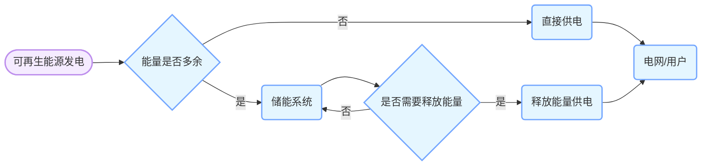

# 可再生能源存储解决方案的市场潜力

> 关键词：可再生能源、存储解决方案、市场潜力、储能技术、能源市场

> 摘要：本文深入探讨了可再生能源存储解决方案的市场潜力。随着全球对可再生能源的重视和应用不断增加，其间歇性和不稳定性问题凸显，使得有效的存储解决方案变得至关重要。文章首先介绍了相关背景，包括目的范围、预期读者等；接着阐述了核心概念与联系，分析了不同储能技术的原理和架构；详细讲解了核心算法原理及操作步骤，运用 Python 代码进行说明；引入数学模型和公式来进一步剖析储能问题；通过项目实战案例展示了存储解决方案的实际应用和代码实现；探讨了其在不同场景下的实际应用；推荐了相关的学习资源、开发工具和论文著作；最后总结了未来发展趋势与挑战，并解答常见问题，提供扩展阅读和参考资料，旨在为读者全面呈现可再生能源存储解决方案的市场前景和发展方向。

## 1. 背景介绍 
### 1.1 目的和范围
随着全球对环境保护和可持续发展的关注度不断提高，可再生能源如太阳能、风能等的开发和利用取得了显著进展。然而，可再生能源具有间歇性和不稳定性的特点，这使得其在大规模应用时面临诸多挑战。可再生能源存储解决方案旨在解决这一问题，通过有效的储能技术将多余的能量存储起来，在需要时释放，以实现能源的稳定供应。本文的目的是深入分析可再生能源存储解决方案的市场潜力，探讨其技术原理、应用场景以及未来发展趋势。范围涵盖了常见的储能技术，如电池储能、抽水蓄能、压缩空气储能等，以及这些技术在不同能源市场中的应用。

### 1.2 预期读者
本文预期读者包括能源行业的从业者，如能源公司的管理人员、工程师等，他们可以从文中了解到最新的储能技术和市场动态，为公司的战略决策提供参考。同时，对可再生能源和储能技术感兴趣的科研人员也可以通过本文深入了解相关领域的研究进展和应用案例。此外，投资机构和金融从业者可以通过本文评估可再生能源存储解决方案的投资价值和市场前景。

### 1.3 文档结构概述
本文将按照以下结构进行阐述：首先介绍可再生能源存储的核心概念和相关技术的联系，包括不同储能技术的原理和架构；接着详细讲解核心算法原理和具体操作步骤，通过 Python 代码进行说明；引入数学模型和公式来进一步分析储能问题，并举例说明；通过项目实战展示可再生能源存储解决方案的实际应用和代码实现；探讨其在不同场景下的实际应用；推荐相关的学习资源、开发工具和论文著作；最后总结未来发展趋势与挑战，解答常见问题，并提供扩展阅读和参考资料。

### 1.4 术语表
#### 1.4.1 核心术语定义
- **可再生能源**：指在自然界中可以不断再生、永续利用的能源，具有取之不尽，用之不竭的特点，主要包括太阳能、风能、水能、生物质能、地热能和海洋能等。
- **储能技术**：是指通过一定的技术手段将能量存储起来，在需要时释放的技术。常见的储能技术包括电池储能、抽水蓄能、压缩空气储能等。
- **可再生能源存储解决方案**：是指针对可再生能源的间歇性和不稳定性问题，采用储能技术将多余的可再生能源存储起来，在需要时释放，以实现能源的稳定供应的一系列技术和方法。

#### 1.4.2 相关概念解释
- **间歇性**：可再生能源的间歇性是指其能量输出随时间变化的特性，例如太阳能只有在白天有阳光时才能发电，风能则取决于风力的大小和方向。
- **不稳定性**：不稳定性是指可再生能源的能量输出在短时间内可能会出现较大的波动，这会对电网的稳定性造成影响。

#### 1.4.3 缩略词列表
- **ESS**：Energy Storage System，储能系统
- **BESS**：Battery Energy Storage System，电池储能系统
- **PHES**：Pumped Hydro Energy Storage，抽水蓄能
- **CAES**：Compressed Air Energy Storage，压缩空气储能

## 2. 核心概念与联系 

### 核心概念原理
可再生能源存储解决方案的核心在于将可再生能源产生的多余能量存储起来，以便在能源需求高峰或可再生能源供应不足时释放。常见的储能技术有以下几种：

#### 电池储能
电池储能是利用电池的化学反应来存储和释放能量。常见的电池类型包括锂离子电池、铅酸电池、钠硫电池等。以锂离子电池为例，其工作原理是在充电时，锂离子从正极脱嵌，经过电解质嵌入负极；放电时，锂离子则从负极脱嵌，经过电解质嵌入正极。电池储能具有响应速度快、能量密度高、安装灵活等优点，适用于分布式能源系统和电动汽车等领域。

#### 抽水蓄能
抽水蓄能是在电力系统负荷低谷时，利用多余的电能将水从下水库抽到上水库，将电能转化为水的势能存储起来；在电力系统负荷高峰时，将上水库的水放下来推动水轮机发电，将水的势能转化为电能。抽水蓄能具有储能容量大、效率高、寿命长等优点，是目前应用最广泛的大规模储能技术。

#### 压缩空气储能
压缩空气储能是在电力系统负荷低谷时，利用多余的电能将空气压缩并存储在储气室中，将电能转化为空气的内能；在电力系统负荷高峰时，将压缩空气释放出来，通过膨胀机带动发电机发电，将空气的内能转化为电能。压缩空气储能具有储能容量大、成本低等优点，但需要特定的地理条件和储气设施。

### 架构的文本示意图
```plaintext
可再生能源发电系统
    |
    |-- 电池储能系统
    |       |-- 电池组
    |       |-- 电池管理系统
    |       |-- 功率转换系统
    |
    |-- 抽水蓄能系统
    |       |-- 上水库
    |       |-- 下水库
    |       |-- 水泵水轮机
    |       |-- 发电机
    |
    |-- 压缩空气储能系统
    |       |-- 压缩机
    |       |-- 储气室
    |       |-- 膨胀机
    |       |-- 发电机
    |
    |-- 电网
```

### Mermaid 流程图


## 3. 核心算法原理 & 具体操作步骤 

### 电池储能系统的充放电控制算法
在电池储能系统中，一个重要的问题是如何合理地控制电池的充放电过程，以提高电池的使用寿命和储能效率。下面是一个简单的基于电池剩余电量（State of Charge, SOC）的充放电控制算法的 Python 实现：

```python
class BatteryEnergyStorageSystem:
    def __init__(self, capacity, soc=0.5):
        # 电池容量，单位：kWh
        self.capacity = capacity
        # 电池初始剩余电量，范围：0 - 1
        self.soc = soc
        # 充电效率
        self.charge_efficiency = 0.9
        # 放电效率
        self.discharge_efficiency = 0.9

    def charge(self, power, time):
        """
        电池充电函数
        :param power: 充电功率，单位：kW
        :param time: 充电时间，单位：h
        """
        # 计算充电量
        charge_amount = power * time * self.charge_efficiency
        # 更新电池剩余电量
        self.soc = min(1, self.soc + charge_amount / self.capacity)
        return charge_amount

    def discharge(self, power, time):
        """
        电池放电函数
        :param power: 放电功率，单位：kW
        :param time: 放电时间，单位：h
        """
        # 计算放电量
        discharge_amount = power * time / self.discharge_efficiency
        if discharge_amount > self.soc * self.capacity:
            print("电池电量不足，无法放电！")
            return 0
        # 更新电池剩余电量
        self.soc = max(0, self.soc - discharge_amount / self.capacity)
        return discharge_amount

    def get_soc(self):
        """
        获取电池当前剩余电量
        """
        return self.soc

# 示例使用
bess = BatteryEnergyStorageSystem(capacity=100)
print(f"初始 SOC: {bess.get_soc()}")
# 充电 10kW，充电 2 小时
charge_amount = bess.charge(power=10, time=2)
print(f"充电量: {charge_amount} kWh")
print(f"充电后 SOC: {bess.get_soc()}")
# 放电 5kW，放电 3 小时
discharge_amount = bess.discharge(power=5, time=3)
print(f"放电量: {discharge_amount} kWh")
print(f"放电后 SOC: {bess.get_soc()}")
```

### 具体操作步骤
1. **初始化电池储能系统**：在代码中，通过 `BatteryEnergyStorageSystem` 类的构造函数初始化电池的容量和初始剩余电量。
2. **充电操作**：调用 `charge` 方法，传入充电功率和充电时间，函数会计算充电量并更新电池的剩余电量。
3. **放电操作**：调用 `discharge` 方法，传入放电功率和放电时间，函数会检查电池电量是否充足，如果充足则计算放电量并更新电池的剩余电量，否则输出提示信息。
4. **获取电池剩余电量**：调用 `get_soc` 方法获取电池当前的剩余电量。

## 4. 数学模型和公式 & 详细讲解 & 举例说明 

### 电池储能系统的数学模型
#### 电池剩余电量计算
电池的剩余电量（SOC）可以通过以下公式计算：

$$SOC_{t+1} = SOC_t + \frac{\eta_{ch}P_{ch}\Delta t}{C} - \frac{P_{dis}\Delta t}{\eta_{dis}C}$$

其中：
- $SOC_t$ 是时刻 $t$ 的电池剩余电量；
- $SOC_{t+1}$ 是时刻 $t + 1$ 的电池剩余电量；
- $\eta_{ch}$ 是充电效率；
- $P_{ch}$ 是充电功率；
- $\Delta t$ 是时间间隔；
- $C$ 是电池容量；
- $P_{dis}$ 是放电功率；
- $\eta_{dis}$ 是放电效率。

#### 举例说明
假设一个电池储能系统的容量 $C = 100$ kWh，初始剩余电量 $SOC_0 = 0.5$，充电效率 $\eta_{ch} = 0.9$，放电效率 $\eta_{dis} = 0.9$。在 $t = 0$ 时刻开始以 $P_{ch} = 10$ kW 的功率充电 2 小时，根据上述公式可得：

$$SOC_1 = SOC_0 + \frac{\eta_{ch}P_{ch}\Delta t}{C} = 0.5 + \frac{0.9\times10\times2}{100} = 0.5 + 0.18 = 0.68$$

然后在 $t = 2$ 时刻开始以 $P_{dis} = 5$ kW 的功率放电 3 小时，可得：

$$SOC_2 = SOC_1 - \frac{P_{dis}\Delta t}{\eta_{dis}C} = 0.68 - \frac{5\times3}{0.9\times100} \approx 0.68 - 0.167 = 0.513$$

### 抽水蓄能系统的数学模型
#### 储能容量计算
抽水蓄能系统的储能容量可以通过以下公式计算：

$$E = \rho g h V \eta$$

其中：
- $E$ 是储能容量，单位：J；
- $\rho$ 是水的密度，单位：kg/m³；
- $g$ 是重力加速度，单位：m/s²；
- $h$ 是上下水库的水位差，单位：m；
- $V$ 是抽水的体积，单位：m³；
- $\eta$ 是抽水蓄能系统的效率。

#### 举例说明
假设抽水蓄能系统的上下水库水位差 $h = 100$ m，抽水体积 $V = 10000$ m³，水的密度 $\rho = 1000$ kg/m³，重力加速度 $g = 9.8$ m/s²，系统效率 $\eta = 0.8$，则储能容量为：

$$E = \rho g h V \eta = 1000\times9.8\times100\times10000\times0.8 = 7.84\times10^{10} J \approx 21777.8 kWh$$

## 5. 项目实战：代码实际案例和详细解释说明 

### 5.1  开发环境搭建
为了实现可再生能源存储解决方案的项目实战，我们需要搭建以下开发环境：

#### 操作系统
可以选择 Linux（如 Ubuntu）、Windows 或 macOS。这里以 Ubuntu 为例，其具有良好的开源软件支持和稳定性。

#### 编程语言和工具
- **Python**：Python 是一种功能强大、易于学习的编程语言，拥有丰富的科学计算和数据处理库。可以通过以下命令安装 Python：
```bash
sudo apt update
sudo apt install python3 python3-pip
```
- **Jupyter Notebook**：Jupyter Notebook 是一个交互式的开发环境，方便我们编写和运行代码、展示结果。可以通过以下命令安装：
```bash
pip3 install jupyter
```

#### 相关库
- **NumPy**：用于数值计算和数组操作。
```bash
pip3 install numpy
```
- **Pandas**：用于数据处理和分析。
```bash
pip3 install pandas
```
- **Matplotlib**：用于数据可视化。
```bash
pip3 install matplotlib
```

### 5.2  源代码详细实现和代码解读
我们将实现一个简单的可再生能源发电和储能系统的模拟程序，假设可再生能源发电功率是随时间变化的，储能系统根据发电功率和负荷需求进行充放电操作。

```python
import numpy as np
import pandas as pd
import matplotlib.pyplot as plt

# 模拟时间范围，单位：小时
time = np.arange(0, 24, 1)

# 可再生能源发电功率，单位：kW
# 这里简单假设发电功率是一个正弦函数
renewable_power = 10 * np.sin(2 * np.pi * time / 24) + 10

# 负荷需求，单位：kW
# 这里简单假设负荷需求是一个常数
load_demand = 15

# 电池储能系统参数
battery_capacity = 50  # 电池容量，单位：kWh
battery_soc = 0.5  # 电池初始剩余电量
charge_efficiency = 0.9
discharge_efficiency = 0.9

# 存储每个时刻的电池剩余电量
soc_history = []

for t in range(len(time)):
    power_difference = renewable_power[t] - load_demand
    if power_difference > 0:
        # 发电功率大于负荷需求，充电
        charge_amount = min(power_difference, (1 - battery_soc) * battery_capacity / charge_efficiency)
        battery_soc += charge_amount * charge_efficiency / battery_capacity
    else:
        # 发电功率小于负荷需求，放电
        discharge_amount = min(-power_difference * discharge_efficiency, battery_soc * battery_capacity)
        battery_soc -= discharge_amount / (battery_capacity * discharge_efficiency)

    soc_history.append(battery_soc)

# 绘制可再生能源发电功率、负荷需求和电池剩余电量曲线
plt.figure(figsize=(12, 6))
plt.plot(time, renewable_power, label='Renewable Power')
plt.plot(time, [load_demand] * len(time), label='Load Demand')
plt.plot(time, soc_history, label='Battery SOC')
plt.xlabel('Time (h)')
plt.ylabel('Power (kW) / SOC')
plt.title('Renewable Energy Generation, Load Demand and Battery SOC')
plt.legend()
plt.grid(True)
plt.show()
```

### 5.3  代码解读与分析
1. **时间和功率数据生成**：
    - `time` 数组表示模拟的时间范围，从 0 到 24 小时，步长为 1 小时。
    - `renewable_power` 数组表示可再生能源的发电功率，这里使用正弦函数模拟发电功率随时间的变化。
    - `load_demand` 是一个常数，表示负荷需求。

2. **电池储能系统参数设置**：
    - `battery_capacity` 表示电池的容量。
    - `battery_soc` 表示电池的初始剩余电量。
    - `charge_efficiency` 和 `discharge_efficiency` 分别表示充电效率和放电效率。

3. **充放电过程模拟**：
    - 通过遍历每个时间步，计算发电功率和负荷需求的差值 `power_difference`。
    - 如果 `power_difference > 0`，表示发电功率大于负荷需求，电池进行充电操作，更新电池的剩余电量。
    - 如果 `power_difference < 0`，表示发电功率小于负荷需求，电池进行放电操作，更新电池的剩余电量。

4. **数据可视化**：
    - 使用 `matplotlib` 库绘制可再生能源发电功率、负荷需求和电池剩余电量随时间的变化曲线，方便直观地观察系统的运行情况。

## 6. 实际应用场景 
### 电网调峰
可再生能源存储解决方案在电网调峰方面具有重要应用。在用电低谷期，可再生能源发电可能会产生多余的电量，此时可以将这些多余的电量存储到储能系统中。在用电高峰期，储能系统释放存储的能量，补充电网的电力供应，从而平衡电网的负荷，提高电网的稳定性和可靠性。例如，抽水蓄能电站可以在夜间用电低谷时将水抽到上水库，在白天用电高峰期放水发电，起到调峰的作用。

### 分布式能源系统
在分布式能源系统中，如家庭太阳能发电系统、小型风力发电站等，可再生能源存储解决方案可以解决能源的间歇性和不稳定性问题。当太阳能板或风力发电机产生的电量超过家庭或小型企业的即时需求时，多余的电量可以存储到电池储能系统中。在夜间或风力不足时，电池储能系统可以为负载供电，确保能源的持续供应。

### 电动汽车充电站
随着电动汽车的普及，电动汽车充电站的需求也越来越大。可再生能源存储解决方案可以与电动汽车充电站相结合，提高充电站的能源供应稳定性和可持续性。例如，在充电站安装太阳能板和电池储能系统，白天太阳能板产生的电量可以存储到电池中，在电动汽车充电时，电池释放能量为车辆充电。这样可以减少对电网的依赖，降低充电成本。

### 微电网
微电网是一种小型的电力系统，可以独立运行或与主电网连接。可再生能源存储解决方案在微电网中起着关键作用，可以提高微电网的自给自足能力和稳定性。微电网中通常包含多种可再生能源发电设备，如太阳能、风能等，储能系统可以平衡不同能源之间的输出差异，确保微电网内的电力供需平衡。例如，在海岛、偏远山区等地区的微电网中，储能系统可以存储多余的可再生能源，在能源供应不足时为当地居民和企业供电。

## 7. 工具和资源推荐
### 7.1 学习资源推荐
#### 7.1.1 书籍推荐
- 《储能技术与应用》：本书系统地介绍了各种储能技术的原理、特点和应用，包括电池储能、抽水蓄能、压缩空气储能等，是一本全面了解储能技术的经典书籍。
- 《可再生能源系统设计与分析》：该书详细讲解了可再生能源系统的设计方法和分析技术，包括太阳能、风能、水能等可再生能源的发电原理和系统配置，以及储能系统在可再生能源系统中的应用。
- 《电池管理系统：原理与应用》：专注于电池管理系统的原理、设计和应用，对于深入了解电池储能系统的控制和管理具有重要参考价值。

#### 7.1.2 在线课程
- Coursera 上的 “Renewable Energy Systems” 课程：由知名大学的教授授课，介绍了可再生能源系统的基本原理、技术和应用，包括储能技术在可再生能源系统中的作用。
- edX 上的 “Energy Storage for Renewable Energy Integration” 课程：专门讲解了储能技术在可再生能源集成中的应用，包括不同储能技术的比较和选择、储能系统的建模和控制等内容。
- Udemy 上的 “Battery Energy Storage Systems: Design and Implementation” 课程：提供了电池储能系统的设计和实现的详细指导，包括电池选型、系统架构设计、充放电控制等方面的知识。

#### 7.1.3 技术博客和网站
- Energy Storage News：是一个专注于储能行业的新闻和资讯网站，提供最新的储能技术发展动态、市场趋势和项目案例。
- Renewable Energy World：涵盖了可再生能源领域的各个方面，包括太阳能、风能、水能等，其中也有关于储能技术的相关文章和报道。
- IEEE Xplore：是电气和电子工程师协会（IEEE）的数字图书馆，包含了大量关于可再生能源和储能技术的学术论文和研究报告。

### 7.2 开发工具框架推荐
#### 7.2.1 IDE和编辑器
- PyCharm：是一款专门为 Python 开发设计的集成开发环境（IDE），具有强大的代码编辑、调试和项目管理功能，适合开发可再生能源存储解决方案的 Python 代码。
- Visual Studio Code：是一款轻量级的代码编辑器，支持多种编程语言，拥有丰富的插件生态系统，可以通过安装相关插件来实现 Python 开发的高效工作流程。
- Jupyter Notebook：是一个交互式的开发环境，非常适合进行数据分析和可视化，对于可再生能源存储系统的模拟和分析非常有用。

#### 7.2.2 调试和性能分析工具
- PDB：是 Python 自带的调试器，可以帮助我们在代码中设置断点、查看变量值等，方便调试 Python 代码。
- cProfile：是 Python 的性能分析工具，可以分析代码的运行时间和函数调用次数，帮助我们找出代码中的性能瓶颈。
- TensorBoard：如果在可再生能源存储解决方案中使用了深度学习模型，TensorBoard 可以用于可视化模型的训练过程和性能指标。

#### 7.2.3 相关框架和库
- NumPy：是 Python 中用于数值计算和数组操作的基础库，在可再生能源存储系统的模拟和分析中经常用于处理数值数据。
- Pandas：用于数据处理和分析，提供了高效的数据结构和数据操作方法，方便对可再生能源发电数据和储能系统运行数据进行处理和分析。
- Scikit-learn：是一个机器学习库，提供了多种机器学习算法和工具，可用于可再生能源发电功率预测、储能系统故障诊断等方面的应用。

### 7.3 相关论文著作推荐
#### 7.3.1 经典论文
- “A Review of Energy Storage Technologies for Electric Power Systems”：该论文对电力系统中的各种储能技术进行了全面的综述，包括技术原理、优缺点和应用场景，是了解储能技术的经典文献。
- “Battery Energy Storage System (BESS) Sizing for a Grid-Connected PV System to Maximize Self-Consumption”：研究了如何为并网光伏系统确定合适的电池储能系统容量，以最大化光伏能源的自消费率。
- “Compressed Air Energy Storage (CAES) Systems: A Review”：对压缩空气储能系统进行了深入的研究和分析，包括系统的原理、性能和发展趋势。

#### 7.3.2 最新研究成果
- 近年来，随着可再生能源和储能技术的快速发展，许多研究机构和学者在该领域取得了一系列的最新研究成果。可以通过学术数据库（如 IEEE Xplore、ScienceDirect 等）搜索最新的研究论文，了解储能技术的前沿动态。例如，一些研究致力于提高电池储能系统的能量密度和循环寿命，以及开发新型的储能技术。

#### 7.3.3 应用案例分析
- 可以参考一些实际的可再生能源存储解决方案的应用案例分析，了解这些技术在实际项目中的应用效果和经验教训。例如，一些大型的储能电站项目、分布式能源系统项目等的案例分析报告，可以从行业报告、学术会议论文集等渠道获取。

## 8. 总结：未来发展趋势与挑战
### 未来发展趋势
#### 技术创新
随着科技的不断进步，可再生能源存储技术将不断创新。例如，电池储能技术将朝着高能量密度、长循环寿命、低成本的方向发展。新型电池材料的研发和应用将有望提高电池的性能和降低成本。此外，其他储能技术如飞轮储能、超导储能等也在不断发展，未来可能会在特定领域得到更广泛的应用。

#### 市场规模扩大
随着全球对可再生能源的需求不断增加，可再生能源存储解决方案的市场规模也将不断扩大。越来越多的国家和地区将出台相关政策支持储能技术的发展，推动储能项目的建设。同时，随着储能成本的不断降低，储能系统的经济效益将逐渐显现，吸引更多的投资者和企业参与到该领域。

#### 与其他技术的融合
可再生能源存储解决方案将与其他技术如智能电网、物联网、人工智能等深度融合。通过智能电网技术，可以实现储能系统与电网的高效互动，提高电网的灵活性和稳定性。物联网技术可以实现对储能系统的实时监测和管理，提高系统的运行效率。人工智能技术可以用于储能系统的优化控制和故障诊断，提高系统的可靠性和性能。

### 挑战
#### 成本问题
目前，可再生能源存储技术的成本仍然较高，限制了其大规模应用。例如，电池储能系统的成本主要包括电池成本、电池管理系统成本、功率转换系统成本等。降低储能成本是推动可再生能源存储解决方案市场发展的关键因素之一。需要通过技术创新、规模效应等手段来降低储能系统的成本。

#### 技术可靠性和安全性
储能系统的技术可靠性和安全性是需要关注的重要问题。例如，电池储能系统在运行过程中可能会出现过热、过充、过放等问题，导致电池寿命缩短甚至发生安全事故。需要加强对储能系统的技术研发和质量控制，提高系统的可靠性和安全性。

#### 政策和法规不完善
目前，可再生能源存储领域的政策和法规还不够完善，缺乏统一的标准和规范。这给储能项目的建设和运营带来了一定的困难。需要政府和相关部门加强政策制定和法规建设，为可再生能源存储技术的发展提供良好的政策环境。

## 9. 附录：常见问题与解答
### 问题 1：可再生能源存储解决方案是否能够完全解决可再生能源的间歇性和不稳定性问题？
解答：虽然可再生能源存储解决方案可以在很大程度上缓解可再生能源的间歇性和不稳定性问题，但目前还不能完全解决。储能技术的储能容量和充放电效率等因素限制了其对可再生能源的调节能力。此外，可再生能源的发电功率具有不确定性，储能系统需要根据实时的发电功率和负荷需求进行动态调节，这对储能系统的控制和管理提出了较高的要求。

### 问题 2：不同储能技术的适用场景有哪些区别？
解答：不同储能技术具有不同的特点和适用场景。电池储能具有响应速度快、能量密度高、安装灵活等优点，适用于分布式能源系统、电动汽车充电站等对响应速度和空间要求较高的场景。抽水蓄能具有储能容量大、效率高、寿命长等优点，适用于大规模的电网调峰和能量存储。压缩空气储能具有储能容量大、成本低等优点，但需要特定的地理条件和储气设施，适用于有合适地理条件的地区。

### 问题 3：可再生能源存储解决方案的投资回报率如何？
解答：可再生能源存储解决方案的投资回报率受到多种因素的影响，如储能技术的成本、能源价格、政策补贴等。一般来说，随着储能技术的不断发展和成本的降低，以及能源市场的不断完善，可再生能源存储解决方案的投资回报率将逐渐提高。在一些地区，政府出台了相关的政策补贴，鼓励企业和投资者建设储能项目，这也有助于提高投资回报率。

### 问题 4：如何选择合适的储能技术？
解答：选择合适的储能技术需要考虑多个因素，包括储能容量需求、充放电时间要求、成本、地理条件等。首先，根据应用场景确定所需的储能容量和充放电时间。如果需要快速响应和较小的储能容量，可以选择电池储能；如果需要大规模的储能和较长的充放电时间，可以选择抽水蓄能或压缩空气储能。其次，考虑成本因素，包括设备成本、安装成本、运行成本等。最后，还要考虑地理条件，如抽水蓄能需要有合适的地形和水源，压缩空气储能需要有合适的储气设施。

## 10. 扩展阅读 & 参考资料
### 扩展阅读
- 《储能产业研究白皮书》：该白皮书对全球储能产业的发展现状、市场趋势、技术创新等方面进行了深入分析，是了解储能产业的重要参考资料。
- 《可再生能源发展“十四五”规划》：该规划明确了我国可再生能源发展的目标和任务，其中也涉及到了可再生能源存储技术的发展方向和重点项目。
- 相关行业报告：可以关注一些专业机构发布的可再生能源和储能行业的报告，了解行业的最新动态和发展趋势。

### 参考资料
- 相关学术论文：可以通过学术数据库（如 IEEE Xplore、ScienceDirect、CNKI 等）搜索和阅读相关的学术论文，了解可再生能源存储技术的研究进展和应用案例。
- 行业标准和规范：如《电化学储能电站设计规范》、《抽水蓄能电站设计规范》等，这些标准和规范为可再生能源存储项目的设计、建设和运营提供了重要的依据。
- 企业官网和产品手册：一些知名的储能企业的官网和产品手册可以提供有关储能技术和产品的详细信息，如宁德时代、比亚迪等企业的官网。